# The Definitive Guide to Modern System Design & Architecture

**From Senior to Staff/Principal: hard trade-offs, reference architectures, and teaching blueprints**

---

## How to read this guide

**Start with Module 0**, which covers the six recurring scaling concerns: scale reads, scale writes, split reads and writes, real-time data, reliability and long-running jobs. Modules 1–6 then apply them under industry-specific pressure. Each major concept has a simple block diagram at the top of its section.

Each module follows the same structure: **Theory & Trade-offs → Python in Practice → Case Study (with capacity math) → Mermaid Architecture → Animation Blueprint → Staff-level Review Questions.**

Numbers are order-of-magnitude assumptions used to show *how* to reason. They are not benchmarks. Always measure your own hardware, data and access patterns. Cloud mappings use Azure first, with AWS/GCP equivalents where it helps.

Three ideas come up in every module. Keep them in mind as the thread that ties the guide together:

1. **Correctness lives in the storage layer, not in coordination services.** Locks, caches and leader leases are optimizations. Constraints, conditional writes and monotonic version numbers are guarantees.
2. **Every network hop is at-least-once.** "Exactly-once" is at-least-once delivery plus an idempotent side effect, committed atomically with a dedupe record.
3. **Monotonic numbers beat wall clocks.** Fencing tokens (Module 1), Raft terms and device-ownership epochs (Module 3), and page LSNs and directory epochs (Module 4) are the same idea. A higher number wins, and a stale actor gets rejected by the thing it tries to write to.

---

# Module 0 — Core Building Blocks: The Six Scaling Concerns

*Cross-industry foundations used by every later module*

Most system design problems reduce to six recurring concerns. This module treats each one on its own, with techniques, trade-offs, Python and a block diagram. Modules 1–6 then apply them under industry-specific pressure.

| Concern | The core question | Primary techniques | Deeper in |
|---|---|---|---|
| **Scale reads** | How do we serve 10–1,000× more reads than writes without melting the database? | Indexes, caching layers, replicas, denormalized read models | M1 (CQRS), M2 (caching), M4 (replicas) |
| **Scale writes** | How do we absorb more writes than one node can durably commit? | Batching, queues for load leveling, partitioning, write-optimized storage | M1 (ledger shards), M3 (IoT ingest), M4 (sharding, WAL) |
| **Split reads and writes** | How do reads and writes scale independently without users seeing stale or wrong data? | Replica routing, CQRS, consistency tokens, staleness budgets | M1 (CQRS), M4 (routing) |
| **Real-time data** | How do changes reach users and systems within milliseconds to seconds? | CDC and events, push channels, pub/sub fan-out, snapshot + delta | M2 (SSE), M5 (stream processing) |
| **Reliability** | How does the system keep its promises when parts of it fail? | SLOs, redundancy, timeouts, retries, breakers, DR, safe deploys | M3 (resiliency), M4 (replication) |
| **Long-running jobs** | How does work that takes minutes to hours survive crashes, deploys and retries? | Async request–reply, leases and heartbeats, checkpoints, durable workflows | M6 (batch parallel run) |

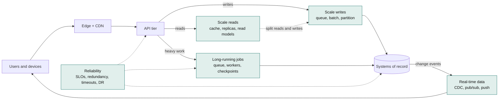

## 0.1 Scale Reads

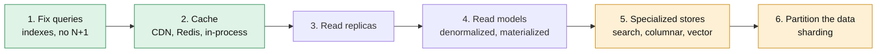

### Theory & trade-offs

Reads usually dominate, at 10:1 to 1,000:1 over writes. They are also *easier* to scale than writes, because a read can be served from a copy. **The whole discipline is deciding how stale each copy may be.** Climb the ladder from the bottom and stop as soon as the numbers work, because every rung adds staleness and operational cost.

1. **Fix the queries first.** A covering index, removing an N+1 pattern, or paginating by keyset instead of `OFFSET` routinely buys 10–100× before any architecture changes.
2. **Cache in layers:**
   - the browser or client (HTTP `Cache-Control`, `ETag`);
   - a **CDN** for static assets and cacheable API responses;
   - a **distributed cache** (Redis);
   - an **in-process cache** (an LRU with a sub-second to seconds TTL, for the hottest keys);
   - the database's own buffer pool.
3. **Read replicas** add read capacity linearly, with replication lag as the price.
4. **Denormalized read models** (CQRS projections, materialized views) precompute the answer so that a read becomes a single key lookup.
5. **Specialized stores** each answer a query shape the OLTP database is bad at: search engines for text, columnar warehouses for analytics, vector indexes for similarity.
6. **Partitioning** is the last rung, used when the dataset itself no longer fits one node's memory and I/O.

**Hit-ratio arithmetic is non-linear.** Database load is `total × (1 − hit ratio)`. Going from a 90% to a 99% hit ratio cuts database load **10×**, while going from 50% to 90% cuts it only 5×. The last few percent of hit ratio are where the money is, and they usually come from better key design, longer TTLs on immutable data, and caching negative results.

### Caching patterns

| Pattern | How it works | Strength | Weakness |
|---|---|---|---|
| **Cache-aside** | The app reads the cache. On a miss it reads the DB, then populates the cache | Simple. The cache holds only what's used | Race conditions on invalidation. The first read after expiry is slow |
| **Read-through** | The cache library loads from the DB on a miss | Loading logic lives in one place | Needs cache-side integration |
| **Write-through** | Writes go to the cache and the DB synchronously | The cache is always warm and fresh | Every write pays cache latency. Caches data nobody reads |
| **Write-behind** | Writes go to the cache, and the DB is updated asynchronously | Very fast writes | Data loss if the cache dies before the flush. **Almost never acceptable for money** |
| **Refresh-ahead** | Hot keys are refreshed before they expire | No latency spike on expiry | Wasted refreshes on keys that went cold |

**Invalidation.** Use TTL for everything, plus explicit invalidation for data that must not be stale:

- On write, **delete** the key. Don't set it: two concurrent writers can otherwise leave the older value in the cache.
- Classic cache-aside still has a race: a reader loads the old row, a writer updates the DB and deletes the key, and *then* the reader writes the stale value it loaded. Mitigations include short TTLs, versioned values (write only if the version is newer), a second delayed delete, or **leases** (the cache hands a token to the first misser and rejects sets carrying stale tokens, as Facebook's memcache paper describes).
- **CDC-driven invalidation** consumes the database's change stream and deletes affected keys, so invalidation cannot be forgotten by a code path.

**Failure modes you must design for:**

- **Cache stampede.** A hot key expires, and 5,000 concurrent requests all miss and hit the database at once. Fixes:
  - **single-flight** (request coalescing): one loader per key, and everyone else awaits it;
  - **stale-while-revalidate**: serve the stale value while one request refreshes;
  - **jittered TTLs**, so keys cached together don't expire together;
  - probabilistic early refresh.
- **Hot keys.** One key receives a large share of traffic (a celebrity profile, today's rates table) and saturates one cache shard. Fixes: an in-process tier in front, replicating the key across shards (`key#0..key#7`, choosing one at random), or pushing it to the CDN.
- **Cold start.** A cache flush or new cluster sends 100% of reads to the database. Capacity-plan the database for a *degraded hit ratio*, warm caches before shifting traffic, and shed load if needed.
- **The cache becomes a hard dependency.** Decide explicitly what happens when Redis is down: serve from the database with shedding, or fail fast.

### Python: cache-aside with single-flight, stale-while-revalidate and jitter

```python
import asyncio
import json
import random
import time
from collections.abc import Awaitable, Callable

import redis.asyncio as redis

r = redis.Redis(host="cache", decode_responses=True)
_inflight: dict[str, asyncio.Future] = {}
_background: set[asyncio.Task] = set()


async def cached(key: str, loader: Callable[[], Awaitable[dict]],
                 ttl_s: float = 60, stale_s: float = 300) -> dict:
    """Serve fresh values from cache, serve stale values while refreshing, coalesce misses."""
    raw = await r.get(key)
    if raw is not None:
        entry = json.loads(raw)
        if time.time() >= entry["fresh_until"] and key not in _inflight:
            task = asyncio.create_task(_load(key, loader, ttl_s, stale_s))   # refresh in background
            _background.add(task)
            task.add_done_callback(_background.discard)
        return entry["value"]          # fresh, or stale-but-acceptable
    return await _load(key, loader, ttl_s, stale_s)


async def _load(key: str, loader: Callable[[], Awaitable[dict]],
                ttl_s: float, stale_s: float) -> dict:
    if (pending := _inflight.get(key)) is not None:
        return await asyncio.shield(pending)   # 5,000 concurrent misses -> 1 database query
    fut: asyncio.Future = asyncio.get_running_loop().create_future()
    fut.add_done_callback(lambda f: f.cancelled() or f.exception())   # never an unretrieved error
    _inflight[key] = fut
    try:
        value = await loader()
        fresh = ttl_s * random.uniform(0.9, 1.1)   # jitter: keys cached together expire apart
        entry = {"value": value, "fresh_until": time.time() + fresh}
        await r.set(key, json.dumps(entry), ex=int(fresh + stale_s))
        fut.set_result(value)
        return value
    except Exception as exc:
        fut.set_exception(exc)
        raise
    finally:
        if not fut.done():
            fut.cancel()
        _inflight.pop(key, None)
```

Single-flight here is **per process**. With 200 pods, a stampede becomes at most 200 loads instead of 5,000, which is usually enough. For truly expensive loaders, add a short Redis `SET NX` lease so only one process fleet-wide recomputes, while the others keep serving stale values.

## 0.2 Scale Writes

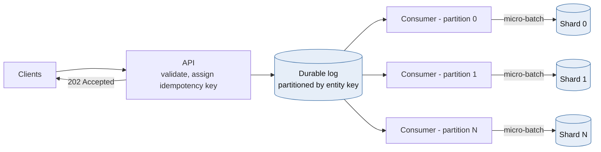

### Theory & trade-offs

Writes are harder than reads for three reasons. They must be **durable** (an fsync, a replica ack), they must be **ordered** for the same entity, and they **cannot be served from a copy**. Every technique below either makes a single write cheaper, groups writes together, or spreads them across more independent writers.

| Technique | What it buys | What it costs |
|---|---|---|
| **Cheaper writes** (fewer indexes, append instead of update-in-place, bulk `COPY`) | 2–10× on the same hardware | Slower reads for dropped indexes |
| **Batching and group commit** | Amortizes fsyncs and network round trips across many writes | Adds up to the batch window in latency |
| **Queue-based load leveling** (accept, enqueue, return `202`) | Absorbs spikes. The database runs at a steady rate | Asynchronous results. You need idempotency and a status API |
| **Partitioning** by entity key | The only way to scale one logical write stream horizontally | Cross-partition operations become sagas. Hot keys still hurt |
| **Write-optimized storage** (LSM trees such as Cassandra, ScyllaDB and RocksDB, or time-series DBs) | Sequential disk writes, very high ingest | Read amplification and compaction tuning |
| **Contention removal** (commutative appends, sharded counters) | Removes the row-lock bottleneck on hot entities | Reads must merge the pieces |
| **Mergeable data types** (CRDTs) | Multi-region writes without coordination | Only for data with natural merge semantics |

**Ordering is the hidden scalability limit.** A single global order doesn't scale, because one sequencer eventually saturates. *Per-key* order does scale. Decide which entities need ordering (an account's postings, a device's configuration) and partition by exactly that key. Everything else can be unordered.

**Hot partitions.** A skewed key (a marketplace merchant, a viral post, a single noisy tenant) concentrates writes on one partition however many you have. Options:

- **Key salting:** write to `merchant-42#0..#15` and merge on read.
- **Commutative appends** that are folded in batches.
- **Dedicated capacity** for known-huge keys.

**Queues are buffers, not capacity.** Little's Law applies: if arrivals exceed the service rate for long enough, the backlog grows without bound. Set a **maximum queue-age SLO** (for example, "p99 message age under 30 s"), autoscale consumers on queue age rather than CPU, and shed or reject at the edge when the backlog breaches the limit.

### Python: an async micro-batcher with per-item completion

```python
import asyncio
from collections.abc import Awaitable, Callable
from typing import Generic, TypeVar

T = TypeVar("T")


class MicroBatcher(Generic[T]):
    """Coalesce concurrent writes into one flush. Each caller awaits its own durability."""

    def __init__(self, flush: Callable[[list[T]], Awaitable[None]], *,
                 max_items: int = 500, max_wait_s: float = 0.010, max_pending: int = 10_000) -> None:
        self._flush, self._max_items, self._max_wait = flush, max_items, max_wait_s
        self._q: asyncio.Queue[tuple[T, asyncio.Future]] = asyncio.Queue(maxsize=max_pending)

    async def submit(self, item: T) -> None:
        fut = asyncio.get_running_loop().create_future()
        await self._q.put((item, fut))   # a full queue applies backpressure to callers
        await fut                        # returns only after the batch is durably flushed

    async def run(self) -> None:
        loop = asyncio.get_running_loop()
        while True:
            batch = [await self._q.get()]
            deadline = loop.time() + self._max_wait
            while len(batch) < self._max_items and (remaining := deadline - loop.time()) > 0:
                try:
                    batch.append(await asyncio.wait_for(self._q.get(), remaining))
                except TimeoutError:
                    break
            try:
                await self._flush([item for item, _ in batch])
            except Exception as exc:
                for _, fut in batch:
                    if not fut.done():
                        fut.set_exception(exc)
            else:
                for _, fut in batch:
                    if not fut.done():
                        fut.set_result(None)


# Usage with asyncpg. ON CONFLICT makes a retried batch harmless.
async def flush_events(rows: list[tuple]) -> None:
    async with pool.acquire() as conn:
        await conn.executemany(
            "INSERT INTO telemetry (event_id, device_id, ts, payload) VALUES ($1, $2, $3, $4) "
            "ON CONFLICT (event_id) DO NOTHING", rows)
```

The trade-off is explicit and tunable: `max_wait_s=0.010` adds up to 10 ms of latency per write and can raise throughput by an order of magnitude, because one round trip and one commit now cover up to 500 rows.

## 0.3 Split Reads and Writes

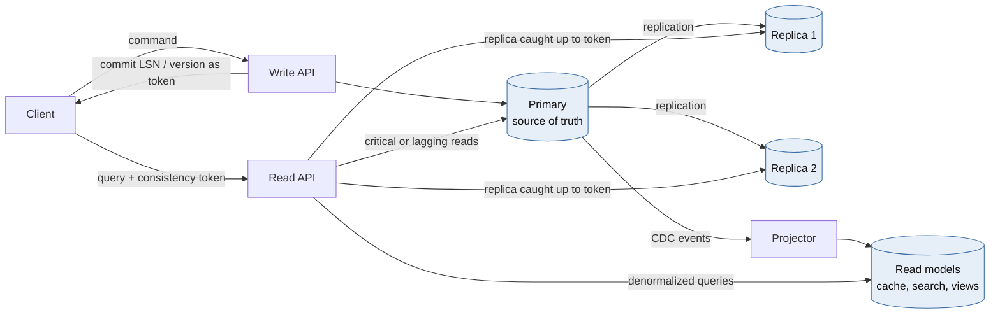

### Theory & trade-offs

Splitting reads from writes lets each side scale, be optimized, and even use different technology independently. It exists on a spectrum, and each level buys more read scale in exchange for more staleness and more moving parts:

| Level | Separation | Read staleness | Complexity |
|---|---|---|---|
| **L1** | Same database, separate command and query code paths | None | Low |
| **L2** | Primary for writes, **replicas** for reads | Replication lag (ms to s, occasionally minutes) | Medium |
| **L3** | **CQRS**: read models built from events or CDC | Projection lag | High |
| **L4** | Several read stores per query shape (search, cache, warehouse) | Varies per store | Highest |

**The anomalies you create, and their fixes:**

| Anomaly | Example | Fix |
|---|---|---|
| **Read-your-writes** | The user saves a profile, refreshes, and sees the old one | Return a **consistency token** (commit LSN or version) from the write, and read from a replica only once it has replayed past the token. Otherwise read from the primary |
| **Monotonic reads** | Two refreshes hit different replicas, and the data appears to go back in time | Pin the session to one replica, or carry the highest token seen |
| **Causal consistency** | A reply is visible before the message it answers | Carry tokens across services, or read both from the same source |

**Decide a staleness budget per endpoint**, and write it down. It turns a vague architecture debate into a routing table:

| Read | Staleness budget | Route |
|---|---|---|
| Balance used to authorize a payment | 0 | Primary only |
| Balance shown right after the user's own transfer | Read-your-writes | Replica if caught up to the token, else primary |
| Transaction history page | ≤ 5 s | Replica |
| Monthly spending insights | ≤ 1 h | Warehouse / read model |

**Where to route:**

- **In the application** (SQLAlchemy `get_bind`, Django routers; see Module 4). This is the most control, and the only place that knows staleness budgets.
- **In the driver.** PostgreSQL's libpq accepts multi-host connection strings with `target_session_attrs` values such as `read-write`, `standby` and `prefer-standby` (PostgreSQL 14+). This is good for failover, but blind to per-request budgets.
- **In a proxy** (Pgpool-II for PostgreSQL, ProxySQL for MySQL). Transparent, but the proxy can't know which reads tolerate lag.

### Python: read-your-writes routing with LSN consistency tokens

```python
import asyncio
import random

import asyncpg


def lsn_to_int(lsn: str) -> int:
    hi, lo = lsn.split("/")
    return (int(hi, 16) << 32) | int(lo, 16)


class ReplicaLagTracker:
    """Polls each replica's replay position, so routing a read costs no extra query.
    The polled value can only trail reality, which errs toward the primary (safe)."""

    def __init__(self, replicas: dict[str, asyncpg.Pool], interval_s: float = 0.1) -> None:
        self._replicas, self._interval = replicas, interval_s
        self.replayed: dict[str, int] = {name: 0 for name in replicas}

    async def run(self) -> None:
        while True:
            for name, pool in self._replicas.items():
                try:
                    async with asyncio.timeout(0.05):
                        lsn = await pool.fetchval("SELECT pg_last_wal_replay_lsn()::text")
                    self.replayed[name] = lsn_to_int(lsn) if lsn else 0
                except (TimeoutError, OSError, asyncpg.PostgresError):
                    self.replayed[name] = 0   # unreachable means "infinitely behind"
            await asyncio.sleep(self._interval)

    def pick(self, min_lsn: int) -> str | None:
        caught_up = [n for n, lsn in self.replayed.items() if lsn >= min_lsn]
        return random.choice(caught_up) if caught_up else None


async def write_then_token(primary: asyncpg.Pool, sql: str, *args) -> str:
    async with primary.acquire() as conn:
        async with conn.transaction():
            await conn.execute(sql, *args)
        # Read after COMMIT: this position is at or beyond our commit record.
        return await conn.fetchval("SELECT pg_current_wal_lsn()::text")   # send as X-Consistency-Token


async def read_with_token(primary: asyncpg.Pool, replicas: dict[str, asyncpg.Pool],
                          tracker: ReplicaLagTracker, token: str | None, sql: str, *args):
    min_lsn = lsn_to_int(token) if token else 0
    name = tracker.pick(min_lsn)
    pool = replicas[name] if name else primary
    return await pool.fetch(sql, *args)
```

The client stores the token (in a cookie or header) for a short window after its own write and echoes it on reads. Everyone else reads from replicas with no token.

## 0.4 Real-Time Data

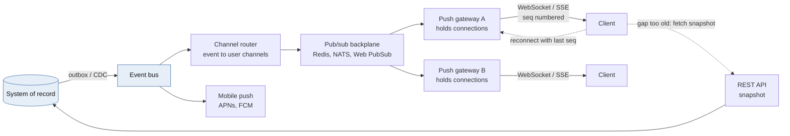

### Theory & trade-offs

Real-time data has two halves:

1. **Capturing changes** the moment they happen: an outbox table or CDC from the database (Module 1), and domain events.
2. **Delivering them** to people and systems with low latency, over push channels.

Real-time *analytics* (computing over streams, as in Module 5's fraud features) is a third, separate concern.

**Delivery channel options:**

| Channel | Direction | Latency | Strengths | Weaknesses |
|---|---|---|---|---|
| Short polling | Client pulls | Poll interval | Trivial, cache-friendly | Wasted requests. Latency equals the interval |
| Long polling | Client pulls, server holds | Low | Works everywhere | Connection churn |
| **SSE** | Server → client | Low | Plain HTTP, built-in resume via `Last-Event-ID` | One direction. Browsers limit connections on HTTP/1.1 |
| **WebSocket** | Bidirectional | Lowest | Interactive, binary | Stateful connections, harder behind proxies |
| Webhooks | Server → server | Low | Standard for partner integrations | Receiver availability, retries, signature verification |
| Mobile push (APNs/FCM) | Server → device | Seconds, best-effort | Reaches closed apps | No delivery guarantee. Payload limits |

**Principles that separate robust real-time systems from demos:**

- **The push channel is an optimization. The API is the truth.** Messages *will* be lost (a phone switching networks, a gateway restart). Every channel therefore needs **sequence numbers**. On reconnect, the client sends its last sequence number. The server either **replays** from a short buffer, or tells the client to **resync** by fetching a snapshot from the REST API and resubscribing. This is the **snapshot + delta** pattern.
- **Fan-out is its own tier.** Connection-holding gateways are stateful, so keep them thin. A pub/sub backplane routes each event only to the gateways that hold the relevant connections. Managed options such as Azure Web PubSub or SignalR Service take this tier off your hands.
- **Fan-out on write vs. on read.** For feeds, pushing each event into every follower's inbox (on write) is fast to read but expensive for accounts with millions of followers. Pulling at read time is the reverse. Hybrid designs push for normal users and pull for the huge ones.
- **Slow consumers:** use bounded per-connection buffers. Disconnect clients that can't keep up rather than buffering forever. For market data and dashboards, **conflate**: send only the latest value per key and drop intermediate ticks.
- **Critical notifications need a durable path.** WebSocket delivery is effectively at-most-once. For "your card was declined", also write to a durable inbox, and push a hint that says "go fetch".

### Python: WebSocket feed with replay, resync and heartbeats (Redis Streams)

```python
from fastapi import FastAPI, WebSocket, WebSocketDisconnect
import redis.asyncio as redis

app = FastAPI()
r = redis.Redis(host="events", decode_responses=True)


def _id_tuple(stream_id: str) -> tuple[int, int]:
    ms, seq = stream_id.split("-")
    return int(ms), int(seq)


@app.websocket("/v1/ws/accounts/{account_id}")
async def account_feed(ws: WebSocket, account_id: str, last_id: str | None = None) -> None:
    # Authenticate and authorize (this session owns account_id) BEFORE accept(). Omitted here.
    await ws.accept()
    stream = f"acct-events:{account_id}"   # capped with XADD ... MAXLEN ~ 1000
    try:
        cursor = last_id
        if cursor is not None:
            oldest = await r.xrange(stream, count=1)
            if oldest and _id_tuple(cursor) < _id_tuple(oldest[0][0]):
                await ws.send_json({"type": "resync"})   # gap too old: refetch snapshot via REST
                cursor = None
        if cursor is None:
            newest = await r.xrevrange(stream, count=1)
            cursor = newest[0][0] if newest else "0-0"   # pin a concrete position; never re-read "$"
        while True:
            resp = await r.xread({stream: cursor}, block=15_000, count=100)
            if not resp:
                await ws.send_json({"type": "ping"})   # keeps proxies from reaping idle sockets
                continue
            for _stream, entries in resp:
                for entry_id, fields in entries:
                    await ws.send_json({"type": "event", "id": entry_id, **fields})
                    cursor = entry_id
    except WebSocketDisconnect:
        return
```

**The scaling caveat, stated plainly:** one blocking `XREAD` per connection means one Redis connection per user, which is fine for thousands of users and wrong for hundreds of thousands. At scale, each gateway process subscribes *once* per channel (or per shard of channels) through a backplane, keeps a local registry of connection → channels, and fans out in memory. The replay and resync protocol stays exactly the same.

## 0.5 Reliability

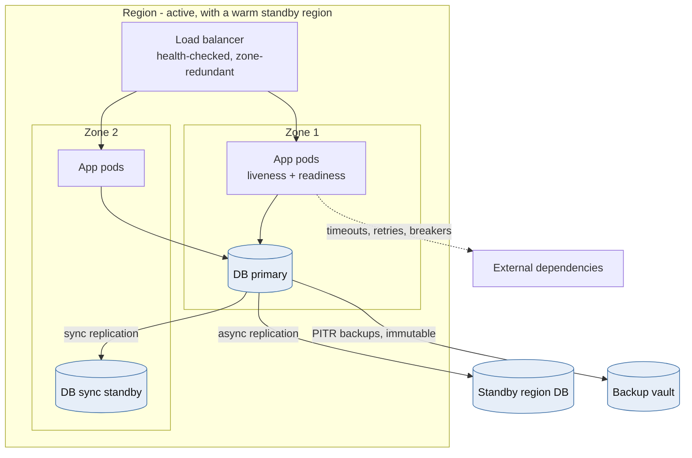

### Theory & trade-offs

Reliability means the system does what it promises, **measured from the user's point of view**. Precise vocabulary:

- **SLI:** a measured indicator, such as the fraction of balance requests served successfully in under 300 ms.
- **SLO:** the target for that indicator (99.95% over 28 days).
- **SLA:** the contractual promise, set looser than the SLO.
- **Error budget:** `1 − SLO`. A 99.95% SLO allows ~21.9 minutes of failure per month. When the budget is spent, releases slow down. When it's healthy, the team can move faster.
- **RPO / RTO:** how much data you may lose, and how long recovery may take, per failure scenario.

| Availability | Downtime per 30 days |
|---|---|
| 99% | 7.2 h |
| 99.9% | 43.2 min |
| 99.95% | 21.6 min |
| 99.99% | 4.3 min |

**Availability math:**

- **Serial dependencies multiply.** Five required dependencies at 99.9% each give at most 0.999⁵ ≈ **99.5%**.
- **Redundancy multiplies failure probabilities**, *if failures are independent*. Two independent 99% replicas give 1 − 0.01² = 99.99%.
- **Failures are rarely independent**: shared deploys, shared configuration, shared regions, shared bugs. Correlated failure is why redundancy alone disappoints.

**Techniques by failure scope:**

| Failure | Defence |
|---|---|
| Process crash, memory leak | Supervisors or Kubernetes restarts, liveness probes |
| Node loss | N+1 replicas behind a health-checked load balancer |
| Zone loss | Zone-redundant deployments and databases (synchronous standby in another zone) |
| Region loss | Warm standby or active-active across regions, with a rehearsed failover runbook |
| Slow or failing dependency | Timeouts, retries with jitter and budgets, circuit breakers, bulkheads (Module 3) |
| **Bad deploy or configuration** (the most common cause of outages) | Canary and progressive rollout, feature flags, automated rollback on SLO burn, config treated as code |
| Data corruption or human error | Point-in-time recovery, **immutable** backups, delayed replicas. Replication faithfully copies mistakes, so it is not a backup |
| Overload | Admission control, load shedding by priority, rate limits, autoscaling with headroom |

**Disaster-recovery tiers:**

| Strategy | RTO | RPO | Cost |
|---|---|---|---|
| Backup and restore | Hours to a day | Last backup (minutes with PITR) | $ |
| Pilot light (data replicated, compute off) | Tens of minutes to hours | Seconds to minutes | $$ |
| Warm standby (scaled-down live copy) | Minutes | Seconds | $$$ |
| Active-active | Near zero | Near zero (per the conflict strategy) | $$$$, plus the Module 4 conflict problems |

**Health checks done right:**

- **Liveness** asks "is this process wedged?" It should check almost nothing. Checking the database in liveness turns a database blip into a fleet-wide restart storm.
- **Readiness** asks "should this pod get traffic now?" It fails during warm-up and shutdown, and *may* check critical local dependencies.
- Beware: if readiness checks a shared database, every pod goes unready at once and the load balancer has nothing to route to. Sometimes serving a degraded response beats serving nothing.

**Proof, not hope:** run game days, chaos experiments (kill a zone, add latency to a dependency), and **restore drills**. A backup that has never been restored is a hypothesis. Monitor the four golden signals (latency, traffic, errors, saturation) and alert on **SLO burn rate**, not on CPU.

### Python: liveness vs. readiness, with warm-up and drain

```python
import asyncio
from contextlib import asynccontextmanager

from fastapi import FastAPI, Response

state = {"ready": False}


async def warm_up() -> None: ...        # open pools, load models, prime hot caches
async def close_pools() -> None: ...


@asynccontextmanager
async def lifespan(app: FastAPI):
    await warm_up()
    state["ready"] = True
    yield
    state["ready"] = False              # shutdown: stop claiming readiness
    await close_pools()


app = FastAPI(lifespan=lifespan)


@app.get("/livez")
async def livez() -> dict:
    return {"alive": True}              # never touch dependencies here


@app.get("/readyz")
async def readyz(response: Response) -> dict:
    if not state["ready"]:
        response.status_code = 503
        return {"ready": False, "reason": "starting_or_draining"}
    try:
        async with asyncio.timeout(0.3):
            await db_pool.fetchval("SELECT 1")
    except Exception:
        response.status_code = 503
        return {"ready": False, "reason": "database"}
    return {"ready": True}
```

On Kubernetes, pair this with a `preStop` hook (for example, sleeping 10 s) and a `terminationGracePeriodSeconds` longer than your slowest request. Load balancers need a few seconds to stop routing to a terminating pod. Without that delay, every deploy drops in-flight requests.

## 0.6 Long-Running Jobs

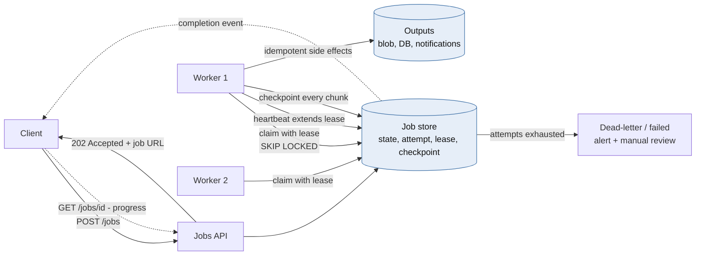

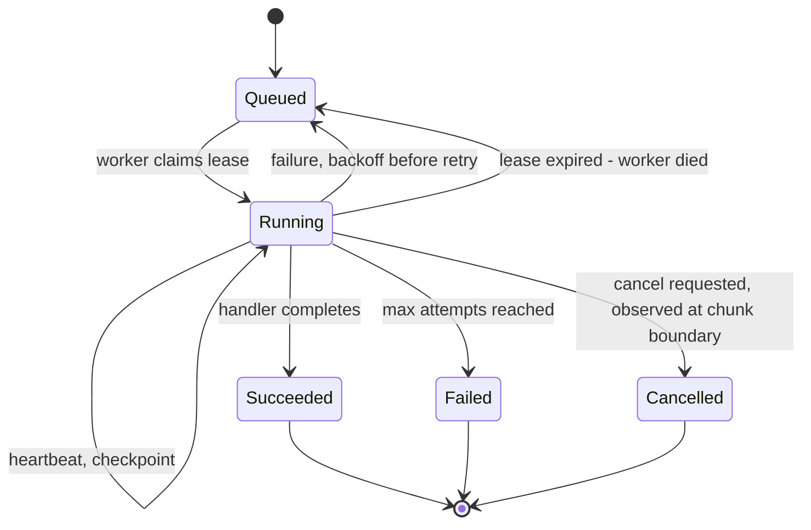

### Theory & trade-offs

Some work doesn't fit in a request: generating 3M statements, exporting a customer's data, re-embedding a corpus, reconciling a day's transactions, running a migration backfill. **Long-running jobs outlive the processes that run them.** Deploys, crashes, autoscaling and spot or preemptible eviction all interrupt them. The design goal is that **any job can be interrupted at any moment and resume correctly**.

**The API contract: asynchronous request–reply.**

1. `POST /jobs` returns **`202 Accepted`** with a `Location: /jobs/{id}` header. It accepts an idempotency key, so a retried submit doesn't start two jobs.
2. The client polls `GET /jobs/{id}` (state, progress, result link) or receives a webhook, SSE event or email on completion.
3. `POST /jobs/{id}/cancel` requests cooperative cancellation.

**Execution models:**

| Model | Examples | Best for | Watch out for |
|---|---|---|---|
| **Task queue + workers** | Celery, RQ, Dramatiq, Azure Queue Storage / Service Bus + workers | Many short-to-medium independent tasks | Visibility timeouts, duplicate delivery, no built-in multi-step state |
| **Database-backed queue** | PostgreSQL `FOR UPDATE SKIP LOCKED` | Moderate volume with transactional enqueue (same database as your data) | Polling load, table bloat at very high volume |
| **Batch compute** | Kubernetes Jobs, Azure Batch, AWS Batch | Large parallel compute (rendering, ML, simulations) | Scheduling latency, cost of idle capacity |
| **Durable workflow engines** | Temporal, Azure Durable Functions, AWS Step Functions | Multi-step processes lasting minutes to months, with retries, timers, human steps and compensations | A new programming model with determinism rules for workflow code |
| **Data pipeline orchestrators** | Airflow, Azure Data Factory, Dagster | Scheduled DAGs of data tasks | Not built for per-user, on-demand jobs |

**The mechanics that make jobs survivable:**

- **Leases and heartbeats.** A worker claims a job with a time-limited lease and extends it periodically. If the worker dies, the lease expires and another worker picks the job up. Lease length trades recovery speed (short leases) against false expiry during GC pauses or slow chunks (long leases).
- **Fencing by attempt number.** When a lease expires and a new worker claims the job, the attempt counter increments. Every heartbeat, checkpoint and completion write includes `attempt = :mine`. A stale worker that wakes up can no longer write. This is the same fencing idea as Module 1.
- **Checkpointing.** Persist a cursor (last processed ID, file offset, page token) after each chunk, so a restart resumes instead of starting over. Checkpoint frequency trades re-done work against write overhead.
- **Idempotent chunks.** After a crash, at most the last chunk runs twice, so every side effect must tolerate repetition: deterministic output object keys, upserts, dedupe keys on notifications.
- **Chunking and fan-out.** Split big jobs into many small tasks (map), track completion (a counter or a barrier), then aggregate (reduce). Small tasks retry cheaply and parallelize.
- **Cancellation is cooperative.** Check a flag at chunk boundaries. Forcibly killing work mid-chunk leaves partial side effects.
- **Timeouts and poison jobs.** Cap attempts, retry with exponential backoff, and move exhausted jobs to a dead-letter state with an alert. One bad input must not block the queue forever.
- **Fairness and downstream protection.** Use per-tenant concurrency limits so one customer's 1M-row export doesn't starve everyone else, and global concurrency caps that respect the capacity of the databases and APIs the jobs call.
- **Graceful shutdown.** On `SIGTERM`, stop claiming, finish or checkpoint the current chunk, and release the lease. Set the orchestrator's grace period to cover one chunk.

**A Celery-specific trap:** with Redis or SQS brokers, a task still running when the broker's **visibility timeout** expires is redelivered to another worker, and you now have two copies running. Set the visibility timeout above the longest task runtime, use `acks_late=True`, and keep tasks short by chunking.

### Python: a PostgreSQL-backed job runner with leases, fencing and checkpoints

```sql
CREATE TABLE jobs (
    id               uuid PRIMARY KEY,
    kind             text        NOT NULL,
    payload          jsonb       NOT NULL,
    state            text        NOT NULL DEFAULT 'queued',  -- queued|running|succeeded|failed|cancelled
    attempt          int         NOT NULL DEFAULT 0,
    max_attempts     int         NOT NULL DEFAULT 5,
    lease_owner      text,
    lease_until      timestamptz,
    checkpoint       jsonb,
    progress         real        NOT NULL DEFAULT 0,
    cancel_requested boolean     NOT NULL DEFAULT false,
    run_after        timestamptz NOT NULL DEFAULT now(),
    last_error       text,
    created_at       timestamptz NOT NULL DEFAULT now()
);
CREATE INDEX jobs_claimable ON jobs (run_after) WHERE state IN ('queued', 'running');
```

```python
import asyncio
import json

import asyncpg

CLAIM = """
UPDATE jobs SET state = 'running', attempt = attempt + 1, lease_owner = $1,
       lease_until = now() + make_interval(secs => $2::float8)
 WHERE id = (SELECT id FROM jobs
              WHERE run_after <= now() AND attempt < max_attempts
                AND (state = 'queued' OR (state = 'running' AND lease_until < now()))
              ORDER BY run_after
              FOR UPDATE SKIP LOCKED
              LIMIT 1)
RETURNING id, kind, payload, attempt, checkpoint"""

# Every write below is fenced by (id, lease_owner, attempt): a stale worker matches zero rows.
HEARTBEAT = """UPDATE jobs SET lease_until = now() + make_interval(secs => $4::float8)
                WHERE id = $1 AND lease_owner = $2 AND attempt = $3 AND state = 'running'
            RETURNING cancel_requested"""
CHECKPOINT = """UPDATE jobs SET checkpoint = $4::jsonb, progress = $5
                 WHERE id = $1 AND lease_owner = $2 AND attempt = $3 AND state = 'running'"""
FINISH = """UPDATE jobs SET state = $4, progress = CASE WHEN $4 = 'succeeded' THEN 1 ELSE progress END,
                   lease_owner = NULL
             WHERE id = $1 AND lease_owner = $2 AND attempt = $3"""
RETRY_OR_FAIL = """UPDATE jobs SET state = CASE WHEN attempt >= max_attempts THEN 'failed' ELSE 'queued' END,
                          run_after = now() + make_interval(secs => least(3600, 30 * power(2, attempt))),
                          last_error = $4, lease_owner = NULL
                    WHERE id = $1 AND lease_owner = $2 AND attempt = $3"""


class LeaseLost(Exception):
    pass


async def run_one(pool: asyncpg.Pool, handlers: dict, worker_id: str, lease_s: float = 60) -> bool:
    job = await pool.fetchrow(CLAIM, worker_id, lease_s)
    if job is None:
        return False
    fence = (job["id"], worker_id, job["attempt"])
    cancel = asyncio.Event()

    async def heartbeat() -> None:
        while True:
            await asyncio.sleep(lease_s / 3)
            row = await pool.fetchrow(HEARTBEAT, *fence, lease_s)
            if row is None:
                raise LeaseLost(job["id"])       # someone else owns it now
            if row["cancel_requested"]:
                cancel.set()

    async def save(checkpoint: dict, progress: float) -> None:
        if await pool.execute(CHECKPOINT, *fence, json.dumps(checkpoint), progress) == "UPDATE 0":
            raise LeaseLost(job["id"])

    checkpoint = json.loads(job["checkpoint"]) if job["checkpoint"] else None
    try:
        async with asyncio.TaskGroup() as tg:
            hb = tg.create_task(heartbeat())
            outcome = await handlers[job["kind"]](json.loads(job["payload"]), checkpoint, save, cancel)
            hb.cancel()
    except ExceptionGroup as eg:
        if eg.subgroup(LeaseLost) is None:
            await pool.execute(RETRY_OR_FAIL, *fence, repr(eg.exceptions[0])[:2000])
        return True                              # on LeaseLost: stop quietly, touch nothing
    await pool.execute(FINISH, *fence, outcome)  # 'succeeded' or 'cancelled'
    return True


async def generate_statements(payload: dict, checkpoint: dict | None, save, cancel: asyncio.Event) -> str:
    """Example handler: resumable, chunked, idempotent (object key = account + cycle)."""
    cursor = (checkpoint or {}).get("after_account", "")
    done = (checkpoint or {}).get("done", 0)
    while not cancel.is_set():
        batch = await fetch_account_ids(payload["cycle"], after=cursor, limit=500)
        if not batch:
            return "succeeded"
        for account_id in batch:
            await render_and_store_statement(account_id, payload["cycle"])   # overwrite-safe
        cursor, done = batch[-1], done + len(batch)
        await save({"after_account": cursor, "done": done}, min(done / payload["expected"], 0.99))
    return "cancelled"
```

Operational notes:

- A small **reaper** marks jobs as `failed` when their lease expired *and* attempts are exhausted, because the claim query skips them.
- Run the reaper and `run_one` in a loop with backoff when the queue is empty. Use `LISTEN/NOTIFY` to wake idle workers instead of tight polling.
- **Choosing a model:** past roughly thousands of jobs per second, or once jobs become multi-step with timers and human approvals, move to a dedicated broker or a durable workflow engine (Temporal or Durable Functions). The lease, fence and checkpoint principles carry over unchanged.

## 0.7 Case Study: A Digital Bank's Mobile Backend, Using All Six

**Scenario:** a Canadian digital bank with 3M customers. The morning peak is 5,000 account-summary reads/s and 800 transfers/s. Customers expect instant balance updates and push notifications. Monthly statements must be generated for every account. SLOs are 99.95% for login and balance and 99.9% for statements and exports.

| Concern | Decision | Why | Trade-off accepted |
|---|---|---|---|
| **Scale reads** | Account summaries served from a Redis read model (single-flight, jittered TTLs). Transaction history from replicas | 5,000 reads/s at a 95% hit ratio leaves 250/s for the database | Summaries can be seconds stale, which is labelled "as of" in the app |
| **Split reads and writes** | Staleness budgets per endpoint. Authorization reads the primary. The post-transfer view uses a consistency token | Correctness where money moves, scale everywhere else | Routing logic in the application, and token plumbing |
| **Scale writes** | Ledger partitioned by account (Module 1). Card-network notifications are accepted into a log and applied in micro-batches | 800 TPS sustained with 5× burst headroom | Asynchronous status for some operations |
| **Real-time data** | Outbox → event bus → push gateways (WebSocket) with sequence numbers and snapshot resync. Mobile push for critical alerts, plus a durable in-app inbox | Instant UX without making the socket the source of truth | A resync path must be built and tested |
| **Reliability** | Zone-redundant everything, a warm standby region, canary deploys gated on SLO burn, restore drills quarterly | Most outages are deploys and dependencies, not hardware | Standby cost. Slower but safer releases |
| **Long-running jobs** | Statement generation as a fan-out of 500-account chunks with leases, checkpoints and idempotent PDF keys | 3M statements × ~200 ms ≈ 167 CPU-hours, so ~50 four-core workers finish in under an hour | A job platform to operate |

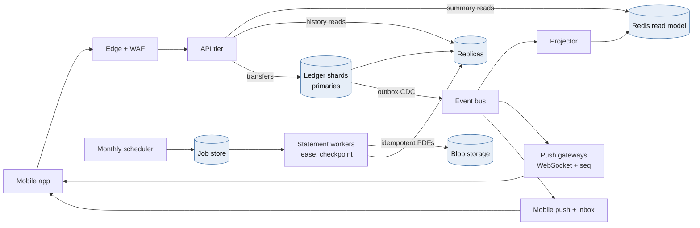

## 0.8 Animation Blueprints

### A. Cache stampede, then single-flight

**Scene setup:** 30 small request dots on the left, a cache box in the middle (a key tile `rates:today` with a draining TTL bar), a database box on the right with a **load gauge**, and a latency meter at the bottom.

| Time | Beat | Visual | Manim primitives |
|---|---|---|---|
| 0:00–0:04 | Warm cache | Dots bounce off the cache tile and return green. The database gauge stays near zero | `MoveAlongPath`, `Indicate(tile)` |
| 0:04–0:07 | TTL expires | The TTL bar hits zero and the tile greys out | `ValueTracker` driving a `Rectangle` width |
| 0:07–0:12 | **Stampede** | All 30 dots miss at once and stream to the database. The gauge swings into red, the latency meter spikes, and some dots turn red (timeouts) | `LaggedStart` of 30 arrows, `Rotate(needle)` |
| 0:12–0:14 | Rewind | Rewind to 0:04. Caption: *Same traffic, single-flight + stale-while-revalidate* | `Restore` |
| 0:14–0:20 | **Coalesced** | On expiry the tile turns amber (*stale*). One dot goes to the database while the other 29 are served the stale value immediately. The gauge barely moves | One `GrowArrow` to the DB, 29 short bounces |
| 0:20–0:23 | Refresh lands | The single loader returns, the tile turns green with a new, slightly jittered TTL. Neighbouring keys show different TTL bar lengths | `Transform`, varied bar widths |
| 0:23–0:26 | Recap | *One loader per key. Serve stale while refreshing. Jitter expiries* | `Write` |

### B. A long-running job survives a crash

**Scene setup:** a horizontal progress track of 20 chunks, a job card (`attempt 1`, `lease` ring, `checkpoint: —`), two workers (W1, W2), and an output bucket.

| Time | Beat | Visual | Manim primitives |
|---|---|---|---|
| 0:00–0:05 | Claim and run | W1 claims the job. The lease ring starts, and chunks light up one by one while PDFs drop into the bucket | `FadeIn`, `LaggedStart` |
| 0:05–0:08 | Heartbeat and checkpoint | After every chunk, a checkpoint tag moves along the track (`after_account=…`). The lease ring refills on each heartbeat | `MoveToTarget(tag)`, ring refill |
| 0:08–0:10 | **Crash** | W1 is struck by a lightning bolt mid-chunk 9. The heartbeat stops and the lease ring drains | `Create(bolt)`, `FadeToColor(GREY)` |
| 0:10–0:14 | Reclaim | The lease hits zero. W2 claims the job and the card shows `attempt 2`. W2 **starts from the checkpoint after chunk 8**, not from zero. Chunk 9 is redone, and its PDF overwrites the identical object in the bucket (*idempotent*) | `Transform(card)`, `Indicate(chunk9)` |
| 0:14–0:18 | Zombie write | W1 recovers and tries to write a checkpoint stamped `attempt 1`. It bounces off the job card: *0 rows updated, fenced* | Red `Flash`, the arrow shatters |
| 0:18–0:22 | Complete | W2 finishes chunk 20. The card turns green: *succeeded, 1 chunk re-done out of 20* | `Circumscribe` |

## 0.9 Staff-level Review Questions

- For each endpoint, what is the written staleness budget, and which store serves it?
- What happens to database load at a 50% cache hit ratio (after a flush), and can the database survive it?
- Which entity defines write ordering, and what happens when one key receives 100× the average traffic?
- If a push message is lost, how does the client find out, and how does it recover?
- Which failure scenario has the longest untested recovery path, and when was the last restore drill?
- Can every long-running job be killed at any instant and resume correctly? What proves it?

---

# Module 1 — High-Throughput & Financial Systems

*Industry: Banking & Fintech*

## 1.1 Core Theory & Trade-offs

### Event Sourcing

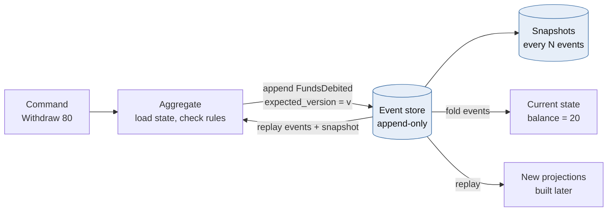

In a CRUD system the database stores *current state*. In an event-sourced system the database stores *facts that happened*, and state is derived from them:

```
state(t) = fold(apply, events[0..t], initial_state)
```

A ledger is the canonical case. A bank does not "update a balance". It records `FundsDebited` and `FundsCredited` postings, and the balance is the sum of those postings. Double-entry bookkeeping is event sourcing, invented about 500 years before Kafka.

| Benefit | Cost |
|---|---|
| Complete, tamper-evident audit trail (regulators love it) | Events are immutable forever, so **schema evolution is permanent**. You need upcasters for every historical version |
| Temporal queries ("balance as of 2025-03-31 23:59:59 ET") | Rebuild time grows linearly. You need snapshots every N events per aggregate |
| New read models can be built later by replaying history | The right to erasure conflicts with immutability. Use **crypto-shredding** (encrypt PII per data subject, delete the key) |
| Debugging by replay | Every query needs a projection. "Just add a WHERE clause" goes away |
| Natural fit for the outbox and CDC | Event design *is* public API design. Bad event granularity is expensive to undo |

**Concurrency on streams.** Appends use optimistic concurrency: `append(stream_id, events, expected_version=v)`. If another writer appended first, the append fails and the command is retried against fresh state. This is a compare-and-swap on the stream head, and it is the core of how event stores (EventStoreDB, Marten, or a Postgres table with a `UNIQUE(stream_id, version)` constraint) avoid lost updates.

**A pragmatic note.** Most production ledgers are *event-sourcing-lite*: an append-only `postings` table (the events) plus a materialized `accounts.balance` column that is updated in the same ACID transaction. The balance is a cached projection that is *transactionally consistent* with the log. You keep the audit and replay benefits without a separate event store or eventually consistent balances on the hot path.

### CQRS (Command Query Responsibility Segregation)

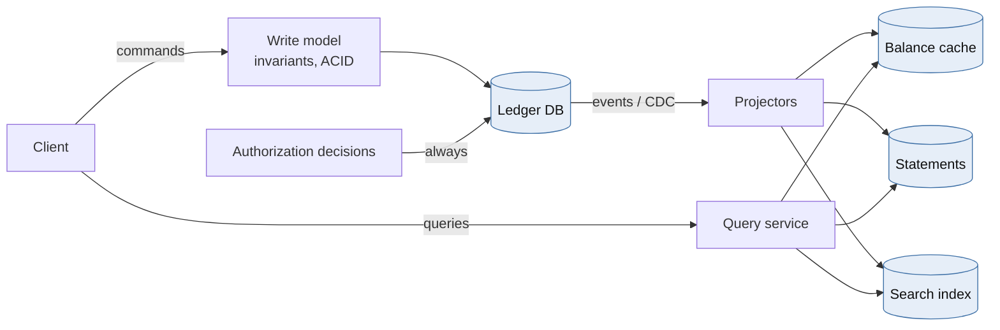

CQRS separates the **write model**, which is optimized for enforcing invariants (normalized, small, strongly consistent), from one or more **read models**, which are optimized for specific queries (denormalized, possibly in different stores such as Redis, Elasticsearch or a columnar warehouse).

Trade-offs a Principal must be explicit about:

- **Projection lag creates read-your-writes anomalies.** A user transfers money, refreshes, and sees the old balance. Three standard fixes:
  1. The command returns a **consistency token** (the ledger version or commit LSN). The query path waits, with a bounded timeout, until the projection's `applied_version >= token`, then falls back to the write model.
  2. The author's immediate view reads from the write model. Everyone else reads projections.
  3. The UI renders the optimistic result from the command response.
- **The operational surface roughly doubles.** You now run projectors, projection rebuilds, dead-letter handling and schema versioning for each read model.
- **Hard rule for money:** *authorization decisions read the write model, never a projection.* A projection that is 200 ms stale is fine for a statement page and dangerous for approving a withdrawal.
- **When not to use it:** CRUD-shaped domains where reads and writes are symmetric. CQRS in a settings service is architecture tax with no return.

### ACID vs. BASE

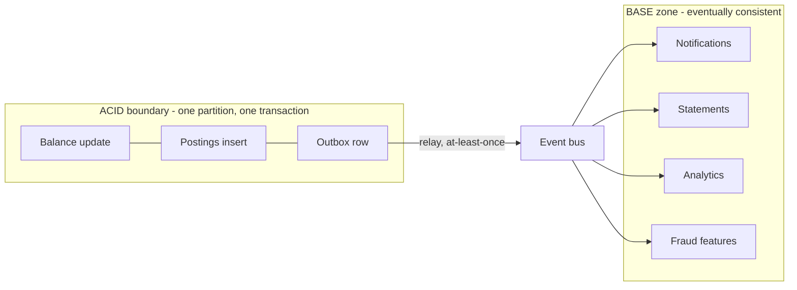

| | ACID | BASE |
|---|---|---|
| Promise | Atomicity, Consistency (invariants), Isolation, Durability | Basically Available, Soft state, Eventually consistent |
| Scaling unit | A partition or shard | The whole cluster |
| Failure behavior | Rejects or blocks to preserve invariants | Accepts and reconciles later |
| Ledger use | Balance mutation, posting creation | Notifications, statements, analytics, fraud features, search |

Real financial systems are **hybrid**. There is an ACID core *per partition* and BASE everywhere downstream. The design skill is drawing that boundary precisely.

**Isolation levels are where double-spends actually hide.** In PostgreSQL's default `READ COMMITTED`:

- **Unsafe:** `SELECT balance ...` in the application, check `balance >= amount`, then `UPDATE accounts SET balance = :new`. Two concurrent transactions both read 100, both pass the check, and both write 20. That is a classic lost update.
- **Safe:** `UPDATE accounts SET balance = balance - :amt WHERE id = :id AND balance >= :amt`. The row lock serializes writers, and PostgreSQL *re-evaluates the WHERE clause against the latest committed row version* after acquiring the lock. The second writer sees 20, fails the predicate, and updates zero rows.
- **Also safe:** `SELECT ... FOR UPDATE` before checking.
- **Write skew:** under snapshot isolation (`REPEATABLE READ` in PostgreSQL), two transactions can each read a *different* row, check a combined invariant ("joint accounts A+B must stay ≥ 0"), and both commit. Only `SERIALIZABLE` (SSI) or explicit locking of *every row in the invariant* prevents this.

**Distributed transactions across services:**

| | Two-Phase Commit (2PC/XA) | Saga |
|---|---|---|
| Atomicity | Real atomic commit | Semantic: forward steps plus compensations |
| Isolation | Locks held across participants | None. Intermediate states are visible, so you need "pending/hold" states |
| Failure mode | Coordinator crash leaves participants **blocked** holding locks | Compensation can fail too, so it must be idempotent and retried |
| Latency | Two round trips plus lock hold time | Asynchronous steps |
| Fit | A single database cluster's internal commit (Spanner, CockroachDB) | Cross-service and cross-bank money movement |

### Idempotency in Distributed Transactions

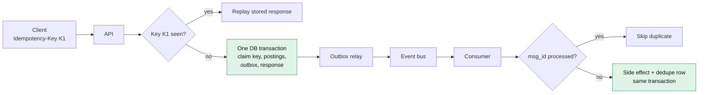

Delivery semantics are **at-most-once** (may lose), **at-least-once** (may duplicate) or **exactly-once**. End-to-end exactly-once *delivery* is impossible over an unreliable network. Kafka's exactly-once semantics covers read-process-write loops that stay *inside Kafka*. Once a side effect leaves Kafka (a database write, an ACH file, an email), you are back to at-least-once.

**Effectively-once = at-least-once delivery + an idempotent handler + a dedupe record committed in the same transaction as the side effect.**

Idempotency-key design for a payments API:

- **Client-generated** UUID per *logical* operation, scoped per client (`UNIQUE(client_id, key)`).
- **Request fingerprint** (a hash of the canonical body) stored with the key. If the same key arrives with a different payload, return `422`. This catches client bugs that would otherwise silently return the wrong cached response.
- **Stored response** replayed byte-for-byte on retries.
- **Retention** longer than the client's maximum retry horizon (typically 24 hours to 7 days).
- **Deterministic business failures** (insufficient funds) should usually be *persisted and replayed* too. Otherwise a retry after a deposit could succeed, and the client's "same request" now has two different outcomes.
- **The outbox pattern:** write the domain event into an `outbox` table *in the same transaction* as the postings. A relay (Debezium CDC reading the WAL, or a poller) publishes it. This removes the dual-write problem where the database commit succeeds but the Kafka publish fails.

## 1.2 Python in Practice: Idempotent Consumers, Celery/FastAPI, and Redis Locks

### A Principal-level stance on Redlock

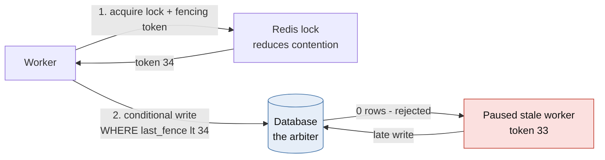

Redlock acquires a lock with a TTL on a majority of N independent Redis masters (typically 5) and treats it as valid for `TTL - elapsed - clock_drift`. The well-known critique (Martin Kleppmann, 2016, with a rebuttal from Salvatore Sanfilippo) is:

- **Process pauses** (GC, VM live-migration, page faults) can outlast the TTL. The holder wakes up believing it still holds a lock that has already been granted to someone else.
- **No fencing token.** The protected resource cannot distinguish a stale holder from the current one.
- **Timing assumptions.** Safety depends on bounded clock drift and bounded network delay.
- A *single* Redis with async replication can lose a lock on failover.

**Pragmatic position:** use a Redis lock for **efficiency** (avoid thundering herds on a hot account, stop workers from piling up and hogging database connections, reduce deadlocks). Enforce **correctness** at the database with a conditional write that includes a **fencing token** or version. If the lock fails, you get extra retries, never a double-spend.

### FastAPI: an idempotent transfer endpoint

```python
from __future__ import annotations

import hashlib
import json
import uuid
from decimal import Decimal
from typing import Annotated

from fastapi import FastAPI, Header, HTTPException
from pydantic import BaseModel, Field
from sqlalchemy import text
from sqlalchemy.ext.asyncio import async_sessionmaker, create_async_engine

engine = create_async_engine("postgresql+asyncpg://ledger@ledger-db/ledger", pool_size=20)
Session = async_sessionmaker(engine, expire_on_commit=False)
app = FastAPI()


class TransferIn(BaseModel):
    source: uuid.UUID
    dest: uuid.UUID
    amount: Decimal = Field(gt=0, max_digits=18, decimal_places=2)  # never float for money
    currency: str = Field(pattern=r"^[A-Z]{3}$")


def fingerprint(body: TransferIn) -> str:
    return hashlib.sha256(body.model_dump_json().encode()).hexdigest()


@app.post("/v1/transfers", status_code=201)
async def create_transfer(
    body: TransferIn,
    idempotency_key: Annotated[uuid.UUID, Header()],
    client_id: Annotated[str, Header(alias="X-Client-Id")],
) -> dict:
    fp = fingerprint(body)
    params = {"c": client_id, "k": idempotency_key}
    async with Session() as s, s.begin():
        # 1. Claim the key. The UNIQUE(client_id, key) constraint is the real guard.
        #    A concurrent duplicate blocks here on the unique index until we commit,
        #    then hits the conflict and replays our stored response.
        claimed = await s.execute(
            text("""INSERT INTO idempotency_keys (client_id, key, fingerprint)
                    VALUES (:c, :k, :fp) ON CONFLICT (client_id, key) DO NOTHING
                    RETURNING key"""),
            {**params, "fp": fp},
        )
        if claimed.first() is None:
            row = (await s.execute(
                text("SELECT fingerprint, response FROM idempotency_keys "
                     "WHERE client_id = :c AND key = :k"), params)).one()
            if row.fingerprint != fp:
                raise HTTPException(422, "Idempotency-Key reused with a different payload")
            return row.response  # byte-identical replay

        # 2. Lock both accounts in canonical (sorted) order. This prevents the
        #    A->B / B->A deadlock between concurrent transfers.
        ids = sorted([body.source, body.dest])
        rows = (await s.execute(
            text("SELECT id, balance, currency FROM accounts "
                 "WHERE id = ANY(:ids) ORDER BY id FOR UPDATE"), {"ids": ids})).all()
        accts = {r.id: r for r in rows}
        if len(accts) != 2 or any(a.currency != body.currency for a in accts.values()):
            raise HTTPException(404, "Account not found or currency mismatch")
        if accts[body.source].balance < body.amount:
            # Simplification: rolling back also releases the key. Many PSPs instead
            # persist the 409 so that retries replay the same decision.
            raise HTTPException(409, "Insufficient funds")

        # 3. Mutate balance, append postings (the events), write the outbox. One transaction.
        tx_id = uuid.uuid4()
        amt = {"amt": body.amount}
        await s.execute(text("UPDATE accounts SET balance = balance - :amt, version = version + 1 "
                             "WHERE id = :id"), {**amt, "id": body.source})
        await s.execute(text("UPDATE accounts SET balance = balance + :amt, version = version + 1 "
                             "WHERE id = :id"), {**amt, "id": body.dest})
        await s.execute(
            text("INSERT INTO postings (tx_id, account_id, amount) "
                 "VALUES (:t, :src, -:amt), (:t, :dst, :amt)"),
            {"t": tx_id, "src": body.source, "dst": body.dest, **amt})
        response = {"tx_id": str(tx_id), "status": "completed"}
        await s.execute(
            text("INSERT INTO outbox (aggregate_id, event_type, payload) "
                 "VALUES (:t, 'TransferCompleted', CAST(:p AS jsonb))"),
            {"t": tx_id, "p": body.model_dump_json()})
        await s.execute(
            text("UPDATE idempotency_keys SET response = CAST(:r AS jsonb) "
                 "WHERE client_id = :c AND key = :k"),
            {**params, "r": json.dumps(response)})
        return response
```

Design notes:

- The key claim, invariant check, postings, outbox and stored response all commit **atomically**. There is no window in which money moved but the key is unrecorded.
- Because everything is in one transaction, an explicit `in_progress` state is unnecessary. You need one when the operation spans *external* calls (for example, a card network authorization). In that case you persist `in_progress`, return `409 Retry-After` to duplicates, and run a recovery sweeper for stuck keys.
- Add a `CHECK (balance >= 0)` constraint on accounts that cannot go negative. It is a last line of defense that costs nothing.

### Celery: an idempotent consumer with a fenced lock

```python
import secrets
from contextlib import contextmanager
from collections.abc import Iterator

import redis
from celery import Celery
from sqlalchemy import create_engine, text

app = Celery("ledger", broker="redis://redis:6379/0")
app.conf.update(
    task_acks_late=True,               # ack only after the task body finishes
    task_reject_on_worker_lost=True,   # redeliver if the worker process dies mid-task
    worker_prefetch_multiplier=1,      # don't hoard messages on a busy worker
    broker_transport_options={"visibility_timeout": 3600},  # Redis broker redelivers after this
)
db = create_engine("postgresql+psycopg://ledger@ledger-db/ledger", pool_size=10)
r = redis.Redis(host="redis", decode_responses=True)

# Acquire and issue the fencing token ATOMICALLY. If INCR ran as a separate call,
# a paused holder could wake up and draw a *higher* token than the current holder.
ACQUIRE = r.register_script("""
if redis.call('SET', KEYS[1], ARGV[1], 'NX', 'PX', ARGV[2]) then
  return redis.call('INCR', KEYS[2])
end
return 0
""")
RELEASE = r.register_script("""
if redis.call('GET', KEYS[1]) == ARGV[1] then return redis.call('DEL', KEYS[1]) end
return 0
""")


class LockBusy(Exception): ...
class StaleFence(Exception): ...


@contextmanager
def fenced_lock(resource: str, ttl_ms: int = 2_000) -> Iterator[int]:
    owner = secrets.token_hex(16)
    keys = [f"lock:{resource}", f"fence:{resource}"]
    token = int(ACQUIRE(keys=keys, args=[owner, ttl_ms]))
    if token == 0:
        raise LockBusy(resource)
    try:
        yield token
    finally:
        RELEASE(keys=keys[:1], args=[owner])  # only delete the lock if we still own it


@app.task(bind=True, autoretry_for=(LockBusy, StaleFence),
          retry_backoff=True, retry_jitter=True, max_retries=8)
def apply_debit(self, msg_id: str, account_id: str, amount_minor: int) -> str:
    with fenced_lock(f"acct:{account_id}") as fence, db.begin() as conn:
        # Dedupe record and side effect share one transaction: effectively-once.
        fresh = conn.execute(
            text("INSERT INTO processed_messages (msg_id) VALUES (:m) "
                 "ON CONFLICT DO NOTHING RETURNING msg_id"), {"m": msg_id}).first()
        if fresh is None:
            return "duplicate"

        # The database is the arbiter. The write applies only if our fence is newer
        # than the last fence that touched this row AND the invariant holds.
        ok = conn.execute(
            text("""UPDATE accounts
                       SET balance_minor = balance_minor - :a, last_fence = :f
                     WHERE id = :id AND last_fence < :f AND balance_minor >= :a
                 RETURNING balance_minor"""),
            {"a": amount_minor, "f": fence, "id": account_id}).first()
        if ok is None:
            current = conn.execute(text("SELECT last_fence FROM accounts WHERE id = :id"),
                                   {"id": account_id}).scalar_one()
            if current >= fence:
                raise StaleFence(account_id)   # rollback (dedupe row too) and retry
            conn.execute(text("INSERT INTO rejections (msg_id, reason) "
                              "VALUES (:m, 'insufficient_funds')"), {"m": msg_id})
            return "insufficient_funds"         # terminal, recorded, commits
        return "applied"
```

**Honest caveats:**

- A Redis `INCR` counter can itself go backwards after an async-replica failover. The strongest variant draws the fence from the database (a sequence, or the row's own `version`), which reduces the scheme to plain optimistic concurrency. The Redis lock then remains purely a contention reducer.
- If every write already goes through `UPDATE ... WHERE balance >= :a` inside a transaction, *correctness does not need the Redis lock at all*. You add it when hot-row contention exhausts connection pools, or when the critical section includes non-database work you want to serialize.
- Money uses **integer minor units** or `Decimal`. Never `float`.

## 1.3 Case Study: A 10,000 TPS Ledger with Zero Double-Spend

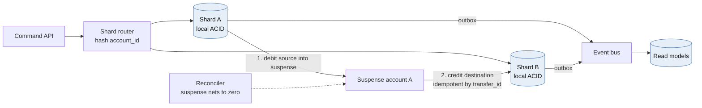

**Requirements:** 10k TPS sustained, 30k TPS peak (payroll days, Black Friday). p99 authorization latency under 150 ms. RPO = 0 within a region and RTO under 60 s. Zero double-spend. Seven-year audit retention with immutability.

### Capacity math

| Quantity | Estimate |
|---|---|
| Postings per second | 10k tx/s × 2 postings = 20k rows/s (60k at peak) |
| Hot-path write volume | ~500 B per posting including index overhead → ~10 MB/s |
| Daily growth | 864M transactions/day → roughly 0.8–1 TB/day of postings and events |
| Seven-year retention | Petabyte scale, so tier it: 90 days hot in OLTP, older data as Parquet in ADLS Gen2 (S3/GCS) with WORM immutability policies |
| Single-primary ceiling | A well-tuned PostgreSQL primary with synchronous standby and group commit can sustain thousands to low tens of thousands of short write transactions per second. At 30k peak with two-row locks per transaction, there is **no headroom**, and hot rows cap you well below hardware limits |

**Conclusion:** partition the write path by account.

### Architecture decisions

**Partitioning.** Hash account IDs into N ledger shards (start with 32 logical shards mapped onto fewer physical servers, so you can split later without rehashing). An intra-shard transfer is one local ACID transaction. A cross-shard transfer becomes a **saga**: debit the source into a per-shard *suspense* (in-flight) account, then credit the destination. Both steps are idempotent by `transfer_id`, and a reconciler asserts that every suspense account nets to zero.

**Three ways to serialize writes per account:**

| Option | How | Pros | Cons |
|---|---|---|---|
| **A. Row locks per shard** (the code above) | `FOR UPDATE` / conditional `UPDATE` in PostgreSQL | Familiar, strongly consistent, easy to audit | Hot-row contention. Deadlock discipline needed |
| **B. Single writer per partition** (LMAX / actor style) | Commands keyed by `account_id` into Kafka/Event Hubs partitions. One consumer per partition keeps balances in memory and writes in batches | No locks, very high throughput, deterministic ordering | Rebalancing pauses. The in-memory state must be rebuilt from a snapshot plus log. Harder to operate |
| **C. Distributed SQL** | Spanner, CockroachDB, YugabyteDB (Raft per range) | Global serializability, automatic resharding | Cross-range transactions pay consensus RTT. Vendor coupling. Cost |

Most regulated banks choose **A**, moving to **B** for the highest-volume flows. Purpose-built ledgers (for example TigerBeetle) take B to its extreme.

**Hot accounts.** A marketplace settlement account may receive 2,000 credits/s. Row locks serialize them at maybe 1–3k/s, and every other transfer touching that row queues behind them. Two fixes:

- **Credits are commutative.** Append credit postings without locking the balance, then fold them into the balance in micro-batches. Only *debits* need the invariant check.
- **Split the balance across K sub-accounts** (`merchant-123#0..#15`). Credits pick a sub-account at random. Reads sum them. Debits either use a sub-account with sufficient funds or run a sweep.

**Read side (CQRS).** Projections feed a Redis balance cache (for display only, labeled "as of"), statement tables in a read replica, search in Elasticsearch/Azure AI Search, and analytics in a lakehouse. **Authorization never reads a projection.**

**Continuous reconciliation invariants:** postings per `tx_id` sum to zero per currency. The daily trial balance nets to zero. The sum of postings per account equals the account's materialized balance. Projection checksums match the write model. Any break pages the on-call engineer. This is cheaper than any lock and catches the bugs locks cannot.

**Azure mapping:** Azure Database for PostgreSQL Flexible Server with zone-redundant HA (synchronous standby, RPO 0 in-region) per shard, or Citus-based sharding. Event Hubs with the Kafka endpoint for the event bus. Azure Cache for Redis for locks and caches. ADLS Gen2 with immutability policies for the archive. Key Vault with HSM-backed keys for crypto-shredding.

## 1.4 Mermaid: Command and Query Paths

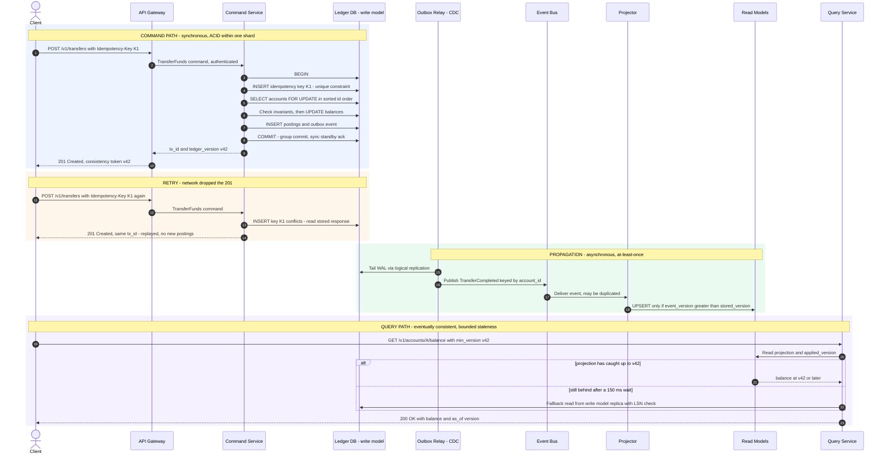

## 1.5 Animation Blueprint: A Double-Spend Race Blocked by a Fenced Lock

**Scene setup (Manim Community, 1920×1080, 60 fps, dark background):**

- **Centre-bottom:** a green `RoundedRectangle` labelled *Ledger DB* containing `balance = 100 | last_fence = 32`.
- **Top-centre:** a grey padlock-shaped group labelled *Redis lock: free*, with a circular TTL arc beside it.
- **Left:** worker **W1** (blue circle). **Right:** worker **W2** (orange circle). Each has a speech bubble showing the intent `withdraw 80`.
- A caption bar along the bottom third shows narration.

The animation has three acts, which move from the naive race, to the textbook lock, to the pathology that makes fencing necessary.

| Time | Act | Visual | Manim primitives |
|---|---|---|---|
| 0:00–0:03 | **I. No lock** | Title card: "Two withdrawals, one balance" | `Write`, `FadeOut` |
| 0:03–0:07 | I | W1 and W2 both fire a `READ` arrow at the DB at the same moment. Both bubbles show `saw 100` | `GrowArrow` ×2 in `AnimationGroup` |
| 0:07–0:10 | I | Both compute `100 − 80 = 20` (small calculator glyph above each) | `TransformMatchingTex` |
| 0:10–0:14 | I | Both `WRITE 20` arrows hit the DB. The balance shows 20. A counter "withdrawn: 160" appears in red | `Transform`, `Flash(color=RED)` |
| 0:14–0:17 | I | Caption: **"Lost update: 160 paid out of 100."** The screen desaturates and rewinds | `Wiggle`, reverse `ValueTracker` |
| 0:17–0:21 | **II. Lock** | W1 sends `SET NX PX` to Redis. The lock turns blue, labelled `W1 · token 33`. The TTL arc starts full | `Indicate`, `always_redraw(Arc)` |
| 0:21–0:24 | II | W2's acquire arrow bounces off the padlock with a small "busy" spark, then arcs back along a dashed path labelled `backoff + jitter` | `MoveAlongPath` on `ArcBetweenPoints`, `Flash` |
| 0:24–0:28 | II | W1 performs the conditional write. The DB shows `balance = 20 | last_fence = 33`. The lock releases and returns to grey | `Transform`, `set_color` |
| 0:28–0:33 | II | W2 retries, acquires `token 34`, reads 20, and its bubble shows `20 < 80 → REJECT: insufficient funds` | `Write`, `Circumscribe` |
| 0:33–0:36 | II | Caption: **"The lock serialised the race. But it only works if the holder is alive and on time…"** | — |
| 0:36–0:40 | **III. Pause** | Reset to 100 / fence 32. W1 acquires `token 33`, then freezes: it turns grey with an ice-crystal overlay and a label `GC pause 4.2 s` | `set_fill(opacity=0.4)`, `FadeIn` |
| 0:40–0:44 | III | The TTL arc drains linearly to zero. The padlock pops open: *lock expired* | `ttl.animate.set_value(0)`, `rate_func=linear` |
| 0:44–0:48 | III | W2 acquires `token 34` and writes. The DB shows `balance = 20 | last_fence = 34` | `Transform` |
| 0:48–0:53 | III | W1 thaws and, still believing it holds the lock, fires `WRITE ... fence=33`. The arrow hits a shield that rises out of the DB: **`WHERE last_fence < 33` → 0 rows**. The arrow shatters | `GrowFromCenter(shield)`, `ShowPassingFlash`, `FadeOut(arrow, shift=DOWN)` |
| 0:53–0:58 | III | Side-by-side recap panel: *Lock = efficiency* on the left, *Fence + conditional write = correctness* on the right | `VGroup.arrange(RIGHT)` |

**Manim skeleton for Act III:**

```python
from manim import *


class FencedLockRace(Scene):
    def construct(self) -> None:
        db = RoundedRectangle(width=5, height=1.6, corner_radius=0.2, color=GREEN).shift(DOWN * 2.5)
        state = Text("balance=100   last_fence=32", font_size=28).move_to(db)
        lock = RoundedRectangle(width=3.2, height=1.1, corner_radius=0.2, color=GREY).shift(UP * 2.6)
        lock_lbl = Text("lock: free", font_size=24).move_to(lock)
        w1 = Circle(radius=0.6, color=BLUE, fill_opacity=0.6).shift(LEFT * 5)
        w2 = Circle(radius=0.6, color=ORANGE, fill_opacity=0.6).shift(RIGHT * 5)
        self.play(*[FadeIn(m) for m in (db, state, lock, lock_lbl, w1, w2)])

        # W1 acquires token 33; the TTL ring starts draining.
        ttl = ValueTracker(1.0)
        ring = always_redraw(lambda: Arc(
            radius=0.45, start_angle=PI / 2, angle=-TAU * max(ttl.get_value(), 1e-3), color=BLUE,
        ).move_arc_center_to(lock.get_right() + RIGHT * 0.8))
        self.add(ring)
        self.play(lock.animate.set_color(BLUE),
                  Transform(lock_lbl, Text("W1 · token 33", font_size=24, color=BLUE).move_to(lock)))

        # W1 freezes while the lease expires.
        pause = Text("GC pause", font_size=22).next_to(w1, UP)
        self.play(w1.animate.set_fill(GREY, opacity=0.3), FadeIn(pause))
        self.play(ttl.animate.set_value(0), run_time=3, rate_func=linear)
        self.play(lock.animate.set_color(ORANGE),
                  Transform(lock_lbl, Text("W2 · token 34", font_size=24, color=ORANGE).move_to(lock)))

        # W2 writes with fence 34.
        a2 = Arrow(w2.get_bottom(), db.get_right(), color=ORANGE)
        self.play(GrowArrow(a2))
        self.play(Transform(state, Text("balance=20   last_fence=34", font_size=28).move_to(db)))
        self.play(FadeOut(a2))

        # W1 wakes up and tries a stale write: the DB rejects it.
        self.play(w1.animate.set_fill(BLUE, opacity=0.6), FadeOut(pause))
        a1 = Arrow(w1.get_bottom(), db.get_left(), color=BLUE)
        self.play(GrowArrow(a1))
        verdict = Text("fence 33 ≤ 34 → REJECTED", font_size=30, color=RED).next_to(db, UP)
        self.play(Flash(db.get_left(), color=RED), Write(verdict))
        self.play(FadeOut(a1, shift=DOWN))
        self.wait()
```

## 1.6 Staff-level Review Questions

- Where exactly is the ACID boundary, and what is the *business* consequence of every piece of state outside it being stale for 5 seconds?
- What happens to an idempotency key when the operation fails deterministically, and does the client get the same answer on retry?
- If the Redis cluster is entirely unavailable, does the ledger stop, slow down, or lose correctness? (The right answer is "slow down".)
- How long does replaying the largest account's stream take, and what is the snapshot policy?
- Which reconciliation invariant would have detected your last production incident?

---

# Module 2 — AI & LLM Infrastructure at Scale

*Industry: Generative AI & Autonomous Agents*

## 2.1 Core Theory & Trade-offs

### Vector databases and ANN indexing

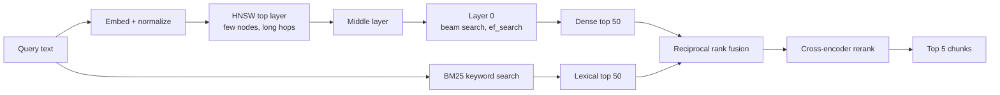

Exact k-nearest-neighbour search costs `O(N·d)` per query. For 10M chunks at 1,024 dimensions, that is about 10¹⁰ multiply-adds per query. This is fine as a one-off on a GPU and hopeless at thousands of QPS. **Approximate nearest neighbour (ANN)** indexes trade *recall* for *latency and memory*. Every index decision is a position on that three-way trade-off.

**HNSW (Hierarchical Navigable Small World)** is a multi-layer proximity graph. Think of it as a skip list crossed with a small-world graph:

- Each vector is assigned a maximum layer drawn from an exponentially decaying distribution (`level = ⌊−ln(U) · mL⌋`). Most nodes exist only on layer 0, and a few reach the sparse top layers.
- **Search:** start at the entry point on the top layer, greedily hop to whichever neighbour is closest to the query, and descend a layer when no neighbour improves. On layer 0, run a beam search that keeps the best `ef_search` candidates in a priority queue.
- **Parameters:**
  - `M` is the number of neighbours per node (layer 0 usually keeps `2M`). A higher M gives better recall and more memory.
  - `ef_construction` is the build-time beam width. A higher value gives a better graph and a slower build.
  - `ef_search` is the query-time beam width. It is the **runtime recall/latency knob**, and it can be tuned per query.
- **Memory:** vectors plus graph edges. For 10M × 1,024-dim float32 vectors, that is ~41 GB of vectors plus ~2–3 GB of graph at M=16–32. It is **RAM-resident**.
- **Weaknesses:** deletes are tombstones that degrade graph quality, so plan periodic rebuilds. Builds are slow. Highly selective metadata filters break graph connectivity (see below).

**Alternatives:**

| Index | Mechanism | Memory | Recall at fixed latency | Updates | When to use |
|---|---|---|---|---|---|
| Flat (brute force) | Exact scan, often on GPU | 1× | 100% | Trivial | Fewer than ~1M vectors, or small pre-filtered subsets |
| **HNSW** | Multi-layer graph | ~1.1–1.5× | Excellent | Good inserts, poor deletes | The default for fewer than ~100M vectors in RAM |
| IVF-Flat | k-means into `nlist` cells, probe `nprobe` | ~1× | Good | Cheap. Retrain when drift occurs | Large corpora, GPU (FAISS) |
| IVF-PQ | IVF + product quantization (e.g. 1,024-d float32 = 4 KB → 64 B) | ~0.02× | Lower. Rerank with full vectors | Retrain codebooks | Billions of vectors, cost-bound |
| DiskANN / Vamana | SSD-resident graph + compressed vectors in RAM | Mostly SSD | Very good | Good | Hundreds of millions of vectors without a RAM budget for HNSW |

Scalar quantization (int8, 4× smaller) usually costs 1–2 points of recall. Binary quantization (32× smaller) needs a rescoring pass. Always **normalize** embeddings, so that cosine similarity equals dot product and the index can use the cheaper metric.

**The filtered-search trap.** Enterprise RAG *always* filters: by tenant, jurisdiction, document version, or ACL.

- **Post-filtering** (retrieve top-k, then filter) can return zero results when the filter is selective, because the true matches were never in the top-k.
- **Pre-filtering** (filter, then brute-force the subset) is exact and fast when the subset is small.
- **In-traversal filtering** (skip non-matching nodes during the graph walk) degrades sharply as selectivity rises, because the graph fragments into disconnected islands.
- **Principal answer:** when the filter is a *security or residency boundary*, **partition the index** (per tenant or per jurisdiction) instead of filtering. You get isolation you can audit, predictable recall, and per-partition lifecycle. Reserve metadata filters for soft relevance constraints.

**Hybrid retrieval.** Dense embeddings are weak on exact tokens such as policy numbers, SKUs, and names like "Reg E". Run BM25 and dense search in parallel and fuse them with **Reciprocal Rank Fusion**, `score(d) = Σ 1 / (k + rank_i(d))` with k ≈ 60. Then apply a **cross-encoder reranker** to the top ~50 to pick the final 5–8. The reranker usually adds 30–150 ms and is usually the single biggest quality gain in the pipeline.

### Retrieval-Augmented Generation (RAG) pipelines

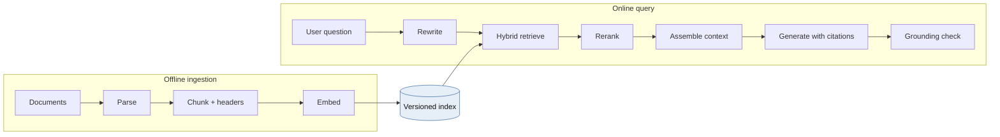

**Ingestion path (offline or near-real-time):**
Source (SharePoint, CMS, PDFs) → layout-aware parsing that keeps tables and headings → chunking → metadata enrichment (`doc_id`, `version`, `effective_date`, `jurisdiction`, `acl`) → embedding → upsert.

- **Versioning is a correctness issue.** When compliance guideline v7 supersedes v6, v6 chunks must stop being retrievable *atomically*. Store `doc_version` plus an `active` flag, or build a new index and swap an alias.
- **Changing embedding models means re-embedding the whole corpus.** Vectors from different models live in incompatible spaces. Blue/green the index.

**Chunking trade-offs:**

| Choice | Effect |
|---|---|
| Small chunks (200–400 tokens) | Precise matches, but the chunk loses surrounding context and needs more chunks per answer |
| Large chunks (800–1,500 tokens) | Context preserved, but the embedding is diluted and the prompt costs more tokens |
| Overlap (10–20%) | Protects sentences split across boundaries, at the cost of index size |
| Structure-aware (split on headings) | The best default for policy documents |
| Parent–child ("small-to-big") | Retrieve on small chunks, feed the parent section to the LLM |
| Contextual header | Prepend `Document › Section › Subsection` to each chunk *before* embedding. It is cheap and noticeably improves recall |

**Query path:** input guardrails → conversational query rewrite (turn "what about abroad?" into a standalone question) → hybrid retrieval → rerank → context assembly under a token budget → generation with citations → output checks (grounding, PII, required disclosures).

**Evaluate retrieval separately from generation.** Most "the LLM hallucinated" incidents are actually retrieval failures: the right chunk never reached the prompt. Track recall@k and MRR on a golden question set in CI, and faithfulness and groundedness on sampled production traffic.

### Stream processing and long-lived connections

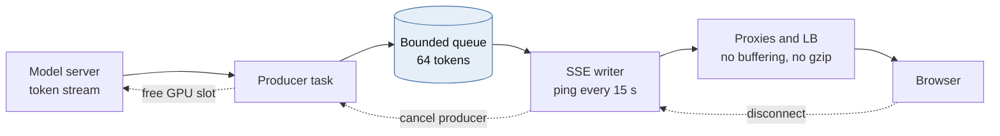

| | Server-Sent Events (SSE) | WebSocket |
|---|---|---|
| Direction | Server → client | Bidirectional |
| Protocol | Plain HTTP, works over HTTP/2 multiplexing | Upgrade handshake, then its own framing |
| Proxies and WAFs | Pass through easily | Often need explicit configuration |
| Reconnection | Built in, with `Last-Event-ID` | Hand-rolled |
| Best for | **Token streaming** | Barge-in, voice, collaborative agents |

For a chat bot, SSE is the default. Cancelling mid-stream can be a separate `POST /cancel`.

**What actually limits 50k concurrent connections:**

- **Memory is not the problem.** An idle asyncio connection costs tens of KB (socket buffers, TLS state, a coroutine frame), so 50k connections fit comfortably in a handful of pods.
- **Idle timeouts at load balancers** kill quiet streams while the model is still prefilling. Send an SSE comment (`: ping`) every ~15 s, and check every hop's idle timeout.
- **Buffering** breaks streaming silently. Disable proxy buffering (`X-Accel-Buffering: no` on nginx) and **disable gzip middleware** on stream routes, because compressors buffer.
- **Backpressure:** a slow client must not cause unbounded memory growth. Use a bounded per-stream queue, and drop the connection if it stays full.
- **Cancel on disconnect:** a closed browser tab must free its GPU slot *immediately*. Otherwise abandoned generations consume a real share of fleet capacity.

### Model serving optimization

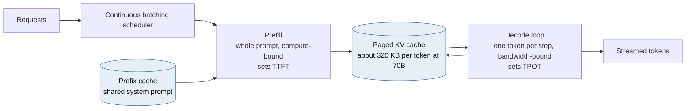

LLM inference has two phases with opposite bottlenecks:

- **Prefill** processes the whole prompt in parallel. It is **compute-bound** and sets **time-to-first-token (TTFT)**.
- **Decode** produces one token per step per sequence. It is **memory-bandwidth-bound** and sets **time-per-output-token (TPOT)**.

**The KV cache is the capacity constraint**, not FLOPs:

```
KV bytes per token = 2 (K and V) × layers × kv_heads × head_dim × bytes_per_value
70B-class model with GQA (80 layers, 8 KV heads, head_dim 128, fp16):
  2 × 80 × 8 × 128 × 2 B ≈ 320 KB per token
A 4,000-token conversation ≈ 1.3 GB of GPU memory for a single sequence
```

Concurrency per GPU is therefore bounded by KV memory. The serving optimizations mostly exist to stretch that budget:

| Technique | What it does | Trade-off |
|---|---|---|
| **Continuous batching** (vLLM, TGI, TensorRT-LLM, SGLang) | Schedules at the iteration level, so new sequences join the batch mid-flight | Larger batches raise throughput *and* raise TPOT. Tune `max_num_seqs` to your SLO |
| **PagedAttention** | Allocates KV in fixed blocks, eliminating fragmentation | Standard practice now |
| **Prefix caching** | Reuses KV for a shared prompt prefix (system prompt, static policy text) | Huge win for RAG. Requires *cache-affinity routing* to the replica that holds the prefix |
| **Quantization** (FP8/INT8/INT4 weights, FP8 KV) | Roughly 2–4× more memory for KV | Quality regression must be measured on *your* eval set |
| **Speculative decoding** | A small draft model proposes tokens and the large model verifies them | Output-equivalent, but gains depend on acceptance rate. Uses extra memory |
| **Chunked prefill** | Splits long prefills so they don't stall running decodes | Slightly higher TTFT for long prompts in exchange for stable TPOT |
| **Prefill/decode disaggregation** | Separate GPU pools for each phase | Best efficiency at scale, but you must transfer KV between pools |
| **Model tiering** | A small model for intent and routing, the large model only when needed | Adds a routing hop, cuts cost dramatically |

## 2.2 Python in Practice: Async Streaming, Chunking, GPU Queues

### SSE gateway with admission control, heartbeats, backpressure and cancellation

```python
import asyncio
import json
from collections.abc import AsyncIterator

from fastapi import FastAPI, Request
from fastapi.responses import JSONResponse, StreamingResponse
from pydantic import BaseModel

app = FastAPI()
GEN_SLOTS = asyncio.Semaphore(256)   # per-process cap on in-flight generations
_DONE = object()


class ChatIn(BaseModel):
    conversation_id: str
    message: str


async def generate_tokens(body: ChatIn) -> AsyncIterator[str]:
    """Placeholder: stream from vLLM / Azure OpenAI with stream=True."""
    for tok in ("Disputes ", "abroad ", "follow ", "the ", "same ", "rules."):
        await asyncio.sleep(0.03)
        yield tok


def sse(event: str, data: dict) -> bytes:
    return f"event: {event}\ndata: {json.dumps(data)}\n\n".encode()


@app.post("/v1/chat/stream")
async def chat_stream(req: Request, body: ChatIn):
    if GEN_SLOTS.locked():   # best-effort fast-fail so the client gets a real 429
        return JSONResponse({"error": "overloaded"}, status_code=429, headers={"Retry-After": "2"})

    async def event_source() -> AsyncIterator[bytes]:
        try:
            await asyncio.wait_for(GEN_SLOTS.acquire(), timeout=0.5)
        except TimeoutError:
            yield sse("error", {"code": "overloaded", "retry_after_s": 2})
            return
        q: asyncio.Queue[object] = asyncio.Queue(maxsize=64)   # bounded = backpressure

        async def produce() -> None:
            try:
                async for tok in generate_tokens(body):
                    await q.put(tok)   # blocks when the client is slow, pausing the upstream stream
                await q.put(_DONE)
            except Exception as exc:   # surface model errors to the consumer loop
                await q.put(exc)

        producer = asyncio.create_task(produce())
        try:
            while True:
                if await req.is_disconnected():
                    break
                try:
                    # Queue.get is safe to cancel. Never wrap the generator's __anext__
                    # in wait_for: a timeout would cancel the model stream itself.
                    item = await asyncio.wait_for(q.get(), timeout=15)
                except TimeoutError:
                    yield b": ping\n\n"   # keeps LBs from reaping a slow-prefill stream
                    continue
                if item is _DONE:
                    yield sse("done", {})
                    break
                if isinstance(item, Exception):
                    yield sse("error", {"code": "generation_failed"})
                    break
                yield sse("token", {"t": item})
        finally:
            producer.cancel()      # propagates cancellation upstream and frees GPU work
            GEN_SLOTS.release()

    return StreamingResponse(event_source(), media_type="text/event-stream",
                             headers={"Cache-Control": "no-cache", "X-Accel-Buffering": "no"})
```

The `locked()` pre-check is not atomic. It is a cheap load-shedding hint, and the timed `acquire` inside the generator is the real gate. Recent Starlette versions also cancel the generator when a send fails, but polling `is_disconnected()` covers the time-to-first-token window, when nothing is being sent yet.

### Structure-aware token chunking

```python
from collections.abc import Callable, Iterator, Sequence
from dataclasses import dataclass


@dataclass(frozen=True, slots=True)
class Chunk:
    doc_id: str
    doc_version: int
    section_path: str
    text: str
    start_token: int


def chunk_section(
    doc_id: str,
    doc_version: int,
    section_path: str,                       # "Card Disputes › Foreign Transactions"
    body: str,
    encode: Callable[[str], Sequence[int]],  # e.g. tiktoken or an HF tokenizer
    decode: Callable[[Sequence[int]], str],
    max_tokens: int = 400,
    overlap: int = 60,
) -> Iterator[Chunk]:
    if not 0 <= overlap < max_tokens:
        raise ValueError("overlap must be in [0, max_tokens)")
    ids = encode(body)
    if not ids:
        return
    step = max_tokens - overlap
    for start in range(0, max(len(ids) - overlap, 1), step):
        window = ids[start:start + max_tokens]
        # The contextual header is embedded with the chunk, so a chunk that just says
        # "within 60 days" still retrieves for "foreign dispute deadline".
        yield Chunk(doc_id, doc_version, section_path,
                    f"{section_path}\n\n{decode(window)}", start)
```

Split on headings first (one call per section), then use the token window only inside long sections. In production, snap window edges to sentence boundaries, because raw token windows can cut mid-word.

### GPU-bound embedding workers with Ray Serve dynamic batching

```python
from ray import serve


@serve.deployment(
    ray_actor_options={"num_gpus": 1},
    autoscaling_config={"min_replicas": 2, "max_replicas": 16, "target_ongoing_requests": 64},
)
class Embedder:
    def __init__(self) -> None:
        from sentence_transformers import SentenceTransformer
        self.model = SentenceTransformer("BAAI/bge-large-en-v1.5", device="cuda")

    @serve.batch(max_batch_size=128, batch_wait_timeout_s=0.01)
    async def embed(self, texts: list[str]) -> list[list[float]]:
        # Callers send one string. Ray coalesces concurrent calls into a single GPU batch.
        vecs = self.model.encode(texts, normalize_embeddings=True, batch_size=128)
        return vecs.tolist()

    async def __call__(self, text: str) -> list[float]:
        return await self.embed(text)


embedder_app = Embedder.bind()
```

The trade-off is explicit: `batch_wait_timeout_s=0.01` adds up to 10 ms of latency in exchange for GPU utilization that can be an order of magnitude higher. Check the autoscaling key names against your Ray version, because they have been renamed across releases. For CPU-bound steps such as PDF parsing or tokenizing large documents in the gateway, use `loop.run_in_executor(ProcessPoolExecutor(), ...)`. Threads won't help because of the GIL (free-threaded CPython 3.13+ is still maturing).

## 2.3 Case Study: An Enterprise AI Customer-Service Bot for 50,000 Concurrent Users

**Requirements:** a bank's assistant that (a) fetches real-time account data (balances, recent transactions, card status), (b) retrieves compliance guidelines with citations, and (c) streams responses token by token. TTFT p95 under 1.5 s and ≥ 20 tokens/s per stream. **Zero cross-customer data leakage.** Full auditability.

### Capacity math: "50k concurrent" is not the number that matters

```mermaid
flowchart LR
    %% title: Little's Law sizing for the chat bot
    U["50,000 connected users"] -->|"one message per 90 s"| L["Arrival rate<br/>555 requests/s"]
    L -->|"x 14 s per response"| C["7,800 concurrent<br/>generations"]
    C -->|"x 30 tokens/s"| T["234k output<br/>tokens/s"]
    C -->|"x 3,400 tokens x 320 KB"| K["About 8.7 TB<br/>live KV cache"]
    classDef warn fill:#fdf0d5,stroke:#c98a12,color:#111
    class K warn
```

Apply Little's Law (`L = λ × W`) with explicit assumptions:

| Assumption | Value |
|---|---|
| Connected users | 50,000 |
| Mean think time between messages | 90 s |
| Output length / decode speed | 400 tokens at 30 tok/s ≈ 13 s |
| TTFT (retrieval + prefill) | ~1 s |
| Prompt size (system + 5 chunks + history + account JSON) | ~3,000 tokens |

| Derived quantity | Value |
|---|---|
| Arrival rate λ | 50,000 / 90 ≈ **555 requests/s** |
| Concurrent generations L | 555 × 14 s ≈ **7,800 sequences decoding at once** |
| Aggregate decode throughput | 7,800 × 30 ≈ **234k output tokens/s** |
| Aggregate prefill | 555 × 3,000 ≈ **1.7M prompt tokens/s** (an 800-token cached prefix removes ~25%) |
| Live KV cache at 70B class | ~7,800 × ~3,400 tokens × 320 KB ≈ **8–9 TB of KV memory** |

That last row drives the design. At 70B-class scale, self-hosting this workload means a GPU fleet in the hundreds before any redundancy. The levers, in order of impact:

1. **Tier the models.** Most banking intents ("what's my balance", "freeze my card") need a small model plus a tool call, or no generative model at all. Route only complex policy questions to the large model.
2. **Cap output tokens** and keep answers concise. Output length drives W linearly.
3. **Keep prompts short.** Five tight chunks beat twelve loose ones for both quality and KV cost.
4. **Buy instead of build.** A managed service with reserved capacity (Azure OpenAI provisioned throughput, Bedrock provisioned throughput, Vertex) converts GPU operations into a capacity contract. Self-hosting (vLLM on AKS GPU node pools) wins on unit cost only at sustained high utilization, with an MLOps team to run it.

### Reference architecture decisions

- **Stateless stream gateways.** Conversation state lives in Redis or Cosmos DB, so any pod can serve any turn. A short replay buffer (Redis Streams, ~60 s) supports SSE resume via `Last-Event-ID`.
- **Parallel fan-out to cut TTFT.** The orchestrator runs account-data fetch, retrieval and conversation-history load concurrently (`asyncio.TaskGroup`), so TTFT is `max(...)`, not the sum.
- **The LLM is never the authority on identity.** The customer ID comes from the *authenticated session*, and the account tool calls core banking with the user's delegated token (on-behalf-of flow). The model can ask for "my recent transactions". It can never choose *whose*. This single rule prevents the most damaging class of prompt-injection incidents.
- **Retrieved content is untrusted input.** Indirect prompt injection can hide inside ingested documents. Keep tool-calling permissions minimal and require confirmation for anything that changes state.
- **Retrieval:** hybrid BM25 + HNSW with semantic reranking (Azure AI Search, or pgvector/Qdrant plus a reranker), filtered by product, jurisdiction and `effective_date`, with index partitions per regulatory region.
- **Caching, from safest to riskiest:**

| Layer | Key | Rule |
|---|---|---|
| Embedding cache | hash(text, model_version) | Always safe |
| Retrieval cache | hash(rewritten query, corpus_version, filters) → chunk IDs | Safe with a short TTL |
| Prefix/KV cache (model server) | Token prefix | Safe. Largest cost win |
| Exact response cache | Normalized query + corpus_version, **non-personalized intents only** | Allowed for FAQs |
| Semantic response cache | Embedding similarity above a strict threshold | **Only for compliance-approved, non-personalized answers.** Never for anything that touched account data. A near-miss match returns another customer's context |

- **Degradation policy (fail closed on compliance):**
  - Vector search down → do *not* answer policy questions ungrounded. Say so and offer escalation to a human.
  - Account API down → answer policy questions, and state that account details are temporarily unavailable.
  - GPU saturation → admission control, then route to the smaller model, then queue with an honest ETA.
- **Audit record per turn:** prompt template version, retrieved chunk IDs and versions, tool calls (arguments and redacted results), model and version, and output. Keep it immutable and encrypted, with PII redaction before it reaches general-purpose logs.
- **Observability:** one trace per turn with spans for retrieval, rerank, tools, prefill and decode. Record token counts, TTFT and TPOT as first-class metrics, plus cost per tenant and per intent.

## 2.4 Mermaid: RAG Serving Architecture

```mermaid
flowchart LR
    %% title: RAG serving architecture
    U["Customer web and mobile app"] -->|"HTTPS + SSE"| EDGE["Edge: WAF + CDN<br/>Azure Front Door"]
    EDGE --> APIM["API Gateway<br/>OIDC auth, per-user rate limit"]
    APIM --> GW["Async Stream Gateway<br/>FastAPI on uvicorn, stateless"]

    subgraph ORCH["Orchestration tier"]
        GW --> OR["LLM Orchestrator<br/>intent, plan, token budget"]
        OR --> GIN["Input guardrails<br/>PII, prompt injection"]
        OR --> TOOLS["Account Tool<br/>on-behalf-of user token"]
        OR --> GOUT["Output guardrails<br/>grounding, disclosures"]
    end

    subgraph RET["Retrieval tier"]
        OR --> QR["Query rewrite<br/>small model"]
        QR --> EMBQ["Query embedder<br/>GPU, dynamic batching"]
        EMBQ --> HYB["Hybrid search<br/>HNSW + BM25, partitioned by jurisdiction"]
        HYB --> RR["Cross-encoder reranker"]
        RR --> OR
    end

    subgraph SERVE["Model serving tier"]
        OR --> ROUTER["Model router<br/>tiering, prefix-cache affinity"]
        ROUTER --> SMALL["Small model pool<br/>intent, simple answers"]
        ROUTER --> LARGE["Large model pool<br/>vLLM continuous batching"]
        LARGE --> KV[("Paged KV cache<br/>prefix cache")]
    end

    subgraph CACHE["Cache tier - Redis"]
        EC[("Embedding cache")]
        RC[("Retrieval cache")]
        FAQ[("Non-personal FAQ cache")]
        CONV[("Conversation state + replay buffer")]
    end

    subgraph DATA["Systems of record"]
        CORE[("Core banking API")]
        AUD[("Immutable audit store")]
    end

    TOOLS --> CORE
    EMBQ -.-> EC
    HYB -.-> RC
    OR -.-> FAQ
    GW -.-> CONV
    GOUT --> GW
    OR -.->|"turn record"| AUD
    SMALL --> GOUT
    LARGE --> GOUT

    subgraph ING["Offline ingestion"]
        SRC["Policy docs, SharePoint, CMS"] --> PARSE["Layout-aware parser"]
        PARSE --> CHUNK["Structure-aware chunker<br/>+ contextual headers"]
        CHUNK --> EMBB["Batch embedder<br/>Ray on GPU"]
    end
    EMBB -->|"versioned upsert, alias swap"| HYB
```

## 2.5 Animation Blueprint: From Text to Tokens, Vectors, and an HNSW Match

**Scene setup:** use `ThreeDScene` for the vector-space acts and a plain `Scene` for the tokenizer act. Set `self.set_camera_orientation(phi=70*DEGREES, theta=-45*DEGREES)`. Fix the random seed so the point layout is reproducible.

| Time | Act | Visual | Manim primitives / notes |
|---|---|---|---|
| 0:00–0:04 | **1. Input** | The query "Can I dispute a card charge made abroad?" types across the screen | `AddTextLetterByLetter` |
| 0:04–0:09 | **2. Tokenize** | The sentence splits into rounded "token chips" on sub-word boundaries (e.g. `dis` `pute`). Each chip flips to reveal an integer ID. Caption: *IDs and splits are illustrative and depend on the tokenizer* | `VGroup` of `RoundedRectangle`+`Text`, `Rotate(axis=UP)` flip, then `Transform` to the ID |
| 0:09–0:15 | **3. Embed** | A tall matrix grid (the embedding table) appears. Each ID highlights its row, and the rows slide out as coloured bars | `Rectangle` grid, `Indicate(row)`, `ReplacementTransform` |
| 0:15–0:20 | 3 | The bars pass through a stack of translucent transformer blocks. Thin attention lines crisscross between tokens, and the bar colours shift (contextualization) | `Line` with low opacity, `LaggedStart`, colour interpolation |
| 0:20–0:24 | 3 | Mean pooling: the bars compress into one 1,024-cell heat-strip, the *sentence embedding*. Caption: *an embedding model, not the chat LLM, produces this vector* | `Transform` into a `VGroup` of 1,024 thin rectangles coloured by value |
| 0:24–0:28 | **4. Normalize** | The strip becomes a 3D arrow from the origin. The arrow snaps its length to touch a translucent unit sphere | `Arrow3D`, `Sphere(opacity=0.1)`, `scale_to_fit` |
| 0:28–0:35 | **5. Vector space** | Thousands of chunk points fade in, clustered and labelled *Disputes*, *Travel*, *Fees*, *Mortgages*. Caption: *3D UMAP projection. Real space has 1,024 dimensions and distances are distorted here.* The camera begins a slow orbit | `Dot3D` clouds, `begin_ambient_camera_rotation(rate=0.1)` |
| 0:35–0:38 | 5 | The query point appears as a glowing star between *Disputes* and *Travel* | `Dot3D` with a glow ring, `Flash` |
| 0:38–0:42 | **6. HNSW layers** | The cloud separates vertically into three translucent planes: L2 (≈10 nodes), L1 (≈100), L0 (all). Vertical dotted lines link a node's copies across layers | `Surface` planes, `DashedLine` |
| 0:42–0:48 | 6 | **Greedy descent on L2:** start at the entry point and hop edge by edge toward the star. A side panel shows `distance: 0.91 → 0.74 → 0.63`. When no neighbour improves, drop down the dotted line to L1 | `MoveAlongPath`, `DecimalNumber` updating, `Circumscribe` on the local minimum |
| 0:48–0:54 | 6 | Repeat on L1 with shorter hops. Drop to L0 | Same primitives, faster |
| 0:54–1:02 | 6 | **Beam search on L0:** a side panel lists the candidate priority queue (`ef_search = 64`, top 8 shown). Nodes light up as they are expanded, and the queue reorders live | `Table`-like `VGroup` re-sorted with `Transform`, highlight via `set_color` |
| 1:02–1:07 | **7. Rerank** | The top 8 hits pull out into a row with cosine scores. A reranker "lens" passes over them, and they reorder. One lexically similar but irrelevant chunk (*"dispute a parking ticket"*) drops from #2 to #7 | `animate.arrange`, `Indicate` |
| 1:07–1:12 | **8. Filter failure** (bonus) | Rewind to L0. Apply the filter `jurisdiction = QC`: 98% of nodes grey out. The beam search gets trapped on a disconnected island of matching nodes and returns 2 results instead of 8. Caption: *selective filters fragment the graph* | `set_opacity(0.1)`, red `Cross` on the trapped search |
| 1:12–1:16 | 8 | Fix: the space splits into per-jurisdiction sub-indexes. The search runs inside the *QC* partition and returns 8 good results | `FadeTransform` to a smaller, dense graph |
| 1:16–1:20 | **9. Prompt** | The final 5 chunks fly into a prompt template card beside the system prompt. Citation badges `[1]`–`[5]` attach | `ReplacementTransform`, `LaggedStart(FadeIn)` |

## 2.6 Staff-level Review Questions

- What is the recall@10 of the retriever on the golden set, and how much of the quality gap is retrieval rather than generation?
- How do you guarantee that superseded policy text can no longer be retrieved, and how quickly after publication?
- Which cache layers could ever return data derived from another customer's account, and what proves they can't?
- What are the TTFT and TPOT SLOs, and at what batch size does TPOT breach them?
- When the GPU pool is saturated, which users get degraded first, and is that a product decision or an accident?

---

# Module 3 — Distributed Systems Consensus & Resiliency

*Industry: Global SaaS & IoT*

## 3.1 Core Theory & Trade-offs

### Consensus: Raft and Paxos

```mermaid
flowchart LR
    %% title: Raft log replication and commit
    C["Client write"] --> L["Leader<br/>term 3"]
    L -->|"AppendEntries"| F1["Follower 1"]
    L -->|"AppendEntries"| F2["Follower 2"]
    L -->|"AppendEntries"| F3["Follower 3"]
    L -->|"AppendEntries"| F4["Follower 4"]
    F1 -->|"ack"| M{"Majority 3 of 5?"}
    F2 -->|"ack"| M
    L -->|"self"| M
    M -->|"yes"| CM["Commit + apply<br/>reply to client"]
    classDef good fill:#dff3e6,stroke:#2e8b57,color:#111
    class CM good
```

Consensus lets a group of nodes agree on a single ordered log despite crash failures (not Byzantine ones). The **FLP result** says no deterministic protocol can guarantee termination in a fully asynchronous network if even one node may crash. Practical protocols therefore guarantee **safety always** and **liveness only when the network behaves** (partial synchrony, enforced with timeouts).

**Raft in one page:**

- **Roles:** follower, candidate, leader. **Terms** are a monotonically increasing logical clock. Any message carrying a higher term forces the receiver to step down and adopt that term.
- **Election:** a follower that hears no heartbeat within a *randomized* election timeout (150–300 ms in the paper, often 1 s or more in production and WAN deployments) increments its term, votes for itself, and sends `RequestVote`. A node grants at most one vote per term, and **only to a candidate whose log is at least as up-to-date as its own** (compare last log term, then last log index). This *election restriction* guarantees that every elected leader already holds every committed entry.
- **Replication:** the leader sends `AppendEntries` with `(prevLogIndex, prevLogTerm)`. A follower rejects the call if its log doesn't match there, and the leader backs up until the logs agree, overwriting divergent follower entries.
- **Commit:** an entry is committed once it is stored on a majority **and** it belongs to the leader's current term. Older-term entries commit indirectly. This is the subtle "Figure 8" case in the Raft paper, and it is why new leaders append a no-op entry immediately.
- **Quorums:** `n = 2f + 1` tolerates `f` failures. Three nodes tolerate one failure and five tolerate two. **Even cluster sizes add cost without adding tolerance.**
- **Latency:** commit time equals the leader's fsync plus the RTT to the fastest majority. With five voters across three regions, every write pays roughly the RTT to the second-nearest region.
- **Production extensions:**
  - **Pre-vote** stops a node rejoining after a partition from inflating terms and disrupting a healthy leader.
  - **ReadIndex or leader leases** give linearizable reads. Without them, a deposed leader in a minority partition can serve stale reads.
  - **Learners** are non-voting replicas.
  - **Joint consensus** allows safe membership changes.

**Raft vs. Paxos:** Multi-Paxos and Raft are equivalent in power. Raft is a strong-leader design optimized for understandability. Leaderless variants such as EPaxos reduce WAN latency at considerable complexity. **Don't implement consensus.** Use etcd, ZooKeeper (ZAB), Consul, or systems that embed Raft (CockroachDB, TiKV, Kafka KRaft).

**Split brain.** Raft guarantees at most one leader *can commit* per term. It does **not** stop a deposed leader from *believing* it is still leader, or stop *application-level* split brain, such as two regions each accepting writes for the same device. The fix is always the same: attach an **epoch or term to every write**, and have the storage layer reject writes from lower epochs.

### Gossip protocols

```mermaid
flowchart LR
    %% title: SWIM failure detection
    A["Node A"] -->|"1. ping"| B["Node B"]
    B -.->|"no ack"| A
    A -->|"2. ping-req"| C["Node C"]
    A -->|"2. ping-req"| D["Node D"]
    C -->|"indirect ping"| B
    D -->|"indirect ping"| B
    C -.->|"no ack"| A
    A --> S["3. Mark B suspect"]
    S --> X["4. Confirm dead after timeout"]
    X -->|"piggyback on pings"| ALL["Cluster learns in O log N rounds"]
    classDef warn fill:#fdf0d5,stroke:#c98a12,color:#111
    class S,X warn
```

**SWIM-style membership:**

- Each protocol period, a node pings one random peer. If there is no ack, it asks *k* other peers to ping that node indirectly (`ping-req`). If there is still no response, the node is marked *suspect* and then *dead* after a timeout.
- Membership updates **piggyback** on pings, so dissemination takes `O(log N)` rounds with constant per-node load.

**Trade-offs:** gossip is probabilistic and eventually consistent, and false positives rise under GC pauses or network jitter. The **phi-accrual detector** (Cassandra, Akka) outputs a continuous suspicion level instead of a binary verdict, letting each subsystem choose its own threshold.

**Rule of thumb:** use gossip for *who is alive and what they advertise*, and consensus for *decisions that must not diverge*. Consul does exactly this: gossip (Serf/memberlist) for membership, and Raft for the service catalog.

### Rate limiting: token bucket vs. leaky bucket

```mermaid
flowchart LR
    %% title: Token bucket vs leaky bucket
    subgraph TB["Token bucket - allows bursts"]
        R1["Refill r tokens/s"] --> BK[("Bucket<br/>capacity B")]
        IN1["Requests"] --> CK{"Tokens left?"}
        BK --> CK
        CK -->|"yes"| OK1["Pass immediately"]
        CK -->|"no"| RJ1["Reject 429"]
    end
    subgraph LB["Leaky bucket - smooths output"]
        IN2["Requests"] --> QQ[("Queue<br/>size Q")]
        QQ -->|"drain at constant r"| OK2["Downstream"]
        IN2 -->|"queue full"| RJ2["Drop"]
    end
    classDef store fill:#e6eef8,stroke:#3b6ea5,color:#111
    class BK,QQ store
```

| Algorithm | Behaviour | Burst handling | State | Typical use |
|---|---|---|---|---|
| **Token bucket** | Bucket of capacity B refills at r tokens/s. A request spends tokens | **Allows bursts** up to B. Long-run rate is r | 2 numbers | API quotas, per-device limits |
| **Leaky bucket (queue)** | Requests enter a queue of size Q, drained at a constant r | **Smooths bursts** into a steady output, and adds queueing delay | Queue | Protecting a fragile downstream that needs a steady rate |
| Leaky bucket (meter) / GCRA | Tracks a "theoretical arrival time" | Mathematically equivalent to a token bucket | 1 number | Telecom, efficient Redis limiters |
| Fixed window | Counter per window | Up to 2× bursts at window edges | 1 counter | Coarse quotas |
| Sliding window log | Timestamps of every request | Exact | O(requests) | Low-volume, high-precision cases |
| Sliding window counter | Weighted blend of two windows | Close approximation | 2 counters | A good general default |

**Distributed rate limiting has three designs:**

1. **Centralized.** A Redis Lua script is atomic and accurate, but adds about a millisecond of RTT and makes Redis a dependency. Decide explicitly whether to **fail open** (protecting a backend) or **fail closed** (billing or abuse quotas).
2. **Local buckets.** Each of N instances enforces r/N locally. This is fast and inaccurate under uneven load balancing.
3. **Hybrid.** Local buckets asynchronously lease quota from a central store.

**Rate limiting is not load shedding.** Rate limits enforce *per-client fairness*. Load shedding is *server self-preservation* driven by the server's own health signals (in-flight concurrency, queue wait time). Adaptive concurrency limits using AIMD or a latency gradient catch overloads that static rate limits miss.

### Circuit breakers

```mermaid
flowchart LR
    %% title: Layered resiliency around one dependency call
    CALL["Caller"] --> RB["Retry with backoff + jitter<br/>retry budget 10%"]
    RB --> CB["Circuit breaker<br/>per dependency, per endpoint"]
    CB --> TO["Timeout / deadline"]
    TO --> BH["Bulkhead<br/>dedicated connection pool"]
    BH --> DEP["Dependency"]
    CB -->|"open"| FB["Fallback / degrade"]
```

A breaker moves through three states:

- **Closed:** calls flow, and outcomes are recorded in a rolling window.
- **Open:** calls fail fast for a cool-down period, and the caller serves a fallback.
- **Half-open:** a limited number of probe calls are admitted. Enough successes close the breaker, and any failure re-opens it.

Design details that decide whether a breaker helps or hurts:

- **Trip on failure *rate* with a minimum call volume.** One failure out of one call is not an outage.
- **Count slow calls as failures.** A dependency that answers in 9 s is down for practical purposes.
- **Classify errors.** 5xx responses and timeouts are failures. 4xx responses are the *caller's* bug and must not trip the breaker.
- **Choose granularity per dependency and per endpoint or shard.** One global breaker in front of a sharded database trips everything when one shard fails.
- **Timeouts are a prerequisite.** Without a deadline, a hung call never "fails", so the breaker never opens.
- **Combine with bulkheads** (separate connection pools per dependency) so one slow dependency cannot exhaust every worker.
- **Retries go *outside* the breaker, with backoff, full jitter and a retry budget.** Three layers retrying three times each is **27× amplification** during an outage. Cap retries at around 10% of traffic.

### Graceful degradation

```mermaid
flowchart LR
    %% title: Degradation ladder
    L0["L0 Full service"] -->|"pressure"| L1["L1 Reduced<br/>stale caches, no extras"]
    L1 -->|"more pressure"| L2["L2 Core only<br/>shed low priority"]
    L2 -->|"severe"| L3["L3 Static<br/>queue and acknowledge"]
    L3 -.->|"recovery"| L0
    classDef good fill:#dff3e6,stroke:#2e8b57,color:#111
    classDef warn fill:#fdf0d5,stroke:#c98a12,color:#111
    classDef bad fill:#fbe0df,stroke:#c0392b,color:#111
    class L0 good
    class L1,L2 warn
    class L3 bad
```

Design an explicit **degradation ladder** with product owners *before* the incident:

| Level | Behaviour |
|---|---|
| L0 Full | All features |
| L1 Reduced | Serve stale caches (stale-while-revalidate). Disable recommendations, rich analytics and non-critical enrichment |
| L2 Core only | Critical paths only. Low-priority traffic is shed by priority class |
| L3 Static | Static fallback responses, queue-and-acknowledge writes |

Priority-based shedding needs every request tagged with a criticality class at the edge. Health checks and the control plane come first, safety alarms next, and bulk telemetry last.

## 3.2 Python in Practice: Resiliency Patterns

### Retries with `tenacity`: retry only what's retryable

```python
import httpx
from tenacity import (retry, retry_if_exception, stop_after_attempt,
                      stop_after_delay, wait_exponential_jitter)


def is_retryable(exc: BaseException) -> bool:
    if isinstance(exc, (httpx.ConnectError, httpx.ReadTimeout, httpx.PoolTimeout)):
        return True
    if isinstance(exc, httpx.HTTPStatusError):
        return exc.response.status_code in {429, 502, 503, 504}
    return False   # 4xx is the caller's bug. Retrying just repeats it


@retry(
    retry=retry_if_exception(is_retryable),
    wait=wait_exponential_jitter(initial=0.1, max=5.0, jitter=0.5),
    stop=stop_after_attempt(4) | stop_after_delay(10),   # attempt cap AND deadline
    reraise=True,
)
async def push_device_config(client: httpx.AsyncClient, device_id: str, cfg: dict) -> None:
    # Retrying a mutation is only safe because the server dedupes on the key.
    r = await client.put(f"/devices/{device_id}/config", json=cfg,
                         headers={"Idempotency-Key": cfg["revision_id"]})
    r.raise_for_status()
```

`tenacity` is a retry library, not a circuit breaker. Libraries such as `pybreaker` and `aiobreaker` exist, but a breaker is small enough that owning it pays off in observability and correct async semantics.

### A custom async circuit breaker

```python
import asyncio
import time
from collections import deque
from collections.abc import AsyncIterator, Callable
from contextlib import asynccontextmanager
from enum import Enum, auto


class State(Enum):
    CLOSED = auto()
    OPEN = auto()
    HALF_OPEN = auto()


class CircuitOpenError(RuntimeError):
    pass


class CircuitBreaker:
    def __init__(
        self,
        name: str,
        *,
        window_s: float = 30.0,
        min_calls: int = 20,
        failure_rate: float = 0.5,
        open_s: float = 15.0,
        half_open_probes: int = 3,
        is_failure: Callable[[BaseException], bool] = lambda e: True,
        clock: Callable[[], float] = time.monotonic,
    ) -> None:
        self.name, self._window_s, self._min_calls = name, window_s, min_calls
        self._failure_rate, self._open_s, self._probes = failure_rate, open_s, half_open_probes
        self._is_failure, self._clock = is_failure, clock
        self._events: deque[tuple[float, bool]] = deque()   # (timestamp, failed)
        self._state = State.CLOSED
        self._opened_at = 0.0
        self._probe_inflight = 0
        self._probe_successes = 0
        self._lock = asyncio.Lock()

    @property
    def state(self) -> State:
        return self._state

    async def _admit(self) -> bool:
        """Return True if this call is a half-open probe. Raise if rejected."""
        async with self._lock:
            now = self._clock()
            if self._state is State.OPEN and now - self._opened_at >= self._open_s:
                self._state, self._probe_inflight, self._probe_successes = State.HALF_OPEN, 0, 0
            if self._state is State.OPEN:
                raise CircuitOpenError(self.name)
            if self._state is State.HALF_OPEN:
                if self._probe_inflight >= self._probes:
                    raise CircuitOpenError(self.name)
                self._probe_inflight += 1
                return True
            return False

    def _trip(self) -> None:
        self._state, self._opened_at = State.OPEN, self._clock()
        self._events.clear()

    async def _record(self, probe: bool, failed: bool) -> None:
        async with self._lock:
            if probe:
                if self._state is not State.HALF_OPEN:
                    return                      # stale probe finishing after another state change
                self._probe_inflight -= 1
                if failed:
                    self._trip()
                else:
                    self._probe_successes += 1
                    if self._probe_successes >= self._probes:
                        self._state = State.CLOSED
                        self._events.clear()
                return
            if self._state is not State.CLOSED:
                return                          # a call that started while CLOSED, finishing late
            now = self._clock()
            self._events.append((now, failed))
            while self._events and now - self._events[0][0] > self._window_s:
                self._events.popleft()
            n = len(self._events)
            if n >= self._min_calls and sum(f for _, f in self._events) / n >= self._failure_rate:
                self._trip()

    @asynccontextmanager
    async def guard(self) -> AsyncIterator[None]:
        probe = await self._admit()
        try:
            yield
        except asyncio.CancelledError:
            await self._record(probe, failed=False)   # the caller gave up; that isn't dependency failure
            raise
        except BaseException as exc:
            await self._record(probe, failed=self._is_failure(exc))
            raise
        else:
            await self._record(probe, failed=False)
```

Usage, with a timeout inside the breaker so slow calls count as failures, and a degradation path when it opens:

```python
tsdb_breaker = CircuitBreaker(
    "tsdb-write",
    is_failure=lambda e: isinstance(e, (TimeoutError, httpx.TransportError))
    or (isinstance(e, httpx.HTTPStatusError) and e.response.status_code >= 500),
)


async def write_batch(batch: list[dict]) -> None:
    try:
        async with tsdb_breaker.guard(), asyncio.timeout(0.8):
            await tsdb_client.write(batch)
    except CircuitOpenError:
        await spill_to_local_queue(batch)   # graceful degradation: durable buffer, replay later
```

Each process keeps its own breaker state. Across 200 pods, every pod learns about failures independently, which is usually desirable because each sees its own network path. Sharing state through Redis adds a dependency to the very component meant to survive dependency failures.

### Atomic distributed token bucket (Redis + Lua)

```python
import redis.asyncio as redis

TOKEN_BUCKET = """
local cap  = tonumber(ARGV[1])
local rate = tonumber(ARGV[2])   -- tokens per second
local cost = tonumber(ARGV[3])
local t = redis.call('TIME')      -- the server clock avoids skew between app hosts
local now = tonumber(t[1]) * 1000 + math.floor(tonumber(t[2]) / 1000)
local b = redis.call('HMGET', KEYS[1], 'tokens', 'ts')
local tokens = tonumber(b[1]) or cap
local ts = tonumber(b[2]) or now
tokens = math.min(cap, tokens + math.max(0, now - ts) / 1000.0 * rate)
local allowed = 0
if tokens >= cost then tokens = tokens - cost; allowed = 1 end
redis.call('HSET', KEYS[1], 'tokens', tokens, 'ts', now)
redis.call('PEXPIRE', KEYS[1], math.ceil(cap / rate * 1000) + 1000)
return {allowed, tostring(tokens)}   -- tostring: Lua numbers are truncated to integers on return
"""


class RateLimiter:
    def __init__(self, r: redis.Redis, capacity: float, rate: float) -> None:
        self._script = r.register_script(TOKEN_BUCKET)
        self._cap, self._rate = capacity, rate

    async def allow(self, key: str, cost: float = 1.0) -> bool:
        allowed, _remaining = await self._script(keys=[f"tb:{key}"],
                                                 args=[self._cap, self._rate, cost])
        return bool(int(allowed))
```

## 3.3 Case Study: A Global IoT Telemetry Ingestion Engine

```mermaid
flowchart LR
    %% title: IoT - AP data plane, CP control plane
    DEV["Devices"] --> BRK["Regional MQTT brokers<br/>per-device token bucket"]
    BRK -->|"heartbeats stay in memory"| PRES["Presence transitions only"]
    BRK -->|"telemetry - AP"| EH["Event log<br/>partitioned by device"]
    EH --> SP["Stream processor<br/>dedupe device, boot, seq"]
    SP --> TS[("Time-series store")]
    CTRL["Global control plane<br/>3-site quorum"] -->|"ownership + epoch"| SH[("Device shadow - CP<br/>single home region")]
    SH -->|"commands carry epoch"| BRK
    classDef store fill:#e6eef8,stroke:#3b6ea5,color:#111
    class TS,SH store
```

**Scenario:** 8M industrial sensors and smart meters across North America, the EU and APAC. Each device sends a heartbeat every 10 s and a telemetry batch every 60 s, and receives configuration and firmware commands. EU device data must stay in the EU. Inter-region links fail occasionally, and regional data centres have experienced partitions in which both sides stay reachable by devices. That is the definition of a split-brain risk.

### Capacity math

| Stream | Rate | Size | Bandwidth |
|---|---|---|---|
| Heartbeats | 8M / 10 s = **800k msg/s** | ~200 B | ~160 MB/s |
| Telemetry | 8M / 60 s = **133k msg/s** | ~1 KB | ~133 MB/s |
| Total | ~930k msg/s | | ~300 MB/s ≈ **26 TB/day** before compression |

### The key decision: pick the CAP position per data type, not per system

| Data | Semantics | Choice | Mechanism |
|---|---|---|---|
| **Telemetry readings** | Append-only facts, commutative | **AP** | Accept anywhere. Dedupe on `(device_id, boot_id, seq)`. Event-time watermarks handle late data |
| **Presence (online/offline)** | Soft state, self-healing | **AP** | In-memory last-seen at the connection broker. Emit *transitions* only |
| **Device shadow / desired config** | Must not diverge | **CP per device** | Single home region per device. Writes carry an **ownership epoch** |
| **Firmware rollout plan** | Global, rare, high-impact | **CP, global** | Consensus-backed control plane plus human approval |
| **Usage metering for billing** | Must reconcile | Eventual + reconciled | Idempotent counters, daily reconciliation |

### Architecture decisions

- **Cells.** Each region runs several independent cells (MQTT broker cluster, stream processor, TSDB shard set). A cell has a bounded device count, so its blast radius is bounded too. Devices are assigned to a *home cell*.
- **Heartbeats never hit a database.** The broker tracks `last_seen` in memory and publishes only `online→offline` and `offline→online` transitions. That turns 800k writes/s into perhaps thousands, which is the single biggest cost reduction in the design.
- **Telemetry path:** MQTT broker (Azure Event Grid MQTT broker, IoT Hub, EMQX or HiveMQ) → Event Hubs/Kafka partitioned by `device_id` → stream processor (dedupe, enrichment, downsampling) → time-series store (Azure Data Explorer, Timescale, or InfluxDB). Raw data lands in ADLS/Parquet.
- **Split-brain handling for the device shadow:**
  - Each device's shadow has exactly one writer, its home region, which holds an ownership lease with an epoch recorded in a regional etcd/Raft store.
  - Moving ownership to another region (a failover) requires a quorum decision in a **global control plane spanning at least three sites**: two regions plus a witness. The side of a partition that lacks quorum **cannot** take ownership.
  - Every shadow write and every command sent to a device carries the epoch. When the partition heals, writes stamped with a lower epoch are rejected, and devices ignore commands with a stale epoch.
  - The isolated minority side stays **fully available for telemetry** (AP), keeps shadows read-only (CP), and buffers commands. Availability is partial but coherent.
- **Reconnect storms.** When a region recovers, millions of devices reconnect at once, and TLS handshakes saturate CPU.
  - **Firmware must implement exponential backoff with full jitter.** This cannot be fixed server-side after shipping, so it is a Day 0 requirement.
  - The broker applies token-bucket admission on `CONNECT` and returns MQTT 5 reason code *Server busy* when over budget.
  - Use TLS session resumption to cut handshake cost.
- **Protecting downstreams:** a per-device token bucket at the broker contains firmware bugs that spam messages. Per-tenant quotas protect shared cells. Circuit breakers sit in front of TSDB writes, spilling to durable Event Hubs retention when the breaker opens, with replay once it closes.
- **Degradation ladder for this system:**
  - L1: broadcast a command that raises the heartbeat interval to 60 s and drops debug-level telemetry.
  - L2: accept only alarm-class messages.
  - L3: devices store and forward from their local buffer. Firmware must support this.

## 3.4 Mermaid: Circuit Breaker State Transitions

```mermaid
flowchart TD
    %% title: Circuit breaker state transitions
    START(["Incoming call"]) --> S{"Breaker state?"}

    S -->|"CLOSED"| C_CALL["Execute call with timeout"]
    C_CALL --> C_RES{"Outcome"}
    C_RES -->|"success"| C_OK["Record success in rolling window"]
    C_RES -->|"5xx or timeout"| C_FAIL["Record failure in rolling window"]
    C_RES -->|"4xx - caller bug"| C_OK
    C_FAIL --> C_EVAL{"calls in window at least min_calls<br/>AND failure rate at least threshold?"}
    C_EVAL -->|"no"| RET_ERR["Propagate error to caller"]
    C_EVAL -->|"yes"| TRIP["TRIP: state = OPEN<br/>opened_at = now, clear window"]
    TRIP --> RET_ERR
    C_OK --> RET_OK["Return result"]

    S -->|"OPEN"| O_CHK{"Cool-down elapsed?<br/>now - opened_at at least open_s"}
    O_CHK -->|"no"| FAST["Fail fast: CircuitOpenError<br/>serve fallback or degrade"]
    O_CHK -->|"yes"| TO_HO["state = HALF_OPEN<br/>reset probe counters"]
    TO_HO --> H_ADMIT

    S -->|"HALF_OPEN"| H_ADMIT{"Probe slots free?<br/>in-flight probes below max"}
    H_ADMIT -->|"no"| FAST
    H_ADMIT -->|"yes"| H_CALL["Execute probe call with timeout"]
    H_CALL --> H_RES{"Outcome"}
    H_RES -->|"failure"| TRIP
    H_RES -->|"success"| H_CNT{"Probe successes<br/>reached required count?"}
    H_CNT -->|"no"| RET_OK
    H_CNT -->|"yes"| CLOSE["state = CLOSED<br/>clear window"]
    CLOSE --> RET_OK

    classDef closed fill:#d9f2e3,stroke:#2e8b57,color:#111
    classDef open fill:#f9d6d5,stroke:#c0392b,color:#111
    classDef half fill:#fdebc8,stroke:#d68910,color:#111
    class C_CALL,C_OK,C_FAIL,C_EVAL,CLOSE closed
    class TRIP,FAST,O_CHK open
    class TO_HO,H_ADMIT,H_CALL,H_CNT half
```

## 3.5 Animation Blueprint: Raft Leader Election When the Leader Goes Offline

**Scene setup:**

- Five nodes **S1–S5** on a pentagon, each drawn as a circle with a **term badge** (top right), a **role label** below, and an **election-timer ring** around it (an `Arc` driven by a `ValueTracker`).
- Under each node sits a row of small log squares, coloured by term (term 1 grey, term 2 blue, term 3 green) and numbered by index.
- **S1** is the gold leader in term 2. S5's log is shorter (index 5) than the others (index 7).
- A seeded RNG sets the timeouts: S2 = 210 ms, S3 = 170 ms, S4 = 260 ms, S5 = 190 ms, rendered at slow-motion scale.

| Time | Beat | Visual | Manim primitives |
|---|---|---|---|
| 0:00–0:06 | **Steady state** | S1 sends heartbeat dots along its edges every beat. Each follower's timer ring snaps back to full on receipt. Caption: *Heartbeats are empty AppendEntries* | `MoveAlongPath(Dot)`, `ttl.animate.set_value(1)` |
| 0:06–0:08 | **Leader crash** | S1 fades to grey, a red ✕ appears, and heartbeats stop | `FadeToColor`, `Create(Cross)` |
| 0:08–0:12 | **Timers drain** | All four rings drain at their own speeds. A small ms label per node shows the randomized timeout | Per-node `ValueTracker`, `rate_func=linear` with different `run_time` |
| 0:12–0:14 | **S3 times out first** | S3 turns amber and becomes *Candidate*. Its term badge flips 2 → 3. A vote counter `1/5` appears (it votes for itself) | `Transform(badge)`, `Indicate` |
| 0:14–0:18 | **RequestVote** | Envelopes labelled `term=3, lastLogIndex=7, lastLogTerm=2` travel to S2, S4 and S5. Each receiver's term flips to 3 and its ring resets | `LaggedStart(MoveAlongPath)` |
| 0:18–0:21 | **Votes** | S2 and S4 return green ✓ envelopes, and the counter becomes `3/5`. A **majority** banner flashes | `Flash`, `ChangeDecimalToValue` |
| 0:21–0:24 | **New leader** | S3 turns gold, gains the crown and sends heartbeats immediately. Every ring resets | `Transform`, `LaggedStart` |
| 0:24–0:30 | **Commit a no-op** | S3 appends a green term-3 entry at index 8 and replicates it. As acks arrive, a *commitIndex* marker slides to 8 once 3 of 5 hold the entry | `FadeIn(square)`, `MoveToTarget(marker)` |
| 0:30–0:36 | **Inset: why S5 couldn't win** | A picture-in-picture replay shows S5 timing out first with `lastLogIndex=5`. S2, S3 and S4 reply ✕, because a stale log means no vote. Caption: *The election restriction keeps committed entries safe* | `Rectangle` inset, scaled `VGroup` copy |
| 0:36–0:42 | **Old leader returns** | S1 revives, still thinks it is a term-2 leader, and sends `AppendEntries term=2` with an uncommitted entry at index 8. The followers reply `term=3`. S1 flips to *Follower*, its term badge jumps to 3, and its conflicting index-8 entry is struck through in red and replaced by S3's green entry | `Transform`, `Strikethrough`-style `Line`, `ReplacementTransform` |
| 0:42–0:50 | **Bonus: split vote** | New scenario in term 4: S2 and S4 time out together, and each gets 2 votes. Both counters stall at `2/5`, the timers re-randomize, and S4 wins in term 5. Caption: *Randomized timeouts make split votes rare and short* | Parallel `AnimationGroup`s |
| 0:50–1:00 | **Bonus: network partition** | A red dashed line cuts {S1, S2} from {S3, S4, S5}. A client write sent to S1 shows a spinning *pending* ring that never completes (2/5). The majority side commits normally. Caption: *No majority, no commit. Raft prevents split-brain commits, not split-brain beliefs* | `DashedLine`, `Rotate(ring)` loop |

## 3.6 Staff-level Review Questions

- For each data type, have we chosen CP or AP explicitly, and does the product team agree with that choice?
- What stops a region on the losing side of a partition from issuing commands? Point to the specific epoch check.
- What is the worst-case retry amplification across all layers during a full dependency outage?
- Which breaker trips first when one database shard of 32 fails, and does it take the other 31 with it?
- How long does a full reconnect of the largest region take under admission control, and has it been load-tested?

---

# Module 4 — Cloud-Native Data Partitioning & Storage

*Cross-industry*

## 4.1 Core Theory & Trade-offs

### Sharding strategies

```mermaid
flowchart LR
    %% title: Three ways to route a key to a shard
    K["Request with key"] --> RT{"Routing strategy"}
    RT -->|"range: key between bounds"| RS[("Shard by range<br/>good scans, hot tails")]
    RT -->|"hash: hash key mod N"| HS[("Shard by hash<br/>even, no range scans")]
    RT -->|"directory: lookup table"| DS[("Shard by directory<br/>policy placement")]
    DIR[("Directory<br/>tenant to shard")] --> RT
    classDef store fill:#e6eef8,stroke:#3b6ea5,color:#111
    class RS,HS,DS,DIR store
```

| Strategy | How | Strengths | Weaknesses |
|---|---|---|---|
| **Range** | Contiguous key ranges per shard (Bigtable, HBase, CockroachDB, Spanner) | Efficient range scans. Ranges can be split and merged dynamically | Monotonic keys (timestamps, auto-increment IDs) create a single hot shard |
| **Hash** | `shard = hash(key) mod N` | Even distribution | No range scans. **Changing N remaps nearly every key** |
| **Consistent hash** | Keys and nodes on a hash ring | Adding or removing a node moves only ~1/N of keys | Placement is emergent, so it can't express policy |
| **Directory / lookup** | An explicit `key → shard` table | Arbitrary placement: residency, noisy-neighbour isolation, one-tenant moves | Lookup is on the critical path (so cache it). The directory must be highly available |
| **Geo / entity** | By region or tenant | Aligns with legal and organizational boundaries | Uneven sizes |
| **Composite** | Directory to a cell, hash within the cell | Policy at the top, uniformity underneath | Two layers to operate |

**Shard-key criteria**, in priority order:

1. It keeps the **dominant queries single-shard**.
2. It spreads *load*, not just data. A tenant with 1% of rows can generate 30% of queries.
3. It is high-cardinality and **immutable**. Changing a row's shard key is a cross-shard move.
4. It aligns with **isolation boundaries** such as tenant or jurisdiction.

**The hidden cost is tail latency.** A scatter-gather query waits for its slowest shard. If each shard independently meets a 10 ms p99, then fanning out to 50 shards gives `P(all under p99) = 0.99⁵⁰ ≈ 0.61`. About **39% of queries** will see at least one p99-slow shard. Fan-out queries need hedged requests, partial results, or a separate read model built for the purpose.

Also budget for: cross-shard transactions (sagas, or 2PC inside a distributed SQL engine), global secondary indexes, global uniqueness constraints (email addresses across shards), and resharding.

### Consistent hashing

```mermaid
flowchart LR
    %% title: Consistent hashing lookup with virtual nodes and replicas
    KEY["Key"] --> H["hash key to ring position"]
    H --> VN["First virtual node clockwise"]
    VN --> PN["Physical node owning that vnode"]
    PN --> R2["Next distinct physical node<br/>replica 2"]
    R2 --> R3["Next distinct physical node<br/>replica 3"]
```

Place nodes and keys on a ring `[0, 2³²)` using a hash. Each key belongs to the first node **clockwise** from it. Adding a node takes over only the arc between it and its predecessor, so about `K/N` keys move instead of nearly all of them.

- **Virtual nodes** (100–256 tokens per physical node) smooth out an uneven ring. They allow **capacity weighting**: a bigger node gets more tokens. When a node fails, its load spreads across many survivors instead of landing entirely on its single clockwise neighbour.
- **Replication:** store each key on the next R *distinct physical* nodes clockwise. This is the Dynamo "preference list".

**Alternatives worth knowing:**

| Scheme | Lookup | Properties | Fit |
|---|---|---|---|
| Ring + vnodes | O(log V) | Flexible membership, needs a token table | Dynamo-style stores, cache clusters |
| **Rendezvous (HRW)** | O(N): `argmax hash(key, node)` | No ring, minimal disruption, trivial weighting | Tens to hundreds of nodes, CDN and cache selection |
| **Jump consistent hash** | O(ln N), no memory | Perfectly even, but buckets can only be added or removed *at the end* | Numbered shards, not arbitrary nodes |
| Bounded-load consistent hashing | O(log V) | Caps any node at (1+ε) × average load | Hot-key-prone caches and load balancers |
| Maglev | O(1) table lookup | Fast, near-even, minimal disruption | L4 load balancers |

**When not to use consistent hashing:** when placement is **policy**. Data residency, "this tenant gets a dedicated database" and "move this noisy tenant off shard 7" are directory decisions. A hash function cannot express law.

### Write-Ahead Logging (WAL)

```mermaid
flowchart LR
    %% title: WAL durability and recovery
    W["Write"] --> WB["WAL buffer<br/>log record first"]
    W --> BP["Buffer pool page<br/>dirty, pageLSN"]
    WB -->|"fsync at commit<br/>group commit"| WD[("WAL on disk")]
    WD --> ACK["Ack client"]
    BP -->|"checkpoint, later"| DF[("Data files")]
    WD -->|"crash: redo from checkpoint<br/>if pageLSN lt record LSN"| DF
    WD -->|"stream"| STBY[("Standby replica")]
    WD -->|"logical decoding"| CDC["CDC / outbox relay"]
    classDef store fill:#e6eef8,stroke:#3b6ea5,color:#111
    class WD,DF,STBY store
```

**The WAL rule:** a log record describing a change must reach durable storage *before* the modified data page does, and *before* the commit is acknowledged.

- Changes are applied to pages in the **buffer pool**, which makes them *dirty*. Dirty pages are flushed lazily by the background writer and by **checkpoints**.
- A **checkpoint** records a *redo point*: all changes before it are safely in the data files.
- **Crash recovery** replays WAL from the last redo point. For each record, the page is modified only if the on-disk page's **pageLSN is lower than the record's LSN**. This makes redo *idempotent* — the same idea as Module 1, at the storage-engine level.
- ARIES-style engines (SQL Server, InnoDB) also run **undo** for uncommitted transactions. PostgreSQL is effectively **redo-only**: thanks to MVCC, an uncommitted transaction's tuples simply stay invisible because the commit log never marks it committed.

**Why WAL is fast:** it turns random page writes into **sequential appends**. **Group commit** amortizes one `fsync` across many concurrent transactions.

**Knobs and their trade-offs (PostgreSQL):**

| Setting | Effect | Risk |
|---|---|---|
| `synchronous_commit = off` | Acknowledges before the WAL flush, giving much higher throughput | Loses the last few hundred ms of acknowledged transactions on crash. **No corruption**, but RPO > 0 |
| `full_page_writes = on` | Writes a full page image on the first change after a checkpoint | Protects against torn pages. Increases WAL volume |
| Frequent checkpoints | Fast recovery | More I/O and more full-page images |
| Infrequent checkpoints | Less I/O | Longer crash recovery (the RTO grows) |
| `synchronous_standby_names = 'ANY 1 (s1, s2)'` | Quorum synchronous replication | Commit latency includes the standby's flush, but one standby can fail without blocking commits |

**WAL is also the replication stream.** Physical streaming replication ships WAL to standbys. **Logical decoding** turns it into change events for CDC (Debezium), which is exactly the outbox relay from Module 1. The pattern generalizes: in Kafka, "the log *is* the database", and tables are its cached projections. LSM-tree engines (RocksDB, Cassandra) follow the same order: WAL, then memtable, then immutable SSTables, then compaction.

### Read replicas vs. multi-primary replication

```mermaid
flowchart LR
    %% title: Single primary vs multi-primary replication
    subgraph SP["Single primary"]
        W1["Writes"] --> P[("Primary")]
        P -->|"async or sync"| R1[("Replica")]
        P --> R2[("Replica")]
        RD["Reads"] --> R1
        RD --> R2
    end
    subgraph MP["Multi-primary"]
        WA["Writes region A"] --> PA[("Primary A")]
        WB["Writes region B"] --> PB[("Primary B")]
        PA <-->|"replicate both ways"| PB
        PA --> CR["Conflict resolution<br/>LWW, merge, CRDT"]
        PB --> CR
    end
    classDef store fill:#e6eef8,stroke:#3b6ea5,color:#111
    classDef warn fill:#fdf0d5,stroke:#c98a12,color:#111
    class P,R1,R2,PA,PB store
    class CR warn
```

| Model | Writes | Reads | Conflicts | Failure behaviour |
|---|---|---|---|---|
| Single primary + **async** replicas | One node | Scale out, but stale | None | Failover can lose acknowledged writes (RPO > 0) |
| Single primary + **sync/quorum** replicas | One node + standby ack | Scale out | None | RPO 0. Commit latency includes a standby round trip |
| **Multi-primary** (e.g. bidirectional logical replication, Cosmos DB multi-region writes) | Many nodes or regions | Local | **Inevitable** under concurrency: LWW, merge functions, CRDTs | Writes stay available during a partition, and state diverges |
| **Consensus-replicated** (Spanner, CockroachDB) | Per-range Raft leader | Leader, or follower reads with bounded staleness | Prevented by consensus | Needs a majority. Pays cross-region RTT |

**Replica read anomalies and fixes:**

- **Read-your-writes:** return the commit LSN from the write. Read from a replica only if `pg_last_wal_replay_lsn() >= lsn`, otherwise use the primary.
- **Monotonic reads:** pin a session to one replica, or carry the highest LSN seen so far.

**Principal heuristic:** *multi-primary is a conflict-resolution strategy wearing an availability costume.* Last-writer-wins silently discards data and depends on clocks. Prefer **single writer per partition** (each tenant or row has a home) with fast failover. Reserve multi-primary for data with natural merge semantics: counters, sets, presence, carts.

## 4.2 Python in Practice: Tenant-Aware Routing in SQLAlchemy (and Django)

```mermaid
flowchart LR
    %% title: Tenant-aware request routing
    REQ["Request + verified token"] --> TID["tenant_id claim"]
    TID --> DIR[("Tenant directory<br/>cached")]
    DIR --> PL["Placement<br/>region, cell, shard, epoch"]
    PL --> RC{"Local region?"}
    RC -->|"no"| REDIR["Redirect to home region"]
    RC -->|"yes"| RS["RoutingSession.get_bind"]
    RS -->|"reference models"| REF[("Reference DB")]
    RS -->|"read-only"| REP[("Shard replica")]
    RS -->|"writes"| PRI[("Shard primary<br/>RLS app.tenant_id")]
    classDef store fill:#e6eef8,stroke:#3b6ea5,color:#111
    class DIR,REF,REP,PRI store
```

The routing design has five parts:

1. **Resolve placement once per request**, asynchronously, from a cached tenant directory.
2. **Pin placement to the session.** Don't re-read ambient state inside `get_bind`, where a background task could change it mid-session.
3. **Refuse cross-region access** at the application layer.
4. **Enforce isolation in the database** with row-level security as defense in depth.
5. **Split reads and writes** where replicas exist.

```python
from __future__ import annotations

from collections.abc import AsyncIterator
from dataclasses import dataclass

from fastapi import Depends, Request
from sqlalchemy import event, text
from sqlalchemy.engine import Engine
from sqlalchemy.ext.asyncio import AsyncEngine, AsyncSession, async_sessionmaker, create_async_engine
from sqlalchemy.orm import DeclarativeBase, Session

LOCAL_REGION = "canadacentral"
REFERENCE_DSN = "postgresql+asyncpg://app@ref-db.canadacentral/ref"   # non-tenant reference data


class GlobalBase(DeclarativeBase):
    """Reference data such as currencies and product catalogue, stored in the regional reference DB."""


class TenantBase(DeclarativeBase):
    """Tenant-owned tables. Every table has tenant_id and an RLS policy."""


@dataclass(frozen=True, slots=True)
class Placement:
    tenant_id: str
    region: str
    cell: str
    primary_dsn: str
    replica_dsn: str | None
    epoch: int            # bumped on every tenant move; used for fencing and cache invalidation


class WrongRegionError(Exception):
    def __init__(self, placement: Placement) -> None:
        super().__init__(f"tenant {placement.tenant_id} lives in {placement.region}")
        self.placement = placement


class TenantDirectory:
    """Control-plane lookup (tenant -> region/cell/shard). Cached, holds no customer content."""

    async def resolve(self, tenant_id: str) -> Placement: ...


_engines: dict[str, AsyncEngine] = {}


def engine_for(dsn: str) -> AsyncEngine:
    if (eng := _engines.get(dsn)) is None:
        # Keep pools small: engines x pool_size x pods adds up fast. Put PgBouncer in front.
        eng = _engines[dsn] = create_async_engine(dsn, pool_size=5, max_overflow=5, pool_pre_ping=True)
    return eng


class RoutingSession(Session):
    """Routes per mapper (reference vs tenant data) and per intent (read vs write)."""

    def get_bind(self, mapper=None, clause=None, **kw) -> Engine:
        if mapper is not None and issubclass(mapper.class_, GlobalBase):
            return engine_for(REFERENCE_DSN).sync_engine
        p: Placement = self.info["placement"]
        if self.info.get("readonly") and p.replica_dsn:
            return engine_for(p.replica_dsn).sync_engine
        return engine_for(p.primary_dsn).sync_engine


@event.listens_for(RoutingSession, "after_begin")
def _bind_rls_tenant(session: Session, transaction, connection) -> None:
    # Transaction-scoped (is_local=true). Safe with PgBouncer transaction pooling.
    # A session-level SET would leak the tenant to the next client of that server connection.
    connection.execute(text("SELECT set_config('app.tenant_id', :t, true)"),
                       {"t": session.info["placement"].tenant_id})


SessionFactory = async_sessionmaker(sync_session_class=RoutingSession, expire_on_commit=False)


async def get_directory() -> TenantDirectory: ...


async def tenant_session(
    request: Request, directory: TenantDirectory = Depends(get_directory)
) -> AsyncIterator[AsyncSession]:
    tenant_id: str = request.state.tenant_id   # from a verified token claim, never from a query param
    placement = await directory.resolve(tenant_id)
    if placement.region != LOCAL_REGION:
        raise WrongRegionError(placement)      # the handler redirects; this region never proxies the data
    readonly = request.method in {"GET", "HEAD"}
    async with SessionFactory(info={"placement": placement, "readonly": readonly}) as session:
        yield session
```

Database-side isolation, in case the application layer ever gets it wrong:

```sql
ALTER TABLE invoices ENABLE ROW LEVEL SECURITY;
ALTER TABLE invoices FORCE ROW LEVEL SECURITY;          -- applies to the table owner too
CREATE POLICY tenant_isolation ON invoices
    USING      (tenant_id = current_setting('app.tenant_id')::uuid)
    WITH CHECK (tenant_id = current_setting('app.tenant_id')::uuid);
-- The application role must NOT be a superuser and must NOT have BYPASSRLS.
```

Trade-offs to state out loud:

- For a single-tenant, request-scoped session, binding the `AsyncSession` directly to the right engine is simpler than overriding `get_bind`. The override earns its place when one session spans **several binds**: reference data versus tenant data, or reads versus writes.
- Read/write splitting by HTTP method is coarse. A `GET` immediately after a `POST` can read a lagging replica. Carry the commit LSN in a cookie or header and fall back to the primary when the replica is behind.
- **Django equivalent:** a database router with `db_for_read` and `db_for_write` that reads the tenant from a `contextvars.ContextVar` set by middleware, plus `DATABASES` entries registered per shard at startup. The same rules apply to RLS and wrong-region checks.

## 4.3 Case Study: A Multi-Tenant B2B SaaS Platform with Data Residency

```mermaid
flowchart TB
    %% title: Control plane, regional cells and isolation tiers
    CP["Global control plane<br/>tenant metadata only"] --> EU["EU region"]
    CP --> CA["Canada region"]
    CP --> US["US region"]
    EU --> C1["Cell EU-1"]
    EU --> C2["Cell EU-2"]
    C1 --> POOL[("Pool tier<br/>shared tables + RLS")]
    C1 --> BR[("Bridge tier<br/>schema per tenant")]
    C2 --> SILO[("Silo tier<br/>dedicated DB + CMK")]
    classDef store fill:#e6eef8,stroke:#3b6ea5,color:#111
    class POOL,BR,SILO store
```

**Requirements:**

- About 4,000 tenants, ranging from 20-seat SMBs to 50,000-seat enterprises (**a 1,000× size spread**).
- EU tenants' data stays in the EU. Canadian public-sector tenants stay in Canada. Everyone else is served from the US.
- Enterprise contracts demand optional dedicated databases and customer-managed keys.
- Horizontal scale, zero-downtime tenant moves, and per-tenant restore.

### Architecture decisions

**1. Global control plane, regional data planes.** The global plane stores only tenant *metadata*: tenant ID, region, cell, plan, residency tag and epoch. It holds no customer content, which is what makes it legally global. It is replicated read-mostly across regions and cached at the edge.

**2. Cells within each region.** A cell is an app tier plus a set of PostgreSQL shards, cache, queue and blob storage. Cells are capped (for example, 500 tenants or 20 TB) so a bad deploy or runaway query has a bounded blast radius. New capacity means new cells, not bigger ones.

**3. Isolation tiers:**

| Tier | Model | Tenant profile | Trade-offs |
|---|---|---|---|
| **Pool** | Shared tables + `tenant_id` + RLS | SMB (the vast majority) | Cheapest, densest. Noisy-neighbour risk. Per-tenant restore is hard |
| **Bridge** | Schema per tenant | Mid-market | Easier per-tenant export. Catalog bloat and migration fan-out at thousands of schemas |
| **Silo** | Dedicated database or server, customer-managed key via Key Vault | Enterprise and regulated | Strongest isolation and a simple per-tenant restore. Most expensive, and fleet upgrades are harder |

**4. Placement uses the directory, not consistent hashing.** With a 1,000× size spread, hash placement guarantees some shards hold three enterprise tenants while others idle. Placement is **bin-packing by observed load**, with residency as a hard constraint. Consistent hashing still has a job *inside* the stack: distributing cache keys across a Redis cluster, and partitioning a single giant tenant's event tables.

**5. Routing and residency enforcement.**

- Tenant subdomains (`acme.app.example`) resolve at the edge to the tenant's region using the cached directory.
- A request that lands in the wrong region gets a **redirect**, never a cross-region data fetch.
- Whether transient in-transit processing is acceptable is a legal question for counsel. Design so that **data at rest never leaves the region**, and so that the application refuses cross-region reads by default (the `WrongRegionError` above).

**6. Zero-downtime tenant moves (pool → silo, or cell → cell):**

1. Snapshot, then run a CDC or logical-replication stream of that tenant's rows to the target.
2. Verify with row counts and checksums per table.
3. Freeze writes briefly (typically seconds). Drain in-flight transactions and let CDC catch up.
4. **Flip the directory entry and increment the epoch.** Writers holding the old epoch are rejected: fencing once again.
5. Invalidate caches keyed by epoch, keep the old copy read-only for a grace period, then purge it and record the purge for audit.

**7. Noisy-neighbour controls:** per-tenant rate limits at the gateway, `statement_timeout` per role, PgBouncer pools per tier, and a query-cost budget. Tenants that keep breaching are *moved*, not throttled forever. Being able to move a tenant is the real scalability feature.

**8. Operational realities:**

- **Schema migrations across ~300 shards** use expand/contract, applied in waves (canary cell first), with a per-shard migration version table. Never run "one big migration".
- **Per-tenant restore in the pool tier:** point-in-time recovery restores a whole database. Restore to a side instance, extract the tenant's rows by `tenant_id`, and merge them back. This is slow, so sell faster restore as part of the silo tier.
- **Analytics** run in a per-region lakehouse. Cross-region reporting uses only aggregated, de-identified data.

**Azure mapping:** Front Door for global routing. Azure Database for PostgreSQL Flexible Server per shard or silo (zone-redundant HA). Key Vault Managed HSM for customer-managed keys. Azure Policy to deny resource creation outside the allowed regions per subscription (a guardrail that holds even when code is wrong). One subscription or management group per regional stamp.

## 4.4 Mermaid: Consistent Hashing Ring — Adding and Removing Nodes

Ring positions run 0–359, and each key belongs to the first node clockwise from it.

```mermaid
flowchart LR
    %% title: Consistent hashing ring - adding and removing nodes
    subgraph R1["1 - Initial ring: A at 0, B at 90, C at 200"]
        direction TB
        A1(("A at 0")) --> B1(("B at 90"))
        B1 --> C1(("C at 200"))
        C1 --> A1
        k1a["k1 at 30"] -.-> B1
        k4a["k4 at 60"] -.-> B1
        k2a["k2 at 120"] -.-> C1
        k3a["k3 at 250 - wraps"] -.-> A1
    end

    subgraph R2["2 - Add D at 50: only keys in 0 to 50 move, B to D"]
        direction TB
        A2(("A at 0")) --> D2(("D at 50 - NEW"))
        D2 --> B2(("B at 90"))
        B2 --> C2(("C at 200"))
        C2 --> A2
        k1b["k1 at 30 - MOVED B to D"] -.-> D2
        k4b["k4 at 60"] -.-> B2
        k2b["k2 at 120"] -.-> C2
        k3b["k3 at 250"] -.-> A2
    end

    subgraph R3["3 - Remove C: only C's keys move, to its successor A"]
        direction TB
        A3(("A at 0")) --> D3(("D at 50"))
        D3 --> B3(("B at 90"))
        B3 --> A3
        k1c["k1 at 30"] -.-> D3
        k4c["k4 at 60"] -.-> B3
        k2c["k2 at 120 - MOVED C to A"] -.-> A3
        k3c["k3 at 250"] -.-> A3
    end

    R1 ==>|"node joins"| R2
    R2 ==>|"node leaves"| R3

    classDef newnode fill:#d9f2e3,stroke:#2e8b57,color:#111
    classDef moved fill:#f9d6d5,stroke:#c0392b,stroke-width:2px,color:#111
    class D2 newnode
    class k1b,k2c moved
```

With modulo hashing (`hash mod N`), going from 3 to 4 nodes remaps about 75% of keys. Here, one key in four moves in each step. With virtual nodes, the removed node's range would be spread across many successors instead of all falling on A.

The WAL commit path, for reference alongside the animation below:

```mermaid
sequenceDiagram
    %% title: WAL commit path
    autonumber
    participant C as Client
    participant BE as Postgres backend
    participant SB as Shared buffers - RAM
    participant WB as WAL buffer
    participant WD as WAL on disk
    participant ST as Sync standby
    participant HF as Heap data files

    C->>BE: UPDATE accounts SET balance = 80 WHERE id = 7
    BE->>SB: Pin page 42, load from heap if not cached
    BE->>WB: Append WAL record at LSN X - page 42, slot 3, new tuple
    BE->>SB: Modify page 42 - dirty, pageLSN = X
    C->>BE: COMMIT
    BE->>WB: Append commit record at LSN Y
    WB->>WD: Flush up to Y - group commit, one fsync for many txns
    WD-->>ST: Stream WAL up to Y
    ST-->>BE: Flushed up to Y
    BE-->>C: COMMIT OK - durable, the heap still shows 100
    Note over SB,HF: Later - background writer or checkpoint
    SB->>HF: Write dirty page 42 only after WAL is flushed past pageLSN X
```

## 4.5 Animation Blueprint: A Write Updating the WAL Before the Main Database State

**Scene layout (a 2D `Scene` at 1920×1080):**

- **Left:** *Client*, plus two ghost clients that appear later to show group commit.
- **Centre:** the *Postgres backend* process box.
- **Top centre:** a grid of 16 page tiles labelled *Shared buffers (RAM)*.
- **Right centre:** a horizontal *WAL buffer* strip.
- **Bottom right:** *WAL on disk*, drawn as a tape with LSN tick marks.
- **Bottom left:** *Heap data files on disk*, a grid mirroring the RAM tiles.
- **Top right:** an LSN counter.
- **Far right, faded:** a *Sync standby*, used in the final act.

| Time | Beat | Visual | Manim primitives |
|---|---|---|---|
| 0:00–0:03 | **Request** | A SQL card `UPDATE accounts SET balance=80 WHERE id=7` slides from Client to the backend | `MoveToTarget`, `Write` |
| 0:03–0:06 | **Locate page** | Heap tile 42 glows. A copy flies up into the RAM grid (a cache miss). Its label reads `balance=100, pageLSN=0/16B3E80` | `TransformFromCopy`, `Indicate` |
| 0:06–0:10 | **Generate WAL** | A WAL record block `LSN 0/16B3F20: heap update p42 s3` materializes *first* and slides into the WAL buffer. The LSN counter ticks | `FadeIn(shift=RIGHT)`, `ChangeDecimalToValue` |
| 0:10–0:13 | **Modify in memory** | The RAM tile updates to `balance=80`, turns orange (*dirty*) and is re-stamped `pageLSN=0/16B3F20`. A padlock icon with a thin line ties the tile to the WAL record. Caption: *This page may not reach disk until the WAL up to its LSN does* | `Transform`, `set_fill(ORANGE)`, `Line` |
| 0:13–0:16 | **COMMIT** | The client sends `COMMIT`. A commit record joins the buffer. Two ghost clients add their own commit records alongside it | `LaggedStart(FadeIn)` |
| 0:16–0:20 | **Group commit fsync** | The three records slide as one group onto the disk tape. A single **fsync** flash fires and a disk LED blinks once. Caption: *One fsync, three durable commits* | `AnimationGroup`, `Flash`, `ShowPassingFlash` along the tape |
| 0:20–0:23 | **Acknowledge** | `COMMIT OK` returns to all three clients. The heap tile at bottom left **still shows `balance=100`**. Caption: *Durable is not the same as written to the data file* | `Indicate(heap_tile, color=YELLOW)` |
| 0:23–0:28 | **Checkpoint** (fast-forward) | A clock spins. The checkpointer sweeps the RAM grid, dirty tiles flow down into the heap grid (random writes, drawn as scattered arrows) and turn white. A `CHECKPOINT redo=…` marker drops onto the WAL tape | `Rotate(clock_hand)`, `LaggedStart(TransformFromCopy)` |
| 0:28–0:30 | **Rewind** | Rewind to 0:23 (after the ack, before the checkpoint) | Reverse `ValueTracker` or `Restore` |
| 0:30–0:33 | **Crash** | A lightning bolt strikes. The RAM grid shatters into fragments and fades: *shared buffers lost*. The disk tape and the heap survive | `Create(lightning)`, `ShrinkToCenter` on fragments |
| 0:33–0:40 | **Redo recovery** | A *startup process* cursor jumps to the last checkpoint's redo point on the tape and scans forward. At record `0/16B3F20`, it looks up heap page 42 and shows a comparison bubble: `pageLSN 0/16B3E80 < 0/16B3F20 → REPLAY`. The page reloads into RAM and becomes `balance=80`. A second record whose page is already newer shows `pageLSN ≥ record LSN → SKIP` | `MoveAlongPath(cursor)`, comparison `MathTex`, `Transform` |
| 0:40–0:44 | **Uncommitted work** | A third, uncommitted transaction's record is also replayed, but the commit-log (CLOG) panel marks it *in progress → aborted*, so its tuple renders greyed-out and invisible. Caption: *PostgreSQL needs no undo: MVCC hides it* | `set_opacity(0.25)`, CLOG `Table` update |
| 0:44–0:52 | **Replication** (bonus) | Replay the commit with the standby lit. The WAL stream flows to the standby's own tape, and the client's `COMMIT OK` arrow waits at a gate until the standby's `flushed up to Y` ack returns. A latency meter shows the extra RTT | `ShowPassingFlash`, gate `Rectangle` sliding open |
| 0:52–0:56 | **Recap** | Three stacked rules: *1. Log before data. 2. Flush log before ack. 3. Redo is idempotent via pageLSN* | `Write`, `LaggedStart` |

## 4.6 Staff-level Review Questions

- Which queries fan out across shards, and what is their p99 under a single slow shard?
- Can we move one tenant between cells today, and how long is the write freeze?
- What prevents a request in the EU region from reading a Canadian tenant's rows: code, the network, policy, or all three?
- What is our actual RPO, for each database, under the current `synchronous_commit` and standby configuration?
- If the tenant directory is unavailable for 10 minutes, what still works?

---

# Module 5 — Real-Time Streaming & Fraud Detection

*Industry: Card Issuing, Payments & Retail Banking*

## 5.1 Core Theory & Trade-offs

### Stream processing fundamentals

```mermaid
flowchart LR
    %% title: Event-time stream processing
    SRC["Events with event time"] --> WM["Watermark<br/>no events older than T expected"]
    WM --> WIN["Windows<br/>tumbling, sliding, session"]
    WIN --> ST[("Keyed state<br/>RocksDB")]
    ST --> WIN
    WIN --> OUT["Results"]
    ST -->|"periodic barrier snapshot"| CKP[("Checkpoint<br/>state + offsets")]
    SRC -->|"after watermark"| LATE["Late data<br/>update window or side output"]
    classDef store fill:#e6eef8,stroke:#3b6ea5,color:#111
    class ST,CKP store
```

**Event time vs. processing time.** *Event time* is when the card was swiped. *Processing time* is when your operator sees the event. They diverge because of network delay, retries, mobile devices that were offline, and partition rebalances. Fraud features must be computed on **event time**. Otherwise a burst that arrives late looks spread out, and a backlog replay looks like a burst.

**Watermarks** are the stream's estimate that "no events older than T are still coming". They trade **latency against completeness**:

- An *aggressive* watermark (small allowed delay) emits results quickly and drops or mishandles more late events.
- A *conservative* watermark is more complete but slower.
- Events that arrive after the watermark go to an **allowed-lateness** path, which updates and re-emits the window, or to a side output for correction.

**Windows:**

| Window | Shape | Fraud use |
|---|---|---|
| Tumbling | Fixed and non-overlapping (e.g. every 1 min) | Merchant-level dashboards, simple rate alarms |
| Hopping / sliding | Fixed length that advances by a smaller step (10 min every 30 s) | Velocity: "auths per card in the last 10 minutes" |
| Session | Closes after a gap of inactivity | Device or online-banking session behaviour, account-takeover patterns |
| Global + custom trigger | Unbounded, emitted on conditions | Rules like "first transaction in a new country since 90 days" |

**State and fault tolerance.**

- Streaming aggregations are *stateful* (counts per card, last country seen, distinct merchants). The state lives in a keyed state backend such as RocksDB in Flink or Kafka Streams.
- It is made fault-tolerant by **periodic checkpoints**. Flink uses asynchronous barrier snapshots, a variant of Chandy–Lamport, that record operator state and source offsets consistently.
- Recovery rewinds sources to the checkpointed offsets and restores state. The *effect* is exactly-once **for state inside the engine**.

**Exactly-once, precisely:**

- **Kafka transactions** (idempotent producer + `transactional.id` + `sendOffsetsToTransaction` + consumers reading `read_committed`) make a consume–transform–produce loop atomic: output records and input offsets commit together or not at all.
- **Flink** extends this to sinks using two-phase-commit sink connectors.
- **Anything outside that boundary is still at-least-once**: a Redis feature store, a REST call to case management, an SMS alert. The rule from Module 1 applies: make those writes idempotent by event ID.

**Kappa vs. Lambda:**

| | Lambda | Kappa |
|---|---|---|
| Paths | Batch layer (complete, slow) + speed layer (fast, approximate) | A single streaming path. Reprocess by replaying the log |
| Cost | Two codebases computing "the same" feature, which *will* drift | One codebase. Replay needs long log retention or a lakehouse source |
| Modern form | Mostly retired | Streaming + lakehouse (Delta/Iceberg) as replayable history |

For fraud, the pragmatic answer is **Kappa for features, with batch for model training and graph analytics**, plus one feature definition compiled to both paths (see training–serving skew below).

### Fraud detection architecture: three latency tiers

```mermaid
flowchart LR
    %% title: Three latency tiers of fraud detection
    AUTH["Card authorization"] --> T1["Inline tier<br/>tens of ms<br/>approve, step-up, decline"]
    AUTH -->|"event"| T2["Near-real-time tier<br/>seconds<br/>attacks, alerts, ATO"]
    T2 --> T3["Batch tier<br/>hours to days<br/>graphs, training, AML"]
    T2 -->|"features"| FS[("Online feature store")]
    T3 -->|"features + models"| FS
    FS --> T1
    classDef store fill:#e6eef8,stroke:#3b6ea5,color:#111
    class FS store
```

| Tier | Latency budget | Examples | Where it runs |
|---|---|---|---|
| **Inline (synchronous)** | Tens of ms, inside the card network's authorization timeout | Approve / step-up / decline on a card authorization or instant payment | Scoring service in the auth path |
| **Near-real-time** | Seconds to minutes | Card-testing attack on a merchant, account-takeover sequences, mule-account inflows, customer alerts | Stream processor → alerts / feature store |
| **Batch** | Hours to days | Graph analysis of mule rings, model training, AML typologies, back-testing rules | Lakehouse, graph engine |

**The central design constraint:** the inline path **cannot wait** for a stream aggregation. It reads **precomputed features** from a low-latency online feature store, and combines them with **request-time features** computed from the authorization itself.

### Features, and the traps around them

```mermaid
flowchart LR
    %% title: Feature freshness classes
    AUTH["Authorization"] -->|"read-and-increment, 0 lag"| INL[("Inline counters<br/>10-min velocity")]
    EV["Event stream"] -->|"seconds of lag"| STR[("Stream features<br/>24h windows, baselines")]
    LAKE["Lakehouse"] -->|"daily"| BAT[("Batch features<br/>graph, mule scores")]
    INL --> SCORE["Scoring"]
    STR --> SCORE
    BAT --> SCORE
    SCORE -->|"features as served"| LOG[("Decision log<br/>training data")]
    classDef store fill:#e6eef8,stroke:#3b6ea5,color:#111
    class INL,STR,BAT,LOG store
```

- **Velocity:** counts and sums over sliding windows per entity: card, account, device, IP, merchant, and card-plus-merchant pairs.
- **Distinct counts:** distinct merchants or countries per card in 24 h. At scale, use HyperLogLog with its approximation error stated.
- **Behavioural baselines:** typical amount, usual merchant categories, usual hours, home country. Expressed as deviations (z-scores), not raw values.
- **Geo-velocity ("impossible travel"):** the distance between consecutive card-present locations divided by the time between them.
- **Graph features:** shared devices, shared payees, and fan-in to newly opened accounts (mule signals). Usually computed in batch and published to the online store.

**Freshness gap.** A card-testing script can fire 50 authorizations in 2 seconds. If your stream processor's end-to-end lag is 1–3 seconds, stream-computed velocity features are *blind* to exactly the burst you care about. **Principal answer:** maintain the *short-window* counters **inline**, as an atomic read-and-increment in the authorization path. Let the stream compute the heavier windows, baselines and cross-entity aggregates.

**Training–serving skew.** A feature computed one way in Python notebooks for training and another way in the stream for serving will silently diverge, and model performance will quietly decay. Mitigations:

- Define features once, in a feature platform or a shared library, and generate both the offline and online computations from that definition.
- Log the **features as served** at decision time, and train on those logs.

**Point-in-time correctness.** Training joins must use feature values *as they were at the event's timestamp*. Joining today's "customer risk score" onto last year's transactions leaks the future into training, producing a model that looks great offline and fails in production.

**Labels arrive late and biased.** Chargebacks and fraud confirmations arrive 30–90+ days after the transaction. Declined transactions have *no* outcome label at all, because you blocked them, which is selection bias. Mitigations: explicit label-maturity windows, a small randomized holdout that is scored but not acted upon (where regulation and risk appetite allow), and monitoring of score distributions for drift instead of waiting for labels.

### Decisioning: rules + model + cost

```mermaid
flowchart LR
    %% title: Fraud decision policy
    R["Rules fired"] --> P["Decision policy<br/>expected cost per segment"]
    M["Model score"] --> P
    A["Amount + customer segment"] --> P
    P --> AP["Approve"]
    P --> SU["Step-up<br/>3-D Secure, OTP"]
    P --> DC["Decline + reason codes"]
    P --> RV["Review queue"]
    classDef good fill:#dff3e6,stroke:#2e8b57,color:#111
    classDef warn fill:#fdf0d5,stroke:#c98a12,color:#111
    classDef bad fill:#fbe0df,stroke:#c0392b,color:#111
    class AP good
    class SU,RV warn
    class DC bad
```

- **Rules** are explainable, instantly deployable and auditable. They handle known patterns, regulatory hard stops (sanctions hits) and emergency response ("block MCC 7995 from country X for 2 hours").
- **Models** (gradient-boosted trees are still the workhorse, with sequence and graph models layered on) rank risk across hundreds of weak signals.
- **Decision policy** maps `(score, rules fired, amount, customer segment)` to *approve*, *step-up* (3-D Secure, OTP, in-app confirmation), *decline* or *queue for review*. Choose thresholds on **expected cost**, not accuracy: `fraud_loss × P(fraud)` against `friction_cost × P(legit)`, where friction cost includes abandoned purchases and churned customers. Fraud is heavily imbalanced, so evaluate with precision–recall at operating points, not ROC-AUC alone.
- **Reason codes** accompany every decline or step-up, for customer service, disputes and model governance.

**Failure policy.** If the scoring service is down, you must not stop authorizing cards. The standard approach is **fail-open to stand-in rules**: a static ruleset with conservative amount limits evaluated locally in the authorization service, plus an alert. Fail-closed is reserved for narrow cases such as sanctions screening. Decide this with the business *in advance* and test it.

**AML is a different problem.** Transaction monitoring for anti-money-laundering has longer horizons (days to months), typologies such as structuring and layering, case management and regulatory reporting (in Canada, suspicious-transaction reports to FINTRAC). It shares the streaming and feature infrastructure but has its own models, audit and governance requirements. Don't let a fraud platform be the AML system by accident.

## 5.2 Python in Practice

### Inline scoring service: deadline budget, idempotent inline velocity, stand-in fallback

```python
import asyncio
import time
from enum import Enum
from typing import Protocol

import redis.asyncio as redis
from fastapi import FastAPI
from pydantic import BaseModel

app = FastAPI()
r = redis.Redis(host="feature-store", decode_responses=True)
BUDGET_S = 0.030          # our share of the authorization latency budget
MODEL_VERSION = "gbdt-2026-09-01"

# Sliding-window counter keyed by auth_id. A retried or duplicated authorization
# reuses the same member, so it is counted once (idempotent inline velocity).
INLINE_VELOCITY = r.register_script("""
local now = tonumber(ARGV[1])
local window = tonumber(ARGV[2])
redis.call('ZADD', KEYS[1], now, ARGV[3])
redis.call('ZREMRANGEBYSCORE', KEYS[1], '-inf', now - window)
redis.call('PEXPIRE', KEYS[1], window)
return redis.call('ZCARD', KEYS[1])
""")


class Decision(str, Enum):
    APPROVE = "approve"
    STEP_UP = "step_up"
    DECLINE = "decline"


class AuthRequest(BaseModel):
    auth_id: str
    card_id: str
    merchant_id: str
    mcc: str
    country: str
    amount_minor: int
    ts_ms: int                 # event time from the network message


class Model(Protocol):
    def predict_proba(self, rows: list[list[float]]) -> list[list[float]]: ...


MODEL: Model  # loaded at startup from the model registry (LightGBM / ONNX)


def build_vector(req: AuthRequest, v_card_10m: int, v_card_merch_1h: int,
                 card: dict[str, str]) -> list[float]:
    avg_amt = float(card.get("avg_amount_90d", 0) or 0)
    return [
        req.amount_minor / 100,
        (req.amount_minor / 100) / avg_amt if avg_amt else 0.0,
        float(v_card_10m),
        float(v_card_merch_1h),
        float(card.get("auths_24h", 0) or 0),                    # stream-computed
        float(card.get("distinct_countries_30d", 0) or 0),        # stream-computed
        1.0 if req.country != card.get("home_country") else 0.0,
    ]


def stand_in_rules(req: AuthRequest) -> tuple[Decision, list[str]]:
    """Static, local, conservative. Used when features or the model are unavailable."""
    if req.amount_minor > 50_000 and req.mcc in {"6051", "7995", "4829"}:
        return Decision.DECLINE, ["STANDIN_HIGH_RISK_MCC"]
    if req.amount_minor > 150_000:
        return Decision.STEP_UP, ["STANDIN_AMOUNT"]
    return Decision.APPROVE, ["STANDIN_DEFAULT"]


@app.post("/v1/score")
async def score(req: AuthRequest) -> dict:
    started = time.perf_counter()
    try:
        async with asyncio.timeout(BUDGET_S):
            v_card, v_pair, card = await asyncio.gather(
                INLINE_VELOCITY(keys=[f"v:card:{req.card_id}"],
                                args=[req.ts_ms, 600_000, req.auth_id]),
                INLINE_VELOCITY(keys=[f"v:cm:{req.card_id}:{req.merchant_id}"],
                                args=[req.ts_ms, 3_600_000, req.auth_id]),
                r.hgetall(f"f:card:{req.card_id}"),
            )
    except (TimeoutError, redis.RedisError):
        decision, reasons = stand_in_rules(req)
        return {"decision": decision, "reasons": reasons, "mode": "stand_in"}

    # GBDT inference on one row is sub-millisecond, so running it inline beats a thread hop.
    p = MODEL.predict_proba([build_vector(req, int(v_card), int(v_pair), card)])[0][1]
    reasons: list[str] = []
    if int(v_card) >= 8:
        reasons.append("VELOCITY_CARD_10M")
    if req.country != card.get("home_country"):
        reasons.append("FOREIGN_COUNTRY")
    if p >= 0.90:
        decision = Decision.DECLINE
    elif p >= 0.40 or "VELOCITY_CARD_10M" in reasons:
        decision = Decision.STEP_UP
    else:
        decision = Decision.APPROVE
    return {"decision": decision, "score": round(p, 4), "reasons": reasons,
            "model_version": MODEL_VERSION, "mode": "model",
            "latency_ms": round((time.perf_counter() - started) * 1000, 2)}
```

Design notes:

- The thresholds shown are placeholders. Real thresholds come from expected-cost analysis per segment and are **configuration, versioned and audited**, not code constants.
- A sorted set per *merchant* would be too heavy for merchants with thousands of authorizations per second. Use bucketed counters (one key per second, summed over the window) for high-volume entities.
- The decision event (request, features as served, score, decision, model version) is published asynchronously for case management, monitoring and training. Losing it must not block the authorization, so use a local durable buffer.

### Near-real-time feature pipeline: an exactly-once Kafka transform

```python
import json

from confluent_kafka import Consumer, KafkaException, Producer, TopicPartition

consumer = Consumer({
    "bootstrap.servers": "kafka:9092",
    "group.id": "card-velocity-features",
    "enable.auto.commit": False,
    "isolation.level": "read_committed",   # never see aborted upstream writes
    "auto.offset.reset": "earliest",
})
producer = Producer({
    "bootstrap.servers": "kafka:9092",
    "transactional.id": "card-velocity-features-0",   # stable per instance/partition set
    "enable.idempotence": True,
})
producer.init_transactions()   # also fences zombie producers with the same transactional.id
consumer.subscribe(["card-auth-events"])


def compute_features(evt: dict) -> dict:
    """Pure function over the event plus keyed state (e.g. a local RocksDB store)."""
    ...


def rewind_to_committed() -> None:
    committed = consumer.committed(consumer.assignment(), timeout=10)
    for tp in committed:
        if tp.offset >= 0:
            consumer.seek(tp)


while True:
    msgs = consumer.consume(num_messages=500, timeout=0.2)
    if not msgs:
        continue
    producer.begin_transaction()
    try:
        for m in msgs:
            if m.error():
                raise KafkaException(m.error())
            feats = compute_features(json.loads(m.value()))
            producer.produce("card-features", key=m.key(), value=json.dumps(feats))
        # Output records and input offsets commit atomically.
        offsets = [TopicPartition(m.topic(), m.partition(), m.offset() + 1) for m in msgs]
        producer.send_offsets_to_transaction(offsets, consumer.consumer_group_metadata())
        producer.commit_transaction()
    except KafkaException:
        producer.abort_transaction()
        rewind_to_committed()   # reprocess the batch; aborted outputs are invisible downstream
```

Caveats:

- `offsets` should hold the *highest* offset per partition. The list above works because the broker takes the last value per partition, but deduplicating it is cleaner.
- A separate sink consumer writes `card-features` to the online feature store (Redis, Cosmos DB) with **idempotent upserts keyed by entity and event version**. That hop is outside the Kafka transaction.
- Check that your broker supports Kafka transactions. Apache Kafka, Confluent and MSK do. On Azure, confirm the current Event Hubs Kafka-transaction support for your tier before relying on it.
- For richer windowing (watermarks, session windows, allowed lateness) in Python, use **PyFlink**, or a Python-native engine such as Bytewax or Quix Streams. Hand-rolled windowing in a consumer loop is where subtle event-time bugs live.

## 5.3 Case Study: Real-Time Card Fraud for a Card Issuer

**Scenario:** an issuer with 30M active cards. 5,000 authorizations/s on average and 20,000/s at peak (Black Friday, the holiday season). The scoring decision has a p99 budget of ~30 ms, inside a network authorization timeout measured in seconds but shared with many other hops. Key threats: **card testing** (bots validating stolen card numbers with small authorizations at weak merchants), account takeover followed by card-not-present spending, and cross-border counterfeit.

### Capacity math

| Quantity | Estimate |
|---|---|
| Inline Redis operations | ~3 per auth (two velocity scripts + one feature hash) → **60k ops/s at peak**. A small clustered cache handles this. The concern is p99, not throughput |
| Online feature store size | 30M cards × ~40 features × ~16 B ≈ 20 GB, plus merchant, device and IP entities → tens of GB in memory |
| Stream throughput | 20k events/s × ~1.5 KB (auth plus enrichment) ≈ 30 MB/s into the stream processor |
| Decision log | ~400M decisions/day × ~2 KB ≈ **0.8 TB/day**. It is the training set, so keep it in the lakehouse |
| Freshness SLO | Inline short-window counters: **0 lag** (updated in the path). Stream features: p99 under 2 s. Batch graph features: daily |

### Architecture decisions

- **Two feature freshness classes, deliberately.** Short-window velocity counters update inline, which catches card-testing bursts. Everything expensive (24 h windows, baselines, distinct counts, merchant compromise scores) comes from the stream.
- **A merchant-level detector for card testing.** The signal is *many distinct cards* doing *small authorizations* at *one merchant or terminal*, with a high decline ratio. A 1-minute hopping window per merchant publishes a `merchant_under_attack` flag. The inline path reads it, and every card at that merchant gets stricter thresholds within seconds.
- **The model registry and shadow scoring.** New models run in **shadow mode**: scored on live traffic, logged, not acted upon. They are promoted only after they outperform the champion at the chosen operating point. This is a parallel run (Module 6) applied to models.
- **Case management and feedback.** Review-queue outcomes, customer confirmations ("was this you?") and chargebacks flow back as labels, joined point-in-time with the features as served.
- **Explainability and governance.** Reason codes on every adverse decision. A model risk-management trail: data lineage, validation reports, versioned thresholds, and a record of who changed what.
- **Failure policy.** Scoring unavailable means stand-in rules with lower limits. The feature store unavailable means stand-in rules. The stream processor lagging means inline counters still work, with an alert on the freshness SLO.

**Azure mapping:** Event Hubs (Kafka endpoint) for the event backbone. Azure Stream Analytics for simple windows, or Flink on AKS / HDInsight on AKS for stateful features. Azure Cache for Redis Enterprise or Cosmos DB as the online feature store. Azure Machine Learning for the registry and training. Fabric or Databricks as the lakehouse for the decision log and batch features.

## 5.4 Mermaid: Real-Time Fraud Architecture

```mermaid
flowchart LR
    %% title: Real-time fraud architecture
    subgraph AUTH["Inline authorization path - tens of ms"]
        NET["Card network<br/>ISO 8583 auth request"] --> PROC["Authorization service"]
        PROC -->|"score request, deadline 30 ms"| SCORE["Scoring service<br/>rules + GBDT"]
        SCORE -->|"atomic inline velocity"| OFS[("Online feature store<br/>Redis")]
        SCORE -->|"read features"| OFS
        SCORE -->|"approve, step-up, decline + reasons"| PROC
        PROC -->|"timeout or error"| STANDIN["Stand-in rules<br/>local, conservative"]
        PROC --> NET
    end

    subgraph STREAM["Near-real-time path - seconds"]
        BUS["Event bus<br/>auth and decision events"] --> SP["Stream processor<br/>event time, watermarks, keyed state"]
        SP -->|"24h windows, baselines, distinct counts"| FSINK["Idempotent feature sink"]
        SP -->|"merchant under attack flag"| FSINK
        SP --> ALERTS["Alerting and case management"]
    end

    subgraph BATCH["Batch path - hours to days"]
        LAKE[("Lakehouse<br/>decision log, features as served")] --> TRAIN["Training with<br/>point-in-time joins"]
        LAKE --> GRAPH["Graph analytics<br/>mule rings, shared devices"]
        TRAIN --> REG["Model registry<br/>champion and challenger"]
    end

    PROC -.->|"async decision event"| BUS
    FSINK --> OFS
    GRAPH -->|"daily graph features"| OFS
    REG -->|"promote after shadow run"| SCORE
    BUS --> LAKE
    ALERTS -->|"analyst outcomes"| LAKE
    CB["Chargebacks and customer confirmations<br/>30 to 90 day label delay"] --> LAKE
```

## 5.5 Animation Blueprint: Catching a Card-Testing Attack Before the Stream Does

**Scene setup:**

- **Top:** a horizontal event-time axis with a moving "now" cursor.
- **Middle-left:** a merchant storefront icon labelled *Merchant M-481*.
- **Middle-right:** two counter panels side by side: *Inline counter (0 lag)* and *Stream counter (1.5 s lag)*.
- **Bottom:** a decision gauge with three zones: green *approve*, amber *step-up*, red *decline*.
- A watermark marker (a dashed vertical line) trails the "now" cursor on the axis.

| Time | Beat | Visual | Manim primitives |
|---|---|---|---|
| 0:00–0:04 | **Normal traffic** | Sparse coloured dots (distinct cards) arrive at the merchant: a few per second, varied amounts. Both counters sit low and agree | `Dot` spawns on a timer, `DecimalNumber` |
| 0:04–0:07 | **Attack starts** | A bot icon appears. A dense stream of *tiny* ($1.00–$2.00) authorizations from many *different* card colours fires at the merchant | `LaggedStart` of fast `MoveAlongPath` |
| 0:07–0:12 | **The freshness gap** | The inline counter jumps with every event. The stream counter keeps showing old values, and a shaded band labelled *processing lag* stretches between event time and the stream's view. Caption: *Stream features are 1.5 s behind the burst* | `always_redraw` band, two counters with different updaters |
| 0:12–0:15 | **Inline catch** | For a card hit repeatedly, its 10-minute inline velocity crosses 8. The gauge needle swings into amber: *STEP-UP*. A small 3-D Secure prompt icon appears | `Rotate(needle)`, `FadeIn` |
| 0:15–0:20 | **Stream catches up** | The watermark passes the burst. A 1-minute hopping window above the axis fills: *distinct cards 212, avg amount $1.40, decline ratio 71%*. The window closes and emits a red `merchant_under_attack` flag that flies to the feature store | `Rectangle` window sliding, `Transform`, `MoveToTarget` |
| 0:20–0:24 | **Merchant-wide tightening** | Every new authorization at M-481 now reads the flag. The gauge threshold marker slides left, and the bot's next attempts land in red: *DECLINE* | `threshold.animate.shift(LEFT)`, red `Flash` |
| 0:24–0:29 | **Late event** | A dot with an older event time arrives *behind* the watermark (an offline terminal). It routes to a side lane labelled *allowed lateness → window updated*. The closed window re-opens briefly and its count ticks up by one | `ArcBetweenPoints` path, `Indicate` |
| 0:29–0:33 | **Recap** | Two columns: *Inline: fast, narrow, per-card* and *Stream: complete, cross-entity, slightly late*. Caption: *You need both* | `VGroup.arrange(RIGHT)` |

## 5.6 Staff-level Review Questions

- Which features does the inline path read, and what is each one's worst-case staleness at p99?
- How are the same feature definitions guaranteed to match between training and serving?
- What happens to authorizations, precisely, when the scoring service is unavailable, and when was that last tested?
- How are decision thresholds chosen, versioned and approved, and who can change them in an emergency?
- How does the platform measure performance on transactions that were declined and therefore never got a label?

---

# Module 6 — Parallel-Run Migration

*Industry: Core Banking Modernization*

## 6.1 Core Theory & Trade-offs

### Why migrations of systems of record are different

Replacing a core banking platform (for example, moving deposits off a mainframe COBOL/DB2 core onto a cloud-native ledger like Module 1's) is among the highest-risk changes a bank makes:

- The system has decades of undocumented behaviour: interest rounding quirks, fee waivers coded for one product in 1998, cut-off time conventions.
- It runs periodic processes that only execute at month-end, quarter-end or year-end.
- A wrong balance is not a bug report. It is a regulatory event and a customer-trust event.

"Big-bang" core migrations have failed publicly. The UK's TSB migration in 2018 is the widely studied example. The patterns in this module exist to **replace one large, irreversible leap with many small, verified, reversible steps**.

### The migration pattern family

```mermaid
flowchart LR
    %% title: Strangler fig facade
    CH["Channels"] --> FAC["Facade / router"]
    FAC -->|"migrated capabilities"| NEW["New system"]
    FAC -->|"everything else"| LEG["Legacy system"]
    NEW -.->|"capability by capability"| FAC
    classDef good fill:#dff3e6,stroke:#2e8b57,color:#111
    class NEW good
```

| Pattern | What it does | When to use | Main risk |
|---|---|---|---|
| **Strangler fig** | Route one capability at a time to the new system behind a façade | Decomposable functionality (statements, notifications, fee calculation) | Long tail of capabilities that are hard to extract |
| **Branch by abstraction** | Introduce an interface inside the old code base, then swap the implementation | When you own the legacy code | Legacy code may be untouchable |
| **Shadow traffic / dark launch** | Copy live requests to the new system and discard its responses | Read paths, calculations, APIs | Side effects leaking out of the shadow system |
| **Parallel run** | Both systems process *the same inputs*. Outputs are compared. Legacy stays the system of record | Anything where correctness must be *proven*: balances, interest, fees | The cost of running two systems, and of triaging their differences |
| **Reverse parallel** | After cutover, the **new** system is the system of record and legacy runs in shadow for a few cycles | To keep a rollback path | Needs a reverse data flow, and discipline about when it ends |
| **Cohort cutover** | Move accounts or customers in waves: staff, then 1%, 10%, 50%, all | Almost always, as the cutover mechanism | Customers split across two systems (joint accounts, transfers between cohorts) |

For a core ledger these are **combined, not chosen between**: shadow for read APIs, parallel run for balances and batch processes, cohort cutover with reverse parallel for the switch.

### Parallel run modes

```mermaid
flowchart LR
    %% title: Parallel run modes over time
    M1["Mirror run<br/>new builds state, outputs compared"] --> M2["Full parallel<br/>plus EOD, month-end, quarter-end"]
    M2 --> CUT["Cohort cutover"]
    CUT --> M3["Reverse parallel<br/>new is SoR, legacy shadows"]
    M3 --> PNR["Point of no return"]
    classDef warn fill:#fdf0d5,stroke:#c98a12,color:#111
    class PNR warn
```

1. **Mirror (shadow) run.** The new system consumes a copy of every input and builds its own state. Nothing it produces leaves the building. Its outputs (balances, postings, interest accruals) are compared with legacy's.
2. **Full parallel run, including batch.** The new system also runs end-of-day, month-end interest capitalization, fee assessment and statement generation, and those outputs are compared too. Minimum duration is **at least one full quarter, including a month-end and quarter-end**. If tax reporting is in scope (in Canada, T5 slips for interest income), a year-end.
3. **Reverse parallel.** After a cohort moves, the new system is authoritative. Its changes flow back to legacy so that legacy stays current, and legacy's outputs are compared in the other direction. Rollback remains possible until the declared **point of no return**.

### The integration point: capture inputs, don't dual-write

```mermaid
flowchart LR
    %% title: Dual-write vs ordered input log
    subgraph BAD["Dual-write - avoid"]
        CH1["Channel"] -->|"write 1"| L1[("Legacy")]
        CH1 -->|"write 2, may fail or reorder"| N1[("New")]
    end
    subgraph GOOD["Ordered input log - prefer"]
        CH2["Channel"] --> L2[("Legacy - SoR")]
        L2 -->|"CDC in commit order"| LOG[("Input log")]
        LOG -->|"same inputs, same order"| N2[("New - shadow")]
    end
    classDef bad fill:#fbe0df,stroke:#c0392b,color:#111
    classDef good fill:#dff3e6,stroke:#2e8b57,color:#111
    class L1,N1 bad
    class LOG,N2 good
```

**Dual-writing from channels to both systems is the classic mistake.** With no distributed transaction, a write that succeeds on one side and fails on the other diverges silently. Retries arrive in different orders. The systems then disagree for reasons that have nothing to do with their logic, and the diff triage team drowns in noise.

**Principal answer: make an ordered input log the integration point.**

- Capture every input that changes state (payments, deposits, card postings, account maintenance, rate changes) **into a durable ordered log** (Kafka/Event Hubs), in the order legacy processed it.
- Legacy remains the system of record and processes inputs as it always has. The capture is either **before** it (channels publish to the log, and a legacy adapter consumes) or **after** it via CDC from legacy's database (e.g. Db2 log-based capture).
- The new system consumes **the same log in the same order**, so it is deterministic by construction. Given the same starting state and the same inputs, a correct new system must produce the same outputs.
- **Capturing after legacy's commit order is usually safer.** The log then reflects what legacy *actually* did, including its rejections, instead of what the channels asked for.

### Why outputs differ, and why that is the whole job

```mermaid
flowchart LR
    %% title: Diff classification pipeline
    LO["Legacy output"] --> NM["Normalize<br/>ignore noise, contractual precision"]
    NO["New output"] --> NM
    NM --> EQ{"Equal?"}
    EQ -->|"yes"| MATCH["Match"]
    EQ -->|"no"| KR{"Known rule, not expired?"}
    KR -->|"yes"| KNOWN["Known difference"]
    KR -->|"no"| TM{"Cut-off timing?"}
    TM -->|"yes"| TIMING["Timing - must self-resolve"]
    TM -->|"no"| BREAK["Break - triage"]
    classDef good fill:#dff3e6,stroke:#2e8b57,color:#111
    classDef warn fill:#fdf0d5,stroke:#c98a12,color:#111
    classDef bad fill:#fbe0df,stroke:#c0392b,color:#111
    class MATCH good
    class KNOWN,TIMING warn
    class BREAK bad
```

Most differences are not defects in the new system. Classify every difference into one of these buckets:

| Class | Example | Handling |
|---|---|---|
| **Non-deterministic noise** | Generated IDs, timestamps, correlation IDs | Exclude or normalize before comparison |
| **Representation** | Padding, case, date formats, sign conventions (debit negative vs. separate DR/CR columns) | Normalize, carefully |
| **Precision and rounding** | Banker's rounding (half-even) vs. half-up. Accruing interest at 5 decimal places vs. rounding daily to cents | Compare at the contractual precision. **Never hide sub-cent accrual differences**, because they compound over a year |
| **Convention** | Day-count basis (Actual/365 vs. Actual/360 vs. 30/360), leap years, business-date vs. calendar-date cut-offs, time zones | Encode the legacy convention explicitly. An intentional change is a product decision |
| **Timing** | A transaction posted just after a cut-off on one side and just before on the other | Mark as *timing* and re-compare after the next cycle. It must resolve itself, or it becomes a break |
| **Known differences** | An approved intentional change, or a legacy bug you've decided not to reproduce | A rule with a ticket, an owner and an expiry date |
| **Data migration defects** | A wrong opening balance or product mapping for migrated accounts | Fix the migration and reload that account |
| **Genuine breaks** | Anything else | Triage, root-cause, fix, re-run |

The **diff platform is a product**: a store of every difference with its class, trend dashboards, drill-down to the inputs that produced it, and assignment to owners. Exit criteria are defined on it.

### Side-effect isolation (egress sandboxing)

```mermaid
flowchart LR
    %% title: Egress adapter modes
    SYS["New system"] --> AD{"Egress adapter mode"}
    AD -->|"BLOCK - default"| DROP["Nothing leaves"]
    AD -->|"RECORD - parallel run"| REC[("Would-have-sent log")]
    REC --> CMP["Compare with legacy's real output"]
    AD -->|"LIVE - after cutover"| EXT["Clearing, networks, email"]
    classDef store fill:#e6eef8,stroke:#3b6ea5,color:#111
    class REC store
```

The new system in a parallel run must **never** emit real side effects: no payments to clearing, no files to card networks, no customer emails or SMS, no credit bureau updates. Put every egress behind an adapter with three modes:

- **Record** (parallel run): capture what *would* have been sent, for comparison with what legacy actually sent.
- **Live** (after cutover).
- **Block** (the default).

Test the sandbox itself. A misconfigured adapter that sends duplicate payments during a "harmless" shadow run is a real incident.

### Cutover, rollback and the point of no return

```mermaid
flowchart LR
    %% title: Cohort cutover with rollback
    FR["Freeze cohort inputs"] --> VF["Verify both systems agree"]
    VF --> FL["Flip directory<br/>epoch plus 1"]
    FL --> RS["Enable reverse sync<br/>new to legacy"]
    RS --> MON{"Reverse parallel clean?"}
    MON -->|"yes, N cycles"| NEXT["Next cohort"]
    MON -->|"no"| RB["Rollback<br/>flip directory back"]
    RB --> VF
    classDef good fill:#dff3e6,stroke:#2e8b57,color:#111
    classDef bad fill:#fbe0df,stroke:#c0392b,color:#111
    class NEXT good
    class RB bad
```

- **Routing.** An account-level **routing directory** (the same idea as Module 4's tenant directory) says which system is authoritative for each account, with an **epoch** that fences stale writers.
- **Cohort flip.** Briefly freeze the cohort's inputs, confirm both systems agree for those accounts, flip the directory entries (incrementing the epoch), enable reverse sync, and resume.
- **Relationships across cohorts.** Joint accounts, sweeps and overdraft links between accounts must move together. Build a **dependency graph** of accounts and migrate connected components.
- **Rollback.** While reverse sync runs and reverse-parallel comparisons are clean, rollback means flipping the directory back. Define the **point of no return** explicitly: the moment legacy stops being kept current (for example, legacy licence termination or schema decommissioning). Past it, recovery means fixing forward.

### Exit criteria (example)

- N consecutive business days (commonly 20 or more) with **zero unexplained breaks** on balances and postings.
- Month-end and quarter-end batch outputs matched, including interest capitalization and fees.
- Performance at production volume with headroom (batch windows met, online p99 met).
- Every known-difference rule approved by the product owner, with customer-impact assessment.
- Reconciliation to the general ledger clean. Regulators or auditors briefed, as your jurisdiction requires.

## 6.2 Python in Practice

### A comparator: normalize, compare at contractual precision, classify

```python
from __future__ import annotations

from collections.abc import Callable, Iterable, Mapping
from dataclasses import dataclass
from datetime import date
from decimal import ROUND_HALF_EVEN, Decimal
from enum import Enum


class DiffClass(Enum):
    MATCH = "match"
    KNOWN = "known"          # approved rule with a ticket and an expiry date
    TIMING = "timing"        # expected to resolve next cycle
    MISSING = "missing"      # record present on one side only
    BREAK = "break"          # unexplained: must be triaged


@dataclass(frozen=True, slots=True)
class KnownDiffRule:
    rule_id: str
    field: str
    applies: Callable[[Mapping, Mapping], bool]
    ticket: str
    expires: date


@dataclass(frozen=True, slots=True)
class Diff:
    account: str
    business_date: date
    field: str
    legacy: object
    new: object
    cls: DiffClass
    rule_id: str | None = None


IGNORED = frozenset({"generated_at", "correlation_id", "internal_txn_id"})
# Compare at the precision the product contract defines, NOT always to the cent.
PRECISION: dict[str, Decimal] = {
    "ledger_balance": Decimal("0.01"),
    "available_balance": Decimal("0.01"),
    "fees_mtd": Decimal("0.01"),
    "accrued_interest": Decimal("0.00001"),   # sub-cent drift compounds, so keep it visible
}


def normalize(rec: Mapping[str, object]) -> dict[str, object]:
    out: dict[str, object] = {}
    for k, v in rec.items():
        if k in IGNORED:
            continue
        if k in PRECISION and v is not None:
            v = Decimal(str(v)).quantize(PRECISION[k], rounding=ROUND_HALF_EVEN)
        elif isinstance(v, str):
            v = v.strip().upper()
        out[k] = v
    return out


def compare_account(
    account: str,
    business_date: date,
    legacy: Mapping | None,
    new: Mapping | None,
    rules: Iterable[KnownDiffRule],
    pending_after_cutoff: Callable[[str, date], bool],
) -> list[Diff]:
    if legacy is None or new is None:
        return [Diff(account, business_date, "*", legacy, new, DiffClass.MISSING)]
    a, b = normalize(legacy), normalize(new)
    active = [r for r in rules if r.expires >= business_date]
    diffs: list[Diff] = []
    for field in sorted(a.keys() | b.keys()):
        lv, nv = a.get(field), b.get(field)
        if lv == nv:
            continue
        rule = next((r for r in active if r.field == field and r.applies(a, b)), None)
        if rule is not None:
            diffs.append(Diff(account, business_date, field, lv, nv, DiffClass.KNOWN, rule.rule_id))
        elif field in {"ledger_balance", "available_balance"} and pending_after_cutoff(account, business_date):
            diffs.append(Diff(account, business_date, field, lv, nv, DiffClass.TIMING))
        else:
            diffs.append(Diff(account, business_date, field, lv, nv, DiffClass.BREAK))
    return diffs
```

The design choices are deliberate:

- **Known differences expire.** Otherwise the rule set becomes a permanent place to hide defects.
- **Timing differences must resolve.** A companion job re-compares yesterday's timing diffs and escalates any that persist to *break*.
- **Compare canonical outputs, not screens.** Use a common schema for balances, postings and accruals, produced by an adapter on each side. The legacy adapter is often the hardest code in the programme.
- **Scale:** 4M accounts × a few dozen fields per day is a straightforward partitioned batch job (Spark, or Python workers partitioned by account range). For the intraday posting stream, run the comparison in streaming mode, keyed by account and ordered by input sequence number.

### A shadow tap for read APIs and pure calculations

```python
import asyncio
import random

import httpx


class ShadowTap:
    """Mirror requests to the new system without ever affecting the caller.
    Only for reads and pure calculations. State changes go through the input log."""

    def __init__(self, client: httpx.AsyncClient, sink: asyncio.Queue,
                 max_inflight: int = 200, sample_rate: float = 0.1) -> None:
        self._client, self._sink = client, sink
        self._sem = asyncio.Semaphore(max_inflight)
        self._sample = sample_rate
        self._tasks: set[asyncio.Task] = set()
        self.dropped = 0

    def fire(self, path: str, params: dict, legacy_body: dict) -> None:
        if random.random() > self._sample:
            return
        if self._sem.locked():          # saturated: drop the shadow call, never queue behind it
            self.dropped += 1
            return
        task = asyncio.create_task(self._run(path, params, legacy_body))
        self._tasks.add(task)           # keep a strong reference until the task completes
        task.add_done_callback(self._tasks.discard)

    async def _run(self, path: str, params: dict, legacy_body: dict) -> None:
        async with self._sem:
            try:
                async with asyncio.timeout(2.0):
                    resp = await self._client.get(path, params=params)
                new_body = resp.json()
            except Exception as exc:    # shadow failures are data, not incidents
                new_body = {"_shadow_error": type(exc).__name__}
            try:
                self._sink.put_nowait((path, params, legacy_body, new_body))
            except asyncio.QueueFull:
                self.dropped += 1
```

In the handler, the legacy call happens first and its response is returned. Only then does the handler call `tap.fire(...)`. The caller never waits on, and is never affected by, the new system. Track `dropped` as a metric, because a shadow run that silently samples 2% of traffic proves far less than it appears to.

## 6.3 Case Study: Migrating Retail Deposits Off a Mainframe Core

**Scenario:** a mid-size Canadian bank with 4M retail deposit accounts (chequing, savings, GICs) on a mainframe core with nightly batch (interest accrual, fee assessment, statements) and a nightly general-ledger feed. The target is a cloud-native ledger built on the Module 1 design. Constraints: no customer-visible downtime beyond a short planned window per cohort, and the ability to roll back each cohort.

### Programme phases

| Phase | What happens | Exit gate |
|---|---|---|
| **0. Capture** | Build the ordered input log from legacy (CDC on the core database plus the channel feeds). Build canonical output adapters for both systems. Stand up the diff platform | The log replays a historical day on legacy's own data and reproduces its end-of-day balances |
| **1. Initial load** | Snapshot migration of accounts, balances, holds, rates and product mappings into the new ledger. The CDC stream catches it up. Build the legacy-to-new **ID crosswalk** | Opening balances reconcile for 100% of accounts, and the total reconciles to the GL |
| **2. Mirror run** | The new ledger consumes the live input log and builds balances intraday. Daily balance and posting comparisons | Break rate falling. All diff classes understood |
| **3. Full parallel** | The new system also runs EOD, month-end and quarter-end batch processes. Compare interest, fees, statements (as documents *and* data) and the GL feed | 20+ clean business days, including month-end and quarter-end, and the batch window met at volume |
| **4. Cohort cutover** | Employees' accounts first, then 1%, 5%, 25%, 100%, moving connected components of related accounts together. Flip the routing directory (with epoch). Reverse sync to legacy | Each cohort clean in reverse parallel for 2+ cycles before the next one moves |
| **5. Point of no return** | Declare the end of reverse sync once all cohorts are stable through a month-end | Sign-off by product, risk, finance and technology |
| **6. Decommission** | Archive legacy data under retention policy, keeping read access for audit and disputes | Records management and audit sign-off |

### Capacity and effort realities

- **Daily comparison volume:** 4M accounts × ~30 canonical fields ≈ 120M field comparisons per day, plus intraday postings (say 20M/day). That is a routine partitioned batch job, *but the triage load is the real constraint*. Even a 0.01% break rate means 400 account-level breaks per day to explain.
- **The break-rate curve** typically falls steeply in the first weeks (normalization and convention fixes), plateaus (real business-logic gaps), then spikes at the first month-end (batch processes seen for the first time). Plan staffing around that shape.
- **Cost of running two systems:** budget for months of dual infrastructure and licensing. Shortening parallel run to save money is the most common way these programmes take on unpriced risk.

### Architecture decisions

- **Legacy remains the system of record until each cohort flips.** Everything else is a derived view.
- **Account-level routing directory** with epochs, used by channels (online banking, branch, payments hub) to route writes. It is cached, highly available, and changed only by the cutover orchestrator.
- **Reverse sync after cutover:** the new ledger's postings, published through its outbox, are applied to legacy by an adapter, so legacy stays current for rollback and reverse-parallel comparison.
- **Egress adapters in record mode** for every external interface: clearing, card networks, statements, notifications, the credit bureau, and the regulatory reporting feeds.
- **Governance:** a known-difference board with product and risk owners, and customer-impact assessment for every intentional behaviour change. An interest calculation that is "more correct" in the new system can still change what a customer is paid, so treat it as a product change with customer communication.

## 6.4 Mermaid: Parallel-Run Architecture

```mermaid
flowchart LR
    %% title: Parallel-run architecture
    CH["Channels<br/>online, branch, payments hub"] --> DIR{"Routing directory<br/>account to SoR + epoch"}

    DIR -->|"legacy cohort"| LEG["Legacy core<br/>system of record"]
    DIR -->|"migrated cohort"| NEW["New ledger<br/>system of record"]

    LEG -->|"CDC in commit order"| LOG[("Ordered input log")]
    LOG -->|"same inputs, same order"| NEWSH["New ledger - shadow state<br/>legacy cohorts"]

    NEW -->|"outbox"| RSYNC["Reverse sync adapter"]
    RSYNC --> LEG

    LEG --> LOUT["Legacy canonical outputs<br/>balances, postings, accruals, batch"]
    NEWSH --> NOUT["New canonical outputs"]
    NEW --> NOUT

    LOUT --> CMP["Comparator<br/>normalize, precision, classify"]
    NOUT --> CMP
    CMP --> DIFF[("Diff store")]
    DIFF --> TRIAGE["Triage dashboard<br/>known, timing, breaks"]

    NEWSH --> EGR["Egress adapters<br/>RECORD mode"]
    EGR -.->|"would-have-sent"| CMP
    NEW --> EGRL["Egress adapters<br/>LIVE mode"]
    LEG --> EXT["Clearing, card networks, statements, GL"]
    EGRL --> EXT

    ORCH["Cutover orchestrator"] -->|"flip cohort, bump epoch"| DIR
    TRIAGE -->|"exit criteria met"| ORCH
```

And the lifecycle of a single account through the migration:

```mermaid
stateDiagram-v2
    %% title: Account migration lifecycle
    [*] --> LegacyOnly
    LegacyOnly --> Mirrored: initial load and CDC catch-up
    Mirrored --> ParallelVerified: clean for N business days incl. month-end
    ParallelVerified --> Cutover: cohort scheduled, inputs frozen briefly
    Cutover --> NewSoR_ReverseSync: directory flipped, epoch incremented
    NewSoR_ReverseSync --> LegacyOnly: rollback - flip directory back
    NewSoR_ReverseSync --> NewOnly: point of no return declared
    NewOnly --> [*]: legacy decommissioned and archived
    Mirrored --> Mirrored: break found, fix and reload account
```

## 6.5 Animation Blueprint: Two Systems, One Input Stream, and a Reversible Cutover

**Scene setup:**

- **Left:** a vertical input log drawn as a conveyor belt of numbered input cards (`#1041 DEPOSIT $250`, `#1042 FEE $5`...).
- **Two horizontal lanes to the right:** top lane *Legacy core* (a grey mainframe icon), bottom lane *New ledger* (a blue cloud icon). Each lane has its own account balance card for account `CHQ-7781`.
- **Far right:** a *Comparator* gate between the lanes, with a traffic-light indicator.
- **Above everything:** a *Routing directory* card showing `CHQ-7781 → LEGACY, epoch 4`.
- **Bottom strip:** a diff-rate sparkline.

| Time | Beat | Visual | Manim primitives |
|---|---|---|---|
| 0:00–0:05 | **Same inputs, same order** | Input cards leave the belt and **split**: identical copies travel down both lanes in lockstep. Both balance cards update to the same values. The comparator light is green | `TransformFromCopy`, synchronized `MoveAlongPath` |
| 0:05–0:09 | **The dual-write counterexample** (inset) | A small inset replays the wrong design: a channel writes to both systems directly, one write fails, and a retry arrives out of order. The balances diverge by $5. Caption: *Dual-write: divergence you can't explain* | Inset `Rectangle`, red `Cross`, `Wiggle` |
| 0:09–0:14 | **A rounding diff** | Month-end interest: the legacy card shows `accrued 1.23456 → paid 1.23`, and the new one shows `accrued 1.23457 → paid 1.23`. The comparator light turns amber, and a diff chip `accrued_interest Δ 0.00001` pops out. It is stamped **BREAK**, then routed to a triage desk icon | `Indicate`, `FadeIn(chip)`, `MoveToTarget` |
| 0:14–0:18 | **Root cause** | The triage desk zooms in: *legacy uses half-up on daily accrual; new uses half-even*. The fix is applied to the new lane (the half-even label becomes half-up). A re-run shows the numbers match and the light is green | `Transform`, `Circumscribe` |
| 0:18–0:22 | **A timing diff** | Input `#1090 POS $42` arrives at 23:59:58. Legacy posts it to *today*, and the new system to *tomorrow* (a business-date cut-off mismatch). The diff chip is stamped **TIMING**. The next day the chip auto-resolves and fades | Date badges, `FadeOut(chip)` after a clock advance |
| 0:22–0:26 | **Clean streak** | The sparkline falls toward zero. A counter shows *clean business days: 1 → 23* ticking up, and a month-end marker passes with the light green | `ChangeDecimalToValue`, `ValueTracker` |
| 0:26–0:31 | **Cutover** | The input belt pauses (*freeze*). The directory card flips to `CHQ-7781 → NEW, epoch 5`. The lanes swap emphasis: the new lane brightens as the system of record, and the legacy lane dims to *shadow*. A reverse-sync arrow appears from new to legacy | `Transform(directory)`, `set_opacity`, `GrowArrow` |
| 0:31–0:35 | **Fencing** | A delayed write from an old channel session arrives stamped `epoch 4`. It is rejected at the directory with *stale epoch* | Red `Flash`, the arrow shatters |
| 0:35–0:40 | **Rollback rehearsal** | A red *ROLLBACK* button is pressed. The directory flips back to `LEGACY, epoch 6`. Because reverse sync kept legacy current, both balance cards still match. Caption: *Reversible, because legacy never fell behind* | `Transform`, green light |
| 0:40–0:44 | **Point of no return** | The reverse-sync arrow is cut. The legacy lane greys out and moves into an *Archive* box. Caption: *Declare it deliberately, never by accident* | `FadeOut`, `MoveToTarget(archive)` |

## 6.6 Staff-level Review Questions

- What is the single integration point that guarantees both systems see the same inputs in the same order?
- Which external side effects could the new system emit during parallel run, and how is each one proven blocked?
- Which periodic processes (month-end, quarter-end, year-end, rate changes, leap day) have actually been observed in parallel run, rather than assumed?
- How are joint and linked accounts kept together across cohort boundaries?
- What exactly must be true to roll back a cohort, and when does that stop being possible?

---

# Epilogue — The Staff/Principal Design Review Checklist

Across all four modules, the same questions separate senior designs from principal ones:

1. **Where is the source of truth, and what enforces its invariants?** It should be a constraint or conditional write, not a lock or a cache.
2. **Which operations are retried, and what makes each one idempotent?** Name the dedupe key and the transaction it commits in.
3. **What number fences stale actors?** A version, term, epoch or LSN, checked by the component being written to.
4. **What is the CP/AP choice per data type, and who signed off on it?**
5. **What are the capacity numbers?** Show them via Little's Law, bytes per unit, and fan-out math, not "it scales horizontally".
6. **What is the degradation ladder, and which user-visible behaviour does each rung produce?**
7. **What bounds the blast radius?** Cells, bulkheads and per-dependency breakers.
8. **How is correctness verified continuously in production?** Reconciliation jobs, invariant checks, golden-set evals.
9. **How fresh is each input to a decision, and what happens when it isn't?** Know the staleness of every feature and replica on the critical path.
10. **Can the change be reversed, and until when?** For migrations, models and schema changes, name the rollback mechanism and the point of no return.

## Further reading

These are well-known references for going deeper. Verify details against the current editions.

- Martin Kleppmann, *Designing Data-Intensive Applications*.
- Diego Ongaro and John Ousterhout, "In Search of an Understandable Consensus Algorithm" (the Raft paper).
- Martin Kleppmann, "How to do distributed locking" (the Redlock critique), and Salvatore Sanfilippo's response.
- Yu. A. Malkov and D. A. Yashunin, the HNSW paper ("Efficient and robust approximate nearest neighbor search using Hierarchical Navigable Small World graphs").
- Kwon et al., the vLLM / PagedAttention paper.
- Das, Gupta and Motivala, the SWIM membership protocol paper.
- Mohan et al., the ARIES recovery paper.
- Lamping and Veach, "A Fast, Minimal Memory, Consistent Hash Algorithm" (jump hash).
- Google SRE book chapters on handling overload and addressing cascading failures.
- Tyler Akidau et al., "The Dataflow Model" paper, and the book *Streaming Systems*.
- Carbone et al., "Lightweight Asynchronous Snapshots for Distributed Dataflows" (Flink checkpointing).
- Martin Fowler, "StranglerFigApplication" and related articles on legacy displacement.
- The independent review of the 2018 TSB migration, for a detailed account of a big-bang core migration failure.
