# The Definitive Guide to Modern System Design & Architecture

**A plain-language guide to how large systems are built, why they break, and how to fix them**

---

> **Diagrams:** each diagram has an "Open full-size diagram" link below it. On GitHub, click it, then click **Raw** to view the SVG alone in your browser, where browser zoom enlarges only the diagram. For the full-screen pan-and-zoom viewer, use the GitHub Pages site.

## How to read this guide

This guide explains how big software systems work: banking systems, AI chatbots, IoT platforms and SaaS products. It is written so that a junior developer can follow it, but it doesn't skip the hard parts. When a technical word appears for the first time, it is explained in plain words. The glossary below collects the most common ones.

**Start with Module 0.** It covers six problems that come up in almost every large system: handling lots of reads, handling lots of writes, keeping reads and writes apart, delivering data in real time, staying reliable, and running long jobs. Modules 1–6 then show those same ideas in real industries.

Every module has the same parts:

1. **Ideas and trade-offs.** What the concept is, and what you give up to get it.
2. **Python code.** Short, working examples.
3. **Case study.** A realistic system with rough numbers.
4. **Diagrams.** A simple block diagram at the start of each concept, plus bigger architecture diagrams. Click any diagram on the website to open it full screen and zoom in.
5. **Animation plan.** A step-by-step description of how you could animate the idea, for teaching.
6. **Review questions.** Questions a senior engineer would ask in a design review.

**About the numbers:** they are rough estimates, used to show *how* to reason about size and speed. They are not benchmarks. Always measure your own system. Cloud examples use Azure first, with AWS or GCP names where it helps.

**Three ideas appear again and again.** If you remember only three things, remember these:

1. **The database is the final judge.** Locks and caches make things faster, but they can fail. Rules enforced by the database, such as "only update this row if the version is still 7", are what actually keep data correct.
2. **Messages can arrive twice.** Networks retry. So every action that can be repeated must be safe to repeat. This property is called *idempotency*.
3. **Counters beat clocks.** Clocks on different machines disagree. A number that only goes up (a version, a term, an epoch) is a safer way to tell old from new: the higher number wins, and the older actor gets rejected.

## Glossary: words you'll see often

| Word | Plain meaning |
|---|---|
| **Latency** | How long one request takes, for example 50 ms |
| **Throughput** | How many requests the system handles per second |
| **p99 (99th percentile)** | The time within which 99 out of 100 requests finish. It shows how the slowest requests behave, not just the average |
| **TPS / RPS** | Transactions per second / requests per second |
| **Node** | One machine, virtual machine or container in a system |
| **Replica** | A copy of data kept on another node |
| **Primary** | The one copy that accepts writes. Replicas copy from it |
| **Shard / partition** | One slice of a big dataset. Each slice lives on different machines, so the work is split |
| **Cache** | A fast, temporary copy of data (often in memory, such as Redis) to avoid asking the slower database |
| **Queue / log** | A durable list of messages waiting to be processed. Kafka and Azure Event Hubs are common examples |
| **Idempotent** | Safe to repeat. Doing it twice has the same effect as doing it once |
| **Transaction** | A group of database changes that all succeed together or all fail together |
| **ACID** | The four promises a transaction makes: all-or-nothing, rules kept, no interference from others, and saved permanently |
| **Consistency (strong)** | Everyone sees the latest data right away |
| **Eventual consistency** | Copies may be briefly out of date but catch up soon |
| **Stale data** | An old copy that hasn't caught up yet |
| **Replication lag** | How far behind a replica is |
| **Throttling / rate limit** | Deliberately limiting how many requests a client can make |
| **Backpressure** | Slowing down the sender when the receiver can't keep up, instead of piling up work |
| **Timeout** | Giving up on a call after a set time, so you don't wait forever |
| **Retry with backoff and jitter** | Trying again after a failure, waiting a little longer each time, plus a small random delay so clients don't all retry at the same moment |
| **Circuit breaker** | A switch that stops calling a failing service for a while, so it can recover |
| **SLO** | A reliability target, for example "99.95% of requests succeed within 300 ms" |
| **RPO / RTO** | How much data you can afford to lose (RPO) and how long recovery may take (RTO) |
| **CDC (change data capture)** | Reading the database's own change log to publish every change as an event |
| **Outbox** | A table where you save "events to send" inside the same transaction as your data change, so sending can't be forgotten |
| **Event** | A record that something happened, for example "FundsDebited" |
| **Consensus** | A way for several machines to agree on one answer even if some of them fail. Raft is the best-known method |
| **Quorum / majority** | More than half the machines. Most agreement methods need a majority |
| **Split brain** | Two parts of a system both think they're in charge, and both make changes |
| **Fencing token** | A number that only goes up. It is attached to writes so the database can reject writes from an old owner |
| **Embedding / vector** | A list of numbers that represents the meaning of text, so similar texts have similar numbers |
| **LLM** | Large language model, the kind of AI that generates text |
| **Token (LLM)** | A small piece of text (part of a word) that an LLM reads or writes |
| **WAL (write-ahead log)** | A file where the database writes every change *before* updating its main data, so it can recover after a crash |
| **Tenant** | One customer organization in a shared (multi-tenant) system |

---

# Module 0 — Core Building Blocks: The Six Scaling Concerns

*Foundations used in every other module*

Most system design problems come down to six questions. This module answers each one with the main techniques, what they cost, some Python, and a diagram. The later modules reuse these ideas in real industries.

| Concern | The question it answers | Main techniques | See also |
|---|---|---|---|
| **Scale reads** | How do we serve far more reads than writes without overloading the database? | Better queries, caches, replicas, precomputed read tables | M1, M2, M4 |
| **Scale writes** | How do we save more writes than one database machine can handle? | Batching, queues, splitting data across machines | M1, M3, M4 |
| **Split reads and writes** | How do reads and writes grow separately without users seeing wrong data? | Replicas, separate read models, "freshness" rules per page | M1, M4 |
| **Real-time data** | How do changes reach users within seconds or less? | Change events, WebSockets/SSE, pub/sub | M2, M5 |
| **Reliability** | How does the system keep working when parts break? | Targets (SLOs), spare copies, timeouts, retries, backups | M3, M4 |
| **Long-running jobs** | How does work that takes minutes or hours survive crashes and restarts? | Job queues, leases, heartbeats, checkpoints | M6 |

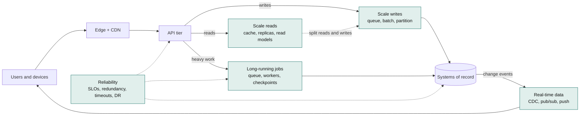

*[Open full-size diagram: The six scaling concerns on one request path (SVG)](diagrams/m0-the-six-scaling-concerns-on-one-request-path.svg)*

## 0.1 Scale Reads

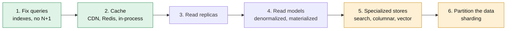

*[Open full-size diagram: The read-scaling ladder, cheapest rung first (SVG)](diagrams/m0-the-read-scaling-ladder-cheapest-rung-first.svg)*

### The idea

Most systems get far more reads than writes: often 10 to 1,000 times more. Reads are the easier side to scale, because a read can be answered from a **copy** of the data. The real question is always: **how old is that copy allowed to be?**

Work up the ladder from the cheapest step, and stop as soon as it's fast enough. Each step up adds cost and makes data a little more out of date.

1. **Fix the queries.** Add the right index, remove N+1 queries (one query per row in a loop), and page with "WHERE id > last_id" instead of `OFFSET`. This alone often makes things 10 to 100 times faster.
2. **Add caches, in layers:**
   - the browser (HTTP caching headers);
   - a **CDN** (servers close to users that store copies of pages and files);
   - a shared cache such as **Redis**;
   - a small in-memory cache inside each app process for the very hottest data.
3. **Add read replicas.** These are copies of the database that only serve reads. Each one adds read capacity, but it lags a little behind the primary.
4. **Build read models.** Tables or views where the answer is already computed, so a page loads with a single lookup instead of a join across many tables.
5. **Use a specialized store** for query types the main database is bad at: a search engine for text, a data warehouse for reports, a vector index for "find similar meaning".
6. **Split the data across machines (sharding)**, but only when the data itself no longer fits on one machine.

**Cache hit ratio matters more than it looks.** The database only sees the cache misses: `database load = total reads × (1 − hit ratio)`. At a 90% hit ratio the database gets 10% of reads. At 99% it gets 1%, which is **10 times less load**. Small gains near the top make a big difference.

### Caching patterns

| Pattern | How it works | Good | Bad |
|---|---|---|---|
| **Cache-aside** (most common) | The app checks the cache. On a miss it reads the database and saves the result in the cache | Simple. Only caches data that's actually used | The first read after expiry is slow. Easy to get cache clearing wrong |
| **Read-through** | The cache itself loads from the database on a miss | Loading logic is in one place | Needs a cache library that supports it |
| **Write-through** | Every write updates the cache and the database together | The cache is always fresh | Every write is slower. Caches data nobody reads |
| **Write-behind** | Writes go to the cache first, and the database is updated later | Very fast writes | Data is lost if the cache crashes first. **Never use for money** |
| **Refresh-ahead** | Refresh popular items before they expire | No slow first read | Wasted work refreshing items nobody wants anymore |

**Keeping the cache correct (invalidation):**

- Give every cached item a **TTL** (time to live), so it expires automatically.
- When data changes, **delete** the cache entry. Don't overwrite it, because two writers could leave the older value behind.
- There is still a small race condition: a reader loads the old row, a writer changes the database and deletes the cache entry, and then the reader saves its old copy into the cache. Fixes include short TTLs, storing a version number with the value, deleting the entry a second time a moment later, or "leases", where only the first request after a miss is allowed to fill the cache.
- A robust option is to clear cache entries from the **database's change stream (CDC)**. That way no code path can forget to do it.

**Common cache problems to design for:**

- **Cache stampede.** A popular item expires and thousands of requests all miss at once and hit the database together. Fixes:
  - **request coalescing ("single-flight")**: only one request loads the value while the rest wait for it;
  - **serve stale while refreshing**: return the old value while one request fetches the new one;
  - **add randomness to TTLs** so items don't all expire at the same moment.
- **Hot keys.** One item gets so much traffic that it overloads one cache server. Fixes: keep a copy in each app's local memory, spread copies across several cache keys, or put it on the CDN.
- **Cold cache.** After a restart, the cache is empty and every read hits the database. Make sure the database can survive a low hit ratio, warm the cache up first, and turn away extra load if needed.
- **The cache goes down.** Decide ahead of time what happens: read from the database with limits, or fail fast.

### Python: a cache with request coalescing, stale-while-refresh and random TTLs

```python
import asyncio
import json
import random
import time
from collections.abc import Awaitable, Callable

import redis.asyncio as redis

r = redis.Redis(host="cache", decode_responses=True)
_inflight: dict[str, asyncio.Future] = {}
_background: set[asyncio.Task] = set()


async def cached(key: str, loader: Callable[[], Awaitable[dict]],
                 ttl_s: float = 60, stale_s: float = 300) -> dict:
    """Serve fresh values from cache, serve stale values while refreshing, coalesce misses."""
    raw = await r.get(key)
    if raw is not None:
        entry = json.loads(raw)
        if time.time() >= entry["fresh_until"] and key not in _inflight:
            task = asyncio.create_task(_load(key, loader, ttl_s, stale_s))   # refresh in background
            _background.add(task)
            task.add_done_callback(_background.discard)
        return entry["value"]          # fresh, or stale-but-acceptable
    return await _load(key, loader, ttl_s, stale_s)


async def _load(key: str, loader: Callable[[], Awaitable[dict]],
                ttl_s: float, stale_s: float) -> dict:
    if (pending := _inflight.get(key)) is not None:
        return await asyncio.shield(pending)   # 5,000 concurrent misses -> 1 database query
    fut: asyncio.Future = asyncio.get_running_loop().create_future()
    fut.add_done_callback(lambda f: f.cancelled() or f.exception())   # never an unretrieved error
    _inflight[key] = fut
    try:
        value = await loader()
        fresh = ttl_s * random.uniform(0.9, 1.1)   # jitter: keys cached together expire apart
        entry = {"value": value, "fresh_until": time.time() + fresh}
        await r.set(key, json.dumps(entry), ex=int(fresh + stale_s))
        fut.set_result(value)
        return value
    except Exception as exc:
        fut.set_exception(exc)
        raise
    finally:
        if not fut.done():
            fut.cancel()
        _inflight.pop(key, None)
```

"Single-flight" here works **per app process**. With 200 app servers, a stampede becomes at most 200 database loads instead of thousands, which is usually fine. For very expensive loads, add a short Redis lock so only one server in the whole fleet refreshes the value while the rest keep serving the old one.

## 0.2 Scale Writes

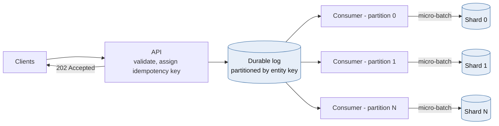

*[Open full-size diagram: Write-scaling path, from request to durable storage (SVG)](diagrams/m0-write-scaling-path-from-request-to-durable-storage.svg)*

### The idea

Writes are harder to scale than reads, for three reasons:

- they must be **saved safely** (written to disk and usually copied to a replica);
- writes to the same thing (like one bank account) often must happen **in order**;
- they **can't be answered from a copy**.

Every technique below does one of three things: it makes each write cheaper, groups many writes together, or spreads writes across more machines.

| Technique | What you gain | What you give up |
|---|---|---|
| **Cheaper writes** (fewer indexes, append new rows instead of updating, bulk `COPY`) | 2–10× faster on the same hardware | Some reads get slower without those indexes |
| **Batching** (save many writes in one go) | Far fewer disk syncs and round trips | Each write waits a few milliseconds for its batch |
| **Queue in front** (accept the request, reply "202 Accepted", process it later) | Traffic spikes are absorbed and the database works at a steady pace | The result isn't immediate. You need a way to report status, and safe retries |
| **Split data by key (sharding)** | Many machines accept writes at once | Operations across two shards get harder |
| **Write-optimized databases** (Cassandra, ScyllaDB, time-series databases) | Very high write rates | Reads and maintenance are harder |
| **Avoid fighting over one row** (append instead of update, split one counter into several) | No lock queue on busy rows | Reads must add the pieces together |
| **Mergeable data types (CRDTs)** | Writes in several regions without coordination | Only works for data that merges naturally, such as counters and sets |

**Ordering limits scaling.** If *everything* must be in one global order, one machine ends up doing the ordering, and it becomes the bottleneck. Usually only writes to the *same thing* need ordering, such as one account's transactions or one device's settings. So split the data by that key, and let everything else run in parallel.

**Hot partitions.** If one key is extremely busy (a huge merchant, a viral post, one big customer), it overloads its shard however many shards you have. Fixes: split the key into sub-keys (`merchant-42#0` to `#15`) and add them up when reading, append changes and combine them in batches, or give that key its own machine.

**A queue is a buffer, not extra capacity.** If messages arrive faster than you process them for long enough, the queue grows forever. Set a target such as "messages wait less than 30 seconds", add workers based on how long messages have been waiting (not on CPU), and turn requests away when the queue is too far behind.

### Python: an async micro-batcher

```python
import asyncio
from collections.abc import Awaitable, Callable
from typing import Generic, TypeVar

T = TypeVar("T")


class MicroBatcher(Generic[T]):
    """Coalesce concurrent writes into one flush. Each caller awaits its own durability."""

    def __init__(self, flush: Callable[[list[T]], Awaitable[None]], *,
                 max_items: int = 500, max_wait_s: float = 0.010, max_pending: int = 10_000) -> None:
        self._flush, self._max_items, self._max_wait = flush, max_items, max_wait_s
        self._q: asyncio.Queue[tuple[T, asyncio.Future]] = asyncio.Queue(maxsize=max_pending)

    async def submit(self, item: T) -> None:
        fut = asyncio.get_running_loop().create_future()
        await self._q.put((item, fut))   # a full queue applies backpressure to callers
        await fut                        # returns only after the batch is durably flushed

    async def run(self) -> None:
        loop = asyncio.get_running_loop()
        while True:
            batch = [await self._q.get()]
            deadline = loop.time() + self._max_wait
            while len(batch) < self._max_items and (remaining := deadline - loop.time()) > 0:
                try:
                    batch.append(await asyncio.wait_for(self._q.get(), remaining))
                except TimeoutError:
                    break
            try:
                await self._flush([item for item, _ in batch])
            except Exception as exc:
                for _, fut in batch:
                    if not fut.done():
                        fut.set_exception(exc)
            else:
                for _, fut in batch:
                    if not fut.done():
                        fut.set_result(None)


# Usage with asyncpg. ON CONFLICT makes a retried batch harmless.
async def flush_events(rows: list[tuple]) -> None:
    async with pool.acquire() as conn:
        await conn.executemany(
            "INSERT INTO telemetry (event_id, device_id, ts, payload) VALUES ($1, $2, $3, $4) "
            "ON CONFLICT (event_id) DO NOTHING", rows)
```

The trade-off is easy to tune. Waiting up to 10 ms adds a little delay to each write, but one database round trip and one commit now save up to 500 rows. That can mean 10 times more writes per second.

## 0.3 Split Reads and Writes

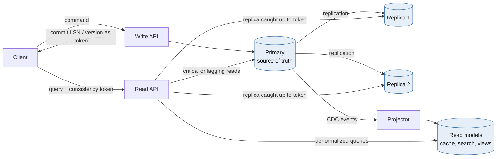

*[Open full-size diagram: Separating the read path from the write path (SVG)](diagrams/m0-separating-the-read-path-from-the-write-path.svg)*

### The idea

If reads and writes use separate paths, each side can grow and be optimized on its own, even with different databases. There are several levels. Each level gives you more read capacity, but data gets more out of date and there are more parts to run.

| Level | What's separated | How stale reads can be | Complexity |
|---|---|---|---|
| **L1** | Same database, but separate code for reads and writes | Not stale | Low |
| **L2** | Writes go to the primary, reads go to **replicas** | A little: milliseconds to seconds, sometimes minutes | Medium |
| **L3** | **CQRS**: separate read tables, built from change events | The time it takes to update the read tables | High |
| **L4** | Several read stores for different needs (search, cache, warehouse) | Different for each store | Highest |

**Problems this causes, and how to fix them:**

| Problem | Example | Fix |
|---|---|---|
| **Not seeing your own write** | You save your profile, refresh, and see the old version | After the write, give the client a **token** (the database's log position or a version). Only read from a replica that has caught up to that token, otherwise read from the primary |
| **Going back in time** | Two refreshes hit different replicas, and newer data seems to disappear | Keep a user on one replica, or remember the newest token they've seen |
| **Effects before causes** | A reply shows up before the message it answers | Carry tokens between services, or read both items from the same place |

**Write down a "freshness budget" for every page or API.** It turns a vague debate into a simple routing table:

| Read | How stale it may be | Where to read |
|---|---|---|
| Balance used to approve a payment | Must be current | Primary only |
| Balance shown right after your own transfer | Must include your own write | Replica if caught up, else primary |
| Transaction history page | Up to 5 seconds old | Replica |
| Monthly spending chart | Up to 1 hour old | Warehouse or read model |

**Where the routing decision can happen:**

- **In the app code** (SQLAlchemy `get_bind`, Django database routers; see Module 4). You have the most control, and it's the only place that knows each page's freshness budget.
- **In the database driver.** PostgreSQL's libpq can take several hosts and a `target_session_attrs` setting such as `read-write` or `prefer-standby` (PostgreSQL 14+). Great for failover, but it can't tell which reads are allowed to be stale.
- **In a proxy** (Pgpool-II for PostgreSQL, ProxySQL for MySQL). Invisible to the app, but it can't know which reads may be stale either.

### Python: read-your-own-writes using database log positions

```python
import asyncio
import random

import asyncpg


def lsn_to_int(lsn: str) -> int:
    hi, lo = lsn.split("/")
    return (int(hi, 16) << 32) | int(lo, 16)


class ReplicaLagTracker:
    """Polls each replica's replay position, so routing a read costs no extra query.
    The polled value can only trail reality, which errs toward the primary (safe)."""

    def __init__(self, replicas: dict[str, asyncpg.Pool], interval_s: float = 0.1) -> None:
        self._replicas, self._interval = replicas, interval_s
        self.replayed: dict[str, int] = {name: 0 for name in replicas}

    async def run(self) -> None:
        while True:
            for name, pool in self._replicas.items():
                try:
                    async with asyncio.timeout(0.05):
                        lsn = await pool.fetchval("SELECT pg_last_wal_replay_lsn()::text")
                    self.replayed[name] = lsn_to_int(lsn) if lsn else 0
                except (TimeoutError, OSError, asyncpg.PostgresError):
                    self.replayed[name] = 0   # unreachable means "infinitely behind"
            await asyncio.sleep(self._interval)

    def pick(self, min_lsn: int) -> str | None:
        caught_up = [n for n, lsn in self.replayed.items() if lsn >= min_lsn]
        return random.choice(caught_up) if caught_up else None


async def write_then_token(primary: asyncpg.Pool, sql: str, *args) -> str:
    async with primary.acquire() as conn:
        async with conn.transaction():
            await conn.execute(sql, *args)
        # Read after COMMIT: this position is at or beyond our commit record.
        return await conn.fetchval("SELECT pg_current_wal_lsn()::text")   # send as X-Consistency-Token


async def read_with_token(primary: asyncpg.Pool, replicas: dict[str, asyncpg.Pool],
                          tracker: ReplicaLagTracker, token: str | None, sql: str, *args):
    min_lsn = lsn_to_int(token) if token else 0
    name = tracker.pick(min_lsn)
    pool = replicas[name] if name else primary
    return await pool.fetch(sql, *args)
```

The client keeps the token (in a cookie or header) for a short time after its own write and sends it with reads. Everyone else reads from replicas without a token.

## 0.4 Real-Time Data

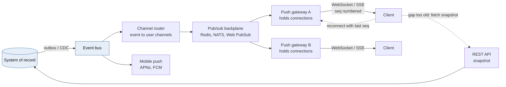

*[Open full-size diagram: Real-time delivery - capture, fan out, push, resync (SVG)](diagrams/m0-real-time-delivery-capture-fan-out-push-resync.svg)*

### The idea

Real-time data has two halves:

1. **Noticing changes** the moment they happen, using an outbox table or CDC (see Module 1) and events.
2. **Delivering** those changes to users and other systems quickly, using "push" channels.

Analysing data as it flows (like fraud detection in Module 5) is a separate topic.

**Ways to deliver updates:**

| Method | Direction | Delay | Good | Bad |
|---|---|---|---|---|
| Short polling (ask every few seconds) | Client asks | As long as the interval | Very simple | Many wasted requests |
| Long polling (server holds the request open until there's news) | Client asks | Low | Works everywhere | Constant reconnecting |
| **SSE (Server-Sent Events)** | Server → client | Low | Plain HTTP. Can resume where it left off | One direction only |
| **WebSocket** | Both directions | Lowest | Interactive, supports binary data | Keeps a connection open per user. Harder through proxies |
| Webhooks | Server → another server | Low | Standard way to notify partner systems | The receiver must be up. Needs retries and signature checks |
| Mobile push (APNs, FCM) | Server → phone | Seconds, best effort | Reaches apps that are closed | Delivery isn't guaranteed. Small payloads only |

**Rules that make real-time systems robust:**

- **The push channel is a shortcut. The API is the truth.** Messages *will* get lost, for example when a phone switches networks or a server restarts. So number every message. When a client reconnects, it sends the last number it saw. The server either **replays** what was missed, or tells the client to **reload a fresh snapshot** from the normal API. This is called the **snapshot + updates** pattern.
- **Keep the connection servers thin.** The servers that hold open connections should do little else. A pub/sub system (Redis, NATS, or managed services such as Azure Web PubSub) sends each event only to the servers that hold the right users' connections.
- **Push on write vs. pull on read.** For feeds, copying each post into every follower's inbox makes reading fast, but it's expensive for accounts with millions of followers. Many systems push for normal accounts and pull for huge ones.
- **Slow clients:** give each connection a small, limited buffer, and disconnect clients that can't keep up. For live prices or dashboards, send only the **latest** value and skip the in-between ones.
- **Important alerts need a second path.** A WebSocket message may be lost. For "your card was declined", also save the message to an inbox in the database, and use the push only as a hint to go check it.

### Python: a WebSocket feed that replays, reloads and sends heartbeats (Redis Streams)

```python
from fastapi import FastAPI, WebSocket, WebSocketDisconnect
import redis.asyncio as redis

app = FastAPI()
r = redis.Redis(host="events", decode_responses=True)


def _id_tuple(stream_id: str) -> tuple[int, int]:
    ms, seq = stream_id.split("-")
    return int(ms), int(seq)


@app.websocket("/v1/ws/accounts/{account_id}")
async def account_feed(ws: WebSocket, account_id: str, last_id: str | None = None) -> None:
    # Authenticate and authorize (this session owns account_id) BEFORE accept(). Omitted here.
    await ws.accept()
    stream = f"acct-events:{account_id}"   # capped with XADD ... MAXLEN ~ 1000
    try:
        cursor = last_id
        if cursor is not None:
            oldest = await r.xrange(stream, count=1)
            if oldest and _id_tuple(cursor) < _id_tuple(oldest[0][0]):
                await ws.send_json({"type": "resync"})   # gap too old: refetch snapshot via REST
                cursor = None
        if cursor is None:
            newest = await r.xrevrange(stream, count=1)
            cursor = newest[0][0] if newest else "0-0"   # pin a concrete position; never re-read "$"
        while True:
            resp = await r.xread({stream: cursor}, block=15_000, count=100)
            if not resp:
                await ws.send_json({"type": "ping"})   # keeps proxies from reaping idle sockets
                continue
            for _stream, entries in resp:
                for entry_id, fields in entries:
                    await ws.send_json({"type": "event", "id": entry_id, **fields})
                    cursor = entry_id
    except WebSocketDisconnect:
        return
```

**Important limit:** this example keeps one blocking Redis read per connected user. That's fine for thousands of users but wrong for hundreds of thousands. At that scale, each server process subscribes *once* to each channel, keeps its own list of which connections want which channel, and forwards messages in memory. The replay and reload rules stay the same.

## 0.5 Reliability

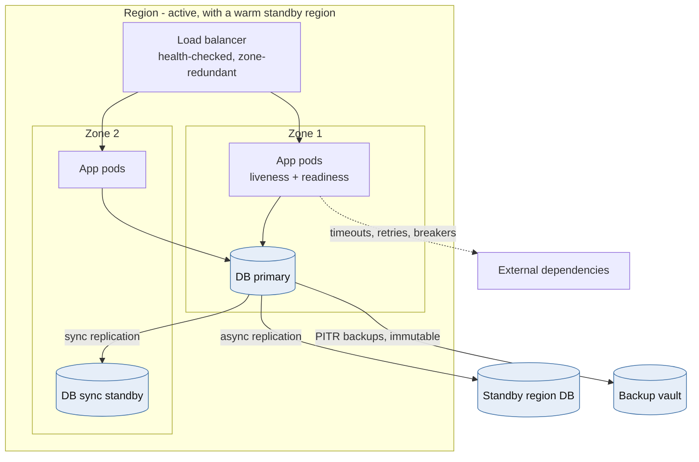

*[Open full-size diagram: Reliability layers, from process to region (SVG)](diagrams/m0-reliability-layers-from-process-to-region.svg)*

### The idea

Reliability means the system does what it promises, **as seen by users**. Some useful terms:

- **SLI:** something you measure, for example "the share of balance requests answered successfully within 300 ms".
- **SLO:** the target for it, for example "99.95% over 28 days".
- **SLA:** a promise in a contract. It is set a bit lower than the SLO, to leave a safety margin.
- **Error budget:** the failures your SLO allows. A 99.95% target allows about 22 minutes of failure per month. If you use it up, slow down releases. If you have plenty left, you can move faster.
- **RPO / RTO:** how much data you may lose, and how long recovery may take.

| Availability | Downtime allowed per 30 days |
|---|---|
| 99% | 7.2 hours |
| 99.9% | 43 minutes |
| 99.95% | 22 minutes |
| 99.99% | 4.3 minutes |

**Reliability maths:**

- **Things you depend on multiply together.** If your service needs five other services and each is up 99.9% of the time, your service is up at most 0.999⁵ ≈ **99.5%**.
- **Spare copies help**, if they fail independently. Two copies that are each up 99% give 1 − 0.01 × 0.01 = 99.99%.
- **In real life, failures are often linked.** The same bad deploy, the same config mistake or the same region outage can take out all copies at once. That's why spare copies alone aren't enough.

**What to do for each kind of failure:**

| What fails | Defence |
|---|---|
| A process crashes or leaks memory | Automatic restarts (for example Kubernetes), health checks |
| A machine dies | At least one spare copy behind a health-checked load balancer |
| A data centre zone goes down | Run copies in several zones. Keep a synchronous database standby in another zone |
| A whole region goes down | A standby region, with a failover plan you've practised |
| A service you call is slow or failing | Timeouts, retries with backoff, circuit breakers, separate connection pools (Module 3) |
| **A bad deploy or config change** (the most common cause of outages) | Release to a small slice of traffic first (canary), feature flags, automatic rollback |
| Data gets corrupted or deleted by mistake | Point-in-time backups that can't be edited or deleted. Note that replicas copy mistakes too, so a replica is not a backup |
| Too much traffic | Admission limits, dropping low-priority work, rate limits, autoscaling with spare room |

**Disaster recovery options:**

| Strategy | Time to recover | Data you might lose | Cost |
|---|---|---|---|
| Backup and restore | Hours to a day | Since the last backup (minutes with point-in-time recovery) | $ |
| Pilot light (data copied, servers switched off) | Tens of minutes to hours | Seconds to minutes | $$ |
| Warm standby (a smaller live copy running) | Minutes | Seconds | $$$ |
| Active-active (full copies all serving traffic) | Almost none | Almost none, but see the conflict problems in Module 4 | $$$$ |

**Health checks, done right:**

- **Liveness** asks "is this process stuck?" It should check almost nothing. If it checks the database, one database hiccup restarts every server at once.
- **Readiness** asks "should this server get traffic right now?" It says no while starting up and shutting down, and it *may* check important dependencies.
- Be careful: if every server's readiness check depends on the same database, they all go "not ready" together and the load balancer has nowhere to send traffic. Sometimes a partly working answer is better than none.

**Prove it works; don't hope.** Run practice outages ("game days"), deliberately break things in a controlled way (chaos testing), and **practise restoring backups**. A backup you have never restored might not work. Watch the four golden signals (latency, traffic, errors and saturation), and alert when you're burning through your error budget, not when CPU is high.

### Python: liveness vs. readiness, with warm-up and clean shutdown

```python
import asyncio
from contextlib import asynccontextmanager

from fastapi import FastAPI, Response

state = {"ready": False}


async def warm_up() -> None: ...        # open pools, load models, prime hot caches
async def close_pools() -> None: ...


@asynccontextmanager
async def lifespan(app: FastAPI):
    await warm_up()
    state["ready"] = True
    yield
    state["ready"] = False              # shutdown: stop claiming readiness
    await close_pools()


app = FastAPI(lifespan=lifespan)


@app.get("/livez")
async def livez() -> dict:
    return {"alive": True}              # never touch dependencies here


@app.get("/readyz")
async def readyz(response: Response) -> dict:
    if not state["ready"]:
        response.status_code = 503
        return {"ready": False, "reason": "starting_or_draining"}
    try:
        async with asyncio.timeout(0.3):
            await db_pool.fetchval("SELECT 1")
    except Exception:
        response.status_code = 503
        return {"ready": False, "reason": "database"}
    return {"ready": True}
```

On Kubernetes, add a `preStop` hook (for example, wait 10 seconds) and a shutdown grace period longer than your slowest request. Load balancers take a few seconds to stop sending traffic to a server that is shutting down. Without that wait, every deploy drops some requests.

## 0.6 Long-Running Jobs

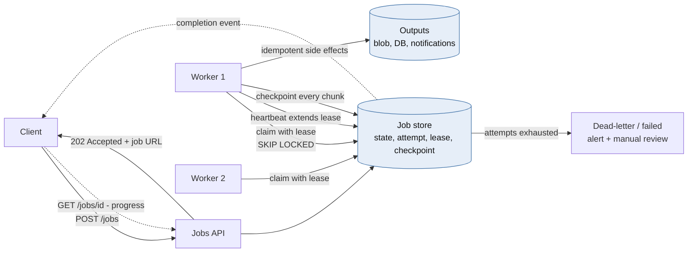

*[Open full-size diagram: Long-running jobs - async request-reply with leases and checkpoints (SVG)](diagrams/m0-long-running-jobs-async-request-reply-with-leases-and-checkp.svg)*

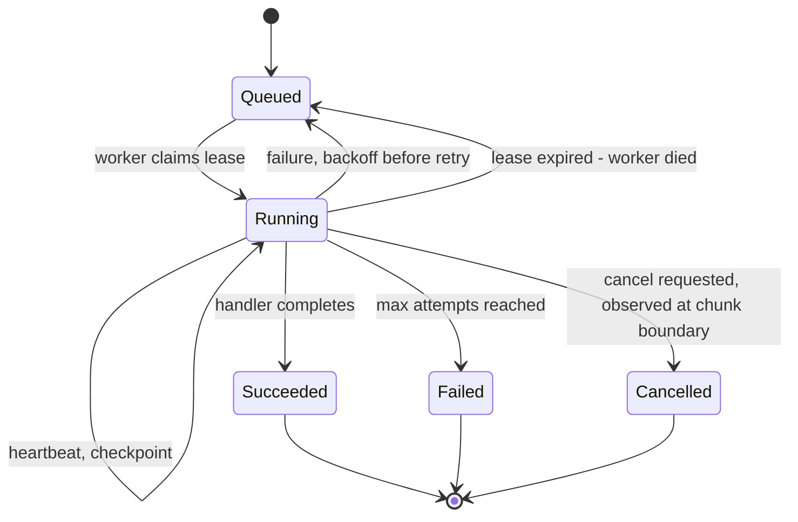

*[Open full-size diagram: Job lifecycle (SVG)](diagrams/m0-job-lifecycle.svg)*

### The idea

Some work is too big for one web request: making 3 million bank statements, exporting a customer's data, re-processing a document library, or running a data migration. **These jobs often run longer than the servers running them stay up.** Deploys, crashes, autoscaling and cloud machines being taken back all interrupt them. The goal is simple to state: **any job can be stopped at any moment and continue correctly later.**

**How the API should look (asynchronous request–reply):**

1. `POST /jobs` replies **`202 Accepted`** with a link (`/jobs/{id}`) where the client can check on the job. The request carries an idempotency key, so sending it twice doesn't start two jobs.
2. The client checks `GET /jobs/{id}` for status and progress, or gets notified when the job is done (webhook, SSE or email).
3. `POST /jobs/{id}/cancel` asks the job to stop.

**Ways to run jobs:**

| Option | Examples | Best for | Watch out for |
|---|---|---|---|
| **Task queue + workers** | Celery, RQ, Azure Service Bus + workers | Many small or medium tasks | Messages delivered twice. No built-in tracking across steps |
| **Database as the queue** | PostgreSQL with `FOR UPDATE SKIP LOCKED` | Moderate volume, when the job should be created in the same transaction as your data | Constant polling, and table growth at very high volume |
| **Batch computing** | Kubernetes Jobs, Azure Batch | Heavy parallel computing | Slow to start. Idle machines cost money |
| **Durable workflow engines** | Temporal, Azure Durable Functions, AWS Step Functions | Multi-step processes lasting minutes to months, with timers and human approvals | A new way of writing code, with rules to follow |
| **Pipeline schedulers** | Airflow, Azure Data Factory | Scheduled data pipelines | Not meant for on-demand jobs per user |

**How to make jobs survive failures:**

- **Leases and heartbeats.** A worker "borrows" a job for a limited time (a lease) and keeps renewing it (a heartbeat). If the worker dies, the lease runs out and another worker takes over. Short leases recover faster. Long leases are less likely to expire by mistake during a slow step.
- **Attempt numbers as fencing.** Each time a job is taken over, its attempt number goes up. Every progress update includes "attempt = mine". An old worker that wakes up can no longer overwrite anything. This is the same fencing idea as in Module 1.
- **Checkpoints.** Save your position after each chunk of work (for example, "last account processed"). A restarted job continues from there instead of starting over. Saving more often means less repeated work but more writes.
- **Every chunk must be safe to repeat.** After a crash, the last chunk may run twice. So use fixed file names, upserts, and duplicate checks on notifications.
- **Split big jobs.** Break them into many small tasks that run in parallel, track when they're all done, then combine the results. Small tasks are cheap to retry.
- **Cancelling is polite.** The job checks a "please stop" flag between chunks. Killing it mid-chunk can leave half-finished changes.
- **Limit retries.** Retry with growing waits, and after a set number of attempts, move the job to a "failed" (dead-letter) state and alert someone. One bad input must never block the queue forever.
- **Be fair and protect other systems.** Limit how many jobs each customer can run at once, so one huge export doesn't block everyone else. Cap total concurrency so jobs don't overload the databases and APIs they call.
- **Clean shutdown.** When the server is told to stop (`SIGTERM`), stop taking new work, finish or checkpoint the current chunk, and release the lease.

**Celery trap:** with Redis or SQS brokers, if a task runs longer than the broker's **visibility timeout**, the broker assumes the worker died and gives the task to another worker. Now two copies are running. Set that timeout longer than your longest task, use `acks_late=True`, and split long tasks into chunks.

### Python: a PostgreSQL job runner with leases, fencing and checkpoints

```sql
CREATE TABLE jobs (
    id               uuid PRIMARY KEY,
    kind             text        NOT NULL,
    payload          jsonb       NOT NULL,
    state            text        NOT NULL DEFAULT 'queued',  -- queued|running|succeeded|failed|cancelled
    attempt          int         NOT NULL DEFAULT 0,
    max_attempts     int         NOT NULL DEFAULT 5,
    lease_owner      text,
    lease_until      timestamptz,
    checkpoint       jsonb,
    progress         real        NOT NULL DEFAULT 0,
    cancel_requested boolean     NOT NULL DEFAULT false,
    run_after        timestamptz NOT NULL DEFAULT now(),
    last_error       text,
    created_at       timestamptz NOT NULL DEFAULT now()
);
CREATE INDEX jobs_claimable ON jobs (run_after) WHERE state IN ('queued', 'running');
```

```python
import asyncio
import json

import asyncpg

CLAIM = """
UPDATE jobs SET state = 'running', attempt = attempt + 1, lease_owner = $1,
       lease_until = now() + make_interval(secs => $2::float8)
 WHERE id = (SELECT id FROM jobs
              WHERE run_after <= now() AND attempt < max_attempts
                AND (state = 'queued' OR (state = 'running' AND lease_until < now()))
              ORDER BY run_after
              FOR UPDATE SKIP LOCKED
              LIMIT 1)
RETURNING id, kind, payload, attempt, checkpoint"""

# Every write below is fenced by (id, lease_owner, attempt): a stale worker matches zero rows.
HEARTBEAT = """UPDATE jobs SET lease_until = now() + make_interval(secs => $4::float8)
                WHERE id = $1 AND lease_owner = $2 AND attempt = $3 AND state = 'running'
            RETURNING cancel_requested"""
CHECKPOINT = """UPDATE jobs SET checkpoint = $4::jsonb, progress = $5
                 WHERE id = $1 AND lease_owner = $2 AND attempt = $3 AND state = 'running'"""
FINISH = """UPDATE jobs SET state = $4, progress = CASE WHEN $4 = 'succeeded' THEN 1 ELSE progress END,
                   lease_owner = NULL
             WHERE id = $1 AND lease_owner = $2 AND attempt = $3"""
RETRY_OR_FAIL = """UPDATE jobs SET state = CASE WHEN attempt >= max_attempts THEN 'failed' ELSE 'queued' END,
                          run_after = now() + make_interval(secs => least(3600, 30 * power(2, attempt))),
                          last_error = $4, lease_owner = NULL
                    WHERE id = $1 AND lease_owner = $2 AND attempt = $3"""


class LeaseLost(Exception):
    pass


async def run_one(pool: asyncpg.Pool, handlers: dict, worker_id: str, lease_s: float = 60) -> bool:
    job = await pool.fetchrow(CLAIM, worker_id, lease_s)
    if job is None:
        return False
    fence = (job["id"], worker_id, job["attempt"])
    cancel = asyncio.Event()

    async def heartbeat() -> None:
        while True:
            await asyncio.sleep(lease_s / 3)
            row = await pool.fetchrow(HEARTBEAT, *fence, lease_s)
            if row is None:
                raise LeaseLost(job["id"])       # someone else owns it now
            if row["cancel_requested"]:
                cancel.set()

    async def save(checkpoint: dict, progress: float) -> None:
        if await pool.execute(CHECKPOINT, *fence, json.dumps(checkpoint), progress) == "UPDATE 0":
            raise LeaseLost(job["id"])

    checkpoint = json.loads(job["checkpoint"]) if job["checkpoint"] else None
    try:
        async with asyncio.TaskGroup() as tg:
            hb = tg.create_task(heartbeat())
            outcome = await handlers[job["kind"]](json.loads(job["payload"]), checkpoint, save, cancel)
            hb.cancel()
    except ExceptionGroup as eg:
        if eg.subgroup(LeaseLost) is None:
            await pool.execute(RETRY_OR_FAIL, *fence, repr(eg.exceptions[0])[:2000])
        return True                              # on LeaseLost: stop quietly, touch nothing
    await pool.execute(FINISH, *fence, outcome)  # 'succeeded' or 'cancelled'
    return True


async def generate_statements(payload: dict, checkpoint: dict | None, save, cancel: asyncio.Event) -> str:
    """Example handler: resumable, chunked, idempotent (object key = account + cycle)."""
    cursor = (checkpoint or {}).get("after_account", "")
    done = (checkpoint or {}).get("done", 0)
    while not cancel.is_set():
        batch = await fetch_account_ids(payload["cycle"], after=cursor, limit=500)
        if not batch:
            return "succeeded"
        for account_id in batch:
            await render_and_store_statement(account_id, payload["cycle"])   # overwrite-safe
        cursor, done = batch[-1], done + len(batch)
        await save({"after_account": cursor, "done": done}, min(done / payload["expected"], 0.99))
    return "cancelled"
```

Notes:

- Run a small cleanup job (a "reaper") that marks jobs as `failed` when their lease expired *and* they have no attempts left. The claim query skips those jobs.
- Loop `run_one` with a pause when there's no work. PostgreSQL's `LISTEN/NOTIFY` can wake workers up instead of constant polling.
- **When to switch:** at thousands of jobs per second, or when jobs have many steps with timers and human approvals, move to a dedicated queue or a workflow engine such as Temporal. The same ideas (leases, fencing and checkpoints) still apply.

## 0.7 Case Study: A Digital Bank's Mobile Backend, Using All Six

**Scenario:** a Canadian online bank with 3 million customers. At the morning peak there are 5,000 account-summary reads and 800 money transfers every second. Customers expect balances to update instantly, with push notifications. Every account needs a monthly statement. Targets: 99.95% uptime for login and balance, and 99.9% for statements and exports.

| Concern | What we do | Why | What we accept |
|---|---|---|---|
| **Scale reads** | Account summaries come from a Redis read model (with single-flight and random TTLs). History comes from replicas | 5,000 reads/s at a 95% hit ratio leaves only 250/s for the database | Summaries can be seconds old, so the app shows "as of" times |
| **Split reads and writes** | A freshness budget per endpoint. Approvals read the primary. The screen after a transfer uses a token | Exact where money moves, scalable everywhere else | Routing logic in the app, and passing tokens around |
| **Scale writes** | The ledger is split by account (Module 1). Card network updates go into a queue and are saved in batches | 800 transfers/s, with room for 5× bursts | Some results arrive a moment later |
| **Real-time data** | Outbox → event bus → WebSocket servers with numbered messages and snapshot reload. Mobile push for important alerts, plus an inbox in the app | Instant updates without trusting the socket to never drop anything | We must build and test the reload path |
| **Reliability** | Every part in several zones, a standby region, canary deploys that stop when errors rise, and quarterly restore tests | Most outages come from deploys and dependencies, not hardware | Standby costs money. Releases are a bit slower |
| **Long-running jobs** | Statements are made in chunks of 500 accounts, with leases, checkpoints and fixed PDF file names | 3 million statements × ~200 ms ≈ 167 CPU-hours, so 50 four-core workers finish in under an hour | We need to run a job platform |

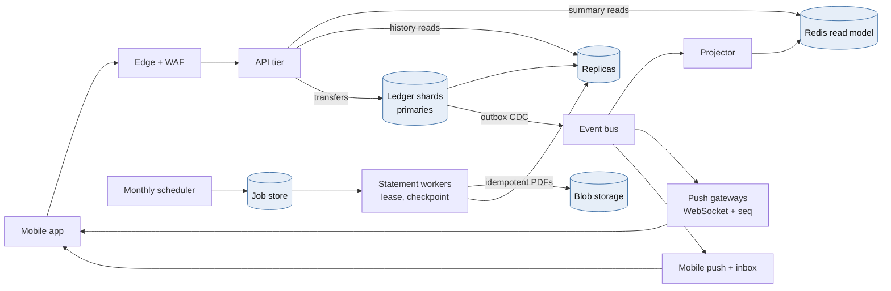

*[Open full-size diagram: Digital bank backend - all six concerns together (SVG)](diagrams/m0-digital-bank-backend-all-six-concerns-together.svg)*

## 0.8 Animation Plans

### A. A cache stampede, then single-flight

**Scene:** 30 small dots (requests) on the left, a cache box in the middle holding one item `rates:today` with a shrinking TTL bar, a database on the right with a load meter, and a response-time meter at the bottom.

| Time | Step | What you see | Manim tools |
|---|---|---|---|
| 0:00–0:04 | Cache is warm | Dots bounce off the cache and come back green. The database meter stays near zero | `MoveAlongPath`, `Indicate` |
| 0:04–0:07 | Item expires | The TTL bar reaches zero and the item turns grey | `ValueTracker` controlling the bar width |
| 0:07–0:12 | **Stampede** | All 30 dots miss at once and rush to the database. Its meter goes red, response time spikes, and some dots turn red (timeouts) | `LaggedStart` of 30 arrows, rotating needle |
| 0:12–0:14 | Rewind | Back to 0:04. Caption: *Same traffic, with single-flight and stale-while-refresh* | `Restore` |
| 0:14–0:20 | **Coalesced** | On expiry the item turns amber (*old but usable*). One dot goes to the database, and the other 29 get the old value right away. The database meter barely moves | One arrow to the database, 29 short bounces |
| 0:20–0:23 | Refreshed | The new value arrives and the item turns green with a slightly random new TTL. Nearby items show different TTL lengths | `Transform`, varied bar widths |
| 0:23–0:26 | Summary | *One loader per item. Serve old while refreshing. Randomize expiry times* | `Write` |

### B. A long job survives a crash

**Scene:** a progress track of 20 chunks, a job card (`attempt 1`, a lease ring, `checkpoint: —`), two workers (W1 and W2), and a bucket for output files.

| Time | Step | What you see | Manim tools |
|---|---|---|---|
| 0:00–0:05 | Start | W1 takes the job. Its lease ring starts, chunks light up one by one, and PDFs drop into the bucket | `FadeIn`, `LaggedStart` |
| 0:05–0:08 | Heartbeat and checkpoint | After each chunk, a checkpoint tag moves along the track. The lease ring refills with each heartbeat | Moving tag, ring refill |
| 0:08–0:10 | **Crash** | Lightning hits W1 in the middle of chunk 9. Heartbeats stop and the lease ring runs down | `Create(bolt)`, turn grey |
| 0:10–0:14 | Takeover | The lease runs out. W2 takes the job, which now shows `attempt 2`. W2 **starts after chunk 8**, not from zero. Chunk 9 runs again and its PDF replaces the identical file (*safe to repeat*) | `Transform`, `Indicate` |
| 0:14–0:18 | Old worker blocked | W1 wakes up and tries to save progress as `attempt 1`. The write bounces off: *0 rows updated* | Red `Flash`, arrow breaks |
| 0:18–0:22 | Done | W2 finishes chunk 20. The card turns green: *done, only 1 of 20 chunks repeated* | `Circumscribe` |

## 0.9 Review Questions

- For each endpoint, how stale is data allowed to be, and where is it read from?
- If the cache is flushed and the hit ratio drops to 50%, can the database survive?
- Which key decides the order of writes, and what happens if one key gets 100 times normal traffic?
- If a push message is lost, how does the app notice, and how does it recover?
- Which failure has a recovery path you've never tested? When did you last restore a backup?
- Can every long job be killed at any moment and continue correctly? How do you know?

---

# Module 1 — High-Throughput & Financial Systems

*Industry: Banking & Fintech*

## 1.1 Ideas & Trade-offs

### Event Sourcing

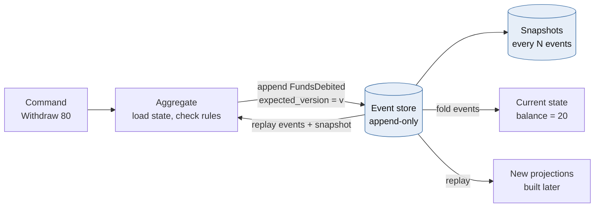

*[Open full-size diagram: Event sourcing - state is derived from facts (SVG)](diagrams/m1-event-sourcing-state-is-derived-from-facts.svg)*

**In plain words:** most apps store only the *current* value, such as "balance = 20". Event sourcing stores **every change that happened**, such as "deposited 100" and "withdrew 80", and works out the current value by adding them up.

```
state(t) = fold(apply, events[0..t], initial_state)
```

A bank ledger is the classic example. Banks don't just overwrite a balance. They record debits and credits (called **postings**), and the balance is the sum of those postings. Double-entry bookkeeping is really event sourcing, invented about 500 years before computers.

| Benefit | Cost |
|---|---|
| A complete history of every change, which auditors and regulators love | Events can never be changed, so old event formats must be supported forever |
| You can ask "what was the balance on March 31 at midnight?" | Adding up millions of events is slow, so you save **snapshots** every N events |
| You can build new reports later by replaying history | Privacy laws may require deleting personal data. The usual fix is to encrypt each person's data with their own key, and delete the key |
| You can debug by replaying exactly what happened | Every query needs a precomputed table (a "projection"). You can't just filter a table |
| Works well with the outbox pattern and CDC | Choosing what an event represents is a big decision that's hard to undo |

**Stopping two writers from clashing.** When saving new events, you say what version you expect: "append these events, but only if the stream is still at version 7". If someone else added an event first, the save fails and you retry with fresh data. A simple way to build this is a table with a unique constraint on `(stream_id, version)`.

**What most real ledgers do.** They keep an append-only `postings` table (the events), plus an `accounts.balance` column that is updated **in the same transaction**. The balance is a cached total that always matches the postings. You get the audit trail without waiting for balances to catch up.

### CQRS (Command Query Responsibility Segregation)

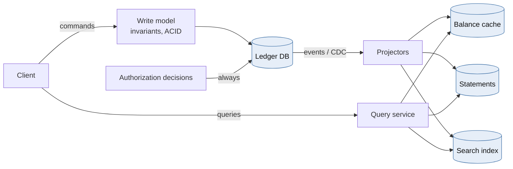

*[Open full-size diagram: CQRS - separate write model and read models (SVG)](diagrams/m1-cqrs-separate-write-model-and-read-models.svg)*

**In plain words:** use one model for **changing data** (commands) and different models for **reading data** (queries).

- The **write model** checks the rules ("is there enough money?"). It is small, strict and always correct.
- The **read models** are built for specific screens: a balance cache in Redis, a statement table, a search index. They are updated from events, so they may be a little behind.

Things to be careful about:

- **You might not see your own change right away.** A user transfers money, refreshes, and sees the old balance. Three common fixes:
  1. The write returns a version number, and the read waits (briefly) until the read model has reached that version, otherwise it reads the write model.
  2. The person who made the change reads from the write model, and everyone else reads the read models.
  3. The app shows the expected result straight from the write's response.
- **There's more to run:** the programs that update read models, rebuilds, error handling, and versioning.
- **Firm rule for money:** **decisions to approve a payment always read the write model, never a read model.** A read model that's 200 ms behind is fine for a statement page but dangerous for approving a withdrawal.
- **When not to use it:** simple screens where reading and writing look the same. There, CQRS is extra work for nothing.

### ACID vs. BASE

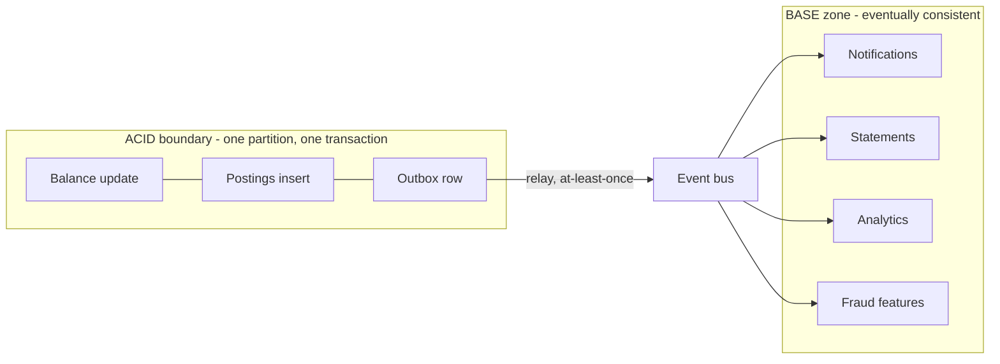

*[Open full-size diagram: ACID core, BASE periphery (SVG)](diagrams/m1-acid-core-base-periphery.svg)*

| | ACID | BASE |
|---|---|---|
| What it promises | All-or-nothing, rules kept, no interference, saved permanently | Available, may be temporarily out of date, catches up later |
| Where it works | Inside one database or one shard | Across the whole system |
| When things go wrong | Refuses or waits, to protect the rules | Accepts the work and fixes things up later |
| Ledger use | Changing balances and saving postings | Notifications, statements, reports, fraud data, search |

Real financial systems use **both**: ACID for the money-moving core, and BASE for everything that happens after. Deciding exactly where that line sits is a key design skill.

**Where double-spending bugs really hide: isolation levels.** PostgreSQL's default is `READ COMMITTED`.

- **Unsafe:** the app reads the balance, checks `balance >= amount` in Python, then writes the new balance. Two requests both read 100, both pass the check, and both write 20. **160 was paid out of 100.** This is called a *lost update*.
- **Safe:** `UPDATE accounts SET balance = balance - :amt WHERE id = :id AND balance >= :amt`. The row lock makes the second request wait, and PostgreSQL re-checks the WHERE condition against the latest balance. The second request sees 20, the check fails, and zero rows are updated.
- **Also safe:** lock the row first with `SELECT ... FOR UPDATE`, then check.
- **Write skew:** under `REPEATABLE READ`, two transactions can each read a *different* row and both break a rule that covers both rows, such as "joint accounts A + B must stay at or above 0". Only `SERIALIZABLE` isolation, or locking *every* row involved, prevents this.

**Transactions that span several services:**

| | Two-Phase Commit (2PC) | Saga |
|---|---|---|
| How | A coordinator asks everyone "ready?", then says "commit" | A chain of steps. Each step has an "undo" step (a *compensation*) |
| All-or-nothing? | Yes | Not exactly: failed chains are undone step by step |
| Can others see half-done work? | No, rows stay locked | Yes, so you need "pending" states |
| If the coordinator crashes | Others wait, **stuck holding locks** | The undo steps can fail too, so they must be safe to retry |
| Best for | Inside one database cluster | Across services and banks |

### Idempotency in Distributed Transactions

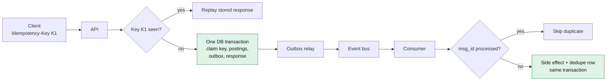

*[Open full-size diagram: Idempotency key and outbox flow (SVG)](diagrams/m1-idempotency-key-and-outbox-flow.svg)*

Messages can be delivered **at most once** (may be lost), **at least once** (may be duplicated) or **exactly once**. True exactly-once delivery across a network is impossible. Kafka's "exactly-once" only covers work that stays inside Kafka. Once you write to a database, send a file or send an email, messages can arrive twice again.

**So: "exactly once" in practice = at-least-once delivery + a handler that is safe to repeat + a "done" record saved in the same transaction as the change.**

How to design an **idempotency key** for a payments API:

- The **client creates** a unique ID (a UUID) for each real operation and sends it in a header. The database has `UNIQUE(client_id, key)`.
- Save a **fingerprint** (a hash) of the request body with the key. If the same key arrives with a different body, reply `422`. This catches client bugs.
- **Save the response**, and return it again on retries.
- **Keep keys longer** than the client's retry window: 24 hours to 7 days.
- **Save business failures too**, such as "insufficient funds". Otherwise a retry after a deposit could succeed, and the same request would have two different outcomes.
- **The outbox pattern:** write the event into an `outbox` table *in the same transaction* as the money change. A separate process (CDC such as Debezium, or a poller) publishes it. This avoids the classic bug where the database commit works but publishing to Kafka fails.

## 1.2 Python: Idempotent Consumers, Celery/FastAPI, and Redis Locks

### A clear position on Redis locks (Redlock)

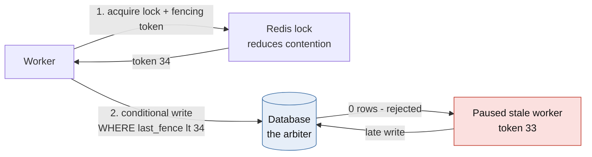

*[Open full-size diagram: Locks for efficiency, fences for correctness (SVG)](diagrams/m1-locks-for-efficiency-fences-for-correctness.svg)*

**Redlock** takes a lock with an expiry time on a majority of several independent Redis servers (usually 5). A well-known criticism (Martin Kleppmann, 2016, with a reply from Redis creator Salvatore Sanfilippo) points out:

- **A worker can freeze** (garbage collection, a VM pause) for longer than the lock's expiry time. It wakes up thinking it still holds a lock that someone else now has.
- **There's no fencing token**, so the database can't tell the old owner from the new one.
- **It depends on timing**, and clocks and networks don't always behave.
- With a *single* Redis server, a failover can lose the lock completely.

**Practical position:** use a Redis lock to make things **faster** (fewer workers fighting over the same account, fewer deadlocks). Use the **database** to keep things **correct**, with a conditional write that includes a **fencing token** or version number. If the lock fails, you get some extra retries, never a double-spend.

### FastAPI: a money-transfer endpoint that's safe to retry

```python
from __future__ import annotations

import hashlib
import json
import uuid
from decimal import Decimal
from typing import Annotated

from fastapi import FastAPI, Header, HTTPException
from pydantic import BaseModel, Field
from sqlalchemy import text
from sqlalchemy.ext.asyncio import async_sessionmaker, create_async_engine

engine = create_async_engine("postgresql+asyncpg://ledger@ledger-db/ledger", pool_size=20)
Session = async_sessionmaker(engine, expire_on_commit=False)
app = FastAPI()


class TransferIn(BaseModel):
    source: uuid.UUID
    dest: uuid.UUID
    amount: Decimal = Field(gt=0, max_digits=18, decimal_places=2)  # never float for money
    currency: str = Field(pattern=r"^[A-Z]{3}$")


def fingerprint(body: TransferIn) -> str:
    return hashlib.sha256(body.model_dump_json().encode()).hexdigest()


@app.post("/v1/transfers", status_code=201)
async def create_transfer(
    body: TransferIn,
    idempotency_key: Annotated[uuid.UUID, Header()],
    client_id: Annotated[str, Header(alias="X-Client-Id")],
) -> dict:
    fp = fingerprint(body)
    params = {"c": client_id, "k": idempotency_key}
    async with Session() as s, s.begin():
        # 1. Claim the key. The UNIQUE(client_id, key) constraint is the real guard.
        #    A concurrent duplicate blocks here on the unique index until we commit,
        #    then hits the conflict and replays our stored response.
        claimed = await s.execute(
            text("""INSERT INTO idempotency_keys (client_id, key, fingerprint)
                    VALUES (:c, :k, :fp) ON CONFLICT (client_id, key) DO NOTHING
                    RETURNING key"""),
            {**params, "fp": fp},
        )
        if claimed.first() is None:
            row = (await s.execute(
                text("SELECT fingerprint, response FROM idempotency_keys "
                     "WHERE client_id = :c AND key = :k"), params)).one()
            if row.fingerprint != fp:
                raise HTTPException(422, "Idempotency-Key reused with a different payload")
            return row.response  # byte-identical replay

        # 2. Lock both accounts in canonical (sorted) order. This prevents the
        #    A->B / B->A deadlock between concurrent transfers.
        ids = sorted([body.source, body.dest])
        rows = (await s.execute(
            text("SELECT id, balance, currency FROM accounts "
                 "WHERE id = ANY(:ids) ORDER BY id FOR UPDATE"), {"ids": ids})).all()
        accts = {r.id: r for r in rows}
        if len(accts) != 2 or any(a.currency != body.currency for a in accts.values()):
            raise HTTPException(404, "Account not found or currency mismatch")
        if accts[body.source].balance < body.amount:
            # Simplification: rolling back also releases the key. Many PSPs instead
            # persist the 409 so that retries replay the same decision.
            raise HTTPException(409, "Insufficient funds")

        # 3. Mutate balance, append postings (the events), write the outbox. One transaction.
        tx_id = uuid.uuid4()
        amt = {"amt": body.amount}
        await s.execute(text("UPDATE accounts SET balance = balance - :amt, version = version + 1 "
                             "WHERE id = :id"), {**amt, "id": body.source})
        await s.execute(text("UPDATE accounts SET balance = balance + :amt, version = version + 1 "
                             "WHERE id = :id"), {**amt, "id": body.dest})
        await s.execute(
            text("INSERT INTO postings (tx_id, account_id, amount) "
                 "VALUES (:t, :src, -:amt), (:t, :dst, :amt)"),
            {"t": tx_id, "src": body.source, "dst": body.dest, **amt})
        response = {"tx_id": str(tx_id), "status": "completed"}
        await s.execute(
            text("INSERT INTO outbox (aggregate_id, event_type, payload) "
                 "VALUES (:t, 'TransferCompleted', CAST(:p AS jsonb))"),
            {"t": tx_id, "p": body.model_dump_json()})
        await s.execute(
            text("UPDATE idempotency_keys SET response = CAST(:r AS jsonb) "
                 "WHERE client_id = :c AND key = :k"),
            {**params, "r": json.dumps(response)})
        return response
```

Why it's built this way:

- Claiming the key, checking the rules, saving the postings, writing the outbox and saving the response all happen in **one transaction**. There's no moment where money moved but the key wasn't saved.
- Because it's all one transaction, you don't need an "in progress" state. You *do* need one if the operation calls something outside the database (like a card network). In that case, save "in progress", reply `409 Retry-After` to duplicates, and run a sweeper for stuck keys.
- Add a `CHECK (balance >= 0)` constraint to accounts that can't go negative. It's a free last line of defence.

### Celery: a consumer that's safe to repeat, with a fenced lock

```python
import secrets
from contextlib import contextmanager
from collections.abc import Iterator

import redis
from celery import Celery
from sqlalchemy import create_engine, text

app = Celery("ledger", broker="redis://redis:6379/0")
app.conf.update(
    task_acks_late=True,               # ack only after the task body finishes
    task_reject_on_worker_lost=True,   # redeliver if the worker process dies mid-task
    worker_prefetch_multiplier=1,      # don't hoard messages on a busy worker
    broker_transport_options={"visibility_timeout": 3600},  # Redis broker redelivers after this
)
db = create_engine("postgresql+psycopg://ledger@ledger-db/ledger", pool_size=10)
r = redis.Redis(host="redis", decode_responses=True)

# Acquire and issue the fencing token ATOMICALLY. If INCR ran as a separate call,
# a paused holder could wake up and draw a *higher* token than the current holder.
ACQUIRE = r.register_script("""
if redis.call('SET', KEYS[1], ARGV[1], 'NX', 'PX', ARGV[2]) then
  return redis.call('INCR', KEYS[2])
end
return 0
""")
RELEASE = r.register_script("""
if redis.call('GET', KEYS[1]) == ARGV[1] then return redis.call('DEL', KEYS[1]) end
return 0
""")


class LockBusy(Exception): ...
class StaleFence(Exception): ...


@contextmanager
def fenced_lock(resource: str, ttl_ms: int = 2_000) -> Iterator[int]:
    owner = secrets.token_hex(16)
    keys = [f"lock:{resource}", f"fence:{resource}"]
    token = int(ACQUIRE(keys=keys, args=[owner, ttl_ms]))
    if token == 0:
        raise LockBusy(resource)
    try:
        yield token
    finally:
        RELEASE(keys=keys[:1], args=[owner])  # only delete the lock if we still own it


@app.task(bind=True, autoretry_for=(LockBusy, StaleFence),
          retry_backoff=True, retry_jitter=True, max_retries=8)
def apply_debit(self, msg_id: str, account_id: str, amount_minor: int) -> str:
    with fenced_lock(f"acct:{account_id}") as fence, db.begin() as conn:
        # Dedupe record and side effect share one transaction: effectively-once.
        fresh = conn.execute(
            text("INSERT INTO processed_messages (msg_id) VALUES (:m) "
                 "ON CONFLICT DO NOTHING RETURNING msg_id"), {"m": msg_id}).first()
        if fresh is None:
            return "duplicate"

        # The database is the arbiter. The write applies only if our fence is newer
        # than the last fence that touched this row AND the invariant holds.
        ok = conn.execute(
            text("""UPDATE accounts
                       SET balance_minor = balance_minor - :a, last_fence = :f
                     WHERE id = :id AND last_fence < :f AND balance_minor >= :a
                 RETURNING balance_minor"""),
            {"a": amount_minor, "f": fence, "id": account_id}).first()
        if ok is None:
            current = conn.execute(text("SELECT last_fence FROM accounts WHERE id = :id"),
                                   {"id": account_id}).scalar_one()
            if current >= fence:
                raise StaleFence(account_id)   # rollback (dedupe row too) and retry
            conn.execute(text("INSERT INTO rejections (msg_id, reason) "
                              "VALUES (:m, 'insufficient_funds')"), {"m": msg_id})
            return "insufficient_funds"         # terminal, recorded, commits
        return "applied"
```

**Honest caveats:**

- A Redis counter can go *backwards* if Redis fails over to a replica that was behind. The strongest option takes the fence number from the database (a sequence, or the row's own `version`), which is just optimistic locking. The Redis lock then only reduces contention.
- If every write already uses `UPDATE ... WHERE balance >= :a` inside a transaction, you *don't need* the Redis lock for correctness. Add it only when busy rows exhaust your connection pool, or when the protected work includes steps outside the database.
- Store money as **whole cents (integers)** or `Decimal`. **Never use `float`.**

## 1.3 Case Study: A 10,000 TPS Ledger with Zero Double-Spend

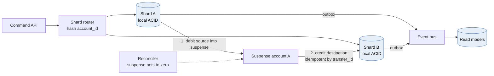

*[Open full-size diagram: Sharded ledger with cross-shard saga (SVG)](diagrams/m1-sharded-ledger-with-cross-shard-saga.svg)*

**Requirements:** 10,000 transactions per second normally, and 30,000 at peak (payday, Black Friday). 99% of payment approvals within 150 ms. No data loss in a region, and recovery within 60 seconds. **No double-spending, ever.** Seven years of records that can't be altered.

### Rough numbers

| What | Estimate |
|---|---|
| Postings per second | 10,000 × 2 = 20,000 rows/s (60,000 at peak) |
| Data written | ~500 bytes per posting, including indexes → ~10 MB/s |
| Growth per day | 864 million transactions/day → about 1 TB/day |
| Seven years | Petabytes. So keep 90 days in the main database and move older data to cheap storage (Parquet files in ADLS Gen2, S3 or GCS) with "can't delete" (WORM) rules |
| One database server's limit | A well-tuned PostgreSQL primary with a synchronous standby can handle thousands to low tens of thousands of short write transactions per second. At 30,000 per second, each locking two rows, there is **no spare room**, and busy rows slow things further |

**Conclusion:** split the ledger across several databases, by account.

### Design decisions

**Splitting (sharding).** Hash account IDs into shards. Start with 32 logical shards on fewer servers, so you can split later without rehashing everything. A transfer inside one shard is a normal transaction. A transfer **between** shards becomes a **saga**:

1. Move money from the source account into a "money in transit" (**suspense**) account on its shard.
2. Credit the destination.

Both steps are safe to repeat thanks to the transfer ID. A reconciliation job checks that every suspense account nets to zero.

**Three ways to make sure one account's writes happen one at a time:**

| Option | How | Good | Bad |
|---|---|---|---|
| **A. Row locks** (the code above) | `FOR UPDATE` or a conditional `UPDATE` in PostgreSQL | Familiar, strictly correct, easy to audit | Busy accounts queue up. Must lock in a fixed order to avoid deadlocks |
| **B. One worker per partition** | Send commands keyed by account into Kafka/Event Hubs partitions. One worker per partition keeps balances in memory and saves in batches | No locks, very fast, strict order | Pauses when partitions move. The in-memory state must be rebuilt after restarts |
| **C. Distributed SQL database** | Spanner, CockroachDB, YugabyteDB | Handles splitting for you | Transactions across regions are slower. Vendor lock-in. Cost |

Most banks choose **A**, and use **B** for their busiest flows. Purpose-built ledger databases such as TigerBeetle take option B to the extreme.

**Very busy accounts.** A marketplace account might receive 2,000 payments per second. Row locks handle maybe 1,000–3,000 per second on one row, and everything else touching it waits. Two fixes:

- **Adding money can happen in any order.** Save the credits without locking the balance, and add them to the balance in small batches. Only *withdrawals* need the "enough money?" check.
- **Split the balance across K sub-accounts** (`merchant-123#0` to `#15`). Each credit picks one at random, and reads add them up.

**Reads (CQRS):** a Redis balance cache (display only, labelled "as of"), statement tables on a replica, search, and reports in a data lake. **Payment approvals never read these.**

**Automatic checks that run all the time:**

- Every transaction's postings add up to zero.
- The daily trial balance nets to zero.
- Each account's postings add up to its balance.
- Read models match the write model.

Any mismatch alerts the on-call engineer. These checks are cheaper than any lock, and they catch bugs that locks can't.

**Azure services:** Azure Database for PostgreSQL Flexible Server with zone-redundant HA, per shard (or Citus for sharding). Event Hubs (Kafka API) for events. Azure Cache for Redis. ADLS Gen2 with immutability policies for the archive. Key Vault for encryption keys.

## 1.4 Diagram: Command and Query Paths

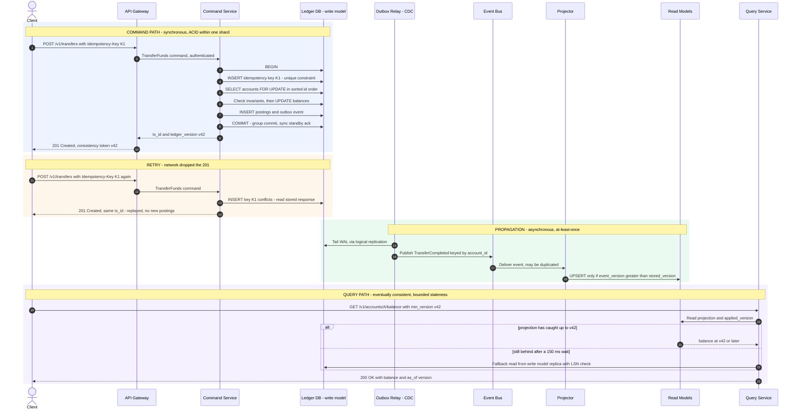

*[Open full-size diagram: Command and query paths (SVG)](diagrams/m1-command-and-query-paths.svg)*

## 1.5 Animation Plan: A Double-Spend Race Blocked by a Fenced Lock

**Scene (Manim, 1920×1080, 60 fps, dark background):**

- **Bottom centre:** a green box *Ledger DB* showing `balance = 100 | last_fence = 32`.
- **Top centre:** a grey padlock labelled *Redis lock: free*, with a timer ring beside it.
- **Left:** worker **W1** (blue circle). **Right:** worker **W2** (orange circle). Each has a speech bubble saying `withdraw 80`.
- A caption bar at the bottom for narration.

There are three acts: the race with no lock, the race with a lock, and the case where the lock alone isn't enough.

| Time | Act | What you see | Manim tools |
|---|---|---|---|
| 0:00–0:03 | **I. No lock** | Title: "Two withdrawals, one balance" | `Write`, `FadeOut` |
| 0:03–0:07 | I | W1 and W2 both send a `READ` arrow to the database at the same time. Both bubbles say `saw 100` | Two `GrowArrow`s together |
| 0:07–0:10 | I | Both work out `100 − 80 = 20` | `TransformMatchingTex` |
| 0:10–0:14 | I | Both `WRITE 20`. The balance shows 20, and a red counter shows "paid out: 160" | `Transform`, red `Flash` |
| 0:14–0:17 | I | Caption: **"Lost update: 160 paid out of 100."** The screen fades and rewinds | `Wiggle`, rewind |
| 0:17–0:21 | **II. With a lock** | W1 takes the lock. It turns blue and shows `W1 · token 33`, and the timer ring starts | `Indicate`, timer arc |
| 0:21–0:24 | II | W2 tries to take the lock, bounces off with a "busy" spark, and curves back along a dashed path labelled `wait and retry` | `MoveAlongPath`, `Flash` |
| 0:24–0:28 | II | W1 writes. The database shows `balance = 20 | last_fence = 33`. The lock is released and turns grey | `Transform` |
| 0:28–0:33 | II | W2 retries, gets `token 34`, reads 20, and its bubble says `20 < 80 → REJECT: not enough money` | `Write`, `Circumscribe` |
| 0:33–0:36 | II | Caption: **"The lock made them take turns. But only if the lock holder is alive and on time…"** | — |
| 0:36–0:40 | **III. Freeze** | Reset to 100 / fence 32. W1 takes `token 33`, then freezes: it turns grey with ice, labelled `paused 4.2 s` | Fade, `FadeIn` |
| 0:40–0:44 | III | The timer ring runs out. The lock opens: *lock expired* | Timer to zero |
| 0:44–0:48 | III | W2 takes `token 34` and writes. The database shows `balance = 20 | last_fence = 34` | `Transform` |
| 0:48–0:53 | III | W1 unfreezes, still thinks it has the lock, and sends `WRITE ... fence=33`. A shield rises from the database: **`only if last_fence < 33` → 0 rows**. The arrow breaks | Shield, `ShowPassingFlash`, arrow falls |
| 0:53–0:58 | III | Summary panel: *Lock = speed* on the left, *Fence + conditional write = correctness* on the right | `VGroup.arrange` |

**Manim code for Act III:**

```python
from manim import *


class FencedLockRace(Scene):
    def construct(self) -> None:
        db = RoundedRectangle(width=5, height=1.6, corner_radius=0.2, color=GREEN).shift(DOWN * 2.5)
        state = Text("balance=100   last_fence=32", font_size=28).move_to(db)
        lock = RoundedRectangle(width=3.2, height=1.1, corner_radius=0.2, color=GREY).shift(UP * 2.6)
        lock_lbl = Text("lock: free", font_size=24).move_to(lock)
        w1 = Circle(radius=0.6, color=BLUE, fill_opacity=0.6).shift(LEFT * 5)
        w2 = Circle(radius=0.6, color=ORANGE, fill_opacity=0.6).shift(RIGHT * 5)
        self.play(*[FadeIn(m) for m in (db, state, lock, lock_lbl, w1, w2)])

        # W1 acquires token 33; the TTL ring starts draining.
        ttl = ValueTracker(1.0)
        ring = always_redraw(lambda: Arc(
            radius=0.45, start_angle=PI / 2, angle=-TAU * max(ttl.get_value(), 1e-3), color=BLUE,
        ).move_arc_center_to(lock.get_right() + RIGHT * 0.8))
        self.add(ring)
        self.play(lock.animate.set_color(BLUE),
                  Transform(lock_lbl, Text("W1 · token 33", font_size=24, color=BLUE).move_to(lock)))

        # W1 freezes while the lease expires.
        pause = Text("GC pause", font_size=22).next_to(w1, UP)
        self.play(w1.animate.set_fill(GREY, opacity=0.3), FadeIn(pause))
        self.play(ttl.animate.set_value(0), run_time=3, rate_func=linear)
        self.play(lock.animate.set_color(ORANGE),
                  Transform(lock_lbl, Text("W2 · token 34", font_size=24, color=ORANGE).move_to(lock)))

        # W2 writes with fence 34.
        a2 = Arrow(w2.get_bottom(), db.get_right(), color=ORANGE)
        self.play(GrowArrow(a2))
        self.play(Transform(state, Text("balance=20   last_fence=34", font_size=28).move_to(db)))
        self.play(FadeOut(a2))

        # W1 wakes up and tries a stale write: the DB rejects it.
        self.play(w1.animate.set_fill(BLUE, opacity=0.6), FadeOut(pause))
        a1 = Arrow(w1.get_bottom(), db.get_left(), color=BLUE)
        self.play(GrowArrow(a1))
        verdict = Text("fence 33 ≤ 34 → REJECTED", font_size=30, color=RED).next_to(db, UP)
        self.play(Flash(db.get_left(), color=RED), Write(verdict))
        self.play(FadeOut(a1, shift=DOWN))
        self.wait()
```

## 1.6 Review Questions

- Exactly which data is protected by transactions, and what would happen to the business if everything else were 5 seconds out of date?
- When an operation fails for a business reason, is the failure saved, and does a retry get the same answer?
- If Redis is completely down, does the ledger stop, slow down, or become wrong? (The right answer is "slow down".)
- How long does it take to replay the biggest account's history, and how often are snapshots taken?
- Which automatic check would have caught your last production incident?

---

# Module 2 — AI & LLM Infrastructure at Scale

*Industry: Generative AI & Autonomous Agents*

## 2.1 Ideas & Trade-offs

### Vector databases and ANN indexing

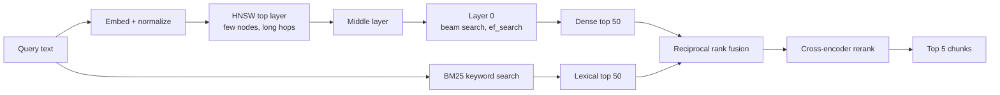

*[Open full-size diagram: Hybrid retrieval pipeline (SVG)](diagrams/m2-hybrid-retrieval-pipeline.svg)*

**In plain words:** an **embedding** turns text into a list of numbers (a **vector**), so texts with similar meaning get similar numbers. A **vector database** stores millions of these and quickly finds the ones closest to a question's vector.

Checking every vector one by one is exact but slow. For 10 million chunks of 1,024 numbers each, that's about 10 billion multiplications per question. **ANN (approximate nearest neighbour)** indexes find *almost* the best matches much faster. Every index choice is a balance between three things:

- **recall**: how often the true best matches are found;
- **speed**;
- **memory**.

**HNSW (Hierarchical Navigable Small World)** is the most popular index. Think of it as a stack of road maps:

- The **top map** has only a few cities with long highways between them. Lower maps have more cities and shorter roads. The **bottom map** has every point.
- **Searching:** start at the top, keep moving to whichever neighbour is closest to your question, and drop down a level when you can't get any closer. On the bottom level, keep a shortlist of the best `ef_search` candidates while exploring.
- **Settings:**
  - `M` is the number of neighbours each point links to. More means better recall and more memory.
  - `ef_construction` is how carefully the index is built. Higher gives a better index but builds more slowly.
  - `ef_search` is how widely to search at question time. This is the **main knob for accuracy vs. speed**, and you can change it for each query.
- **Memory:** 10 million vectors × 1,024 floats ≈ 41 GB, plus 2–3 GB for the links. **It all lives in RAM.**
- **Weaknesses:** deleting items leaves gaps that slowly make the index worse, so it needs occasional rebuilds. Building is slow. Strict filters (see below) can break it.

**Other index types:**

| Index | How it works | Memory | Accuracy at the same speed | Updates | Use when |
|---|---|---|---|---|---|
| Flat (check everything) | Exact scan, often on a GPU | 1× | 100% | Easy | Under ~1M vectors, or small filtered subsets |
| **HNSW** | Layered graph | ~1.1–1.5× | Excellent | Adds are fine, deletes are poor | The default for under ~100M vectors in RAM |
| IVF-Flat | Group vectors into clusters and search only the nearest clusters | ~1× | Good | Cheap. Retrain when data changes | Large collections, GPU |
| IVF-PQ | Clusters plus compression (a 4 KB vector becomes 64 bytes) | ~0.02× | Lower. Re-check the top results with full vectors | Retrain | Billions of vectors, on a tight budget |
| DiskANN | Graph stored on SSD, compressed vectors in RAM | Mostly SSD | Very good | Good | Hundreds of millions of vectors without the RAM for HNSW |

Smaller number formats also help: 8-bit numbers use 4× less memory and lose 1–2 points of accuracy, and 1-bit uses 32× less but needs a re-check step. Always **normalize** vectors (scale them to length 1), so the cheaper dot-product calculation gives the same answer as cosine similarity.

**The filtering trap.** Business apps always filter, for example by customer, country, document version or who is allowed to see what.

- **Filter after searching:** find the top 10, then remove those that fail the filter. You might end up with zero results.
- **Filter before searching:** pick the allowed items, then check them all exactly. This is fast when the allowed set is small.
- **Filter during the search:** skip disallowed points while walking the graph. With strict filters, the graph falls apart into disconnected islands and results get worse.
- **Best answer:** when the filter is a **security or legal boundary**, keep **separate indexes** (per customer or per country) instead of filtering. You get isolation you can prove, stable accuracy, and simpler management. Use filters only for "nice to have" relevance rules.

**Hybrid search.** Embeddings are weak at exact words such as policy numbers, product codes and names like "Reg E". So also run a **keyword search (BM25)** in parallel, and merge the two result lists with **Reciprocal Rank Fusion**: each result scores `1 / (60 + its rank)` in each list, and the scores are added. Then a **reranker** model (a cross-encoder) re-scores the top ~50 and picks the best 5–8. It adds about 30–150 ms, and it's usually the single biggest quality improvement.

### Retrieval-Augmented Generation (RAG) pipelines

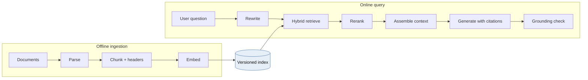

*[Open full-size diagram: RAG - offline ingestion and online query paths (SVG)](diagrams/m2-rag-offline-ingestion-and-online-query-paths.svg)*

**In plain words:** RAG means "look up the right documents first, then ask the AI to answer using them". It keeps answers based on your real documents instead of the model's memory.

**Preparing documents (done ahead of time):**
Documents (SharePoint, CMS, PDFs) → read the layout, keeping tables and headings → split into **chunks** → add labels (document ID, version, effective date, country, who can see it) → create embeddings → save to the index.

- **Versions matter for correctness.** When policy v7 replaces v6, the v6 chunks must stop showing up *at once*. Store a version and an `active` flag, or build a new index and switch over in one step.
- **A new embedding model means re-processing everything.** Vectors from different models can't be compared. Build the new index alongside the old one and then switch.

**How to split documents (chunking):**

| Choice | Effect |
|---|---|
| Small chunks (200–400 tokens) | Precise matches, but each chunk has less context, so you need more of them |
| Large chunks (800–1,500 tokens) | More context, but the meaning gets blurred and prompts cost more |
| Overlap (10–20%) | Sentences split across two chunks are still found. The index is bigger |
| Split on headings | The best default for policy documents |
| "Small to big" | Search small chunks, but give the AI the whole section they came from |
| Add a header | Put `Document › Section › Subsection` at the top of each chunk *before* creating the embedding. It's cheap and noticeably improves results |

**Answering a question:** safety checks → rewrite the question so it makes sense on its own ("what about abroad?" becomes a full question) → hybrid search → rerank → build the prompt within a token budget → generate an answer with citations → final checks (is it backed by the sources? any personal data? required disclaimers?).

**Test the search separately from the answer.** Most "the AI made things up" problems are really search problems: the right chunk never reached the prompt. Measure how often the right chunk is in the top results on a fixed set of test questions, in your CI pipeline. Separately, check whether answers stick to their sources, on sampled real traffic.

### Stream processing and long-lived connections

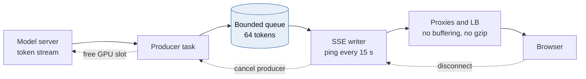

*[Open full-size diagram: Token streaming with backpressure and cancellation (SVG)](diagrams/m2-token-streaming-with-backpressure-and-cancellation.svg)*

**Streaming the answer.** Users see the answer appear word by word instead of waiting. Two ways to do that:

| | Server-Sent Events (SSE) | WebSocket |
|---|---|---|
| Direction | Server → browser | Both ways |
| Protocol | Normal HTTP | A special upgraded connection |
| Through proxies and firewalls | Easy | Often needs extra setup |
| Reconnecting | Built in (`Last-Event-ID`) | You build it yourself |
| Best for | **Streaming AI answers** | Voice, interrupting mid-answer, collaborative agents |

For a chatbot, SSE is the default. If the user presses "stop", that can be a separate `POST /cancel` request.

**What actually limits 50,000 open connections:**

- **Memory isn't the problem.** An idle connection in async Python uses tens of KB, so 50,000 connections fit on a few servers.
- **Load balancers close quiet connections.** While the model is still "thinking", nothing is sent, and a load balancer may close the stream. Send a small comment line (`: ping`) every ~15 seconds, and check the idle timeout at every hop.
- **Buffering silently breaks streaming.** Turn off proxy buffering (`X-Accel-Buffering: no` on nginx) and **turn off gzip** on streaming routes, because compression waits to collect data.
- **Backpressure.** A slow client must not make memory grow forever. Use a small queue for each stream, and drop the connection if it stays full.
- **Stop generating when the user leaves.** A closed browser tab must free its GPU slot *straight away*. Otherwise abandoned answers waste a real share of your GPUs.

### Model serving optimization

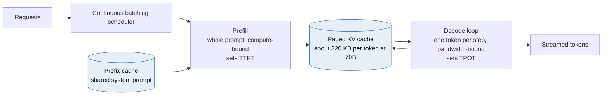

*[Open full-size diagram: LLM inference - prefill, KV cache, decode (SVG)](diagrams/m2-llm-inference-prefill-kv-cache-decode.svg)*

An LLM answers in two phases that are slow for opposite reasons:

- **Prefill** reads the whole prompt in one go. It's limited by **compute power**, and it decides the **time to first token (TTFT)**.
- **Decode** writes the answer one token at a time. It's limited by **memory speed**, and it decides the **time per output token (TPOT)**.

**The KV cache is the real limit, not compute power.** While writing an answer, the model keeps a working memory (the "KV cache") for every token in the conversation:

```
KV bytes per token = 2 (K and V) × layers × kv_heads × head_dim × bytes_per_value
70B-class model with GQA (80 layers, 8 KV heads, head_dim 128, fp16):
  2 × 80 × 8 × 128 × 2 B ≈ 320 KB per token
A 4,000-token conversation ≈ 1.3 GB of GPU memory for a single sequence
```

So how many conversations one GPU can handle depends mostly on this memory. Most serving tricks exist to stretch it:

| Technique | What it does | Trade-off |
|---|---|---|
| **Continuous batching** (vLLM, TGI, TensorRT-LLM, SGLang) | New requests join the running batch at every step instead of waiting for it to finish | Bigger batches mean more total speed but slower tokens per user. Tune `max_num_seqs` to your target |
| **PagedAttention** | Stores the KV cache in small fixed pages, so no memory is wasted on gaps | Standard now |
| **Prefix caching** | Reuses the KV cache for a shared start of the prompt (system prompt, fixed policy text) | Huge win for RAG. Requests must be sent to the server that already has that prefix |
| **Quantization** (8-bit or 4-bit numbers) | 2–4× more room for the KV cache | Quality may drop, so test on *your* questions |
| **Speculative decoding** | A small model guesses the next few tokens, and the big model checks them in one go | Same output, faster, depending on how often the guesses are right. Uses extra memory |
| **Chunked prefill** | Splits long prompts so they don't freeze answers already being written | Slightly slower first token for long prompts |
| **Separate prefill and decode servers** | Different GPU pools for each phase | Best efficiency at large scale, but the KV cache must be moved between them |
| **Model tiers** | A small model handles simple questions, the big one only when needed | One extra routing step, but much cheaper |

## 2.2 Python: Async Streaming, Chunking, GPU Queues

### A streaming endpoint with limits, heartbeats, backpressure and cancelling

```python
import asyncio
import json
from collections.abc import AsyncIterator

from fastapi import FastAPI, Request
from fastapi.responses import JSONResponse, StreamingResponse
from pydantic import BaseModel

app = FastAPI()
GEN_SLOTS = asyncio.Semaphore(256)   # per-process cap on in-flight generations
_DONE = object()


class ChatIn(BaseModel):
    conversation_id: str
    message: str


async def generate_tokens(body: ChatIn) -> AsyncIterator[str]:
    """Placeholder: stream from vLLM / Azure OpenAI with stream=True."""
    for tok in ("Disputes ", "abroad ", "follow ", "the ", "same ", "rules."):
        await asyncio.sleep(0.03)
        yield tok


def sse(event: str, data: dict) -> bytes:
    return f"event: {event}\ndata: {json.dumps(data)}\n\n".encode()


@app.post("/v1/chat/stream")
async def chat_stream(req: Request, body: ChatIn):
    if GEN_SLOTS.locked():   # best-effort fast-fail so the client gets a real 429
        return JSONResponse({"error": "overloaded"}, status_code=429, headers={"Retry-After": "2"})

    async def event_source() -> AsyncIterator[bytes]:
        try:
            await asyncio.wait_for(GEN_SLOTS.acquire(), timeout=0.5)
        except TimeoutError:
            yield sse("error", {"code": "overloaded", "retry_after_s": 2})
            return
        q: asyncio.Queue[object] = asyncio.Queue(maxsize=64)   # bounded = backpressure

        async def produce() -> None:
            try:
                async for tok in generate_tokens(body):
                    await q.put(tok)   # blocks when the client is slow, pausing the upstream stream
                await q.put(_DONE)
            except Exception as exc:   # surface model errors to the consumer loop
                await q.put(exc)

        producer = asyncio.create_task(produce())
        try:
            while True:
                if await req.is_disconnected():
                    break
                try:
                    # Queue.get is safe to cancel. Never wrap the generator's __anext__
                    # in wait_for: a timeout would cancel the model stream itself.
                    item = await asyncio.wait_for(q.get(), timeout=15)
                except TimeoutError:
                    yield b": ping\n\n"   # keeps LBs from reaping a slow-prefill stream
                    continue
                if item is _DONE:
                    yield sse("done", {})
                    break
                if isinstance(item, Exception):
                    yield sse("error", {"code": "generation_failed"})
                    break
                yield sse("token", {"t": item})
        finally:
            producer.cancel()      # propagates cancellation upstream and frees GPU work
            GEN_SLOTS.release()

    return StreamingResponse(event_source(), media_type="text/event-stream",
                             headers={"Cache-Control": "no-cache", "X-Accel-Buffering": "no"})
```

The `locked()` check at the top isn't perfectly accurate. It's a cheap way to turn people away early, and the timed `acquire` inside is the real limit. Newer Starlette versions also cancel the generator when sending fails, but checking `is_disconnected()` also covers the time before the first token, when nothing has been sent yet.

### Splitting documents into chunks by tokens

```python
from collections.abc import Callable, Iterator, Sequence
from dataclasses import dataclass


@dataclass(frozen=True, slots=True)
class Chunk:
    doc_id: str
    doc_version: int
    section_path: str
    text: str
    start_token: int


def chunk_section(
    doc_id: str,
    doc_version: int,
    section_path: str,                       # "Card Disputes › Foreign Transactions"
    body: str,
    encode: Callable[[str], Sequence[int]],  # e.g. tiktoken or an HF tokenizer
    decode: Callable[[Sequence[int]], str],
    max_tokens: int = 400,
    overlap: int = 60,
) -> Iterator[Chunk]:
    if not 0 <= overlap < max_tokens:
        raise ValueError("overlap must be in [0, max_tokens)")
    ids = encode(body)
    if not ids:
        return
    step = max_tokens - overlap
    for start in range(0, max(len(ids) - overlap, 1), step):
        window = ids[start:start + max_tokens]
        # The contextual header is embedded with the chunk, so a chunk that just says
        # "within 60 days" still retrieves for "foreign dispute deadline".
        yield Chunk(doc_id, doc_version, section_path,
                    f"{section_path}\n\n{decode(window)}", start)
```

Split by headings first (one call per section), then use the token window only inside long sections. In production, move the window edges to sentence boundaries, because raw token windows can cut words in half.

### GPU workers for embeddings, with automatic batching (Ray Serve)

```python
from ray import serve


@serve.deployment(
    ray_actor_options={"num_gpus": 1},
    autoscaling_config={"min_replicas": 2, "max_replicas": 16, "target_ongoing_requests": 64},
)
class Embedder:
    def __init__(self) -> None:
        from sentence_transformers import SentenceTransformer
        self.model = SentenceTransformer("BAAI/bge-large-en-v1.5", device="cuda")

    @serve.batch(max_batch_size=128, batch_wait_timeout_s=0.01)
    async def embed(self, texts: list[str]) -> list[list[float]]:
        # Callers send one string. Ray coalesces concurrent calls into a single GPU batch.
        vecs = self.model.encode(texts, normalize_embeddings=True, batch_size=128)
        return vecs.tolist()

    async def __call__(self, text: str) -> list[float]:
        return await self.embed(text)


embedder_app = Embedder.bind()
```

The trade-off is clear: waiting up to 10 ms (`batch_wait_timeout_s=0.01`) adds a little delay, but the GPU can do far more work per second by processing many texts at once. Check the autoscaling setting names for your Ray version, because they've changed over time. For CPU-heavy work in Python (reading PDFs, tokenizing big documents), use `ProcessPoolExecutor`. Threads won't help because of Python's GIL.

## 2.3 Case Study: An Enterprise AI Customer-Service Bot for 50,000 Concurrent Users

**Requirements:** a bank's assistant that:

- looks up live account data (balances, recent transactions, card status);
- finds compliance rules, with citations;
- streams answers word by word.

95% of users see the first word within 1.5 seconds, with at least 20 tokens/s after that. **No customer can ever see another customer's data.** Everything must be auditable.

### Rough numbers: "50,000 connected" is not the number that matters

```mermaid
flowchart LR
    %% title: Little's Law sizing for the chat bot
    U["50,000 connected users"] -->|"one message per 90 s"| L["Arrival rate<br/>555 requests/s"]
    L -->|"x 14 s per response"| C["7,800 concurrent<br/>generations"]
    C -->|"x 30 tokens/s"| T["234k output<br/>tokens/s"]
    C -->|"x 3,400 tokens x 320 KB"| K["About 8.7 TB<br/>live KV cache"]
    classDef warn fill:#fdf0d5,stroke:#c98a12,color:#111
    class K warn
```

*[Open full-size diagram: Little's Law sizing for the chat bot (SVG)](diagrams/m2-little-s-law-sizing-for-the-chat-bot.svg)*

We use **Little's Law**: *average number of things in progress = arrival rate × time each one takes*.

| Assumption | Value |
|---|---|
| Connected users | 50,000 |
| Average time between a user's messages | 90 s |
| Answer length / writing speed | 400 tokens at 30 tokens/s ≈ 13 s |
| Time to first token (search + prefill) | ~1 s |
| Prompt size (system + 5 chunks + history + account data) | ~3,000 tokens |

| Result | Value |
|---|---|
| New requests per second | 50,000 / 90 ≈ **555 per second** |
| Answers being written at the same moment | 555 × 14 s ≈ **7,800** |
| Output tokens per second, in total | 7,800 × 30 ≈ **234,000** |
| Prompt tokens read per second | 555 × 3,000 ≈ **1.7 million** (a cached shared start of ~800 tokens removes ~25%) |
| KV cache memory needed (70B-size model) | ~7,800 × ~3,400 tokens × 320 KB ≈ **8–9 TB** |

That last row changes everything. Running this yourself with a 70B model needs hundreds of GPUs before any spares. The biggest levers, in order:

1. **Use model tiers.** Most banking questions ("what's my balance?", "freeze my card") need a small model plus one tool call, or no AI at all. Send only complex policy questions to the big model.
2. **Limit answer length** and keep answers short. Answer length drives the numbers directly.
3. **Keep prompts short.** Five good chunks beat twelve loose ones, for quality and for cost.
4. **Buy instead of build.** A managed service with reserved capacity (Azure OpenAI provisioned throughput, Bedrock, Vertex) turns GPU operations into a contract. Running it yourself (vLLM on AKS GPU nodes) is cheaper only if the GPUs are busy most of the time and you have a team to run them.

### Design decisions

- **Stateless streaming servers.** Conversation state lives in Redis or Cosmos DB, so any server can handle any message. A short replay buffer (~60 s) lets clients resume a dropped stream.
- **Do lookups at the same time.** Fetch account data, search documents and load history in parallel (`asyncio.TaskGroup`). The wait is then the slowest of the three, not all three added together.
- **The AI never decides whose data to fetch.** The customer ID comes from the *logged-in session*. The account tool calls the core banking system with the user's own token. The model can ask for "my recent transactions" but can never choose *whose*. This one rule prevents the most damaging kind of prompt-injection attack.
- **Treat retrieved documents as untrusted.** Documents can contain hidden instructions ("indirect prompt injection"). Give tools the fewest permissions possible, and require confirmation for anything that changes data.
- **Search:** keyword + HNSW hybrid search with reranking (Azure AI Search, or pgvector/Qdrant plus a reranker), filtered by product, country and effective date, with separate indexes per regulated region.
- **Caching, from safest to riskiest:**

| Layer | Key | Rule |
|---|---|---|
| Embedding cache | hash(text, model version) | Always safe |
| Search result cache | hash(rewritten question, index version, filters) → chunk IDs | Safe with a short TTL |
| Prefix cache (on the model server) | The shared start of the prompt | Safe, and the biggest cost saving |
| Exact answer cache | Normalized question + index version, **general questions only** | OK for FAQs |
| "Similar question" cache | Questions that are nearly the same | **Only for approved general answers.** Never for anything that used account data, because a near-match could return another customer's answer |

- **When things break, be safe on compliance:**
  - Search is down → do **not** answer policy questions without sources. Say so and offer a human.
  - The account system is down → still answer policy questions, and say account details are temporarily unavailable.
  - GPUs are full → limit new requests, switch to the smaller model, or queue with an honest wait time.
- **Audit record for every answer:** prompt template version, retrieved chunk IDs and versions, tool calls, model and version, and the answer. Store it so it can't be changed and is encrypted, and remove personal data before it reaches general logs.
- **Monitoring:** one trace per answer, showing the time spent in search, reranking, tools, prefill and decode. Track token counts, time to first token and time per token, plus cost per customer and per question type.

## 2.4 Diagram: RAG Serving Architecture

```mermaid
flowchart LR
    %% title: RAG serving architecture
    U["Customer web and mobile app"] -->|"HTTPS + SSE"| EDGE["Edge: WAF + CDN<br/>Azure Front Door"]
    EDGE --> APIM["API Gateway<br/>OIDC auth, per-user rate limit"]
    APIM --> GW["Async Stream Gateway<br/>FastAPI on uvicorn, stateless"]

    subgraph ORCH["Orchestration tier"]
        GW --> OR["LLM Orchestrator<br/>intent, plan, token budget"]
        OR --> GIN["Input guardrails<br/>PII, prompt injection"]
        OR --> TOOLS["Account Tool<br/>on-behalf-of user token"]
        OR --> GOUT["Output guardrails<br/>grounding, disclosures"]
    end

    subgraph RET["Retrieval tier"]
        OR --> QR["Query rewrite<br/>small model"]
        QR --> EMBQ["Query embedder<br/>GPU, dynamic batching"]
        EMBQ --> HYB["Hybrid search<br/>HNSW + BM25, partitioned by jurisdiction"]
        HYB --> RR["Cross-encoder reranker"]
        RR --> OR
    end

    subgraph SERVE["Model serving tier"]
        OR --> ROUTER["Model router<br/>tiering, prefix-cache affinity"]
        ROUTER --> SMALL["Small model pool<br/>intent, simple answers"]
        ROUTER --> LARGE["Large model pool<br/>vLLM continuous batching"]
        LARGE --> KV[("Paged KV cache<br/>prefix cache")]
    end

    subgraph CACHE["Cache tier - Redis"]
        EC[("Embedding cache")]
        RC[("Retrieval cache")]
        FAQ[("Non-personal FAQ cache")]
        CONV[("Conversation state + replay buffer")]
    end

    subgraph DATA["Systems of record"]
        CORE[("Core banking API")]
        AUD[("Immutable audit store")]
    end

    TOOLS --> CORE
    EMBQ -.-> EC
    HYB -.-> RC
    OR -.-> FAQ
    GW -.-> CONV
    GOUT --> GW
    OR -.->|"turn record"| AUD
    SMALL --> GOUT
    LARGE --> GOUT

    subgraph ING["Offline ingestion"]
        SRC["Policy docs, SharePoint, CMS"] --> PARSE["Layout-aware parser"]
        PARSE --> CHUNK["Structure-aware chunker<br/>+ contextual headers"]
        CHUNK --> EMBB["Batch embedder<br/>Ray on GPU"]
    end
    EMBB -->|"versioned upsert, alias swap"| HYB
```

*[Open full-size diagram: RAG serving architecture (SVG)](diagrams/m2-rag-serving-architecture.svg)*

## 2.5 Animation Plan: From Text to Tokens, Vectors, and an HNSW Match

**Scene:** use `ThreeDScene` for the 3D parts and a normal `Scene` for the text part. Set the camera angle with `self.set_camera_orientation(phi=70*DEGREES, theta=-45*DEGREES)`. Fix the random seed so the layout is the same every time.

| Time | Step | What you see | Manim tools / notes |
|---|---|---|---|
| 0:00–0:04 | **1. Question** | "Can I dispute a card charge made abroad?" types across the screen | `AddTextLetterByLetter` |
| 0:04–0:09 | **2. Tokens** | The sentence splits into chips, one per token (for example `dis` `pute`). Each chip flips to show a number. Caption: *the exact split and numbers depend on the tokenizer* | Rectangles with text, flip, `Transform` to the number |
| 0:09–0:15 | **3. Embed** | A tall grid (the embedding table) appears. Each number highlights one row, which slides out as a coloured bar | Grid, `Indicate(row)`, `ReplacementTransform` |
| 0:15–0:20 | 3 | The bars pass through a stack of see-through blocks (the model's layers). Thin lines cross between tokens, and the colours change as tokens take in context | Faint `Line`s, `LaggedStart`, colour changes |
| 0:20–0:24 | 3 | The bars merge into one strip of 1,024 colours: the *sentence embedding*. Caption: *an embedding model makes this, not the chat model* | `Transform` into 1,024 thin rectangles |
| 0:24–0:28 | **4. Normalize** | The strip becomes a 3D arrow from the centre, and the arrow's length snaps to touch a see-through sphere of radius 1 | `Arrow3D`, sphere |
| 0:28–0:35 | **5. Vector space** | Thousands of chunk dots fade in, in labelled clusters: *Disputes*, *Travel*, *Fees*, *Mortgages*. Caption: *a 3D picture of a 1,024-dimension space, so distances are only rough*. The camera slowly circles | `Dot3D`, ambient camera rotation |
| 0:35–0:38 | 5 | The question appears as a glowing star between *Disputes* and *Travel* | `Dot3D` with glow, `Flash` |
| 0:38–0:42 | **6. HNSW layers** | The dots separate into three see-through layers: top (~10 dots), middle (~100) and bottom (all). Dotted vertical lines connect copies of the same dot | Planes, dashed lines |
| 0:42–0:48 | 6 | **Top layer:** start at the entry point and hop toward the star. A side panel shows the distance shrinking: `0.91 → 0.74 → 0.63`. When no hop helps, drop down a level | `MoveAlongPath`, counting number, `Circumscribe` |
| 0:48–0:54 | 6 | Same on the middle layer with shorter hops. Drop to the bottom | Same, faster |
| 0:54–1:02 | 6 | **Bottom layer:** a side panel shows the shortlist (`ef_search = 64`, top 8 shown). Dots light up as they're checked, and the shortlist re-sorts live | Re-sorting list, highlights |
| 1:02–1:07 | **7. Rerank** | The top 8 line up with scores. A "lens" passes over them and re-orders them. A lookalike chunk (*"dispute a parking ticket"*) falls from #2 to #7 | `animate.arrange`, `Indicate` |
| 1:07–1:12 | **8. Filter problem** (bonus) | Back to the bottom layer. Apply the filter `country = QC`: 98% of dots turn grey. The search gets stuck on an island and finds only 2 results instead of 8. Caption: *strict filters break the graph* | Fade out, red cross |
| 1:12–1:16 | 8 | Fix: split into separate indexes per country. Searching the *QC* index finds 8 good results | `FadeTransform` to a smaller graph |
| 1:16–1:20 | **9. Prompt** | The final 5 chunks fly into a prompt card beside the system prompt, and citation tags `[1]`–`[5]` attach | `ReplacementTransform`, `LaggedStart` |

## 2.6 Review Questions

- How often does search find the right chunk in the top 10 on your test questions, and how much of the quality problem is search rather than the AI?
- How do you make sure an old policy version can no longer be found, and how soon after the new one is published?
- Could any cache ever return data from another customer's account? What proves it can't?
- What are your targets for time to first token and time per token, and at what batch size do you miss them?
- When the GPUs are full, which users get slower service first? Is that a product decision or an accident?

---

# Module 3 — Distributed Systems Consensus & Resiliency

*Industry: Global SaaS & IoT*

## 3.1 Ideas & Trade-offs

### Consensus: Raft and Paxos

```mermaid
flowchart LR
    %% title: Raft log replication and commit
    C["Client write"] --> L["Leader<br/>term 3"]
    L -->|"AppendEntries"| F1["Follower 1"]
    L -->|"AppendEntries"| F2["Follower 2"]
    L -->|"AppendEntries"| F3["Follower 3"]
    L -->|"AppendEntries"| F4["Follower 4"]
    F1 -->|"ack"| M{"Majority 3 of 5?"}
    F2 -->|"ack"| M
    L -->|"self"| M
    M -->|"yes"| CM["Commit + apply<br/>reply to client"]
    classDef good fill:#dff3e6,stroke:#2e8b57,color:#111
    class CM good
```

*[Open full-size diagram: Raft log replication and commit (SVG)](diagrams/m3-raft-log-replication-and-commit.svg)*

**In plain words:** consensus lets a group of machines agree on the same ordered list of changes (a *log*), even if some machines crash. It doesn't handle machines that lie on purpose (that's a different, harder problem).

A famous result (**FLP**) shows that no method can *guarantee* agreement will finish if the network can be slow without limit and even one machine may crash. So real systems promise two things: **never agree on something wrong**, and **finish when the network behaves reasonably**. Timeouts decide when to try again.

**Raft on one page:**

- **Roles:** each machine is a *follower*, a *candidate* or the *leader*.
- **Terms** are election rounds, numbered 1, 2, 3 and so on. A machine that sees a message with a higher term steps down and adopts that term.
- **Elections:** if a follower hears nothing from the leader for a *random* timeout (150–300 ms in the Raft paper, often 1 s or more in real deployments), it:
  1. increases the term;
  2. votes for itself;
  3. asks the others for votes (`RequestVote`).

  Each machine votes at most once per term, and **only for a candidate whose log is at least as up to date as its own**. That rule guarantees a new leader already has every agreed change.
- **Copying changes:** the leader sends new entries to followers (`AppendEntries`), including the position and term of the entry just before them. If a follower's log doesn't match there, it says no, and the leader steps back until the logs match. Followers' extra, unconfirmed entries are overwritten.
- **Committing:** an entry is final ("committed") once a **majority** has stored it **and** it's from the leader's current term. Entries from older terms become final indirectly. This is a subtle case in the Raft paper, and it's why a new leader immediately adds an empty entry.
- **Majorities:** with `2f + 1` machines, the group survives `f` failures. 3 machines survive 1 failure, and 5 survive 2. **An even number adds cost but no extra safety.**
- **Speed:** each commit takes the leader's disk write plus the round trip to the fastest majority. With 5 machines across 3 regions, every write waits on a round trip to another region.
- **Extras used in production:**
  - **Pre-vote:** a machine returning after a network split checks first whether it could win, instead of starting pointless elections.
  - **Leader leases / ReadIndex:** stop a leader that was cut off in a minority group from serving old data.
  - **Learners:** copies that receive data but don't vote.
  - **Joint consensus:** a safe way to change which machines are in the group.

**Raft vs. Paxos:** they can do the same things. Raft is easier to understand and has one strong leader. Paxos variants (such as EPaxos) can have no leader, which can be faster across regions but is much more complex. **Don't build consensus yourself.** Use etcd, ZooKeeper or Consul, or databases with Raft built in (CockroachDB, TiKV, Kafka's KRaft).

**Split brain.** Raft guarantees that at most one leader can *commit* in each term. It does **not** stop an old leader from *thinking* it's still in charge. It also doesn't stop split brain in *your application*, for example two regions each accepting changes for the same device. The fix is the same everywhere: **attach an epoch or term number to every write**, and have storage reject writes carrying an older number.

### Gossip protocols

```mermaid
flowchart LR
    %% title: SWIM failure detection
    A["Node A"] -->|"1. ping"| B["Node B"]
    B -.->|"no ack"| A
    A -->|"2. ping-req"| C["Node C"]
    A -->|"2. ping-req"| D["Node D"]
    C -->|"indirect ping"| B
    D -->|"indirect ping"| B
    C -.->|"no ack"| A
    A --> S["3. Mark B suspect"]
    S --> X["4. Confirm dead after timeout"]
    X -->|"piggyback on pings"| ALL["Cluster learns in O log N rounds"]
    classDef warn fill:#fdf0d5,stroke:#c98a12,color:#111
    class S,X warn
```

*[Open full-size diagram: SWIM failure detection (SVG)](diagrams/m3-swim-failure-detection.svg)*

**In plain words:** machines spread news the way people spread gossip. Each one tells a few random others, and soon everyone knows.

**SWIM, the most common version, for "who's alive?":**

- Every so often, each machine pings one random machine. If there's no answer, it asks a few *other* machines to ping it (`ping-req`). If there's still no answer, the machine is marked *suspect*, and then *dead* after a timeout.
- News about who joined or left **rides along on these pings**, so everyone hears it within `O(log N)` rounds, and each machine does only a small, fixed amount of work.

**Trade-offs:** gossip is fast and cheap, but not exact, and news arrives "eventually". Pauses and network hiccups cause false alarms. The **phi-accrual detector** (used by Cassandra and Akka) gives a "suspicion level" instead of yes/no, so each part of the system can choose its own threshold.

**Rule of thumb:** use gossip for *who's alive and what they offer*, and consensus for *decisions everyone must agree on*. Consul uses both: gossip for membership, and Raft for its service catalog.

### Rate limiting: token bucket vs. leaky bucket

```mermaid
flowchart LR
    %% title: Token bucket vs leaky bucket
    subgraph TB["Token bucket - allows bursts"]
        R1["Refill r tokens/s"] --> BK[("Bucket<br/>capacity B")]
        IN1["Requests"] --> CK{"Tokens left?"}
        BK --> CK
        CK -->|"yes"| OK1["Pass immediately"]
        CK -->|"no"| RJ1["Reject 429"]
    end
    subgraph LB["Leaky bucket - smooths output"]
        IN2["Requests"] --> QQ[("Queue<br/>size Q")]
        QQ -->|"drain at constant r"| OK2["Downstream"]
        IN2 -->|"queue full"| RJ2["Drop"]
    end
    classDef store fill:#e6eef8,stroke:#3b6ea5,color:#111
    class BK,QQ store
```

*[Open full-size diagram: Token bucket vs leaky bucket (SVG)](diagrams/m3-token-bucket-vs-leaky-bucket.svg)*

**In plain words:** rate limiting stops any one client from sending too many requests.

| Method | How it behaves | Bursts | Memory needed | Typical use |
|---|---|---|---|---|
| **Token bucket** | A bucket holds up to B tokens and refills at r per second. Each request uses a token | **Allows bursts** up to B. Averages r | 2 numbers | API limits, per-device limits |
| **Leaky bucket (queue)** | Requests wait in a queue of size Q and leave at a steady rate r | **Smooths bursts** into a steady flow. Adds waiting time | A queue | Protecting a fragile system that needs a steady pace |
| Leaky bucket (counter) / GCRA | Tracks when the next request is allowed | Same result as a token bucket | 1 number | Telecoms, efficient Redis limiters |
| Fixed window | Count per minute | Up to 2× bursts where two windows meet | 1 counter | Rough limits |
| Sliding window log | Stores every request's time | Exact | Grows with traffic | Low traffic where precision matters |
| Sliding window counter | Blends two windows | Close enough | 2 counters | A good general default |

**Rate limiting across many servers:**

1. **Central counter** in Redis with a Lua script: exact and atomic, but adds about 1 ms per request, and Redis becomes something you depend on. Decide what happens if Redis is down: **let traffic through** (when protecting a backend) or **block it** (for billing or abuse limits).
2. **Local limits:** each of N servers allows r/N. Fast, but inaccurate if traffic isn't spread evenly.
3. **Hybrid:** each server keeps a local bucket and occasionally borrows allowance from a central store.

**Rate limiting is not load shedding.** Rate limits keep things *fair between clients*. Load shedding is a server *protecting itself* based on its own health (how many requests are in flight, how long they've waited). Adaptive limits catch overloads that fixed rate limits miss.

### Circuit breakers

```mermaid
flowchart LR
    %% title: Layered resiliency around one dependency call
    CALL["Caller"] --> RB["Retry with backoff + jitter<br/>retry budget 10%"]
    RB --> CB["Circuit breaker<br/>per dependency, per endpoint"]
    CB --> TO["Timeout / deadline"]
    TO --> BH["Bulkhead<br/>dedicated connection pool"]
    BH --> DEP["Dependency"]
    CB -->|"open"| FB["Fallback / degrade"]
```

*[Open full-size diagram: Layered resiliency around one dependency call (SVG)](diagrams/m3-layered-resiliency-around-one-dependency-call.svg)*

**In plain words:** like the electrical breaker in your house. If a service you call keeps failing, stop calling it for a while, so it can recover and your own app doesn't hang.

A breaker has three states:

- **Closed** (normal): calls go through, and results are counted.
- **Open** (tripped): calls fail immediately for a cool-down period, and you use a fallback.
- **Half-open** (testing): a few test calls are allowed through. If they succeed, the breaker closes. If one fails, it opens again.

Details that decide whether a breaker helps or hurts:

- **Trip on a failure *rate*, with a minimum number of calls.** One failure out of one call isn't an outage.
- **Count slow calls as failures.** A service that answers in 9 seconds is effectively down.
- **Only count the right errors.** 5xx errors and timeouts are the other service's fault. 4xx errors are *your* bug and shouldn't trip the breaker.
- **Use one breaker per service and endpoint (or shard).** A single breaker for a whole sharded database trips everything when one shard fails.
- **You need timeouts first.** Without a timeout, a hung call never "fails", so the breaker never opens.
- **Use separate connection pools per service (bulkheads)**, so one slow service can't use up all your workers.
- **Put retries *outside* the breaker**, with backoff, jitter and a budget. If three layers each retry three times, one failed request becomes **27** requests during an outage. Cap retries at about 10% of traffic.

### Graceful degradation

```mermaid
flowchart LR
    %% title: Degradation ladder
    L0["L0 Full service"] -->|"pressure"| L1["L1 Reduced<br/>stale caches, no extras"]
    L1 -->|"more pressure"| L2["L2 Core only<br/>shed low priority"]
    L2 -->|"severe"| L3["L3 Static<br/>queue and acknowledge"]
    L3 -.->|"recovery"| L0
    classDef good fill:#dff3e6,stroke:#2e8b57,color:#111
    classDef warn fill:#fdf0d5,stroke:#c98a12,color:#111
    classDef bad fill:#fbe0df,stroke:#c0392b,color:#111
    class L0 good
    class L1,L2 warn
    class L3 bad
```

*[Open full-size diagram: Degradation ladder (SVG)](diagrams/m3-degradation-ladder.svg)*

**In plain words:** when things get bad, keep the most important features working and switch off the rest, instead of failing completely.

Plan the steps with the product team **before** anything breaks:

| Level | What happens |
|---|---|
| L0 Full | Everything works |
| L1 Reduced | Serve older cached data. Turn off recommendations, rich reports and extras |
| L2 Core only | Only critical features work. Low-priority traffic is turned away |
| L3 Static | Show simple fixed responses. Accept writes into a queue and confirm them later |

To turn away the least important work first, every request needs a priority label from the start. Health checks and control traffic come first, safety alarms next, and bulk data last.

## 3.2 Python: Resiliency Patterns

### Retries with `tenacity`: only retry what's worth retrying

```python
import httpx
from tenacity import (retry, retry_if_exception, stop_after_attempt,
                      stop_after_delay, wait_exponential_jitter)


def is_retryable(exc: BaseException) -> bool:
    if isinstance(exc, (httpx.ConnectError, httpx.ReadTimeout, httpx.PoolTimeout)):
        return True
    if isinstance(exc, httpx.HTTPStatusError):
        return exc.response.status_code in {429, 502, 503, 504}
    return False   # 4xx is the caller's bug. Retrying just repeats it


@retry(
    retry=retry_if_exception(is_retryable),
    wait=wait_exponential_jitter(initial=0.1, max=5.0, jitter=0.5),
    stop=stop_after_attempt(4) | stop_after_delay(10),   # attempt cap AND deadline
    reraise=True,
)
async def push_device_config(client: httpx.AsyncClient, device_id: str, cfg: dict) -> None:
    # Retrying a mutation is only safe because the server dedupes on the key.
    r = await client.put(f"/devices/{device_id}/config", json=cfg,
                         headers={"Idempotency-Key": cfg["revision_id"]})
    r.raise_for_status()
```

`tenacity` handles retries, but it's not a circuit breaker. Libraries such as `pybreaker` and `aiobreaker` exist, but a breaker is small enough that writing your own gives you better monitoring and correct async behaviour.

### A custom async circuit breaker

```python
import asyncio
import time
from collections import deque
from collections.abc import AsyncIterator, Callable
from contextlib import asynccontextmanager
from enum import Enum, auto


class State(Enum):
    CLOSED = auto()
    OPEN = auto()
    HALF_OPEN = auto()


class CircuitOpenError(RuntimeError):
    pass


class CircuitBreaker:
    def __init__(
        self,
        name: str,
        *,
        window_s: float = 30.0,
        min_calls: int = 20,
        failure_rate: float = 0.5,
        open_s: float = 15.0,
        half_open_probes: int = 3,
        is_failure: Callable[[BaseException], bool] = lambda e: True,
        clock: Callable[[], float] = time.monotonic,
    ) -> None:
        self.name, self._window_s, self._min_calls = name, window_s, min_calls
        self._failure_rate, self._open_s, self._probes = failure_rate, open_s, half_open_probes
        self._is_failure, self._clock = is_failure, clock
        self._events: deque[tuple[float, bool]] = deque()   # (timestamp, failed)
        self._state = State.CLOSED
        self._opened_at = 0.0
        self._probe_inflight = 0
        self._probe_successes = 0
        self._lock = asyncio.Lock()

    @property
    def state(self) -> State:
        return self._state

    async def _admit(self) -> bool:
        """Return True if this call is a half-open probe. Raise if rejected."""
        async with self._lock:
            now = self._clock()
            if self._state is State.OPEN and now - self._opened_at >= self._open_s:
                self._state, self._probe_inflight, self._probe_successes = State.HALF_OPEN, 0, 0
            if self._state is State.OPEN:
                raise CircuitOpenError(self.name)
            if self._state is State.HALF_OPEN:
                if self._probe_inflight >= self._probes:
                    raise CircuitOpenError(self.name)
                self._probe_inflight += 1
                return True
            return False

    def _trip(self) -> None:
        self._state, self._opened_at = State.OPEN, self._clock()
        self._events.clear()

    async def _record(self, probe: bool, failed: bool) -> None:
        async with self._lock:
            if probe:
                if self._state is not State.HALF_OPEN:
                    return                      # stale probe finishing after another state change
                self._probe_inflight -= 1
                if failed:
                    self._trip()
                else:
                    self._probe_successes += 1
                    if self._probe_successes >= self._probes:
                        self._state = State.CLOSED
                        self._events.clear()
                return
            if self._state is not State.CLOSED:
                return                          # a call that started while CLOSED, finishing late
            now = self._clock()
            self._events.append((now, failed))
            while self._events and now - self._events[0][0] > self._window_s:
                self._events.popleft()
            n = len(self._events)
            if n >= self._min_calls and sum(f for _, f in self._events) / n >= self._failure_rate:
                self._trip()

    @asynccontextmanager
    async def guard(self) -> AsyncIterator[None]:
        probe = await self._admit()
        try:
            yield
        except asyncio.CancelledError:
            await self._record(probe, failed=False)   # the caller gave up; that isn't dependency failure
            raise
        except BaseException as exc:
            await self._record(probe, failed=self._is_failure(exc))
            raise
        else:
            await self._record(probe, failed=False)
```

How to use it, with a timeout inside the breaker so slow calls count as failures, and a fallback when it's open:

```python
tsdb_breaker = CircuitBreaker(
    "tsdb-write",
    is_failure=lambda e: isinstance(e, (TimeoutError, httpx.TransportError))
    or (isinstance(e, httpx.HTTPStatusError) and e.response.status_code >= 500),
)


async def write_batch(batch: list[dict]) -> None:
    try:
        async with tsdb_breaker.guard(), asyncio.timeout(0.8):
            await tsdb_client.write(batch)
    except CircuitOpenError:
        await spill_to_local_queue(batch)   # graceful degradation: durable buffer, replay later
```

Each server process keeps its own breaker. With 200 servers, each learns about failures on its own, which is usually fine because each sees its own network path. Sharing the breaker state through Redis would add a dependency to the very part that's meant to survive dependency failures.

### A rate limiter shared by all servers (Redis + Lua token bucket)

```python
import redis.asyncio as redis

TOKEN_BUCKET = """
local cap  = tonumber(ARGV[1])
local rate = tonumber(ARGV[2])   -- tokens per second
local cost = tonumber(ARGV[3])
local t = redis.call('TIME')      -- the server clock avoids skew between app hosts
local now = tonumber(t[1]) * 1000 + math.floor(tonumber(t[2]) / 1000)
local b = redis.call('HMGET', KEYS[1], 'tokens', 'ts')
local tokens = tonumber(b[1]) or cap
local ts = tonumber(b[2]) or now
tokens = math.min(cap, tokens + math.max(0, now - ts) / 1000.0 * rate)
local allowed = 0
if tokens >= cost then tokens = tokens - cost; allowed = 1 end
redis.call('HSET', KEYS[1], 'tokens', tokens, 'ts', now)
redis.call('PEXPIRE', KEYS[1], math.ceil(cap / rate * 1000) + 1000)
return {allowed, tostring(tokens)}   -- tostring: Lua numbers are truncated to integers on return
"""


class RateLimiter:
    def __init__(self, r: redis.Redis, capacity: float, rate: float) -> None:
        self._script = r.register_script(TOKEN_BUCKET)
        self._cap, self._rate = capacity, rate

    async def allow(self, key: str, cost: float = 1.0) -> bool:
        allowed, _remaining = await self._script(keys=[f"tb:{key}"],
                                                 args=[self._cap, self._rate, cost])
        return bool(int(allowed))
```

## 3.3 Case Study: A Global IoT Telemetry Ingestion Engine

```mermaid
flowchart LR
    %% title: IoT - AP data plane, CP control plane
    DEV["Devices"] --> BRK["Regional MQTT brokers<br/>per-device token bucket"]
    BRK -->|"heartbeats stay in memory"| PRES["Presence transitions only"]
    BRK -->|"telemetry - AP"| EH["Event log<br/>partitioned by device"]
    EH --> SP["Stream processor<br/>dedupe device, boot, seq"]
    SP --> TS[("Time-series store")]
    CTRL["Global control plane<br/>3-site quorum"] -->|"ownership + epoch"| SH[("Device shadow - CP<br/>single home region")]
    SH -->|"commands carry epoch"| BRK
    classDef store fill:#e6eef8,stroke:#3b6ea5,color:#111
    class TS,SH store
```

*[Open full-size diagram: IoT - AP data plane, CP control plane (SVG)](diagrams/m3-iot-ap-data-plane-cp-control-plane.svg)*

**Scenario:** 8 million industrial sensors and smart meters across North America, the EU and Asia-Pacific. Each device sends a "still alive" message (heartbeat) every 10 seconds and a batch of readings every 60 seconds, and receives settings and firmware updates. EU device data must stay in the EU. Links between regions sometimes fail, and data centres have split in two while devices could still reach both halves. That's exactly how split brain happens.

### Rough numbers

| Stream | Rate | Size | Bandwidth |
|---|---|---|---|
| Heartbeats | 8M / 10 s = **800,000 messages/s** | ~200 bytes | ~160 MB/s |
| Readings | 8M / 60 s = **133,000 messages/s** | ~1 KB | ~133 MB/s |
| Total | ~930,000 messages/s | | ~300 MB/s ≈ **26 TB/day** before compression |

### The key decision: choose consistency vs. availability *per type of data*

The **CAP theorem** says that when the network splits, a system must choose between staying **available** (AP: keep accepting work) and staying **consistent** (CP: refuse work rather than risk conflicts). You don't have to make one choice for the whole system. Choose for each kind of data:

| Data | What it's like | Choice | How |
|---|---|---|---|
| **Sensor readings** | Facts that are only ever added. Order doesn't matter when merging | **AP** | Accept them anywhere. Remove duplicates by `(device_id, boot_id, seq)`. Handle late data with watermarks |
| **Online/offline status** | Temporary, and fixes itself | **AP** | Keep "last seen" in the broker's memory. Only send changes |
| **Device settings (shadow)** | Must never conflict | **CP per device** | Each device has one home region that makes changes, with an ownership **epoch** |
| **Firmware rollout plan** | Global, rare, high-impact | **CP, global** | A consensus-backed control system, plus human approval |
| **Usage counts for billing** | Must add up in the end | Eventual, then checked | Counters that are safe to repeat, and a daily check |

### Design decisions

- **Cells.** Each region runs several independent "cells" (an MQTT broker cluster, a stream processor, a time-series database). Each cell has a maximum number of devices, so a problem in one cell affects only that many. Each device belongs to a *home cell*.
- **Heartbeats never reach a database.** The broker tracks `last_seen` in memory and only publishes *changes* (went offline, came back online). That turns 800,000 writes per second into maybe a few thousand, which is the biggest cost saving in the design.
- **Readings path:** MQTT broker (Azure Event Grid MQTT, IoT Hub, EMQX or HiveMQ) → Event Hubs/Kafka, split by `device_id` → stream processor (remove duplicates, add details, reduce detail) → time-series database (Azure Data Explorer, Timescale, InfluxDB). Raw data is also saved to ADLS as Parquet files.
- **Avoiding split brain for device settings:**
  - Each device's settings have exactly one owner, its home region, which holds a lease with an epoch number (stored in the region's etcd/Raft store).
  - Moving ownership to another region requires a majority vote in a **global control system spread across at least 3 sites** (two regions plus a tiebreaker). The side of a split without a majority **can't** take ownership.
  - Every settings change and every command sent to a device carries the epoch. After the split heals, changes with an older epoch are rejected, and devices ignore commands with an old epoch.
  - The cut-off side **keeps accepting sensor readings** (AP), keeps settings read-only (CP), and holds commands until the link returns. It's partly available, but never inconsistent.
- **Reconnect storms.** When a region recovers, millions of devices reconnect at once, and the encryption handshakes overload the servers.
  - **Device firmware must retry with growing, random waits.** This can't be fixed on the server after devices ship, so it must be designed in from day one.
  - The broker limits new connections with a token bucket and replies "server busy" (MQTT 5 has a code for this) when over the limit.
  - TLS session resumption makes reconnecting cheaper.
- **Protecting other systems:**
  - A per-device rate limit at the broker stops buggy firmware from flooding the system.
  - Per-customer limits protect shared cells.
  - Circuit breakers sit in front of database writes. When they open, data waits safely in Event Hubs and is replayed once the database recovers.
- **Degradation steps for this system:**
  - L1: tell devices to send heartbeats every 60 s instead of 10 s, and stop debug data.
  - L2: accept only alarms.
  - L3: devices store data locally and send it later. The firmware must support this.

## 3.4 Diagram: Circuit Breaker State Transitions

```mermaid
flowchart TD
    %% title: Circuit breaker state transitions
    START(["Incoming call"]) --> S{"Breaker state?"}

    S -->|"CLOSED"| C_CALL["Execute call with timeout"]
    C_CALL --> C_RES{"Outcome"}
    C_RES -->|"success"| C_OK["Record success in rolling window"]
    C_RES -->|"5xx or timeout"| C_FAIL["Record failure in rolling window"]
    C_RES -->|"4xx - caller bug"| C_OK
    C_FAIL --> C_EVAL{"calls in window at least min_calls<br/>AND failure rate at least threshold?"}
    C_EVAL -->|"no"| RET_ERR["Propagate error to caller"]
    C_EVAL -->|"yes"| TRIP["TRIP: state = OPEN<br/>opened_at = now, clear window"]
    TRIP --> RET_ERR
    C_OK --> RET_OK["Return result"]

    S -->|"OPEN"| O_CHK{"Cool-down elapsed?<br/>now - opened_at at least open_s"}
    O_CHK -->|"no"| FAST["Fail fast: CircuitOpenError<br/>serve fallback or degrade"]
    O_CHK -->|"yes"| TO_HO["state = HALF_OPEN<br/>reset probe counters"]
    TO_HO --> H_ADMIT

    S -->|"HALF_OPEN"| H_ADMIT{"Probe slots free?<br/>in-flight probes below max"}
    H_ADMIT -->|"no"| FAST
    H_ADMIT -->|"yes"| H_CALL["Execute probe call with timeout"]
    H_CALL --> H_RES{"Outcome"}
    H_RES -->|"failure"| TRIP
    H_RES -->|"success"| H_CNT{"Probe successes<br/>reached required count?"}
    H_CNT -->|"no"| RET_OK
    H_CNT -->|"yes"| CLOSE["state = CLOSED<br/>clear window"]
    CLOSE --> RET_OK

    classDef closed fill:#d9f2e3,stroke:#2e8b57,color:#111
    classDef open fill:#f9d6d5,stroke:#c0392b,color:#111
    classDef half fill:#fdebc8,stroke:#d68910,color:#111
    class C_CALL,C_OK,C_FAIL,C_EVAL,CLOSE closed
    class TRIP,FAST,O_CHK open
    class TO_HO,H_ADMIT,H_CALL,H_CNT half
```

*[Open full-size diagram: Circuit breaker state transitions (SVG)](diagrams/m3-circuit-breaker-state-transitions.svg)*

## 3.5 Animation Plan: Raft Leader Election When the Leader Goes Offline

**Scene:**

- Five machines **S1–S5** arranged in a pentagon. Each is a circle with a **term badge** (top right), a **role label** underneath, and an **election timer ring** around it.
- Under each machine is a row of small log squares, coloured by term (term 1 grey, term 2 blue, term 3 green) and numbered.
- **S1** is the gold leader in term 2. S5's log is shorter (5 entries) than the others' (7).
- Timeouts are fixed for repeatability: S2 = 210 ms, S3 = 170 ms, S4 = 260 ms, S5 = 190 ms, shown in slow motion.

| Time | Step | What you see | Manim tools |
|---|---|---|---|
| 0:00–0:06 | **Normal** | S1 sends heartbeat dots along its lines. Each follower's timer ring refills when a dot arrives. Caption: *Heartbeats are empty AppendEntries messages* | `MoveAlongPath(Dot)`, ring refill |
| 0:06–0:08 | **Leader crashes** | S1 turns grey with a red ✕. Heartbeats stop | `FadeToColor`, `Create(Cross)` |
| 0:08–0:12 | **Timers run down** | The four rings drain at different speeds, each labelled with its random timeout | One `ValueTracker` per machine, different run times |
| 0:12–0:14 | **S3 times out first** | S3 turns amber (*Candidate*). Its term badge flips from 2 to 3. A vote counter shows `1/5` (its own vote) | `Transform`, `Indicate` |
| 0:14–0:18 | **Asking for votes** | Envelopes labelled `term=3, lastLogIndex=7, lastLogTerm=2` travel to S2, S4 and S5. Each receiver's term flips to 3 and its timer resets | `LaggedStart(MoveAlongPath)` |
| 0:18–0:21 | **Votes** | S2 and S4 send back green ✓ envelopes. The counter reaches `3/5` and a **majority** banner flashes | `Flash`, counter change |
| 0:21–0:24 | **New leader** | S3 turns gold, gets a crown, and sends heartbeats straight away. All rings reset | `Transform`, `LaggedStart` |
| 0:24–0:30 | **First commit** | S3 adds an empty green term-3 entry at position 8 and sends it out. When 3 of 5 have it, a *committed* marker slides to position 8 | `FadeIn(square)`, moving marker |
| 0:30–0:36 | **Side panel: why S5 couldn't win** | A small replay shows S5 timing out first with only 5 entries. S2, S3 and S4 all reply ✕, because a shorter log means no vote. Caption: *This rule keeps committed entries safe* | Inset panel, scaled copy |
| 0:36–0:42 | **Old leader returns** | S1 recovers, still thinks it's the term-2 leader, and sends `AppendEntries term=2` with an uncommitted entry at position 8. The followers reply `term=3`. S1 becomes a *Follower*, its term jumps to 3, and its conflicting entry is crossed out in red and replaced with S3's green one | `Transform`, strikethrough `Line`, `ReplacementTransform` |
| 0:42–0:50 | **Bonus: tied vote** | New round, term 4: S2 and S4 time out together and each gets 2 votes. Both counters stall at `2/5`, the timers reset randomly, and S4 wins in term 5. Caption: *Random timeouts make ties rare and short* | Two parallel animation groups |
| 0:50–1:00 | **Bonus: network split** | A red dashed line separates {S1, S2} from {S3, S4, S5}. A write sent to S1 shows a spinning *pending* ring that never finishes (only 2 of 5). The majority side commits normally. Caption: *No majority, no commit. Raft prevents split-brain commits, not split-brain beliefs* | `DashedLine`, spinning ring |

## 3.6 Review Questions

- For each type of data, have we chosen availability or consistency on purpose, and does the product team agree?
- What stops a region on the losing side of a split from sending commands? Point to the exact epoch check.
- During a full outage of a service, what's the worst-case number of retries across all layers?
- When 1 of 32 database shards fails, which breaker trips first, and does it take the other 31 down with it?
- How long does the biggest region take to fully reconnect under admission limits, and have you tested it?

---

# Module 4 — Cloud-Native Data Partitioning & Storage

*Cross-industry*

## 4.1 Ideas & Trade-offs

### Sharding strategies

```mermaid
flowchart LR
    %% title: Three ways to route a key to a shard
    K["Request with key"] --> RT{"Routing strategy"}
    RT -->|"range: key between bounds"| RS[("Shard by range<br/>good scans, hot tails")]
    RT -->|"hash: hash key mod N"| HS[("Shard by hash<br/>even, no range scans")]
    RT -->|"directory: lookup table"| DS[("Shard by directory<br/>policy placement")]
    DIR[("Directory<br/>tenant to shard")] --> RT
    classDef store fill:#e6eef8,stroke:#3b6ea5,color:#111
    class RS,HS,DS,DIR store
```

*[Open full-size diagram: Three ways to route a key to a shard (SVG)](diagrams/m4-three-ways-to-route-a-key-to-a-shard.svg)*

**In plain words:** when data is too big or too busy for one database, you split it into **shards**. Each shard holds part of the data on its own machine. The big question is how to decide which shard each row belongs to.

| Strategy | How | Good | Bad |
|---|---|---|---|
| **Range** | Each shard holds a range of keys (A–F, G–M…) | Fast range scans. Ranges can be split as they grow | Keys that always increase (timestamps, auto-increment IDs) all land on the last shard |
| **Hash** | `shard = hash(key) mod N` | Spreads data evenly | No range scans. **Changing N moves almost every key** |
| **Consistent hash** | Keys and servers placed on a ring | Adding or removing a server moves only about 1/N of keys | You can't choose where a specific key goes |
| **Directory (lookup table)** | A table says which shard each key is on | Full control: keep data in the right country, move one busy customer | The lookup happens on every request (cache it). The table must always be available |
| **By region or customer** | Split by country or tenant | Matches legal and business boundaries | Shards can be very different sizes |
| **Mixed** | A directory picks the group, a hash picks the shard inside it | Rules at the top, even spread underneath | Two layers to manage |

**How to choose a shard key**, most important first:

1. The **most common queries** should need only **one shard**.
2. It should spread the *load*, not just the data. A customer with 1% of the rows can make 30% of the queries.
3. It should have many distinct values and **never change**. Changing a row's shard key means moving it to another shard.
4. It should match **isolation boundaries**, such as customer or country.

**The hidden cost: slow queries that touch every shard.** A query that asks all shards must wait for the slowest one. If each shard is fast 99% of the time, a query touching 50 shards is fast on all of them only `0.99⁵⁰ ≈ 61%` of the time, so **about 39% of these queries** hit at least one slow shard. Queries that fan out need tricks: sending a backup request, returning partial results, or a separate read model built for that query.

Also plan for: transactions across shards (sagas, or a distributed SQL database), indexes that cover all shards, uniqueness across shards (for example, unique email addresses), and moving data between shards.

### Consistent hashing

```mermaid
flowchart LR
    %% title: Consistent hashing lookup with virtual nodes and replicas
    KEY["Key"] --> H["hash key to ring position"]
    H --> VN["First virtual node clockwise"]
    VN --> PN["Physical node owning that vnode"]
    PN --> R2["Next distinct physical node<br/>replica 2"]
    R2 --> R3["Next distinct physical node<br/>replica 3"]
```

*[Open full-size diagram: Consistent hashing lookup with virtual nodes and replicas (SVG)](diagrams/m4-consistent-hashing-lookup-with-virtual-nodes-and-replicas.svg)*

**In plain words:** imagine a clock face. Servers and keys are both placed on it using a hash. Each key belongs to the next server **clockwise**. When a server is added, it takes over only the keys between itself and the server before it, about `K/N` keys, not nearly all of them.

- **Virtual nodes:** each real server appears at 100–256 spots on the ring. This evens out the spread, lets bigger servers take more spots, and when a server dies its load spreads over many servers instead of landing on its one neighbour.
- **Copies:** store each key on the next R *different real servers* clockwise. This is how Amazon's Dynamo did it.

**Other options worth knowing:**

| Method | Lookup cost | Properties | Best for |
|---|---|---|---|
| Ring + virtual nodes | Fast (a binary search) | Flexible membership. Needs a token table | Dynamo-style databases, cache clusters |
| **Rendezvous (HRW)** | Checks every server: pick the highest `hash(key, server)` | No ring, little movement, easy weighting | Tens to hundreds of servers, CDNs, caches |
| **Jump hash** | Very fast, no memory | Perfectly even, but you can only add or remove servers *at the end* | Numbered shards |
| Bounded-load hashing | Fast | Caps each server at slightly above average load | Caches with hot keys, load balancers |
| Maglev | A single table lookup | Fast, nearly even, little movement | Network load balancers |

**When *not* to use consistent hashing:** when placement is a **rule**. "This customer's data must stay in Canada", "this customer gets its own database" and "move this noisy customer off shard 7" are lookup-table decisions. A hash function can't follow the law.

### Write-Ahead Logging (WAL)

```mermaid
flowchart LR
    %% title: WAL durability and recovery
    W["Write"] --> WB["WAL buffer<br/>log record first"]
    W --> BP["Buffer pool page<br/>dirty, pageLSN"]
    WB -->|"fsync at commit<br/>group commit"| WD[("WAL on disk")]
    WD --> ACK["Ack client"]
    BP -->|"checkpoint, later"| DF[("Data files")]
    WD -->|"crash: redo from checkpoint<br/>if pageLSN lt record LSN"| DF
    WD -->|"stream"| STBY[("Standby replica")]
    WD -->|"logical decoding"| CDC["CDC / outbox relay"]
    classDef store fill:#e6eef8,stroke:#3b6ea5,color:#111
    class WD,DF,STBY store
```

*[Open full-size diagram: WAL durability and recovery (SVG)](diagrams/m4-wal-durability-and-recovery.svg)*

**In plain words:** before a database changes its main data, it first writes a note in a log file saying what it's about to change. If it crashes, it reads the log to finish or redo the changes. That's why a committed transaction survives a power cut.

**The WAL rule:** the log entry must be safely on disk *before* the changed data page is written, and *before* the database tells the client "committed".

- Changes are first made to data pages in memory (the **buffer pool**), which marks those pages *dirty*. Dirty pages are written to disk later, in the background and during **checkpoints**.
- A **checkpoint** records a safe point: everything before it is in the data files.
- **Crash recovery** replays the log from the last checkpoint. A page is changed only if its stored log number (pageLSN) is **lower** than the log entry's number. So replaying twice is harmless: recovery is *idempotent*, the same idea as in Module 1.
- Some databases (SQL Server, MySQL InnoDB) also **undo** unfinished transactions. PostgreSQL doesn't need to: unfinished transactions are simply never marked as committed, so their rows stay invisible (thanks to MVCC).

**Why it's fast:** adding to the end of a log file is much faster than writing pages all over the disk. **Group commit** saves many transactions with one disk sync.

**PostgreSQL settings and their trade-offs:**

| Setting | Effect | Risk |
|---|---|---|
| `synchronous_commit = off` | Replies "committed" before the log is on disk. Much faster | A crash loses the last few hundred ms of "committed" transactions. **No corruption**, but some data loss |
| `full_page_writes = on` | Writes a full page copy the first time a page changes after a checkpoint | Protects against half-written pages. Bigger log |
| Frequent checkpoints | Faster recovery | More disk work |
| Rare checkpoints | Less disk work | Slower recovery after a crash |
| `synchronous_standby_names = 'ANY 1 (s1, s2)'` | Waits for one of two standbys to confirm | Commits wait for a standby, but one standby can fail without blocking |

**The WAL is also how replicas stay updated.** Streaming replication sends the WAL to standby servers. **Logical decoding** turns it into change events for CDC tools (Debezium). That's exactly the outbox relay from Module 1. The general idea: "the log *is* the database", and tables are just a cached result of it. Write-optimized databases (RocksDB, Cassandra) follow the same order: log first, then memory, then files on disk.

### Read replicas vs. multi-primary replication

```mermaid
flowchart LR
    %% title: Single primary vs multi-primary replication
    subgraph SP["Single primary"]
        W1["Writes"] --> P[("Primary")]
        P -->|"async or sync"| R1[("Replica")]
        P --> R2[("Replica")]
        RD["Reads"] --> R1
        RD --> R2
    end
    subgraph MP["Multi-primary"]
        WA["Writes region A"] --> PA[("Primary A")]
        WB["Writes region B"] --> PB[("Primary B")]
        PA <-->|"replicate both ways"| PB
        PA --> CR["Conflict resolution<br/>LWW, merge, CRDT"]
        PB --> CR
    end
    classDef store fill:#e6eef8,stroke:#3b6ea5,color:#111
    classDef warn fill:#fdf0d5,stroke:#c98a12,color:#111
    class P,R1,R2,PA,PB store
    class CR warn
```

*[Open full-size diagram: Single primary vs multi-primary replication (SVG)](diagrams/m4-single-primary-vs-multi-primary-replication.svg)*

| Model | Writes | Reads | Conflicts | When things fail |
|---|---|---|---|---|
| One primary + **async** replicas | One server | Many servers, slightly behind | None | Failover can lose recently confirmed writes |
| One primary + **sync** replicas | One server + a standby confirmation | Many servers | None | No data loss. Each commit waits for the standby |
| **Multi-primary** (several servers or regions accept writes) | Many | Local | **Will happen**. Need a rule: newest wins, merge, or CRDTs | Keeps accepting writes during a split, and data drifts apart |
| **Consensus-based** (Spanner, CockroachDB) | One leader per data range | Leader, or followers with a known delay | Prevented | Needs a majority. Slower across regions |

**Common replica problems and fixes:**

- **Not seeing your own write:** after writing, remember the database log position. Read from a replica only if it has caught up to that position (`pg_last_wal_replay_lsn()`), otherwise read from the primary.
- **Going back in time:** keep a user on one replica, or remember the newest position they've seen.

**Rule of thumb:** *multi-primary sounds like "always available", but it's really a conflict-resolution problem.* "Newest write wins" quietly throws away data and depends on clocks. Prefer **one writer per piece of data** (each customer or row has a home), with fast failover. Use multi-primary only for data that merges naturally: counters, sets, online status, shopping carts.

## 4.2 Python: Routing Each Customer to the Right Database in SQLAlchemy (and Django)

```mermaid
flowchart LR
    %% title: Tenant-aware request routing
    REQ["Request + verified token"] --> TID["tenant_id claim"]
    TID --> DIR[("Tenant directory<br/>cached")]
    DIR --> PL["Placement<br/>region, cell, shard, epoch"]
    PL --> RC{"Local region?"}
    RC -->|"no"| REDIR["Redirect to home region"]
    RC -->|"yes"| RS["RoutingSession.get_bind"]
    RS -->|"reference models"| REF[("Reference DB")]
    RS -->|"read-only"| REP[("Shard replica")]
    RS -->|"writes"| PRI[("Shard primary<br/>RLS app.tenant_id")]
    classDef store fill:#e6eef8,stroke:#3b6ea5,color:#111
    class DIR,REF,REP,PRI store
```

*[Open full-size diagram: Tenant-aware request routing (SVG)](diagrams/m4-tenant-aware-request-routing.svg)*

How the routing works:

1. **Look up where the customer's data lives, once per request**, from a cached tenant directory.
2. **Save that location on the session**, so a background task can't accidentally change it halfway through.
3. **Refuse to read another region's data** in the application.
4. **Let the database enforce isolation too**, with row-level security, as a second safety net.
5. **Send reads and writes to different servers** where replicas exist.

```python
from __future__ import annotations

from collections.abc import AsyncIterator
from dataclasses import dataclass

from fastapi import Depends, Request
from sqlalchemy import event, text
from sqlalchemy.engine import Engine
from sqlalchemy.ext.asyncio import AsyncEngine, AsyncSession, async_sessionmaker, create_async_engine
from sqlalchemy.orm import DeclarativeBase, Session

LOCAL_REGION = "canadacentral"
REFERENCE_DSN = "postgresql+asyncpg://app@ref-db.canadacentral/ref"   # non-tenant reference data


class GlobalBase(DeclarativeBase):
    """Reference data such as currencies and product catalogue, stored in the regional reference DB."""


class TenantBase(DeclarativeBase):
    """Tenant-owned tables. Every table has tenant_id and an RLS policy."""


@dataclass(frozen=True, slots=True)
class Placement:
    tenant_id: str
    region: str
    cell: str
    primary_dsn: str
    replica_dsn: str | None
    epoch: int            # bumped on every tenant move; used for fencing and cache invalidation


class WrongRegionError(Exception):
    def __init__(self, placement: Placement) -> None:
        super().__init__(f"tenant {placement.tenant_id} lives in {placement.region}")
        self.placement = placement


class TenantDirectory:
    """Control-plane lookup (tenant -> region/cell/shard). Cached, holds no customer content."""

    async def resolve(self, tenant_id: str) -> Placement: ...


_engines: dict[str, AsyncEngine] = {}


def engine_for(dsn: str) -> AsyncEngine:
    if (eng := _engines.get(dsn)) is None:
        # Keep pools small: engines x pool_size x pods adds up fast. Put PgBouncer in front.
        eng = _engines[dsn] = create_async_engine(dsn, pool_size=5, max_overflow=5, pool_pre_ping=True)
    return eng


class RoutingSession(Session):
    """Routes per mapper (reference vs tenant data) and per intent (read vs write)."""

    def get_bind(self, mapper=None, clause=None, **kw) -> Engine:
        if mapper is not None and issubclass(mapper.class_, GlobalBase):
            return engine_for(REFERENCE_DSN).sync_engine
        p: Placement = self.info["placement"]
        if self.info.get("readonly") and p.replica_dsn:
            return engine_for(p.replica_dsn).sync_engine
        return engine_for(p.primary_dsn).sync_engine


@event.listens_for(RoutingSession, "after_begin")
def _bind_rls_tenant(session: Session, transaction, connection) -> None:
    # Transaction-scoped (is_local=true). Safe with PgBouncer transaction pooling.
    # A session-level SET would leak the tenant to the next client of that server connection.
    connection.execute(text("SELECT set_config('app.tenant_id', :t, true)"),
                       {"t": session.info["placement"].tenant_id})


SessionFactory = async_sessionmaker(sync_session_class=RoutingSession, expire_on_commit=False)


async def get_directory() -> TenantDirectory: ...


async def tenant_session(
    request: Request, directory: TenantDirectory = Depends(get_directory)
) -> AsyncIterator[AsyncSession]:
    tenant_id: str = request.state.tenant_id   # from a verified token claim, never from a query param
    placement = await directory.resolve(tenant_id)
    if placement.region != LOCAL_REGION:
        raise WrongRegionError(placement)      # the handler redirects; this region never proxies the data
    readonly = request.method in {"GET", "HEAD"}
    async with SessionFactory(info={"placement": placement, "readonly": readonly}) as session:
        yield session
```

Database-side safety net, in case the app ever gets it wrong:

```sql
ALTER TABLE invoices ENABLE ROW LEVEL SECURITY;
ALTER TABLE invoices FORCE ROW LEVEL SECURITY;          -- applies to the table owner too
CREATE POLICY tenant_isolation ON invoices
    USING      (tenant_id = current_setting('app.tenant_id')::uuid)
    WITH CHECK (tenant_id = current_setting('app.tenant_id')::uuid);
-- The application role must NOT be a superuser and must NOT have BYPASSRLS.
```

Trade-offs to say out loud:

- For a simple one-customer-per-request session, binding the session directly to the right engine is simpler than overriding `get_bind`. The override is worth it when one session uses **several databases**: shared reference data plus customer data, or reads plus writes.
- Choosing replica vs. primary by HTTP method is rough. A `GET` right after a `POST` may read a replica that's behind. Send the commit position in a cookie or header, and use the primary if the replica hasn't caught up.
- **In Django:** a database router with `db_for_read` and `db_for_write` that reads the current customer from a `contextvars.ContextVar` set by middleware, plus one `DATABASES` entry per shard. The same row-level security and region checks apply.

## 4.3 Case Study: A Multi-Tenant B2B SaaS Platform with Data Residency

```mermaid
flowchart TB
    %% title: Control plane, regional cells and isolation tiers
    CP["Global control plane<br/>tenant metadata only"] --> EU["EU region"]
    CP --> CA["Canada region"]
    CP --> US["US region"]
    EU --> C1["Cell EU-1"]
    EU --> C2["Cell EU-2"]
    C1 --> POOL[("Pool tier<br/>shared tables + RLS")]
    C1 --> BR[("Bridge tier<br/>schema per tenant")]
    C2 --> SILO[("Silo tier<br/>dedicated DB + CMK")]
    classDef store fill:#e6eef8,stroke:#3b6ea5,color:#111
    class POOL,BR,SILO store
```

*[Open full-size diagram: Control plane, regional cells and isolation tiers (SVG)](diagrams/m4-control-plane-regional-cells-and-isolation-tiers.svg)*

**Requirements:**

- About 4,000 customers, from 20-person companies to 50,000-person enterprises. That's **1,000 times** difference in size.
- EU customers' data must stay in the EU, Canadian public-sector data in Canada, and everyone else's in the US.
- Enterprise contracts can require a dedicated database and encryption keys the customer controls.
- It must grow by adding machines, move a customer without downtime, and restore one customer's data on its own.

### Design decisions

**1. One global control system, separate regional data systems.** The global part stores only *information about* customers: ID, region, cell, plan, residency rule and epoch. It stores **no customer content**, which is why it's allowed to be global. It's copied to every region and cached at the edge.

**2. Cells inside each region.** A cell is a complete set: app servers, several PostgreSQL shards, a cache, a queue and file storage. Each cell has a size limit (say 500 customers or 20 TB), so a bad deploy or runaway query affects only that cell. To grow, you add cells, not bigger cells.

**3. Isolation levels:**

| Level | How | For | Trade-offs |
|---|---|---|---|
| **Pool** | Shared tables with a `tenant_id` column and row-level security | Small customers (most of them) | Cheapest and densest. Noisy neighbours are possible. Restoring one customer is hard |
| **Bridge** | A separate schema per customer | Mid-size | Easier to export one customer. Gets unwieldy with thousands of schemas |
| **Silo** | A dedicated database or server, with the customer's own key in Key Vault | Enterprise and regulated customers | Strongest isolation and easy restores. Most expensive, and harder to upgrade everywhere |

**4. Use the lookup table, not consistent hashing, to place customers.** With 1,000× size differences, hashing would put three giants on one shard while others sit idle. Placement is **packing by actual load**, with residency as a strict rule. Consistent hashing still has jobs *inside* the system: spreading cache keys across Redis, and splitting one giant customer's event tables.

**5. Routing and keeping data in its country:**

- Customer subdomains (`acme.app.example`) are sent to the right region at the edge, using the cached directory.
- A request that reaches the wrong region gets a **redirect**, never a cross-region data fetch.
- Whether data may briefly pass through another country is a legal question for your lawyers. Design so that **stored data never leaves its region**, and the app refuses cross-region reads by default (the `WrongRegionError` in the code above).

**6. Moving a customer without downtime** (from pool to silo, or between cells):

1. Copy a snapshot, then stream that customer's ongoing changes to the new location.
2. Check that row counts and checksums match for each table.
3. Pause the customer's writes briefly (usually seconds), and let the change stream catch up.
4. **Switch the directory entry and increase the epoch.** Writers still using the old epoch are rejected. That's fencing again.
5. Clear caches, keep the old copy read-only for a while, then delete it and record the deletion for auditors.

**7. Noisy neighbour controls:** per-customer rate limits, query time limits (`statement_timeout`), connection limits per tier (PgBouncer), and query cost budgets. Customers who keep breaking limits are *moved*, not throttled forever. Being able to move customers is the real scaling feature.

**8. Operational realities:**

- **Schema changes across ~300 shards:** add the new structure first and remove the old one later (expand/contract), in waves (a test cell first), with a migration version table per shard. Never run one big migration.
- **Restoring one customer in the pool tier:** point-in-time recovery restores the whole database. So restore to a side server, copy out that customer's rows, and merge them back. It's slow, which is a good reason to sell faster restores with the silo tier.
- **Reports** run in a data lake per region. Reports across regions use only totals, with nothing that identifies a person.

**Azure services:** Front Door for global routing. Azure Database for PostgreSQL Flexible Server per shard or silo (zone-redundant HA). Key Vault Managed HSM for customer-controlled keys. Azure Policy to block creating resources outside the allowed regions (a safety net that works even when code is wrong). One subscription or management group per region.

## 4.4 Diagram: Consistent Hashing Ring — Adding and Removing Nodes

Ring positions run from 0 to 359, and each key belongs to the next server clockwise.

```mermaid
flowchart LR
    %% title: Consistent hashing ring - adding and removing nodes
    subgraph R1["1 - Initial ring: A at 0, B at 90, C at 200"]
        direction TB
        A1(("A at 0")) --> B1(("B at 90"))
        B1 --> C1(("C at 200"))
        C1 --> A1
        k1a["k1 at 30"] -.-> B1
        k4a["k4 at 60"] -.-> B1
        k2a["k2 at 120"] -.-> C1
        k3a["k3 at 250 - wraps"] -.-> A1
    end

    subgraph R2["2 - Add D at 50: only keys in 0 to 50 move, B to D"]
        direction TB
        A2(("A at 0")) --> D2(("D at 50 - NEW"))
        D2 --> B2(("B at 90"))
        B2 --> C2(("C at 200"))
        C2 --> A2
        k1b["k1 at 30 - MOVED B to D"] -.-> D2
        k4b["k4 at 60"] -.-> B2
        k2b["k2 at 120"] -.-> C2
        k3b["k3 at 250"] -.-> A2
    end

    subgraph R3["3 - Remove C: only C's keys move, to its successor A"]
        direction TB
        A3(("A at 0")) --> D3(("D at 50"))
        D3 --> B3(("B at 90"))
        B3 --> A3
        k1c["k1 at 30"] -.-> D3
        k4c["k4 at 60"] -.-> B3
        k2c["k2 at 120 - MOVED C to A"] -.-> A3
        k3c["k3 at 250"] -.-> A3
    end

    R1 ==>|"node joins"| R2
    R2 ==>|"node leaves"| R3

    classDef newnode fill:#d9f2e3,stroke:#2e8b57,color:#111
    classDef moved fill:#f9d6d5,stroke:#c0392b,stroke-width:2px,color:#111
    class D2 newnode
    class k1b,k2c moved
```

*[Open full-size diagram: Consistent hashing ring - adding and removing nodes (SVG)](diagrams/m4-consistent-hashing-ring-adding-and-removing-nodes.svg)*

With `hash mod N`, going from 3 to 4 servers moves about 75% of keys. Here, only one key in four moves at each step. With virtual nodes, a removed server's keys would be spread over many servers instead of all going to A.

The WAL write path, to go with the animation below:

```mermaid
sequenceDiagram
    %% title: WAL commit path
    autonumber
    participant C as Client
    participant BE as Postgres backend
    participant SB as Shared buffers - RAM
    participant WB as WAL buffer
    participant WD as WAL on disk
    participant ST as Sync standby
    participant HF as Heap data files

    C->>BE: UPDATE accounts SET balance = 80 WHERE id = 7
    BE->>SB: Pin page 42, load from heap if not cached
    BE->>WB: Append WAL record at LSN X - page 42, slot 3, new tuple
    BE->>SB: Modify page 42 - dirty, pageLSN = X
    C->>BE: COMMIT
    BE->>WB: Append commit record at LSN Y
    WB->>WD: Flush up to Y - group commit, one fsync for many txns
    WD-->>ST: Stream WAL up to Y
    ST-->>BE: Flushed up to Y
    BE-->>C: COMMIT OK - durable, the heap still shows 100
    Note over SB,HF: Later - background writer or checkpoint
    SB->>HF: Write dirty page 42 only after WAL is flushed past pageLSN X
```

*[Open full-size diagram: WAL commit path (SVG)](diagrams/m4-wal-commit-path.svg)*

## 4.5 Animation Plan: A Write Saved to the WAL Before the Main Data

**Scene (2D, 1920×1080):**

- **Left:** a *Client*, plus two faint extra clients that appear later to show group commit.
- **Centre:** the *Postgres backend* process box.
- **Top centre:** a grid of 16 page tiles labelled *Shared buffers (RAM)*.
- **Right centre:** a *WAL buffer* strip.
- **Bottom right:** *WAL on disk*, drawn as a tape with log number (LSN) marks.
- **Bottom left:** *Data files on disk*, a grid matching the RAM tiles.
- **Top right:** an LSN counter.
- **Far right, faded:** a *Sync standby*, used at the end.

| Time | Step | What you see | Manim tools |
|---|---|---|---|
| 0:00–0:03 | **Request** | A card saying `UPDATE accounts SET balance=80 WHERE id=7` slides from Client to the backend | `MoveToTarget`, `Write` |
| 0:03–0:06 | **Find the page** | Disk tile 42 glows, and a copy flies up into RAM (it wasn't cached). It shows `balance=100, pageLSN=0/16B3E80` | `TransformFromCopy`, `Indicate` |
| 0:06–0:10 | **Write the log entry first** | A log block `LSN 0/16B3F20: update page 42 slot 3` appears *first* and slides into the WAL buffer. The LSN counter goes up | `FadeIn`, counter change |
| 0:10–0:13 | **Change the page in memory** | The RAM tile changes to `balance=80`, turns orange (*dirty*) and is stamped `pageLSN=0/16B3F20`. A padlock links it to the log entry. Caption: *This page can't go to disk until its log entry does* | `Transform`, orange fill, `Line` |
| 0:13–0:16 | **COMMIT** | The client sends `COMMIT` and a commit entry joins the buffer. The two extra clients add their own commit entries alongside | `LaggedStart(FadeIn)` |
| 0:16–0:20 | **One disk sync for all three** | The three entries slide together onto the disk tape, one **fsync** flash fires, and a disk light blinks once. Caption: *One sync, three safe commits* | `AnimationGroup`, `Flash` |
| 0:20–0:23 | **Reply** | `COMMIT OK` goes back to all three clients. The disk tile at bottom left **still says `balance=100`**. Caption: *Safe doesn't mean written to the data file yet* | Yellow `Indicate` on the disk tile |
| 0:23–0:28 | **Checkpoint** (fast forward) | A clock spins. The checkpointer sweeps the RAM grid, dirty tiles flow down to the disk grid (scattered arrows) and turn white. A `CHECKPOINT` marker drops onto the tape | Rotating hand, `LaggedStart` |
| 0:28–0:30 | **Rewind** | Rewind to 0:23 (after the reply, before the checkpoint) | `Restore` |
| 0:30–0:33 | **Crash** | Lightning strikes. The RAM grid shatters and fades: *memory lost*. The disk tape and data files survive | Lightning, shrinking fragments |
| 0:33–0:40 | **Recovery** | A cursor jumps to the last checkpoint on the tape and moves forward. At entry `0/16B3F20` it checks disk page 42: `pageLSN 0/16B3E80 < 0/16B3F20 → REPLAY`. The page reloads and becomes `balance=80`. Another entry, whose page is already newer, shows `→ SKIP` | Moving cursor, comparison text, `Transform` |
| 0:40–0:44 | **Unfinished work** | A third, uncommitted transaction's entry is replayed too, but the commit-status panel shows it was never committed. Its row appears greyed out and invisible. Caption: *PostgreSQL needs no undo step: MVCC hides it* | Low opacity, status table update |
| 0:44–0:52 | **Replica** (bonus) | Replay the commit with the standby shown. The log flows to the standby's tape, and the client's `COMMIT OK` waits at a gate until the standby confirms. A meter shows the extra wait | `ShowPassingFlash`, sliding gate |
| 0:52–0:56 | **Summary** | Three rules: *1. Log before data. 2. Save the log before replying. 3. Replay is safe to repeat, thanks to pageLSN* | `Write`, `LaggedStart` |

## 4.6 Review Questions

- Which queries touch every shard, and how slow are they when one shard is slow?
- Can we move one customer between cells today? How long are their writes paused?
- What stops a request in the EU region from reading a Canadian customer's data: code, the network, cloud policy, or all three?
- For each database, how much data could we actually lose with the current commit and standby settings?
- If the customer directory is down for 10 minutes, what still works?

---

# Module 5 — Real-Time Streaming & Fraud Detection

*Industry: Card Issuing, Payments & Retail Banking*

## 5.1 Ideas & Trade-offs

### Stream processing fundamentals

```mermaid
flowchart LR
    %% title: Event-time stream processing
    SRC["Events with event time"] --> WM["Watermark<br/>no events older than T expected"]
    WM --> WIN["Windows<br/>tumbling, sliding, session"]
    WIN --> ST[("Keyed state<br/>RocksDB")]
    ST --> WIN
    WIN --> OUT["Results"]
    ST -->|"periodic barrier snapshot"| CKP[("Checkpoint<br/>state + offsets")]
    SRC -->|"after watermark"| LATE["Late data<br/>update window or side output"]
    classDef store fill:#e6eef8,stroke:#3b6ea5,color:#111
    class ST,CKP store
```

*[Open full-size diagram: Event-time stream processing (SVG)](diagrams/m5-event-time-stream-processing.svg)*

**In plain words:** stream processing means working on data *while it flows*, one event at a time, instead of waiting to process a big batch later.

**Event time vs. processing time:**

- *Event time* is when something actually happened, such as when the card was tapped.
- *Processing time* is when your program sees it.

The two differ because of network delays, retries, phones that were offline, and system restarts. Fraud checks must use **event time**. Otherwise a burst that arrives late looks spread out, and a backlog being replayed looks like a burst.

**Watermarks** are the stream's best guess that "no events older than time T are still coming". They trade **speed against completeness**:

- An *eager* watermark gives quick results but misses more late events.
- A *patient* watermark is more complete but slower.
- Events that arrive after the watermark can update the result (**allowed lateness**) or go to a separate "late" output for correction.

**Windows** group events by time:

| Window | Shape | Fraud example |
|---|---|---|
| Tumbling | Fixed blocks that don't overlap (every 1 min) | Merchant dashboards, simple rate alarms |
| Sliding / hopping | A fixed length that moves forward in small steps (last 10 min, updated every 30 s) | "How many times was this card used in the last 10 minutes?" |
| Session | Ends after a period of no activity | Online-banking sessions, account-takeover patterns |
| Global + custom trigger | Never ends. Fires when a condition is met | "First purchase in a new country in 90 days" |

**Remembering things between events (state):**

- Counting per card, remembering the last country and so on needs **state**. It's kept in a local database inside the stream engine (such as RocksDB in Flink or Kafka Streams).
- The engine regularly saves **checkpoints** of that state together with its position in the input.
- After a crash, it goes back to the checkpoint and continues. The *effect* is "exactly once" **for data inside the engine**.

**What "exactly once" really covers:**

- **Kafka transactions** (idempotent producer + `transactional.id` + `sendOffsetsToTransaction` + consumers reading `read_committed`) make "read, process, write" one all-or-nothing step: outputs and input positions are saved together or not at all.
- **Flink** extends this to some outputs with two-phase commit.
- **Anything outside that is still "at least once"**: a Redis feature store, a REST call, an SMS. The rule from Module 1 applies: make those writes safe to repeat, using the event ID.

**Two ways to build the data platform:**

| | Lambda | Kappa |
|---|---|---|
| Paths | A batch path (complete, slow) plus a fast path (quick, approximate) | Only a streaming path. To reprocess, replay the log |
| Cost | Two codebases computing "the same" number, which *will* drift apart | One codebase. Needs a long log or a data lake to replay from |
| Today | Mostly replaced | Streaming plus a data lake (Delta/Iceberg) as replayable history |

For fraud, the practical answer is **Kappa for features, batch for model training and graph analysis**, with one shared definition for each feature (see "training/serving mismatch" below).

### Fraud detection architecture: three latency tiers

```mermaid
flowchart LR
    %% title: Three latency tiers of fraud detection
    AUTH["Card authorization"] --> T1["Inline tier<br/>tens of ms<br/>approve, step-up, decline"]
    AUTH -->|"event"| T2["Near-real-time tier<br/>seconds<br/>attacks, alerts, ATO"]
    T2 --> T3["Batch tier<br/>hours to days<br/>graphs, training, AML"]
    T2 -->|"features"| FS[("Online feature store")]
    T3 -->|"features + models"| FS
    FS --> T1
    classDef store fill:#e6eef8,stroke:#3b6ea5,color:#111
    class FS store
```

*[Open full-size diagram: Three latency tiers of fraud detection (SVG)](diagrams/m5-three-latency-tiers-of-fraud-detection.svg)*

| Tier | Time budget | Examples | Where it runs |
|---|---|---|---|
| **Inline (while the payment waits)** | Tens of ms, inside the card network's time limit | Approve / extra check / decline a card payment or instant transfer | A scoring service in the payment path |
| **Near real time** | Seconds to minutes | Attacks on a merchant, account takeover, money-mule deposits, customer alerts | Stream processor → alerts and feature store |
| **Batch** | Hours to days | Finding mule rings with graph analysis, training models, anti-money-laundering (AML) patterns, testing rules | Data lake, graph engine |

**The key design limit:** the inline check **can't wait** for the stream to finish counting. It reads **ready-made features** from a fast **online feature store**, and adds features calculated from the payment request itself.

### Features, and the traps around them

```mermaid
flowchart LR
    %% title: Feature freshness classes
    AUTH["Authorization"] -->|"read-and-increment, 0 lag"| INL[("Inline counters<br/>10-min velocity")]
    EV["Event stream"] -->|"seconds of lag"| STR[("Stream features<br/>24h windows, baselines")]
    LAKE["Lakehouse"] -->|"daily"| BAT[("Batch features<br/>graph, mule scores")]
    INL --> SCORE["Scoring"]
    STR --> SCORE
    BAT --> SCORE
    SCORE -->|"features as served"| LOG[("Decision log<br/>training data")]
    classDef store fill:#e6eef8,stroke:#3b6ea5,color:#111
    class INL,STR,BAT,LOG store
```

*[Open full-size diagram: Feature freshness classes (SVG)](diagrams/m5-feature-freshness-classes.svg)*

**Features** are the numbers the model uses to judge a payment:

- **Velocity:** counts and totals over recent time windows, per card, account, device, IP address, merchant, and card + merchant pair.
- **Distinct counts:** how many different merchants or countries a card used in 24 h. At scale, use HyperLogLog, an approximate counter, and state its error margin.
- **Normal behaviour:** typical amount, usual shop types, usual hours, home country. Expressed as "how unusual is this?" rather than raw values.
- **Impossible travel:** the distance between two in-person purchases divided by the time between them.
- **Relationship features:** shared devices, shared payees, many new accounts sending money to one place (mule signs). Usually calculated in batch and copied to the online store.

**The freshness gap.** A bot testing stolen cards can make 50 payments in 2 seconds. If the stream processor is 1–3 seconds behind, its counters **can't see** exactly the burst you care about. **The fix:** keep the *short-window* counters **inside the payment path**, as one atomic "add and read" step. Let the stream handle the heavier features.

**Training/serving mismatch.** If a feature is calculated one way in the notebook used for training and another way in the live stream, the two slowly drift apart and the model quietly gets worse. Fixes:

- Define each feature **once** (in a feature platform or a shared library) and generate both versions from that definition.
- **Save the features exactly as used** at decision time, and train on those.

**Point-in-time correctness.** When building training data, use feature values *as they were at the time of each payment*. Joining today's "customer risk score" onto last year's payments lets the model peek into the future. It looks great in testing and fails in real use.

**Labels arrive late and are biased.** A *label* is the answer "this was fraud" or "this was fine".

- Chargebacks and fraud reports arrive 30–90+ days after the payment.
- Payments you declined **never** get a label, because you stopped them (this is called *selection bias*).
- Fixes: wait until labels are mature, keep a small random group that's scored but not acted on (only if rules and risk appetite allow), and watch for changes in score patterns instead of waiting for labels.

### Decisioning: rules + model + cost

```mermaid
flowchart LR
    %% title: Fraud decision policy
    R["Rules fired"] --> P["Decision policy<br/>expected cost per segment"]
    M["Model score"] --> P
    A["Amount + customer segment"] --> P
    P --> AP["Approve"]
    P --> SU["Step-up<br/>3-D Secure, OTP"]
    P --> DC["Decline + reason codes"]
    P --> RV["Review queue"]
    classDef good fill:#dff3e6,stroke:#2e8b57,color:#111
    classDef warn fill:#fdf0d5,stroke:#c98a12,color:#111
    classDef bad fill:#fbe0df,stroke:#c0392b,color:#111
    class AP good
    class SU,RV warn
    class DC bad
```

*[Open full-size diagram: Fraud decision policy (SVG)](diagrams/m5-fraud-decision-policy.svg)*

- **Rules** are easy to explain, quick to change and easy to audit. They handle known patterns, legal hard stops (sanctions matches), and emergencies ("block gambling merchants from country X for 2 hours").
- **Models** (gradient-boosted trees are still the workhorse, with sequence and graph models added on top) rank risk using hundreds of small signals.
- **The decision policy** combines score, rules, amount and customer type into: *approve*, *extra check* (3-D Secure, a one-time code, confirming in the app), *decline*, or *send for review*.
  - Pick thresholds by **expected cost**, not accuracy: `fraud loss × chance of fraud` compared with `friction cost × chance it's legitimate`. Friction cost includes lost sales and customers who leave.
  - Fraud is rare, so measure precision and recall at the threshold you'll actually use, not only overall scores such as ROC-AUC.
- **Reason codes** go with every decline or extra check, for customer service, disputes and model reviews.

**When the scoring service fails.** You must not stop approving card payments. The usual approach is **"let it through" with backup rules**: a simple, strict rule set that runs locally in the payment service, with lower amount limits and an alert. Blocking everything is only for narrow cases such as sanctions screening. Agree this with the business *before* it happens, and test it.

**AML is a different problem.** Anti-money-laundering monitoring looks over days to months, at patterns like splitting deposits to stay under limits. It involves case management and reports to regulators (in Canada, suspicious-transaction reports to FINTRAC). It can share the streaming and feature tools, but it needs its own models, audits and governance. Don't let a fraud system become the AML system by accident.

## 5.2 Python

### Inline scoring: time budget, safe-to-repeat counters, backup rules

```python
import asyncio
import time
from enum import Enum
from typing import Protocol

import redis.asyncio as redis
from fastapi import FastAPI
from pydantic import BaseModel

app = FastAPI()
r = redis.Redis(host="feature-store", decode_responses=True)
BUDGET_S = 0.030          # our share of the authorization latency budget
MODEL_VERSION = "gbdt-2026-09-01"

# Sliding-window counter keyed by auth_id. A retried or duplicated authorization
# reuses the same member, so it is counted once (idempotent inline velocity).
INLINE_VELOCITY = r.register_script("""
local now = tonumber(ARGV[1])
local window = tonumber(ARGV[2])
redis.call('ZADD', KEYS[1], now, ARGV[3])
redis.call('ZREMRANGEBYSCORE', KEYS[1], '-inf', now - window)
redis.call('PEXPIRE', KEYS[1], window)
return redis.call('ZCARD', KEYS[1])
""")


class Decision(str, Enum):
    APPROVE = "approve"
    STEP_UP = "step_up"
    DECLINE = "decline"


class AuthRequest(BaseModel):
    auth_id: str
    card_id: str
    merchant_id: str
    mcc: str
    country: str
    amount_minor: int
    ts_ms: int                 # event time from the network message


class Model(Protocol):
    def predict_proba(self, rows: list[list[float]]) -> list[list[float]]: ...


MODEL: Model  # loaded at startup from the model registry (LightGBM / ONNX)


def build_vector(req: AuthRequest, v_card_10m: int, v_card_merch_1h: int,
                 card: dict[str, str]) -> list[float]:
    avg_amt = float(card.get("avg_amount_90d", 0) or 0)
    return [
        req.amount_minor / 100,
        (req.amount_minor / 100) / avg_amt if avg_amt else 0.0,
        float(v_card_10m),
        float(v_card_merch_1h),
        float(card.get("auths_24h", 0) or 0),                    # stream-computed
        float(card.get("distinct_countries_30d", 0) or 0),        # stream-computed
        1.0 if req.country != card.get("home_country") else 0.0,
    ]


def stand_in_rules(req: AuthRequest) -> tuple[Decision, list[str]]:
    """Static, local, conservative. Used when features or the model are unavailable."""
    if req.amount_minor > 50_000 and req.mcc in {"6051", "7995", "4829"}:
        return Decision.DECLINE, ["STANDIN_HIGH_RISK_MCC"]
    if req.amount_minor > 150_000:
        return Decision.STEP_UP, ["STANDIN_AMOUNT"]
    return Decision.APPROVE, ["STANDIN_DEFAULT"]


@app.post("/v1/score")
async def score(req: AuthRequest) -> dict:
    started = time.perf_counter()
    try:
        async with asyncio.timeout(BUDGET_S):
            v_card, v_pair, card = await asyncio.gather(
                INLINE_VELOCITY(keys=[f"v:card:{req.card_id}"],
                                args=[req.ts_ms, 600_000, req.auth_id]),
                INLINE_VELOCITY(keys=[f"v:cm:{req.card_id}:{req.merchant_id}"],
                                args=[req.ts_ms, 3_600_000, req.auth_id]),
                r.hgetall(f"f:card:{req.card_id}"),
            )
    except (TimeoutError, redis.RedisError):
        decision, reasons = stand_in_rules(req)
        return {"decision": decision, "reasons": reasons, "mode": "stand_in"}

    # GBDT inference on one row is sub-millisecond, so running it inline beats a thread hop.
    p = MODEL.predict_proba([build_vector(req, int(v_card), int(v_pair), card)])[0][1]
    reasons: list[str] = []
    if int(v_card) >= 8:
        reasons.append("VELOCITY_CARD_10M")
    if req.country != card.get("home_country"):
        reasons.append("FOREIGN_COUNTRY")
    if p >= 0.90:
        decision = Decision.DECLINE
    elif p >= 0.40 or "VELOCITY_CARD_10M" in reasons:
        decision = Decision.STEP_UP
    else:
        decision = Decision.APPROVE
    return {"decision": decision, "score": round(p, 4), "reasons": reasons,
            "model_version": MODEL_VERSION, "mode": "model",
            "latency_ms": round((time.perf_counter() - started) * 1000, 2)}
```

Notes on the design:

- The thresholds shown are examples. Real ones come from cost analysis per customer group, and are **settings that are versioned and audited**, not constants in code.
- A sorted set per *merchant* is too heavy for merchants with thousands of payments per second. For those, use one counter per second and add up the last N counters.
- The decision record (request, features used, score, decision, model version) is published in the background for case management, monitoring and training. Losing it must not block the payment, so buffer it locally on disk.

### Near-real-time features: an exactly-once Kafka step

```python
import json

from confluent_kafka import Consumer, KafkaException, Producer, TopicPartition

consumer = Consumer({
    "bootstrap.servers": "kafka:9092",
    "group.id": "card-velocity-features",
    "enable.auto.commit": False,
    "isolation.level": "read_committed",   # never see aborted upstream writes
    "auto.offset.reset": "earliest",
})
producer = Producer({
    "bootstrap.servers": "kafka:9092",
    "transactional.id": "card-velocity-features-0",   # stable per instance/partition set
    "enable.idempotence": True,
})
producer.init_transactions()   # also fences zombie producers with the same transactional.id
consumer.subscribe(["card-auth-events"])


def compute_features(evt: dict) -> dict:
    """Pure function over the event plus keyed state (e.g. a local RocksDB store)."""
    ...


def rewind_to_committed() -> None:
    committed = consumer.committed(consumer.assignment(), timeout=10)
    for tp in committed:
        if tp.offset >= 0:
            consumer.seek(tp)


while True:
    msgs = consumer.consume(num_messages=500, timeout=0.2)
    if not msgs:
        continue
    producer.begin_transaction()
    try:
        for m in msgs:
            if m.error():
                raise KafkaException(m.error())
            feats = compute_features(json.loads(m.value()))
            producer.produce("card-features", key=m.key(), value=json.dumps(feats))
        # Output records and input offsets commit atomically.
        offsets = [TopicPartition(m.topic(), m.partition(), m.offset() + 1) for m in msgs]
        producer.send_offsets_to_transaction(offsets, consumer.consumer_group_metadata())
        producer.commit_transaction()
    except KafkaException:
        producer.abort_transaction()
        rewind_to_committed()   # reprocess the batch; aborted outputs are invisible downstream
```

Caveats:

- `offsets` should contain the *highest* offset per partition. The list above works because Kafka keeps the last value for each partition, but removing duplicates first is cleaner.
- A separate consumer copies `card-features` into the online feature store (Redis, Cosmos DB) with **upserts keyed by entity and version**, so repeats are harmless. That step is outside the Kafka transaction.
- Check that your broker supports Kafka transactions. Apache Kafka, Confluent and MSK do. On Azure, check current Event Hubs support for Kafka transactions on your tier before relying on it.
- For proper windows (watermarks, session windows, late data) in Python, use **PyFlink**, Bytewax or Quix Streams. Home-made windowing inside a consumer loop is where subtle time bugs hide.

## 5.3 Case Study: Real-Time Card Fraud for a Card Issuer

**Scenario:** a card issuer with 30 million active cards. There are 5,000 card payments per second on average and 20,000 per second at peak (Black Friday, holidays). The scoring decision gets ~30 ms for 99% of payments, because the card network allows a few seconds in total but many other steps share that time. The main threats:

- **card testing:** bots checking stolen card numbers with small payments at weak merchants;
- **account takeover** followed by online spending;
- **cloned cards** used abroad.

### Rough numbers

| What | Estimate |
|---|---|
| Redis calls in the payment path | ~3 per payment → **60,000 per second at peak**. A small Redis cluster handles that. The concern is the slowest 1%, not total throughput |
| Online feature store size | 30M cards × ~40 features × ~16 bytes ≈ 20 GB, plus merchant, device and IP data → tens of GB in memory |
| Stream volume | 20,000 events/s × ~1.5 KB ≈ 30 MB/s into the stream processor |
| Decision log | ~400M decisions/day × ~2 KB ≈ **0.8 TB/day**. This is the training data, so keep it in the data lake |
| Freshness targets | Short-window counters in the payment path: **no delay**. Stream features: 99% within 2 s. Batch relationship features: daily |

### Design decisions

- **Two freshness levels, on purpose.** Short-window counters are updated in the payment path and catch card-testing bursts. Everything expensive (24 h windows, normal behaviour, distinct counts, merchant risk) comes from the stream.
- **A merchant-level detector for card testing.** The sign is *many different cards* making *small payments* at *one merchant*, with many declines. A 1-minute sliding window per merchant sets a `merchant_under_attack` flag. The payment path reads it, so every card at that merchant faces stricter limits within seconds.
- **Testing new models safely.** New models first run in **shadow mode**: they score live payments and are logged, but their decisions aren't used. They replace the current model only if they do better at the chosen threshold. This is the parallel-run idea from Module 6, applied to models.
- **Learning from outcomes.** Review results, customer answers ("was this you?") and chargebacks flow back as labels, joined to the features as they were at the time.
- **Explaining decisions.** Every declined payment gets reason codes. There is a model review trail: data history, test reports, versioned thresholds, and who changed what.
- **When parts fail:**
  - Scoring down → backup rules with lower limits.
  - Feature store down → backup rules.
  - Stream processor behind → in-path counters still work, and an alert fires on the freshness target.

**Azure services:** Event Hubs (Kafka API) for events. Azure Stream Analytics for simple windows, or Flink on AKS for complex state. Azure Cache for Redis Enterprise or Cosmos DB as the online feature store. Azure Machine Learning for the model registry and training. Fabric or Databricks as the data lake for the decision log and batch features.

## 5.4 Diagram: Real-Time Fraud Architecture

```mermaid
flowchart LR
    %% title: Real-time fraud architecture
    subgraph AUTH["Inline authorization path - tens of ms"]
        NET["Card network<br/>ISO 8583 auth request"] --> PROC["Authorization service"]
        PROC -->|"score request, deadline 30 ms"| SCORE["Scoring service<br/>rules + GBDT"]
        SCORE -->|"atomic inline velocity"| OFS[("Online feature store<br/>Redis")]
        SCORE -->|"read features"| OFS
        SCORE -->|"approve, step-up, decline + reasons"| PROC
        PROC -->|"timeout or error"| STANDIN["Stand-in rules<br/>local, conservative"]
        PROC --> NET
    end

    subgraph STREAM["Near-real-time path - seconds"]
        BUS["Event bus<br/>auth and decision events"] --> SP["Stream processor<br/>event time, watermarks, keyed state"]
        SP -->|"24h windows, baselines, distinct counts"| FSINK["Idempotent feature sink"]
        SP -->|"merchant under attack flag"| FSINK
        SP --> ALERTS["Alerting and case management"]
    end

    subgraph BATCH["Batch path - hours to days"]
        LAKE[("Lakehouse<br/>decision log, features as served")] --> TRAIN["Training with<br/>point-in-time joins"]
        LAKE --> GRAPH["Graph analytics<br/>mule rings, shared devices"]
        TRAIN --> REG["Model registry<br/>champion and challenger"]
    end

    PROC -.->|"async decision event"| BUS
    FSINK --> OFS
    GRAPH -->|"daily graph features"| OFS
    REG -->|"promote after shadow run"| SCORE
    BUS --> LAKE
    ALERTS -->|"analyst outcomes"| LAKE
    CB["Chargebacks and customer confirmations<br/>30 to 90 day label delay"] --> LAKE
```

*[Open full-size diagram: Real-time fraud architecture (SVG)](diagrams/m5-real-time-fraud-architecture.svg)*

## 5.5 Animation Plan: Catching a Card-Testing Attack Before the Stream Does

**Scene:**

- **Top:** a timeline with a moving "now" marker.
- **Middle left:** a shop icon labelled *Merchant M-481*.
- **Middle right:** two counters side by side: *In-path counter (no delay)* and *Stream counter (1.5 s behind)*.
- **Bottom:** a decision meter with three zones: green *approve*, amber *extra check* and red *decline*.
- A dashed watermark line follows behind the "now" marker.

| Time | Step | What you see | Manim tools |
|---|---|---|---|
| 0:00–0:04 | **Normal traffic** | A few coloured dots (different cards) arrive at the shop each second, with varied amounts. Both counters are low and agree | Dots spawned on a timer, `DecimalNumber` |
| 0:04–0:07 | **Attack starts** | A bot icon appears and fires a dense stream of *tiny* ($1–2) payments from many *different* cards | Fast `LaggedStart` of paths |
| 0:07–0:12 | **The freshness gap** | The in-path counter jumps with every payment. The stream counter still shows old numbers, and a shaded band labelled *processing delay* stretches between them. Caption: *Stream features are 1.5 s behind the burst* | `always_redraw` band, two counters |
| 0:12–0:15 | **Caught in the path** | For a card used again and again, its 10-minute counter passes 8. The meter swings to amber: *EXTRA CHECK*. A 3-D Secure prompt icon appears | Rotating needle, `FadeIn` |
| 0:15–0:20 | **The stream catches up** | The watermark passes the burst. A 1-minute window above the timeline fills: *212 different cards, average $1.40, 71% declined*. The window closes and sends a red `merchant_under_attack` flag to the feature store | Sliding rectangle, `Transform`, `MoveToTarget` |
| 0:20–0:24 | **Merchant-wide tightening** | Every new payment at M-481 now reads the flag. The threshold marker slides left, and the bot's next tries land in red: *DECLINE* | Threshold shift, red `Flash` |
| 0:24–0:29 | **Late event** | A dot with an older time arrives *after* the watermark (a card terminal that was offline). It goes to a side lane: *late data → window updated*. The closed window briefly reopens and its count goes up by one | Curved path, `Indicate` |
| 0:29–0:33 | **Summary** | Two columns: *In-path: fast, narrow, per card* and *Stream: complete, cross-merchant, slightly late*. Caption: *You need both* | `VGroup.arrange` |

## 5.6 Review Questions

- Which features does the payment path read, and how out of date can each one be in the worst 1% of cases?
- How do you make sure a feature is calculated the same way in training and in production?
- Exactly what happens to payments when the scoring service is down, and when did you last test it?
- How are thresholds chosen, versioned and approved, and who can change them in an emergency?
- How do you measure how the model does on payments you declined, which never get a label?

---

# Module 6 — Parallel-Run Migration

*Industry: Core Banking Modernization*

## 6.1 Ideas & Trade-offs

### Why replacing a bank's core system is different

Replacing a core banking system, for example moving deposits off an old mainframe (COBOL/DB2) onto a modern cloud ledger like the one in Module 1, is one of the riskiest changes a bank can make:

- The old system has decades of **undocumented behaviour**: rounding quirks, a fee waiver coded for one product in 1998, particular cut-off times.
- Some processes run **only at month-end, quarter-end or year-end**, so you may not see them for months.
- A wrong balance isn't just a bug. It's a **regulatory problem** and a **trust problem**.

"Big-bang" migrations (switching everything at once) have failed publicly. The UK bank TSB's 2018 migration is the best-known example. The patterns in this module replace **one big, irreversible jump with many small, checked steps that can be undone**.

### The migration pattern family

```mermaid
flowchart LR
    %% title: Strangler fig facade
    CH["Channels"] --> FAC["Facade / router"]
    FAC -->|"migrated capabilities"| NEW["New system"]
    FAC -->|"everything else"| LEG["Legacy system"]
    NEW -.->|"capability by capability"| FAC
    classDef good fill:#dff3e6,stroke:#2e8b57,color:#111
    class NEW good
```

*[Open full-size diagram: Strangler fig facade (SVG)](diagrams/m6-strangler-fig-facade.svg)*

| Pattern | What it does | When to use | Main risk |
|---|---|---|---|
| **Strangler fig** | A front layer sends one feature at a time to the new system | Features that can be separated (statements, notifications, fee calculations) | Some features are very hard to pull out |
| **Branch by abstraction** | Add an interface inside the old code, then swap what's behind it | When you can change the old code | The old code may be untouchable |
| **Shadow traffic** | Copy live requests to the new system and ignore its answers | Read-only features, calculations, APIs | The shadow system accidentally sending real emails or payments |
| **Parallel run** | Both systems process *the same inputs*, and their outputs are compared. The old system stays in charge | When correctness must be *proven*: balances, interest, fees | Running two systems costs money, and investigating differences takes time |
| **Reverse parallel** | After switching, the **new** system is in charge and the old one runs alongside for a few cycles | To keep a way back | Needs data flowing back to the old system, and discipline about when to stop |
| **Cohort cutover** | Move accounts in groups: staff first, then 1%, 10%, 50% and 100% of customers | Almost always, as the way to switch | Customers split across two systems (joint accounts, transfers between groups) |

For a bank ledger you **combine** these: shadow traffic for read APIs, parallel run for balances and batch jobs, and cohort cutover with reverse parallel for the switch itself.

### Parallel run modes

```mermaid
flowchart LR
    %% title: Parallel run modes over time
    M1["Mirror run<br/>new builds state, outputs compared"] --> M2["Full parallel<br/>plus EOD, month-end, quarter-end"]
    M2 --> CUT["Cohort cutover"]
    CUT --> M3["Reverse parallel<br/>new is SoR, legacy shadows"]
    M3 --> PNR["Point of no return"]
    classDef warn fill:#fdf0d5,stroke:#c98a12,color:#111
    class PNR warn
```

*[Open full-size diagram: Parallel run modes over time (SVG)](diagrams/m6-parallel-run-modes-over-time.svg)*

1. **Mirror run.** The new system receives a copy of every input and builds its own balances. Nothing it produces leaves the building. Its outputs (balances, postings, interest) are compared with the old system's.
2. **Full parallel run.** The new system also runs end-of-day jobs, month-end interest, fees and statements, and those are compared too. **At minimum run for one full quarter, including a month-end and a quarter-end.** If tax reporting is involved (in Canada, T5 slips for interest income), include a year-end.
3. **Reverse parallel.** After a group of accounts moves, the new system is in charge. Its changes flow back to the old system so the old one stays up to date, and outputs are compared in the other direction. You can still go back, until the declared **point of no return**.

### The integration point: capture inputs, don't write to both

```mermaid
flowchart LR
    %% title: Dual-write vs ordered input log
    subgraph BAD["Dual-write - avoid"]
        CH1["Channel"] -->|"write 1"| L1[("Legacy")]
        CH1 -->|"write 2, may fail or reorder"| N1[("New")]
    end
    subgraph GOOD["Ordered input log - prefer"]
        CH2["Channel"] --> L2[("Legacy - SoR")]
        L2 -->|"CDC in commit order"| LOG[("Input log")]
        LOG -->|"same inputs, same order"| N2[("New - shadow")]
    end
    classDef bad fill:#fbe0df,stroke:#c0392b,color:#111
    classDef good fill:#dff3e6,stroke:#2e8b57,color:#111
    class L1,N1 bad
    class LOG,N2 good
```

*[Open full-size diagram: Dual-write vs ordered input log (SVG)](diagrams/m6-dual-write-vs-ordered-input-log.svg)*

**Writing to both systems from each channel ("dual-write") is the classic mistake.** There's no shared transaction, so a write can succeed on one side and fail on the other. Retries arrive in different orders. The systems then disagree for reasons that have nothing to do with their logic, and the team investigating differences drowns in noise.

**Better: use one ordered list of inputs (a log) that both systems read.**

- Record every input that changes data (payments, deposits, card transactions, account changes, rate changes) **in a durable ordered log** (Kafka or Event Hubs), in the order the old system processed them.
- The old system stays in charge and works as always. Inputs are captured either **before** it (channels publish to the log and an adapter feeds the old system) or **after** it, by reading its database changes (CDC, for example log-based capture on Db2).
- The new system reads **the same log in the same order**. With the same starting data and the same inputs, a correct new system must produce the same results.
- **Capturing after the old system's commits is usually safer.** The log then shows what the old system *actually did*, including rejections, not just what channels asked for.

### Why the outputs differ, and why sorting that out is the whole job

```mermaid
flowchart LR
    %% title: Diff classification pipeline
    LO["Legacy output"] --> NM["Normalize<br/>ignore noise, contractual precision"]
    NO["New output"] --> NM
    NM --> EQ{"Equal?"}
    EQ -->|"yes"| MATCH["Match"]
    EQ -->|"no"| KR{"Known rule, not expired?"}
    KR -->|"yes"| KNOWN["Known difference"]
    KR -->|"no"| TM{"Cut-off timing?"}
    TM -->|"yes"| TIMING["Timing - must self-resolve"]
    TM -->|"no"| BREAK["Break - triage"]
    classDef good fill:#dff3e6,stroke:#2e8b57,color:#111
    classDef warn fill:#fdf0d5,stroke:#c98a12,color:#111
    classDef bad fill:#fbe0df,stroke:#c0392b,color:#111
    class MATCH good
    class KNOWN,TIMING warn
    class BREAK bad
```

*[Open full-size diagram: Diff classification pipeline (SVG)](diagrams/m6-diff-classification-pipeline.svg)*

Most differences aren't bugs in the new system. Sort every difference into one of these buckets:

| Kind of difference | Example | What to do |
|---|---|---|
| **Random noise** | Generated IDs, timestamps, tracking IDs | Ignore or normalize before comparing |
| **Format** | Padding, upper/lower case, date formats, signs (negative debits vs. separate DR/CR columns) | Normalize, carefully |
| **Rounding and precision** | Banker's rounding (half-even) vs. normal rounding (half-up). Interest kept to 5 decimals vs. rounded to cents daily | Compare at the precision the product contract uses. **Never hide sub-cent interest differences**, because they grow over a year |
| **Conventions** | How days are counted (Actual/365, Actual/360, 30/360), leap years, business date vs. calendar date, time zones | Write the old system's rule down explicitly. Changing it on purpose is a product decision |
| **Timing** | A payment just after a cut-off on one side and just before it on the other | Mark as *timing* and check again after the next cycle. It must sort itself out, or it becomes a break |
| **Known differences** | An approved change, or an old bug you decided not to copy | A rule with a ticket, an owner and an expiry date |
| **Data migration errors** | Wrong opening balance or product mapping for migrated accounts | Fix the migration and reload that account |
| **Real breaks** | Anything else | Investigate, find the cause, fix it, re-run |

The **difference tracker is a product in its own right**: it stores every difference with its type, shows trends, lets you drill down to the inputs behind it, and assigns an owner. The rules for finishing the migration are defined using it.

### Side-effect isolation (egress sandboxing)

```mermaid
flowchart LR
    %% title: Egress adapter modes
    SYS["New system"] --> AD{"Egress adapter mode"}
    AD -->|"BLOCK - default"| DROP["Nothing leaves"]
    AD -->|"RECORD - parallel run"| REC[("Would-have-sent log")]
    REC --> CMP["Compare with legacy's real output"]
    AD -->|"LIVE - after cutover"| EXT["Clearing, networks, email"]
    classDef store fill:#e6eef8,stroke:#3b6ea5,color:#111
    class REC store
```

*[Open full-size diagram: Egress adapter modes (SVG)](diagrams/m6-egress-adapter-modes.svg)*

During a parallel run, the new system must **never** do anything real: no payments to clearing, no files to card networks, no customer emails or texts, no credit bureau updates. Put every outgoing connection behind an adapter with three modes:

- **Record** (during the parallel run): save what *would* have been sent, to compare with what the old system really sent.
- **Live** (after switching).
- **Block** (the default).

Test the blocking too. A misconfigured adapter that sends duplicate payments during a "harmless" shadow run is a real incident.

### Cutover, rollback and the point of no return

```mermaid
flowchart LR
    %% title: Cohort cutover with rollback
    FR["Freeze cohort inputs"] --> VF["Verify both systems agree"]
    VF --> FL["Flip directory<br/>epoch plus 1"]
    FL --> RS["Enable reverse sync<br/>new to legacy"]
    RS --> MON{"Reverse parallel clean?"}
    MON -->|"yes, N cycles"| NEXT["Next cohort"]
    MON -->|"no"| RB["Rollback<br/>flip directory back"]
    RB --> VF
    classDef good fill:#dff3e6,stroke:#2e8b57,color:#111
    classDef bad fill:#fbe0df,stroke:#c0392b,color:#111
    class NEXT good
    class RB bad
```

*[Open full-size diagram: Cohort cutover with rollback (SVG)](diagrams/m6-cohort-cutover-with-rollback.svg)*

- **Routing.** An account-level **routing directory**, like the customer directory in Module 4, says which system is in charge of each account, with an **epoch** that blocks old writers.
- **Switching a group:**
  1. Briefly pause that group's inputs.
  2. Confirm both systems agree for those accounts.
  3. Switch their directory entries and increase the epoch.
  4. Turn on reverse sync, and continue.
- **Linked accounts.** Joint accounts, automatic transfers (sweeps) and overdraft links must move together. Map which accounts are connected, and move each connected group as one.
- **Going back.** While reverse sync is running and comparisons are clean, going back just means switching the directory back. Decide the **point of no return** explicitly: the moment the old system stops being kept up to date (for example, when its licence ends). After that, you can only fix forward.

### Rules for finishing (example)

- At least 20 business days in a row with **zero unexplained differences** in balances and postings.
- Month-end and quarter-end results matched, including interest and fees.
- Performance at full volume with spare room (batch jobs finish in time, and online requests are fast enough).
- Every known-difference rule approved by the product owner, with the customer impact assessed.
- The general ledger reconciles cleanly, and regulators or auditors have been briefed if required.

## 6.2 Python

### A comparator: clean up, compare at the right precision, and sort differences

```python
from __future__ import annotations

from collections.abc import Callable, Iterable, Mapping
from dataclasses import dataclass
from datetime import date
from decimal import ROUND_HALF_EVEN, Decimal
from enum import Enum


class DiffClass(Enum):
    MATCH = "match"
    KNOWN = "known"          # approved rule with a ticket and an expiry date
    TIMING = "timing"        # expected to resolve next cycle
    MISSING = "missing"      # record present on one side only
    BREAK = "break"          # unexplained: must be triaged


@dataclass(frozen=True, slots=True)
class KnownDiffRule:
    rule_id: str
    field: str
    applies: Callable[[Mapping, Mapping], bool]
    ticket: str
    expires: date


@dataclass(frozen=True, slots=True)
class Diff:
    account: str
    business_date: date
    field: str
    legacy: object
    new: object
    cls: DiffClass
    rule_id: str | None = None


IGNORED = frozenset({"generated_at", "correlation_id", "internal_txn_id"})
# Compare at the precision the product contract defines, NOT always to the cent.
PRECISION: dict[str, Decimal] = {
    "ledger_balance": Decimal("0.01"),
    "available_balance": Decimal("0.01"),
    "fees_mtd": Decimal("0.01"),
    "accrued_interest": Decimal("0.00001"),   # sub-cent drift compounds, so keep it visible
}


def normalize(rec: Mapping[str, object]) -> dict[str, object]:
    out: dict[str, object] = {}
    for k, v in rec.items():
        if k in IGNORED:
            continue
        if k in PRECISION and v is not None:
            v = Decimal(str(v)).quantize(PRECISION[k], rounding=ROUND_HALF_EVEN)
        elif isinstance(v, str):
            v = v.strip().upper()
        out[k] = v
    return out


def compare_account(
    account: str,
    business_date: date,
    legacy: Mapping | None,
    new: Mapping | None,
    rules: Iterable[KnownDiffRule],
    pending_after_cutoff: Callable[[str, date], bool],
) -> list[Diff]:
    if legacy is None or new is None:
        return [Diff(account, business_date, "*", legacy, new, DiffClass.MISSING)]
    a, b = normalize(legacy), normalize(new)
    active = [r for r in rules if r.expires >= business_date]
    diffs: list[Diff] = []
    for field in sorted(a.keys() | b.keys()):
        lv, nv = a.get(field), b.get(field)
        if lv == nv:
            continue
        rule = next((r for r in active if r.field == field and r.applies(a, b)), None)
        if rule is not None:
            diffs.append(Diff(account, business_date, field, lv, nv, DiffClass.KNOWN, rule.rule_id))
        elif field in {"ledger_balance", "available_balance"} and pending_after_cutoff(account, business_date):
            diffs.append(Diff(account, business_date, field, lv, nv, DiffClass.TIMING))
        else:
            diffs.append(Diff(account, business_date, field, lv, nv, DiffClass.BREAK))
    return diffs
```

Why it's built this way:

- **Known-difference rules expire.** Otherwise they become a permanent place to hide bugs.
- **Timing differences must sort themselves out.** A companion job re-checks yesterday's timing differences and turns any that remain into *breaks*.
- **Compare a common format, not screens.** Both sides produce balances, postings and interest in one shared layout, using an adapter on each side. The adapter for the old system is often the hardest code in the whole programme.
- **Scale:** 4M accounts × a few dozen fields per day is a straightforward batch job, split by account range (Spark, or Python workers). For postings during the day, compare in streaming mode, grouped by account and ordered by input sequence number.

### A shadow tap for read APIs and pure calculations

```python
import asyncio
import random

import httpx


class ShadowTap:
    """Mirror requests to the new system without ever affecting the caller.
    Only for reads and pure calculations. State changes go through the input log."""

    def __init__(self, client: httpx.AsyncClient, sink: asyncio.Queue,
                 max_inflight: int = 200, sample_rate: float = 0.1) -> None:
        self._client, self._sink = client, sink
        self._sem = asyncio.Semaphore(max_inflight)
        self._sample = sample_rate
        self._tasks: set[asyncio.Task] = set()
        self.dropped = 0

    def fire(self, path: str, params: dict, legacy_body: dict) -> None:
        if random.random() > self._sample:
            return
        if self._sem.locked():          # saturated: drop the shadow call, never queue behind it
            self.dropped += 1
            return
        task = asyncio.create_task(self._run(path, params, legacy_body))
        self._tasks.add(task)           # keep a strong reference until the task completes
        task.add_done_callback(self._tasks.discard)

    async def _run(self, path: str, params: dict, legacy_body: dict) -> None:
        async with self._sem:
            try:
                async with asyncio.timeout(2.0):
                    resp = await self._client.get(path, params=params)
                new_body = resp.json()
            except Exception as exc:    # shadow failures are data, not incidents
                new_body = {"_shadow_error": type(exc).__name__}
            try:
                self._sink.put_nowait((path, params, legacy_body, new_body))
            except asyncio.QueueFull:
                self.dropped += 1
```

In the request handler, call the old system first and return its answer. Only then call `tap.fire(...)`. The caller never waits for the new system and is never affected by it. Track `dropped` as a metric: a shadow run that quietly samples only 2% of traffic proves much less than it seems.

## 6.3 Case Study: Moving Retail Deposits Off a Mainframe

**Scenario:** a mid-size Canadian bank with 4 million retail deposit accounts (chequing, savings, GICs) on a mainframe with nightly batch jobs (interest, fees, statements) and a nightly general-ledger feed. The target is a cloud ledger built like Module 1. Limits: no customer-visible downtime beyond a short planned window per group, and the ability to move each group back.

### Project phases

| Phase | What happens | Done when |
|---|---|---|
| **0. Capture** | Build the ordered input log from the old system (CDC on its database plus channel feeds). Build output adapters for both systems. Set up the difference tracker | Replaying a past day on the old system's own data reproduces its end-of-day balances |
| **1. Initial load** | Copy accounts, balances, holds, rates and product mappings into the new ledger, then let CDC catch up. Build the **ID mapping table** (old account number → new ID) | Opening balances match for 100% of accounts, and the total matches the general ledger |
| **2. Mirror run** | The new ledger reads the live input log and builds balances during the day. Balances and postings are compared daily | The break rate keeps falling, and every kind of difference is understood |
| **3. Full parallel** | The new system also runs end-of-day, month-end and quarter-end jobs. Interest, fees, statements (as documents *and* data) and the general-ledger feed are compared | 20+ clean business days including month-end and quarter-end, and batch jobs finish in time at full volume |
| **4. Switch groups** | Staff accounts first, then 1%, 5%, 25% and 100%, moving linked accounts together. Switch the routing directory (with epoch) and turn on reverse sync | Each group is clean in reverse parallel for 2+ cycles before the next one moves |
| **5. Point of no return** | Declare the end of reverse sync once all groups are stable through a month-end | Product, risk, finance and technology all sign off |
| **6. Shut down the old system** | Archive old data under retention rules, keeping read access for audits and disputes | Records management and audit sign off |

### Size and effort

- **Daily comparisons:** 4M accounts × ~30 fields ≈ 120 million field comparisons a day, plus ~20 million postings. That's a routine batch job, **but investigating differences is the real bottleneck**. Even a 0.01% break rate means 400 accounts a day to explain.
- **How the break rate usually moves:** it drops fast in the first weeks (formatting and rounding fixes), then flattens (real logic gaps), then jumps at the first month-end (batch jobs seen for the first time). Plan staff around that shape.
- **Cost of running two systems:** budget for months of double infrastructure and licences. Cutting the parallel run short to save money is the most common way these projects take on hidden risk.

### Design decisions

- **The old system stays in charge until each group switches.** Everything else is a copy.
- **An account-level routing directory** with epochs, which every channel (online banking, branch, payments) uses to send writes to the right system. It's cached, always available, and changed only by the cutover tool.
- **Reverse sync after switching.** The new ledger's postings, published through its outbox, are applied to the old system by an adapter. That keeps the old system current for going back and for reverse comparisons.
- **Every outgoing connection in "record" mode** during the parallel run: clearing, card networks, statements, notifications, the credit bureau and regulatory reports.
- **Governance:** a known-difference board with product and risk owners, and a customer-impact review for every intentional change. An interest calculation that is "more correct" in the new system still changes what customers are paid, so treat it as a product change and tell customers.

## 6.4 Diagram: Parallel-Run Architecture

```mermaid
flowchart LR
    %% title: Parallel-run architecture
    CH["Channels<br/>online, branch, payments hub"] --> DIR{"Routing directory<br/>account to SoR + epoch"}

    DIR -->|"legacy cohort"| LEG["Legacy core<br/>system of record"]
    DIR -->|"migrated cohort"| NEW["New ledger<br/>system of record"]

    LEG -->|"CDC in commit order"| LOG[("Ordered input log")]
    LOG -->|"same inputs, same order"| NEWSH["New ledger - shadow state<br/>legacy cohorts"]

    NEW -->|"outbox"| RSYNC["Reverse sync adapter"]
    RSYNC --> LEG

    LEG --> LOUT["Legacy canonical outputs<br/>balances, postings, accruals, batch"]
    NEWSH --> NOUT["New canonical outputs"]
    NEW --> NOUT

    LOUT --> CMP["Comparator<br/>normalize, precision, classify"]
    NOUT --> CMP
    CMP --> DIFF[("Diff store")]
    DIFF --> TRIAGE["Triage dashboard<br/>known, timing, breaks"]

    NEWSH --> EGR["Egress adapters<br/>RECORD mode"]
    EGR -.->|"would-have-sent"| CMP
    NEW --> EGRL["Egress adapters<br/>LIVE mode"]
    LEG --> EXT["Clearing, card networks, statements, GL"]
    EGRL --> EXT

    ORCH["Cutover orchestrator"] -->|"flip cohort, bump epoch"| DIR
    TRIAGE -->|"exit criteria met"| ORCH
```

*[Open full-size diagram: Parallel-run architecture (SVG)](diagrams/m6-parallel-run-architecture.svg)*

The journey of one account through the migration:

```mermaid
stateDiagram-v2
    %% title: Account migration lifecycle
    [*] --> LegacyOnly
    LegacyOnly --> Mirrored: initial load and CDC catch-up
    Mirrored --> ParallelVerified: clean for N business days incl. month-end
    ParallelVerified --> Cutover: cohort scheduled, inputs frozen briefly
    Cutover --> NewSoR_ReverseSync: directory flipped, epoch incremented
    NewSoR_ReverseSync --> LegacyOnly: rollback - flip directory back
    NewSoR_ReverseSync --> NewOnly: point of no return declared
    NewOnly --> [*]: legacy decommissioned and archived
    Mirrored --> Mirrored: break found, fix and reload account
```

*[Open full-size diagram: Account migration lifecycle (SVG)](diagrams/m6-account-migration-lifecycle.svg)*

## 6.5 Animation Plan: Two Systems, One Input Stream, and a Switch You Can Undo

**Scene:**

- **Left:** a conveyor belt of numbered input cards (`#1041 DEPOSIT $250`, `#1042 FEE $5`...).
- **Two lanes on the right:** the top lane is the *Old core* (a grey mainframe icon), and the bottom lane is the *New ledger* (a blue cloud icon). Each lane shows the balance for account `CHQ-7781`.
- **Far right:** a *Comparator* gate between the lanes, with a traffic light.
- **Above everything:** a *Routing directory* card showing `CHQ-7781 → OLD, epoch 4`.
- **Bottom:** a small chart of the difference rate.

| Time | Step | What you see | Manim tools |
|---|---|---|---|
| 0:00–0:05 | **Same inputs, same order** | Input cards leave the belt and **split**. Identical copies travel down both lanes together, both balances update to the same values, and the comparator light is green | `TransformFromCopy`, synchronized paths |
| 0:05–0:09 | **Why not dual-write?** (side panel) | A small panel replays the wrong design: a channel writes to both systems directly, one write fails, and a retry arrives out of order. The balances end up $5 apart. Caption: *Dual-write: differences you can't explain* | Inset box, red `Cross`, `Wiggle` |
| 0:09–0:14 | **A rounding difference** | Month-end interest: the old system shows `accrued 1.23456 → paid 1.23` and the new one `accrued 1.23457 → paid 1.23`. The light turns amber. A tag `accrued_interest Δ 0.00001` pops out, is stamped **BREAK**, and goes to an investigation desk | `Indicate`, `FadeIn`, `MoveToTarget` |
| 0:14–0:18 | **Root cause** | The desk zooms in: *the old system rounds daily interest half-up, the new one half-even*. The new lane's rule is fixed, the re-run matches, and the light turns green | `Transform`, `Circumscribe` |
| 0:18–0:22 | **A timing difference** | Input `#1090 POS $42` arrives at 23:59:58. The old system counts it as *today* and the new one as *tomorrow* (a cut-off mismatch). The tag is stamped **TIMING**. The next day it sorts itself out and fades away | Date badges, `FadeOut` after the clock moves |
| 0:22–0:26 | **Clean streak** | The chart falls toward zero. A counter shows *clean business days: 1 → 23*, and a month-end marker passes with the light still green | Counting numbers |
| 0:26–0:31 | **Switch** | The belt pauses (*freeze*). The directory card flips to `CHQ-7781 → NEW, epoch 5`. The new lane brightens (now in charge) and the old lane dims (*shadow*). A reverse-sync arrow appears from new to old | `Transform`, `set_opacity`, `GrowArrow` |
| 0:31–0:35 | **Fencing** | A late write from an old channel session arrives stamped `epoch 4`. The directory rejects it: *old epoch* | Red `Flash`, arrow breaks |
| 0:35–0:40 | **Rollback practice** | A red *ROLLBACK* button is pressed. The directory flips back to `OLD, epoch 6`. Because reverse sync kept the old system current, both balances still match. Caption: *You can undo it, because the old system never fell behind* | `Transform`, green light |
| 0:40–0:44 | **Point of no return** | The reverse-sync arrow is cut. The old lane turns grey and moves into an *Archive* box. Caption: *Decide this on purpose, never by accident* | `FadeOut`, `MoveToTarget` |

## 6.6 Review Questions

- What single point guarantees that both systems see the same inputs in the same order?
- Which real-world actions could the new system trigger during the parallel run, and how do you prove each one is blocked?
- Which periodic jobs (month-end, quarter-end, year-end, rate changes, leap day) have you actually *seen* in the parallel run, rather than assumed?
- How are joint and linked accounts kept together when groups move?
- What exactly must be true to move a group back, and when does that stop being possible?

---

# Epilogue — The Staff/Principal Design Review Checklist

These questions separate good designs from great ones in every module:

1. **Where is the real data, and what keeps it correct?** The answer should be a database rule or a conditional write, not a lock or a cache.
2. **Which actions get retried, and what makes each one safe to repeat?** Name the duplicate-check key and the transaction it's saved in.
3. **What number blocks old actors?** A version, term, epoch or log position, checked by the thing being written to.
4. **For each type of data, did we choose consistency or availability, and who agreed?**
5. **What are the actual numbers?** Show the maths (Little's Law, bytes per item, fan-out), not just "it scales".
6. **What are the degradation steps, and what does the user see at each one?**
7. **How far can one failure spread?** Cells, separate pools, one breaker per dependency.
8. **How do we check correctness all the time in production?** Automatic reconciliation, rule checks, test question sets.
9. **How fresh is each piece of data used in a decision, and what happens when it's stale?** Know how out of date every feature and replica on the critical path can be.
10. **Can we undo this change, and until when?** For migrations, models and schema changes, name the undo method and the point of no return.

## Further reading

These are well-known references for going deeper. Check details against the latest editions.

- Martin Kleppmann, *Designing Data-Intensive Applications*.
- Diego Ongaro and John Ousterhout, "In Search of an Understandable Consensus Algorithm" (the Raft paper).
- Martin Kleppmann, "How to do distributed locking" (the Redlock criticism), and Salvatore Sanfilippo's reply.
- Yu. A. Malkov and D. A. Yashunin, the HNSW paper ("Efficient and robust approximate nearest neighbor search using Hierarchical Navigable Small World graphs").
- Kwon et al., the vLLM / PagedAttention paper.
- Das, Gupta and Motivala, the SWIM membership protocol paper.
- Mohan et al., the ARIES recovery paper.
- Lamping and Veach, "A Fast, Minimal Memory, Consistent Hash Algorithm" (jump hash).
- The Google SRE book chapters on handling overload and avoiding cascading failures.
- Tyler Akidau et al., "The Dataflow Model" paper, and the book *Streaming Systems*.
- Carbone et al., "Lightweight Asynchronous Snapshots for Distributed Dataflows" (Flink checkpointing).
- Martin Fowler, "StranglerFigApplication" and related articles on replacing legacy systems.
- The independent review of the 2018 TSB migration, for a detailed account of a big-bang core migration failure.
