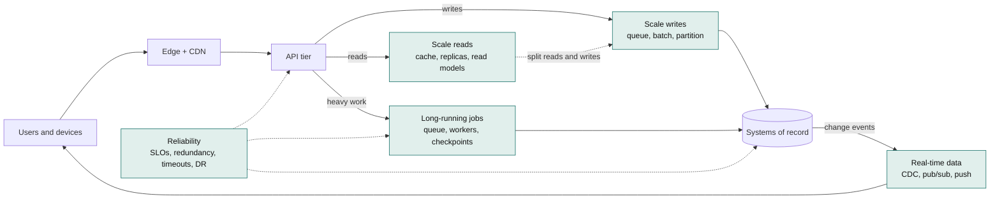
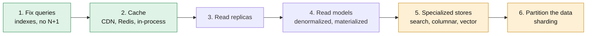
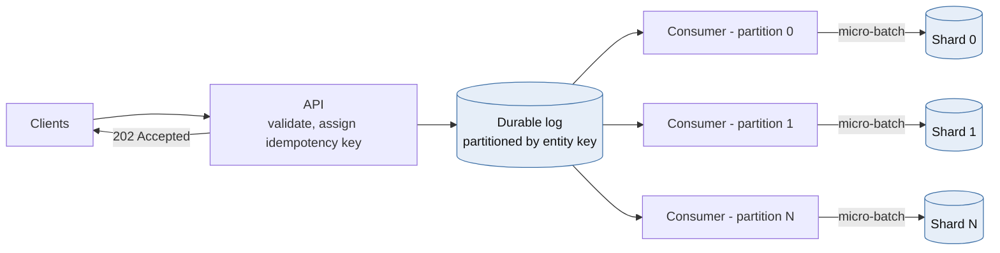
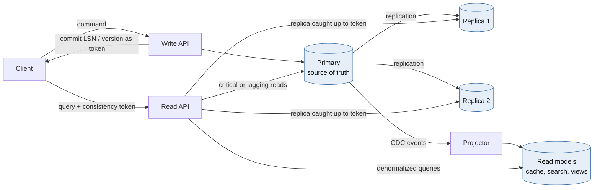
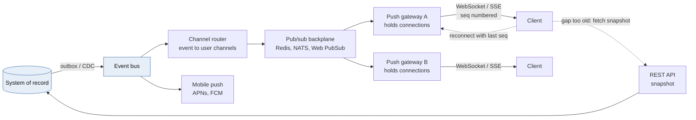
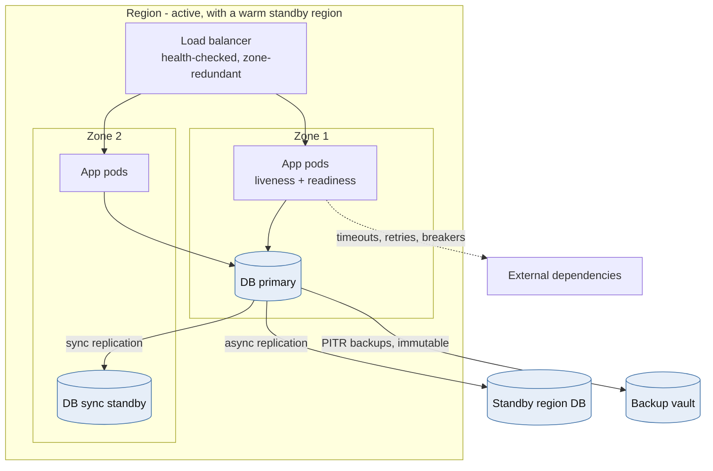
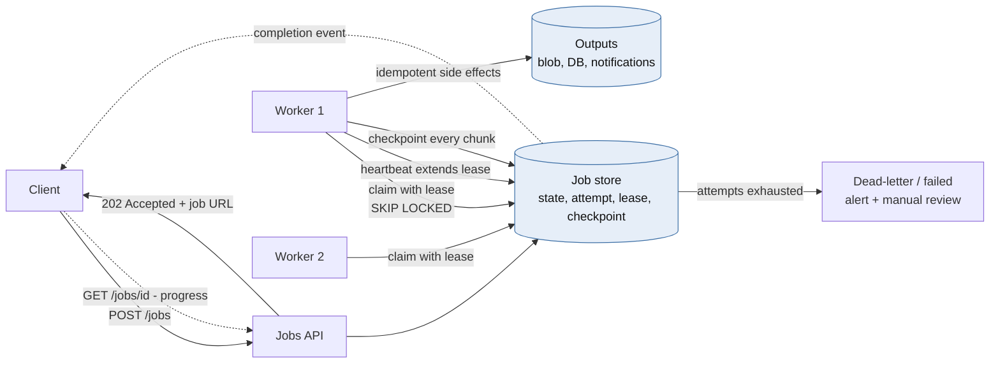
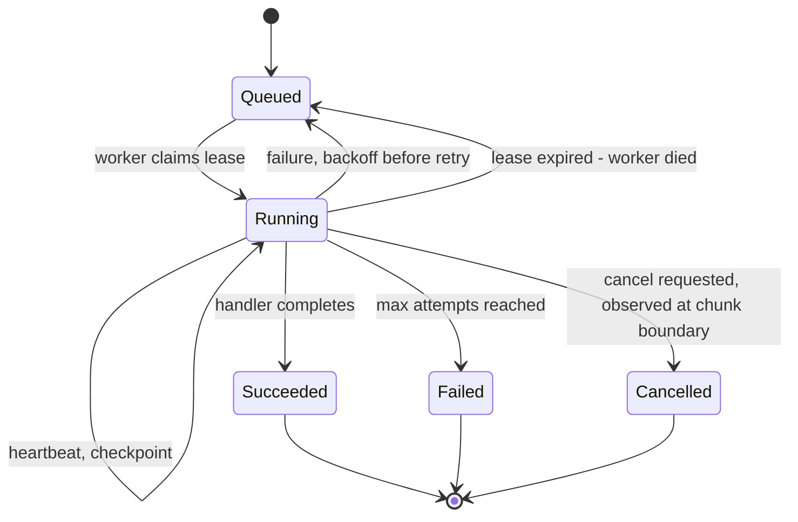
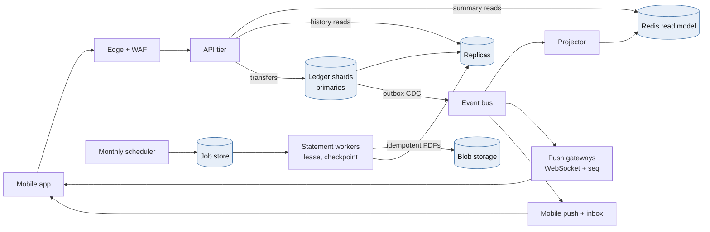

# Module 0 — Core Building Blocks: The Six Scaling Concerns

*Cross-industry foundations used by every later module*

Most system design problems reduce to six recurring concerns. This module treats each one on its own, with techniques, trade-offs, Python and a block diagram. Modules 1–6 then apply them under industry-specific pressure.

| Concern | The core question | Primary techniques | Deeper in |
|---|---|---|---|
| **Scale reads** | How do we serve 10–1,000× more reads than writes without melting the database? | Indexes, caching layers, replicas, denormalized read models | M1 (CQRS), M2 (caching), M4 (replicas) |
| **Scale writes** | How do we absorb more writes than one node can durably commit? | Batching, queues for load leveling, partitioning, write-optimized storage | M1 (ledger shards), M3 (IoT ingest), M4 (sharding, WAL) |
| **Split reads and writes** | How do reads and writes scale independently without users seeing stale or wrong data? | Replica routing, CQRS, consistency tokens, staleness budgets | M1 (CQRS), M4 (routing) |
| **Real-time data** | How do changes reach users and systems within milliseconds to seconds? | CDC and events, push channels, pub/sub fan-out, snapshot + delta | M2 (SSE), M5 (stream processing) |
| **Reliability** | How does the system keep its promises when parts of it fail? | SLOs, redundancy, timeouts, retries, breakers, DR, safe deploys | M3 (resiliency), M4 (replication) |
| **Long-running jobs** | How does work that takes minutes to hours survive crashes, deploys and retries? | Async request–reply, leases and heartbeats, checkpoints, durable workflows | M6 (batch parallel run) |



*[Open full-size diagram: The six scaling concerns on one request path (SVG)](../diagrams/m0-the-six-scaling-concerns-on-one-request-path.svg)*

## 0.1 Scale Reads



*[Open full-size diagram: The read-scaling ladder, cheapest rung first (SVG)](../diagrams/m0-the-read-scaling-ladder-cheapest-rung-first.svg)*

### Theory & trade-offs

Reads usually dominate, at 10:1 to 1,000:1 over writes. They are also *easier* to scale than writes, because a read can be served from a copy. **The whole discipline is deciding how stale each copy may be.** Climb the ladder from the bottom and stop as soon as the numbers work, because every rung adds staleness and operational cost.

1. **Fix the queries first.** A covering index, removing an N+1 pattern, or paginating by keyset instead of `OFFSET` routinely buys 10–100× before any architecture changes.
2. **Cache in layers:**
   - the browser or client (HTTP `Cache-Control`, `ETag`);
   - a **CDN** for static assets and cacheable API responses;
   - a **distributed cache** (Redis);
   - an **in-process cache** (an LRU with a sub-second to seconds TTL, for the hottest keys);
   - the database's own buffer pool.
3. **Read replicas** add read capacity linearly, with replication lag as the price.
4. **Denormalized read models** (CQRS projections, materialized views) precompute the answer so that a read becomes a single key lookup.
5. **Specialized stores** each answer a query shape the OLTP database is bad at: search engines for text, columnar warehouses for analytics, vector indexes for similarity.
6. **Partitioning** is the last rung, used when the dataset itself no longer fits one node's memory and I/O.

**Hit-ratio arithmetic is non-linear.** Database load is `total × (1 − hit ratio)`. Going from a 90% to a 99% hit ratio cuts database load **10×**, while going from 50% to 90% cuts it only 5×. The last few percent of hit ratio are where the money is, and they usually come from better key design, longer TTLs on immutable data, and caching negative results.

### Caching patterns

| Pattern | How it works | Strength | Weakness |
|---|---|---|---|
| **Cache-aside** | The app reads the cache. On a miss it reads the DB, then populates the cache | Simple. The cache holds only what's used | Race conditions on invalidation. The first read after expiry is slow |
| **Read-through** | The cache library loads from the DB on a miss | Loading logic lives in one place | Needs cache-side integration |
| **Write-through** | Writes go to the cache and the DB synchronously | The cache is always warm and fresh | Every write pays cache latency. Caches data nobody reads |
| **Write-behind** | Writes go to the cache, and the DB is updated asynchronously | Very fast writes | Data loss if the cache dies before the flush. **Almost never acceptable for money** |
| **Refresh-ahead** | Hot keys are refreshed before they expire | No latency spike on expiry | Wasted refreshes on keys that went cold |

**Invalidation.** Use TTL for everything, plus explicit invalidation for data that must not be stale:

- On write, **delete** the key. Don't set it: two concurrent writers can otherwise leave the older value in the cache.
- Classic cache-aside still has a race: a reader loads the old row, a writer updates the DB and deletes the key, and *then* the reader writes the stale value it loaded. Mitigations include short TTLs, versioned values (write only if the version is newer), a second delayed delete, or **leases** (the cache hands a token to the first misser and rejects sets carrying stale tokens, as Facebook's memcache paper describes).
- **CDC-driven invalidation** consumes the database's change stream and deletes affected keys, so invalidation cannot be forgotten by a code path.

**Failure modes you must design for:**

- **Cache stampede.** A hot key expires, and 5,000 concurrent requests all miss and hit the database at once. Fixes:
  - **single-flight** (request coalescing): one loader per key, and everyone else awaits it;
  - **stale-while-revalidate**: serve the stale value while one request refreshes;
  - **jittered TTLs**, so keys cached together don't expire together;
  - probabilistic early refresh.
- **Hot keys.** One key receives a large share of traffic (a celebrity profile, today's rates table) and saturates one cache shard. Fixes: an in-process tier in front, replicating the key across shards (`key#0..key#7`, choosing one at random), or pushing it to the CDN.
- **Cold start.** A cache flush or new cluster sends 100% of reads to the database. Capacity-plan the database for a *degraded hit ratio*, warm caches before shifting traffic, and shed load if needed.
- **The cache becomes a hard dependency.** Decide explicitly what happens when Redis is down: serve from the database with shedding, or fail fast.

### Python: cache-aside with single-flight, stale-while-revalidate and jitter

```python
import asyncio
import json
import random
import time
from collections.abc import Awaitable, Callable

import redis.asyncio as redis

r = redis.Redis(host="cache", decode_responses=True)
_inflight: dict[str, asyncio.Future] = {}
_background: set[asyncio.Task] = set()


async def cached(key: str, loader: Callable[[], Awaitable[dict]],
                 ttl_s: float = 60, stale_s: float = 300) -> dict:
    """Serve fresh values from cache, serve stale values while refreshing, coalesce misses."""
    raw = await r.get(key)
    if raw is not None:
        entry = json.loads(raw)
        if time.time() >= entry["fresh_until"] and key not in _inflight:
            task = asyncio.create_task(_load(key, loader, ttl_s, stale_s))   # refresh in background
            _background.add(task)
            task.add_done_callback(_background.discard)
        return entry["value"]          # fresh, or stale-but-acceptable
    return await _load(key, loader, ttl_s, stale_s)


async def _load(key: str, loader: Callable[[], Awaitable[dict]],
                ttl_s: float, stale_s: float) -> dict:
    if (pending := _inflight.get(key)) is not None:
        return await asyncio.shield(pending)   # 5,000 concurrent misses -> 1 database query
    fut: asyncio.Future = asyncio.get_running_loop().create_future()
    fut.add_done_callback(lambda f: f.cancelled() or f.exception())   # never an unretrieved error
    _inflight[key] = fut
    try:
        value = await loader()
        fresh = ttl_s * random.uniform(0.9, 1.1)   # jitter: keys cached together expire apart
        entry = {"value": value, "fresh_until": time.time() + fresh}
        await r.set(key, json.dumps(entry), ex=int(fresh + stale_s))
        fut.set_result(value)
        return value
    except Exception as exc:
        fut.set_exception(exc)
        raise
    finally:
        if not fut.done():
            fut.cancel()
        _inflight.pop(key, None)
```

Single-flight here is **per process**. With 200 pods, a stampede becomes at most 200 loads instead of 5,000, which is usually enough. For truly expensive loaders, add a short Redis `SET NX` lease so only one process fleet-wide recomputes, while the others keep serving stale values.

## 0.2 Scale Writes



*[Open full-size diagram: Write-scaling path, from request to durable storage (SVG)](../diagrams/m0-write-scaling-path-from-request-to-durable-storage.svg)*

### Theory & trade-offs

Writes are harder than reads for three reasons. They must be **durable** (an fsync, a replica ack), they must be **ordered** for the same entity, and they **cannot be served from a copy**. Every technique below either makes a single write cheaper, groups writes together, or spreads them across more independent writers.

| Technique | What it buys | What it costs |
|---|---|---|
| **Cheaper writes** (fewer indexes, append instead of update-in-place, bulk `COPY`) | 2–10× on the same hardware | Slower reads for dropped indexes |
| **Batching and group commit** | Amortizes fsyncs and network round trips across many writes | Adds up to the batch window in latency |
| **Queue-based load leveling** (accept, enqueue, return `202`) | Absorbs spikes. The database runs at a steady rate | Asynchronous results. You need idempotency and a status API |
| **Partitioning** by entity key | The only way to scale one logical write stream horizontally | Cross-partition operations become sagas. Hot keys still hurt |
| **Write-optimized storage** (LSM trees such as Cassandra, ScyllaDB and RocksDB, or time-series DBs) | Sequential disk writes, very high ingest | Read amplification and compaction tuning |
| **Contention removal** (commutative appends, sharded counters) | Removes the row-lock bottleneck on hot entities | Reads must merge the pieces |
| **Mergeable data types** (CRDTs) | Multi-region writes without coordination | Only for data with natural merge semantics |

**Ordering is the hidden scalability limit.** A single global order doesn't scale, because one sequencer eventually saturates. *Per-key* order does scale. Decide which entities need ordering (an account's postings, a device's configuration) and partition by exactly that key. Everything else can be unordered.

**Hot partitions.** A skewed key (a marketplace merchant, a viral post, a single noisy tenant) concentrates writes on one partition however many you have. Options:

- **Key salting:** write to `merchant-42#0..#15` and merge on read.
- **Commutative appends** that are folded in batches.
- **Dedicated capacity** for known-huge keys.

**Queues are buffers, not capacity.** Little's Law applies: if arrivals exceed the service rate for long enough, the backlog grows without bound. Set a **maximum queue-age SLO** (for example, "p99 message age under 30 s"), autoscale consumers on queue age rather than CPU, and shed or reject at the edge when the backlog breaches the limit.

### Python: an async micro-batcher with per-item completion

```python
import asyncio
from collections.abc import Awaitable, Callable
from typing import Generic, TypeVar

T = TypeVar("T")


class MicroBatcher(Generic[T]):
    """Coalesce concurrent writes into one flush. Each caller awaits its own durability."""

    def __init__(self, flush: Callable[[list[T]], Awaitable[None]], *,
                 max_items: int = 500, max_wait_s: float = 0.010, max_pending: int = 10_000) -> None:
        self._flush, self._max_items, self._max_wait = flush, max_items, max_wait_s
        self._q: asyncio.Queue[tuple[T, asyncio.Future]] = asyncio.Queue(maxsize=max_pending)

    async def submit(self, item: T) -> None:
        fut = asyncio.get_running_loop().create_future()
        await self._q.put((item, fut))   # a full queue applies backpressure to callers
        await fut                        # returns only after the batch is durably flushed

    async def run(self) -> None:
        loop = asyncio.get_running_loop()
        while True:
            batch = [await self._q.get()]
            deadline = loop.time() + self._max_wait
            while len(batch) < self._max_items and (remaining := deadline - loop.time()) > 0:
                try:
                    batch.append(await asyncio.wait_for(self._q.get(), remaining))
                except TimeoutError:
                    break
            try:
                await self._flush([item for item, _ in batch])
            except Exception as exc:
                for _, fut in batch:
                    if not fut.done():
                        fut.set_exception(exc)
            else:
                for _, fut in batch:
                    if not fut.done():
                        fut.set_result(None)


# Usage with asyncpg. ON CONFLICT makes a retried batch harmless.
async def flush_events(rows: list[tuple]) -> None:
    async with pool.acquire() as conn:
        await conn.executemany(
            "INSERT INTO telemetry (event_id, device_id, ts, payload) VALUES ($1, $2, $3, $4) "
            "ON CONFLICT (event_id) DO NOTHING", rows)
```

The trade-off is explicit and tunable: `max_wait_s=0.010` adds up to 10 ms of latency per write and can raise throughput by an order of magnitude, because one round trip and one commit now cover up to 500 rows.

## 0.3 Split Reads and Writes



*[Open full-size diagram: Separating the read path from the write path (SVG)](../diagrams/m0-separating-the-read-path-from-the-write-path.svg)*

### Theory & trade-offs

Splitting reads from writes lets each side scale, be optimized, and even use different technology independently. It exists on a spectrum, and each level buys more read scale in exchange for more staleness and more moving parts:

| Level | Separation | Read staleness | Complexity |
|---|---|---|---|
| **L1** | Same database, separate command and query code paths | None | Low |
| **L2** | Primary for writes, **replicas** for reads | Replication lag (ms to s, occasionally minutes) | Medium |
| **L3** | **CQRS**: read models built from events or CDC | Projection lag | High |
| **L4** | Several read stores per query shape (search, cache, warehouse) | Varies per store | Highest |

**The anomalies you create, and their fixes:**

| Anomaly | Example | Fix |
|---|---|---|
| **Read-your-writes** | The user saves a profile, refreshes, and sees the old one | Return a **consistency token** (commit LSN or version) from the write, and read from a replica only once it has replayed past the token. Otherwise read from the primary |
| **Monotonic reads** | Two refreshes hit different replicas, and the data appears to go back in time | Pin the session to one replica, or carry the highest token seen |
| **Causal consistency** | A reply is visible before the message it answers | Carry tokens across services, or read both from the same source |

**Decide a staleness budget per endpoint**, and write it down. It turns a vague architecture debate into a routing table:

| Read | Staleness budget | Route |
|---|---|---|
| Balance used to authorize a payment | 0 | Primary only |
| Balance shown right after the user's own transfer | Read-your-writes | Replica if caught up to the token, else primary |
| Transaction history page | ≤ 5 s | Replica |
| Monthly spending insights | ≤ 1 h | Warehouse / read model |

**Where to route:**

- **In the application** (SQLAlchemy `get_bind`, Django routers; see Module 4). This is the most control, and the only place that knows staleness budgets.
- **In the driver.** PostgreSQL's libpq accepts multi-host connection strings with `target_session_attrs` values such as `read-write`, `standby` and `prefer-standby` (PostgreSQL 14+). This is good for failover, but blind to per-request budgets.
- **In a proxy** (Pgpool-II for PostgreSQL, ProxySQL for MySQL). Transparent, but the proxy can't know which reads tolerate lag.

### Python: read-your-writes routing with LSN consistency tokens

```python
import asyncio
import random

import asyncpg


def lsn_to_int(lsn: str) -> int:
    hi, lo = lsn.split("/")
    return (int(hi, 16) << 32) | int(lo, 16)


class ReplicaLagTracker:
    """Polls each replica's replay position, so routing a read costs no extra query.
    The polled value can only trail reality, which errs toward the primary (safe)."""

    def __init__(self, replicas: dict[str, asyncpg.Pool], interval_s: float = 0.1) -> None:
        self._replicas, self._interval = replicas, interval_s
        self.replayed: dict[str, int] = {name: 0 for name in replicas}

    async def run(self) -> None:
        while True:
            for name, pool in self._replicas.items():
                try:
                    async with asyncio.timeout(0.05):
                        lsn = await pool.fetchval("SELECT pg_last_wal_replay_lsn()::text")
                    self.replayed[name] = lsn_to_int(lsn) if lsn else 0
                except (TimeoutError, OSError, asyncpg.PostgresError):
                    self.replayed[name] = 0   # unreachable means "infinitely behind"
            await asyncio.sleep(self._interval)

    def pick(self, min_lsn: int) -> str | None:
        caught_up = [n for n, lsn in self.replayed.items() if lsn >= min_lsn]
        return random.choice(caught_up) if caught_up else None


async def write_then_token(primary: asyncpg.Pool, sql: str, *args) -> str:
    async with primary.acquire() as conn:
        async with conn.transaction():
            await conn.execute(sql, *args)
        # Read after COMMIT: this position is at or beyond our commit record.
        return await conn.fetchval("SELECT pg_current_wal_lsn()::text")   # send as X-Consistency-Token


async def read_with_token(primary: asyncpg.Pool, replicas: dict[str, asyncpg.Pool],
                          tracker: ReplicaLagTracker, token: str | None, sql: str, *args):
    min_lsn = lsn_to_int(token) if token else 0
    name = tracker.pick(min_lsn)
    pool = replicas[name] if name else primary
    return await pool.fetch(sql, *args)
```

The client stores the token (in a cookie or header) for a short window after its own write and echoes it on reads. Everyone else reads from replicas with no token.

## 0.4 Real-Time Data



*[Open full-size diagram: Real-time delivery - capture, fan out, push, resync (SVG)](../diagrams/m0-real-time-delivery-capture-fan-out-push-resync.svg)*

### Theory & trade-offs

Real-time data has two halves:

1. **Capturing changes** the moment they happen: an outbox table or CDC from the database (Module 1), and domain events.
2. **Delivering them** to people and systems with low latency, over push channels.

Real-time *analytics* (computing over streams, as in Module 5's fraud features) is a third, separate concern.

**Delivery channel options:**

| Channel | Direction | Latency | Strengths | Weaknesses |
|---|---|---|---|---|
| Short polling | Client pulls | Poll interval | Trivial, cache-friendly | Wasted requests. Latency equals the interval |
| Long polling | Client pulls, server holds | Low | Works everywhere | Connection churn |
| **SSE** | Server → client | Low | Plain HTTP, built-in resume via `Last-Event-ID` | One direction. Browsers limit connections on HTTP/1.1 |
| **WebSocket** | Bidirectional | Lowest | Interactive, binary | Stateful connections, harder behind proxies |
| Webhooks | Server → server | Low | Standard for partner integrations | Receiver availability, retries, signature verification |
| Mobile push (APNs/FCM) | Server → device | Seconds, best-effort | Reaches closed apps | No delivery guarantee. Payload limits |

**Principles that separate robust real-time systems from demos:**

- **The push channel is an optimization. The API is the truth.** Messages *will* be lost (a phone switching networks, a gateway restart). Every channel therefore needs **sequence numbers**. On reconnect, the client sends its last sequence number. The server either **replays** from a short buffer, or tells the client to **resync** by fetching a snapshot from the REST API and resubscribing. This is the **snapshot + delta** pattern.
- **Fan-out is its own tier.** Connection-holding gateways are stateful, so keep them thin. A pub/sub backplane routes each event only to the gateways that hold the relevant connections. Managed options such as Azure Web PubSub or SignalR Service take this tier off your hands.
- **Fan-out on write vs. on read.** For feeds, pushing each event into every follower's inbox (on write) is fast to read but expensive for accounts with millions of followers. Pulling at read time is the reverse. Hybrid designs push for normal users and pull for the huge ones.
- **Slow consumers:** use bounded per-connection buffers. Disconnect clients that can't keep up rather than buffering forever. For market data and dashboards, **conflate**: send only the latest value per key and drop intermediate ticks.
- **Critical notifications need a durable path.** WebSocket delivery is effectively at-most-once. For "your card was declined", also write to a durable inbox, and push a hint that says "go fetch".

### Python: WebSocket feed with replay, resync and heartbeats (Redis Streams)

```python
from fastapi import FastAPI, WebSocket, WebSocketDisconnect
import redis.asyncio as redis

app = FastAPI()
r = redis.Redis(host="events", decode_responses=True)


def _id_tuple(stream_id: str) -> tuple[int, int]:
    ms, seq = stream_id.split("-")
    return int(ms), int(seq)


@app.websocket("/v1/ws/accounts/{account_id}")
async def account_feed(ws: WebSocket, account_id: str, last_id: str | None = None) -> None:
    # Authenticate and authorize (this session owns account_id) BEFORE accept(). Omitted here.
    await ws.accept()
    stream = f"acct-events:{account_id}"   # capped with XADD ... MAXLEN ~ 1000
    try:
        cursor = last_id
        if cursor is not None:
            oldest = await r.xrange(stream, count=1)
            if oldest and _id_tuple(cursor) < _id_tuple(oldest[0][0]):
                await ws.send_json({"type": "resync"})   # gap too old: refetch snapshot via REST
                cursor = None
        if cursor is None:
            newest = await r.xrevrange(stream, count=1)
            cursor = newest[0][0] if newest else "0-0"   # pin a concrete position; never re-read "$"
        while True:
            resp = await r.xread({stream: cursor}, block=15_000, count=100)
            if not resp:
                await ws.send_json({"type": "ping"})   # keeps proxies from reaping idle sockets
                continue
            for _stream, entries in resp:
                for entry_id, fields in entries:
                    await ws.send_json({"type": "event", "id": entry_id, **fields})
                    cursor = entry_id
    except WebSocketDisconnect:
        return
```

**The scaling caveat, stated plainly:** one blocking `XREAD` per connection means one Redis connection per user, which is fine for thousands of users and wrong for hundreds of thousands. At scale, each gateway process subscribes *once* per channel (or per shard of channels) through a backplane, keeps a local registry of connection → channels, and fans out in memory. The replay and resync protocol stays exactly the same.

## 0.5 Reliability



*[Open full-size diagram: Reliability layers, from process to region (SVG)](../diagrams/m0-reliability-layers-from-process-to-region.svg)*

### Theory & trade-offs

Reliability means the system does what it promises, **measured from the user's point of view**. Precise vocabulary:

- **SLI:** a measured indicator, such as the fraction of balance requests served successfully in under 300 ms.
- **SLO:** the target for that indicator (99.95% over 28 days).
- **SLA:** the contractual promise, set looser than the SLO.
- **Error budget:** `1 − SLO`. A 99.95% SLO allows ~21.9 minutes of failure per month. When the budget is spent, releases slow down. When it's healthy, the team can move faster.
- **RPO / RTO:** how much data you may lose, and how long recovery may take, per failure scenario.

| Availability | Downtime per 30 days |
|---|---|
| 99% | 7.2 h |
| 99.9% | 43.2 min |
| 99.95% | 21.6 min |
| 99.99% | 4.3 min |

**Availability math:**

- **Serial dependencies multiply.** Five required dependencies at 99.9% each give at most 0.999⁵ ≈ **99.5%**.
- **Redundancy multiplies failure probabilities**, *if failures are independent*. Two independent 99% replicas give 1 − 0.01² = 99.99%.
- **Failures are rarely independent**: shared deploys, shared configuration, shared regions, shared bugs. Correlated failure is why redundancy alone disappoints.

**Techniques by failure scope:**

| Failure | Defence |
|---|---|
| Process crash, memory leak | Supervisors or Kubernetes restarts, liveness probes |
| Node loss | N+1 replicas behind a health-checked load balancer |
| Zone loss | Zone-redundant deployments and databases (synchronous standby in another zone) |
| Region loss | Warm standby or active-active across regions, with a rehearsed failover runbook |
| Slow or failing dependency | Timeouts, retries with jitter and budgets, circuit breakers, bulkheads (Module 3) |
| **Bad deploy or configuration** (the most common cause of outages) | Canary and progressive rollout, feature flags, automated rollback on SLO burn, config treated as code |
| Data corruption or human error | Point-in-time recovery, **immutable** backups, delayed replicas. Replication faithfully copies mistakes, so it is not a backup |
| Overload | Admission control, load shedding by priority, rate limits, autoscaling with headroom |

**Disaster-recovery tiers:**

| Strategy | RTO | RPO | Cost |
|---|---|---|---|
| Backup and restore | Hours to a day | Last backup (minutes with PITR) | $ |
| Pilot light (data replicated, compute off) | Tens of minutes to hours | Seconds to minutes | $$ |
| Warm standby (scaled-down live copy) | Minutes | Seconds | $$$ |
| Active-active | Near zero | Near zero (per the conflict strategy) | $$$$, plus the Module 4 conflict problems |

**Health checks done right:**

- **Liveness** asks "is this process wedged?" It should check almost nothing. Checking the database in liveness turns a database blip into a fleet-wide restart storm.
- **Readiness** asks "should this pod get traffic now?" It fails during warm-up and shutdown, and *may* check critical local dependencies.
- Beware: if readiness checks a shared database, every pod goes unready at once and the load balancer has nothing to route to. Sometimes serving a degraded response beats serving nothing.

**Proof, not hope:** run game days, chaos experiments (kill a zone, add latency to a dependency), and **restore drills**. A backup that has never been restored is a hypothesis. Monitor the four golden signals (latency, traffic, errors, saturation) and alert on **SLO burn rate**, not on CPU.

### Python: liveness vs. readiness, with warm-up and drain

```python
import asyncio
from contextlib import asynccontextmanager

from fastapi import FastAPI, Response

state = {"ready": False}


async def warm_up() -> None: ...        # open pools, load models, prime hot caches
async def close_pools() -> None: ...


@asynccontextmanager
async def lifespan(app: FastAPI):
    await warm_up()
    state["ready"] = True
    yield
    state["ready"] = False              # shutdown: stop claiming readiness
    await close_pools()


app = FastAPI(lifespan=lifespan)


@app.get("/livez")
async def livez() -> dict:
    return {"alive": True}              # never touch dependencies here


@app.get("/readyz")
async def readyz(response: Response) -> dict:
    if not state["ready"]:
        response.status_code = 503
        return {"ready": False, "reason": "starting_or_draining"}
    try:
        async with asyncio.timeout(0.3):
            await db_pool.fetchval("SELECT 1")
    except Exception:
        response.status_code = 503
        return {"ready": False, "reason": "database"}
    return {"ready": True}
```

On Kubernetes, pair this with a `preStop` hook (for example, sleeping 10 s) and a `terminationGracePeriodSeconds` longer than your slowest request. Load balancers need a few seconds to stop routing to a terminating pod. Without that delay, every deploy drops in-flight requests.

## 0.6 Long-Running Jobs



*[Open full-size diagram: Long-running jobs - async request-reply with leases and checkpoints (SVG)](../diagrams/m0-long-running-jobs-async-request-reply-with-leases-and-checkp.svg)*



*[Open full-size diagram: Job lifecycle (SVG)](../diagrams/m0-job-lifecycle.svg)*

### Theory & trade-offs

Some work doesn't fit in a request: generating 3M statements, exporting a customer's data, re-embedding a corpus, reconciling a day's transactions, running a migration backfill. **Long-running jobs outlive the processes that run them.** Deploys, crashes, autoscaling and spot or preemptible eviction all interrupt them. The design goal is that **any job can be interrupted at any moment and resume correctly**.

**The API contract: asynchronous request–reply.**

1. `POST /jobs` returns **`202 Accepted`** with a `Location: /jobs/{id}` header. It accepts an idempotency key, so a retried submit doesn't start two jobs.
2. The client polls `GET /jobs/{id}` (state, progress, result link) or receives a webhook, SSE event or email on completion.
3. `POST /jobs/{id}/cancel` requests cooperative cancellation.

**Execution models:**

| Model | Examples | Best for | Watch out for |
|---|---|---|---|
| **Task queue + workers** | Celery, RQ, Dramatiq, Azure Queue Storage / Service Bus + workers | Many short-to-medium independent tasks | Visibility timeouts, duplicate delivery, no built-in multi-step state |
| **Database-backed queue** | PostgreSQL `FOR UPDATE SKIP LOCKED` | Moderate volume with transactional enqueue (same database as your data) | Polling load, table bloat at very high volume |
| **Batch compute** | Kubernetes Jobs, Azure Batch, AWS Batch | Large parallel compute (rendering, ML, simulations) | Scheduling latency, cost of idle capacity |
| **Durable workflow engines** | Temporal, Azure Durable Functions, AWS Step Functions | Multi-step processes lasting minutes to months, with retries, timers, human steps and compensations | A new programming model with determinism rules for workflow code |
| **Data pipeline orchestrators** | Airflow, Azure Data Factory, Dagster | Scheduled DAGs of data tasks | Not built for per-user, on-demand jobs |

**The mechanics that make jobs survivable:**

- **Leases and heartbeats.** A worker claims a job with a time-limited lease and extends it periodically. If the worker dies, the lease expires and another worker picks the job up. Lease length trades recovery speed (short leases) against false expiry during GC pauses or slow chunks (long leases).
- **Fencing by attempt number.** When a lease expires and a new worker claims the job, the attempt counter increments. Every heartbeat, checkpoint and completion write includes `attempt = :mine`. A stale worker that wakes up can no longer write. This is the same fencing idea as Module 1.
- **Checkpointing.** Persist a cursor (last processed ID, file offset, page token) after each chunk, so a restart resumes instead of starting over. Checkpoint frequency trades re-done work against write overhead.
- **Idempotent chunks.** After a crash, at most the last chunk runs twice, so every side effect must tolerate repetition: deterministic output object keys, upserts, dedupe keys on notifications.
- **Chunking and fan-out.** Split big jobs into many small tasks (map), track completion (a counter or a barrier), then aggregate (reduce). Small tasks retry cheaply and parallelize.
- **Cancellation is cooperative.** Check a flag at chunk boundaries. Forcibly killing work mid-chunk leaves partial side effects.
- **Timeouts and poison jobs.** Cap attempts, retry with exponential backoff, and move exhausted jobs to a dead-letter state with an alert. One bad input must not block the queue forever.
- **Fairness and downstream protection.** Use per-tenant concurrency limits so one customer's 1M-row export doesn't starve everyone else, and global concurrency caps that respect the capacity of the databases and APIs the jobs call.
- **Graceful shutdown.** On `SIGTERM`, stop claiming, finish or checkpoint the current chunk, and release the lease. Set the orchestrator's grace period to cover one chunk.

**A Celery-specific trap:** with Redis or SQS brokers, a task still running when the broker's **visibility timeout** expires is redelivered to another worker, and you now have two copies running. Set the visibility timeout above the longest task runtime, use `acks_late=True`, and keep tasks short by chunking.

### Python: a PostgreSQL-backed job runner with leases, fencing and checkpoints

```sql
CREATE TABLE jobs (
    id               uuid PRIMARY KEY,
    kind             text        NOT NULL,
    payload          jsonb       NOT NULL,
    state            text        NOT NULL DEFAULT 'queued',  -- queued|running|succeeded|failed|cancelled
    attempt          int         NOT NULL DEFAULT 0,
    max_attempts     int         NOT NULL DEFAULT 5,
    lease_owner      text,
    lease_until      timestamptz,
    checkpoint       jsonb,
    progress         real        NOT NULL DEFAULT 0,
    cancel_requested boolean     NOT NULL DEFAULT false,
    run_after        timestamptz NOT NULL DEFAULT now(),
    last_error       text,
    created_at       timestamptz NOT NULL DEFAULT now()
);
CREATE INDEX jobs_claimable ON jobs (run_after) WHERE state IN ('queued', 'running');
```

```python
import asyncio
import json

import asyncpg

CLAIM = """
UPDATE jobs SET state = 'running', attempt = attempt + 1, lease_owner = $1,
       lease_until = now() + make_interval(secs => $2::float8)
 WHERE id = (SELECT id FROM jobs
              WHERE run_after <= now() AND attempt < max_attempts
                AND (state = 'queued' OR (state = 'running' AND lease_until < now()))
              ORDER BY run_after
              FOR UPDATE SKIP LOCKED
              LIMIT 1)
RETURNING id, kind, payload, attempt, checkpoint"""

# Every write below is fenced by (id, lease_owner, attempt): a stale worker matches zero rows.
HEARTBEAT = """UPDATE jobs SET lease_until = now() + make_interval(secs => $4::float8)
                WHERE id = $1 AND lease_owner = $2 AND attempt = $3 AND state = 'running'
            RETURNING cancel_requested"""
CHECKPOINT = """UPDATE jobs SET checkpoint = $4::jsonb, progress = $5
                 WHERE id = $1 AND lease_owner = $2 AND attempt = $3 AND state = 'running'"""
FINISH = """UPDATE jobs SET state = $4, progress = CASE WHEN $4 = 'succeeded' THEN 1 ELSE progress END,
                   lease_owner = NULL
             WHERE id = $1 AND lease_owner = $2 AND attempt = $3"""
RETRY_OR_FAIL = """UPDATE jobs SET state = CASE WHEN attempt >= max_attempts THEN 'failed' ELSE 'queued' END,
                          run_after = now() + make_interval(secs => least(3600, 30 * power(2, attempt))),
                          last_error = $4, lease_owner = NULL
                    WHERE id = $1 AND lease_owner = $2 AND attempt = $3"""


class LeaseLost(Exception):
    pass


async def run_one(pool: asyncpg.Pool, handlers: dict, worker_id: str, lease_s: float = 60) -> bool:
    job = await pool.fetchrow(CLAIM, worker_id, lease_s)
    if job is None:
        return False
    fence = (job["id"], worker_id, job["attempt"])
    cancel = asyncio.Event()

    async def heartbeat() -> None:
        while True:
            await asyncio.sleep(lease_s / 3)
            row = await pool.fetchrow(HEARTBEAT, *fence, lease_s)
            if row is None:
                raise LeaseLost(job["id"])       # someone else owns it now
            if row["cancel_requested"]:
                cancel.set()

    async def save(checkpoint: dict, progress: float) -> None:
        if await pool.execute(CHECKPOINT, *fence, json.dumps(checkpoint), progress) == "UPDATE 0":
            raise LeaseLost(job["id"])

    checkpoint = json.loads(job["checkpoint"]) if job["checkpoint"] else None
    try:
        async with asyncio.TaskGroup() as tg:
            hb = tg.create_task(heartbeat())
            outcome = await handlers[job["kind"]](json.loads(job["payload"]), checkpoint, save, cancel)
            hb.cancel()
    except ExceptionGroup as eg:
        if eg.subgroup(LeaseLost) is None:
            await pool.execute(RETRY_OR_FAIL, *fence, repr(eg.exceptions[0])[:2000])
        return True                              # on LeaseLost: stop quietly, touch nothing
    await pool.execute(FINISH, *fence, outcome)  # 'succeeded' or 'cancelled'
    return True


async def generate_statements(payload: dict, checkpoint: dict | None, save, cancel: asyncio.Event) -> str:
    """Example handler: resumable, chunked, idempotent (object key = account + cycle)."""
    cursor = (checkpoint or {}).get("after_account", "")
    done = (checkpoint or {}).get("done", 0)
    while not cancel.is_set():
        batch = await fetch_account_ids(payload["cycle"], after=cursor, limit=500)
        if not batch:
            return "succeeded"
        for account_id in batch:
            await render_and_store_statement(account_id, payload["cycle"])   # overwrite-safe
        cursor, done = batch[-1], done + len(batch)
        await save({"after_account": cursor, "done": done}, min(done / payload["expected"], 0.99))
    return "cancelled"
```

Operational notes:

- A small **reaper** marks jobs as `failed` when their lease expired *and* attempts are exhausted, because the claim query skips them.
- Run the reaper and `run_one` in a loop with backoff when the queue is empty. Use `LISTEN/NOTIFY` to wake idle workers instead of tight polling.
- **Choosing a model:** past roughly thousands of jobs per second, or once jobs become multi-step with timers and human approvals, move to a dedicated broker or a durable workflow engine (Temporal or Durable Functions). The lease, fence and checkpoint principles carry over unchanged.

## 0.7 Case Study: A Digital Bank's Mobile Backend, Using All Six

**Scenario:** a Canadian digital bank with 3M customers. The morning peak is 5,000 account-summary reads/s and 800 transfers/s. Customers expect instant balance updates and push notifications. Monthly statements must be generated for every account. SLOs are 99.95% for login and balance and 99.9% for statements and exports.

| Concern | Decision | Why | Trade-off accepted |
|---|---|---|---|
| **Scale reads** | Account summaries served from a Redis read model (single-flight, jittered TTLs). Transaction history from replicas | 5,000 reads/s at a 95% hit ratio leaves 250/s for the database | Summaries can be seconds stale, which is labelled "as of" in the app |
| **Split reads and writes** | Staleness budgets per endpoint. Authorization reads the primary. The post-transfer view uses a consistency token | Correctness where money moves, scale everywhere else | Routing logic in the application, and token plumbing |
| **Scale writes** | Ledger partitioned by account (Module 1). Card-network notifications are accepted into a log and applied in micro-batches | 800 TPS sustained with 5× burst headroom | Asynchronous status for some operations |
| **Real-time data** | Outbox → event bus → push gateways (WebSocket) with sequence numbers and snapshot resync. Mobile push for critical alerts, plus a durable in-app inbox | Instant UX without making the socket the source of truth | A resync path must be built and tested |
| **Reliability** | Zone-redundant everything, a warm standby region, canary deploys gated on SLO burn, restore drills quarterly | Most outages are deploys and dependencies, not hardware | Standby cost. Slower but safer releases |
| **Long-running jobs** | Statement generation as a fan-out of 500-account chunks with leases, checkpoints and idempotent PDF keys | 3M statements × ~200 ms ≈ 167 CPU-hours, so ~50 four-core workers finish in under an hour | A job platform to operate |



*[Open full-size diagram: Digital bank backend - all six concerns together (SVG)](../diagrams/m0-digital-bank-backend-all-six-concerns-together.svg)*

## 0.8 Animation Blueprints

### A. Cache stampede, then single-flight

**Scene setup:** 30 small request dots on the left, a cache box in the middle (a key tile `rates:today` with a draining TTL bar), a database box on the right with a **load gauge**, and a latency meter at the bottom.

| Time | Beat | Visual | Manim primitives |
|---|---|---|---|
| 0:00–0:04 | Warm cache | Dots bounce off the cache tile and return green. The database gauge stays near zero | `MoveAlongPath`, `Indicate(tile)` |
| 0:04–0:07 | TTL expires | The TTL bar hits zero and the tile greys out | `ValueTracker` driving a `Rectangle` width |
| 0:07–0:12 | **Stampede** | All 30 dots miss at once and stream to the database. The gauge swings into red, the latency meter spikes, and some dots turn red (timeouts) | `LaggedStart` of 30 arrows, `Rotate(needle)` |
| 0:12–0:14 | Rewind | Rewind to 0:04. Caption: *Same traffic, single-flight + stale-while-revalidate* | `Restore` |
| 0:14–0:20 | **Coalesced** | On expiry the tile turns amber (*stale*). One dot goes to the database while the other 29 are served the stale value immediately. The gauge barely moves | One `GrowArrow` to the DB, 29 short bounces |
| 0:20–0:23 | Refresh lands | The single loader returns, the tile turns green with a new, slightly jittered TTL. Neighbouring keys show different TTL bar lengths | `Transform`, varied bar widths |
| 0:23–0:26 | Recap | *One loader per key. Serve stale while refreshing. Jitter expiries* | `Write` |

### B. A long-running job survives a crash

**Scene setup:** a horizontal progress track of 20 chunks, a job card (`attempt 1`, `lease` ring, `checkpoint: —`), two workers (W1, W2), and an output bucket.

| Time | Beat | Visual | Manim primitives |
|---|---|---|---|
| 0:00–0:05 | Claim and run | W1 claims the job. The lease ring starts, and chunks light up one by one while PDFs drop into the bucket | `FadeIn`, `LaggedStart` |
| 0:05–0:08 | Heartbeat and checkpoint | After every chunk, a checkpoint tag moves along the track (`after_account=…`). The lease ring refills on each heartbeat | `MoveToTarget(tag)`, ring refill |
| 0:08–0:10 | **Crash** | W1 is struck by a lightning bolt mid-chunk 9. The heartbeat stops and the lease ring drains | `Create(bolt)`, `FadeToColor(GREY)` |
| 0:10–0:14 | Reclaim | The lease hits zero. W2 claims the job and the card shows `attempt 2`. W2 **starts from the checkpoint after chunk 8**, not from zero. Chunk 9 is redone, and its PDF overwrites the identical object in the bucket (*idempotent*) | `Transform(card)`, `Indicate(chunk9)` |
| 0:14–0:18 | Zombie write | W1 recovers and tries to write a checkpoint stamped `attempt 1`. It bounces off the job card: *0 rows updated, fenced* | Red `Flash`, the arrow shatters |
| 0:18–0:22 | Complete | W2 finishes chunk 20. The card turns green: *succeeded, 1 chunk re-done out of 20* | `Circumscribe` |

## 0.9 Staff-level Review Questions

- For each endpoint, what is the written staleness budget, and which store serves it?
- What happens to database load at a 50% cache hit ratio (after a flush), and can the database survive it?
- Which entity defines write ordering, and what happens when one key receives 100× the average traffic?
- If a push message is lost, how does the client find out, and how does it recover?
- Which failure scenario has the longest untested recovery path, and when was the last restore drill?
- Can every long-running job be killed at any instant and resume correctly? What proves it?

---

[← Back to contents](../README.md)
