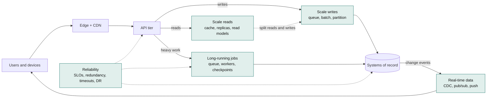
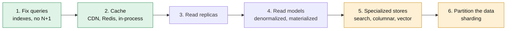
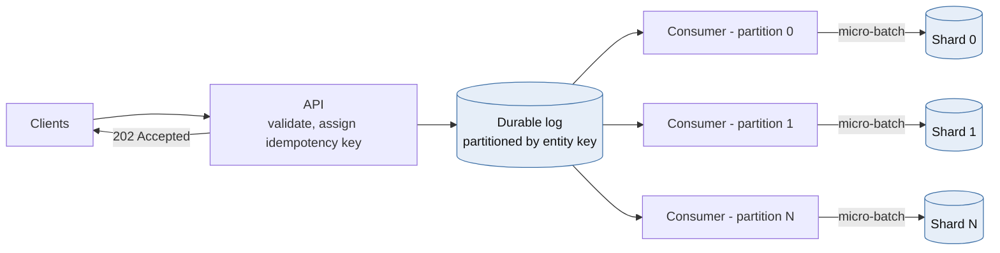
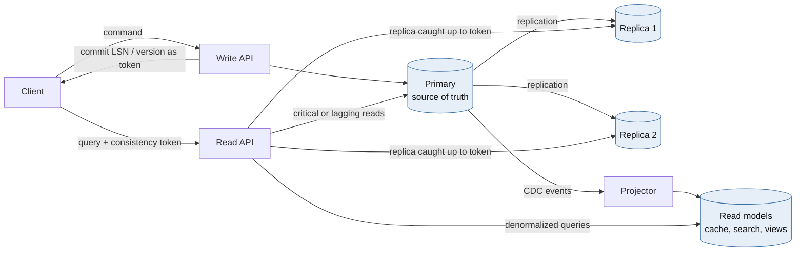
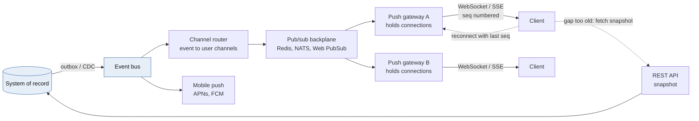
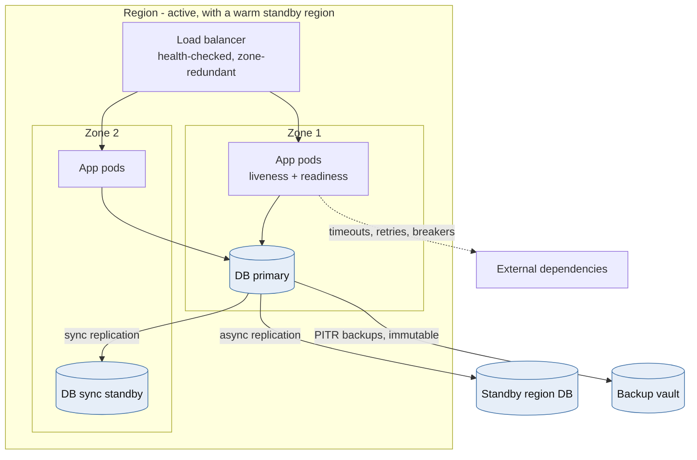
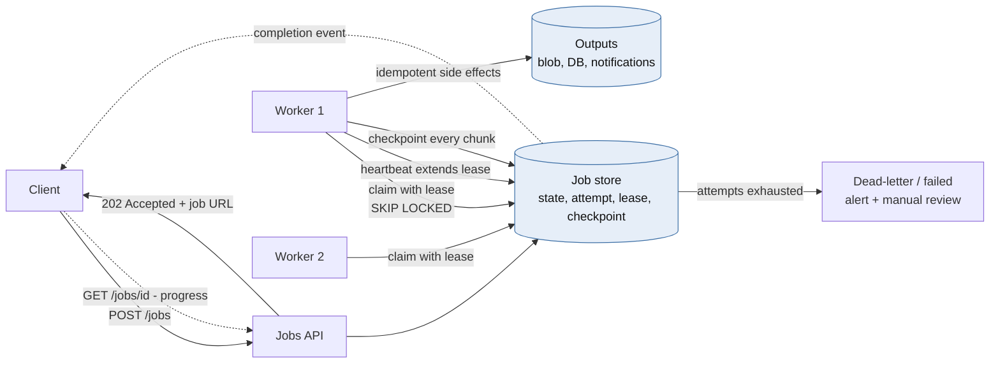
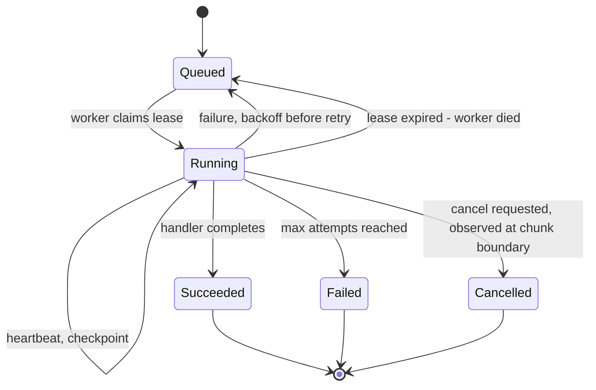
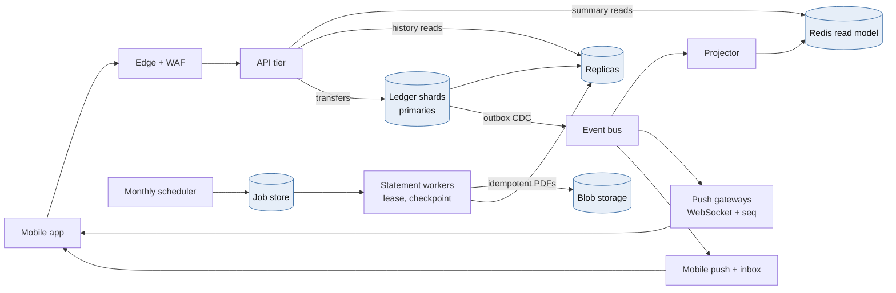

# Module 0 — Core Building Blocks: The Six Scaling Concerns

*Foundations used in every other module*

Most system design problems come down to six questions. This module answers each one with the main techniques, what they cost, some Python, and a diagram. The later modules reuse these ideas in real industries.

| Concern | The question it answers | Main techniques | See also |
|---|---|---|---|
| **Scale reads** | How do we serve far more reads than writes without overloading the database? | Better queries, caches, replicas, precomputed read tables | M1, M2, M4 |
| **Scale writes** | How do we save more writes than one database machine can handle? | Batching, queues, splitting data across machines | M1, M3, M4 |
| **Split reads and writes** | How do reads and writes grow separately without users seeing wrong data? | Replicas, separate read models, "freshness" rules per page | M1, M4 |
| **Real-time data** | How do changes reach users within seconds or less? | Change events, WebSockets/SSE, pub/sub | M2, M5 |
| **Reliability** | How does the system keep working when parts break? | Targets (SLOs), spare copies, timeouts, retries, backups | M3, M4 |
| **Long-running jobs** | How does work that takes minutes or hours survive crashes and restarts? | Job queues, leases, heartbeats, checkpoints | M6 |



*[Open full-size diagram: The six scaling concerns on one request path (SVG)](../diagrams/m0-the-six-scaling-concerns-on-one-request-path.svg)*

## 0.1 Scale Reads



*[Open full-size diagram: The read-scaling ladder, cheapest rung first (SVG)](../diagrams/m0-the-read-scaling-ladder-cheapest-rung-first.svg)*

### The idea

Most systems get far more reads than writes: often 10 to 1,000 times more. Reads are the easier side to scale, because a read can be answered from a **copy** of the data. The real question is always: **how old is that copy allowed to be?**

Work up the ladder from the cheapest step, and stop as soon as it's fast enough. Each step up adds cost and makes data a little more out of date.

1. **Fix the queries.** Add the right index, remove N+1 queries (one query per row in a loop), and page with "WHERE id > last_id" instead of `OFFSET`. This alone often makes things 10 to 100 times faster.
2. **Add caches, in layers:**
   - the browser (HTTP caching headers);
   - a **CDN** (servers close to users that store copies of pages and files);
   - a shared cache such as **Redis**;
   - a small in-memory cache inside each app process for the very hottest data.
3. **Add read replicas.** These are copies of the database that only serve reads. Each one adds read capacity, but it lags a little behind the primary.
4. **Build read models.** Tables or views where the answer is already computed, so a page loads with a single lookup instead of a join across many tables.
5. **Use a specialized store** for query types the main database is bad at: a search engine for text, a data warehouse for reports, a vector index for "find similar meaning".
6. **Split the data across machines (sharding)**, but only when the data itself no longer fits on one machine.

**Cache hit ratio matters more than it looks.** The database only sees the cache misses: `database load = total reads × (1 − hit ratio)`. At a 90% hit ratio the database gets 10% of reads. At 99% it gets 1%, which is **10 times less load**. Small gains near the top make a big difference.

### Caching patterns

| Pattern | How it works | Good | Bad |
|---|---|---|---|
| **Cache-aside** (most common) | The app checks the cache. On a miss it reads the database and saves the result in the cache | Simple. Only caches data that's actually used | The first read after expiry is slow. Easy to get cache clearing wrong |
| **Read-through** | The cache itself loads from the database on a miss | Loading logic is in one place | Needs a cache library that supports it |
| **Write-through** | Every write updates the cache and the database together | The cache is always fresh | Every write is slower. Caches data nobody reads |
| **Write-behind** | Writes go to the cache first, and the database is updated later | Very fast writes | Data is lost if the cache crashes first. **Never use for money** |
| **Refresh-ahead** | Refresh popular items before they expire | No slow first read | Wasted work refreshing items nobody wants anymore |

**Keeping the cache correct (invalidation):**

- Give every cached item a **TTL** (time to live), so it expires automatically.
- When data changes, **delete** the cache entry. Don't overwrite it, because two writers could leave the older value behind.
- There is still a small race condition: a reader loads the old row, a writer changes the database and deletes the cache entry, and then the reader saves its old copy into the cache. Fixes include short TTLs, storing a version number with the value, deleting the entry a second time a moment later, or "leases", where only the first request after a miss is allowed to fill the cache.
- A robust option is to clear cache entries from the **database's change stream (CDC)**. That way no code path can forget to do it.

**Common cache problems to design for:**

- **Cache stampede.** A popular item expires and thousands of requests all miss at once and hit the database together. Fixes:
  - **request coalescing ("single-flight")**: only one request loads the value while the rest wait for it;
  - **serve stale while refreshing**: return the old value while one request fetches the new one;
  - **add randomness to TTLs** so items don't all expire at the same moment.
- **Hot keys.** One item gets so much traffic that it overloads one cache server. Fixes: keep a copy in each app's local memory, spread copies across several cache keys, or put it on the CDN.
- **Cold cache.** After a restart, the cache is empty and every read hits the database. Make sure the database can survive a low hit ratio, warm the cache up first, and turn away extra load if needed.
- **The cache goes down.** Decide ahead of time what happens: read from the database with limits, or fail fast.

### Python: a cache with request coalescing, stale-while-refresh and random TTLs

```python
import asyncio
import json
import random
import time
from collections.abc import Awaitable, Callable

import redis.asyncio as redis

r = redis.Redis(host="cache", decode_responses=True)
_inflight: dict[str, asyncio.Future] = {}
_background: set[asyncio.Task] = set()


async def cached(key: str, loader: Callable[[], Awaitable[dict]],
                 ttl_s: float = 60, stale_s: float = 300) -> dict:
    """Serve fresh values from cache, serve stale values while refreshing, coalesce misses."""
    raw = await r.get(key)
    if raw is not None:
        entry = json.loads(raw)
        if time.time() >= entry["fresh_until"] and key not in _inflight:
            task = asyncio.create_task(_load(key, loader, ttl_s, stale_s))   # refresh in background
            _background.add(task)
            task.add_done_callback(_background.discard)
        return entry["value"]          # fresh, or stale-but-acceptable
    return await _load(key, loader, ttl_s, stale_s)


async def _load(key: str, loader: Callable[[], Awaitable[dict]],
                ttl_s: float, stale_s: float) -> dict:
    if (pending := _inflight.get(key)) is not None:
        return await asyncio.shield(pending)   # 5,000 concurrent misses -> 1 database query
    fut: asyncio.Future = asyncio.get_running_loop().create_future()
    fut.add_done_callback(lambda f: f.cancelled() or f.exception())   # never an unretrieved error
    _inflight[key] = fut
    try:
        value = await loader()
        fresh = ttl_s * random.uniform(0.9, 1.1)   # jitter: keys cached together expire apart
        entry = {"value": value, "fresh_until": time.time() + fresh}
        await r.set(key, json.dumps(entry), ex=int(fresh + stale_s))
        fut.set_result(value)
        return value
    except Exception as exc:
        fut.set_exception(exc)
        raise
    finally:
        if not fut.done():
            fut.cancel()
        _inflight.pop(key, None)
```

"Single-flight" here works **per app process**. With 200 app servers, a stampede becomes at most 200 database loads instead of thousands, which is usually fine. For very expensive loads, add a short Redis lock so only one server in the whole fleet refreshes the value while the rest keep serving the old one.

## 0.2 Scale Writes



*[Open full-size diagram: Write-scaling path, from request to durable storage (SVG)](../diagrams/m0-write-scaling-path-from-request-to-durable-storage.svg)*

### The idea

Writes are harder to scale than reads, for three reasons:

- they must be **saved safely** (written to disk and usually copied to a replica);
- writes to the same thing (like one bank account) often must happen **in order**;
- they **can't be answered from a copy**.

Every technique below does one of three things: it makes each write cheaper, groups many writes together, or spreads writes across more machines.

| Technique | What you gain | What you give up |
|---|---|---|
| **Cheaper writes** (fewer indexes, append new rows instead of updating, bulk `COPY`) | 2–10× faster on the same hardware | Some reads get slower without those indexes |
| **Batching** (save many writes in one go) | Far fewer disk syncs and round trips | Each write waits a few milliseconds for its batch |
| **Queue in front** (accept the request, reply "202 Accepted", process it later) | Traffic spikes are absorbed and the database works at a steady pace | The result isn't immediate. You need a way to report status, and safe retries |
| **Split data by key (sharding)** | Many machines accept writes at once | Operations across two shards get harder |
| **Write-optimized databases** (Cassandra, ScyllaDB, time-series databases) | Very high write rates | Reads and maintenance are harder |
| **Avoid fighting over one row** (append instead of update, split one counter into several) | No lock queue on busy rows | Reads must add the pieces together |
| **Mergeable data types (CRDTs)** | Writes in several regions without coordination | Only works for data that merges naturally, such as counters and sets |

**Ordering limits scaling.** If *everything* must be in one global order, one machine ends up doing the ordering, and it becomes the bottleneck. Usually only writes to the *same thing* need ordering, such as one account's transactions or one device's settings. So split the data by that key, and let everything else run in parallel.

**Hot partitions.** If one key is extremely busy (a huge merchant, a viral post, one big customer), it overloads its shard however many shards you have. Fixes: split the key into sub-keys (`merchant-42#0` to `#15`) and add them up when reading, append changes and combine them in batches, or give that key its own machine.

**A queue is a buffer, not extra capacity.** If messages arrive faster than you process them for long enough, the queue grows forever. Set a target such as "messages wait less than 30 seconds", add workers based on how long messages have been waiting (not on CPU), and turn requests away when the queue is too far behind.

### Python: an async micro-batcher

```python
import asyncio
from collections.abc import Awaitable, Callable
from typing import Generic, TypeVar

T = TypeVar("T")


class MicroBatcher(Generic[T]):
    """Coalesce concurrent writes into one flush. Each caller awaits its own durability."""

    def __init__(self, flush: Callable[[list[T]], Awaitable[None]], *,
                 max_items: int = 500, max_wait_s: float = 0.010, max_pending: int = 10_000) -> None:
        self._flush, self._max_items, self._max_wait = flush, max_items, max_wait_s
        self._q: asyncio.Queue[tuple[T, asyncio.Future]] = asyncio.Queue(maxsize=max_pending)

    async def submit(self, item: T) -> None:
        fut = asyncio.get_running_loop().create_future()
        await self._q.put((item, fut))   # a full queue applies backpressure to callers
        await fut                        # returns only after the batch is durably flushed

    async def run(self) -> None:
        loop = asyncio.get_running_loop()
        while True:
            batch = [await self._q.get()]
            deadline = loop.time() + self._max_wait
            while len(batch) < self._max_items and (remaining := deadline - loop.time()) > 0:
                try:
                    batch.append(await asyncio.wait_for(self._q.get(), remaining))
                except TimeoutError:
                    break
            try:
                await self._flush([item for item, _ in batch])
            except Exception as exc:
                for _, fut in batch:
                    if not fut.done():
                        fut.set_exception(exc)
            else:
                for _, fut in batch:
                    if not fut.done():
                        fut.set_result(None)


# Usage with asyncpg. ON CONFLICT makes a retried batch harmless.
async def flush_events(rows: list[tuple]) -> None:
    async with pool.acquire() as conn:
        await conn.executemany(
            "INSERT INTO telemetry (event_id, device_id, ts, payload) VALUES ($1, $2, $3, $4) "
            "ON CONFLICT (event_id) DO NOTHING", rows)
```

The trade-off is easy to tune. Waiting up to 10 ms adds a little delay to each write, but one database round trip and one commit now save up to 500 rows. That can mean 10 times more writes per second.

## 0.3 Split Reads and Writes



*[Open full-size diagram: Separating the read path from the write path (SVG)](../diagrams/m0-separating-the-read-path-from-the-write-path.svg)*

### The idea

If reads and writes use separate paths, each side can grow and be optimized on its own, even with different databases. There are several levels. Each level gives you more read capacity, but data gets more out of date and there are more parts to run.

| Level | What's separated | How stale reads can be | Complexity |
|---|---|---|---|
| **L1** | Same database, but separate code for reads and writes | Not stale | Low |
| **L2** | Writes go to the primary, reads go to **replicas** | A little: milliseconds to seconds, sometimes minutes | Medium |
| **L3** | **CQRS**: separate read tables, built from change events | The time it takes to update the read tables | High |
| **L4** | Several read stores for different needs (search, cache, warehouse) | Different for each store | Highest |

**Problems this causes, and how to fix them:**

| Problem | Example | Fix |
|---|---|---|
| **Not seeing your own write** | You save your profile, refresh, and see the old version | After the write, give the client a **token** (the database's log position or a version). Only read from a replica that has caught up to that token, otherwise read from the primary |
| **Going back in time** | Two refreshes hit different replicas, and newer data seems to disappear | Keep a user on one replica, or remember the newest token they've seen |
| **Effects before causes** | A reply shows up before the message it answers | Carry tokens between services, or read both items from the same place |

**Write down a "freshness budget" for every page or API.** It turns a vague debate into a simple routing table:

| Read | How stale it may be | Where to read |
|---|---|---|
| Balance used to approve a payment | Must be current | Primary only |
| Balance shown right after your own transfer | Must include your own write | Replica if caught up, else primary |
| Transaction history page | Up to 5 seconds old | Replica |
| Monthly spending chart | Up to 1 hour old | Warehouse or read model |

**Where the routing decision can happen:**

- **In the app code** (SQLAlchemy `get_bind`, Django database routers; see Module 4). You have the most control, and it's the only place that knows each page's freshness budget.
- **In the database driver.** PostgreSQL's libpq can take several hosts and a `target_session_attrs` setting such as `read-write` or `prefer-standby` (PostgreSQL 14+). Great for failover, but it can't tell which reads are allowed to be stale.
- **In a proxy** (Pgpool-II for PostgreSQL, ProxySQL for MySQL). Invisible to the app, but it can't know which reads may be stale either.

### Python: read-your-own-writes using database log positions

```python
import asyncio
import random

import asyncpg


def lsn_to_int(lsn: str) -> int:
    hi, lo = lsn.split("/")
    return (int(hi, 16) << 32) | int(lo, 16)


class ReplicaLagTracker:
    """Polls each replica's replay position, so routing a read costs no extra query.
    The polled value can only trail reality, which errs toward the primary (safe)."""

    def __init__(self, replicas: dict[str, asyncpg.Pool], interval_s: float = 0.1) -> None:
        self._replicas, self._interval = replicas, interval_s
        self.replayed: dict[str, int] = {name: 0 for name in replicas}

    async def run(self) -> None:
        while True:
            for name, pool in self._replicas.items():
                try:
                    async with asyncio.timeout(0.05):
                        lsn = await pool.fetchval("SELECT pg_last_wal_replay_lsn()::text")
                    self.replayed[name] = lsn_to_int(lsn) if lsn else 0
                except (TimeoutError, OSError, asyncpg.PostgresError):
                    self.replayed[name] = 0   # unreachable means "infinitely behind"
            await asyncio.sleep(self._interval)

    def pick(self, min_lsn: int) -> str | None:
        caught_up = [n for n, lsn in self.replayed.items() if lsn >= min_lsn]
        return random.choice(caught_up) if caught_up else None


async def write_then_token(primary: asyncpg.Pool, sql: str, *args) -> str:
    async with primary.acquire() as conn:
        async with conn.transaction():
            await conn.execute(sql, *args)
        # Read after COMMIT: this position is at or beyond our commit record.
        return await conn.fetchval("SELECT pg_current_wal_lsn()::text")   # send as X-Consistency-Token


async def read_with_token(primary: asyncpg.Pool, replicas: dict[str, asyncpg.Pool],
                          tracker: ReplicaLagTracker, token: str | None, sql: str, *args):
    min_lsn = lsn_to_int(token) if token else 0
    name = tracker.pick(min_lsn)
    pool = replicas[name] if name else primary
    return await pool.fetch(sql, *args)
```

The client keeps the token (in a cookie or header) for a short time after its own write and sends it with reads. Everyone else reads from replicas without a token.

## 0.4 Real-Time Data



*[Open full-size diagram: Real-time delivery - capture, fan out, push, resync (SVG)](../diagrams/m0-real-time-delivery-capture-fan-out-push-resync.svg)*

### The idea

Real-time data has two halves:

1. **Noticing changes** the moment they happen, using an outbox table or CDC (see Module 1) and events.
2. **Delivering** those changes to users and other systems quickly, using "push" channels.

Analysing data as it flows (like fraud detection in Module 5) is a separate topic.

**Ways to deliver updates:**

| Method | Direction | Delay | Good | Bad |
|---|---|---|---|---|
| Short polling (ask every few seconds) | Client asks | As long as the interval | Very simple | Many wasted requests |
| Long polling (server holds the request open until there's news) | Client asks | Low | Works everywhere | Constant reconnecting |
| **SSE (Server-Sent Events)** | Server → client | Low | Plain HTTP. Can resume where it left off | One direction only |
| **WebSocket** | Both directions | Lowest | Interactive, supports binary data | Keeps a connection open per user. Harder through proxies |
| Webhooks | Server → another server | Low | Standard way to notify partner systems | The receiver must be up. Needs retries and signature checks |
| Mobile push (APNs, FCM) | Server → phone | Seconds, best effort | Reaches apps that are closed | Delivery isn't guaranteed. Small payloads only |

**Rules that make real-time systems robust:**

- **The push channel is a shortcut. The API is the truth.** Messages *will* get lost, for example when a phone switches networks or a server restarts. So number every message. When a client reconnects, it sends the last number it saw. The server either **replays** what was missed, or tells the client to **reload a fresh snapshot** from the normal API. This is called the **snapshot + updates** pattern.
- **Keep the connection servers thin.** The servers that hold open connections should do little else. A pub/sub system (Redis, NATS, or managed services such as Azure Web PubSub) sends each event only to the servers that hold the right users' connections.
- **Push on write vs. pull on read.** For feeds, copying each post into every follower's inbox makes reading fast, but it's expensive for accounts with millions of followers. Many systems push for normal accounts and pull for huge ones.
- **Slow clients:** give each connection a small, limited buffer, and disconnect clients that can't keep up. For live prices or dashboards, send only the **latest** value and skip the in-between ones.
- **Important alerts need a second path.** A WebSocket message may be lost. For "your card was declined", also save the message to an inbox in the database, and use the push only as a hint to go check it.

### Python: a WebSocket feed that replays, reloads and sends heartbeats (Redis Streams)

```python
from fastapi import FastAPI, WebSocket, WebSocketDisconnect
import redis.asyncio as redis

app = FastAPI()
r = redis.Redis(host="events", decode_responses=True)


def _id_tuple(stream_id: str) -> tuple[int, int]:
    ms, seq = stream_id.split("-")
    return int(ms), int(seq)


@app.websocket("/v1/ws/accounts/{account_id}")
async def account_feed(ws: WebSocket, account_id: str, last_id: str | None = None) -> None:
    # Authenticate and authorize (this session owns account_id) BEFORE accept(). Omitted here.
    await ws.accept()
    stream = f"acct-events:{account_id}"   # capped with XADD ... MAXLEN ~ 1000
    try:
        cursor = last_id
        if cursor is not None:
            oldest = await r.xrange(stream, count=1)
            if oldest and _id_tuple(cursor) < _id_tuple(oldest[0][0]):
                await ws.send_json({"type": "resync"})   # gap too old: refetch snapshot via REST
                cursor = None
        if cursor is None:
            newest = await r.xrevrange(stream, count=1)
            cursor = newest[0][0] if newest else "0-0"   # pin a concrete position; never re-read "$"
        while True:
            resp = await r.xread({stream: cursor}, block=15_000, count=100)
            if not resp:
                await ws.send_json({"type": "ping"})   # keeps proxies from reaping idle sockets
                continue
            for _stream, entries in resp:
                for entry_id, fields in entries:
                    await ws.send_json({"type": "event", "id": entry_id, **fields})
                    cursor = entry_id
    except WebSocketDisconnect:
        return
```

**Important limit:** this example keeps one blocking Redis read per connected user. That's fine for thousands of users but wrong for hundreds of thousands. At that scale, each server process subscribes *once* to each channel, keeps its own list of which connections want which channel, and forwards messages in memory. The replay and reload rules stay the same.

## 0.5 Reliability



*[Open full-size diagram: Reliability layers, from process to region (SVG)](../diagrams/m0-reliability-layers-from-process-to-region.svg)*

### The idea

Reliability means the system does what it promises, **as seen by users**. Some useful terms:

- **SLI:** something you measure, for example "the share of balance requests answered successfully within 300 ms".
- **SLO:** the target for it, for example "99.95% over 28 days".
- **SLA:** a promise in a contract. It is set a bit lower than the SLO, to leave a safety margin.
- **Error budget:** the failures your SLO allows. A 99.95% target allows about 22 minutes of failure per month. If you use it up, slow down releases. If you have plenty left, you can move faster.
- **RPO / RTO:** how much data you may lose, and how long recovery may take.

| Availability | Downtime allowed per 30 days |
|---|---|
| 99% | 7.2 hours |
| 99.9% | 43 minutes |
| 99.95% | 22 minutes |
| 99.99% | 4.3 minutes |

**Reliability maths:**

- **Things you depend on multiply together.** If your service needs five other services and each is up 99.9% of the time, your service is up at most 0.999⁵ ≈ **99.5%**.
- **Spare copies help**, if they fail independently. Two copies that are each up 99% give 1 − 0.01 × 0.01 = 99.99%.
- **In real life, failures are often linked.** The same bad deploy, the same config mistake or the same region outage can take out all copies at once. That's why spare copies alone aren't enough.

**What to do for each kind of failure:**

| What fails | Defence |
|---|---|
| A process crashes or leaks memory | Automatic restarts (for example Kubernetes), health checks |
| A machine dies | At least one spare copy behind a health-checked load balancer |
| A data centre zone goes down | Run copies in several zones. Keep a synchronous database standby in another zone |
| A whole region goes down | A standby region, with a failover plan you've practised |
| A service you call is slow or failing | Timeouts, retries with backoff, circuit breakers, separate connection pools (Module 3) |
| **A bad deploy or config change** (the most common cause of outages) | Release to a small slice of traffic first (canary), feature flags, automatic rollback |
| Data gets corrupted or deleted by mistake | Point-in-time backups that can't be edited or deleted. Note that replicas copy mistakes too, so a replica is not a backup |
| Too much traffic | Admission limits, dropping low-priority work, rate limits, autoscaling with spare room |

**Disaster recovery options:**

| Strategy | Time to recover | Data you might lose | Cost |
|---|---|---|---|
| Backup and restore | Hours to a day | Since the last backup (minutes with point-in-time recovery) | $ |
| Pilot light (data copied, servers switched off) | Tens of minutes to hours | Seconds to minutes | $$ |
| Warm standby (a smaller live copy running) | Minutes | Seconds | $$$ |
| Active-active (full copies all serving traffic) | Almost none | Almost none, but see the conflict problems in Module 4 | $$$$ |

**Health checks, done right:**

- **Liveness** asks "is this process stuck?" It should check almost nothing. If it checks the database, one database hiccup restarts every server at once.
- **Readiness** asks "should this server get traffic right now?" It says no while starting up and shutting down, and it *may* check important dependencies.
- Be careful: if every server's readiness check depends on the same database, they all go "not ready" together and the load balancer has nowhere to send traffic. Sometimes a partly working answer is better than none.

**Prove it works; don't hope.** Run practice outages ("game days"), deliberately break things in a controlled way (chaos testing), and **practise restoring backups**. A backup you have never restored might not work. Watch the four golden signals (latency, traffic, errors and saturation), and alert when you're burning through your error budget, not when CPU is high.

### Python: liveness vs. readiness, with warm-up and clean shutdown

```python
import asyncio
from contextlib import asynccontextmanager

from fastapi import FastAPI, Response

state = {"ready": False}


async def warm_up() -> None: ...        # open pools, load models, prime hot caches
async def close_pools() -> None: ...


@asynccontextmanager
async def lifespan(app: FastAPI):
    await warm_up()
    state["ready"] = True
    yield
    state["ready"] = False              # shutdown: stop claiming readiness
    await close_pools()


app = FastAPI(lifespan=lifespan)


@app.get("/livez")
async def livez() -> dict:
    return {"alive": True}              # never touch dependencies here


@app.get("/readyz")
async def readyz(response: Response) -> dict:
    if not state["ready"]:
        response.status_code = 503
        return {"ready": False, "reason": "starting_or_draining"}
    try:
        async with asyncio.timeout(0.3):
            await db_pool.fetchval("SELECT 1")
    except Exception:
        response.status_code = 503
        return {"ready": False, "reason": "database"}
    return {"ready": True}
```

On Kubernetes, add a `preStop` hook (for example, wait 10 seconds) and a shutdown grace period longer than your slowest request. Load balancers take a few seconds to stop sending traffic to a server that is shutting down. Without that wait, every deploy drops some requests.

## 0.6 Long-Running Jobs



*[Open full-size diagram: Long-running jobs - async request-reply with leases and checkpoints (SVG)](../diagrams/m0-long-running-jobs-async-request-reply-with-leases-and-checkp.svg)*



*[Open full-size diagram: Job lifecycle (SVG)](../diagrams/m0-job-lifecycle.svg)*

### The idea

Some work is too big for one web request: making 3 million bank statements, exporting a customer's data, re-processing a document library, or running a data migration. **These jobs often run longer than the servers running them stay up.** Deploys, crashes, autoscaling and cloud machines being taken back all interrupt them. The goal is simple to state: **any job can be stopped at any moment and continue correctly later.**

**How the API should look (asynchronous request–reply):**

1. `POST /jobs` replies **`202 Accepted`** with a link (`/jobs/{id}`) where the client can check on the job. The request carries an idempotency key, so sending it twice doesn't start two jobs.
2. The client checks `GET /jobs/{id}` for status and progress, or gets notified when the job is done (webhook, SSE or email).
3. `POST /jobs/{id}/cancel` asks the job to stop.

**Ways to run jobs:**

| Option | Examples | Best for | Watch out for |
|---|---|---|---|
| **Task queue + workers** | Celery, RQ, Azure Service Bus + workers | Many small or medium tasks | Messages delivered twice. No built-in tracking across steps |
| **Database as the queue** | PostgreSQL with `FOR UPDATE SKIP LOCKED` | Moderate volume, when the job should be created in the same transaction as your data | Constant polling, and table growth at very high volume |
| **Batch computing** | Kubernetes Jobs, Azure Batch | Heavy parallel computing | Slow to start. Idle machines cost money |
| **Durable workflow engines** | Temporal, Azure Durable Functions, AWS Step Functions | Multi-step processes lasting minutes to months, with timers and human approvals | A new way of writing code, with rules to follow |
| **Pipeline schedulers** | Airflow, Azure Data Factory | Scheduled data pipelines | Not meant for on-demand jobs per user |

**How to make jobs survive failures:**

- **Leases and heartbeats.** A worker "borrows" a job for a limited time (a lease) and keeps renewing it (a heartbeat). If the worker dies, the lease runs out and another worker takes over. Short leases recover faster. Long leases are less likely to expire by mistake during a slow step.
- **Attempt numbers as fencing.** Each time a job is taken over, its attempt number goes up. Every progress update includes "attempt = mine". An old worker that wakes up can no longer overwrite anything. This is the same fencing idea as in Module 1.
- **Checkpoints.** Save your position after each chunk of work (for example, "last account processed"). A restarted job continues from there instead of starting over. Saving more often means less repeated work but more writes.
- **Every chunk must be safe to repeat.** After a crash, the last chunk may run twice. So use fixed file names, upserts, and duplicate checks on notifications.
- **Split big jobs.** Break them into many small tasks that run in parallel, track when they're all done, then combine the results. Small tasks are cheap to retry.
- **Cancelling is polite.** The job checks a "please stop" flag between chunks. Killing it mid-chunk can leave half-finished changes.
- **Limit retries.** Retry with growing waits, and after a set number of attempts, move the job to a "failed" (dead-letter) state and alert someone. One bad input must never block the queue forever.
- **Be fair and protect other systems.** Limit how many jobs each customer can run at once, so one huge export doesn't block everyone else. Cap total concurrency so jobs don't overload the databases and APIs they call.
- **Clean shutdown.** When the server is told to stop (`SIGTERM`), stop taking new work, finish or checkpoint the current chunk, and release the lease.

**Celery trap:** with Redis or SQS brokers, if a task runs longer than the broker's **visibility timeout**, the broker assumes the worker died and gives the task to another worker. Now two copies are running. Set that timeout longer than your longest task, use `acks_late=True`, and split long tasks into chunks.

### Python: a PostgreSQL job runner with leases, fencing and checkpoints

```sql
CREATE TABLE jobs (
    id               uuid PRIMARY KEY,
    kind             text        NOT NULL,
    payload          jsonb       NOT NULL,
    state            text        NOT NULL DEFAULT 'queued',  -- queued|running|succeeded|failed|cancelled
    attempt          int         NOT NULL DEFAULT 0,
    max_attempts     int         NOT NULL DEFAULT 5,
    lease_owner      text,
    lease_until      timestamptz,
    checkpoint       jsonb,
    progress         real        NOT NULL DEFAULT 0,
    cancel_requested boolean     NOT NULL DEFAULT false,
    run_after        timestamptz NOT NULL DEFAULT now(),
    last_error       text,
    created_at       timestamptz NOT NULL DEFAULT now()
);
CREATE INDEX jobs_claimable ON jobs (run_after) WHERE state IN ('queued', 'running');
```

```python
import asyncio
import json

import asyncpg

CLAIM = """
UPDATE jobs SET state = 'running', attempt = attempt + 1, lease_owner = $1,
       lease_until = now() + make_interval(secs => $2::float8)
 WHERE id = (SELECT id FROM jobs
              WHERE run_after <= now() AND attempt < max_attempts
                AND (state = 'queued' OR (state = 'running' AND lease_until < now()))
              ORDER BY run_after
              FOR UPDATE SKIP LOCKED
              LIMIT 1)
RETURNING id, kind, payload, attempt, checkpoint"""

# Every write below is fenced by (id, lease_owner, attempt): a stale worker matches zero rows.
HEARTBEAT = """UPDATE jobs SET lease_until = now() + make_interval(secs => $4::float8)
                WHERE id = $1 AND lease_owner = $2 AND attempt = $3 AND state = 'running'
            RETURNING cancel_requested"""
CHECKPOINT = """UPDATE jobs SET checkpoint = $4::jsonb, progress = $5
                 WHERE id = $1 AND lease_owner = $2 AND attempt = $3 AND state = 'running'"""
FINISH = """UPDATE jobs SET state = $4, progress = CASE WHEN $4 = 'succeeded' THEN 1 ELSE progress END,
                   lease_owner = NULL
             WHERE id = $1 AND lease_owner = $2 AND attempt = $3"""
RETRY_OR_FAIL = """UPDATE jobs SET state = CASE WHEN attempt >= max_attempts THEN 'failed' ELSE 'queued' END,
                          run_after = now() + make_interval(secs => least(3600, 30 * power(2, attempt))),
                          last_error = $4, lease_owner = NULL
                    WHERE id = $1 AND lease_owner = $2 AND attempt = $3"""


class LeaseLost(Exception):
    pass


async def run_one(pool: asyncpg.Pool, handlers: dict, worker_id: str, lease_s: float = 60) -> bool:
    job = await pool.fetchrow(CLAIM, worker_id, lease_s)
    if job is None:
        return False
    fence = (job["id"], worker_id, job["attempt"])
    cancel = asyncio.Event()

    async def heartbeat() -> None:
        while True:
            await asyncio.sleep(lease_s / 3)
            row = await pool.fetchrow(HEARTBEAT, *fence, lease_s)
            if row is None:
                raise LeaseLost(job["id"])       # someone else owns it now
            if row["cancel_requested"]:
                cancel.set()

    async def save(checkpoint: dict, progress: float) -> None:
        if await pool.execute(CHECKPOINT, *fence, json.dumps(checkpoint), progress) == "UPDATE 0":
            raise LeaseLost(job["id"])

    checkpoint = json.loads(job["checkpoint"]) if job["checkpoint"] else None
    try:
        async with asyncio.TaskGroup() as tg:
            hb = tg.create_task(heartbeat())
            outcome = await handlers[job["kind"]](json.loads(job["payload"]), checkpoint, save, cancel)
            hb.cancel()
    except ExceptionGroup as eg:
        if eg.subgroup(LeaseLost) is None:
            await pool.execute(RETRY_OR_FAIL, *fence, repr(eg.exceptions[0])[:2000])
        return True                              # on LeaseLost: stop quietly, touch nothing
    await pool.execute(FINISH, *fence, outcome)  # 'succeeded' or 'cancelled'
    return True


async def generate_statements(payload: dict, checkpoint: dict | None, save, cancel: asyncio.Event) -> str:
    """Example handler: resumable, chunked, idempotent (object key = account + cycle)."""
    cursor = (checkpoint or {}).get("after_account", "")
    done = (checkpoint or {}).get("done", 0)
    while not cancel.is_set():
        batch = await fetch_account_ids(payload["cycle"], after=cursor, limit=500)
        if not batch:
            return "succeeded"
        for account_id in batch:
            await render_and_store_statement(account_id, payload["cycle"])   # overwrite-safe
        cursor, done = batch[-1], done + len(batch)
        await save({"after_account": cursor, "done": done}, min(done / payload["expected"], 0.99))
    return "cancelled"
```

Notes:

- Run a small cleanup job (a "reaper") that marks jobs as `failed` when their lease expired *and* they have no attempts left. The claim query skips those jobs.
- Loop `run_one` with a pause when there's no work. PostgreSQL's `LISTEN/NOTIFY` can wake workers up instead of constant polling.
- **When to switch:** at thousands of jobs per second, or when jobs have many steps with timers and human approvals, move to a dedicated queue or a workflow engine such as Temporal. The same ideas (leases, fencing and checkpoints) still apply.

## 0.7 Case Study: A Digital Bank's Mobile Backend, Using All Six

**Scenario:** a Canadian online bank with 3 million customers. At the morning peak there are 5,000 account-summary reads and 800 money transfers every second. Customers expect balances to update instantly, with push notifications. Every account needs a monthly statement. Targets: 99.95% uptime for login and balance, and 99.9% for statements and exports.

| Concern | What we do | Why | What we accept |
|---|---|---|---|
| **Scale reads** | Account summaries come from a Redis read model (with single-flight and random TTLs). History comes from replicas | 5,000 reads/s at a 95% hit ratio leaves only 250/s for the database | Summaries can be seconds old, so the app shows "as of" times |
| **Split reads and writes** | A freshness budget per endpoint. Approvals read the primary. The screen after a transfer uses a token | Exact where money moves, scalable everywhere else | Routing logic in the app, and passing tokens around |
| **Scale writes** | The ledger is split by account (Module 1). Card network updates go into a queue and are saved in batches | 800 transfers/s, with room for 5× bursts | Some results arrive a moment later |
| **Real-time data** | Outbox → event bus → WebSocket servers with numbered messages and snapshot reload. Mobile push for important alerts, plus an inbox in the app | Instant updates without trusting the socket to never drop anything | We must build and test the reload path |
| **Reliability** | Every part in several zones, a standby region, canary deploys that stop when errors rise, and quarterly restore tests | Most outages come from deploys and dependencies, not hardware | Standby costs money. Releases are a bit slower |
| **Long-running jobs** | Statements are made in chunks of 500 accounts, with leases, checkpoints and fixed PDF file names | 3 million statements × ~200 ms ≈ 167 CPU-hours, so 50 four-core workers finish in under an hour | We need to run a job platform |



*[Open full-size diagram: Digital bank backend - all six concerns together (SVG)](../diagrams/m0-digital-bank-backend-all-six-concerns-together.svg)*

## 0.8 Animation Plans

### A. A cache stampede, then single-flight

**Scene:** 30 small dots (requests) on the left, a cache box in the middle holding one item `rates:today` with a shrinking TTL bar, a database on the right with a load meter, and a response-time meter at the bottom.

| Time | Step | What you see | Manim tools |
|---|---|---|---|
| 0:00–0:04 | Cache is warm | Dots bounce off the cache and come back green. The database meter stays near zero | `MoveAlongPath`, `Indicate` |
| 0:04–0:07 | Item expires | The TTL bar reaches zero and the item turns grey | `ValueTracker` controlling the bar width |
| 0:07–0:12 | **Stampede** | All 30 dots miss at once and rush to the database. Its meter goes red, response time spikes, and some dots turn red (timeouts) | `LaggedStart` of 30 arrows, rotating needle |
| 0:12–0:14 | Rewind | Back to 0:04. Caption: *Same traffic, with single-flight and stale-while-refresh* | `Restore` |
| 0:14–0:20 | **Coalesced** | On expiry the item turns amber (*old but usable*). One dot goes to the database, and the other 29 get the old value right away. The database meter barely moves | One arrow to the database, 29 short bounces |
| 0:20–0:23 | Refreshed | The new value arrives and the item turns green with a slightly random new TTL. Nearby items show different TTL lengths | `Transform`, varied bar widths |
| 0:23–0:26 | Summary | *One loader per item. Serve old while refreshing. Randomize expiry times* | `Write` |

### B. A long job survives a crash

**Scene:** a progress track of 20 chunks, a job card (`attempt 1`, a lease ring, `checkpoint: —`), two workers (W1 and W2), and a bucket for output files.

| Time | Step | What you see | Manim tools |
|---|---|---|---|
| 0:00–0:05 | Start | W1 takes the job. Its lease ring starts, chunks light up one by one, and PDFs drop into the bucket | `FadeIn`, `LaggedStart` |
| 0:05–0:08 | Heartbeat and checkpoint | After each chunk, a checkpoint tag moves along the track. The lease ring refills with each heartbeat | Moving tag, ring refill |
| 0:08–0:10 | **Crash** | Lightning hits W1 in the middle of chunk 9. Heartbeats stop and the lease ring runs down | `Create(bolt)`, turn grey |
| 0:10–0:14 | Takeover | The lease runs out. W2 takes the job, which now shows `attempt 2`. W2 **starts after chunk 8**, not from zero. Chunk 9 runs again and its PDF replaces the identical file (*safe to repeat*) | `Transform`, `Indicate` |
| 0:14–0:18 | Old worker blocked | W1 wakes up and tries to save progress as `attempt 1`. The write bounces off: *0 rows updated* | Red `Flash`, arrow breaks |
| 0:18–0:22 | Done | W2 finishes chunk 20. The card turns green: *done, only 1 of 20 chunks repeated* | `Circumscribe` |

## 0.9 Review Questions

- For each endpoint, how stale is data allowed to be, and where is it read from?
- If the cache is flushed and the hit ratio drops to 50%, can the database survive?
- Which key decides the order of writes, and what happens if one key gets 100 times normal traffic?
- If a push message is lost, how does the app notice, and how does it recover?
- Which failure has a recovery path you've never tested? When did you last restore a backup?
- Can every long job be killed at any moment and continue correctly? How do you know?

---

[← Back to contents](../README.md)
