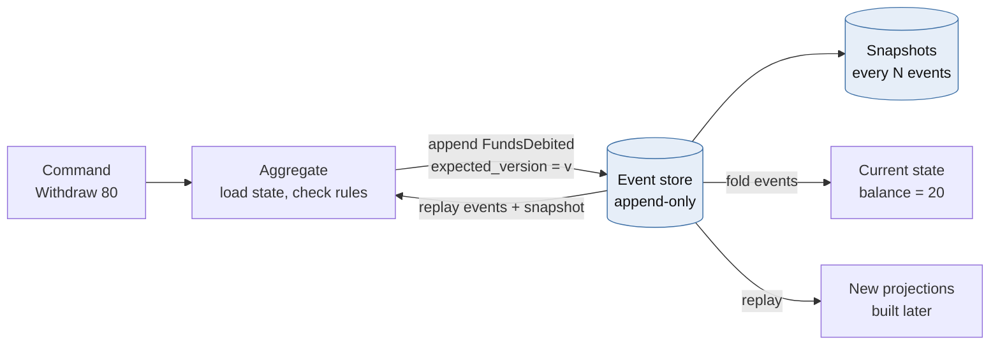
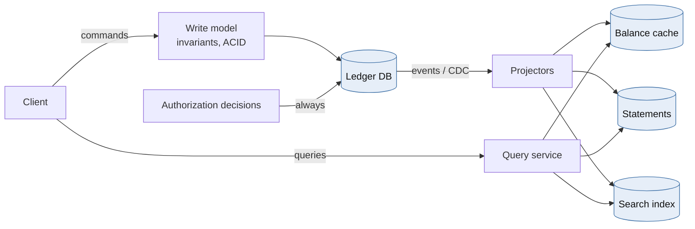
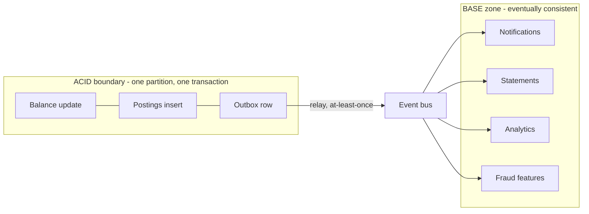
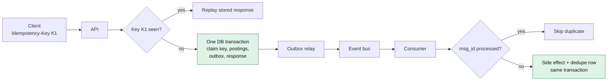
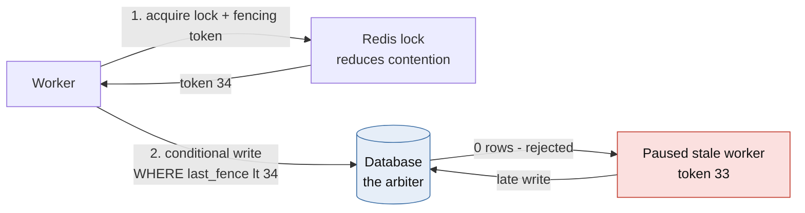
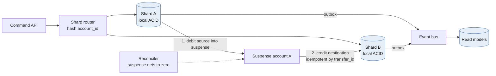
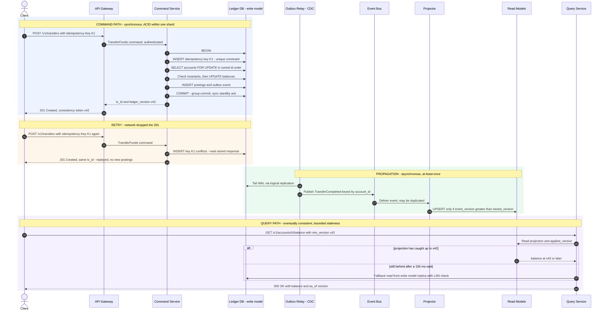

# Module 1 — High-Throughput & Financial Systems

*Industry: Banking & Fintech*

## 1.1 Ideas & Trade-offs

### Event Sourcing



*[Open full-size diagram: Event sourcing - state is derived from facts (SVG)](../diagrams/m1-event-sourcing-state-is-derived-from-facts.svg)*

**In plain words:** most apps store only the *current* value, such as "balance = 20". Event sourcing stores **every change that happened**, such as "deposited 100" and "withdrew 80", and works out the current value by adding them up.

```
state(t) = fold(apply, events[0..t], initial_state)
```

A bank ledger is the classic example. Banks don't just overwrite a balance. They record debits and credits (called **postings**), and the balance is the sum of those postings. Double-entry bookkeeping is really event sourcing, invented about 500 years before computers.

| Benefit | Cost |
|---|---|
| A complete history of every change, which auditors and regulators love | Events can never be changed, so old event formats must be supported forever |
| You can ask "what was the balance on March 31 at midnight?" | Adding up millions of events is slow, so you save **snapshots** every N events |
| You can build new reports later by replaying history | Privacy laws may require deleting personal data. The usual fix is to encrypt each person's data with their own key, and delete the key |
| You can debug by replaying exactly what happened | Every query needs a precomputed table (a "projection"). You can't just filter a table |
| Works well with the outbox pattern and CDC | Choosing what an event represents is a big decision that's hard to undo |

**Stopping two writers from clashing.** When saving new events, you say what version you expect: "append these events, but only if the stream is still at version 7". If someone else added an event first, the save fails and you retry with fresh data. A simple way to build this is a table with a unique constraint on `(stream_id, version)`.

**What most real ledgers do.** They keep an append-only `postings` table (the events), plus an `accounts.balance` column that is updated **in the same transaction**. The balance is a cached total that always matches the postings. You get the audit trail without waiting for balances to catch up.

### CQRS (Command Query Responsibility Segregation)



*[Open full-size diagram: CQRS - separate write model and read models (SVG)](../diagrams/m1-cqrs-separate-write-model-and-read-models.svg)*

**In plain words:** use one model for **changing data** (commands) and different models for **reading data** (queries).

- The **write model** checks the rules ("is there enough money?"). It is small, strict and always correct.
- The **read models** are built for specific screens: a balance cache in Redis, a statement table, a search index. They are updated from events, so they may be a little behind.

Things to be careful about:

- **You might not see your own change right away.** A user transfers money, refreshes, and sees the old balance. Three common fixes:
  1. The write returns a version number, and the read waits (briefly) until the read model has reached that version, otherwise it reads the write model.
  2. The person who made the change reads from the write model, and everyone else reads the read models.
  3. The app shows the expected result straight from the write's response.
- **There's more to run:** the programs that update read models, rebuilds, error handling, and versioning.
- **Firm rule for money:** **decisions to approve a payment always read the write model, never a read model.** A read model that's 200 ms behind is fine for a statement page but dangerous for approving a withdrawal.
- **When not to use it:** simple screens where reading and writing look the same. There, CQRS is extra work for nothing.

### ACID vs. BASE



*[Open full-size diagram: ACID core, BASE periphery (SVG)](../diagrams/m1-acid-core-base-periphery.svg)*

| | ACID | BASE |
|---|---|---|
| What it promises | All-or-nothing, rules kept, no interference, saved permanently | Available, may be temporarily out of date, catches up later |
| Where it works | Inside one database or one shard | Across the whole system |
| When things go wrong | Refuses or waits, to protect the rules | Accepts the work and fixes things up later |
| Ledger use | Changing balances and saving postings | Notifications, statements, reports, fraud data, search |

Real financial systems use **both**: ACID for the money-moving core, and BASE for everything that happens after. Deciding exactly where that line sits is a key design skill.

**Where double-spending bugs really hide: isolation levels.** PostgreSQL's default is `READ COMMITTED`.

- **Unsafe:** the app reads the balance, checks `balance >= amount` in Python, then writes the new balance. Two requests both read 100, both pass the check, and both write 20. **160 was paid out of 100.** This is called a *lost update*.
- **Safe:** `UPDATE accounts SET balance = balance - :amt WHERE id = :id AND balance >= :amt`. The row lock makes the second request wait, and PostgreSQL re-checks the WHERE condition against the latest balance. The second request sees 20, the check fails, and zero rows are updated.
- **Also safe:** lock the row first with `SELECT ... FOR UPDATE`, then check.
- **Write skew:** under `REPEATABLE READ`, two transactions can each read a *different* row and both break a rule that covers both rows, such as "joint accounts A + B must stay at or above 0". Only `SERIALIZABLE` isolation, or locking *every* row involved, prevents this.

**Transactions that span several services:**

| | Two-Phase Commit (2PC) | Saga |
|---|---|---|
| How | A coordinator asks everyone "ready?", then says "commit" | A chain of steps. Each step has an "undo" step (a *compensation*) |
| All-or-nothing? | Yes | Not exactly: failed chains are undone step by step |
| Can others see half-done work? | No, rows stay locked | Yes, so you need "pending" states |
| If the coordinator crashes | Others wait, **stuck holding locks** | The undo steps can fail too, so they must be safe to retry |
| Best for | Inside one database cluster | Across services and banks |

### Idempotency in Distributed Transactions



*[Open full-size diagram: Idempotency key and outbox flow (SVG)](../diagrams/m1-idempotency-key-and-outbox-flow.svg)*

Messages can be delivered **at most once** (may be lost), **at least once** (may be duplicated) or **exactly once**. True exactly-once delivery across a network is impossible. Kafka's "exactly-once" only covers work that stays inside Kafka. Once you write to a database, send a file or send an email, messages can arrive twice again.

**So: "exactly once" in practice = at-least-once delivery + a handler that is safe to repeat + a "done" record saved in the same transaction as the change.**

How to design an **idempotency key** for a payments API:

- The **client creates** a unique ID (a UUID) for each real operation and sends it in a header. The database has `UNIQUE(client_id, key)`.
- Save a **fingerprint** (a hash) of the request body with the key. If the same key arrives with a different body, reply `422`. This catches client bugs.
- **Save the response**, and return it again on retries.
- **Keep keys longer** than the client's retry window: 24 hours to 7 days.
- **Save business failures too**, such as "insufficient funds". Otherwise a retry after a deposit could succeed, and the same request would have two different outcomes.
- **The outbox pattern:** write the event into an `outbox` table *in the same transaction* as the money change. A separate process (CDC such as Debezium, or a poller) publishes it. This avoids the classic bug where the database commit works but publishing to Kafka fails.

## 1.2 Python: Idempotent Consumers, Celery/FastAPI, and Redis Locks

### A clear position on Redis locks (Redlock)



*[Open full-size diagram: Locks for efficiency, fences for correctness (SVG)](../diagrams/m1-locks-for-efficiency-fences-for-correctness.svg)*

**Redlock** takes a lock with an expiry time on a majority of several independent Redis servers (usually 5). A well-known criticism (Martin Kleppmann, 2016, with a reply from Redis creator Salvatore Sanfilippo) points out:

- **A worker can freeze** (garbage collection, a VM pause) for longer than the lock's expiry time. It wakes up thinking it still holds a lock that someone else now has.
- **There's no fencing token**, so the database can't tell the old owner from the new one.
- **It depends on timing**, and clocks and networks don't always behave.
- With a *single* Redis server, a failover can lose the lock completely.

**Practical position:** use a Redis lock to make things **faster** (fewer workers fighting over the same account, fewer deadlocks). Use the **database** to keep things **correct**, with a conditional write that includes a **fencing token** or version number. If the lock fails, you get some extra retries, never a double-spend.

### FastAPI: a money-transfer endpoint that's safe to retry

```python
from __future__ import annotations

import hashlib
import json
import uuid
from decimal import Decimal
from typing import Annotated

from fastapi import FastAPI, Header, HTTPException
from pydantic import BaseModel, Field
from sqlalchemy import text
from sqlalchemy.ext.asyncio import async_sessionmaker, create_async_engine

engine = create_async_engine("postgresql+asyncpg://ledger@ledger-db/ledger", pool_size=20)
Session = async_sessionmaker(engine, expire_on_commit=False)
app = FastAPI()


class TransferIn(BaseModel):
    source: uuid.UUID
    dest: uuid.UUID
    amount: Decimal = Field(gt=0, max_digits=18, decimal_places=2)  # never float for money
    currency: str = Field(pattern=r"^[A-Z]{3}$")


def fingerprint(body: TransferIn) -> str:
    return hashlib.sha256(body.model_dump_json().encode()).hexdigest()


@app.post("/v1/transfers", status_code=201)
async def create_transfer(
    body: TransferIn,
    idempotency_key: Annotated[uuid.UUID, Header()],
    client_id: Annotated[str, Header(alias="X-Client-Id")],
) -> dict:
    fp = fingerprint(body)
    params = {"c": client_id, "k": idempotency_key}
    async with Session() as s, s.begin():
        # 1. Claim the key. The UNIQUE(client_id, key) constraint is the real guard.
        #    A concurrent duplicate blocks here on the unique index until we commit,
        #    then hits the conflict and replays our stored response.
        claimed = await s.execute(
            text("""INSERT INTO idempotency_keys (client_id, key, fingerprint)
                    VALUES (:c, :k, :fp) ON CONFLICT (client_id, key) DO NOTHING
                    RETURNING key"""),
            {**params, "fp": fp},
        )
        if claimed.first() is None:
            row = (await s.execute(
                text("SELECT fingerprint, response FROM idempotency_keys "
                     "WHERE client_id = :c AND key = :k"), params)).one()
            if row.fingerprint != fp:
                raise HTTPException(422, "Idempotency-Key reused with a different payload")
            return row.response  # byte-identical replay

        # 2. Lock both accounts in canonical (sorted) order. This prevents the
        #    A->B / B->A deadlock between concurrent transfers.
        ids = sorted([body.source, body.dest])
        rows = (await s.execute(
            text("SELECT id, balance, currency FROM accounts "
                 "WHERE id = ANY(:ids) ORDER BY id FOR UPDATE"), {"ids": ids})).all()
        accts = {r.id: r for r in rows}
        if len(accts) != 2 or any(a.currency != body.currency for a in accts.values()):
            raise HTTPException(404, "Account not found or currency mismatch")
        if accts[body.source].balance < body.amount:
            # Simplification: rolling back also releases the key. Many PSPs instead
            # persist the 409 so that retries replay the same decision.
            raise HTTPException(409, "Insufficient funds")

        # 3. Mutate balance, append postings (the events), write the outbox. One transaction.
        tx_id = uuid.uuid4()
        amt = {"amt": body.amount}
        await s.execute(text("UPDATE accounts SET balance = balance - :amt, version = version + 1 "
                             "WHERE id = :id"), {**amt, "id": body.source})
        await s.execute(text("UPDATE accounts SET balance = balance + :amt, version = version + 1 "
                             "WHERE id = :id"), {**amt, "id": body.dest})
        await s.execute(
            text("INSERT INTO postings (tx_id, account_id, amount) "
                 "VALUES (:t, :src, -:amt), (:t, :dst, :amt)"),
            {"t": tx_id, "src": body.source, "dst": body.dest, **amt})
        response = {"tx_id": str(tx_id), "status": "completed"}
        await s.execute(
            text("INSERT INTO outbox (aggregate_id, event_type, payload) "
                 "VALUES (:t, 'TransferCompleted', CAST(:p AS jsonb))"),
            {"t": tx_id, "p": body.model_dump_json()})
        await s.execute(
            text("UPDATE idempotency_keys SET response = CAST(:r AS jsonb) "
                 "WHERE client_id = :c AND key = :k"),
            {**params, "r": json.dumps(response)})
        return response
```

Why it's built this way:

- Claiming the key, checking the rules, saving the postings, writing the outbox and saving the response all happen in **one transaction**. There's no moment where money moved but the key wasn't saved.
- Because it's all one transaction, you don't need an "in progress" state. You *do* need one if the operation calls something outside the database (like a card network). In that case, save "in progress", reply `409 Retry-After` to duplicates, and run a sweeper for stuck keys.
- Add a `CHECK (balance >= 0)` constraint to accounts that can't go negative. It's a free last line of defence.

### Celery: a consumer that's safe to repeat, with a fenced lock

```python
import secrets
from contextlib import contextmanager
from collections.abc import Iterator

import redis
from celery import Celery
from sqlalchemy import create_engine, text

app = Celery("ledger", broker="redis://redis:6379/0")
app.conf.update(
    task_acks_late=True,               # ack only after the task body finishes
    task_reject_on_worker_lost=True,   # redeliver if the worker process dies mid-task
    worker_prefetch_multiplier=1,      # don't hoard messages on a busy worker
    broker_transport_options={"visibility_timeout": 3600},  # Redis broker redelivers after this
)
db = create_engine("postgresql+psycopg://ledger@ledger-db/ledger", pool_size=10)
r = redis.Redis(host="redis", decode_responses=True)

# Acquire and issue the fencing token ATOMICALLY. If INCR ran as a separate call,
# a paused holder could wake up and draw a *higher* token than the current holder.
ACQUIRE = r.register_script("""
if redis.call('SET', KEYS[1], ARGV[1], 'NX', 'PX', ARGV[2]) then
  return redis.call('INCR', KEYS[2])
end
return 0
""")
RELEASE = r.register_script("""
if redis.call('GET', KEYS[1]) == ARGV[1] then return redis.call('DEL', KEYS[1]) end
return 0
""")


class LockBusy(Exception): ...
class StaleFence(Exception): ...


@contextmanager
def fenced_lock(resource: str, ttl_ms: int = 2_000) -> Iterator[int]:
    owner = secrets.token_hex(16)
    keys = [f"lock:{resource}", f"fence:{resource}"]
    token = int(ACQUIRE(keys=keys, args=[owner, ttl_ms]))
    if token == 0:
        raise LockBusy(resource)
    try:
        yield token
    finally:
        RELEASE(keys=keys[:1], args=[owner])  # only delete the lock if we still own it


@app.task(bind=True, autoretry_for=(LockBusy, StaleFence),
          retry_backoff=True, retry_jitter=True, max_retries=8)
def apply_debit(self, msg_id: str, account_id: str, amount_minor: int) -> str:
    with fenced_lock(f"acct:{account_id}") as fence, db.begin() as conn:
        # Dedupe record and side effect share one transaction: effectively-once.
        fresh = conn.execute(
            text("INSERT INTO processed_messages (msg_id) VALUES (:m) "
                 "ON CONFLICT DO NOTHING RETURNING msg_id"), {"m": msg_id}).first()
        if fresh is None:
            return "duplicate"

        # The database is the arbiter. The write applies only if our fence is newer
        # than the last fence that touched this row AND the invariant holds.
        ok = conn.execute(
            text("""UPDATE accounts
                       SET balance_minor = balance_minor - :a, last_fence = :f
                     WHERE id = :id AND last_fence < :f AND balance_minor >= :a
                 RETURNING balance_minor"""),
            {"a": amount_minor, "f": fence, "id": account_id}).first()
        if ok is None:
            current = conn.execute(text("SELECT last_fence FROM accounts WHERE id = :id"),
                                   {"id": account_id}).scalar_one()
            if current >= fence:
                raise StaleFence(account_id)   # rollback (dedupe row too) and retry
            conn.execute(text("INSERT INTO rejections (msg_id, reason) "
                              "VALUES (:m, 'insufficient_funds')"), {"m": msg_id})
            return "insufficient_funds"         # terminal, recorded, commits
        return "applied"
```

**Honest caveats:**

- A Redis counter can go *backwards* if Redis fails over to a replica that was behind. The strongest option takes the fence number from the database (a sequence, or the row's own `version`), which is just optimistic locking. The Redis lock then only reduces contention.
- If every write already uses `UPDATE ... WHERE balance >= :a` inside a transaction, you *don't need* the Redis lock for correctness. Add it only when busy rows exhaust your connection pool, or when the protected work includes steps outside the database.
- Store money as **whole cents (integers)** or `Decimal`. **Never use `float`.**

## 1.3 Case Study: A 10,000 TPS Ledger with Zero Double-Spend



*[Open full-size diagram: Sharded ledger with cross-shard saga (SVG)](../diagrams/m1-sharded-ledger-with-cross-shard-saga.svg)*

**Requirements:** 10,000 transactions per second normally, and 30,000 at peak (payday, Black Friday). 99% of payment approvals within 150 ms. No data loss in a region, and recovery within 60 seconds. **No double-spending, ever.** Seven years of records that can't be altered.

### Rough numbers

| What | Estimate |
|---|---|
| Postings per second | 10,000 × 2 = 20,000 rows/s (60,000 at peak) |
| Data written | ~500 bytes per posting, including indexes → ~10 MB/s |
| Growth per day | 864 million transactions/day → about 1 TB/day |
| Seven years | Petabytes. So keep 90 days in the main database and move older data to cheap storage (Parquet files in ADLS Gen2, S3 or GCS) with "can't delete" (WORM) rules |
| One database server's limit | A well-tuned PostgreSQL primary with a synchronous standby can handle thousands to low tens of thousands of short write transactions per second. At 30,000 per second, each locking two rows, there is **no spare room**, and busy rows slow things further |

**Conclusion:** split the ledger across several databases, by account.

### Design decisions

**Splitting (sharding).** Hash account IDs into shards. Start with 32 logical shards on fewer servers, so you can split later without rehashing everything. A transfer inside one shard is a normal transaction. A transfer **between** shards becomes a **saga**:

1. Move money from the source account into a "money in transit" (**suspense**) account on its shard.
2. Credit the destination.

Both steps are safe to repeat thanks to the transfer ID. A reconciliation job checks that every suspense account nets to zero.

**Three ways to make sure one account's writes happen one at a time:**

| Option | How | Good | Bad |
|---|---|---|---|
| **A. Row locks** (the code above) | `FOR UPDATE` or a conditional `UPDATE` in PostgreSQL | Familiar, strictly correct, easy to audit | Busy accounts queue up. Must lock in a fixed order to avoid deadlocks |
| **B. One worker per partition** | Send commands keyed by account into Kafka/Event Hubs partitions. One worker per partition keeps balances in memory and saves in batches | No locks, very fast, strict order | Pauses when partitions move. The in-memory state must be rebuilt after restarts |
| **C. Distributed SQL database** | Spanner, CockroachDB, YugabyteDB | Handles splitting for you | Transactions across regions are slower. Vendor lock-in. Cost |

Most banks choose **A**, and use **B** for their busiest flows. Purpose-built ledger databases such as TigerBeetle take option B to the extreme.

**Very busy accounts.** A marketplace account might receive 2,000 payments per second. Row locks handle maybe 1,000–3,000 per second on one row, and everything else touching it waits. Two fixes:

- **Adding money can happen in any order.** Save the credits without locking the balance, and add them to the balance in small batches. Only *withdrawals* need the "enough money?" check.
- **Split the balance across K sub-accounts** (`merchant-123#0` to `#15`). Each credit picks one at random, and reads add them up.

**Reads (CQRS):** a Redis balance cache (display only, labelled "as of"), statement tables on a replica, search, and reports in a data lake. **Payment approvals never read these.**

**Automatic checks that run all the time:**

- Every transaction's postings add up to zero.
- The daily trial balance nets to zero.
- Each account's postings add up to its balance.
- Read models match the write model.

Any mismatch alerts the on-call engineer. These checks are cheaper than any lock, and they catch bugs that locks can't.

**Azure services:** Azure Database for PostgreSQL Flexible Server with zone-redundant HA, per shard (or Citus for sharding). Event Hubs (Kafka API) for events. Azure Cache for Redis. ADLS Gen2 with immutability policies for the archive. Key Vault for encryption keys.

## 1.4 Diagram: Command and Query Paths



*[Open full-size diagram: Command and query paths (SVG)](../diagrams/m1-command-and-query-paths.svg)*

## 1.5 Animation Plan: A Double-Spend Race Blocked by a Fenced Lock

**Scene (Manim, 1920×1080, 60 fps, dark background):**

- **Bottom centre:** a green box *Ledger DB* showing `balance = 100 | last_fence = 32`.
- **Top centre:** a grey padlock labelled *Redis lock: free*, with a timer ring beside it.
- **Left:** worker **W1** (blue circle). **Right:** worker **W2** (orange circle). Each has a speech bubble saying `withdraw 80`.
- A caption bar at the bottom for narration.

There are three acts: the race with no lock, the race with a lock, and the case where the lock alone isn't enough.

| Time | Act | What you see | Manim tools |
|---|---|---|---|
| 0:00–0:03 | **I. No lock** | Title: "Two withdrawals, one balance" | `Write`, `FadeOut` |
| 0:03–0:07 | I | W1 and W2 both send a `READ` arrow to the database at the same time. Both bubbles say `saw 100` | Two `GrowArrow`s together |
| 0:07–0:10 | I | Both work out `100 − 80 = 20` | `TransformMatchingTex` |
| 0:10–0:14 | I | Both `WRITE 20`. The balance shows 20, and a red counter shows "paid out: 160" | `Transform`, red `Flash` |
| 0:14–0:17 | I | Caption: **"Lost update: 160 paid out of 100."** The screen fades and rewinds | `Wiggle`, rewind |
| 0:17–0:21 | **II. With a lock** | W1 takes the lock. It turns blue and shows `W1 · token 33`, and the timer ring starts | `Indicate`, timer arc |
| 0:21–0:24 | II | W2 tries to take the lock, bounces off with a "busy" spark, and curves back along a dashed path labelled `wait and retry` | `MoveAlongPath`, `Flash` |
| 0:24–0:28 | II | W1 writes. The database shows `balance = 20 | last_fence = 33`. The lock is released and turns grey | `Transform` |
| 0:28–0:33 | II | W2 retries, gets `token 34`, reads 20, and its bubble says `20 < 80 → REJECT: not enough money` | `Write`, `Circumscribe` |
| 0:33–0:36 | II | Caption: **"The lock made them take turns. But only if the lock holder is alive and on time…"** | — |
| 0:36–0:40 | **III. Freeze** | Reset to 100 / fence 32. W1 takes `token 33`, then freezes: it turns grey with ice, labelled `paused 4.2 s` | Fade, `FadeIn` |
| 0:40–0:44 | III | The timer ring runs out. The lock opens: *lock expired* | Timer to zero |
| 0:44–0:48 | III | W2 takes `token 34` and writes. The database shows `balance = 20 | last_fence = 34` | `Transform` |
| 0:48–0:53 | III | W1 unfreezes, still thinks it has the lock, and sends `WRITE ... fence=33`. A shield rises from the database: **`only if last_fence < 33` → 0 rows**. The arrow breaks | Shield, `ShowPassingFlash`, arrow falls |
| 0:53–0:58 | III | Summary panel: *Lock = speed* on the left, *Fence + conditional write = correctness* on the right | `VGroup.arrange` |

**Manim code for Act III:**

```python
from manim import *


class FencedLockRace(Scene):
    def construct(self) -> None:
        db = RoundedRectangle(width=5, height=1.6, corner_radius=0.2, color=GREEN).shift(DOWN * 2.5)
        state = Text("balance=100   last_fence=32", font_size=28).move_to(db)
        lock = RoundedRectangle(width=3.2, height=1.1, corner_radius=0.2, color=GREY).shift(UP * 2.6)
        lock_lbl = Text("lock: free", font_size=24).move_to(lock)
        w1 = Circle(radius=0.6, color=BLUE, fill_opacity=0.6).shift(LEFT * 5)
        w2 = Circle(radius=0.6, color=ORANGE, fill_opacity=0.6).shift(RIGHT * 5)
        self.play(*[FadeIn(m) for m in (db, state, lock, lock_lbl, w1, w2)])

        # W1 acquires token 33; the TTL ring starts draining.
        ttl = ValueTracker(1.0)
        ring = always_redraw(lambda: Arc(
            radius=0.45, start_angle=PI / 2, angle=-TAU * max(ttl.get_value(), 1e-3), color=BLUE,
        ).move_arc_center_to(lock.get_right() + RIGHT * 0.8))
        self.add(ring)
        self.play(lock.animate.set_color(BLUE),
                  Transform(lock_lbl, Text("W1 · token 33", font_size=24, color=BLUE).move_to(lock)))

        # W1 freezes while the lease expires.
        pause = Text("GC pause", font_size=22).next_to(w1, UP)
        self.play(w1.animate.set_fill(GREY, opacity=0.3), FadeIn(pause))
        self.play(ttl.animate.set_value(0), run_time=3, rate_func=linear)
        self.play(lock.animate.set_color(ORANGE),
                  Transform(lock_lbl, Text("W2 · token 34", font_size=24, color=ORANGE).move_to(lock)))

        # W2 writes with fence 34.
        a2 = Arrow(w2.get_bottom(), db.get_right(), color=ORANGE)
        self.play(GrowArrow(a2))
        self.play(Transform(state, Text("balance=20   last_fence=34", font_size=28).move_to(db)))
        self.play(FadeOut(a2))

        # W1 wakes up and tries a stale write: the DB rejects it.
        self.play(w1.animate.set_fill(BLUE, opacity=0.6), FadeOut(pause))
        a1 = Arrow(w1.get_bottom(), db.get_left(), color=BLUE)
        self.play(GrowArrow(a1))
        verdict = Text("fence 33 ≤ 34 → REJECTED", font_size=30, color=RED).next_to(db, UP)
        self.play(Flash(db.get_left(), color=RED), Write(verdict))
        self.play(FadeOut(a1, shift=DOWN))
        self.wait()
```

## 1.6 Review Questions

- Exactly which data is protected by transactions, and what would happen to the business if everything else were 5 seconds out of date?
- When an operation fails for a business reason, is the failure saved, and does a retry get the same answer?
- If Redis is completely down, does the ledger stop, slow down, or become wrong? (The right answer is "slow down".)
- How long does it take to replay the biggest account's history, and how often are snapshots taken?
- Which automatic check would have caught your last production incident?

---

[← Back to contents](../README.md)
