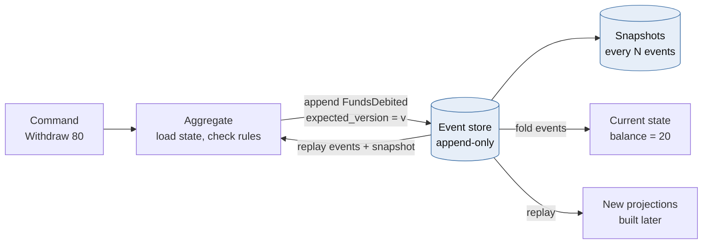
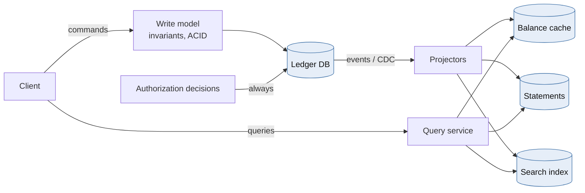
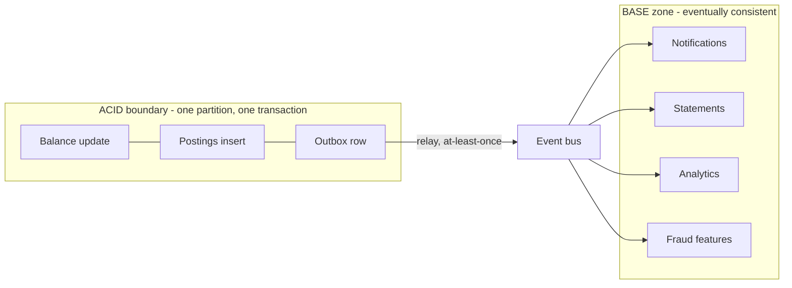
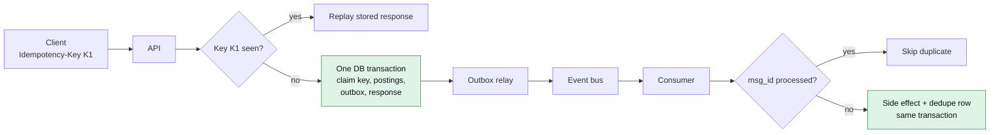
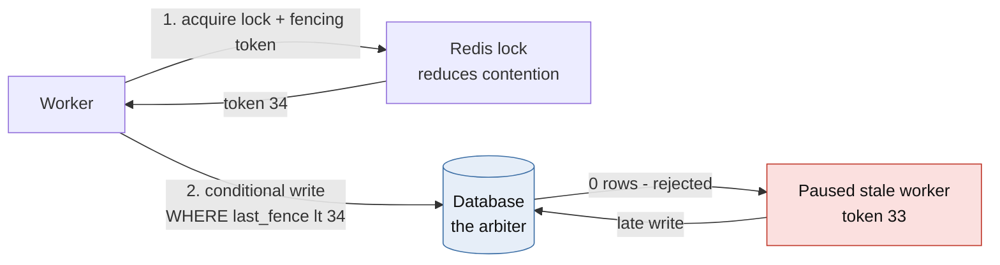
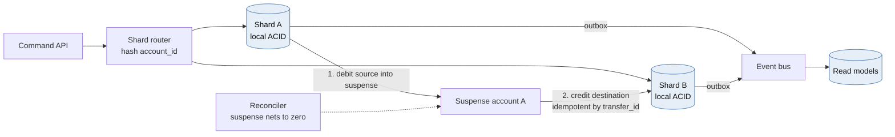
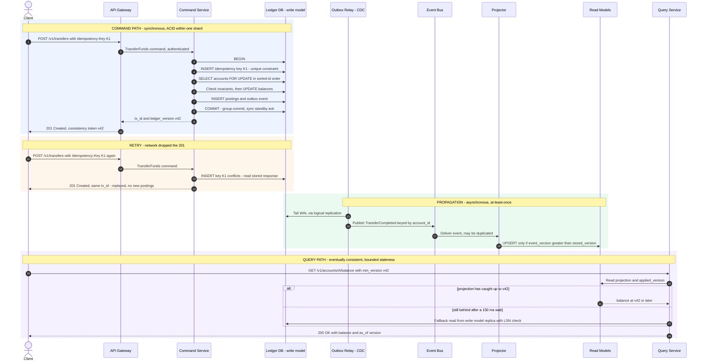

# Module 1 — High-Throughput & Financial Systems

*Industry: Banking & Fintech*

## 1.1 Core Theory & Trade-offs

### Event Sourcing



*[Open full-size diagram: Event sourcing - state is derived from facts (SVG)](../diagrams/m1-event-sourcing-state-is-derived-from-facts.svg)*

In a CRUD system the database stores *current state*. In an event-sourced system the database stores *facts that happened*, and state is derived from them:

```
state(t) = fold(apply, events[0..t], initial_state)
```

A ledger is the canonical case. A bank does not "update a balance". It records `FundsDebited` and `FundsCredited` postings, and the balance is the sum of those postings. Double-entry bookkeeping is event sourcing, invented about 500 years before Kafka.

| Benefit | Cost |
|---|---|
| Complete, tamper-evident audit trail (regulators love it) | Events are immutable forever, so **schema evolution is permanent**. You need upcasters for every historical version |
| Temporal queries ("balance as of 2025-03-31 23:59:59 ET") | Rebuild time grows linearly. You need snapshots every N events per aggregate |
| New read models can be built later by replaying history | The right to erasure conflicts with immutability. Use **crypto-shredding** (encrypt PII per data subject, delete the key) |
| Debugging by replay | Every query needs a projection. "Just add a WHERE clause" goes away |
| Natural fit for the outbox and CDC | Event design *is* public API design. Bad event granularity is expensive to undo |

**Concurrency on streams.** Appends use optimistic concurrency: `append(stream_id, events, expected_version=v)`. If another writer appended first, the append fails and the command is retried against fresh state. This is a compare-and-swap on the stream head, and it is the core of how event stores (EventStoreDB, Marten, or a Postgres table with a `UNIQUE(stream_id, version)` constraint) avoid lost updates.

**A pragmatic note.** Most production ledgers are *event-sourcing-lite*: an append-only `postings` table (the events) plus a materialized `accounts.balance` column that is updated in the same ACID transaction. The balance is a cached projection that is *transactionally consistent* with the log. You keep the audit and replay benefits without a separate event store or eventually consistent balances on the hot path.

### CQRS (Command Query Responsibility Segregation)



*[Open full-size diagram: CQRS - separate write model and read models (SVG)](../diagrams/m1-cqrs-separate-write-model-and-read-models.svg)*

CQRS separates the **write model**, which is optimized for enforcing invariants (normalized, small, strongly consistent), from one or more **read models**, which are optimized for specific queries (denormalized, possibly in different stores such as Redis, Elasticsearch or a columnar warehouse).

Trade-offs a Principal must be explicit about:

- **Projection lag creates read-your-writes anomalies.** A user transfers money, refreshes, and sees the old balance. Three standard fixes:
  1. The command returns a **consistency token** (the ledger version or commit LSN). The query path waits, with a bounded timeout, until the projection's `applied_version >= token`, then falls back to the write model.
  2. The author's immediate view reads from the write model. Everyone else reads projections.
  3. The UI renders the optimistic result from the command response.
- **The operational surface roughly doubles.** You now run projectors, projection rebuilds, dead-letter handling and schema versioning for each read model.
- **Hard rule for money:** *authorization decisions read the write model, never a projection.* A projection that is 200 ms stale is fine for a statement page and dangerous for approving a withdrawal.
- **When not to use it:** CRUD-shaped domains where reads and writes are symmetric. CQRS in a settings service is architecture tax with no return.

### ACID vs. BASE



*[Open full-size diagram: ACID core, BASE periphery (SVG)](../diagrams/m1-acid-core-base-periphery.svg)*

| | ACID | BASE |
|---|---|---|
| Promise | Atomicity, Consistency (invariants), Isolation, Durability | Basically Available, Soft state, Eventually consistent |
| Scaling unit | A partition or shard | The whole cluster |
| Failure behavior | Rejects or blocks to preserve invariants | Accepts and reconciles later |
| Ledger use | Balance mutation, posting creation | Notifications, statements, analytics, fraud features, search |

Real financial systems are **hybrid**. There is an ACID core *per partition* and BASE everywhere downstream. The design skill is drawing that boundary precisely.

**Isolation levels are where double-spends actually hide.** In PostgreSQL's default `READ COMMITTED`:

- **Unsafe:** `SELECT balance ...` in the application, check `balance >= amount`, then `UPDATE accounts SET balance = :new`. Two concurrent transactions both read 100, both pass the check, and both write 20. That is a classic lost update.
- **Safe:** `UPDATE accounts SET balance = balance - :amt WHERE id = :id AND balance >= :amt`. The row lock serializes writers, and PostgreSQL *re-evaluates the WHERE clause against the latest committed row version* after acquiring the lock. The second writer sees 20, fails the predicate, and updates zero rows.
- **Also safe:** `SELECT ... FOR UPDATE` before checking.
- **Write skew:** under snapshot isolation (`REPEATABLE READ` in PostgreSQL), two transactions can each read a *different* row, check a combined invariant ("joint accounts A+B must stay ≥ 0"), and both commit. Only `SERIALIZABLE` (SSI) or explicit locking of *every row in the invariant* prevents this.

**Distributed transactions across services:**

| | Two-Phase Commit (2PC/XA) | Saga |
|---|---|---|
| Atomicity | Real atomic commit | Semantic: forward steps plus compensations |
| Isolation | Locks held across participants | None. Intermediate states are visible, so you need "pending/hold" states |
| Failure mode | Coordinator crash leaves participants **blocked** holding locks | Compensation can fail too, so it must be idempotent and retried |
| Latency | Two round trips plus lock hold time | Asynchronous steps |
| Fit | A single database cluster's internal commit (Spanner, CockroachDB) | Cross-service and cross-bank money movement |

### Idempotency in Distributed Transactions



*[Open full-size diagram: Idempotency key and outbox flow (SVG)](../diagrams/m1-idempotency-key-and-outbox-flow.svg)*

Delivery semantics are **at-most-once** (may lose), **at-least-once** (may duplicate) or **exactly-once**. End-to-end exactly-once *delivery* is impossible over an unreliable network. Kafka's exactly-once semantics covers read-process-write loops that stay *inside Kafka*. Once a side effect leaves Kafka (a database write, an ACH file, an email), you are back to at-least-once.

**Effectively-once = at-least-once delivery + an idempotent handler + a dedupe record committed in the same transaction as the side effect.**

Idempotency-key design for a payments API:

- **Client-generated** UUID per *logical* operation, scoped per client (`UNIQUE(client_id, key)`).
- **Request fingerprint** (a hash of the canonical body) stored with the key. If the same key arrives with a different payload, return `422`. This catches client bugs that would otherwise silently return the wrong cached response.
- **Stored response** replayed byte-for-byte on retries.
- **Retention** longer than the client's maximum retry horizon (typically 24 hours to 7 days).
- **Deterministic business failures** (insufficient funds) should usually be *persisted and replayed* too. Otherwise a retry after a deposit could succeed, and the client's "same request" now has two different outcomes.
- **The outbox pattern:** write the domain event into an `outbox` table *in the same transaction* as the postings. A relay (Debezium CDC reading the WAL, or a poller) publishes it. This removes the dual-write problem where the database commit succeeds but the Kafka publish fails.

## 1.2 Python in Practice: Idempotent Consumers, Celery/FastAPI, and Redis Locks

### A Principal-level stance on Redlock



*[Open full-size diagram: Locks for efficiency, fences for correctness (SVG)](../diagrams/m1-locks-for-efficiency-fences-for-correctness.svg)*

Redlock acquires a lock with a TTL on a majority of N independent Redis masters (typically 5) and treats it as valid for `TTL - elapsed - clock_drift`. The well-known critique (Martin Kleppmann, 2016, with a rebuttal from Salvatore Sanfilippo) is:

- **Process pauses** (GC, VM live-migration, page faults) can outlast the TTL. The holder wakes up believing it still holds a lock that has already been granted to someone else.
- **No fencing token.** The protected resource cannot distinguish a stale holder from the current one.
- **Timing assumptions.** Safety depends on bounded clock drift and bounded network delay.
- A *single* Redis with async replication can lose a lock on failover.

**Pragmatic position:** use a Redis lock for **efficiency** (avoid thundering herds on a hot account, stop workers from piling up and hogging database connections, reduce deadlocks). Enforce **correctness** at the database with a conditional write that includes a **fencing token** or version. If the lock fails, you get extra retries, never a double-spend.

### FastAPI: an idempotent transfer endpoint

```python
from __future__ import annotations

import hashlib
import json
import uuid
from decimal import Decimal
from typing import Annotated

from fastapi import FastAPI, Header, HTTPException
from pydantic import BaseModel, Field
from sqlalchemy import text
from sqlalchemy.ext.asyncio import async_sessionmaker, create_async_engine

engine = create_async_engine("postgresql+asyncpg://ledger@ledger-db/ledger", pool_size=20)
Session = async_sessionmaker(engine, expire_on_commit=False)
app = FastAPI()


class TransferIn(BaseModel):
    source: uuid.UUID
    dest: uuid.UUID
    amount: Decimal = Field(gt=0, max_digits=18, decimal_places=2)  # never float for money
    currency: str = Field(pattern=r"^[A-Z]{3}$")


def fingerprint(body: TransferIn) -> str:
    return hashlib.sha256(body.model_dump_json().encode()).hexdigest()


@app.post("/v1/transfers", status_code=201)
async def create_transfer(
    body: TransferIn,
    idempotency_key: Annotated[uuid.UUID, Header()],
    client_id: Annotated[str, Header(alias="X-Client-Id")],
) -> dict:
    fp = fingerprint(body)
    params = {"c": client_id, "k": idempotency_key}
    async with Session() as s, s.begin():
        # 1. Claim the key. The UNIQUE(client_id, key) constraint is the real guard.
        #    A concurrent duplicate blocks here on the unique index until we commit,
        #    then hits the conflict and replays our stored response.
        claimed = await s.execute(
            text("""INSERT INTO idempotency_keys (client_id, key, fingerprint)
                    VALUES (:c, :k, :fp) ON CONFLICT (client_id, key) DO NOTHING
                    RETURNING key"""),
            {**params, "fp": fp},
        )
        if claimed.first() is None:
            row = (await s.execute(
                text("SELECT fingerprint, response FROM idempotency_keys "
                     "WHERE client_id = :c AND key = :k"), params)).one()
            if row.fingerprint != fp:
                raise HTTPException(422, "Idempotency-Key reused with a different payload")
            return row.response  # byte-identical replay

        # 2. Lock both accounts in canonical (sorted) order. This prevents the
        #    A->B / B->A deadlock between concurrent transfers.
        ids = sorted([body.source, body.dest])
        rows = (await s.execute(
            text("SELECT id, balance, currency FROM accounts "
                 "WHERE id = ANY(:ids) ORDER BY id FOR UPDATE"), {"ids": ids})).all()
        accts = {r.id: r for r in rows}
        if len(accts) != 2 or any(a.currency != body.currency for a in accts.values()):
            raise HTTPException(404, "Account not found or currency mismatch")
        if accts[body.source].balance < body.amount:
            # Simplification: rolling back also releases the key. Many PSPs instead
            # persist the 409 so that retries replay the same decision.
            raise HTTPException(409, "Insufficient funds")

        # 3. Mutate balance, append postings (the events), write the outbox. One transaction.
        tx_id = uuid.uuid4()
        amt = {"amt": body.amount}
        await s.execute(text("UPDATE accounts SET balance = balance - :amt, version = version + 1 "
                             "WHERE id = :id"), {**amt, "id": body.source})
        await s.execute(text("UPDATE accounts SET balance = balance + :amt, version = version + 1 "
                             "WHERE id = :id"), {**amt, "id": body.dest})
        await s.execute(
            text("INSERT INTO postings (tx_id, account_id, amount) "
                 "VALUES (:t, :src, -:amt), (:t, :dst, :amt)"),
            {"t": tx_id, "src": body.source, "dst": body.dest, **amt})
        response = {"tx_id": str(tx_id), "status": "completed"}
        await s.execute(
            text("INSERT INTO outbox (aggregate_id, event_type, payload) "
                 "VALUES (:t, 'TransferCompleted', CAST(:p AS jsonb))"),
            {"t": tx_id, "p": body.model_dump_json()})
        await s.execute(
            text("UPDATE idempotency_keys SET response = CAST(:r AS jsonb) "
                 "WHERE client_id = :c AND key = :k"),
            {**params, "r": json.dumps(response)})
        return response
```

Design notes:

- The key claim, invariant check, postings, outbox and stored response all commit **atomically**. There is no window in which money moved but the key is unrecorded.
- Because everything is in one transaction, an explicit `in_progress` state is unnecessary. You need one when the operation spans *external* calls (for example, a card network authorization). In that case you persist `in_progress`, return `409 Retry-After` to duplicates, and run a recovery sweeper for stuck keys.
- Add a `CHECK (balance >= 0)` constraint on accounts that cannot go negative. It is a last line of defense that costs nothing.

### Celery: an idempotent consumer with a fenced lock

```python
import secrets
from contextlib import contextmanager
from collections.abc import Iterator

import redis
from celery import Celery
from sqlalchemy import create_engine, text

app = Celery("ledger", broker="redis://redis:6379/0")
app.conf.update(
    task_acks_late=True,               # ack only after the task body finishes
    task_reject_on_worker_lost=True,   # redeliver if the worker process dies mid-task
    worker_prefetch_multiplier=1,      # don't hoard messages on a busy worker
    broker_transport_options={"visibility_timeout": 3600},  # Redis broker redelivers after this
)
db = create_engine("postgresql+psycopg://ledger@ledger-db/ledger", pool_size=10)
r = redis.Redis(host="redis", decode_responses=True)

# Acquire and issue the fencing token ATOMICALLY. If INCR ran as a separate call,
# a paused holder could wake up and draw a *higher* token than the current holder.
ACQUIRE = r.register_script("""
if redis.call('SET', KEYS[1], ARGV[1], 'NX', 'PX', ARGV[2]) then
  return redis.call('INCR', KEYS[2])
end
return 0
""")
RELEASE = r.register_script("""
if redis.call('GET', KEYS[1]) == ARGV[1] then return redis.call('DEL', KEYS[1]) end
return 0
""")


class LockBusy(Exception): ...
class StaleFence(Exception): ...


@contextmanager
def fenced_lock(resource: str, ttl_ms: int = 2_000) -> Iterator[int]:
    owner = secrets.token_hex(16)
    keys = [f"lock:{resource}", f"fence:{resource}"]
    token = int(ACQUIRE(keys=keys, args=[owner, ttl_ms]))
    if token == 0:
        raise LockBusy(resource)
    try:
        yield token
    finally:
        RELEASE(keys=keys[:1], args=[owner])  # only delete the lock if we still own it


@app.task(bind=True, autoretry_for=(LockBusy, StaleFence),
          retry_backoff=True, retry_jitter=True, max_retries=8)
def apply_debit(self, msg_id: str, account_id: str, amount_minor: int) -> str:
    with fenced_lock(f"acct:{account_id}") as fence, db.begin() as conn:
        # Dedupe record and side effect share one transaction: effectively-once.
        fresh = conn.execute(
            text("INSERT INTO processed_messages (msg_id) VALUES (:m) "
                 "ON CONFLICT DO NOTHING RETURNING msg_id"), {"m": msg_id}).first()
        if fresh is None:
            return "duplicate"

        # The database is the arbiter. The write applies only if our fence is newer
        # than the last fence that touched this row AND the invariant holds.
        ok = conn.execute(
            text("""UPDATE accounts
                       SET balance_minor = balance_minor - :a, last_fence = :f
                     WHERE id = :id AND last_fence < :f AND balance_minor >= :a
                 RETURNING balance_minor"""),
            {"a": amount_minor, "f": fence, "id": account_id}).first()
        if ok is None:
            current = conn.execute(text("SELECT last_fence FROM accounts WHERE id = :id"),
                                   {"id": account_id}).scalar_one()
            if current >= fence:
                raise StaleFence(account_id)   # rollback (dedupe row too) and retry
            conn.execute(text("INSERT INTO rejections (msg_id, reason) "
                              "VALUES (:m, 'insufficient_funds')"), {"m": msg_id})
            return "insufficient_funds"         # terminal, recorded, commits
        return "applied"
```

**Honest caveats:**

- A Redis `INCR` counter can itself go backwards after an async-replica failover. The strongest variant draws the fence from the database (a sequence, or the row's own `version`), which reduces the scheme to plain optimistic concurrency. The Redis lock then remains purely a contention reducer.
- If every write already goes through `UPDATE ... WHERE balance >= :a` inside a transaction, *correctness does not need the Redis lock at all*. You add it when hot-row contention exhausts connection pools, or when the critical section includes non-database work you want to serialize.
- Money uses **integer minor units** or `Decimal`. Never `float`.

## 1.3 Case Study: A 10,000 TPS Ledger with Zero Double-Spend



*[Open full-size diagram: Sharded ledger with cross-shard saga (SVG)](../diagrams/m1-sharded-ledger-with-cross-shard-saga.svg)*

**Requirements:** 10k TPS sustained, 30k TPS peak (payroll days, Black Friday). p99 authorization latency under 150 ms. RPO = 0 within a region and RTO under 60 s. Zero double-spend. Seven-year audit retention with immutability.

### Capacity math

| Quantity | Estimate |
|---|---|
| Postings per second | 10k tx/s × 2 postings = 20k rows/s (60k at peak) |
| Hot-path write volume | ~500 B per posting including index overhead → ~10 MB/s |
| Daily growth | 864M transactions/day → roughly 0.8–1 TB/day of postings and events |
| Seven-year retention | Petabyte scale, so tier it: 90 days hot in OLTP, older data as Parquet in ADLS Gen2 (S3/GCS) with WORM immutability policies |
| Single-primary ceiling | A well-tuned PostgreSQL primary with synchronous standby and group commit can sustain thousands to low tens of thousands of short write transactions per second. At 30k peak with two-row locks per transaction, there is **no headroom**, and hot rows cap you well below hardware limits |

**Conclusion:** partition the write path by account.

### Architecture decisions

**Partitioning.** Hash account IDs into N ledger shards (start with 32 logical shards mapped onto fewer physical servers, so you can split later without rehashing). An intra-shard transfer is one local ACID transaction. A cross-shard transfer becomes a **saga**: debit the source into a per-shard *suspense* (in-flight) account, then credit the destination. Both steps are idempotent by `transfer_id`, and a reconciler asserts that every suspense account nets to zero.

**Three ways to serialize writes per account:**

| Option | How | Pros | Cons |
|---|---|---|---|
| **A. Row locks per shard** (the code above) | `FOR UPDATE` / conditional `UPDATE` in PostgreSQL | Familiar, strongly consistent, easy to audit | Hot-row contention. Deadlock discipline needed |
| **B. Single writer per partition** (LMAX / actor style) | Commands keyed by `account_id` into Kafka/Event Hubs partitions. One consumer per partition keeps balances in memory and writes in batches | No locks, very high throughput, deterministic ordering | Rebalancing pauses. The in-memory state must be rebuilt from a snapshot plus log. Harder to operate |
| **C. Distributed SQL** | Spanner, CockroachDB, YugabyteDB (Raft per range) | Global serializability, automatic resharding | Cross-range transactions pay consensus RTT. Vendor coupling. Cost |

Most regulated banks choose **A**, moving to **B** for the highest-volume flows. Purpose-built ledgers (for example TigerBeetle) take B to its extreme.

**Hot accounts.** A marketplace settlement account may receive 2,000 credits/s. Row locks serialize them at maybe 1–3k/s, and every other transfer touching that row queues behind them. Two fixes:

- **Credits are commutative.** Append credit postings without locking the balance, then fold them into the balance in micro-batches. Only *debits* need the invariant check.
- **Split the balance across K sub-accounts** (`merchant-123#0..#15`). Credits pick a sub-account at random. Reads sum them. Debits either use a sub-account with sufficient funds or run a sweep.

**Read side (CQRS).** Projections feed a Redis balance cache (for display only, labeled "as of"), statement tables in a read replica, search in Elasticsearch/Azure AI Search, and analytics in a lakehouse. **Authorization never reads a projection.**

**Continuous reconciliation invariants:** postings per `tx_id` sum to zero per currency. The daily trial balance nets to zero. The sum of postings per account equals the account's materialized balance. Projection checksums match the write model. Any break pages the on-call engineer. This is cheaper than any lock and catches the bugs locks cannot.

**Azure mapping:** Azure Database for PostgreSQL Flexible Server with zone-redundant HA (synchronous standby, RPO 0 in-region) per shard, or Citus-based sharding. Event Hubs with the Kafka endpoint for the event bus. Azure Cache for Redis for locks and caches. ADLS Gen2 with immutability policies for the archive. Key Vault with HSM-backed keys for crypto-shredding.

## 1.4 Mermaid: Command and Query Paths



*[Open full-size diagram: Command and query paths (SVG)](../diagrams/m1-command-and-query-paths.svg)*

## 1.5 Animation Blueprint: A Double-Spend Race Blocked by a Fenced Lock

**Scene setup (Manim Community, 1920×1080, 60 fps, dark background):**

- **Centre-bottom:** a green `RoundedRectangle` labelled *Ledger DB* containing `balance = 100 | last_fence = 32`.
- **Top-centre:** a grey padlock-shaped group labelled *Redis lock: free*, with a circular TTL arc beside it.
- **Left:** worker **W1** (blue circle). **Right:** worker **W2** (orange circle). Each has a speech bubble showing the intent `withdraw 80`.
- A caption bar along the bottom third shows narration.

The animation has three acts, which move from the naive race, to the textbook lock, to the pathology that makes fencing necessary.

| Time | Act | Visual | Manim primitives |
|---|---|---|---|
| 0:00–0:03 | **I. No lock** | Title card: "Two withdrawals, one balance" | `Write`, `FadeOut` |
| 0:03–0:07 | I | W1 and W2 both fire a `READ` arrow at the DB at the same moment. Both bubbles show `saw 100` | `GrowArrow` ×2 in `AnimationGroup` |
| 0:07–0:10 | I | Both compute `100 − 80 = 20` (small calculator glyph above each) | `TransformMatchingTex` |
| 0:10–0:14 | I | Both `WRITE 20` arrows hit the DB. The balance shows 20. A counter "withdrawn: 160" appears in red | `Transform`, `Flash(color=RED)` |
| 0:14–0:17 | I | Caption: **"Lost update: 160 paid out of 100."** The screen desaturates and rewinds | `Wiggle`, reverse `ValueTracker` |
| 0:17–0:21 | **II. Lock** | W1 sends `SET NX PX` to Redis. The lock turns blue, labelled `W1 · token 33`. The TTL arc starts full | `Indicate`, `always_redraw(Arc)` |
| 0:21–0:24 | II | W2's acquire arrow bounces off the padlock with a small "busy" spark, then arcs back along a dashed path labelled `backoff + jitter` | `MoveAlongPath` on `ArcBetweenPoints`, `Flash` |
| 0:24–0:28 | II | W1 performs the conditional write. The DB shows `balance = 20 | last_fence = 33`. The lock releases and returns to grey | `Transform`, `set_color` |
| 0:28–0:33 | II | W2 retries, acquires `token 34`, reads 20, and its bubble shows `20 < 80 → REJECT: insufficient funds` | `Write`, `Circumscribe` |
| 0:33–0:36 | II | Caption: **"The lock serialised the race. But it only works if the holder is alive and on time…"** | — |
| 0:36–0:40 | **III. Pause** | Reset to 100 / fence 32. W1 acquires `token 33`, then freezes: it turns grey with an ice-crystal overlay and a label `GC pause 4.2 s` | `set_fill(opacity=0.4)`, `FadeIn` |
| 0:40–0:44 | III | The TTL arc drains linearly to zero. The padlock pops open: *lock expired* | `ttl.animate.set_value(0)`, `rate_func=linear` |
| 0:44–0:48 | III | W2 acquires `token 34` and writes. The DB shows `balance = 20 | last_fence = 34` | `Transform` |
| 0:48–0:53 | III | W1 thaws and, still believing it holds the lock, fires `WRITE ... fence=33`. The arrow hits a shield that rises out of the DB: **`WHERE last_fence < 33` → 0 rows**. The arrow shatters | `GrowFromCenter(shield)`, `ShowPassingFlash`, `FadeOut(arrow, shift=DOWN)` |
| 0:53–0:58 | III | Side-by-side recap panel: *Lock = efficiency* on the left, *Fence + conditional write = correctness* on the right | `VGroup.arrange(RIGHT)` |

**Manim skeleton for Act III:**

```python
from manim import *


class FencedLockRace(Scene):
    def construct(self) -> None:
        db = RoundedRectangle(width=5, height=1.6, corner_radius=0.2, color=GREEN).shift(DOWN * 2.5)
        state = Text("balance=100   last_fence=32", font_size=28).move_to(db)
        lock = RoundedRectangle(width=3.2, height=1.1, corner_radius=0.2, color=GREY).shift(UP * 2.6)
        lock_lbl = Text("lock: free", font_size=24).move_to(lock)
        w1 = Circle(radius=0.6, color=BLUE, fill_opacity=0.6).shift(LEFT * 5)
        w2 = Circle(radius=0.6, color=ORANGE, fill_opacity=0.6).shift(RIGHT * 5)
        self.play(*[FadeIn(m) for m in (db, state, lock, lock_lbl, w1, w2)])

        # W1 acquires token 33; the TTL ring starts draining.
        ttl = ValueTracker(1.0)
        ring = always_redraw(lambda: Arc(
            radius=0.45, start_angle=PI / 2, angle=-TAU * max(ttl.get_value(), 1e-3), color=BLUE,
        ).move_arc_center_to(lock.get_right() + RIGHT * 0.8))
        self.add(ring)
        self.play(lock.animate.set_color(BLUE),
                  Transform(lock_lbl, Text("W1 · token 33", font_size=24, color=BLUE).move_to(lock)))

        # W1 freezes while the lease expires.
        pause = Text("GC pause", font_size=22).next_to(w1, UP)
        self.play(w1.animate.set_fill(GREY, opacity=0.3), FadeIn(pause))
        self.play(ttl.animate.set_value(0), run_time=3, rate_func=linear)
        self.play(lock.animate.set_color(ORANGE),
                  Transform(lock_lbl, Text("W2 · token 34", font_size=24, color=ORANGE).move_to(lock)))

        # W2 writes with fence 34.
        a2 = Arrow(w2.get_bottom(), db.get_right(), color=ORANGE)
        self.play(GrowArrow(a2))
        self.play(Transform(state, Text("balance=20   last_fence=34", font_size=28).move_to(db)))
        self.play(FadeOut(a2))

        # W1 wakes up and tries a stale write: the DB rejects it.
        self.play(w1.animate.set_fill(BLUE, opacity=0.6), FadeOut(pause))
        a1 = Arrow(w1.get_bottom(), db.get_left(), color=BLUE)
        self.play(GrowArrow(a1))
        verdict = Text("fence 33 ≤ 34 → REJECTED", font_size=30, color=RED).next_to(db, UP)
        self.play(Flash(db.get_left(), color=RED), Write(verdict))
        self.play(FadeOut(a1, shift=DOWN))
        self.wait()
```

## 1.6 Staff-level Review Questions

- Where exactly is the ACID boundary, and what is the *business* consequence of every piece of state outside it being stale for 5 seconds?
- What happens to an idempotency key when the operation fails deterministically, and does the client get the same answer on retry?
- If the Redis cluster is entirely unavailable, does the ledger stop, slow down, or lose correctness? (The right answer is "slow down".)
- How long does replaying the largest account's stream take, and what is the snapshot policy?
- Which reconciliation invariant would have detected your last production incident?

---

[← Back to contents](../README.md)
