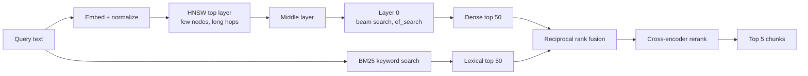
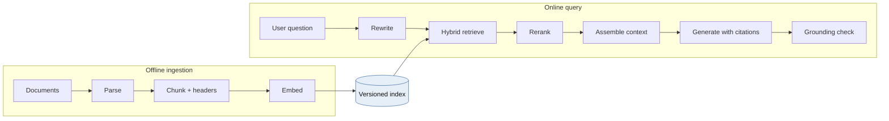
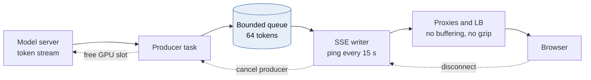
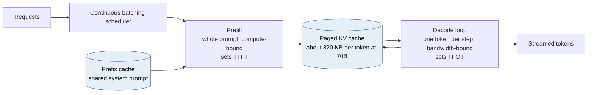
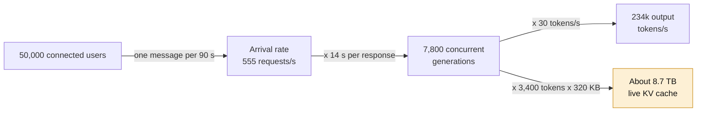
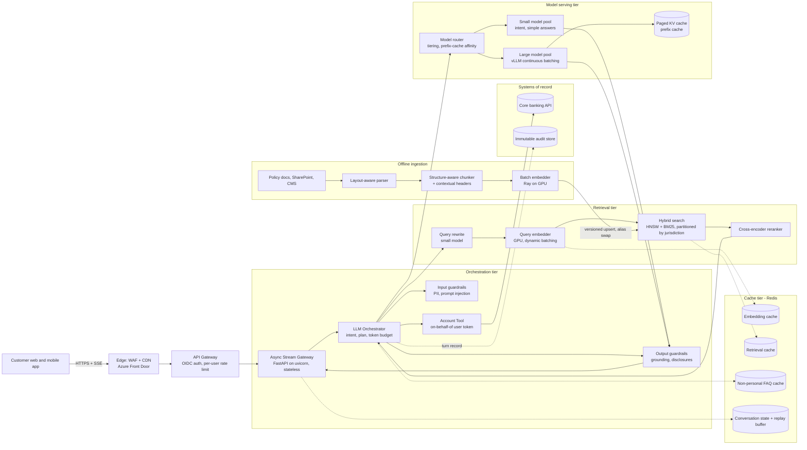

# Module 2 — AI & LLM Infrastructure at Scale

*Industry: Generative AI & Autonomous Agents*

## 2.1 Core Theory & Trade-offs

### Vector databases and ANN indexing



*[Open full-size diagram: Hybrid retrieval pipeline (SVG)](../diagrams/m2-hybrid-retrieval-pipeline.svg)*

Exact k-nearest-neighbour search costs `O(N·d)` per query. For 10M chunks at 1,024 dimensions, that is about 10¹⁰ multiply-adds per query. This is fine as a one-off on a GPU and hopeless at thousands of QPS. **Approximate nearest neighbour (ANN)** indexes trade *recall* for *latency and memory*. Every index decision is a position on that three-way trade-off.

**HNSW (Hierarchical Navigable Small World)** is a multi-layer proximity graph. Think of it as a skip list crossed with a small-world graph:

- Each vector is assigned a maximum layer drawn from an exponentially decaying distribution (`level = ⌊−ln(U) · mL⌋`). Most nodes exist only on layer 0, and a few reach the sparse top layers.
- **Search:** start at the entry point on the top layer, greedily hop to whichever neighbour is closest to the query, and descend a layer when no neighbour improves. On layer 0, run a beam search that keeps the best `ef_search` candidates in a priority queue.
- **Parameters:**
  - `M` is the number of neighbours per node (layer 0 usually keeps `2M`). A higher M gives better recall and more memory.
  - `ef_construction` is the build-time beam width. A higher value gives a better graph and a slower build.
  - `ef_search` is the query-time beam width. It is the **runtime recall/latency knob**, and it can be tuned per query.
- **Memory:** vectors plus graph edges. For 10M × 1,024-dim float32 vectors, that is ~41 GB of vectors plus ~2–3 GB of graph at M=16–32. It is **RAM-resident**.
- **Weaknesses:** deletes are tombstones that degrade graph quality, so plan periodic rebuilds. Builds are slow. Highly selective metadata filters break graph connectivity (see below).

**Alternatives:**

| Index | Mechanism | Memory | Recall at fixed latency | Updates | When to use |
|---|---|---|---|---|---|
| Flat (brute force) | Exact scan, often on GPU | 1× | 100% | Trivial | Fewer than ~1M vectors, or small pre-filtered subsets |
| **HNSW** | Multi-layer graph | ~1.1–1.5× | Excellent | Good inserts, poor deletes | The default for fewer than ~100M vectors in RAM |
| IVF-Flat | k-means into `nlist` cells, probe `nprobe` | ~1× | Good | Cheap. Retrain when drift occurs | Large corpora, GPU (FAISS) |
| IVF-PQ | IVF + product quantization (e.g. 1,024-d float32 = 4 KB → 64 B) | ~0.02× | Lower. Rerank with full vectors | Retrain codebooks | Billions of vectors, cost-bound |
| DiskANN / Vamana | SSD-resident graph + compressed vectors in RAM | Mostly SSD | Very good | Good | Hundreds of millions of vectors without a RAM budget for HNSW |

Scalar quantization (int8, 4× smaller) usually costs 1–2 points of recall. Binary quantization (32× smaller) needs a rescoring pass. Always **normalize** embeddings, so that cosine similarity equals dot product and the index can use the cheaper metric.

**The filtered-search trap.** Enterprise RAG *always* filters: by tenant, jurisdiction, document version, or ACL.

- **Post-filtering** (retrieve top-k, then filter) can return zero results when the filter is selective, because the true matches were never in the top-k.
- **Pre-filtering** (filter, then brute-force the subset) is exact and fast when the subset is small.
- **In-traversal filtering** (skip non-matching nodes during the graph walk) degrades sharply as selectivity rises, because the graph fragments into disconnected islands.
- **Principal answer:** when the filter is a *security or residency boundary*, **partition the index** (per tenant or per jurisdiction) instead of filtering. You get isolation you can audit, predictable recall, and per-partition lifecycle. Reserve metadata filters for soft relevance constraints.

**Hybrid retrieval.** Dense embeddings are weak on exact tokens such as policy numbers, SKUs, and names like "Reg E". Run BM25 and dense search in parallel and fuse them with **Reciprocal Rank Fusion**, `score(d) = Σ 1 / (k + rank_i(d))` with k ≈ 60. Then apply a **cross-encoder reranker** to the top ~50 to pick the final 5–8. The reranker usually adds 30–150 ms and is usually the single biggest quality gain in the pipeline.

### Retrieval-Augmented Generation (RAG) pipelines



*[Open full-size diagram: RAG - offline ingestion and online query paths (SVG)](../diagrams/m2-rag-offline-ingestion-and-online-query-paths.svg)*

**Ingestion path (offline or near-real-time):**
Source (SharePoint, CMS, PDFs) → layout-aware parsing that keeps tables and headings → chunking → metadata enrichment (`doc_id`, `version`, `effective_date`, `jurisdiction`, `acl`) → embedding → upsert.

- **Versioning is a correctness issue.** When compliance guideline v7 supersedes v6, v6 chunks must stop being retrievable *atomically*. Store `doc_version` plus an `active` flag, or build a new index and swap an alias.
- **Changing embedding models means re-embedding the whole corpus.** Vectors from different models live in incompatible spaces. Blue/green the index.

**Chunking trade-offs:**

| Choice | Effect |
|---|---|
| Small chunks (200–400 tokens) | Precise matches, but the chunk loses surrounding context and needs more chunks per answer |
| Large chunks (800–1,500 tokens) | Context preserved, but the embedding is diluted and the prompt costs more tokens |
| Overlap (10–20%) | Protects sentences split across boundaries, at the cost of index size |
| Structure-aware (split on headings) | The best default for policy documents |
| Parent–child ("small-to-big") | Retrieve on small chunks, feed the parent section to the LLM |
| Contextual header | Prepend `Document › Section › Subsection` to each chunk *before* embedding. It is cheap and noticeably improves recall |

**Query path:** input guardrails → conversational query rewrite (turn "what about abroad?" into a standalone question) → hybrid retrieval → rerank → context assembly under a token budget → generation with citations → output checks (grounding, PII, required disclosures).

**Evaluate retrieval separately from generation.** Most "the LLM hallucinated" incidents are actually retrieval failures: the right chunk never reached the prompt. Track recall@k and MRR on a golden question set in CI, and faithfulness and groundedness on sampled production traffic.

### Stream processing and long-lived connections



*[Open full-size diagram: Token streaming with backpressure and cancellation (SVG)](../diagrams/m2-token-streaming-with-backpressure-and-cancellation.svg)*

| | Server-Sent Events (SSE) | WebSocket |
|---|---|---|
| Direction | Server → client | Bidirectional |
| Protocol | Plain HTTP, works over HTTP/2 multiplexing | Upgrade handshake, then its own framing |
| Proxies and WAFs | Pass through easily | Often need explicit configuration |
| Reconnection | Built in, with `Last-Event-ID` | Hand-rolled |
| Best for | **Token streaming** | Barge-in, voice, collaborative agents |

For a chat bot, SSE is the default. Cancelling mid-stream can be a separate `POST /cancel`.

**What actually limits 50k concurrent connections:**

- **Memory is not the problem.** An idle asyncio connection costs tens of KB (socket buffers, TLS state, a coroutine frame), so 50k connections fit comfortably in a handful of pods.
- **Idle timeouts at load balancers** kill quiet streams while the model is still prefilling. Send an SSE comment (`: ping`) every ~15 s, and check every hop's idle timeout.
- **Buffering** breaks streaming silently. Disable proxy buffering (`X-Accel-Buffering: no` on nginx) and **disable gzip middleware** on stream routes, because compressors buffer.
- **Backpressure:** a slow client must not cause unbounded memory growth. Use a bounded per-stream queue, and drop the connection if it stays full.
- **Cancel on disconnect:** a closed browser tab must free its GPU slot *immediately*. Otherwise abandoned generations consume a real share of fleet capacity.

### Model serving optimization



*[Open full-size diagram: LLM inference - prefill, KV cache, decode (SVG)](../diagrams/m2-llm-inference-prefill-kv-cache-decode.svg)*

LLM inference has two phases with opposite bottlenecks:

- **Prefill** processes the whole prompt in parallel. It is **compute-bound** and sets **time-to-first-token (TTFT)**.
- **Decode** produces one token per step per sequence. It is **memory-bandwidth-bound** and sets **time-per-output-token (TPOT)**.

**The KV cache is the capacity constraint**, not FLOPs:

```
KV bytes per token = 2 (K and V) × layers × kv_heads × head_dim × bytes_per_value
70B-class model with GQA (80 layers, 8 KV heads, head_dim 128, fp16):
  2 × 80 × 8 × 128 × 2 B ≈ 320 KB per token
A 4,000-token conversation ≈ 1.3 GB of GPU memory for a single sequence
```

Concurrency per GPU is therefore bounded by KV memory. The serving optimizations mostly exist to stretch that budget:

| Technique | What it does | Trade-off |
|---|---|---|
| **Continuous batching** (vLLM, TGI, TensorRT-LLM, SGLang) | Schedules at the iteration level, so new sequences join the batch mid-flight | Larger batches raise throughput *and* raise TPOT. Tune `max_num_seqs` to your SLO |
| **PagedAttention** | Allocates KV in fixed blocks, eliminating fragmentation | Standard practice now |
| **Prefix caching** | Reuses KV for a shared prompt prefix (system prompt, static policy text) | Huge win for RAG. Requires *cache-affinity routing* to the replica that holds the prefix |
| **Quantization** (FP8/INT8/INT4 weights, FP8 KV) | Roughly 2–4× more memory for KV | Quality regression must be measured on *your* eval set |
| **Speculative decoding** | A small draft model proposes tokens and the large model verifies them | Output-equivalent, but gains depend on acceptance rate. Uses extra memory |
| **Chunked prefill** | Splits long prefills so they don't stall running decodes | Slightly higher TTFT for long prompts in exchange for stable TPOT |
| **Prefill/decode disaggregation** | Separate GPU pools for each phase | Best efficiency at scale, but you must transfer KV between pools |
| **Model tiering** | A small model for intent and routing, the large model only when needed | Adds a routing hop, cuts cost dramatically |

## 2.2 Python in Practice: Async Streaming, Chunking, GPU Queues

### SSE gateway with admission control, heartbeats, backpressure and cancellation

```python
import asyncio
import json
from collections.abc import AsyncIterator

from fastapi import FastAPI, Request
from fastapi.responses import JSONResponse, StreamingResponse
from pydantic import BaseModel

app = FastAPI()
GEN_SLOTS = asyncio.Semaphore(256)   # per-process cap on in-flight generations
_DONE = object()


class ChatIn(BaseModel):
    conversation_id: str
    message: str


async def generate_tokens(body: ChatIn) -> AsyncIterator[str]:
    """Placeholder: stream from vLLM / Azure OpenAI with stream=True."""
    for tok in ("Disputes ", "abroad ", "follow ", "the ", "same ", "rules."):
        await asyncio.sleep(0.03)
        yield tok


def sse(event: str, data: dict) -> bytes:
    return f"event: {event}\ndata: {json.dumps(data)}\n\n".encode()


@app.post("/v1/chat/stream")
async def chat_stream(req: Request, body: ChatIn):
    if GEN_SLOTS.locked():   # best-effort fast-fail so the client gets a real 429
        return JSONResponse({"error": "overloaded"}, status_code=429, headers={"Retry-After": "2"})

    async def event_source() -> AsyncIterator[bytes]:
        try:
            await asyncio.wait_for(GEN_SLOTS.acquire(), timeout=0.5)
        except TimeoutError:
            yield sse("error", {"code": "overloaded", "retry_after_s": 2})
            return
        q: asyncio.Queue[object] = asyncio.Queue(maxsize=64)   # bounded = backpressure

        async def produce() -> None:
            try:
                async for tok in generate_tokens(body):
                    await q.put(tok)   # blocks when the client is slow, pausing the upstream stream
                await q.put(_DONE)
            except Exception as exc:   # surface model errors to the consumer loop
                await q.put(exc)

        producer = asyncio.create_task(produce())
        try:
            while True:
                if await req.is_disconnected():
                    break
                try:
                    # Queue.get is safe to cancel. Never wrap the generator's __anext__
                    # in wait_for: a timeout would cancel the model stream itself.
                    item = await asyncio.wait_for(q.get(), timeout=15)
                except TimeoutError:
                    yield b": ping\n\n"   # keeps LBs from reaping a slow-prefill stream
                    continue
                if item is _DONE:
                    yield sse("done", {})
                    break
                if isinstance(item, Exception):
                    yield sse("error", {"code": "generation_failed"})
                    break
                yield sse("token", {"t": item})
        finally:
            producer.cancel()      # propagates cancellation upstream and frees GPU work
            GEN_SLOTS.release()

    return StreamingResponse(event_source(), media_type="text/event-stream",
                             headers={"Cache-Control": "no-cache", "X-Accel-Buffering": "no"})
```

The `locked()` pre-check is not atomic. It is a cheap load-shedding hint, and the timed `acquire` inside the generator is the real gate. Recent Starlette versions also cancel the generator when a send fails, but polling `is_disconnected()` covers the time-to-first-token window, when nothing is being sent yet.

### Structure-aware token chunking

```python
from collections.abc import Callable, Iterator, Sequence
from dataclasses import dataclass


@dataclass(frozen=True, slots=True)
class Chunk:
    doc_id: str
    doc_version: int
    section_path: str
    text: str
    start_token: int


def chunk_section(
    doc_id: str,
    doc_version: int,
    section_path: str,                       # "Card Disputes › Foreign Transactions"
    body: str,
    encode: Callable[[str], Sequence[int]],  # e.g. tiktoken or an HF tokenizer
    decode: Callable[[Sequence[int]], str],
    max_tokens: int = 400,
    overlap: int = 60,
) -> Iterator[Chunk]:
    if not 0 <= overlap < max_tokens:
        raise ValueError("overlap must be in [0, max_tokens)")
    ids = encode(body)
    if not ids:
        return
    step = max_tokens - overlap
    for start in range(0, max(len(ids) - overlap, 1), step):
        window = ids[start:start + max_tokens]
        # The contextual header is embedded with the chunk, so a chunk that just says
        # "within 60 days" still retrieves for "foreign dispute deadline".
        yield Chunk(doc_id, doc_version, section_path,
                    f"{section_path}\n\n{decode(window)}", start)
```

Split on headings first (one call per section), then use the token window only inside long sections. In production, snap window edges to sentence boundaries, because raw token windows can cut mid-word.

### GPU-bound embedding workers with Ray Serve dynamic batching

```python
from ray import serve


@serve.deployment(
    ray_actor_options={"num_gpus": 1},
    autoscaling_config={"min_replicas": 2, "max_replicas": 16, "target_ongoing_requests": 64},
)
class Embedder:
    def __init__(self) -> None:
        from sentence_transformers import SentenceTransformer
        self.model = SentenceTransformer("BAAI/bge-large-en-v1.5", device="cuda")

    @serve.batch(max_batch_size=128, batch_wait_timeout_s=0.01)
    async def embed(self, texts: list[str]) -> list[list[float]]:
        # Callers send one string. Ray coalesces concurrent calls into a single GPU batch.
        vecs = self.model.encode(texts, normalize_embeddings=True, batch_size=128)
        return vecs.tolist()

    async def __call__(self, text: str) -> list[float]:
        return await self.embed(text)


embedder_app = Embedder.bind()
```

The trade-off is explicit: `batch_wait_timeout_s=0.01` adds up to 10 ms of latency in exchange for GPU utilization that can be an order of magnitude higher. Check the autoscaling key names against your Ray version, because they have been renamed across releases. For CPU-bound steps such as PDF parsing or tokenizing large documents in the gateway, use `loop.run_in_executor(ProcessPoolExecutor(), ...)`. Threads won't help because of the GIL (free-threaded CPython 3.13+ is still maturing).

## 2.3 Case Study: An Enterprise AI Customer-Service Bot for 50,000 Concurrent Users

**Requirements:** a bank's assistant that (a) fetches real-time account data (balances, recent transactions, card status), (b) retrieves compliance guidelines with citations, and (c) streams responses token by token. TTFT p95 under 1.5 s and ≥ 20 tokens/s per stream. **Zero cross-customer data leakage.** Full auditability.

### Capacity math: "50k concurrent" is not the number that matters



*[Open full-size diagram: Little's Law sizing for the chat bot (SVG)](../diagrams/m2-little-s-law-sizing-for-the-chat-bot.svg)*

Apply Little's Law (`L = λ × W`) with explicit assumptions:

| Assumption | Value |
|---|---|
| Connected users | 50,000 |
| Mean think time between messages | 90 s |
| Output length / decode speed | 400 tokens at 30 tok/s ≈ 13 s |
| TTFT (retrieval + prefill) | ~1 s |
| Prompt size (system + 5 chunks + history + account JSON) | ~3,000 tokens |

| Derived quantity | Value |
|---|---|
| Arrival rate λ | 50,000 / 90 ≈ **555 requests/s** |
| Concurrent generations L | 555 × 14 s ≈ **7,800 sequences decoding at once** |
| Aggregate decode throughput | 7,800 × 30 ≈ **234k output tokens/s** |
| Aggregate prefill | 555 × 3,000 ≈ **1.7M prompt tokens/s** (an 800-token cached prefix removes ~25%) |
| Live KV cache at 70B class | ~7,800 × ~3,400 tokens × 320 KB ≈ **8–9 TB of KV memory** |

That last row drives the design. At 70B-class scale, self-hosting this workload means a GPU fleet in the hundreds before any redundancy. The levers, in order of impact:

1. **Tier the models.** Most banking intents ("what's my balance", "freeze my card") need a small model plus a tool call, or no generative model at all. Route only complex policy questions to the large model.
2. **Cap output tokens** and keep answers concise. Output length drives W linearly.
3. **Keep prompts short.** Five tight chunks beat twelve loose ones for both quality and KV cost.
4. **Buy instead of build.** A managed service with reserved capacity (Azure OpenAI provisioned throughput, Bedrock provisioned throughput, Vertex) converts GPU operations into a capacity contract. Self-hosting (vLLM on AKS GPU node pools) wins on unit cost only at sustained high utilization, with an MLOps team to run it.

### Reference architecture decisions

- **Stateless stream gateways.** Conversation state lives in Redis or Cosmos DB, so any pod can serve any turn. A short replay buffer (Redis Streams, ~60 s) supports SSE resume via `Last-Event-ID`.
- **Parallel fan-out to cut TTFT.** The orchestrator runs account-data fetch, retrieval and conversation-history load concurrently (`asyncio.TaskGroup`), so TTFT is `max(...)`, not the sum.
- **The LLM is never the authority on identity.** The customer ID comes from the *authenticated session*, and the account tool calls core banking with the user's delegated token (on-behalf-of flow). The model can ask for "my recent transactions". It can never choose *whose*. This single rule prevents the most damaging class of prompt-injection incidents.
- **Retrieved content is untrusted input.** Indirect prompt injection can hide inside ingested documents. Keep tool-calling permissions minimal and require confirmation for anything that changes state.
- **Retrieval:** hybrid BM25 + HNSW with semantic reranking (Azure AI Search, or pgvector/Qdrant plus a reranker), filtered by product, jurisdiction and `effective_date`, with index partitions per regulatory region.
- **Caching, from safest to riskiest:**

| Layer | Key | Rule |
|---|---|---|
| Embedding cache | hash(text, model_version) | Always safe |
| Retrieval cache | hash(rewritten query, corpus_version, filters) → chunk IDs | Safe with a short TTL |
| Prefix/KV cache (model server) | Token prefix | Safe. Largest cost win |
| Exact response cache | Normalized query + corpus_version, **non-personalized intents only** | Allowed for FAQs |
| Semantic response cache | Embedding similarity above a strict threshold | **Only for compliance-approved, non-personalized answers.** Never for anything that touched account data. A near-miss match returns another customer's context |

- **Degradation policy (fail closed on compliance):**
  - Vector search down → do *not* answer policy questions ungrounded. Say so and offer escalation to a human.
  - Account API down → answer policy questions, and state that account details are temporarily unavailable.
  - GPU saturation → admission control, then route to the smaller model, then queue with an honest ETA.
- **Audit record per turn:** prompt template version, retrieved chunk IDs and versions, tool calls (arguments and redacted results), model and version, and output. Keep it immutable and encrypted, with PII redaction before it reaches general-purpose logs.
- **Observability:** one trace per turn with spans for retrieval, rerank, tools, prefill and decode. Record token counts, TTFT and TPOT as first-class metrics, plus cost per tenant and per intent.

## 2.4 Mermaid: RAG Serving Architecture



*[Open full-size diagram: RAG serving architecture (SVG)](../diagrams/m2-rag-serving-architecture.svg)*

## 2.5 Animation Blueprint: From Text to Tokens, Vectors, and an HNSW Match

**Scene setup:** use `ThreeDScene` for the vector-space acts and a plain `Scene` for the tokenizer act. Set `self.set_camera_orientation(phi=70*DEGREES, theta=-45*DEGREES)`. Fix the random seed so the point layout is reproducible.

| Time | Act | Visual | Manim primitives / notes |
|---|---|---|---|
| 0:00–0:04 | **1. Input** | The query "Can I dispute a card charge made abroad?" types across the screen | `AddTextLetterByLetter` |
| 0:04–0:09 | **2. Tokenize** | The sentence splits into rounded "token chips" on sub-word boundaries (e.g. `dis` `pute`). Each chip flips to reveal an integer ID. Caption: *IDs and splits are illustrative and depend on the tokenizer* | `VGroup` of `RoundedRectangle`+`Text`, `Rotate(axis=UP)` flip, then `Transform` to the ID |
| 0:09–0:15 | **3. Embed** | A tall matrix grid (the embedding table) appears. Each ID highlights its row, and the rows slide out as coloured bars | `Rectangle` grid, `Indicate(row)`, `ReplacementTransform` |
| 0:15–0:20 | 3 | The bars pass through a stack of translucent transformer blocks. Thin attention lines crisscross between tokens, and the bar colours shift (contextualization) | `Line` with low opacity, `LaggedStart`, colour interpolation |
| 0:20–0:24 | 3 | Mean pooling: the bars compress into one 1,024-cell heat-strip, the *sentence embedding*. Caption: *an embedding model, not the chat LLM, produces this vector* | `Transform` into a `VGroup` of 1,024 thin rectangles coloured by value |
| 0:24–0:28 | **4. Normalize** | The strip becomes a 3D arrow from the origin. The arrow snaps its length to touch a translucent unit sphere | `Arrow3D`, `Sphere(opacity=0.1)`, `scale_to_fit` |
| 0:28–0:35 | **5. Vector space** | Thousands of chunk points fade in, clustered and labelled *Disputes*, *Travel*, *Fees*, *Mortgages*. Caption: *3D UMAP projection. Real space has 1,024 dimensions and distances are distorted here.* The camera begins a slow orbit | `Dot3D` clouds, `begin_ambient_camera_rotation(rate=0.1)` |
| 0:35–0:38 | 5 | The query point appears as a glowing star between *Disputes* and *Travel* | `Dot3D` with a glow ring, `Flash` |
| 0:38–0:42 | **6. HNSW layers** | The cloud separates vertically into three translucent planes: L2 (≈10 nodes), L1 (≈100), L0 (all). Vertical dotted lines link a node's copies across layers | `Surface` planes, `DashedLine` |
| 0:42–0:48 | 6 | **Greedy descent on L2:** start at the entry point and hop edge by edge toward the star. A side panel shows `distance: 0.91 → 0.74 → 0.63`. When no neighbour improves, drop down the dotted line to L1 | `MoveAlongPath`, `DecimalNumber` updating, `Circumscribe` on the local minimum |
| 0:48–0:54 | 6 | Repeat on L1 with shorter hops. Drop to L0 | Same primitives, faster |
| 0:54–1:02 | 6 | **Beam search on L0:** a side panel lists the candidate priority queue (`ef_search = 64`, top 8 shown). Nodes light up as they are expanded, and the queue reorders live | `Table`-like `VGroup` re-sorted with `Transform`, highlight via `set_color` |
| 1:02–1:07 | **7. Rerank** | The top 8 hits pull out into a row with cosine scores. A reranker "lens" passes over them, and they reorder. One lexically similar but irrelevant chunk (*"dispute a parking ticket"*) drops from #2 to #7 | `animate.arrange`, `Indicate` |
| 1:07–1:12 | **8. Filter failure** (bonus) | Rewind to L0. Apply the filter `jurisdiction = QC`: 98% of nodes grey out. The beam search gets trapped on a disconnected island of matching nodes and returns 2 results instead of 8. Caption: *selective filters fragment the graph* | `set_opacity(0.1)`, red `Cross` on the trapped search |
| 1:12–1:16 | 8 | Fix: the space splits into per-jurisdiction sub-indexes. The search runs inside the *QC* partition and returns 8 good results | `FadeTransform` to a smaller, dense graph |
| 1:16–1:20 | **9. Prompt** | The final 5 chunks fly into a prompt template card beside the system prompt. Citation badges `[1]`–`[5]` attach | `ReplacementTransform`, `LaggedStart(FadeIn)` |

## 2.6 Staff-level Review Questions

- What is the recall@10 of the retriever on the golden set, and how much of the quality gap is retrieval rather than generation?
- How do you guarantee that superseded policy text can no longer be retrieved, and how quickly after publication?
- Which cache layers could ever return data derived from another customer's account, and what proves they can't?
- What are the TTFT and TPOT SLOs, and at what batch size does TPOT breach them?
- When the GPU pool is saturated, which users get degraded first, and is that a product decision or an accident?

---

[← Back to contents](../README.md)
