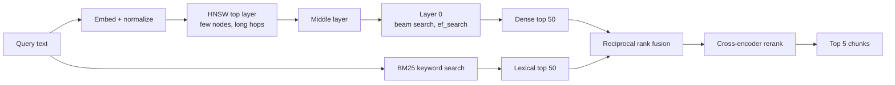
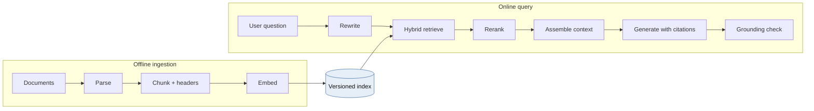
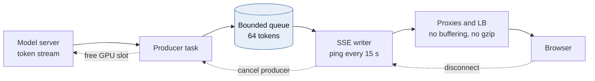
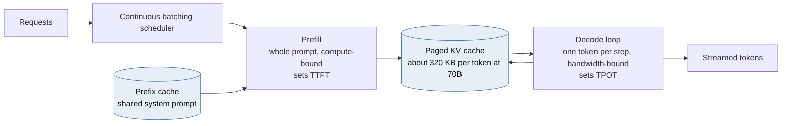
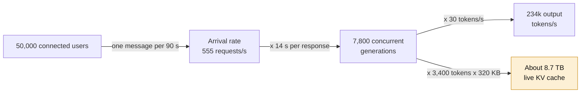
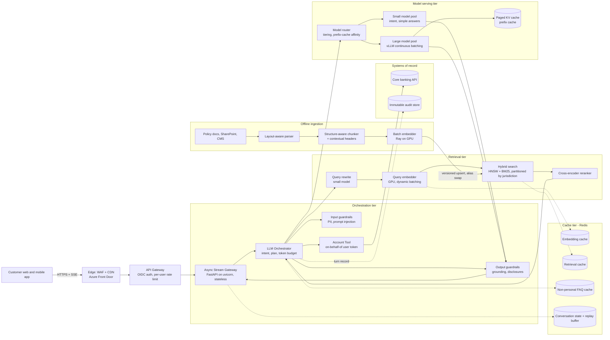

# Module 2 — AI & LLM Infrastructure at Scale

*Industry: Generative AI & Autonomous Agents*

## 2.1 Ideas & Trade-offs

### Vector databases and ANN indexing



*[Open full-size diagram: Hybrid retrieval pipeline (SVG)](../diagrams/m2-hybrid-retrieval-pipeline.svg)*

**In plain words:** an **embedding** turns text into a list of numbers (a **vector**), so texts with similar meaning get similar numbers. A **vector database** stores millions of these and quickly finds the ones closest to a question's vector.

Checking every vector one by one is exact but slow. For 10 million chunks of 1,024 numbers each, that's about 10 billion multiplications per question. **ANN (approximate nearest neighbour)** indexes find *almost* the best matches much faster. Every index choice is a balance between three things:

- **recall**: how often the true best matches are found;
- **speed**;
- **memory**.

**HNSW (Hierarchical Navigable Small World)** is the most popular index. Think of it as a stack of road maps:

- The **top map** has only a few cities with long highways between them. Lower maps have more cities and shorter roads. The **bottom map** has every point.
- **Searching:** start at the top, keep moving to whichever neighbour is closest to your question, and drop down a level when you can't get any closer. On the bottom level, keep a shortlist of the best `ef_search` candidates while exploring.
- **Settings:**
  - `M` is the number of neighbours each point links to. More means better recall and more memory.
  - `ef_construction` is how carefully the index is built. Higher gives a better index but builds more slowly.
  - `ef_search` is how widely to search at question time. This is the **main knob for accuracy vs. speed**, and you can change it for each query.
- **Memory:** 10 million vectors × 1,024 floats ≈ 41 GB, plus 2–3 GB for the links. **It all lives in RAM.**
- **Weaknesses:** deleting items leaves gaps that slowly make the index worse, so it needs occasional rebuilds. Building is slow. Strict filters (see below) can break it.

**Other index types:**

| Index | How it works | Memory | Accuracy at the same speed | Updates | Use when |
|---|---|---|---|---|---|
| Flat (check everything) | Exact scan, often on a GPU | 1× | 100% | Easy | Under ~1M vectors, or small filtered subsets |
| **HNSW** | Layered graph | ~1.1–1.5× | Excellent | Adds are fine, deletes are poor | The default for under ~100M vectors in RAM |
| IVF-Flat | Group vectors into clusters and search only the nearest clusters | ~1× | Good | Cheap. Retrain when data changes | Large collections, GPU |
| IVF-PQ | Clusters plus compression (a 4 KB vector becomes 64 bytes) | ~0.02× | Lower. Re-check the top results with full vectors | Retrain | Billions of vectors, on a tight budget |
| DiskANN | Graph stored on SSD, compressed vectors in RAM | Mostly SSD | Very good | Good | Hundreds of millions of vectors without the RAM for HNSW |

Smaller number formats also help: 8-bit numbers use 4× less memory and lose 1–2 points of accuracy, and 1-bit uses 32× less but needs a re-check step. Always **normalize** vectors (scale them to length 1), so the cheaper dot-product calculation gives the same answer as cosine similarity.

**The filtering trap.** Business apps always filter, for example by customer, country, document version or who is allowed to see what.

- **Filter after searching:** find the top 10, then remove those that fail the filter. You might end up with zero results.
- **Filter before searching:** pick the allowed items, then check them all exactly. This is fast when the allowed set is small.
- **Filter during the search:** skip disallowed points while walking the graph. With strict filters, the graph falls apart into disconnected islands and results get worse.
- **Best answer:** when the filter is a **security or legal boundary**, keep **separate indexes** (per customer or per country) instead of filtering. You get isolation you can prove, stable accuracy, and simpler management. Use filters only for "nice to have" relevance rules.

**Hybrid search.** Embeddings are weak at exact words such as policy numbers, product codes and names like "Reg E". So also run a **keyword search (BM25)** in parallel, and merge the two result lists with **Reciprocal Rank Fusion**: each result scores `1 / (60 + its rank)` in each list, and the scores are added. Then a **reranker** model (a cross-encoder) re-scores the top ~50 and picks the best 5–8. It adds about 30–150 ms, and it's usually the single biggest quality improvement.

### Retrieval-Augmented Generation (RAG) pipelines



*[Open full-size diagram: RAG - offline ingestion and online query paths (SVG)](../diagrams/m2-rag-offline-ingestion-and-online-query-paths.svg)*

**In plain words:** RAG means "look up the right documents first, then ask the AI to answer using them". It keeps answers based on your real documents instead of the model's memory.

**Preparing documents (done ahead of time):**
Documents (SharePoint, CMS, PDFs) → read the layout, keeping tables and headings → split into **chunks** → add labels (document ID, version, effective date, country, who can see it) → create embeddings → save to the index.

- **Versions matter for correctness.** When policy v7 replaces v6, the v6 chunks must stop showing up *at once*. Store a version and an `active` flag, or build a new index and switch over in one step.
- **A new embedding model means re-processing everything.** Vectors from different models can't be compared. Build the new index alongside the old one and then switch.

**How to split documents (chunking):**

| Choice | Effect |
|---|---|
| Small chunks (200–400 tokens) | Precise matches, but each chunk has less context, so you need more of them |
| Large chunks (800–1,500 tokens) | More context, but the meaning gets blurred and prompts cost more |
| Overlap (10–20%) | Sentences split across two chunks are still found. The index is bigger |
| Split on headings | The best default for policy documents |
| "Small to big" | Search small chunks, but give the AI the whole section they came from |
| Add a header | Put `Document › Section › Subsection` at the top of each chunk *before* creating the embedding. It's cheap and noticeably improves results |

**Answering a question:** safety checks → rewrite the question so it makes sense on its own ("what about abroad?" becomes a full question) → hybrid search → rerank → build the prompt within a token budget → generate an answer with citations → final checks (is it backed by the sources? any personal data? required disclaimers?).

**Test the search separately from the answer.** Most "the AI made things up" problems are really search problems: the right chunk never reached the prompt. Measure how often the right chunk is in the top results on a fixed set of test questions, in your CI pipeline. Separately, check whether answers stick to their sources, on sampled real traffic.

### Stream processing and long-lived connections



*[Open full-size diagram: Token streaming with backpressure and cancellation (SVG)](../diagrams/m2-token-streaming-with-backpressure-and-cancellation.svg)*

**Streaming the answer.** Users see the answer appear word by word instead of waiting. Two ways to do that:

| | Server-Sent Events (SSE) | WebSocket |
|---|---|---|
| Direction | Server → browser | Both ways |
| Protocol | Normal HTTP | A special upgraded connection |
| Through proxies and firewalls | Easy | Often needs extra setup |
| Reconnecting | Built in (`Last-Event-ID`) | You build it yourself |
| Best for | **Streaming AI answers** | Voice, interrupting mid-answer, collaborative agents |

For a chatbot, SSE is the default. If the user presses "stop", that can be a separate `POST /cancel` request.

**What actually limits 50,000 open connections:**

- **Memory isn't the problem.** An idle connection in async Python uses tens of KB, so 50,000 connections fit on a few servers.
- **Load balancers close quiet connections.** While the model is still "thinking", nothing is sent, and a load balancer may close the stream. Send a small comment line (`: ping`) every ~15 seconds, and check the idle timeout at every hop.
- **Buffering silently breaks streaming.** Turn off proxy buffering (`X-Accel-Buffering: no` on nginx) and **turn off gzip** on streaming routes, because compression waits to collect data.
- **Backpressure.** A slow client must not make memory grow forever. Use a small queue for each stream, and drop the connection if it stays full.
- **Stop generating when the user leaves.** A closed browser tab must free its GPU slot *straight away*. Otherwise abandoned answers waste a real share of your GPUs.

### Model serving optimization



*[Open full-size diagram: LLM inference - prefill, KV cache, decode (SVG)](../diagrams/m2-llm-inference-prefill-kv-cache-decode.svg)*

An LLM answers in two phases that are slow for opposite reasons:

- **Prefill** reads the whole prompt in one go. It's limited by **compute power**, and it decides the **time to first token (TTFT)**.
- **Decode** writes the answer one token at a time. It's limited by **memory speed**, and it decides the **time per output token (TPOT)**.

**The KV cache is the real limit, not compute power.** While writing an answer, the model keeps a working memory (the "KV cache") for every token in the conversation:

```
KV bytes per token = 2 (K and V) × layers × kv_heads × head_dim × bytes_per_value
70B-class model with GQA (80 layers, 8 KV heads, head_dim 128, fp16):
  2 × 80 × 8 × 128 × 2 B ≈ 320 KB per token
A 4,000-token conversation ≈ 1.3 GB of GPU memory for a single sequence
```

So how many conversations one GPU can handle depends mostly on this memory. Most serving tricks exist to stretch it:

| Technique | What it does | Trade-off |
|---|---|---|
| **Continuous batching** (vLLM, TGI, TensorRT-LLM, SGLang) | New requests join the running batch at every step instead of waiting for it to finish | Bigger batches mean more total speed but slower tokens per user. Tune `max_num_seqs` to your target |
| **PagedAttention** | Stores the KV cache in small fixed pages, so no memory is wasted on gaps | Standard now |
| **Prefix caching** | Reuses the KV cache for a shared start of the prompt (system prompt, fixed policy text) | Huge win for RAG. Requests must be sent to the server that already has that prefix |
| **Quantization** (8-bit or 4-bit numbers) | 2–4× more room for the KV cache | Quality may drop, so test on *your* questions |
| **Speculative decoding** | A small model guesses the next few tokens, and the big model checks them in one go | Same output, faster, depending on how often the guesses are right. Uses extra memory |
| **Chunked prefill** | Splits long prompts so they don't freeze answers already being written | Slightly slower first token for long prompts |
| **Separate prefill and decode servers** | Different GPU pools for each phase | Best efficiency at large scale, but the KV cache must be moved between them |
| **Model tiers** | A small model handles simple questions, the big one only when needed | One extra routing step, but much cheaper |

## 2.2 Python: Async Streaming, Chunking, GPU Queues

### A streaming endpoint with limits, heartbeats, backpressure and cancelling

```python
import asyncio
import json
from collections.abc import AsyncIterator

from fastapi import FastAPI, Request
from fastapi.responses import JSONResponse, StreamingResponse
from pydantic import BaseModel

app = FastAPI()
GEN_SLOTS = asyncio.Semaphore(256)   # per-process cap on in-flight generations
_DONE = object()


class ChatIn(BaseModel):
    conversation_id: str
    message: str


async def generate_tokens(body: ChatIn) -> AsyncIterator[str]:
    """Placeholder: stream from vLLM / Azure OpenAI with stream=True."""
    for tok in ("Disputes ", "abroad ", "follow ", "the ", "same ", "rules."):
        await asyncio.sleep(0.03)
        yield tok


def sse(event: str, data: dict) -> bytes:
    return f"event: {event}\ndata: {json.dumps(data)}\n\n".encode()


@app.post("/v1/chat/stream")
async def chat_stream(req: Request, body: ChatIn):
    if GEN_SLOTS.locked():   # best-effort fast-fail so the client gets a real 429
        return JSONResponse({"error": "overloaded"}, status_code=429, headers={"Retry-After": "2"})

    async def event_source() -> AsyncIterator[bytes]:
        try:
            await asyncio.wait_for(GEN_SLOTS.acquire(), timeout=0.5)
        except TimeoutError:
            yield sse("error", {"code": "overloaded", "retry_after_s": 2})
            return
        q: asyncio.Queue[object] = asyncio.Queue(maxsize=64)   # bounded = backpressure

        async def produce() -> None:
            try:
                async for tok in generate_tokens(body):
                    await q.put(tok)   # blocks when the client is slow, pausing the upstream stream
                await q.put(_DONE)
            except Exception as exc:   # surface model errors to the consumer loop
                await q.put(exc)

        producer = asyncio.create_task(produce())
        try:
            while True:
                if await req.is_disconnected():
                    break
                try:
                    # Queue.get is safe to cancel. Never wrap the generator's __anext__
                    # in wait_for: a timeout would cancel the model stream itself.
                    item = await asyncio.wait_for(q.get(), timeout=15)
                except TimeoutError:
                    yield b": ping\n\n"   # keeps LBs from reaping a slow-prefill stream
                    continue
                if item is _DONE:
                    yield sse("done", {})
                    break
                if isinstance(item, Exception):
                    yield sse("error", {"code": "generation_failed"})
                    break
                yield sse("token", {"t": item})
        finally:
            producer.cancel()      # propagates cancellation upstream and frees GPU work
            GEN_SLOTS.release()

    return StreamingResponse(event_source(), media_type="text/event-stream",
                             headers={"Cache-Control": "no-cache", "X-Accel-Buffering": "no"})
```

The `locked()` check at the top isn't perfectly accurate. It's a cheap way to turn people away early, and the timed `acquire` inside is the real limit. Newer Starlette versions also cancel the generator when sending fails, but checking `is_disconnected()` also covers the time before the first token, when nothing has been sent yet.

### Splitting documents into chunks by tokens

```python
from collections.abc import Callable, Iterator, Sequence
from dataclasses import dataclass


@dataclass(frozen=True, slots=True)
class Chunk:
    doc_id: str
    doc_version: int
    section_path: str
    text: str
    start_token: int


def chunk_section(
    doc_id: str,
    doc_version: int,
    section_path: str,                       # "Card Disputes › Foreign Transactions"
    body: str,
    encode: Callable[[str], Sequence[int]],  # e.g. tiktoken or an HF tokenizer
    decode: Callable[[Sequence[int]], str],
    max_tokens: int = 400,
    overlap: int = 60,
) -> Iterator[Chunk]:
    if not 0 <= overlap < max_tokens:
        raise ValueError("overlap must be in [0, max_tokens)")
    ids = encode(body)
    if not ids:
        return
    step = max_tokens - overlap
    for start in range(0, max(len(ids) - overlap, 1), step):
        window = ids[start:start + max_tokens]
        # The contextual header is embedded with the chunk, so a chunk that just says
        # "within 60 days" still retrieves for "foreign dispute deadline".
        yield Chunk(doc_id, doc_version, section_path,
                    f"{section_path}\n\n{decode(window)}", start)
```

Split by headings first (one call per section), then use the token window only inside long sections. In production, move the window edges to sentence boundaries, because raw token windows can cut words in half.

### GPU workers for embeddings, with automatic batching (Ray Serve)

```python
from ray import serve


@serve.deployment(
    ray_actor_options={"num_gpus": 1},
    autoscaling_config={"min_replicas": 2, "max_replicas": 16, "target_ongoing_requests": 64},
)
class Embedder:
    def __init__(self) -> None:
        from sentence_transformers import SentenceTransformer
        self.model = SentenceTransformer("BAAI/bge-large-en-v1.5", device="cuda")

    @serve.batch(max_batch_size=128, batch_wait_timeout_s=0.01)
    async def embed(self, texts: list[str]) -> list[list[float]]:
        # Callers send one string. Ray coalesces concurrent calls into a single GPU batch.
        vecs = self.model.encode(texts, normalize_embeddings=True, batch_size=128)
        return vecs.tolist()

    async def __call__(self, text: str) -> list[float]:
        return await self.embed(text)


embedder_app = Embedder.bind()
```

The trade-off is clear: waiting up to 10 ms (`batch_wait_timeout_s=0.01`) adds a little delay, but the GPU can do far more work per second by processing many texts at once. Check the autoscaling setting names for your Ray version, because they've changed over time. For CPU-heavy work in Python (reading PDFs, tokenizing big documents), use `ProcessPoolExecutor`. Threads won't help because of Python's GIL.

## 2.3 Case Study: An Enterprise AI Customer-Service Bot for 50,000 Concurrent Users

**Requirements:** a bank's assistant that:

- looks up live account data (balances, recent transactions, card status);
- finds compliance rules, with citations;
- streams answers word by word.

95% of users see the first word within 1.5 seconds, with at least 20 tokens/s after that. **No customer can ever see another customer's data.** Everything must be auditable.

### Rough numbers: "50,000 connected" is not the number that matters



*[Open full-size diagram: Little's Law sizing for the chat bot (SVG)](../diagrams/m2-little-s-law-sizing-for-the-chat-bot.svg)*

We use **Little's Law**: *average number of things in progress = arrival rate × time each one takes*.

| Assumption | Value |
|---|---|
| Connected users | 50,000 |
| Average time between a user's messages | 90 s |
| Answer length / writing speed | 400 tokens at 30 tokens/s ≈ 13 s |
| Time to first token (search + prefill) | ~1 s |
| Prompt size (system + 5 chunks + history + account data) | ~3,000 tokens |

| Result | Value |
|---|---|
| New requests per second | 50,000 / 90 ≈ **555 per second** |
| Answers being written at the same moment | 555 × 14 s ≈ **7,800** |
| Output tokens per second, in total | 7,800 × 30 ≈ **234,000** |
| Prompt tokens read per second | 555 × 3,000 ≈ **1.7 million** (a cached shared start of ~800 tokens removes ~25%) |
| KV cache memory needed (70B-size model) | ~7,800 × ~3,400 tokens × 320 KB ≈ **8–9 TB** |

That last row changes everything. Running this yourself with a 70B model needs hundreds of GPUs before any spares. The biggest levers, in order:

1. **Use model tiers.** Most banking questions ("what's my balance?", "freeze my card") need a small model plus one tool call, or no AI at all. Send only complex policy questions to the big model.
2. **Limit answer length** and keep answers short. Answer length drives the numbers directly.
3. **Keep prompts short.** Five good chunks beat twelve loose ones, for quality and for cost.
4. **Buy instead of build.** A managed service with reserved capacity (Azure OpenAI provisioned throughput, Bedrock, Vertex) turns GPU operations into a contract. Running it yourself (vLLM on AKS GPU nodes) is cheaper only if the GPUs are busy most of the time and you have a team to run them.

### Design decisions

- **Stateless streaming servers.** Conversation state lives in Redis or Cosmos DB, so any server can handle any message. A short replay buffer (~60 s) lets clients resume a dropped stream.
- **Do lookups at the same time.** Fetch account data, search documents and load history in parallel (`asyncio.TaskGroup`). The wait is then the slowest of the three, not all three added together.
- **The AI never decides whose data to fetch.** The customer ID comes from the *logged-in session*. The account tool calls the core banking system with the user's own token. The model can ask for "my recent transactions" but can never choose *whose*. This one rule prevents the most damaging kind of prompt-injection attack.
- **Treat retrieved documents as untrusted.** Documents can contain hidden instructions ("indirect prompt injection"). Give tools the fewest permissions possible, and require confirmation for anything that changes data.
- **Search:** keyword + HNSW hybrid search with reranking (Azure AI Search, or pgvector/Qdrant plus a reranker), filtered by product, country and effective date, with separate indexes per regulated region.
- **Caching, from safest to riskiest:**

| Layer | Key | Rule |
|---|---|---|
| Embedding cache | hash(text, model version) | Always safe |
| Search result cache | hash(rewritten question, index version, filters) → chunk IDs | Safe with a short TTL |
| Prefix cache (on the model server) | The shared start of the prompt | Safe, and the biggest cost saving |
| Exact answer cache | Normalized question + index version, **general questions only** | OK for FAQs |
| "Similar question" cache | Questions that are nearly the same | **Only for approved general answers.** Never for anything that used account data, because a near-match could return another customer's answer |

- **When things break, be safe on compliance:**
  - Search is down → do **not** answer policy questions without sources. Say so and offer a human.
  - The account system is down → still answer policy questions, and say account details are temporarily unavailable.
  - GPUs are full → limit new requests, switch to the smaller model, or queue with an honest wait time.
- **Audit record for every answer:** prompt template version, retrieved chunk IDs and versions, tool calls, model and version, and the answer. Store it so it can't be changed and is encrypted, and remove personal data before it reaches general logs.
- **Monitoring:** one trace per answer, showing the time spent in search, reranking, tools, prefill and decode. Track token counts, time to first token and time per token, plus cost per customer and per question type.

## 2.4 Diagram: RAG Serving Architecture



*[Open full-size diagram: RAG serving architecture (SVG)](../diagrams/m2-rag-serving-architecture.svg)*

## 2.5 Animation Plan: From Text to Tokens, Vectors, and an HNSW Match

**Scene:** use `ThreeDScene` for the 3D parts and a normal `Scene` for the text part. Set the camera angle with `self.set_camera_orientation(phi=70*DEGREES, theta=-45*DEGREES)`. Fix the random seed so the layout is the same every time.

| Time | Step | What you see | Manim tools / notes |
|---|---|---|---|
| 0:00–0:04 | **1. Question** | "Can I dispute a card charge made abroad?" types across the screen | `AddTextLetterByLetter` |
| 0:04–0:09 | **2. Tokens** | The sentence splits into chips, one per token (for example `dis` `pute`). Each chip flips to show a number. Caption: *the exact split and numbers depend on the tokenizer* | Rectangles with text, flip, `Transform` to the number |
| 0:09–0:15 | **3. Embed** | A tall grid (the embedding table) appears. Each number highlights one row, which slides out as a coloured bar | Grid, `Indicate(row)`, `ReplacementTransform` |
| 0:15–0:20 | 3 | The bars pass through a stack of see-through blocks (the model's layers). Thin lines cross between tokens, and the colours change as tokens take in context | Faint `Line`s, `LaggedStart`, colour changes |
| 0:20–0:24 | 3 | The bars merge into one strip of 1,024 colours: the *sentence embedding*. Caption: *an embedding model makes this, not the chat model* | `Transform` into 1,024 thin rectangles |
| 0:24–0:28 | **4. Normalize** | The strip becomes a 3D arrow from the centre, and the arrow's length snaps to touch a see-through sphere of radius 1 | `Arrow3D`, sphere |
| 0:28–0:35 | **5. Vector space** | Thousands of chunk dots fade in, in labelled clusters: *Disputes*, *Travel*, *Fees*, *Mortgages*. Caption: *a 3D picture of a 1,024-dimension space, so distances are only rough*. The camera slowly circles | `Dot3D`, ambient camera rotation |
| 0:35–0:38 | 5 | The question appears as a glowing star between *Disputes* and *Travel* | `Dot3D` with glow, `Flash` |
| 0:38–0:42 | **6. HNSW layers** | The dots separate into three see-through layers: top (~10 dots), middle (~100) and bottom (all). Dotted vertical lines connect copies of the same dot | Planes, dashed lines |
| 0:42–0:48 | 6 | **Top layer:** start at the entry point and hop toward the star. A side panel shows the distance shrinking: `0.91 → 0.74 → 0.63`. When no hop helps, drop down a level | `MoveAlongPath`, counting number, `Circumscribe` |
| 0:48–0:54 | 6 | Same on the middle layer with shorter hops. Drop to the bottom | Same, faster |
| 0:54–1:02 | 6 | **Bottom layer:** a side panel shows the shortlist (`ef_search = 64`, top 8 shown). Dots light up as they're checked, and the shortlist re-sorts live | Re-sorting list, highlights |
| 1:02–1:07 | **7. Rerank** | The top 8 line up with scores. A "lens" passes over them and re-orders them. A lookalike chunk (*"dispute a parking ticket"*) falls from #2 to #7 | `animate.arrange`, `Indicate` |
| 1:07–1:12 | **8. Filter problem** (bonus) | Back to the bottom layer. Apply the filter `country = QC`: 98% of dots turn grey. The search gets stuck on an island and finds only 2 results instead of 8. Caption: *strict filters break the graph* | Fade out, red cross |
| 1:12–1:16 | 8 | Fix: split into separate indexes per country. Searching the *QC* index finds 8 good results | `FadeTransform` to a smaller graph |
| 1:16–1:20 | **9. Prompt** | The final 5 chunks fly into a prompt card beside the system prompt, and citation tags `[1]`–`[5]` attach | `ReplacementTransform`, `LaggedStart` |

## 2.6 Review Questions

- How often does search find the right chunk in the top 10 on your test questions, and how much of the quality problem is search rather than the AI?
- How do you make sure an old policy version can no longer be found, and how soon after the new one is published?
- Could any cache ever return data from another customer's account? What proves it can't?
- What are your targets for time to first token and time per token, and at what batch size do you miss them?
- When the GPUs are full, which users get slower service first? Is that a product decision or an accident?

---

[← Back to contents](../README.md)
