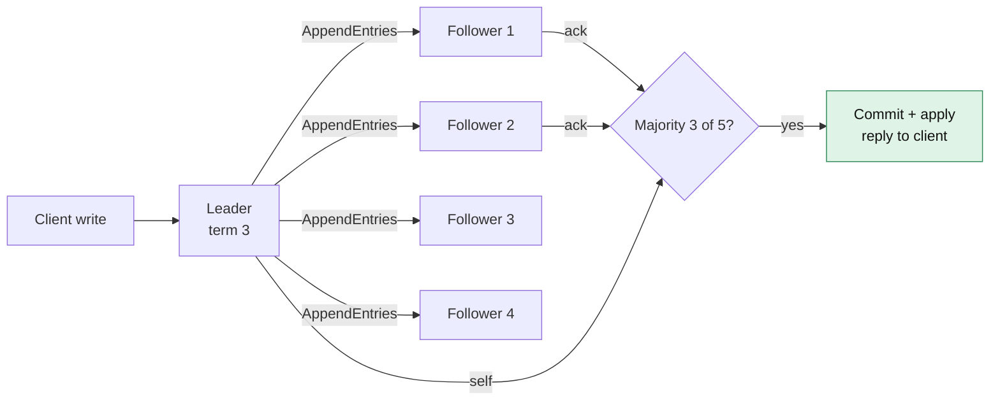
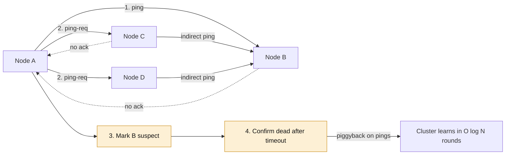
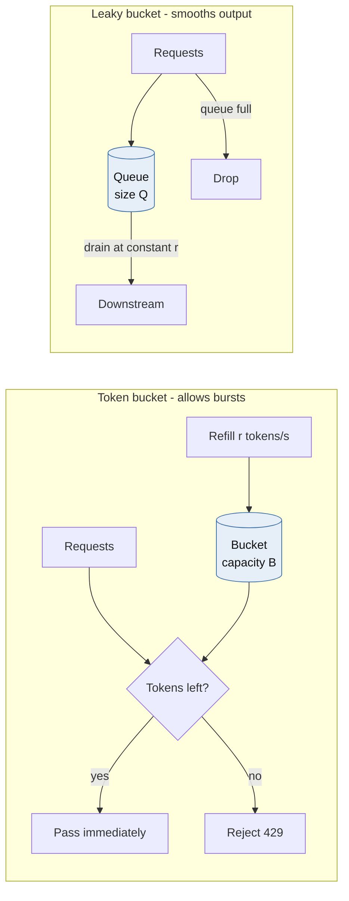
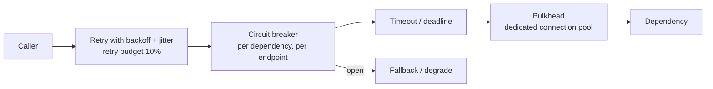
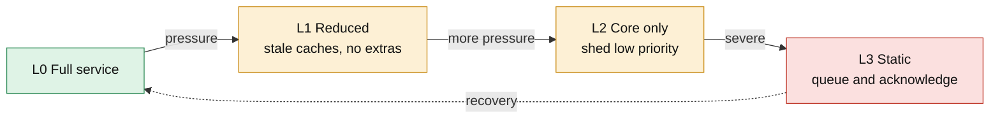
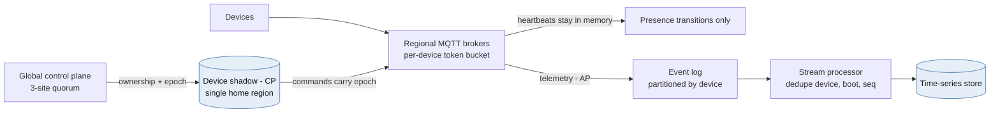

# Module 3 — Distributed Systems Consensus & Resiliency

*Industry: Global SaaS & IoT*

## 3.1 Ideas & Trade-offs

### Consensus: Raft and Paxos



*[Open full-size diagram: Raft log replication and commit (SVG)](../diagrams/m3-raft-log-replication-and-commit.svg)*

**In plain words:** consensus lets a group of machines agree on the same ordered list of changes (a *log*), even if some machines crash. It doesn't handle machines that lie on purpose (that's a different, harder problem).

A famous result (**FLP**) shows that no method can *guarantee* agreement will finish if the network can be slow without limit and even one machine may crash. So real systems promise two things: **never agree on something wrong**, and **finish when the network behaves reasonably**. Timeouts decide when to try again.

**Raft on one page:**

- **Roles:** each machine is a *follower*, a *candidate* or the *leader*.
- **Terms** are election rounds, numbered 1, 2, 3 and so on. A machine that sees a message with a higher term steps down and adopts that term.
- **Elections:** if a follower hears nothing from the leader for a *random* timeout (150–300 ms in the Raft paper, often 1 s or more in real deployments), it:
  1. increases the term;
  2. votes for itself;
  3. asks the others for votes (`RequestVote`).

  Each machine votes at most once per term, and **only for a candidate whose log is at least as up to date as its own**. That rule guarantees a new leader already has every agreed change.
- **Copying changes:** the leader sends new entries to followers (`AppendEntries`), including the position and term of the entry just before them. If a follower's log doesn't match there, it says no, and the leader steps back until the logs match. Followers' extra, unconfirmed entries are overwritten.
- **Committing:** an entry is final ("committed") once a **majority** has stored it **and** it's from the leader's current term. Entries from older terms become final indirectly. This is a subtle case in the Raft paper, and it's why a new leader immediately adds an empty entry.
- **Majorities:** with `2f + 1` machines, the group survives `f` failures. 3 machines survive 1 failure, and 5 survive 2. **An even number adds cost but no extra safety.**
- **Speed:** each commit takes the leader's disk write plus the round trip to the fastest majority. With 5 machines across 3 regions, every write waits on a round trip to another region.
- **Extras used in production:**
  - **Pre-vote:** a machine returning after a network split checks first whether it could win, instead of starting pointless elections.
  - **Leader leases / ReadIndex:** stop a leader that was cut off in a minority group from serving old data.
  - **Learners:** copies that receive data but don't vote.
  - **Joint consensus:** a safe way to change which machines are in the group.

**Raft vs. Paxos:** they can do the same things. Raft is easier to understand and has one strong leader. Paxos variants (such as EPaxos) can have no leader, which can be faster across regions but is much more complex. **Don't build consensus yourself.** Use etcd, ZooKeeper or Consul, or databases with Raft built in (CockroachDB, TiKV, Kafka's KRaft).

**Split brain.** Raft guarantees that at most one leader can *commit* in each term. It does **not** stop an old leader from *thinking* it's still in charge. It also doesn't stop split brain in *your application*, for example two regions each accepting changes for the same device. The fix is the same everywhere: **attach an epoch or term number to every write**, and have storage reject writes carrying an older number.

### Gossip protocols



*[Open full-size diagram: SWIM failure detection (SVG)](../diagrams/m3-swim-failure-detection.svg)*

**In plain words:** machines spread news the way people spread gossip. Each one tells a few random others, and soon everyone knows.

**SWIM, the most common version, for "who's alive?":**

- Every so often, each machine pings one random machine. If there's no answer, it asks a few *other* machines to ping it (`ping-req`). If there's still no answer, the machine is marked *suspect*, and then *dead* after a timeout.
- News about who joined or left **rides along on these pings**, so everyone hears it within `O(log N)` rounds, and each machine does only a small, fixed amount of work.

**Trade-offs:** gossip is fast and cheap, but not exact, and news arrives "eventually". Pauses and network hiccups cause false alarms. The **phi-accrual detector** (used by Cassandra and Akka) gives a "suspicion level" instead of yes/no, so each part of the system can choose its own threshold.

**Rule of thumb:** use gossip for *who's alive and what they offer*, and consensus for *decisions everyone must agree on*. Consul uses both: gossip for membership, and Raft for its service catalog.

### Rate limiting: token bucket vs. leaky bucket



*[Open full-size diagram: Token bucket vs leaky bucket (SVG)](../diagrams/m3-token-bucket-vs-leaky-bucket.svg)*

**In plain words:** rate limiting stops any one client from sending too many requests.

| Method | How it behaves | Bursts | Memory needed | Typical use |
|---|---|---|---|---|
| **Token bucket** | A bucket holds up to B tokens and refills at r per second. Each request uses a token | **Allows bursts** up to B. Averages r | 2 numbers | API limits, per-device limits |
| **Leaky bucket (queue)** | Requests wait in a queue of size Q and leave at a steady rate r | **Smooths bursts** into a steady flow. Adds waiting time | A queue | Protecting a fragile system that needs a steady pace |
| Leaky bucket (counter) / GCRA | Tracks when the next request is allowed | Same result as a token bucket | 1 number | Telecoms, efficient Redis limiters |
| Fixed window | Count per minute | Up to 2× bursts where two windows meet | 1 counter | Rough limits |
| Sliding window log | Stores every request's time | Exact | Grows with traffic | Low traffic where precision matters |
| Sliding window counter | Blends two windows | Close enough | 2 counters | A good general default |

**Rate limiting across many servers:**

1. **Central counter** in Redis with a Lua script: exact and atomic, but adds about 1 ms per request, and Redis becomes something you depend on. Decide what happens if Redis is down: **let traffic through** (when protecting a backend) or **block it** (for billing or abuse limits).
2. **Local limits:** each of N servers allows r/N. Fast, but inaccurate if traffic isn't spread evenly.
3. **Hybrid:** each server keeps a local bucket and occasionally borrows allowance from a central store.

**Rate limiting is not load shedding.** Rate limits keep things *fair between clients*. Load shedding is a server *protecting itself* based on its own health (how many requests are in flight, how long they've waited). Adaptive limits catch overloads that fixed rate limits miss.

### Circuit breakers



*[Open full-size diagram: Layered resiliency around one dependency call (SVG)](../diagrams/m3-layered-resiliency-around-one-dependency-call.svg)*

**In plain words:** like the electrical breaker in your house. If a service you call keeps failing, stop calling it for a while, so it can recover and your own app doesn't hang.

A breaker has three states:

- **Closed** (normal): calls go through, and results are counted.
- **Open** (tripped): calls fail immediately for a cool-down period, and you use a fallback.
- **Half-open** (testing): a few test calls are allowed through. If they succeed, the breaker closes. If one fails, it opens again.

Details that decide whether a breaker helps or hurts:

- **Trip on a failure *rate*, with a minimum number of calls.** One failure out of one call isn't an outage.
- **Count slow calls as failures.** A service that answers in 9 seconds is effectively down.
- **Only count the right errors.** 5xx errors and timeouts are the other service's fault. 4xx errors are *your* bug and shouldn't trip the breaker.
- **Use one breaker per service and endpoint (or shard).** A single breaker for a whole sharded database trips everything when one shard fails.
- **You need timeouts first.** Without a timeout, a hung call never "fails", so the breaker never opens.
- **Use separate connection pools per service (bulkheads)**, so one slow service can't use up all your workers.
- **Put retries *outside* the breaker**, with backoff, jitter and a budget. If three layers each retry three times, one failed request becomes **27** requests during an outage. Cap retries at about 10% of traffic.

### Graceful degradation



*[Open full-size diagram: Degradation ladder (SVG)](../diagrams/m3-degradation-ladder.svg)*

**In plain words:** when things get bad, keep the most important features working and switch off the rest, instead of failing completely.

Plan the steps with the product team **before** anything breaks:

| Level | What happens |
|---|---|
| L0 Full | Everything works |
| L1 Reduced | Serve older cached data. Turn off recommendations, rich reports and extras |
| L2 Core only | Only critical features work. Low-priority traffic is turned away |
| L3 Static | Show simple fixed responses. Accept writes into a queue and confirm them later |

To turn away the least important work first, every request needs a priority label from the start. Health checks and control traffic come first, safety alarms next, and bulk data last.

## 3.2 Python: Resiliency Patterns

### Retries with `tenacity`: only retry what's worth retrying

```python
import httpx
from tenacity import (retry, retry_if_exception, stop_after_attempt,
                      stop_after_delay, wait_exponential_jitter)


def is_retryable(exc: BaseException) -> bool:
    if isinstance(exc, (httpx.ConnectError, httpx.ReadTimeout, httpx.PoolTimeout)):
        return True
    if isinstance(exc, httpx.HTTPStatusError):
        return exc.response.status_code in {429, 502, 503, 504}
    return False   # 4xx is the caller's bug. Retrying just repeats it


@retry(
    retry=retry_if_exception(is_retryable),
    wait=wait_exponential_jitter(initial=0.1, max=5.0, jitter=0.5),
    stop=stop_after_attempt(4) | stop_after_delay(10),   # attempt cap AND deadline
    reraise=True,
)
async def push_device_config(client: httpx.AsyncClient, device_id: str, cfg: dict) -> None:
    # Retrying a mutation is only safe because the server dedupes on the key.
    r = await client.put(f"/devices/{device_id}/config", json=cfg,
                         headers={"Idempotency-Key": cfg["revision_id"]})
    r.raise_for_status()
```

`tenacity` handles retries, but it's not a circuit breaker. Libraries such as `pybreaker` and `aiobreaker` exist, but a breaker is small enough that writing your own gives you better monitoring and correct async behaviour.

### A custom async circuit breaker

```python
import asyncio
import time
from collections import deque
from collections.abc import AsyncIterator, Callable
from contextlib import asynccontextmanager
from enum import Enum, auto


class State(Enum):
    CLOSED = auto()
    OPEN = auto()
    HALF_OPEN = auto()


class CircuitOpenError(RuntimeError):
    pass


class CircuitBreaker:
    def __init__(
        self,
        name: str,
        *,
        window_s: float = 30.0,
        min_calls: int = 20,
        failure_rate: float = 0.5,
        open_s: float = 15.0,
        half_open_probes: int = 3,
        is_failure: Callable[[BaseException], bool] = lambda e: True,
        clock: Callable[[], float] = time.monotonic,
    ) -> None:
        self.name, self._window_s, self._min_calls = name, window_s, min_calls
        self._failure_rate, self._open_s, self._probes = failure_rate, open_s, half_open_probes
        self._is_failure, self._clock = is_failure, clock
        self._events: deque[tuple[float, bool]] = deque()   # (timestamp, failed)
        self._state = State.CLOSED
        self._opened_at = 0.0
        self._probe_inflight = 0
        self._probe_successes = 0
        self._lock = asyncio.Lock()

    @property
    def state(self) -> State:
        return self._state

    async def _admit(self) -> bool:
        """Return True if this call is a half-open probe. Raise if rejected."""
        async with self._lock:
            now = self._clock()
            if self._state is State.OPEN and now - self._opened_at >= self._open_s:
                self._state, self._probe_inflight, self._probe_successes = State.HALF_OPEN, 0, 0
            if self._state is State.OPEN:
                raise CircuitOpenError(self.name)
            if self._state is State.HALF_OPEN:
                if self._probe_inflight >= self._probes:
                    raise CircuitOpenError(self.name)
                self._probe_inflight += 1
                return True
            return False

    def _trip(self) -> None:
        self._state, self._opened_at = State.OPEN, self._clock()
        self._events.clear()

    async def _record(self, probe: bool, failed: bool) -> None:
        async with self._lock:
            if probe:
                if self._state is not State.HALF_OPEN:
                    return                      # stale probe finishing after another state change
                self._probe_inflight -= 1
                if failed:
                    self._trip()
                else:
                    self._probe_successes += 1
                    if self._probe_successes >= self._probes:
                        self._state = State.CLOSED
                        self._events.clear()
                return
            if self._state is not State.CLOSED:
                return                          # a call that started while CLOSED, finishing late
            now = self._clock()
            self._events.append((now, failed))
            while self._events and now - self._events[0][0] > self._window_s:
                self._events.popleft()
            n = len(self._events)
            if n >= self._min_calls and sum(f for _, f in self._events) / n >= self._failure_rate:
                self._trip()

    @asynccontextmanager
    async def guard(self) -> AsyncIterator[None]:
        probe = await self._admit()
        try:
            yield
        except asyncio.CancelledError:
            await self._record(probe, failed=False)   # the caller gave up; that isn't dependency failure
            raise
        except BaseException as exc:
            await self._record(probe, failed=self._is_failure(exc))
            raise
        else:
            await self._record(probe, failed=False)
```

How to use it, with a timeout inside the breaker so slow calls count as failures, and a fallback when it's open:

```python
tsdb_breaker = CircuitBreaker(
    "tsdb-write",
    is_failure=lambda e: isinstance(e, (TimeoutError, httpx.TransportError))
    or (isinstance(e, httpx.HTTPStatusError) and e.response.status_code >= 500),
)


async def write_batch(batch: list[dict]) -> None:
    try:
        async with tsdb_breaker.guard(), asyncio.timeout(0.8):
            await tsdb_client.write(batch)
    except CircuitOpenError:
        await spill_to_local_queue(batch)   # graceful degradation: durable buffer, replay later
```

Each server process keeps its own breaker. With 200 servers, each learns about failures on its own, which is usually fine because each sees its own network path. Sharing the breaker state through Redis would add a dependency to the very part that's meant to survive dependency failures.

### A rate limiter shared by all servers (Redis + Lua token bucket)

```python
import redis.asyncio as redis

TOKEN_BUCKET = """
local cap  = tonumber(ARGV[1])
local rate = tonumber(ARGV[2])   -- tokens per second
local cost = tonumber(ARGV[3])
local t = redis.call('TIME')      -- the server clock avoids skew between app hosts
local now = tonumber(t[1]) * 1000 + math.floor(tonumber(t[2]) / 1000)
local b = redis.call('HMGET', KEYS[1], 'tokens', 'ts')
local tokens = tonumber(b[1]) or cap
local ts = tonumber(b[2]) or now
tokens = math.min(cap, tokens + math.max(0, now - ts) / 1000.0 * rate)
local allowed = 0
if tokens >= cost then tokens = tokens - cost; allowed = 1 end
redis.call('HSET', KEYS[1], 'tokens', tokens, 'ts', now)
redis.call('PEXPIRE', KEYS[1], math.ceil(cap / rate * 1000) + 1000)
return {allowed, tostring(tokens)}   -- tostring: Lua numbers are truncated to integers on return
"""


class RateLimiter:
    def __init__(self, r: redis.Redis, capacity: float, rate: float) -> None:
        self._script = r.register_script(TOKEN_BUCKET)
        self._cap, self._rate = capacity, rate

    async def allow(self, key: str, cost: float = 1.0) -> bool:
        allowed, _remaining = await self._script(keys=[f"tb:{key}"],
                                                 args=[self._cap, self._rate, cost])
        return bool(int(allowed))
```

## 3.3 Case Study: A Global IoT Telemetry Ingestion Engine



*[Open full-size diagram: IoT - AP data plane, CP control plane (SVG)](../diagrams/m3-iot-ap-data-plane-cp-control-plane.svg)*

**Scenario:** 8 million industrial sensors and smart meters across North America, the EU and Asia-Pacific. Each device sends a "still alive" message (heartbeat) every 10 seconds and a batch of readings every 60 seconds, and receives settings and firmware updates. EU device data must stay in the EU. Links between regions sometimes fail, and data centres have split in two while devices could still reach both halves. That's exactly how split brain happens.

### Rough numbers

| Stream | Rate | Size | Bandwidth |
|---|---|---|---|
| Heartbeats | 8M / 10 s = **800,000 messages/s** | ~200 bytes | ~160 MB/s |
| Readings | 8M / 60 s = **133,000 messages/s** | ~1 KB | ~133 MB/s |
| Total | ~930,000 messages/s | | ~300 MB/s ≈ **26 TB/day** before compression |

### The key decision: choose consistency vs. availability *per type of data*

The **CAP theorem** says that when the network splits, a system must choose between staying **available** (AP: keep accepting work) and staying **consistent** (CP: refuse work rather than risk conflicts). You don't have to make one choice for the whole system. Choose for each kind of data:

| Data | What it's like | Choice | How |
|---|---|---|---|
| **Sensor readings** | Facts that are only ever added. Order doesn't matter when merging | **AP** | Accept them anywhere. Remove duplicates by `(device_id, boot_id, seq)`. Handle late data with watermarks |
| **Online/offline status** | Temporary, and fixes itself | **AP** | Keep "last seen" in the broker's memory. Only send changes |
| **Device settings (shadow)** | Must never conflict | **CP per device** | Each device has one home region that makes changes, with an ownership **epoch** |
| **Firmware rollout plan** | Global, rare, high-impact | **CP, global** | A consensus-backed control system, plus human approval |
| **Usage counts for billing** | Must add up in the end | Eventual, then checked | Counters that are safe to repeat, and a daily check |

### Design decisions

- **Cells.** Each region runs several independent "cells" (an MQTT broker cluster, a stream processor, a time-series database). Each cell has a maximum number of devices, so a problem in one cell affects only that many. Each device belongs to a *home cell*.
- **Heartbeats never reach a database.** The broker tracks `last_seen` in memory and only publishes *changes* (went offline, came back online). That turns 800,000 writes per second into maybe a few thousand, which is the biggest cost saving in the design.
- **Readings path:** MQTT broker (Azure Event Grid MQTT, IoT Hub, EMQX or HiveMQ) → Event Hubs/Kafka, split by `device_id` → stream processor (remove duplicates, add details, reduce detail) → time-series database (Azure Data Explorer, Timescale, InfluxDB). Raw data is also saved to ADLS as Parquet files.
- **Avoiding split brain for device settings:**
  - Each device's settings have exactly one owner, its home region, which holds a lease with an epoch number (stored in the region's etcd/Raft store).
  - Moving ownership to another region requires a majority vote in a **global control system spread across at least 3 sites** (two regions plus a tiebreaker). The side of a split without a majority **can't** take ownership.
  - Every settings change and every command sent to a device carries the epoch. After the split heals, changes with an older epoch are rejected, and devices ignore commands with an old epoch.
  - The cut-off side **keeps accepting sensor readings** (AP), keeps settings read-only (CP), and holds commands until the link returns. It's partly available, but never inconsistent.
- **Reconnect storms.** When a region recovers, millions of devices reconnect at once, and the encryption handshakes overload the servers.
  - **Device firmware must retry with growing, random waits.** This can't be fixed on the server after devices ship, so it must be designed in from day one.
  - The broker limits new connections with a token bucket and replies "server busy" (MQTT 5 has a code for this) when over the limit.
  - TLS session resumption makes reconnecting cheaper.
- **Protecting other systems:**
  - A per-device rate limit at the broker stops buggy firmware from flooding the system.
  - Per-customer limits protect shared cells.
  - Circuit breakers sit in front of database writes. When they open, data waits safely in Event Hubs and is replayed once the database recovers.
- **Degradation steps for this system:**
  - L1: tell devices to send heartbeats every 60 s instead of 10 s, and stop debug data.
  - L2: accept only alarms.
  - L3: devices store data locally and send it later. The firmware must support this.

## 3.4 Diagram: Circuit Breaker State Transitions


*[Open full-size diagram: Circuit breaker state transitions (SVG)](../diagrams/m3-circuit-breaker-state-transitions.svg)*

## 3.5 Animation Plan: Raft Leader Election When the Leader Goes Offline

**Scene:**

- Five machines **S1–S5** arranged in a pentagon. Each is a circle with a **term badge** (top right), a **role label** underneath, and an **election timer ring** around it.
- Under each machine is a row of small log squares, coloured by term (term 1 grey, term 2 blue, term 3 green) and numbered.
- **S1** is the gold leader in term 2. S5's log is shorter (5 entries) than the others' (7).
- Timeouts are fixed for repeatability: S2 = 210 ms, S3 = 170 ms, S4 = 260 ms, S5 = 190 ms, shown in slow motion.

| Time | Step | What you see | Manim tools |
|---|---|---|---|
| 0:00–0:06 | **Normal** | S1 sends heartbeat dots along its lines. Each follower's timer ring refills when a dot arrives. Caption: *Heartbeats are empty AppendEntries messages* | `MoveAlongPath(Dot)`, ring refill |
| 0:06–0:08 | **Leader crashes** | S1 turns grey with a red ✕. Heartbeats stop | `FadeToColor`, `Create(Cross)` |
| 0:08–0:12 | **Timers run down** | The four rings drain at different speeds, each labelled with its random timeout | One `ValueTracker` per machine, different run times |
| 0:12–0:14 | **S3 times out first** | S3 turns amber (*Candidate*). Its term badge flips from 2 to 3. A vote counter shows `1/5` (its own vote) | `Transform`, `Indicate` |
| 0:14–0:18 | **Asking for votes** | Envelopes labelled `term=3, lastLogIndex=7, lastLogTerm=2` travel to S2, S4 and S5. Each receiver's term flips to 3 and its timer resets | `LaggedStart(MoveAlongPath)` |
| 0:18–0:21 | **Votes** | S2 and S4 send back green ✓ envelopes. The counter reaches `3/5` and a **majority** banner flashes | `Flash`, counter change |
| 0:21–0:24 | **New leader** | S3 turns gold, gets a crown, and sends heartbeats straight away. All rings reset | `Transform`, `LaggedStart` |
| 0:24–0:30 | **First commit** | S3 adds an empty green term-3 entry at position 8 and sends it out. When 3 of 5 have it, a *committed* marker slides to position 8 | `FadeIn(square)`, moving marker |
| 0:30–0:36 | **Side panel: why S5 couldn't win** | A small replay shows S5 timing out first with only 5 entries. S2, S3 and S4 all reply ✕, because a shorter log means no vote. Caption: *This rule keeps committed entries safe* | Inset panel, scaled copy |
| 0:36–0:42 | **Old leader returns** | S1 recovers, still thinks it's the term-2 leader, and sends `AppendEntries term=2` with an uncommitted entry at position 8. The followers reply `term=3`. S1 becomes a *Follower*, its term jumps to 3, and its conflicting entry is crossed out in red and replaced with S3's green one | `Transform`, strikethrough `Line`, `ReplacementTransform` |
| 0:42–0:50 | **Bonus: tied vote** | New round, term 4: S2 and S4 time out together and each gets 2 votes. Both counters stall at `2/5`, the timers reset randomly, and S4 wins in term 5. Caption: *Random timeouts make ties rare and short* | Two parallel animation groups |
| 0:50–1:00 | **Bonus: network split** | A red dashed line separates {S1, S2} from {S3, S4, S5}. A write sent to S1 shows a spinning *pending* ring that never finishes (only 2 of 5). The majority side commits normally. Caption: *No majority, no commit. Raft prevents split-brain commits, not split-brain beliefs* | `DashedLine`, spinning ring |

## 3.6 Review Questions

- For each type of data, have we chosen availability or consistency on purpose, and does the product team agree?
- What stops a region on the losing side of a split from sending commands? Point to the exact epoch check.
- During a full outage of a service, what's the worst-case number of retries across all layers?
- When 1 of 32 database shards fails, which breaker trips first, and does it take the other 31 down with it?
- How long does the biggest region take to fully reconnect under admission limits, and have you tested it?

---

[← Back to contents](../README.md)
