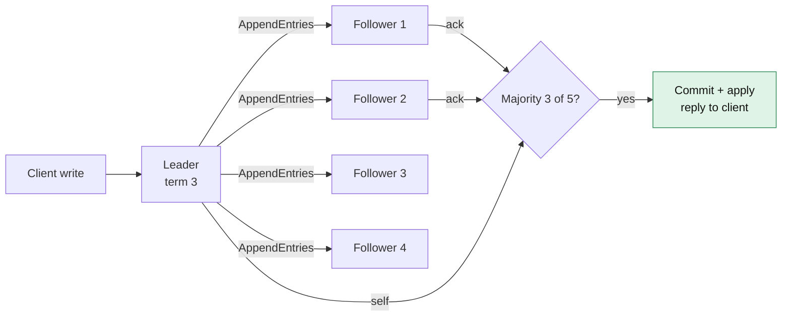
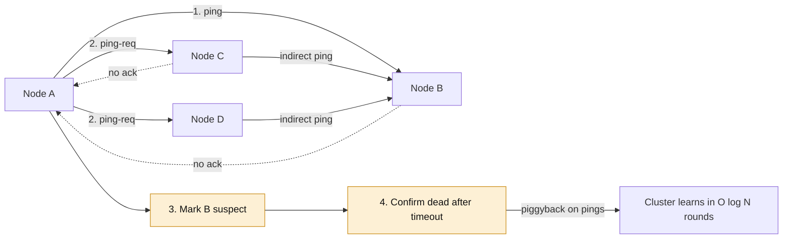
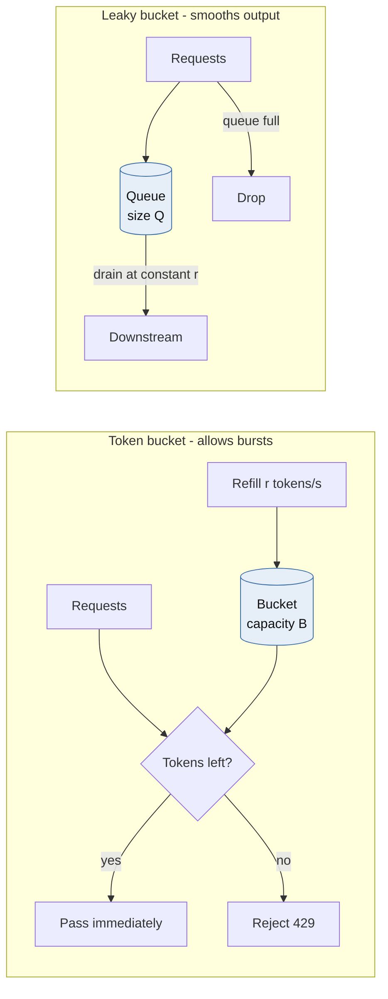
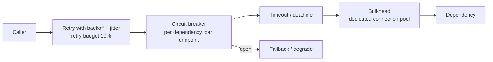
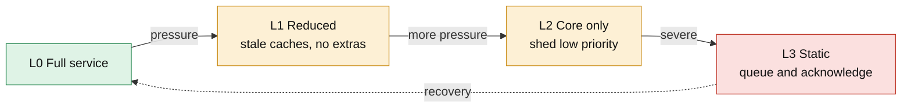
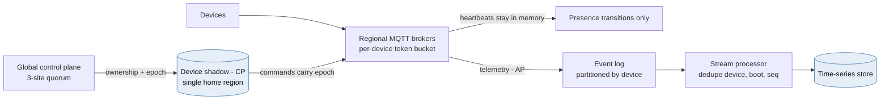
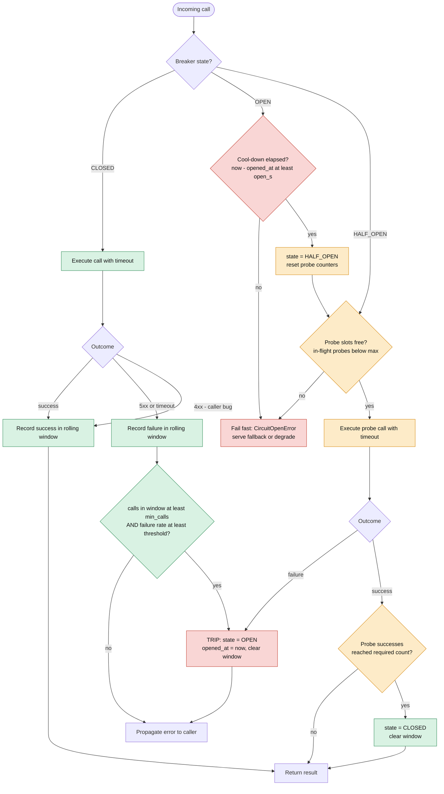

# Module 3 — Distributed Systems Consensus & Resiliency

*Industry: Global SaaS & IoT*

## 3.1 Core Theory & Trade-offs

### Consensus: Raft and Paxos



*[Open full-size diagram: Raft log replication and commit (SVG)](../diagrams/m3-raft-log-replication-and-commit.svg)*

Consensus lets a group of nodes agree on a single ordered log despite crash failures (not Byzantine ones). The **FLP result** says no deterministic protocol can guarantee termination in a fully asynchronous network if even one node may crash. Practical protocols therefore guarantee **safety always** and **liveness only when the network behaves** (partial synchrony, enforced with timeouts).

**Raft in one page:**

- **Roles:** follower, candidate, leader. **Terms** are a monotonically increasing logical clock. Any message carrying a higher term forces the receiver to step down and adopt that term.
- **Election:** a follower that hears no heartbeat within a *randomized* election timeout (150–300 ms in the paper, often 1 s or more in production and WAN deployments) increments its term, votes for itself, and sends `RequestVote`. A node grants at most one vote per term, and **only to a candidate whose log is at least as up-to-date as its own** (compare last log term, then last log index). This *election restriction* guarantees that every elected leader already holds every committed entry.
- **Replication:** the leader sends `AppendEntries` with `(prevLogIndex, prevLogTerm)`. A follower rejects the call if its log doesn't match there, and the leader backs up until the logs agree, overwriting divergent follower entries.
- **Commit:** an entry is committed once it is stored on a majority **and** it belongs to the leader's current term. Older-term entries commit indirectly. This is the subtle "Figure 8" case in the Raft paper, and it is why new leaders append a no-op entry immediately.
- **Quorums:** `n = 2f + 1` tolerates `f` failures. Three nodes tolerate one failure and five tolerate two. **Even cluster sizes add cost without adding tolerance.**
- **Latency:** commit time equals the leader's fsync plus the RTT to the fastest majority. With five voters across three regions, every write pays roughly the RTT to the second-nearest region.
- **Production extensions:**
  - **Pre-vote** stops a node rejoining after a partition from inflating terms and disrupting a healthy leader.
  - **ReadIndex or leader leases** give linearizable reads. Without them, a deposed leader in a minority partition can serve stale reads.
  - **Learners** are non-voting replicas.
  - **Joint consensus** allows safe membership changes.

**Raft vs. Paxos:** Multi-Paxos and Raft are equivalent in power. Raft is a strong-leader design optimized for understandability. Leaderless variants such as EPaxos reduce WAN latency at considerable complexity. **Don't implement consensus.** Use etcd, ZooKeeper (ZAB), Consul, or systems that embed Raft (CockroachDB, TiKV, Kafka KRaft).

**Split brain.** Raft guarantees at most one leader *can commit* per term. It does **not** stop a deposed leader from *believing* it is still leader, or stop *application-level* split brain, such as two regions each accepting writes for the same device. The fix is always the same: attach an **epoch or term to every write**, and have the storage layer reject writes from lower epochs.

### Gossip protocols



*[Open full-size diagram: SWIM failure detection (SVG)](../diagrams/m3-swim-failure-detection.svg)*

**SWIM-style membership:**

- Each protocol period, a node pings one random peer. If there is no ack, it asks *k* other peers to ping that node indirectly (`ping-req`). If there is still no response, the node is marked *suspect* and then *dead* after a timeout.
- Membership updates **piggyback** on pings, so dissemination takes `O(log N)` rounds with constant per-node load.

**Trade-offs:** gossip is probabilistic and eventually consistent, and false positives rise under GC pauses or network jitter. The **phi-accrual detector** (Cassandra, Akka) outputs a continuous suspicion level instead of a binary verdict, letting each subsystem choose its own threshold.

**Rule of thumb:** use gossip for *who is alive and what they advertise*, and consensus for *decisions that must not diverge*. Consul does exactly this: gossip (Serf/memberlist) for membership, and Raft for the service catalog.

### Rate limiting: token bucket vs. leaky bucket



*[Open full-size diagram: Token bucket vs leaky bucket (SVG)](../diagrams/m3-token-bucket-vs-leaky-bucket.svg)*

| Algorithm | Behaviour | Burst handling | State | Typical use |
|---|---|---|---|---|
| **Token bucket** | Bucket of capacity B refills at r tokens/s. A request spends tokens | **Allows bursts** up to B. Long-run rate is r | 2 numbers | API quotas, per-device limits |
| **Leaky bucket (queue)** | Requests enter a queue of size Q, drained at a constant r | **Smooths bursts** into a steady output, and adds queueing delay | Queue | Protecting a fragile downstream that needs a steady rate |
| Leaky bucket (meter) / GCRA | Tracks a "theoretical arrival time" | Mathematically equivalent to a token bucket | 1 number | Telecom, efficient Redis limiters |
| Fixed window | Counter per window | Up to 2× bursts at window edges | 1 counter | Coarse quotas |
| Sliding window log | Timestamps of every request | Exact | O(requests) | Low-volume, high-precision cases |
| Sliding window counter | Weighted blend of two windows | Close approximation | 2 counters | A good general default |

**Distributed rate limiting has three designs:**

1. **Centralized.** A Redis Lua script is atomic and accurate, but adds about a millisecond of RTT and makes Redis a dependency. Decide explicitly whether to **fail open** (protecting a backend) or **fail closed** (billing or abuse quotas).
2. **Local buckets.** Each of N instances enforces r/N locally. This is fast and inaccurate under uneven load balancing.
3. **Hybrid.** Local buckets asynchronously lease quota from a central store.

**Rate limiting is not load shedding.** Rate limits enforce *per-client fairness*. Load shedding is *server self-preservation* driven by the server's own health signals (in-flight concurrency, queue wait time). Adaptive concurrency limits using AIMD or a latency gradient catch overloads that static rate limits miss.

### Circuit breakers



*[Open full-size diagram: Layered resiliency around one dependency call (SVG)](../diagrams/m3-layered-resiliency-around-one-dependency-call.svg)*

A breaker moves through three states:

- **Closed:** calls flow, and outcomes are recorded in a rolling window.
- **Open:** calls fail fast for a cool-down period, and the caller serves a fallback.
- **Half-open:** a limited number of probe calls are admitted. Enough successes close the breaker, and any failure re-opens it.

Design details that decide whether a breaker helps or hurts:

- **Trip on failure *rate* with a minimum call volume.** One failure out of one call is not an outage.
- **Count slow calls as failures.** A dependency that answers in 9 s is down for practical purposes.
- **Classify errors.** 5xx responses and timeouts are failures. 4xx responses are the *caller's* bug and must not trip the breaker.
- **Choose granularity per dependency and per endpoint or shard.** One global breaker in front of a sharded database trips everything when one shard fails.
- **Timeouts are a prerequisite.** Without a deadline, a hung call never "fails", so the breaker never opens.
- **Combine with bulkheads** (separate connection pools per dependency) so one slow dependency cannot exhaust every worker.
- **Retries go *outside* the breaker, with backoff, full jitter and a retry budget.** Three layers retrying three times each is **27× amplification** during an outage. Cap retries at around 10% of traffic.

### Graceful degradation



*[Open full-size diagram: Degradation ladder (SVG)](../diagrams/m3-degradation-ladder.svg)*

Design an explicit **degradation ladder** with product owners *before* the incident:

| Level | Behaviour |
|---|---|
| L0 Full | All features |
| L1 Reduced | Serve stale caches (stale-while-revalidate). Disable recommendations, rich analytics and non-critical enrichment |
| L2 Core only | Critical paths only. Low-priority traffic is shed by priority class |
| L3 Static | Static fallback responses, queue-and-acknowledge writes |

Priority-based shedding needs every request tagged with a criticality class at the edge. Health checks and the control plane come first, safety alarms next, and bulk telemetry last.

## 3.2 Python in Practice: Resiliency Patterns

### Retries with `tenacity`: retry only what's retryable

```python
import httpx
from tenacity import (retry, retry_if_exception, stop_after_attempt,
                      stop_after_delay, wait_exponential_jitter)


def is_retryable(exc: BaseException) -> bool:
    if isinstance(exc, (httpx.ConnectError, httpx.ReadTimeout, httpx.PoolTimeout)):
        return True
    if isinstance(exc, httpx.HTTPStatusError):
        return exc.response.status_code in {429, 502, 503, 504}
    return False   # 4xx is the caller's bug. Retrying just repeats it


@retry(
    retry=retry_if_exception(is_retryable),
    wait=wait_exponential_jitter(initial=0.1, max=5.0, jitter=0.5),
    stop=stop_after_attempt(4) | stop_after_delay(10),   # attempt cap AND deadline
    reraise=True,
)
async def push_device_config(client: httpx.AsyncClient, device_id: str, cfg: dict) -> None:
    # Retrying a mutation is only safe because the server dedupes on the key.
    r = await client.put(f"/devices/{device_id}/config", json=cfg,
                         headers={"Idempotency-Key": cfg["revision_id"]})
    r.raise_for_status()
```

`tenacity` is a retry library, not a circuit breaker. Libraries such as `pybreaker` and `aiobreaker` exist, but a breaker is small enough that owning it pays off in observability and correct async semantics.

### A custom async circuit breaker

```python
import asyncio
import time
from collections import deque
from collections.abc import AsyncIterator, Callable
from contextlib import asynccontextmanager
from enum import Enum, auto


class State(Enum):
    CLOSED = auto()
    OPEN = auto()
    HALF_OPEN = auto()


class CircuitOpenError(RuntimeError):
    pass


class CircuitBreaker:
    def __init__(
        self,
        name: str,
        *,
        window_s: float = 30.0,
        min_calls: int = 20,
        failure_rate: float = 0.5,
        open_s: float = 15.0,
        half_open_probes: int = 3,
        is_failure: Callable[[BaseException], bool] = lambda e: True,
        clock: Callable[[], float] = time.monotonic,
    ) -> None:
        self.name, self._window_s, self._min_calls = name, window_s, min_calls
        self._failure_rate, self._open_s, self._probes = failure_rate, open_s, half_open_probes
        self._is_failure, self._clock = is_failure, clock
        self._events: deque[tuple[float, bool]] = deque()   # (timestamp, failed)
        self._state = State.CLOSED
        self._opened_at = 0.0
        self._probe_inflight = 0
        self._probe_successes = 0
        self._lock = asyncio.Lock()

    @property
    def state(self) -> State:
        return self._state

    async def _admit(self) -> bool:
        """Return True if this call is a half-open probe. Raise if rejected."""
        async with self._lock:
            now = self._clock()
            if self._state is State.OPEN and now - self._opened_at >= self._open_s:
                self._state, self._probe_inflight, self._probe_successes = State.HALF_OPEN, 0, 0
            if self._state is State.OPEN:
                raise CircuitOpenError(self.name)
            if self._state is State.HALF_OPEN:
                if self._probe_inflight >= self._probes:
                    raise CircuitOpenError(self.name)
                self._probe_inflight += 1
                return True
            return False

    def _trip(self) -> None:
        self._state, self._opened_at = State.OPEN, self._clock()
        self._events.clear()

    async def _record(self, probe: bool, failed: bool) -> None:
        async with self._lock:
            if probe:
                if self._state is not State.HALF_OPEN:
                    return                      # stale probe finishing after another state change
                self._probe_inflight -= 1
                if failed:
                    self._trip()
                else:
                    self._probe_successes += 1
                    if self._probe_successes >= self._probes:
                        self._state = State.CLOSED
                        self._events.clear()
                return
            if self._state is not State.CLOSED:
                return                          # a call that started while CLOSED, finishing late
            now = self._clock()
            self._events.append((now, failed))
            while self._events and now - self._events[0][0] > self._window_s:
                self._events.popleft()
            n = len(self._events)
            if n >= self._min_calls and sum(f for _, f in self._events) / n >= self._failure_rate:
                self._trip()

    @asynccontextmanager
    async def guard(self) -> AsyncIterator[None]:
        probe = await self._admit()
        try:
            yield
        except asyncio.CancelledError:
            await self._record(probe, failed=False)   # the caller gave up; that isn't dependency failure
            raise
        except BaseException as exc:
            await self._record(probe, failed=self._is_failure(exc))
            raise
        else:
            await self._record(probe, failed=False)
```

Usage, with a timeout inside the breaker so slow calls count as failures, and a degradation path when it opens:

```python
tsdb_breaker = CircuitBreaker(
    "tsdb-write",
    is_failure=lambda e: isinstance(e, (TimeoutError, httpx.TransportError))
    or (isinstance(e, httpx.HTTPStatusError) and e.response.status_code >= 500),
)


async def write_batch(batch: list[dict]) -> None:
    try:
        async with tsdb_breaker.guard(), asyncio.timeout(0.8):
            await tsdb_client.write(batch)
    except CircuitOpenError:
        await spill_to_local_queue(batch)   # graceful degradation: durable buffer, replay later
```

Each process keeps its own breaker state. Across 200 pods, every pod learns about failures independently, which is usually desirable because each sees its own network path. Sharing state through Redis adds a dependency to the very component meant to survive dependency failures.

### Atomic distributed token bucket (Redis + Lua)

```python
import redis.asyncio as redis

TOKEN_BUCKET = """
local cap  = tonumber(ARGV[1])
local rate = tonumber(ARGV[2])   -- tokens per second
local cost = tonumber(ARGV[3])
local t = redis.call('TIME')      -- the server clock avoids skew between app hosts
local now = tonumber(t[1]) * 1000 + math.floor(tonumber(t[2]) / 1000)
local b = redis.call('HMGET', KEYS[1], 'tokens', 'ts')
local tokens = tonumber(b[1]) or cap
local ts = tonumber(b[2]) or now
tokens = math.min(cap, tokens + math.max(0, now - ts) / 1000.0 * rate)
local allowed = 0
if tokens >= cost then tokens = tokens - cost; allowed = 1 end
redis.call('HSET', KEYS[1], 'tokens', tokens, 'ts', now)
redis.call('PEXPIRE', KEYS[1], math.ceil(cap / rate * 1000) + 1000)
return {allowed, tostring(tokens)}   -- tostring: Lua numbers are truncated to integers on return
"""


class RateLimiter:
    def __init__(self, r: redis.Redis, capacity: float, rate: float) -> None:
        self._script = r.register_script(TOKEN_BUCKET)
        self._cap, self._rate = capacity, rate

    async def allow(self, key: str, cost: float = 1.0) -> bool:
        allowed, _remaining = await self._script(keys=[f"tb:{key}"],
                                                 args=[self._cap, self._rate, cost])
        return bool(int(allowed))
```

## 3.3 Case Study: A Global IoT Telemetry Ingestion Engine



*[Open full-size diagram: IoT - AP data plane, CP control plane (SVG)](../diagrams/m3-iot-ap-data-plane-cp-control-plane.svg)*

**Scenario:** 8M industrial sensors and smart meters across North America, the EU and APAC. Each device sends a heartbeat every 10 s and a telemetry batch every 60 s, and receives configuration and firmware commands. EU device data must stay in the EU. Inter-region links fail occasionally, and regional data centres have experienced partitions in which both sides stay reachable by devices. That is the definition of a split-brain risk.

### Capacity math

| Stream | Rate | Size | Bandwidth |
|---|---|---|---|
| Heartbeats | 8M / 10 s = **800k msg/s** | ~200 B | ~160 MB/s |
| Telemetry | 8M / 60 s = **133k msg/s** | ~1 KB | ~133 MB/s |
| Total | ~930k msg/s | | ~300 MB/s ≈ **26 TB/day** before compression |

### The key decision: pick the CAP position per data type, not per system

| Data | Semantics | Choice | Mechanism |
|---|---|---|---|
| **Telemetry readings** | Append-only facts, commutative | **AP** | Accept anywhere. Dedupe on `(device_id, boot_id, seq)`. Event-time watermarks handle late data |
| **Presence (online/offline)** | Soft state, self-healing | **AP** | In-memory last-seen at the connection broker. Emit *transitions* only |
| **Device shadow / desired config** | Must not diverge | **CP per device** | Single home region per device. Writes carry an **ownership epoch** |
| **Firmware rollout plan** | Global, rare, high-impact | **CP, global** | Consensus-backed control plane plus human approval |
| **Usage metering for billing** | Must reconcile | Eventual + reconciled | Idempotent counters, daily reconciliation |

### Architecture decisions

- **Cells.** Each region runs several independent cells (MQTT broker cluster, stream processor, TSDB shard set). A cell has a bounded device count, so its blast radius is bounded too. Devices are assigned to a *home cell*.
- **Heartbeats never hit a database.** The broker tracks `last_seen` in memory and publishes only `online→offline` and `offline→online` transitions. That turns 800k writes/s into perhaps thousands, which is the single biggest cost reduction in the design.
- **Telemetry path:** MQTT broker (Azure Event Grid MQTT broker, IoT Hub, EMQX or HiveMQ) → Event Hubs/Kafka partitioned by `device_id` → stream processor (dedupe, enrichment, downsampling) → time-series store (Azure Data Explorer, Timescale, or InfluxDB). Raw data lands in ADLS/Parquet.
- **Split-brain handling for the device shadow:**
  - Each device's shadow has exactly one writer, its home region, which holds an ownership lease with an epoch recorded in a regional etcd/Raft store.
  - Moving ownership to another region (a failover) requires a quorum decision in a **global control plane spanning at least three sites**: two regions plus a witness. The side of a partition that lacks quorum **cannot** take ownership.
  - Every shadow write and every command sent to a device carries the epoch. When the partition heals, writes stamped with a lower epoch are rejected, and devices ignore commands with a stale epoch.
  - The isolated minority side stays **fully available for telemetry** (AP), keeps shadows read-only (CP), and buffers commands. Availability is partial but coherent.
- **Reconnect storms.** When a region recovers, millions of devices reconnect at once, and TLS handshakes saturate CPU.
  - **Firmware must implement exponential backoff with full jitter.** This cannot be fixed server-side after shipping, so it is a Day 0 requirement.
  - The broker applies token-bucket admission on `CONNECT` and returns MQTT 5 reason code *Server busy* when over budget.
  - Use TLS session resumption to cut handshake cost.
- **Protecting downstreams:** a per-device token bucket at the broker contains firmware bugs that spam messages. Per-tenant quotas protect shared cells. Circuit breakers sit in front of TSDB writes, spilling to durable Event Hubs retention when the breaker opens, with replay once it closes.
- **Degradation ladder for this system:**
  - L1: broadcast a command that raises the heartbeat interval to 60 s and drops debug-level telemetry.
  - L2: accept only alarm-class messages.
  - L3: devices store and forward from their local buffer. Firmware must support this.

## 3.4 Mermaid: Circuit Breaker State Transitions



*[Open full-size diagram: Circuit breaker state transitions (SVG)](../diagrams/m3-circuit-breaker-state-transitions.svg)*

## 3.5 Animation Blueprint: Raft Leader Election When the Leader Goes Offline

**Scene setup:**

- Five nodes **S1–S5** on a pentagon, each drawn as a circle with a **term badge** (top right), a **role label** below, and an **election-timer ring** around it (an `Arc` driven by a `ValueTracker`).
- Under each node sits a row of small log squares, coloured by term (term 1 grey, term 2 blue, term 3 green) and numbered by index.
- **S1** is the gold leader in term 2. S5's log is shorter (index 5) than the others (index 7).
- A seeded RNG sets the timeouts: S2 = 210 ms, S3 = 170 ms, S4 = 260 ms, S5 = 190 ms, rendered at slow-motion scale.

| Time | Beat | Visual | Manim primitives |
|---|---|---|---|
| 0:00–0:06 | **Steady state** | S1 sends heartbeat dots along its edges every beat. Each follower's timer ring snaps back to full on receipt. Caption: *Heartbeats are empty AppendEntries* | `MoveAlongPath(Dot)`, `ttl.animate.set_value(1)` |
| 0:06–0:08 | **Leader crash** | S1 fades to grey, a red ✕ appears, and heartbeats stop | `FadeToColor`, `Create(Cross)` |
| 0:08–0:12 | **Timers drain** | All four rings drain at their own speeds. A small ms label per node shows the randomized timeout | Per-node `ValueTracker`, `rate_func=linear` with different `run_time` |
| 0:12–0:14 | **S3 times out first** | S3 turns amber and becomes *Candidate*. Its term badge flips 2 → 3. A vote counter `1/5` appears (it votes for itself) | `Transform(badge)`, `Indicate` |
| 0:14–0:18 | **RequestVote** | Envelopes labelled `term=3, lastLogIndex=7, lastLogTerm=2` travel to S2, S4 and S5. Each receiver's term flips to 3 and its ring resets | `LaggedStart(MoveAlongPath)` |
| 0:18–0:21 | **Votes** | S2 and S4 return green ✓ envelopes, and the counter becomes `3/5`. A **majority** banner flashes | `Flash`, `ChangeDecimalToValue` |
| 0:21–0:24 | **New leader** | S3 turns gold, gains the crown and sends heartbeats immediately. Every ring resets | `Transform`, `LaggedStart` |
| 0:24–0:30 | **Commit a no-op** | S3 appends a green term-3 entry at index 8 and replicates it. As acks arrive, a *commitIndex* marker slides to 8 once 3 of 5 hold the entry | `FadeIn(square)`, `MoveToTarget(marker)` |
| 0:30–0:36 | **Inset: why S5 couldn't win** | A picture-in-picture replay shows S5 timing out first with `lastLogIndex=5`. S2, S3 and S4 reply ✕, because a stale log means no vote. Caption: *The election restriction keeps committed entries safe* | `Rectangle` inset, scaled `VGroup` copy |
| 0:36–0:42 | **Old leader returns** | S1 revives, still thinks it is a term-2 leader, and sends `AppendEntries term=2` with an uncommitted entry at index 8. The followers reply `term=3`. S1 flips to *Follower*, its term badge jumps to 3, and its conflicting index-8 entry is struck through in red and replaced by S3's green entry | `Transform`, `Strikethrough`-style `Line`, `ReplacementTransform` |
| 0:42–0:50 | **Bonus: split vote** | New scenario in term 4: S2 and S4 time out together, and each gets 2 votes. Both counters stall at `2/5`, the timers re-randomize, and S4 wins in term 5. Caption: *Randomized timeouts make split votes rare and short* | Parallel `AnimationGroup`s |
| 0:50–1:00 | **Bonus: network partition** | A red dashed line cuts {S1, S2} from {S3, S4, S5}. A client write sent to S1 shows a spinning *pending* ring that never completes (2/5). The majority side commits normally. Caption: *No majority, no commit. Raft prevents split-brain commits, not split-brain beliefs* | `DashedLine`, `Rotate(ring)` loop |

## 3.6 Staff-level Review Questions

- For each data type, have we chosen CP or AP explicitly, and does the product team agree with that choice?
- What stops a region on the losing side of a partition from issuing commands? Point to the specific epoch check.
- What is the worst-case retry amplification across all layers during a full dependency outage?
- Which breaker trips first when one database shard of 32 fails, and does it take the other 31 with it?
- How long does a full reconnect of the largest region take under admission control, and has it been load-tested?

---

[← Back to contents](../README.md)
