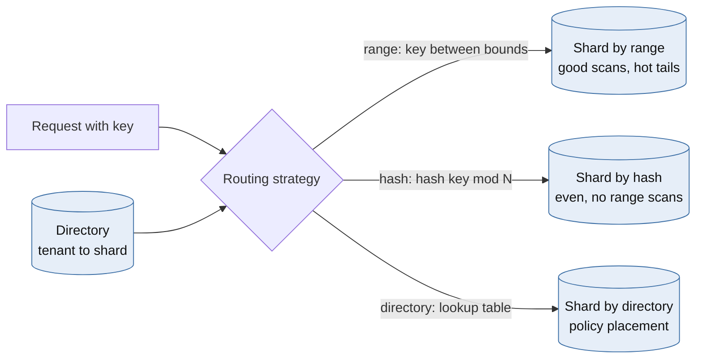
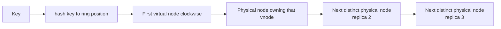
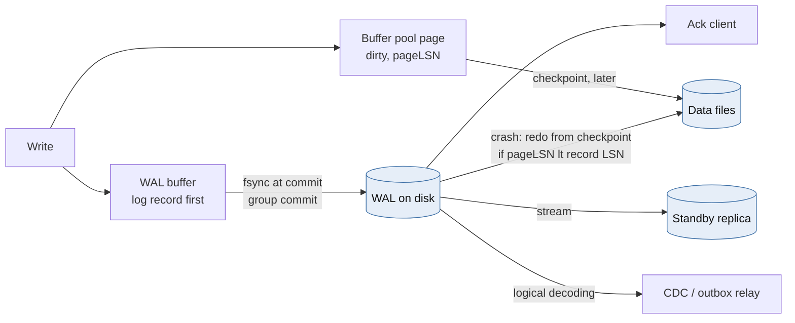
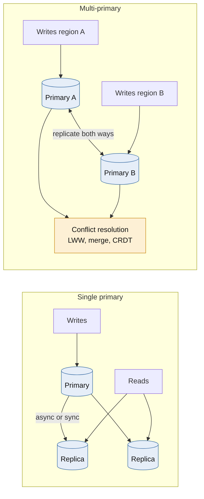
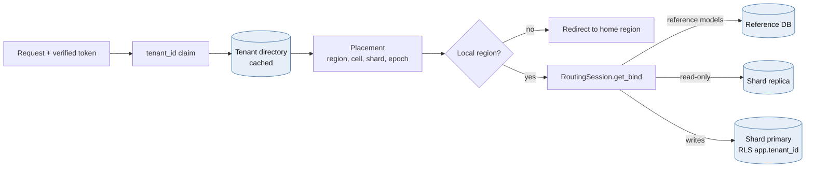
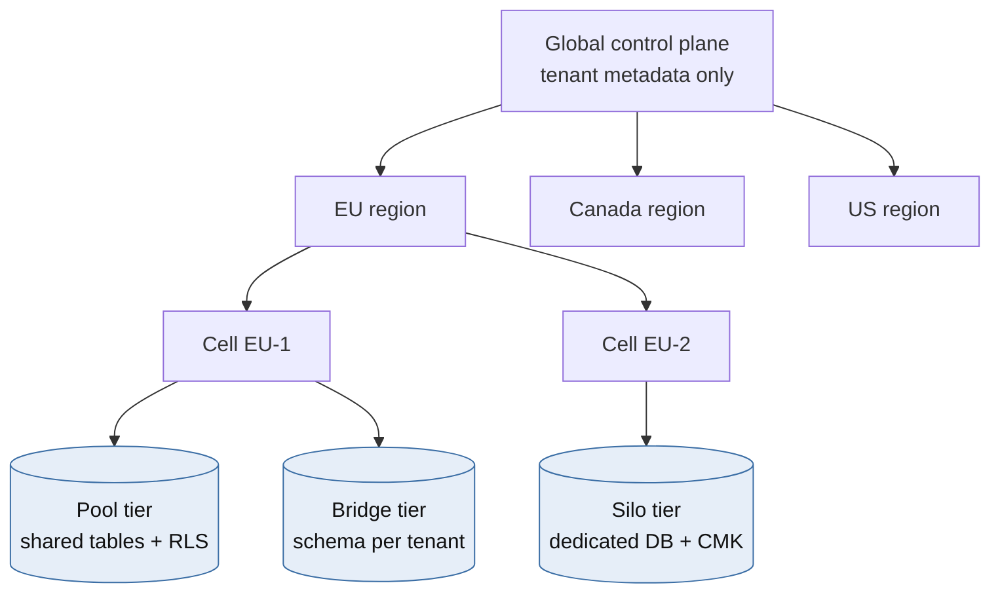
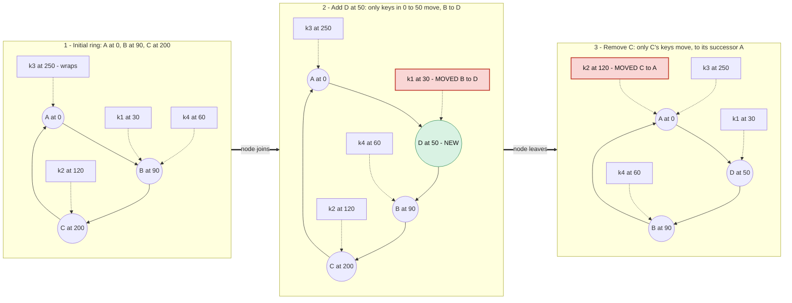
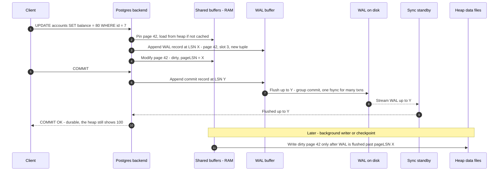

# Module 4 — Cloud-Native Data Partitioning & Storage

*Cross-industry*

## 4.1 Core Theory & Trade-offs

### Sharding strategies



*[Open full-size diagram: Three ways to route a key to a shard (SVG)](../diagrams/m4-three-ways-to-route-a-key-to-a-shard.svg)*

| Strategy | How | Strengths | Weaknesses |
|---|---|---|---|
| **Range** | Contiguous key ranges per shard (Bigtable, HBase, CockroachDB, Spanner) | Efficient range scans. Ranges can be split and merged dynamically | Monotonic keys (timestamps, auto-increment IDs) create a single hot shard |
| **Hash** | `shard = hash(key) mod N` | Even distribution | No range scans. **Changing N remaps nearly every key** |
| **Consistent hash** | Keys and nodes on a hash ring | Adding or removing a node moves only ~1/N of keys | Placement is emergent, so it can't express policy |
| **Directory / lookup** | An explicit `key → shard` table | Arbitrary placement: residency, noisy-neighbour isolation, one-tenant moves | Lookup is on the critical path (so cache it). The directory must be highly available |
| **Geo / entity** | By region or tenant | Aligns with legal and organizational boundaries | Uneven sizes |
| **Composite** | Directory to a cell, hash within the cell | Policy at the top, uniformity underneath | Two layers to operate |

**Shard-key criteria**, in priority order:

1. It keeps the **dominant queries single-shard**.
2. It spreads *load*, not just data. A tenant with 1% of rows can generate 30% of queries.
3. It is high-cardinality and **immutable**. Changing a row's shard key is a cross-shard move.
4. It aligns with **isolation boundaries** such as tenant or jurisdiction.

**The hidden cost is tail latency.** A scatter-gather query waits for its slowest shard. If each shard independently meets a 10 ms p99, then fanning out to 50 shards gives `P(all under p99) = 0.99⁵⁰ ≈ 0.61`. About **39% of queries** will see at least one p99-slow shard. Fan-out queries need hedged requests, partial results, or a separate read model built for the purpose.

Also budget for: cross-shard transactions (sagas, or 2PC inside a distributed SQL engine), global secondary indexes, global uniqueness constraints (email addresses across shards), and resharding.

### Consistent hashing



*[Open full-size diagram: Consistent hashing lookup with virtual nodes and replicas (SVG)](../diagrams/m4-consistent-hashing-lookup-with-virtual-nodes-and-replicas.svg)*

Place nodes and keys on a ring `[0, 2³²)` using a hash. Each key belongs to the first node **clockwise** from it. Adding a node takes over only the arc between it and its predecessor, so about `K/N` keys move instead of nearly all of them.

- **Virtual nodes** (100–256 tokens per physical node) smooth out an uneven ring. They allow **capacity weighting**: a bigger node gets more tokens. When a node fails, its load spreads across many survivors instead of landing entirely on its single clockwise neighbour.
- **Replication:** store each key on the next R *distinct physical* nodes clockwise. This is the Dynamo "preference list".

**Alternatives worth knowing:**

| Scheme | Lookup | Properties | Fit |
|---|---|---|---|
| Ring + vnodes | O(log V) | Flexible membership, needs a token table | Dynamo-style stores, cache clusters |
| **Rendezvous (HRW)** | O(N): `argmax hash(key, node)` | No ring, minimal disruption, trivial weighting | Tens to hundreds of nodes, CDN and cache selection |
| **Jump consistent hash** | O(ln N), no memory | Perfectly even, but buckets can only be added or removed *at the end* | Numbered shards, not arbitrary nodes |
| Bounded-load consistent hashing | O(log V) | Caps any node at (1+ε) × average load | Hot-key-prone caches and load balancers |
| Maglev | O(1) table lookup | Fast, near-even, minimal disruption | L4 load balancers |

**When not to use consistent hashing:** when placement is **policy**. Data residency, "this tenant gets a dedicated database" and "move this noisy tenant off shard 7" are directory decisions. A hash function cannot express law.

### Write-Ahead Logging (WAL)



*[Open full-size diagram: WAL durability and recovery (SVG)](../diagrams/m4-wal-durability-and-recovery.svg)*

**The WAL rule:** a log record describing a change must reach durable storage *before* the modified data page does, and *before* the commit is acknowledged.

- Changes are applied to pages in the **buffer pool**, which makes them *dirty*. Dirty pages are flushed lazily by the background writer and by **checkpoints**.
- A **checkpoint** records a *redo point*: all changes before it are safely in the data files.
- **Crash recovery** replays WAL from the last redo point. For each record, the page is modified only if the on-disk page's **pageLSN is lower than the record's LSN**. This makes redo *idempotent* — the same idea as Module 1, at the storage-engine level.
- ARIES-style engines (SQL Server, InnoDB) also run **undo** for uncommitted transactions. PostgreSQL is effectively **redo-only**: thanks to MVCC, an uncommitted transaction's tuples simply stay invisible because the commit log never marks it committed.

**Why WAL is fast:** it turns random page writes into **sequential appends**. **Group commit** amortizes one `fsync` across many concurrent transactions.

**Knobs and their trade-offs (PostgreSQL):**

| Setting | Effect | Risk |
|---|---|---|
| `synchronous_commit = off` | Acknowledges before the WAL flush, giving much higher throughput | Loses the last few hundred ms of acknowledged transactions on crash. **No corruption**, but RPO > 0 |
| `full_page_writes = on` | Writes a full page image on the first change after a checkpoint | Protects against torn pages. Increases WAL volume |
| Frequent checkpoints | Fast recovery | More I/O and more full-page images |
| Infrequent checkpoints | Less I/O | Longer crash recovery (the RTO grows) |
| `synchronous_standby_names = 'ANY 1 (s1, s2)'` | Quorum synchronous replication | Commit latency includes the standby's flush, but one standby can fail without blocking commits |

**WAL is also the replication stream.** Physical streaming replication ships WAL to standbys. **Logical decoding** turns it into change events for CDC (Debezium), which is exactly the outbox relay from Module 1. The pattern generalizes: in Kafka, "the log *is* the database", and tables are its cached projections. LSM-tree engines (RocksDB, Cassandra) follow the same order: WAL, then memtable, then immutable SSTables, then compaction.

### Read replicas vs. multi-primary replication



*[Open full-size diagram: Single primary vs multi-primary replication (SVG)](../diagrams/m4-single-primary-vs-multi-primary-replication.svg)*

| Model | Writes | Reads | Conflicts | Failure behaviour |
|---|---|---|---|---|
| Single primary + **async** replicas | One node | Scale out, but stale | None | Failover can lose acknowledged writes (RPO > 0) |
| Single primary + **sync/quorum** replicas | One node + standby ack | Scale out | None | RPO 0. Commit latency includes a standby round trip |
| **Multi-primary** (e.g. bidirectional logical replication, Cosmos DB multi-region writes) | Many nodes or regions | Local | **Inevitable** under concurrency: LWW, merge functions, CRDTs | Writes stay available during a partition, and state diverges |
| **Consensus-replicated** (Spanner, CockroachDB) | Per-range Raft leader | Leader, or follower reads with bounded staleness | Prevented by consensus | Needs a majority. Pays cross-region RTT |

**Replica read anomalies and fixes:**

- **Read-your-writes:** return the commit LSN from the write. Read from a replica only if `pg_last_wal_replay_lsn() >= lsn`, otherwise use the primary.
- **Monotonic reads:** pin a session to one replica, or carry the highest LSN seen so far.

**Principal heuristic:** *multi-primary is a conflict-resolution strategy wearing an availability costume.* Last-writer-wins silently discards data and depends on clocks. Prefer **single writer per partition** (each tenant or row has a home) with fast failover. Reserve multi-primary for data with natural merge semantics: counters, sets, presence, carts.

## 4.2 Python in Practice: Tenant-Aware Routing in SQLAlchemy (and Django)



*[Open full-size diagram: Tenant-aware request routing (SVG)](../diagrams/m4-tenant-aware-request-routing.svg)*

The routing design has five parts:

1. **Resolve placement once per request**, asynchronously, from a cached tenant directory.
2. **Pin placement to the session.** Don't re-read ambient state inside `get_bind`, where a background task could change it mid-session.
3. **Refuse cross-region access** at the application layer.
4. **Enforce isolation in the database** with row-level security as defense in depth.
5. **Split reads and writes** where replicas exist.

```python
from __future__ import annotations

from collections.abc import AsyncIterator
from dataclasses import dataclass

from fastapi import Depends, Request
from sqlalchemy import event, text
from sqlalchemy.engine import Engine
from sqlalchemy.ext.asyncio import AsyncEngine, AsyncSession, async_sessionmaker, create_async_engine
from sqlalchemy.orm import DeclarativeBase, Session

LOCAL_REGION = "canadacentral"
REFERENCE_DSN = "postgresql+asyncpg://app@ref-db.canadacentral/ref"   # non-tenant reference data


class GlobalBase(DeclarativeBase):
    """Reference data such as currencies and product catalogue, stored in the regional reference DB."""


class TenantBase(DeclarativeBase):
    """Tenant-owned tables. Every table has tenant_id and an RLS policy."""


@dataclass(frozen=True, slots=True)
class Placement:
    tenant_id: str
    region: str
    cell: str
    primary_dsn: str
    replica_dsn: str | None
    epoch: int            # bumped on every tenant move; used for fencing and cache invalidation


class WrongRegionError(Exception):
    def __init__(self, placement: Placement) -> None:
        super().__init__(f"tenant {placement.tenant_id} lives in {placement.region}")
        self.placement = placement


class TenantDirectory:
    """Control-plane lookup (tenant -> region/cell/shard). Cached, holds no customer content."""

    async def resolve(self, tenant_id: str) -> Placement: ...


_engines: dict[str, AsyncEngine] = {}


def engine_for(dsn: str) -> AsyncEngine:
    if (eng := _engines.get(dsn)) is None:
        # Keep pools small: engines x pool_size x pods adds up fast. Put PgBouncer in front.
        eng = _engines[dsn] = create_async_engine(dsn, pool_size=5, max_overflow=5, pool_pre_ping=True)
    return eng


class RoutingSession(Session):
    """Routes per mapper (reference vs tenant data) and per intent (read vs write)."""

    def get_bind(self, mapper=None, clause=None, **kw) -> Engine:
        if mapper is not None and issubclass(mapper.class_, GlobalBase):
            return engine_for(REFERENCE_DSN).sync_engine
        p: Placement = self.info["placement"]
        if self.info.get("readonly") and p.replica_dsn:
            return engine_for(p.replica_dsn).sync_engine
        return engine_for(p.primary_dsn).sync_engine


@event.listens_for(RoutingSession, "after_begin")
def _bind_rls_tenant(session: Session, transaction, connection) -> None:
    # Transaction-scoped (is_local=true). Safe with PgBouncer transaction pooling.
    # A session-level SET would leak the tenant to the next client of that server connection.
    connection.execute(text("SELECT set_config('app.tenant_id', :t, true)"),
                       {"t": session.info["placement"].tenant_id})


SessionFactory = async_sessionmaker(sync_session_class=RoutingSession, expire_on_commit=False)


async def get_directory() -> TenantDirectory: ...


async def tenant_session(
    request: Request, directory: TenantDirectory = Depends(get_directory)
) -> AsyncIterator[AsyncSession]:
    tenant_id: str = request.state.tenant_id   # from a verified token claim, never from a query param
    placement = await directory.resolve(tenant_id)
    if placement.region != LOCAL_REGION:
        raise WrongRegionError(placement)      # the handler redirects; this region never proxies the data
    readonly = request.method in {"GET", "HEAD"}
    async with SessionFactory(info={"placement": placement, "readonly": readonly}) as session:
        yield session
```

Database-side isolation, in case the application layer ever gets it wrong:

```sql
ALTER TABLE invoices ENABLE ROW LEVEL SECURITY;
ALTER TABLE invoices FORCE ROW LEVEL SECURITY;          -- applies to the table owner too
CREATE POLICY tenant_isolation ON invoices
    USING      (tenant_id = current_setting('app.tenant_id')::uuid)
    WITH CHECK (tenant_id = current_setting('app.tenant_id')::uuid);
-- The application role must NOT be a superuser and must NOT have BYPASSRLS.
```

Trade-offs to state out loud:

- For a single-tenant, request-scoped session, binding the `AsyncSession` directly to the right engine is simpler than overriding `get_bind`. The override earns its place when one session spans **several binds**: reference data versus tenant data, or reads versus writes.
- Read/write splitting by HTTP method is coarse. A `GET` immediately after a `POST` can read a lagging replica. Carry the commit LSN in a cookie or header and fall back to the primary when the replica is behind.
- **Django equivalent:** a database router with `db_for_read` and `db_for_write` that reads the tenant from a `contextvars.ContextVar` set by middleware, plus `DATABASES` entries registered per shard at startup. The same rules apply to RLS and wrong-region checks.

## 4.3 Case Study: A Multi-Tenant B2B SaaS Platform with Data Residency



*[Open full-size diagram: Control plane, regional cells and isolation tiers (SVG)](../diagrams/m4-control-plane-regional-cells-and-isolation-tiers.svg)*

**Requirements:**

- About 4,000 tenants, ranging from 20-seat SMBs to 50,000-seat enterprises (**a 1,000× size spread**).
- EU tenants' data stays in the EU. Canadian public-sector tenants stay in Canada. Everyone else is served from the US.
- Enterprise contracts demand optional dedicated databases and customer-managed keys.
- Horizontal scale, zero-downtime tenant moves, and per-tenant restore.

### Architecture decisions

**1. Global control plane, regional data planes.** The global plane stores only tenant *metadata*: tenant ID, region, cell, plan, residency tag and epoch. It holds no customer content, which is what makes it legally global. It is replicated read-mostly across regions and cached at the edge.

**2. Cells within each region.** A cell is an app tier plus a set of PostgreSQL shards, cache, queue and blob storage. Cells are capped (for example, 500 tenants or 20 TB) so a bad deploy or runaway query has a bounded blast radius. New capacity means new cells, not bigger ones.

**3. Isolation tiers:**

| Tier | Model | Tenant profile | Trade-offs |
|---|---|---|---|
| **Pool** | Shared tables + `tenant_id` + RLS | SMB (the vast majority) | Cheapest, densest. Noisy-neighbour risk. Per-tenant restore is hard |
| **Bridge** | Schema per tenant | Mid-market | Easier per-tenant export. Catalog bloat and migration fan-out at thousands of schemas |
| **Silo** | Dedicated database or server, customer-managed key via Key Vault | Enterprise and regulated | Strongest isolation and a simple per-tenant restore. Most expensive, and fleet upgrades are harder |

**4. Placement uses the directory, not consistent hashing.** With a 1,000× size spread, hash placement guarantees some shards hold three enterprise tenants while others idle. Placement is **bin-packing by observed load**, with residency as a hard constraint. Consistent hashing still has a job *inside* the stack: distributing cache keys across a Redis cluster, and partitioning a single giant tenant's event tables.

**5. Routing and residency enforcement.**

- Tenant subdomains (`acme.app.example`) resolve at the edge to the tenant's region using the cached directory.
- A request that lands in the wrong region gets a **redirect**, never a cross-region data fetch.
- Whether transient in-transit processing is acceptable is a legal question for counsel. Design so that **data at rest never leaves the region**, and so that the application refuses cross-region reads by default (the `WrongRegionError` above).

**6. Zero-downtime tenant moves (pool → silo, or cell → cell):**

1. Snapshot, then run a CDC or logical-replication stream of that tenant's rows to the target.
2. Verify with row counts and checksums per table.
3. Freeze writes briefly (typically seconds). Drain in-flight transactions and let CDC catch up.
4. **Flip the directory entry and increment the epoch.** Writers holding the old epoch are rejected: fencing once again.
5. Invalidate caches keyed by epoch, keep the old copy read-only for a grace period, then purge it and record the purge for audit.

**7. Noisy-neighbour controls:** per-tenant rate limits at the gateway, `statement_timeout` per role, PgBouncer pools per tier, and a query-cost budget. Tenants that keep breaching are *moved*, not throttled forever. Being able to move a tenant is the real scalability feature.

**8. Operational realities:**

- **Schema migrations across ~300 shards** use expand/contract, applied in waves (canary cell first), with a per-shard migration version table. Never run "one big migration".
- **Per-tenant restore in the pool tier:** point-in-time recovery restores a whole database. Restore to a side instance, extract the tenant's rows by `tenant_id`, and merge them back. This is slow, so sell faster restore as part of the silo tier.
- **Analytics** run in a per-region lakehouse. Cross-region reporting uses only aggregated, de-identified data.

**Azure mapping:** Front Door for global routing. Azure Database for PostgreSQL Flexible Server per shard or silo (zone-redundant HA). Key Vault Managed HSM for customer-managed keys. Azure Policy to deny resource creation outside the allowed regions per subscription (a guardrail that holds even when code is wrong). One subscription or management group per regional stamp.

## 4.4 Mermaid: Consistent Hashing Ring — Adding and Removing Nodes

Ring positions run 0–359, and each key belongs to the first node clockwise from it.



*[Open full-size diagram: Consistent hashing ring - adding and removing nodes (SVG)](../diagrams/m4-consistent-hashing-ring-adding-and-removing-nodes.svg)*

With modulo hashing (`hash mod N`), going from 3 to 4 nodes remaps about 75% of keys. Here, one key in four moves in each step. With virtual nodes, the removed node's range would be spread across many successors instead of all falling on A.

The WAL commit path, for reference alongside the animation below:



*[Open full-size diagram: WAL commit path (SVG)](../diagrams/m4-wal-commit-path.svg)*

## 4.5 Animation Blueprint: A Write Updating the WAL Before the Main Database State

**Scene layout (a 2D `Scene` at 1920×1080):**

- **Left:** *Client*, plus two ghost clients that appear later to show group commit.
- **Centre:** the *Postgres backend* process box.
- **Top centre:** a grid of 16 page tiles labelled *Shared buffers (RAM)*.
- **Right centre:** a horizontal *WAL buffer* strip.
- **Bottom right:** *WAL on disk*, drawn as a tape with LSN tick marks.
- **Bottom left:** *Heap data files on disk*, a grid mirroring the RAM tiles.
- **Top right:** an LSN counter.
- **Far right, faded:** a *Sync standby*, used in the final act.

| Time | Beat | Visual | Manim primitives |
|---|---|---|---|
| 0:00–0:03 | **Request** | A SQL card `UPDATE accounts SET balance=80 WHERE id=7` slides from Client to the backend | `MoveToTarget`, `Write` |
| 0:03–0:06 | **Locate page** | Heap tile 42 glows. A copy flies up into the RAM grid (a cache miss). Its label reads `balance=100, pageLSN=0/16B3E80` | `TransformFromCopy`, `Indicate` |
| 0:06–0:10 | **Generate WAL** | A WAL record block `LSN 0/16B3F20: heap update p42 s3` materializes *first* and slides into the WAL buffer. The LSN counter ticks | `FadeIn(shift=RIGHT)`, `ChangeDecimalToValue` |
| 0:10–0:13 | **Modify in memory** | The RAM tile updates to `balance=80`, turns orange (*dirty*) and is re-stamped `pageLSN=0/16B3F20`. A padlock icon with a thin line ties the tile to the WAL record. Caption: *This page may not reach disk until the WAL up to its LSN does* | `Transform`, `set_fill(ORANGE)`, `Line` |
| 0:13–0:16 | **COMMIT** | The client sends `COMMIT`. A commit record joins the buffer. Two ghost clients add their own commit records alongside it | `LaggedStart(FadeIn)` |
| 0:16–0:20 | **Group commit fsync** | The three records slide as one group onto the disk tape. A single **fsync** flash fires and a disk LED blinks once. Caption: *One fsync, three durable commits* | `AnimationGroup`, `Flash`, `ShowPassingFlash` along the tape |
| 0:20–0:23 | **Acknowledge** | `COMMIT OK` returns to all three clients. The heap tile at bottom left **still shows `balance=100`**. Caption: *Durable is not the same as written to the data file* | `Indicate(heap_tile, color=YELLOW)` |
| 0:23–0:28 | **Checkpoint** (fast-forward) | A clock spins. The checkpointer sweeps the RAM grid, dirty tiles flow down into the heap grid (random writes, drawn as scattered arrows) and turn white. A `CHECKPOINT redo=…` marker drops onto the WAL tape | `Rotate(clock_hand)`, `LaggedStart(TransformFromCopy)` |
| 0:28–0:30 | **Rewind** | Rewind to 0:23 (after the ack, before the checkpoint) | Reverse `ValueTracker` or `Restore` |
| 0:30–0:33 | **Crash** | A lightning bolt strikes. The RAM grid shatters into fragments and fades: *shared buffers lost*. The disk tape and the heap survive | `Create(lightning)`, `ShrinkToCenter` on fragments |
| 0:33–0:40 | **Redo recovery** | A *startup process* cursor jumps to the last checkpoint's redo point on the tape and scans forward. At record `0/16B3F20`, it looks up heap page 42 and shows a comparison bubble: `pageLSN 0/16B3E80 < 0/16B3F20 → REPLAY`. The page reloads into RAM and becomes `balance=80`. A second record whose page is already newer shows `pageLSN ≥ record LSN → SKIP` | `MoveAlongPath(cursor)`, comparison `MathTex`, `Transform` |
| 0:40–0:44 | **Uncommitted work** | A third, uncommitted transaction's record is also replayed, but the commit-log (CLOG) panel marks it *in progress → aborted*, so its tuple renders greyed-out and invisible. Caption: *PostgreSQL needs no undo: MVCC hides it* | `set_opacity(0.25)`, CLOG `Table` update |
| 0:44–0:52 | **Replication** (bonus) | Replay the commit with the standby lit. The WAL stream flows to the standby's own tape, and the client's `COMMIT OK` arrow waits at a gate until the standby's `flushed up to Y` ack returns. A latency meter shows the extra RTT | `ShowPassingFlash`, gate `Rectangle` sliding open |
| 0:52–0:56 | **Recap** | Three stacked rules: *1. Log before data. 2. Flush log before ack. 3. Redo is idempotent via pageLSN* | `Write`, `LaggedStart` |

## 4.6 Staff-level Review Questions

- Which queries fan out across shards, and what is their p99 under a single slow shard?
- Can we move one tenant between cells today, and how long is the write freeze?
- What prevents a request in the EU region from reading a Canadian tenant's rows: code, the network, policy, or all three?
- What is our actual RPO, for each database, under the current `synchronous_commit` and standby configuration?
- If the tenant directory is unavailable for 10 minutes, what still works?

---

[← Back to contents](../README.md)
