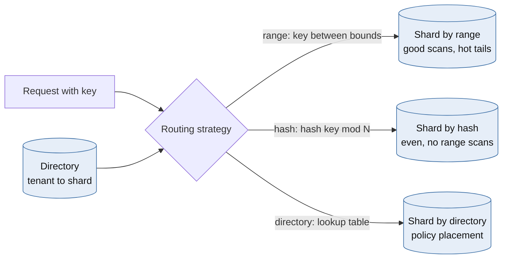
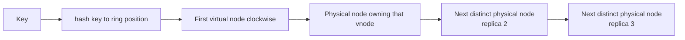
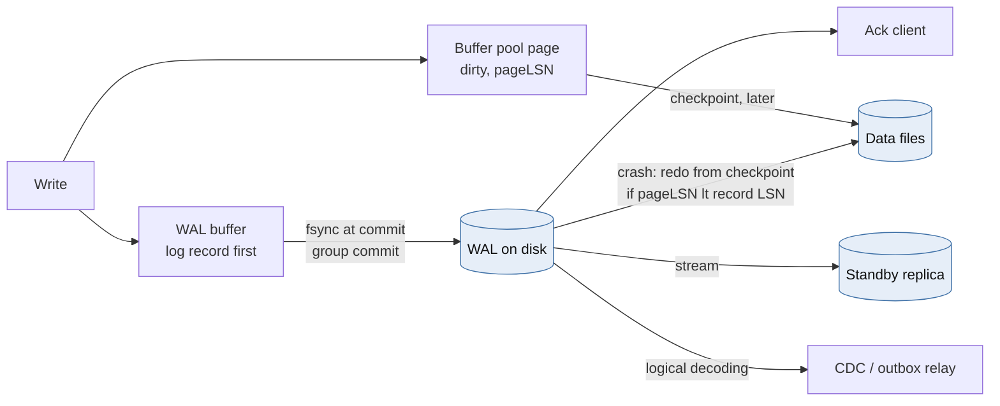
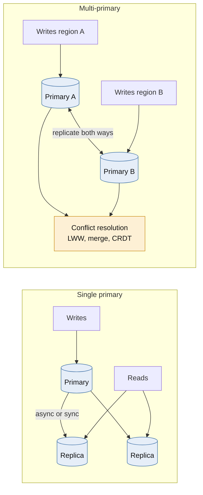
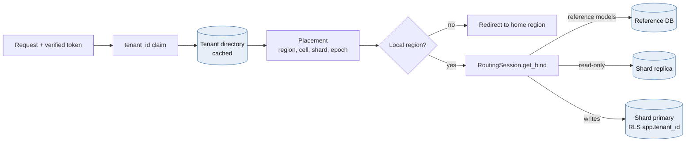
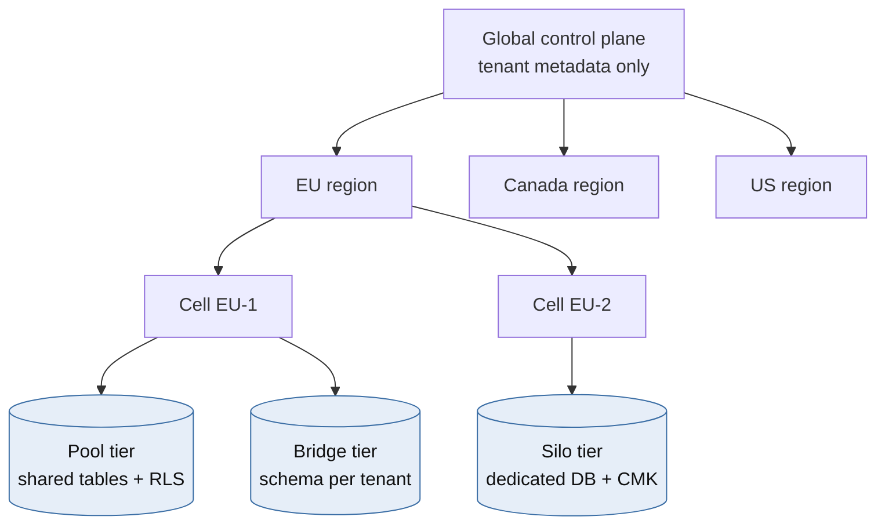
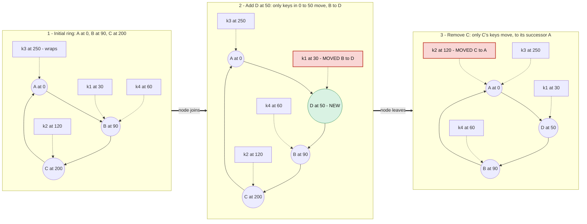
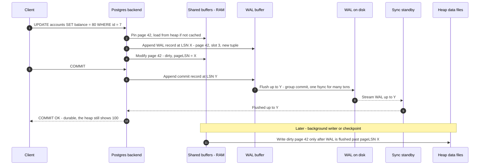

# Module 4 — Cloud-Native Data Partitioning & Storage

*Cross-industry*

## 4.1 Ideas & Trade-offs

### Sharding strategies



*[Open full-size diagram: Three ways to route a key to a shard (SVG)](../diagrams/m4-three-ways-to-route-a-key-to-a-shard.svg)*

**In plain words:** when data is too big or too busy for one database, you split it into **shards**. Each shard holds part of the data on its own machine. The big question is how to decide which shard each row belongs to.

| Strategy | How | Good | Bad |
|---|---|---|---|
| **Range** | Each shard holds a range of keys (A–F, G–M…) | Fast range scans. Ranges can be split as they grow | Keys that always increase (timestamps, auto-increment IDs) all land on the last shard |
| **Hash** | `shard = hash(key) mod N` | Spreads data evenly | No range scans. **Changing N moves almost every key** |
| **Consistent hash** | Keys and servers placed on a ring | Adding or removing a server moves only about 1/N of keys | You can't choose where a specific key goes |
| **Directory (lookup table)** | A table says which shard each key is on | Full control: keep data in the right country, move one busy customer | The lookup happens on every request (cache it). The table must always be available |
| **By region or customer** | Split by country or tenant | Matches legal and business boundaries | Shards can be very different sizes |
| **Mixed** | A directory picks the group, a hash picks the shard inside it | Rules at the top, even spread underneath | Two layers to manage |

**How to choose a shard key**, most important first:

1. The **most common queries** should need only **one shard**.
2. It should spread the *load*, not just the data. A customer with 1% of the rows can make 30% of the queries.
3. It should have many distinct values and **never change**. Changing a row's shard key means moving it to another shard.
4. It should match **isolation boundaries**, such as customer or country.

**The hidden cost: slow queries that touch every shard.** A query that asks all shards must wait for the slowest one. If each shard is fast 99% of the time, a query touching 50 shards is fast on all of them only `0.99⁵⁰ ≈ 61%` of the time, so **about 39% of these queries** hit at least one slow shard. Queries that fan out need tricks: sending a backup request, returning partial results, or a separate read model built for that query.

Also plan for: transactions across shards (sagas, or a distributed SQL database), indexes that cover all shards, uniqueness across shards (for example, unique email addresses), and moving data between shards.

### Consistent hashing



*[Open full-size diagram: Consistent hashing lookup with virtual nodes and replicas (SVG)](../diagrams/m4-consistent-hashing-lookup-with-virtual-nodes-and-replicas.svg)*

**In plain words:** imagine a clock face. Servers and keys are both placed on it using a hash. Each key belongs to the next server **clockwise**. When a server is added, it takes over only the keys between itself and the server before it, about `K/N` keys, not nearly all of them.

- **Virtual nodes:** each real server appears at 100–256 spots on the ring. This evens out the spread, lets bigger servers take more spots, and when a server dies its load spreads over many servers instead of landing on its one neighbour.
- **Copies:** store each key on the next R *different real servers* clockwise. This is how Amazon's Dynamo did it.

**Other options worth knowing:**

| Method | Lookup cost | Properties | Best for |
|---|---|---|---|
| Ring + virtual nodes | Fast (a binary search) | Flexible membership. Needs a token table | Dynamo-style databases, cache clusters |
| **Rendezvous (HRW)** | Checks every server: pick the highest `hash(key, server)` | No ring, little movement, easy weighting | Tens to hundreds of servers, CDNs, caches |
| **Jump hash** | Very fast, no memory | Perfectly even, but you can only add or remove servers *at the end* | Numbered shards |
| Bounded-load hashing | Fast | Caps each server at slightly above average load | Caches with hot keys, load balancers |
| Maglev | A single table lookup | Fast, nearly even, little movement | Network load balancers |

**When *not* to use consistent hashing:** when placement is a **rule**. "This customer's data must stay in Canada", "this customer gets its own database" and "move this noisy customer off shard 7" are lookup-table decisions. A hash function can't follow the law.

### Write-Ahead Logging (WAL)



*[Open full-size diagram: WAL durability and recovery (SVG)](../diagrams/m4-wal-durability-and-recovery.svg)*

**In plain words:** before a database changes its main data, it first writes a note in a log file saying what it's about to change. If it crashes, it reads the log to finish or redo the changes. That's why a committed transaction survives a power cut.

**The WAL rule:** the log entry must be safely on disk *before* the changed data page is written, and *before* the database tells the client "committed".

- Changes are first made to data pages in memory (the **buffer pool**), which marks those pages *dirty*. Dirty pages are written to disk later, in the background and during **checkpoints**.
- A **checkpoint** records a safe point: everything before it is in the data files.
- **Crash recovery** replays the log from the last checkpoint. A page is changed only if its stored log number (pageLSN) is **lower** than the log entry's number. So replaying twice is harmless: recovery is *idempotent*, the same idea as in Module 1.
- Some databases (SQL Server, MySQL InnoDB) also **undo** unfinished transactions. PostgreSQL doesn't need to: unfinished transactions are simply never marked as committed, so their rows stay invisible (thanks to MVCC).

**Why it's fast:** adding to the end of a log file is much faster than writing pages all over the disk. **Group commit** saves many transactions with one disk sync.

**PostgreSQL settings and their trade-offs:**

| Setting | Effect | Risk |
|---|---|---|
| `synchronous_commit = off` | Replies "committed" before the log is on disk. Much faster | A crash loses the last few hundred ms of "committed" transactions. **No corruption**, but some data loss |
| `full_page_writes = on` | Writes a full page copy the first time a page changes after a checkpoint | Protects against half-written pages. Bigger log |
| Frequent checkpoints | Faster recovery | More disk work |
| Rare checkpoints | Less disk work | Slower recovery after a crash |
| `synchronous_standby_names = 'ANY 1 (s1, s2)'` | Waits for one of two standbys to confirm | Commits wait for a standby, but one standby can fail without blocking |

**The WAL is also how replicas stay updated.** Streaming replication sends the WAL to standby servers. **Logical decoding** turns it into change events for CDC tools (Debezium). That's exactly the outbox relay from Module 1. The general idea: "the log *is* the database", and tables are just a cached result of it. Write-optimized databases (RocksDB, Cassandra) follow the same order: log first, then memory, then files on disk.

### Read replicas vs. multi-primary replication



*[Open full-size diagram: Single primary vs multi-primary replication (SVG)](../diagrams/m4-single-primary-vs-multi-primary-replication.svg)*

| Model | Writes | Reads | Conflicts | When things fail |
|---|---|---|---|---|
| One primary + **async** replicas | One server | Many servers, slightly behind | None | Failover can lose recently confirmed writes |
| One primary + **sync** replicas | One server + a standby confirmation | Many servers | None | No data loss. Each commit waits for the standby |
| **Multi-primary** (several servers or regions accept writes) | Many | Local | **Will happen**. Need a rule: newest wins, merge, or CRDTs | Keeps accepting writes during a split, and data drifts apart |
| **Consensus-based** (Spanner, CockroachDB) | One leader per data range | Leader, or followers with a known delay | Prevented | Needs a majority. Slower across regions |

**Common replica problems and fixes:**

- **Not seeing your own write:** after writing, remember the database log position. Read from a replica only if it has caught up to that position (`pg_last_wal_replay_lsn()`), otherwise read from the primary.
- **Going back in time:** keep a user on one replica, or remember the newest position they've seen.

**Rule of thumb:** *multi-primary sounds like "always available", but it's really a conflict-resolution problem.* "Newest write wins" quietly throws away data and depends on clocks. Prefer **one writer per piece of data** (each customer or row has a home), with fast failover. Use multi-primary only for data that merges naturally: counters, sets, online status, shopping carts.

## 4.2 Python: Routing Each Customer to the Right Database in SQLAlchemy (and Django)



*[Open full-size diagram: Tenant-aware request routing (SVG)](../diagrams/m4-tenant-aware-request-routing.svg)*

How the routing works:

1. **Look up where the customer's data lives, once per request**, from a cached tenant directory.
2. **Save that location on the session**, so a background task can't accidentally change it halfway through.
3. **Refuse to read another region's data** in the application.
4. **Let the database enforce isolation too**, with row-level security, as a second safety net.
5. **Send reads and writes to different servers** where replicas exist.

```python
from __future__ import annotations

from collections.abc import AsyncIterator
from dataclasses import dataclass

from fastapi import Depends, Request
from sqlalchemy import event, text
from sqlalchemy.engine import Engine
from sqlalchemy.ext.asyncio import AsyncEngine, AsyncSession, async_sessionmaker, create_async_engine
from sqlalchemy.orm import DeclarativeBase, Session

LOCAL_REGION = "canadacentral"
REFERENCE_DSN = "postgresql+asyncpg://app@ref-db.canadacentral/ref"   # non-tenant reference data


class GlobalBase(DeclarativeBase):
    """Reference data such as currencies and product catalogue, stored in the regional reference DB."""


class TenantBase(DeclarativeBase):
    """Tenant-owned tables. Every table has tenant_id and an RLS policy."""


@dataclass(frozen=True, slots=True)
class Placement:
    tenant_id: str
    region: str
    cell: str
    primary_dsn: str
    replica_dsn: str | None
    epoch: int            # bumped on every tenant move; used for fencing and cache invalidation


class WrongRegionError(Exception):
    def __init__(self, placement: Placement) -> None:
        super().__init__(f"tenant {placement.tenant_id} lives in {placement.region}")
        self.placement = placement


class TenantDirectory:
    """Control-plane lookup (tenant -> region/cell/shard). Cached, holds no customer content."""

    async def resolve(self, tenant_id: str) -> Placement: ...


_engines: dict[str, AsyncEngine] = {}


def engine_for(dsn: str) -> AsyncEngine:
    if (eng := _engines.get(dsn)) is None:
        # Keep pools small: engines x pool_size x pods adds up fast. Put PgBouncer in front.
        eng = _engines[dsn] = create_async_engine(dsn, pool_size=5, max_overflow=5, pool_pre_ping=True)
    return eng


class RoutingSession(Session):
    """Routes per mapper (reference vs tenant data) and per intent (read vs write)."""

    def get_bind(self, mapper=None, clause=None, **kw) -> Engine:
        if mapper is not None and issubclass(mapper.class_, GlobalBase):
            return engine_for(REFERENCE_DSN).sync_engine
        p: Placement = self.info["placement"]
        if self.info.get("readonly") and p.replica_dsn:
            return engine_for(p.replica_dsn).sync_engine
        return engine_for(p.primary_dsn).sync_engine


@event.listens_for(RoutingSession, "after_begin")
def _bind_rls_tenant(session: Session, transaction, connection) -> None:
    # Transaction-scoped (is_local=true). Safe with PgBouncer transaction pooling.
    # A session-level SET would leak the tenant to the next client of that server connection.
    connection.execute(text("SELECT set_config('app.tenant_id', :t, true)"),
                       {"t": session.info["placement"].tenant_id})


SessionFactory = async_sessionmaker(sync_session_class=RoutingSession, expire_on_commit=False)


async def get_directory() -> TenantDirectory: ...


async def tenant_session(
    request: Request, directory: TenantDirectory = Depends(get_directory)
) -> AsyncIterator[AsyncSession]:
    tenant_id: str = request.state.tenant_id   # from a verified token claim, never from a query param
    placement = await directory.resolve(tenant_id)
    if placement.region != LOCAL_REGION:
        raise WrongRegionError(placement)      # the handler redirects; this region never proxies the data
    readonly = request.method in {"GET", "HEAD"}
    async with SessionFactory(info={"placement": placement, "readonly": readonly}) as session:
        yield session
```

Database-side safety net, in case the app ever gets it wrong:

```sql
ALTER TABLE invoices ENABLE ROW LEVEL SECURITY;
ALTER TABLE invoices FORCE ROW LEVEL SECURITY;          -- applies to the table owner too
CREATE POLICY tenant_isolation ON invoices
    USING      (tenant_id = current_setting('app.tenant_id')::uuid)
    WITH CHECK (tenant_id = current_setting('app.tenant_id')::uuid);
-- The application role must NOT be a superuser and must NOT have BYPASSRLS.
```

Trade-offs to say out loud:

- For a simple one-customer-per-request session, binding the session directly to the right engine is simpler than overriding `get_bind`. The override is worth it when one session uses **several databases**: shared reference data plus customer data, or reads plus writes.
- Choosing replica vs. primary by HTTP method is rough. A `GET` right after a `POST` may read a replica that's behind. Send the commit position in a cookie or header, and use the primary if the replica hasn't caught up.
- **In Django:** a database router with `db_for_read` and `db_for_write` that reads the current customer from a `contextvars.ContextVar` set by middleware, plus one `DATABASES` entry per shard. The same row-level security and region checks apply.

## 4.3 Case Study: A Multi-Tenant B2B SaaS Platform with Data Residency



*[Open full-size diagram: Control plane, regional cells and isolation tiers (SVG)](../diagrams/m4-control-plane-regional-cells-and-isolation-tiers.svg)*

**Requirements:**

- About 4,000 customers, from 20-person companies to 50,000-person enterprises. That's **1,000 times** difference in size.
- EU customers' data must stay in the EU, Canadian public-sector data in Canada, and everyone else's in the US.
- Enterprise contracts can require a dedicated database and encryption keys the customer controls.
- It must grow by adding machines, move a customer without downtime, and restore one customer's data on its own.

### Design decisions

**1. One global control system, separate regional data systems.** The global part stores only *information about* customers: ID, region, cell, plan, residency rule and epoch. It stores **no customer content**, which is why it's allowed to be global. It's copied to every region and cached at the edge.

**2. Cells inside each region.** A cell is a complete set: app servers, several PostgreSQL shards, a cache, a queue and file storage. Each cell has a size limit (say 500 customers or 20 TB), so a bad deploy or runaway query affects only that cell. To grow, you add cells, not bigger cells.

**3. Isolation levels:**

| Level | How | For | Trade-offs |
|---|---|---|---|
| **Pool** | Shared tables with a `tenant_id` column and row-level security | Small customers (most of them) | Cheapest and densest. Noisy neighbours are possible. Restoring one customer is hard |
| **Bridge** | A separate schema per customer | Mid-size | Easier to export one customer. Gets unwieldy with thousands of schemas |
| **Silo** | A dedicated database or server, with the customer's own key in Key Vault | Enterprise and regulated customers | Strongest isolation and easy restores. Most expensive, and harder to upgrade everywhere |

**4. Use the lookup table, not consistent hashing, to place customers.** With 1,000× size differences, hashing would put three giants on one shard while others sit idle. Placement is **packing by actual load**, with residency as a strict rule. Consistent hashing still has jobs *inside* the system: spreading cache keys across Redis, and splitting one giant customer's event tables.

**5. Routing and keeping data in its country:**

- Customer subdomains (`acme.app.example`) are sent to the right region at the edge, using the cached directory.
- A request that reaches the wrong region gets a **redirect**, never a cross-region data fetch.
- Whether data may briefly pass through another country is a legal question for your lawyers. Design so that **stored data never leaves its region**, and the app refuses cross-region reads by default (the `WrongRegionError` in the code above).

**6. Moving a customer without downtime** (from pool to silo, or between cells):

1. Copy a snapshot, then stream that customer's ongoing changes to the new location.
2. Check that row counts and checksums match for each table.
3. Pause the customer's writes briefly (usually seconds), and let the change stream catch up.
4. **Switch the directory entry and increase the epoch.** Writers still using the old epoch are rejected. That's fencing again.
5. Clear caches, keep the old copy read-only for a while, then delete it and record the deletion for auditors.

**7. Noisy neighbour controls:** per-customer rate limits, query time limits (`statement_timeout`), connection limits per tier (PgBouncer), and query cost budgets. Customers who keep breaking limits are *moved*, not throttled forever. Being able to move customers is the real scaling feature.

**8. Operational realities:**

- **Schema changes across ~300 shards:** add the new structure first and remove the old one later (expand/contract), in waves (a test cell first), with a migration version table per shard. Never run one big migration.
- **Restoring one customer in the pool tier:** point-in-time recovery restores the whole database. So restore to a side server, copy out that customer's rows, and merge them back. It's slow, which is a good reason to sell faster restores with the silo tier.
- **Reports** run in a data lake per region. Reports across regions use only totals, with nothing that identifies a person.

**Azure services:** Front Door for global routing. Azure Database for PostgreSQL Flexible Server per shard or silo (zone-redundant HA). Key Vault Managed HSM for customer-controlled keys. Azure Policy to block creating resources outside the allowed regions (a safety net that works even when code is wrong). One subscription or management group per region.

## 4.4 Diagram: Consistent Hashing Ring — Adding and Removing Nodes

Ring positions run from 0 to 359, and each key belongs to the next server clockwise.



*[Open full-size diagram: Consistent hashing ring - adding and removing nodes (SVG)](../diagrams/m4-consistent-hashing-ring-adding-and-removing-nodes.svg)*

With `hash mod N`, going from 3 to 4 servers moves about 75% of keys. Here, only one key in four moves at each step. With virtual nodes, a removed server's keys would be spread over many servers instead of all going to A.

The WAL write path, to go with the animation below:



*[Open full-size diagram: WAL commit path (SVG)](../diagrams/m4-wal-commit-path.svg)*

## 4.5 Animation Plan: A Write Saved to the WAL Before the Main Data

**Scene (2D, 1920×1080):**

- **Left:** a *Client*, plus two faint extra clients that appear later to show group commit.
- **Centre:** the *Postgres backend* process box.
- **Top centre:** a grid of 16 page tiles labelled *Shared buffers (RAM)*.
- **Right centre:** a *WAL buffer* strip.
- **Bottom right:** *WAL on disk*, drawn as a tape with log number (LSN) marks.
- **Bottom left:** *Data files on disk*, a grid matching the RAM tiles.
- **Top right:** an LSN counter.
- **Far right, faded:** a *Sync standby*, used at the end.

| Time | Step | What you see | Manim tools |
|---|---|---|---|
| 0:00–0:03 | **Request** | A card saying `UPDATE accounts SET balance=80 WHERE id=7` slides from Client to the backend | `MoveToTarget`, `Write` |
| 0:03–0:06 | **Find the page** | Disk tile 42 glows, and a copy flies up into RAM (it wasn't cached). It shows `balance=100, pageLSN=0/16B3E80` | `TransformFromCopy`, `Indicate` |
| 0:06–0:10 | **Write the log entry first** | A log block `LSN 0/16B3F20: update page 42 slot 3` appears *first* and slides into the WAL buffer. The LSN counter goes up | `FadeIn`, counter change |
| 0:10–0:13 | **Change the page in memory** | The RAM tile changes to `balance=80`, turns orange (*dirty*) and is stamped `pageLSN=0/16B3F20`. A padlock links it to the log entry. Caption: *This page can't go to disk until its log entry does* | `Transform`, orange fill, `Line` |
| 0:13–0:16 | **COMMIT** | The client sends `COMMIT` and a commit entry joins the buffer. The two extra clients add their own commit entries alongside | `LaggedStart(FadeIn)` |
| 0:16–0:20 | **One disk sync for all three** | The three entries slide together onto the disk tape, one **fsync** flash fires, and a disk light blinks once. Caption: *One sync, three safe commits* | `AnimationGroup`, `Flash` |
| 0:20–0:23 | **Reply** | `COMMIT OK` goes back to all three clients. The disk tile at bottom left **still says `balance=100`**. Caption: *Safe doesn't mean written to the data file yet* | Yellow `Indicate` on the disk tile |
| 0:23–0:28 | **Checkpoint** (fast forward) | A clock spins. The checkpointer sweeps the RAM grid, dirty tiles flow down to the disk grid (scattered arrows) and turn white. A `CHECKPOINT` marker drops onto the tape | Rotating hand, `LaggedStart` |
| 0:28–0:30 | **Rewind** | Rewind to 0:23 (after the reply, before the checkpoint) | `Restore` |
| 0:30–0:33 | **Crash** | Lightning strikes. The RAM grid shatters and fades: *memory lost*. The disk tape and data files survive | Lightning, shrinking fragments |
| 0:33–0:40 | **Recovery** | A cursor jumps to the last checkpoint on the tape and moves forward. At entry `0/16B3F20` it checks disk page 42: `pageLSN 0/16B3E80 < 0/16B3F20 → REPLAY`. The page reloads and becomes `balance=80`. Another entry, whose page is already newer, shows `→ SKIP` | Moving cursor, comparison text, `Transform` |
| 0:40–0:44 | **Unfinished work** | A third, uncommitted transaction's entry is replayed too, but the commit-status panel shows it was never committed. Its row appears greyed out and invisible. Caption: *PostgreSQL needs no undo step: MVCC hides it* | Low opacity, status table update |
| 0:44–0:52 | **Replica** (bonus) | Replay the commit with the standby shown. The log flows to the standby's tape, and the client's `COMMIT OK` waits at a gate until the standby confirms. A meter shows the extra wait | `ShowPassingFlash`, sliding gate |
| 0:52–0:56 | **Summary** | Three rules: *1. Log before data. 2. Save the log before replying. 3. Replay is safe to repeat, thanks to pageLSN* | `Write`, `LaggedStart` |

## 4.6 Review Questions

- Which queries touch every shard, and how slow are they when one shard is slow?
- Can we move one customer between cells today? How long are their writes paused?
- What stops a request in the EU region from reading a Canadian customer's data: code, the network, cloud policy, or all three?
- For each database, how much data could we actually lose with the current commit and standby settings?
- If the customer directory is down for 10 minutes, what still works?

---

[← Back to contents](../README.md)
