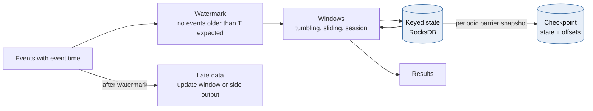
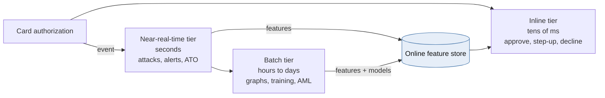
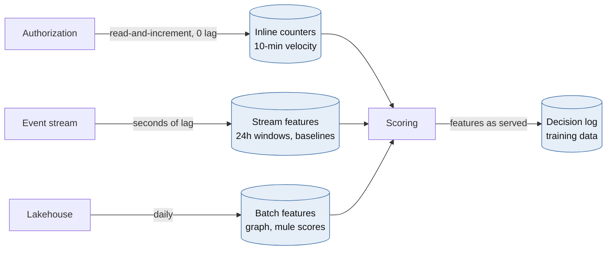
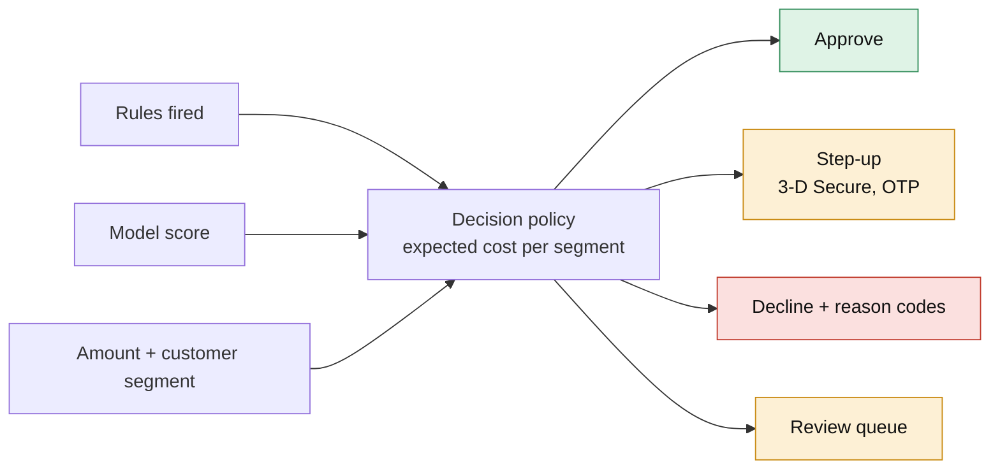
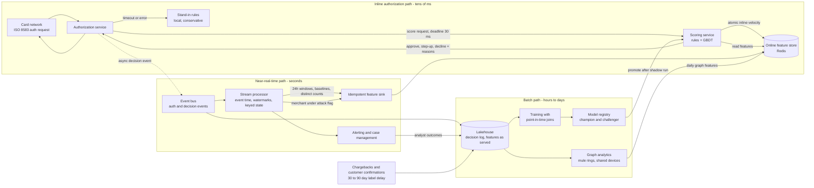

# Module 5 — Real-Time Streaming & Fraud Detection

*Industry: Card Issuing, Payments & Retail Banking*

## 5.1 Core Theory & Trade-offs

### Stream processing fundamentals



*[Open full-size diagram: Event-time stream processing (SVG)](../diagrams/m5-event-time-stream-processing.svg)*

**Event time vs. processing time.** *Event time* is when the card was swiped. *Processing time* is when your operator sees the event. They diverge because of network delay, retries, mobile devices that were offline, and partition rebalances. Fraud features must be computed on **event time**. Otherwise a burst that arrives late looks spread out, and a backlog replay looks like a burst.

**Watermarks** are the stream's estimate that "no events older than T are still coming". They trade **latency against completeness**:

- An *aggressive* watermark (small allowed delay) emits results quickly and drops or mishandles more late events.
- A *conservative* watermark is more complete but slower.
- Events that arrive after the watermark go to an **allowed-lateness** path, which updates and re-emits the window, or to a side output for correction.

**Windows:**

| Window | Shape | Fraud use |
|---|---|---|
| Tumbling | Fixed and non-overlapping (e.g. every 1 min) | Merchant-level dashboards, simple rate alarms |
| Hopping / sliding | Fixed length that advances by a smaller step (10 min every 30 s) | Velocity: "auths per card in the last 10 minutes" |
| Session | Closes after a gap of inactivity | Device or online-banking session behaviour, account-takeover patterns |
| Global + custom trigger | Unbounded, emitted on conditions | Rules like "first transaction in a new country since 90 days" |

**State and fault tolerance.**

- Streaming aggregations are *stateful* (counts per card, last country seen, distinct merchants). The state lives in a keyed state backend such as RocksDB in Flink or Kafka Streams.
- It is made fault-tolerant by **periodic checkpoints**. Flink uses asynchronous barrier snapshots, a variant of Chandy–Lamport, that record operator state and source offsets consistently.
- Recovery rewinds sources to the checkpointed offsets and restores state. The *effect* is exactly-once **for state inside the engine**.

**Exactly-once, precisely:**

- **Kafka transactions** (idempotent producer + `transactional.id` + `sendOffsetsToTransaction` + consumers reading `read_committed`) make a consume–transform–produce loop atomic: output records and input offsets commit together or not at all.
- **Flink** extends this to sinks using two-phase-commit sink connectors.
- **Anything outside that boundary is still at-least-once**: a Redis feature store, a REST call to case management, an SMS alert. The rule from Module 1 applies: make those writes idempotent by event ID.

**Kappa vs. Lambda:**

| | Lambda | Kappa |
|---|---|---|
| Paths | Batch layer (complete, slow) + speed layer (fast, approximate) | A single streaming path. Reprocess by replaying the log |
| Cost | Two codebases computing "the same" feature, which *will* drift | One codebase. Replay needs long log retention or a lakehouse source |
| Modern form | Mostly retired | Streaming + lakehouse (Delta/Iceberg) as replayable history |

For fraud, the pragmatic answer is **Kappa for features, with batch for model training and graph analytics**, plus one feature definition compiled to both paths (see training–serving skew below).

### Fraud detection architecture: three latency tiers



*[Open full-size diagram: Three latency tiers of fraud detection (SVG)](../diagrams/m5-three-latency-tiers-of-fraud-detection.svg)*

| Tier | Latency budget | Examples | Where it runs |
|---|---|---|---|
| **Inline (synchronous)** | Tens of ms, inside the card network's authorization timeout | Approve / step-up / decline on a card authorization or instant payment | Scoring service in the auth path |
| **Near-real-time** | Seconds to minutes | Card-testing attack on a merchant, account-takeover sequences, mule-account inflows, customer alerts | Stream processor → alerts / feature store |
| **Batch** | Hours to days | Graph analysis of mule rings, model training, AML typologies, back-testing rules | Lakehouse, graph engine |

**The central design constraint:** the inline path **cannot wait** for a stream aggregation. It reads **precomputed features** from a low-latency online feature store, and combines them with **request-time features** computed from the authorization itself.

### Features, and the traps around them



*[Open full-size diagram: Feature freshness classes (SVG)](../diagrams/m5-feature-freshness-classes.svg)*

- **Velocity:** counts and sums over sliding windows per entity: card, account, device, IP, merchant, and card-plus-merchant pairs.
- **Distinct counts:** distinct merchants or countries per card in 24 h. At scale, use HyperLogLog with its approximation error stated.
- **Behavioural baselines:** typical amount, usual merchant categories, usual hours, home country. Expressed as deviations (z-scores), not raw values.
- **Geo-velocity ("impossible travel"):** the distance between consecutive card-present locations divided by the time between them.
- **Graph features:** shared devices, shared payees, and fan-in to newly opened accounts (mule signals). Usually computed in batch and published to the online store.

**Freshness gap.** A card-testing script can fire 50 authorizations in 2 seconds. If your stream processor's end-to-end lag is 1–3 seconds, stream-computed velocity features are *blind* to exactly the burst you care about. **Principal answer:** maintain the *short-window* counters **inline**, as an atomic read-and-increment in the authorization path. Let the stream compute the heavier windows, baselines and cross-entity aggregates.

**Training–serving skew.** A feature computed one way in Python notebooks for training and another way in the stream for serving will silently diverge, and model performance will quietly decay. Mitigations:

- Define features once, in a feature platform or a shared library, and generate both the offline and online computations from that definition.
- Log the **features as served** at decision time, and train on those logs.

**Point-in-time correctness.** Training joins must use feature values *as they were at the event's timestamp*. Joining today's "customer risk score" onto last year's transactions leaks the future into training, producing a model that looks great offline and fails in production.

**Labels arrive late and biased.** Chargebacks and fraud confirmations arrive 30–90+ days after the transaction. Declined transactions have *no* outcome label at all, because you blocked them, which is selection bias. Mitigations: explicit label-maturity windows, a small randomized holdout that is scored but not acted upon (where regulation and risk appetite allow), and monitoring of score distributions for drift instead of waiting for labels.

### Decisioning: rules + model + cost



*[Open full-size diagram: Fraud decision policy (SVG)](../diagrams/m5-fraud-decision-policy.svg)*

- **Rules** are explainable, instantly deployable and auditable. They handle known patterns, regulatory hard stops (sanctions hits) and emergency response ("block MCC 7995 from country X for 2 hours").
- **Models** (gradient-boosted trees are still the workhorse, with sequence and graph models layered on) rank risk across hundreds of weak signals.
- **Decision policy** maps `(score, rules fired, amount, customer segment)` to *approve*, *step-up* (3-D Secure, OTP, in-app confirmation), *decline* or *queue for review*. Choose thresholds on **expected cost**, not accuracy: `fraud_loss × P(fraud)` against `friction_cost × P(legit)`, where friction cost includes abandoned purchases and churned customers. Fraud is heavily imbalanced, so evaluate with precision–recall at operating points, not ROC-AUC alone.
- **Reason codes** accompany every decline or step-up, for customer service, disputes and model governance.

**Failure policy.** If the scoring service is down, you must not stop authorizing cards. The standard approach is **fail-open to stand-in rules**: a static ruleset with conservative amount limits evaluated locally in the authorization service, plus an alert. Fail-closed is reserved for narrow cases such as sanctions screening. Decide this with the business *in advance* and test it.

**AML is a different problem.** Transaction monitoring for anti-money-laundering has longer horizons (days to months), typologies such as structuring and layering, case management and regulatory reporting (in Canada, suspicious-transaction reports to FINTRAC). It shares the streaming and feature infrastructure but has its own models, audit and governance requirements. Don't let a fraud platform be the AML system by accident.

## 5.2 Python in Practice

### Inline scoring service: deadline budget, idempotent inline velocity, stand-in fallback

```python
import asyncio
import time
from enum import Enum
from typing import Protocol

import redis.asyncio as redis
from fastapi import FastAPI
from pydantic import BaseModel

app = FastAPI()
r = redis.Redis(host="feature-store", decode_responses=True)
BUDGET_S = 0.030          # our share of the authorization latency budget
MODEL_VERSION = "gbdt-2026-09-01"

# Sliding-window counter keyed by auth_id. A retried or duplicated authorization
# reuses the same member, so it is counted once (idempotent inline velocity).
INLINE_VELOCITY = r.register_script("""
local now = tonumber(ARGV[1])
local window = tonumber(ARGV[2])
redis.call('ZADD', KEYS[1], now, ARGV[3])
redis.call('ZREMRANGEBYSCORE', KEYS[1], '-inf', now - window)
redis.call('PEXPIRE', KEYS[1], window)
return redis.call('ZCARD', KEYS[1])
""")


class Decision(str, Enum):
    APPROVE = "approve"
    STEP_UP = "step_up"
    DECLINE = "decline"


class AuthRequest(BaseModel):
    auth_id: str
    card_id: str
    merchant_id: str
    mcc: str
    country: str
    amount_minor: int
    ts_ms: int                 # event time from the network message


class Model(Protocol):
    def predict_proba(self, rows: list[list[float]]) -> list[list[float]]: ...


MODEL: Model  # loaded at startup from the model registry (LightGBM / ONNX)


def build_vector(req: AuthRequest, v_card_10m: int, v_card_merch_1h: int,
                 card: dict[str, str]) -> list[float]:
    avg_amt = float(card.get("avg_amount_90d", 0) or 0)
    return [
        req.amount_minor / 100,
        (req.amount_minor / 100) / avg_amt if avg_amt else 0.0,
        float(v_card_10m),
        float(v_card_merch_1h),
        float(card.get("auths_24h", 0) or 0),                    # stream-computed
        float(card.get("distinct_countries_30d", 0) or 0),        # stream-computed
        1.0 if req.country != card.get("home_country") else 0.0,
    ]


def stand_in_rules(req: AuthRequest) -> tuple[Decision, list[str]]:
    """Static, local, conservative. Used when features or the model are unavailable."""
    if req.amount_minor > 50_000 and req.mcc in {"6051", "7995", "4829"}:
        return Decision.DECLINE, ["STANDIN_HIGH_RISK_MCC"]
    if req.amount_minor > 150_000:
        return Decision.STEP_UP, ["STANDIN_AMOUNT"]
    return Decision.APPROVE, ["STANDIN_DEFAULT"]


@app.post("/v1/score")
async def score(req: AuthRequest) -> dict:
    started = time.perf_counter()
    try:
        async with asyncio.timeout(BUDGET_S):
            v_card, v_pair, card = await asyncio.gather(
                INLINE_VELOCITY(keys=[f"v:card:{req.card_id}"],
                                args=[req.ts_ms, 600_000, req.auth_id]),
                INLINE_VELOCITY(keys=[f"v:cm:{req.card_id}:{req.merchant_id}"],
                                args=[req.ts_ms, 3_600_000, req.auth_id]),
                r.hgetall(f"f:card:{req.card_id}"),
            )
    except (TimeoutError, redis.RedisError):
        decision, reasons = stand_in_rules(req)
        return {"decision": decision, "reasons": reasons, "mode": "stand_in"}

    # GBDT inference on one row is sub-millisecond, so running it inline beats a thread hop.
    p = MODEL.predict_proba([build_vector(req, int(v_card), int(v_pair), card)])[0][1]
    reasons: list[str] = []
    if int(v_card) >= 8:
        reasons.append("VELOCITY_CARD_10M")
    if req.country != card.get("home_country"):
        reasons.append("FOREIGN_COUNTRY")
    if p >= 0.90:
        decision = Decision.DECLINE
    elif p >= 0.40 or "VELOCITY_CARD_10M" in reasons:
        decision = Decision.STEP_UP
    else:
        decision = Decision.APPROVE
    return {"decision": decision, "score": round(p, 4), "reasons": reasons,
            "model_version": MODEL_VERSION, "mode": "model",
            "latency_ms": round((time.perf_counter() - started) * 1000, 2)}
```

Design notes:

- The thresholds shown are placeholders. Real thresholds come from expected-cost analysis per segment and are **configuration, versioned and audited**, not code constants.
- A sorted set per *merchant* would be too heavy for merchants with thousands of authorizations per second. Use bucketed counters (one key per second, summed over the window) for high-volume entities.
- The decision event (request, features as served, score, decision, model version) is published asynchronously for case management, monitoring and training. Losing it must not block the authorization, so use a local durable buffer.

### Near-real-time feature pipeline: an exactly-once Kafka transform

```python
import json

from confluent_kafka import Consumer, KafkaException, Producer, TopicPartition

consumer = Consumer({
    "bootstrap.servers": "kafka:9092",
    "group.id": "card-velocity-features",
    "enable.auto.commit": False,
    "isolation.level": "read_committed",   # never see aborted upstream writes
    "auto.offset.reset": "earliest",
})
producer = Producer({
    "bootstrap.servers": "kafka:9092",
    "transactional.id": "card-velocity-features-0",   # stable per instance/partition set
    "enable.idempotence": True,
})
producer.init_transactions()   # also fences zombie producers with the same transactional.id
consumer.subscribe(["card-auth-events"])


def compute_features(evt: dict) -> dict:
    """Pure function over the event plus keyed state (e.g. a local RocksDB store)."""
    ...


def rewind_to_committed() -> None:
    committed = consumer.committed(consumer.assignment(), timeout=10)
    for tp in committed:
        if tp.offset >= 0:
            consumer.seek(tp)


while True:
    msgs = consumer.consume(num_messages=500, timeout=0.2)
    if not msgs:
        continue
    producer.begin_transaction()
    try:
        for m in msgs:
            if m.error():
                raise KafkaException(m.error())
            feats = compute_features(json.loads(m.value()))
            producer.produce("card-features", key=m.key(), value=json.dumps(feats))
        # Output records and input offsets commit atomically.
        offsets = [TopicPartition(m.topic(), m.partition(), m.offset() + 1) for m in msgs]
        producer.send_offsets_to_transaction(offsets, consumer.consumer_group_metadata())
        producer.commit_transaction()
    except KafkaException:
        producer.abort_transaction()
        rewind_to_committed()   # reprocess the batch; aborted outputs are invisible downstream
```

Caveats:

- `offsets` should hold the *highest* offset per partition. The list above works because the broker takes the last value per partition, but deduplicating it is cleaner.
- A separate sink consumer writes `card-features` to the online feature store (Redis, Cosmos DB) with **idempotent upserts keyed by entity and event version**. That hop is outside the Kafka transaction.
- Check that your broker supports Kafka transactions. Apache Kafka, Confluent and MSK do. On Azure, confirm the current Event Hubs Kafka-transaction support for your tier before relying on it.
- For richer windowing (watermarks, session windows, allowed lateness) in Python, use **PyFlink**, or a Python-native engine such as Bytewax or Quix Streams. Hand-rolled windowing in a consumer loop is where subtle event-time bugs live.

## 5.3 Case Study: Real-Time Card Fraud for a Card Issuer

**Scenario:** an issuer with 30M active cards. 5,000 authorizations/s on average and 20,000/s at peak (Black Friday, the holiday season). The scoring decision has a p99 budget of ~30 ms, inside a network authorization timeout measured in seconds but shared with many other hops. Key threats: **card testing** (bots validating stolen card numbers with small authorizations at weak merchants), account takeover followed by card-not-present spending, and cross-border counterfeit.

### Capacity math

| Quantity | Estimate |
|---|---|
| Inline Redis operations | ~3 per auth (two velocity scripts + one feature hash) → **60k ops/s at peak**. A small clustered cache handles this. The concern is p99, not throughput |
| Online feature store size | 30M cards × ~40 features × ~16 B ≈ 20 GB, plus merchant, device and IP entities → tens of GB in memory |
| Stream throughput | 20k events/s × ~1.5 KB (auth plus enrichment) ≈ 30 MB/s into the stream processor |
| Decision log | ~400M decisions/day × ~2 KB ≈ **0.8 TB/day**. It is the training set, so keep it in the lakehouse |
| Freshness SLO | Inline short-window counters: **0 lag** (updated in the path). Stream features: p99 under 2 s. Batch graph features: daily |

### Architecture decisions

- **Two feature freshness classes, deliberately.** Short-window velocity counters update inline, which catches card-testing bursts. Everything expensive (24 h windows, baselines, distinct counts, merchant compromise scores) comes from the stream.
- **A merchant-level detector for card testing.** The signal is *many distinct cards* doing *small authorizations* at *one merchant or terminal*, with a high decline ratio. A 1-minute hopping window per merchant publishes a `merchant_under_attack` flag. The inline path reads it, and every card at that merchant gets stricter thresholds within seconds.
- **The model registry and shadow scoring.** New models run in **shadow mode**: scored on live traffic, logged, not acted upon. They are promoted only after they outperform the champion at the chosen operating point. This is a parallel run (Module 6) applied to models.
- **Case management and feedback.** Review-queue outcomes, customer confirmations ("was this you?") and chargebacks flow back as labels, joined point-in-time with the features as served.
- **Explainability and governance.** Reason codes on every adverse decision. A model risk-management trail: data lineage, validation reports, versioned thresholds, and a record of who changed what.
- **Failure policy.** Scoring unavailable means stand-in rules with lower limits. The feature store unavailable means stand-in rules. The stream processor lagging means inline counters still work, with an alert on the freshness SLO.

**Azure mapping:** Event Hubs (Kafka endpoint) for the event backbone. Azure Stream Analytics for simple windows, or Flink on AKS / HDInsight on AKS for stateful features. Azure Cache for Redis Enterprise or Cosmos DB as the online feature store. Azure Machine Learning for the registry and training. Fabric or Databricks as the lakehouse for the decision log and batch features.

## 5.4 Mermaid: Real-Time Fraud Architecture



*[Open full-size diagram: Real-time fraud architecture (SVG)](../diagrams/m5-real-time-fraud-architecture.svg)*

## 5.5 Animation Blueprint: Catching a Card-Testing Attack Before the Stream Does

**Scene setup:**

- **Top:** a horizontal event-time axis with a moving "now" cursor.
- **Middle-left:** a merchant storefront icon labelled *Merchant M-481*.
- **Middle-right:** two counter panels side by side: *Inline counter (0 lag)* and *Stream counter (1.5 s lag)*.
- **Bottom:** a decision gauge with three zones: green *approve*, amber *step-up*, red *decline*.
- A watermark marker (a dashed vertical line) trails the "now" cursor on the axis.

| Time | Beat | Visual | Manim primitives |
|---|---|---|---|
| 0:00–0:04 | **Normal traffic** | Sparse coloured dots (distinct cards) arrive at the merchant: a few per second, varied amounts. Both counters sit low and agree | `Dot` spawns on a timer, `DecimalNumber` |
| 0:04–0:07 | **Attack starts** | A bot icon appears. A dense stream of *tiny* ($1.00–$2.00) authorizations from many *different* card colours fires at the merchant | `LaggedStart` of fast `MoveAlongPath` |
| 0:07–0:12 | **The freshness gap** | The inline counter jumps with every event. The stream counter keeps showing old values, and a shaded band labelled *processing lag* stretches between event time and the stream's view. Caption: *Stream features are 1.5 s behind the burst* | `always_redraw` band, two counters with different updaters |
| 0:12–0:15 | **Inline catch** | For a card hit repeatedly, its 10-minute inline velocity crosses 8. The gauge needle swings into amber: *STEP-UP*. A small 3-D Secure prompt icon appears | `Rotate(needle)`, `FadeIn` |
| 0:15–0:20 | **Stream catches up** | The watermark passes the burst. A 1-minute hopping window above the axis fills: *distinct cards 212, avg amount $1.40, decline ratio 71%*. The window closes and emits a red `merchant_under_attack` flag that flies to the feature store | `Rectangle` window sliding, `Transform`, `MoveToTarget` |
| 0:20–0:24 | **Merchant-wide tightening** | Every new authorization at M-481 now reads the flag. The gauge threshold marker slides left, and the bot's next attempts land in red: *DECLINE* | `threshold.animate.shift(LEFT)`, red `Flash` |
| 0:24–0:29 | **Late event** | A dot with an older event time arrives *behind* the watermark (an offline terminal). It routes to a side lane labelled *allowed lateness → window updated*. The closed window re-opens briefly and its count ticks up by one | `ArcBetweenPoints` path, `Indicate` |
| 0:29–0:33 | **Recap** | Two columns: *Inline: fast, narrow, per-card* and *Stream: complete, cross-entity, slightly late*. Caption: *You need both* | `VGroup.arrange(RIGHT)` |

## 5.6 Staff-level Review Questions

- Which features does the inline path read, and what is each one's worst-case staleness at p99?
- How are the same feature definitions guaranteed to match between training and serving?
- What happens to authorizations, precisely, when the scoring service is unavailable, and when was that last tested?
- How are decision thresholds chosen, versioned and approved, and who can change them in an emergency?
- How does the platform measure performance on transactions that were declined and therefore never got a label?

---

[← Back to contents](../README.md)
