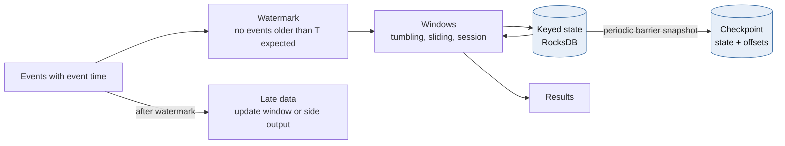
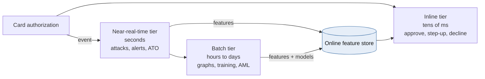
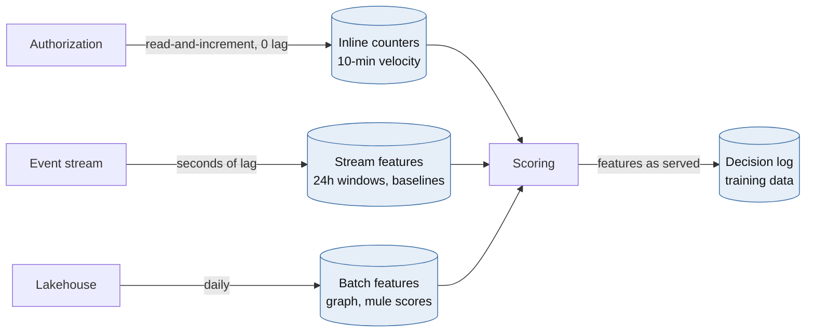
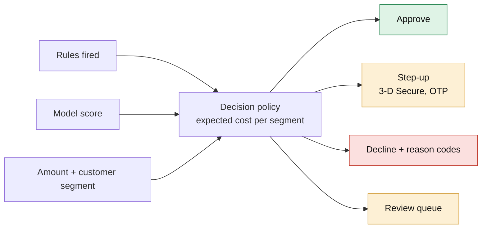
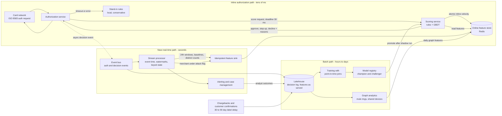

# Module 5 — Real-Time Streaming & Fraud Detection

*Industry: Card Issuing, Payments & Retail Banking*

## 5.1 Ideas & Trade-offs

### Stream processing fundamentals



*[Open full-size diagram: Event-time stream processing (SVG)](../diagrams/m5-event-time-stream-processing.svg)*

**In plain words:** stream processing means working on data *while it flows*, one event at a time, instead of waiting to process a big batch later.

**Event time vs. processing time:**

- *Event time* is when something actually happened, such as when the card was tapped.
- *Processing time* is when your program sees it.

The two differ because of network delays, retries, phones that were offline, and system restarts. Fraud checks must use **event time**. Otherwise a burst that arrives late looks spread out, and a backlog being replayed looks like a burst.

**Watermarks** are the stream's best guess that "no events older than time T are still coming". They trade **speed against completeness**:

- An *eager* watermark gives quick results but misses more late events.
- A *patient* watermark is more complete but slower.
- Events that arrive after the watermark can update the result (**allowed lateness**) or go to a separate "late" output for correction.

**Windows** group events by time:

| Window | Shape | Fraud example |
|---|---|---|
| Tumbling | Fixed blocks that don't overlap (every 1 min) | Merchant dashboards, simple rate alarms |
| Sliding / hopping | A fixed length that moves forward in small steps (last 10 min, updated every 30 s) | "How many times was this card used in the last 10 minutes?" |
| Session | Ends after a period of no activity | Online-banking sessions, account-takeover patterns |
| Global + custom trigger | Never ends. Fires when a condition is met | "First purchase in a new country in 90 days" |

**Remembering things between events (state):**

- Counting per card, remembering the last country and so on needs **state**. It's kept in a local database inside the stream engine (such as RocksDB in Flink or Kafka Streams).
- The engine regularly saves **checkpoints** of that state together with its position in the input.
- After a crash, it goes back to the checkpoint and continues. The *effect* is "exactly once" **for data inside the engine**.

**What "exactly once" really covers:**

- **Kafka transactions** (idempotent producer + `transactional.id` + `sendOffsetsToTransaction` + consumers reading `read_committed`) make "read, process, write" one all-or-nothing step: outputs and input positions are saved together or not at all.
- **Flink** extends this to some outputs with two-phase commit.
- **Anything outside that is still "at least once"**: a Redis feature store, a REST call, an SMS. The rule from Module 1 applies: make those writes safe to repeat, using the event ID.

**Two ways to build the data platform:**

| | Lambda | Kappa |
|---|---|---|
| Paths | A batch path (complete, slow) plus a fast path (quick, approximate) | Only a streaming path. To reprocess, replay the log |
| Cost | Two codebases computing "the same" number, which *will* drift apart | One codebase. Needs a long log or a data lake to replay from |
| Today | Mostly replaced | Streaming plus a data lake (Delta/Iceberg) as replayable history |

For fraud, the practical answer is **Kappa for features, batch for model training and graph analysis**, with one shared definition for each feature (see "training/serving mismatch" below).

### Fraud detection architecture: three latency tiers



*[Open full-size diagram: Three latency tiers of fraud detection (SVG)](../diagrams/m5-three-latency-tiers-of-fraud-detection.svg)*

| Tier | Time budget | Examples | Where it runs |
|---|---|---|---|
| **Inline (while the payment waits)** | Tens of ms, inside the card network's time limit | Approve / extra check / decline a card payment or instant transfer | A scoring service in the payment path |
| **Near real time** | Seconds to minutes | Attacks on a merchant, account takeover, money-mule deposits, customer alerts | Stream processor → alerts and feature store |
| **Batch** | Hours to days | Finding mule rings with graph analysis, training models, anti-money-laundering (AML) patterns, testing rules | Data lake, graph engine |

**The key design limit:** the inline check **can't wait** for the stream to finish counting. It reads **ready-made features** from a fast **online feature store**, and adds features calculated from the payment request itself.

### Features, and the traps around them



*[Open full-size diagram: Feature freshness classes (SVG)](../diagrams/m5-feature-freshness-classes.svg)*

**Features** are the numbers the model uses to judge a payment:

- **Velocity:** counts and totals over recent time windows, per card, account, device, IP address, merchant, and card + merchant pair.
- **Distinct counts:** how many different merchants or countries a card used in 24 h. At scale, use HyperLogLog, an approximate counter, and state its error margin.
- **Normal behaviour:** typical amount, usual shop types, usual hours, home country. Expressed as "how unusual is this?" rather than raw values.
- **Impossible travel:** the distance between two in-person purchases divided by the time between them.
- **Relationship features:** shared devices, shared payees, many new accounts sending money to one place (mule signs). Usually calculated in batch and copied to the online store.

**The freshness gap.** A bot testing stolen cards can make 50 payments in 2 seconds. If the stream processor is 1–3 seconds behind, its counters **can't see** exactly the burst you care about. **The fix:** keep the *short-window* counters **inside the payment path**, as one atomic "add and read" step. Let the stream handle the heavier features.

**Training/serving mismatch.** If a feature is calculated one way in the notebook used for training and another way in the live stream, the two slowly drift apart and the model quietly gets worse. Fixes:

- Define each feature **once** (in a feature platform or a shared library) and generate both versions from that definition.
- **Save the features exactly as used** at decision time, and train on those.

**Point-in-time correctness.** When building training data, use feature values *as they were at the time of each payment*. Joining today's "customer risk score" onto last year's payments lets the model peek into the future. It looks great in testing and fails in real use.

**Labels arrive late and are biased.** A *label* is the answer "this was fraud" or "this was fine".

- Chargebacks and fraud reports arrive 30–90+ days after the payment.
- Payments you declined **never** get a label, because you stopped them (this is called *selection bias*).
- Fixes: wait until labels are mature, keep a small random group that's scored but not acted on (only if rules and risk appetite allow), and watch for changes in score patterns instead of waiting for labels.

### Decisioning: rules + model + cost



*[Open full-size diagram: Fraud decision policy (SVG)](../diagrams/m5-fraud-decision-policy.svg)*

- **Rules** are easy to explain, quick to change and easy to audit. They handle known patterns, legal hard stops (sanctions matches), and emergencies ("block gambling merchants from country X for 2 hours").
- **Models** (gradient-boosted trees are still the workhorse, with sequence and graph models added on top) rank risk using hundreds of small signals.
- **The decision policy** combines score, rules, amount and customer type into: *approve*, *extra check* (3-D Secure, a one-time code, confirming in the app), *decline*, or *send for review*.
  - Pick thresholds by **expected cost**, not accuracy: `fraud loss × chance of fraud` compared with `friction cost × chance it's legitimate`. Friction cost includes lost sales and customers who leave.
  - Fraud is rare, so measure precision and recall at the threshold you'll actually use, not only overall scores such as ROC-AUC.
- **Reason codes** go with every decline or extra check, for customer service, disputes and model reviews.

**When the scoring service fails.** You must not stop approving card payments. The usual approach is **"let it through" with backup rules**: a simple, strict rule set that runs locally in the payment service, with lower amount limits and an alert. Blocking everything is only for narrow cases such as sanctions screening. Agree this with the business *before* it happens, and test it.

**AML is a different problem.** Anti-money-laundering monitoring looks over days to months, at patterns like splitting deposits to stay under limits. It involves case management and reports to regulators (in Canada, suspicious-transaction reports to FINTRAC). It can share the streaming and feature tools, but it needs its own models, audits and governance. Don't let a fraud system become the AML system by accident.

## 5.2 Python

### Inline scoring: time budget, safe-to-repeat counters, backup rules

```python
import asyncio
import time
from enum import Enum
from typing import Protocol

import redis.asyncio as redis
from fastapi import FastAPI
from pydantic import BaseModel

app = FastAPI()
r = redis.Redis(host="feature-store", decode_responses=True)
BUDGET_S = 0.030          # our share of the authorization latency budget
MODEL_VERSION = "gbdt-2026-09-01"

# Sliding-window counter keyed by auth_id. A retried or duplicated authorization
# reuses the same member, so it is counted once (idempotent inline velocity).
INLINE_VELOCITY = r.register_script("""
local now = tonumber(ARGV[1])
local window = tonumber(ARGV[2])
redis.call('ZADD', KEYS[1], now, ARGV[3])
redis.call('ZREMRANGEBYSCORE', KEYS[1], '-inf', now - window)
redis.call('PEXPIRE', KEYS[1], window)
return redis.call('ZCARD', KEYS[1])
""")


class Decision(str, Enum):
    APPROVE = "approve"
    STEP_UP = "step_up"
    DECLINE = "decline"


class AuthRequest(BaseModel):
    auth_id: str
    card_id: str
    merchant_id: str
    mcc: str
    country: str
    amount_minor: int
    ts_ms: int                 # event time from the network message


class Model(Protocol):
    def predict_proba(self, rows: list[list[float]]) -> list[list[float]]: ...


MODEL: Model  # loaded at startup from the model registry (LightGBM / ONNX)


def build_vector(req: AuthRequest, v_card_10m: int, v_card_merch_1h: int,
                 card: dict[str, str]) -> list[float]:
    avg_amt = float(card.get("avg_amount_90d", 0) or 0)
    return [
        req.amount_minor / 100,
        (req.amount_minor / 100) / avg_amt if avg_amt else 0.0,
        float(v_card_10m),
        float(v_card_merch_1h),
        float(card.get("auths_24h", 0) or 0),                    # stream-computed
        float(card.get("distinct_countries_30d", 0) or 0),        # stream-computed
        1.0 if req.country != card.get("home_country") else 0.0,
    ]


def stand_in_rules(req: AuthRequest) -> tuple[Decision, list[str]]:
    """Static, local, conservative. Used when features or the model are unavailable."""
    if req.amount_minor > 50_000 and req.mcc in {"6051", "7995", "4829"}:
        return Decision.DECLINE, ["STANDIN_HIGH_RISK_MCC"]
    if req.amount_minor > 150_000:
        return Decision.STEP_UP, ["STANDIN_AMOUNT"]
    return Decision.APPROVE, ["STANDIN_DEFAULT"]


@app.post("/v1/score")
async def score(req: AuthRequest) -> dict:
    started = time.perf_counter()
    try:
        async with asyncio.timeout(BUDGET_S):
            v_card, v_pair, card = await asyncio.gather(
                INLINE_VELOCITY(keys=[f"v:card:{req.card_id}"],
                                args=[req.ts_ms, 600_000, req.auth_id]),
                INLINE_VELOCITY(keys=[f"v:cm:{req.card_id}:{req.merchant_id}"],
                                args=[req.ts_ms, 3_600_000, req.auth_id]),
                r.hgetall(f"f:card:{req.card_id}"),
            )
    except (TimeoutError, redis.RedisError):
        decision, reasons = stand_in_rules(req)
        return {"decision": decision, "reasons": reasons, "mode": "stand_in"}

    # GBDT inference on one row is sub-millisecond, so running it inline beats a thread hop.
    p = MODEL.predict_proba([build_vector(req, int(v_card), int(v_pair), card)])[0][1]
    reasons: list[str] = []
    if int(v_card) >= 8:
        reasons.append("VELOCITY_CARD_10M")
    if req.country != card.get("home_country"):
        reasons.append("FOREIGN_COUNTRY")
    if p >= 0.90:
        decision = Decision.DECLINE
    elif p >= 0.40 or "VELOCITY_CARD_10M" in reasons:
        decision = Decision.STEP_UP
    else:
        decision = Decision.APPROVE
    return {"decision": decision, "score": round(p, 4), "reasons": reasons,
            "model_version": MODEL_VERSION, "mode": "model",
            "latency_ms": round((time.perf_counter() - started) * 1000, 2)}
```

Notes on the design:

- The thresholds shown are examples. Real ones come from cost analysis per customer group, and are **settings that are versioned and audited**, not constants in code.
- A sorted set per *merchant* is too heavy for merchants with thousands of payments per second. For those, use one counter per second and add up the last N counters.
- The decision record (request, features used, score, decision, model version) is published in the background for case management, monitoring and training. Losing it must not block the payment, so buffer it locally on disk.

### Near-real-time features: an exactly-once Kafka step

```python
import json

from confluent_kafka import Consumer, KafkaException, Producer, TopicPartition

consumer = Consumer({
    "bootstrap.servers": "kafka:9092",
    "group.id": "card-velocity-features",
    "enable.auto.commit": False,
    "isolation.level": "read_committed",   # never see aborted upstream writes
    "auto.offset.reset": "earliest",
})
producer = Producer({
    "bootstrap.servers": "kafka:9092",
    "transactional.id": "card-velocity-features-0",   # stable per instance/partition set
    "enable.idempotence": True,
})
producer.init_transactions()   # also fences zombie producers with the same transactional.id
consumer.subscribe(["card-auth-events"])


def compute_features(evt: dict) -> dict:
    """Pure function over the event plus keyed state (e.g. a local RocksDB store)."""
    ...


def rewind_to_committed() -> None:
    committed = consumer.committed(consumer.assignment(), timeout=10)
    for tp in committed:
        if tp.offset >= 0:
            consumer.seek(tp)


while True:
    msgs = consumer.consume(num_messages=500, timeout=0.2)
    if not msgs:
        continue
    producer.begin_transaction()
    try:
        for m in msgs:
            if m.error():
                raise KafkaException(m.error())
            feats = compute_features(json.loads(m.value()))
            producer.produce("card-features", key=m.key(), value=json.dumps(feats))
        # Output records and input offsets commit atomically.
        offsets = [TopicPartition(m.topic(), m.partition(), m.offset() + 1) for m in msgs]
        producer.send_offsets_to_transaction(offsets, consumer.consumer_group_metadata())
        producer.commit_transaction()
    except KafkaException:
        producer.abort_transaction()
        rewind_to_committed()   # reprocess the batch; aborted outputs are invisible downstream
```

Caveats:

- `offsets` should contain the *highest* offset per partition. The list above works because Kafka keeps the last value for each partition, but removing duplicates first is cleaner.
- A separate consumer copies `card-features` into the online feature store (Redis, Cosmos DB) with **upserts keyed by entity and version**, so repeats are harmless. That step is outside the Kafka transaction.
- Check that your broker supports Kafka transactions. Apache Kafka, Confluent and MSK do. On Azure, check current Event Hubs support for Kafka transactions on your tier before relying on it.
- For proper windows (watermarks, session windows, late data) in Python, use **PyFlink**, Bytewax or Quix Streams. Home-made windowing inside a consumer loop is where subtle time bugs hide.

## 5.3 Case Study: Real-Time Card Fraud for a Card Issuer

**Scenario:** a card issuer with 30 million active cards. There are 5,000 card payments per second on average and 20,000 per second at peak (Black Friday, holidays). The scoring decision gets ~30 ms for 99% of payments, because the card network allows a few seconds in total but many other steps share that time. The main threats:

- **card testing:** bots checking stolen card numbers with small payments at weak merchants;
- **account takeover** followed by online spending;
- **cloned cards** used abroad.

### Rough numbers

| What | Estimate |
|---|---|
| Redis calls in the payment path | ~3 per payment → **60,000 per second at peak**. A small Redis cluster handles that. The concern is the slowest 1%, not total throughput |
| Online feature store size | 30M cards × ~40 features × ~16 bytes ≈ 20 GB, plus merchant, device and IP data → tens of GB in memory |
| Stream volume | 20,000 events/s × ~1.5 KB ≈ 30 MB/s into the stream processor |
| Decision log | ~400M decisions/day × ~2 KB ≈ **0.8 TB/day**. This is the training data, so keep it in the data lake |
| Freshness targets | Short-window counters in the payment path: **no delay**. Stream features: 99% within 2 s. Batch relationship features: daily |

### Design decisions

- **Two freshness levels, on purpose.** Short-window counters are updated in the payment path and catch card-testing bursts. Everything expensive (24 h windows, normal behaviour, distinct counts, merchant risk) comes from the stream.
- **A merchant-level detector for card testing.** The sign is *many different cards* making *small payments* at *one merchant*, with many declines. A 1-minute sliding window per merchant sets a `merchant_under_attack` flag. The payment path reads it, so every card at that merchant faces stricter limits within seconds.
- **Testing new models safely.** New models first run in **shadow mode**: they score live payments and are logged, but their decisions aren't used. They replace the current model only if they do better at the chosen threshold. This is the parallel-run idea from Module 6, applied to models.
- **Learning from outcomes.** Review results, customer answers ("was this you?") and chargebacks flow back as labels, joined to the features as they were at the time.
- **Explaining decisions.** Every declined payment gets reason codes. There is a model review trail: data history, test reports, versioned thresholds, and who changed what.
- **When parts fail:**
  - Scoring down → backup rules with lower limits.
  - Feature store down → backup rules.
  - Stream processor behind → in-path counters still work, and an alert fires on the freshness target.

**Azure services:** Event Hubs (Kafka API) for events. Azure Stream Analytics for simple windows, or Flink on AKS for complex state. Azure Cache for Redis Enterprise or Cosmos DB as the online feature store. Azure Machine Learning for the model registry and training. Fabric or Databricks as the data lake for the decision log and batch features.

## 5.4 Diagram: Real-Time Fraud Architecture



*[Open full-size diagram: Real-time fraud architecture (SVG)](../diagrams/m5-real-time-fraud-architecture.svg)*

## 5.5 Animation Plan: Catching a Card-Testing Attack Before the Stream Does

**Scene:**

- **Top:** a timeline with a moving "now" marker.
- **Middle left:** a shop icon labelled *Merchant M-481*.
- **Middle right:** two counters side by side: *In-path counter (no delay)* and *Stream counter (1.5 s behind)*.
- **Bottom:** a decision meter with three zones: green *approve*, amber *extra check* and red *decline*.
- A dashed watermark line follows behind the "now" marker.

| Time | Step | What you see | Manim tools |
|---|---|---|---|
| 0:00–0:04 | **Normal traffic** | A few coloured dots (different cards) arrive at the shop each second, with varied amounts. Both counters are low and agree | Dots spawned on a timer, `DecimalNumber` |
| 0:04–0:07 | **Attack starts** | A bot icon appears and fires a dense stream of *tiny* ($1–2) payments from many *different* cards | Fast `LaggedStart` of paths |
| 0:07–0:12 | **The freshness gap** | The in-path counter jumps with every payment. The stream counter still shows old numbers, and a shaded band labelled *processing delay* stretches between them. Caption: *Stream features are 1.5 s behind the burst* | `always_redraw` band, two counters |
| 0:12–0:15 | **Caught in the path** | For a card used again and again, its 10-minute counter passes 8. The meter swings to amber: *EXTRA CHECK*. A 3-D Secure prompt icon appears | Rotating needle, `FadeIn` |
| 0:15–0:20 | **The stream catches up** | The watermark passes the burst. A 1-minute window above the timeline fills: *212 different cards, average $1.40, 71% declined*. The window closes and sends a red `merchant_under_attack` flag to the feature store | Sliding rectangle, `Transform`, `MoveToTarget` |
| 0:20–0:24 | **Merchant-wide tightening** | Every new payment at M-481 now reads the flag. The threshold marker slides left, and the bot's next tries land in red: *DECLINE* | Threshold shift, red `Flash` |
| 0:24–0:29 | **Late event** | A dot with an older time arrives *after* the watermark (a card terminal that was offline). It goes to a side lane: *late data → window updated*. The closed window briefly reopens and its count goes up by one | Curved path, `Indicate` |
| 0:29–0:33 | **Summary** | Two columns: *In-path: fast, narrow, per card* and *Stream: complete, cross-merchant, slightly late*. Caption: *You need both* | `VGroup.arrange` |

## 5.6 Review Questions

- Which features does the payment path read, and how out of date can each one be in the worst 1% of cases?
- How do you make sure a feature is calculated the same way in training and in production?
- Exactly what happens to payments when the scoring service is down, and when did you last test it?
- How are thresholds chosen, versioned and approved, and who can change them in an emergency?
- How do you measure how the model does on payments you declined, which never get a label?

---

[← Back to contents](../README.md)
