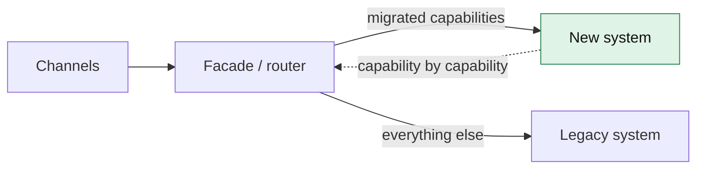
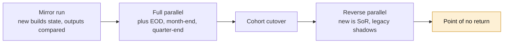
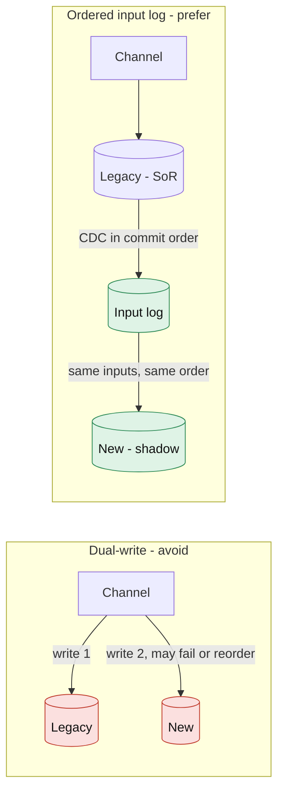
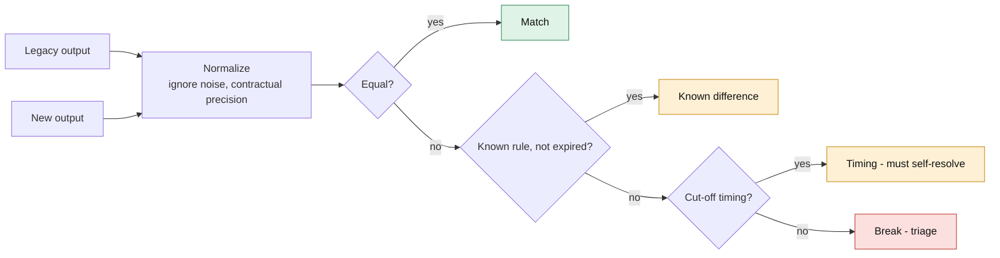
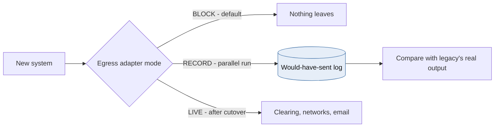
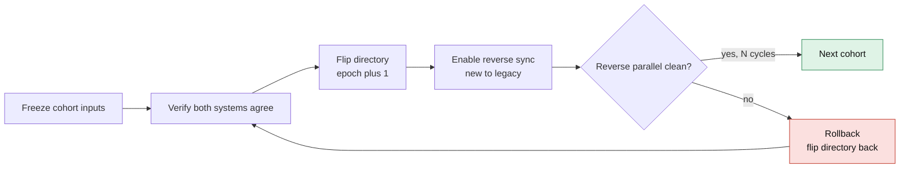
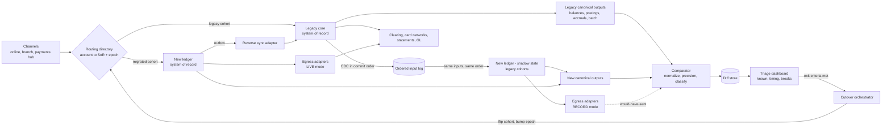
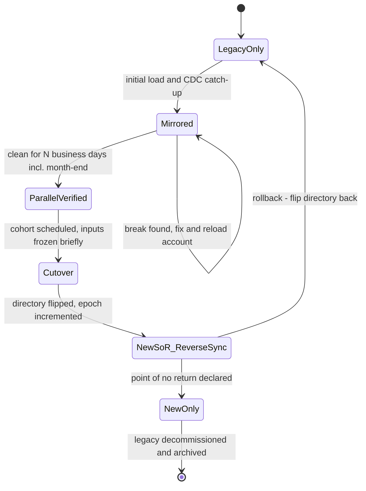

# Module 6 — Parallel-Run Migration

*Industry: Core Banking Modernization*

## 6.1 Core Theory & Trade-offs

### Why migrations of systems of record are different

Replacing a core banking platform (for example, moving deposits off a mainframe COBOL/DB2 core onto a cloud-native ledger like Module 1's) is among the highest-risk changes a bank makes:

- The system has decades of undocumented behaviour: interest rounding quirks, fee waivers coded for one product in 1998, cut-off time conventions.
- It runs periodic processes that only execute at month-end, quarter-end or year-end.
- A wrong balance is not a bug report. It is a regulatory event and a customer-trust event.

"Big-bang" core migrations have failed publicly. The UK's TSB migration in 2018 is the widely studied example. The patterns in this module exist to **replace one large, irreversible leap with many small, verified, reversible steps**.

### The migration pattern family



*[Open full-size diagram: Strangler fig facade (SVG)](../diagrams/m6-strangler-fig-facade.svg)*

| Pattern | What it does | When to use | Main risk |
|---|---|---|---|
| **Strangler fig** | Route one capability at a time to the new system behind a façade | Decomposable functionality (statements, notifications, fee calculation) | Long tail of capabilities that are hard to extract |
| **Branch by abstraction** | Introduce an interface inside the old code base, then swap the implementation | When you own the legacy code | Legacy code may be untouchable |
| **Shadow traffic / dark launch** | Copy live requests to the new system and discard its responses | Read paths, calculations, APIs | Side effects leaking out of the shadow system |
| **Parallel run** | Both systems process *the same inputs*. Outputs are compared. Legacy stays the system of record | Anything where correctness must be *proven*: balances, interest, fees | The cost of running two systems, and of triaging their differences |
| **Reverse parallel** | After cutover, the **new** system is the system of record and legacy runs in shadow for a few cycles | To keep a rollback path | Needs a reverse data flow, and discipline about when it ends |
| **Cohort cutover** | Move accounts or customers in waves: staff, then 1%, 10%, 50%, all | Almost always, as the cutover mechanism | Customers split across two systems (joint accounts, transfers between cohorts) |

For a core ledger these are **combined, not chosen between**: shadow for read APIs, parallel run for balances and batch processes, cohort cutover with reverse parallel for the switch.

### Parallel run modes



*[Open full-size diagram: Parallel run modes over time (SVG)](../diagrams/m6-parallel-run-modes-over-time.svg)*

1. **Mirror (shadow) run.** The new system consumes a copy of every input and builds its own state. Nothing it produces leaves the building. Its outputs (balances, postings, interest accruals) are compared with legacy's.
2. **Full parallel run, including batch.** The new system also runs end-of-day, month-end interest capitalization, fee assessment and statement generation, and those outputs are compared too. Minimum duration is **at least one full quarter, including a month-end and quarter-end**. If tax reporting is in scope (in Canada, T5 slips for interest income), a year-end.
3. **Reverse parallel.** After a cohort moves, the new system is authoritative. Its changes flow back to legacy so that legacy stays current, and legacy's outputs are compared in the other direction. Rollback remains possible until the declared **point of no return**.

### The integration point: capture inputs, don't dual-write



*[Open full-size diagram: Dual-write vs ordered input log (SVG)](../diagrams/m6-dual-write-vs-ordered-input-log.svg)*

**Dual-writing from channels to both systems is the classic mistake.** With no distributed transaction, a write that succeeds on one side and fails on the other diverges silently. Retries arrive in different orders. The systems then disagree for reasons that have nothing to do with their logic, and the diff triage team drowns in noise.

**Principal answer: make an ordered input log the integration point.**

- Capture every input that changes state (payments, deposits, card postings, account maintenance, rate changes) **into a durable ordered log** (Kafka/Event Hubs), in the order legacy processed it.
- Legacy remains the system of record and processes inputs as it always has. The capture is either **before** it (channels publish to the log, and a legacy adapter consumes) or **after** it via CDC from legacy's database (e.g. Db2 log-based capture).
- The new system consumes **the same log in the same order**, so it is deterministic by construction. Given the same starting state and the same inputs, a correct new system must produce the same outputs.
- **Capturing after legacy's commit order is usually safer.** The log then reflects what legacy *actually* did, including its rejections, instead of what the channels asked for.

### Why outputs differ, and why that is the whole job



*[Open full-size diagram: Diff classification pipeline (SVG)](../diagrams/m6-diff-classification-pipeline.svg)*

Most differences are not defects in the new system. Classify every difference into one of these buckets:

| Class | Example | Handling |
|---|---|---|
| **Non-deterministic noise** | Generated IDs, timestamps, correlation IDs | Exclude or normalize before comparison |
| **Representation** | Padding, case, date formats, sign conventions (debit negative vs. separate DR/CR columns) | Normalize, carefully |
| **Precision and rounding** | Banker's rounding (half-even) vs. half-up. Accruing interest at 5 decimal places vs. rounding daily to cents | Compare at the contractual precision. **Never hide sub-cent accrual differences**, because they compound over a year |
| **Convention** | Day-count basis (Actual/365 vs. Actual/360 vs. 30/360), leap years, business-date vs. calendar-date cut-offs, time zones | Encode the legacy convention explicitly. An intentional change is a product decision |
| **Timing** | A transaction posted just after a cut-off on one side and just before on the other | Mark as *timing* and re-compare after the next cycle. It must resolve itself, or it becomes a break |
| **Known differences** | An approved intentional change, or a legacy bug you've decided not to reproduce | A rule with a ticket, an owner and an expiry date |
| **Data migration defects** | A wrong opening balance or product mapping for migrated accounts | Fix the migration and reload that account |
| **Genuine breaks** | Anything else | Triage, root-cause, fix, re-run |

The **diff platform is a product**: a store of every difference with its class, trend dashboards, drill-down to the inputs that produced it, and assignment to owners. Exit criteria are defined on it.

### Side-effect isolation (egress sandboxing)



*[Open full-size diagram: Egress adapter modes (SVG)](../diagrams/m6-egress-adapter-modes.svg)*

The new system in a parallel run must **never** emit real side effects: no payments to clearing, no files to card networks, no customer emails or SMS, no credit bureau updates. Put every egress behind an adapter with three modes:

- **Record** (parallel run): capture what *would* have been sent, for comparison with what legacy actually sent.
- **Live** (after cutover).
- **Block** (the default).

Test the sandbox itself. A misconfigured adapter that sends duplicate payments during a "harmless" shadow run is a real incident.

### Cutover, rollback and the point of no return



*[Open full-size diagram: Cohort cutover with rollback (SVG)](../diagrams/m6-cohort-cutover-with-rollback.svg)*

- **Routing.** An account-level **routing directory** (the same idea as Module 4's tenant directory) says which system is authoritative for each account, with an **epoch** that fences stale writers.
- **Cohort flip.** Briefly freeze the cohort's inputs, confirm both systems agree for those accounts, flip the directory entries (incrementing the epoch), enable reverse sync, and resume.
- **Relationships across cohorts.** Joint accounts, sweeps and overdraft links between accounts must move together. Build a **dependency graph** of accounts and migrate connected components.
- **Rollback.** While reverse sync runs and reverse-parallel comparisons are clean, rollback means flipping the directory back. Define the **point of no return** explicitly: the moment legacy stops being kept current (for example, legacy licence termination or schema decommissioning). Past it, recovery means fixing forward.

### Exit criteria (example)

- N consecutive business days (commonly 20 or more) with **zero unexplained breaks** on balances and postings.
- Month-end and quarter-end batch outputs matched, including interest capitalization and fees.
- Performance at production volume with headroom (batch windows met, online p99 met).
- Every known-difference rule approved by the product owner, with customer-impact assessment.
- Reconciliation to the general ledger clean. Regulators or auditors briefed, as your jurisdiction requires.

## 6.2 Python in Practice

### A comparator: normalize, compare at contractual precision, classify

```python
from __future__ import annotations

from collections.abc import Callable, Iterable, Mapping
from dataclasses import dataclass
from datetime import date
from decimal import ROUND_HALF_EVEN, Decimal
from enum import Enum


class DiffClass(Enum):
    MATCH = "match"
    KNOWN = "known"          # approved rule with a ticket and an expiry date
    TIMING = "timing"        # expected to resolve next cycle
    MISSING = "missing"      # record present on one side only
    BREAK = "break"          # unexplained: must be triaged


@dataclass(frozen=True, slots=True)
class KnownDiffRule:
    rule_id: str
    field: str
    applies: Callable[[Mapping, Mapping], bool]
    ticket: str
    expires: date


@dataclass(frozen=True, slots=True)
class Diff:
    account: str
    business_date: date
    field: str
    legacy: object
    new: object
    cls: DiffClass
    rule_id: str | None = None


IGNORED = frozenset({"generated_at", "correlation_id", "internal_txn_id"})
# Compare at the precision the product contract defines, NOT always to the cent.
PRECISION: dict[str, Decimal] = {
    "ledger_balance": Decimal("0.01"),
    "available_balance": Decimal("0.01"),
    "fees_mtd": Decimal("0.01"),
    "accrued_interest": Decimal("0.00001"),   # sub-cent drift compounds, so keep it visible
}


def normalize(rec: Mapping[str, object]) -> dict[str, object]:
    out: dict[str, object] = {}
    for k, v in rec.items():
        if k in IGNORED:
            continue
        if k in PRECISION and v is not None:
            v = Decimal(str(v)).quantize(PRECISION[k], rounding=ROUND_HALF_EVEN)
        elif isinstance(v, str):
            v = v.strip().upper()
        out[k] = v
    return out


def compare_account(
    account: str,
    business_date: date,
    legacy: Mapping | None,
    new: Mapping | None,
    rules: Iterable[KnownDiffRule],
    pending_after_cutoff: Callable[[str, date], bool],
) -> list[Diff]:
    if legacy is None or new is None:
        return [Diff(account, business_date, "*", legacy, new, DiffClass.MISSING)]
    a, b = normalize(legacy), normalize(new)
    active = [r for r in rules if r.expires >= business_date]
    diffs: list[Diff] = []
    for field in sorted(a.keys() | b.keys()):
        lv, nv = a.get(field), b.get(field)
        if lv == nv:
            continue
        rule = next((r for r in active if r.field == field and r.applies(a, b)), None)
        if rule is not None:
            diffs.append(Diff(account, business_date, field, lv, nv, DiffClass.KNOWN, rule.rule_id))
        elif field in {"ledger_balance", "available_balance"} and pending_after_cutoff(account, business_date):
            diffs.append(Diff(account, business_date, field, lv, nv, DiffClass.TIMING))
        else:
            diffs.append(Diff(account, business_date, field, lv, nv, DiffClass.BREAK))
    return diffs
```

The design choices are deliberate:

- **Known differences expire.** Otherwise the rule set becomes a permanent place to hide defects.
- **Timing differences must resolve.** A companion job re-compares yesterday's timing diffs and escalates any that persist to *break*.
- **Compare canonical outputs, not screens.** Use a common schema for balances, postings and accruals, produced by an adapter on each side. The legacy adapter is often the hardest code in the programme.
- **Scale:** 4M accounts × a few dozen fields per day is a straightforward partitioned batch job (Spark, or Python workers partitioned by account range). For the intraday posting stream, run the comparison in streaming mode, keyed by account and ordered by input sequence number.

### A shadow tap for read APIs and pure calculations

```python
import asyncio
import random

import httpx


class ShadowTap:
    """Mirror requests to the new system without ever affecting the caller.
    Only for reads and pure calculations. State changes go through the input log."""

    def __init__(self, client: httpx.AsyncClient, sink: asyncio.Queue,
                 max_inflight: int = 200, sample_rate: float = 0.1) -> None:
        self._client, self._sink = client, sink
        self._sem = asyncio.Semaphore(max_inflight)
        self._sample = sample_rate
        self._tasks: set[asyncio.Task] = set()
        self.dropped = 0

    def fire(self, path: str, params: dict, legacy_body: dict) -> None:
        if random.random() > self._sample:
            return
        if self._sem.locked():          # saturated: drop the shadow call, never queue behind it
            self.dropped += 1
            return
        task = asyncio.create_task(self._run(path, params, legacy_body))
        self._tasks.add(task)           # keep a strong reference until the task completes
        task.add_done_callback(self._tasks.discard)

    async def _run(self, path: str, params: dict, legacy_body: dict) -> None:
        async with self._sem:
            try:
                async with asyncio.timeout(2.0):
                    resp = await self._client.get(path, params=params)
                new_body = resp.json()
            except Exception as exc:    # shadow failures are data, not incidents
                new_body = {"_shadow_error": type(exc).__name__}
            try:
                self._sink.put_nowait((path, params, legacy_body, new_body))
            except asyncio.QueueFull:
                self.dropped += 1
```

In the handler, the legacy call happens first and its response is returned. Only then does the handler call `tap.fire(...)`. The caller never waits on, and is never affected by, the new system. Track `dropped` as a metric, because a shadow run that silently samples 2% of traffic proves far less than it appears to.

## 6.3 Case Study: Migrating Retail Deposits Off a Mainframe Core

**Scenario:** a mid-size Canadian bank with 4M retail deposit accounts (chequing, savings, GICs) on a mainframe core with nightly batch (interest accrual, fee assessment, statements) and a nightly general-ledger feed. The target is a cloud-native ledger built on the Module 1 design. Constraints: no customer-visible downtime beyond a short planned window per cohort, and the ability to roll back each cohort.

### Programme phases

| Phase | What happens | Exit gate |
|---|---|---|
| **0. Capture** | Build the ordered input log from legacy (CDC on the core database plus the channel feeds). Build canonical output adapters for both systems. Stand up the diff platform | The log replays a historical day on legacy's own data and reproduces its end-of-day balances |
| **1. Initial load** | Snapshot migration of accounts, balances, holds, rates and product mappings into the new ledger. The CDC stream catches it up. Build the legacy-to-new **ID crosswalk** | Opening balances reconcile for 100% of accounts, and the total reconciles to the GL |
| **2. Mirror run** | The new ledger consumes the live input log and builds balances intraday. Daily balance and posting comparisons | Break rate falling. All diff classes understood |
| **3. Full parallel** | The new system also runs EOD, month-end and quarter-end batch processes. Compare interest, fees, statements (as documents *and* data) and the GL feed | 20+ clean business days, including month-end and quarter-end, and the batch window met at volume |
| **4. Cohort cutover** | Employees' accounts first, then 1%, 5%, 25%, 100%, moving connected components of related accounts together. Flip the routing directory (with epoch). Reverse sync to legacy | Each cohort clean in reverse parallel for 2+ cycles before the next one moves |
| **5. Point of no return** | Declare the end of reverse sync once all cohorts are stable through a month-end | Sign-off by product, risk, finance and technology |
| **6. Decommission** | Archive legacy data under retention policy, keeping read access for audit and disputes | Records management and audit sign-off |

### Capacity and effort realities

- **Daily comparison volume:** 4M accounts × ~30 canonical fields ≈ 120M field comparisons per day, plus intraday postings (say 20M/day). That is a routine partitioned batch job, *but the triage load is the real constraint*. Even a 0.01% break rate means 400 account-level breaks per day to explain.
- **The break-rate curve** typically falls steeply in the first weeks (normalization and convention fixes), plateaus (real business-logic gaps), then spikes at the first month-end (batch processes seen for the first time). Plan staffing around that shape.
- **Cost of running two systems:** budget for months of dual infrastructure and licensing. Shortening parallel run to save money is the most common way these programmes take on unpriced risk.

### Architecture decisions

- **Legacy remains the system of record until each cohort flips.** Everything else is a derived view.
- **Account-level routing directory** with epochs, used by channels (online banking, branch, payments hub) to route writes. It is cached, highly available, and changed only by the cutover orchestrator.
- **Reverse sync after cutover:** the new ledger's postings, published through its outbox, are applied to legacy by an adapter, so legacy stays current for rollback and reverse-parallel comparison.
- **Egress adapters in record mode** for every external interface: clearing, card networks, statements, notifications, the credit bureau, and the regulatory reporting feeds.
- **Governance:** a known-difference board with product and risk owners, and customer-impact assessment for every intentional behaviour change. An interest calculation that is "more correct" in the new system can still change what a customer is paid, so treat it as a product change with customer communication.

## 6.4 Mermaid: Parallel-Run Architecture



*[Open full-size diagram: Parallel-run architecture (SVG)](../diagrams/m6-parallel-run-architecture.svg)*

And the lifecycle of a single account through the migration:



*[Open full-size diagram: Account migration lifecycle (SVG)](../diagrams/m6-account-migration-lifecycle.svg)*

## 6.5 Animation Blueprint: Two Systems, One Input Stream, and a Reversible Cutover

**Scene setup:**

- **Left:** a vertical input log drawn as a conveyor belt of numbered input cards (`#1041 DEPOSIT $250`, `#1042 FEE $5`...).
- **Two horizontal lanes to the right:** top lane *Legacy core* (a grey mainframe icon), bottom lane *New ledger* (a blue cloud icon). Each lane has its own account balance card for account `CHQ-7781`.
- **Far right:** a *Comparator* gate between the lanes, with a traffic-light indicator.
- **Above everything:** a *Routing directory* card showing `CHQ-7781 → LEGACY, epoch 4`.
- **Bottom strip:** a diff-rate sparkline.

| Time | Beat | Visual | Manim primitives |
|---|---|---|---|
| 0:00–0:05 | **Same inputs, same order** | Input cards leave the belt and **split**: identical copies travel down both lanes in lockstep. Both balance cards update to the same values. The comparator light is green | `TransformFromCopy`, synchronized `MoveAlongPath` |
| 0:05–0:09 | **The dual-write counterexample** (inset) | A small inset replays the wrong design: a channel writes to both systems directly, one write fails, and a retry arrives out of order. The balances diverge by $5. Caption: *Dual-write: divergence you can't explain* | Inset `Rectangle`, red `Cross`, `Wiggle` |
| 0:09–0:14 | **A rounding diff** | Month-end interest: the legacy card shows `accrued 1.23456 → paid 1.23`, and the new one shows `accrued 1.23457 → paid 1.23`. The comparator light turns amber, and a diff chip `accrued_interest Δ 0.00001` pops out. It is stamped **BREAK**, then routed to a triage desk icon | `Indicate`, `FadeIn(chip)`, `MoveToTarget` |
| 0:14–0:18 | **Root cause** | The triage desk zooms in: *legacy uses half-up on daily accrual; new uses half-even*. The fix is applied to the new lane (the half-even label becomes half-up). A re-run shows the numbers match and the light is green | `Transform`, `Circumscribe` |
| 0:18–0:22 | **A timing diff** | Input `#1090 POS $42` arrives at 23:59:58. Legacy posts it to *today*, and the new system to *tomorrow* (a business-date cut-off mismatch). The diff chip is stamped **TIMING**. The next day the chip auto-resolves and fades | Date badges, `FadeOut(chip)` after a clock advance |
| 0:22–0:26 | **Clean streak** | The sparkline falls toward zero. A counter shows *clean business days: 1 → 23* ticking up, and a month-end marker passes with the light green | `ChangeDecimalToValue`, `ValueTracker` |
| 0:26–0:31 | **Cutover** | The input belt pauses (*freeze*). The directory card flips to `CHQ-7781 → NEW, epoch 5`. The lanes swap emphasis: the new lane brightens as the system of record, and the legacy lane dims to *shadow*. A reverse-sync arrow appears from new to legacy | `Transform(directory)`, `set_opacity`, `GrowArrow` |
| 0:31–0:35 | **Fencing** | A delayed write from an old channel session arrives stamped `epoch 4`. It is rejected at the directory with *stale epoch* | Red `Flash`, the arrow shatters |
| 0:35–0:40 | **Rollback rehearsal** | A red *ROLLBACK* button is pressed. The directory flips back to `LEGACY, epoch 6`. Because reverse sync kept legacy current, both balance cards still match. Caption: *Reversible, because legacy never fell behind* | `Transform`, green light |
| 0:40–0:44 | **Point of no return** | The reverse-sync arrow is cut. The legacy lane greys out and moves into an *Archive* box. Caption: *Declare it deliberately, never by accident* | `FadeOut`, `MoveToTarget(archive)` |

## 6.6 Staff-level Review Questions

- What is the single integration point that guarantees both systems see the same inputs in the same order?
- Which external side effects could the new system emit during parallel run, and how is each one proven blocked?
- Which periodic processes (month-end, quarter-end, year-end, rate changes, leap day) have actually been observed in parallel run, rather than assumed?
- How are joint and linked accounts kept together across cohort boundaries?
- What exactly must be true to roll back a cohort, and when does that stop being possible?

---

[← Back to contents](../README.md)
