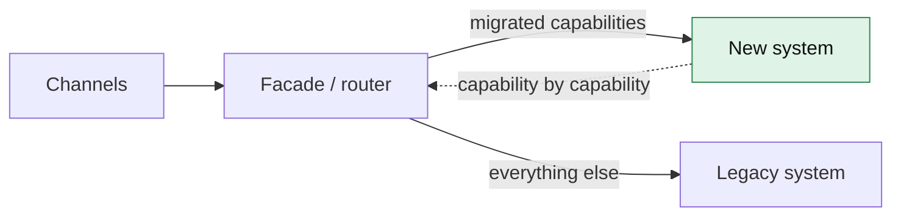
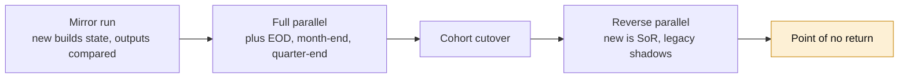
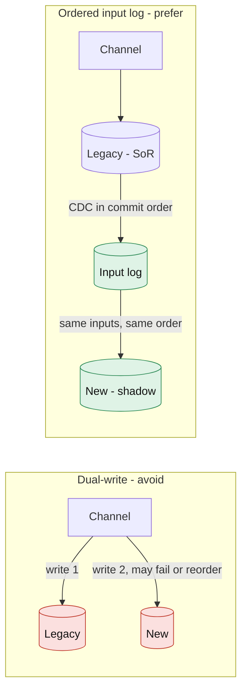
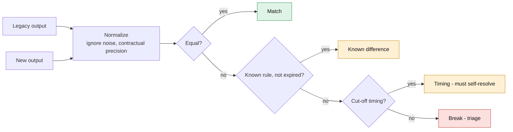
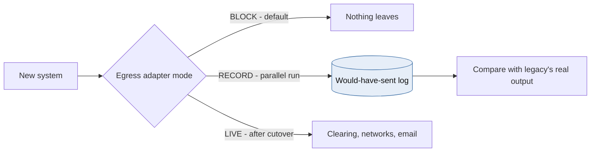
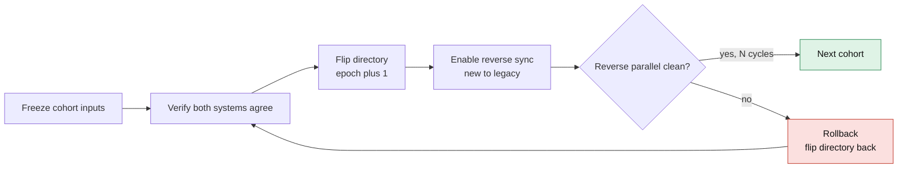
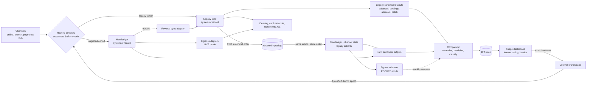
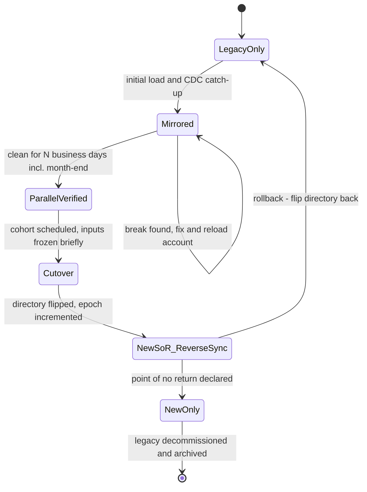

# Module 6 — Parallel-Run Migration

*Industry: Core Banking Modernization*

## 6.1 Ideas & Trade-offs

### Why replacing a bank's core system is different

Replacing a core banking system, for example moving deposits off an old mainframe (COBOL/DB2) onto a modern cloud ledger like the one in Module 1, is one of the riskiest changes a bank can make:

- The old system has decades of **undocumented behaviour**: rounding quirks, a fee waiver coded for one product in 1998, particular cut-off times.
- Some processes run **only at month-end, quarter-end or year-end**, so you may not see them for months.
- A wrong balance isn't just a bug. It's a **regulatory problem** and a **trust problem**.

"Big-bang" migrations (switching everything at once) have failed publicly. The UK bank TSB's 2018 migration is the best-known example. The patterns in this module replace **one big, irreversible jump with many small, checked steps that can be undone**.

### The migration pattern family



*[Open full-size diagram: Strangler fig facade (SVG)](../diagrams/m6-strangler-fig-facade.svg)*

| Pattern | What it does | When to use | Main risk |
|---|---|---|---|
| **Strangler fig** | A front layer sends one feature at a time to the new system | Features that can be separated (statements, notifications, fee calculations) | Some features are very hard to pull out |
| **Branch by abstraction** | Add an interface inside the old code, then swap what's behind it | When you can change the old code | The old code may be untouchable |
| **Shadow traffic** | Copy live requests to the new system and ignore its answers | Read-only features, calculations, APIs | The shadow system accidentally sending real emails or payments |
| **Parallel run** | Both systems process *the same inputs*, and their outputs are compared. The old system stays in charge | When correctness must be *proven*: balances, interest, fees | Running two systems costs money, and investigating differences takes time |
| **Reverse parallel** | After switching, the **new** system is in charge and the old one runs alongside for a few cycles | To keep a way back | Needs data flowing back to the old system, and discipline about when to stop |
| **Cohort cutover** | Move accounts in groups: staff first, then 1%, 10%, 50% and 100% of customers | Almost always, as the way to switch | Customers split across two systems (joint accounts, transfers between groups) |

For a bank ledger you **combine** these: shadow traffic for read APIs, parallel run for balances and batch jobs, and cohort cutover with reverse parallel for the switch itself.

### Parallel run modes



*[Open full-size diagram: Parallel run modes over time (SVG)](../diagrams/m6-parallel-run-modes-over-time.svg)*

1. **Mirror run.** The new system receives a copy of every input and builds its own balances. Nothing it produces leaves the building. Its outputs (balances, postings, interest) are compared with the old system's.
2. **Full parallel run.** The new system also runs end-of-day jobs, month-end interest, fees and statements, and those are compared too. **At minimum run for one full quarter, including a month-end and a quarter-end.** If tax reporting is involved (in Canada, T5 slips for interest income), include a year-end.
3. **Reverse parallel.** After a group of accounts moves, the new system is in charge. Its changes flow back to the old system so the old one stays up to date, and outputs are compared in the other direction. You can still go back, until the declared **point of no return**.

### The integration point: capture inputs, don't write to both



*[Open full-size diagram: Dual-write vs ordered input log (SVG)](../diagrams/m6-dual-write-vs-ordered-input-log.svg)*

**Writing to both systems from each channel ("dual-write") is the classic mistake.** There's no shared transaction, so a write can succeed on one side and fail on the other. Retries arrive in different orders. The systems then disagree for reasons that have nothing to do with their logic, and the team investigating differences drowns in noise.

**Better: use one ordered list of inputs (a log) that both systems read.**

- Record every input that changes data (payments, deposits, card transactions, account changes, rate changes) **in a durable ordered log** (Kafka or Event Hubs), in the order the old system processed them.
- The old system stays in charge and works as always. Inputs are captured either **before** it (channels publish to the log and an adapter feeds the old system) or **after** it, by reading its database changes (CDC, for example log-based capture on Db2).
- The new system reads **the same log in the same order**. With the same starting data and the same inputs, a correct new system must produce the same results.
- **Capturing after the old system's commits is usually safer.** The log then shows what the old system *actually did*, including rejections, not just what channels asked for.

### Why the outputs differ, and why sorting that out is the whole job



*[Open full-size diagram: Diff classification pipeline (SVG)](../diagrams/m6-diff-classification-pipeline.svg)*

Most differences aren't bugs in the new system. Sort every difference into one of these buckets:

| Kind of difference | Example | What to do |
|---|---|---|
| **Random noise** | Generated IDs, timestamps, tracking IDs | Ignore or normalize before comparing |
| **Format** | Padding, upper/lower case, date formats, signs (negative debits vs. separate DR/CR columns) | Normalize, carefully |
| **Rounding and precision** | Banker's rounding (half-even) vs. normal rounding (half-up). Interest kept to 5 decimals vs. rounded to cents daily | Compare at the precision the product contract uses. **Never hide sub-cent interest differences**, because they grow over a year |
| **Conventions** | How days are counted (Actual/365, Actual/360, 30/360), leap years, business date vs. calendar date, time zones | Write the old system's rule down explicitly. Changing it on purpose is a product decision |
| **Timing** | A payment just after a cut-off on one side and just before it on the other | Mark as *timing* and check again after the next cycle. It must sort itself out, or it becomes a break |
| **Known differences** | An approved change, or an old bug you decided not to copy | A rule with a ticket, an owner and an expiry date |
| **Data migration errors** | Wrong opening balance or product mapping for migrated accounts | Fix the migration and reload that account |
| **Real breaks** | Anything else | Investigate, find the cause, fix it, re-run |

The **difference tracker is a product in its own right**: it stores every difference with its type, shows trends, lets you drill down to the inputs behind it, and assigns an owner. The rules for finishing the migration are defined using it.

### Side-effect isolation (egress sandboxing)



*[Open full-size diagram: Egress adapter modes (SVG)](../diagrams/m6-egress-adapter-modes.svg)*

During a parallel run, the new system must **never** do anything real: no payments to clearing, no files to card networks, no customer emails or texts, no credit bureau updates. Put every outgoing connection behind an adapter with three modes:

- **Record** (during the parallel run): save what *would* have been sent, to compare with what the old system really sent.
- **Live** (after switching).
- **Block** (the default).

Test the blocking too. A misconfigured adapter that sends duplicate payments during a "harmless" shadow run is a real incident.

### Cutover, rollback and the point of no return



*[Open full-size diagram: Cohort cutover with rollback (SVG)](../diagrams/m6-cohort-cutover-with-rollback.svg)*

- **Routing.** An account-level **routing directory**, like the customer directory in Module 4, says which system is in charge of each account, with an **epoch** that blocks old writers.
- **Switching a group:**
  1. Briefly pause that group's inputs.
  2. Confirm both systems agree for those accounts.
  3. Switch their directory entries and increase the epoch.
  4. Turn on reverse sync, and continue.
- **Linked accounts.** Joint accounts, automatic transfers (sweeps) and overdraft links must move together. Map which accounts are connected, and move each connected group as one.
- **Going back.** While reverse sync is running and comparisons are clean, going back just means switching the directory back. Decide the **point of no return** explicitly: the moment the old system stops being kept up to date (for example, when its licence ends). After that, you can only fix forward.

### Rules for finishing (example)

- At least 20 business days in a row with **zero unexplained differences** in balances and postings.
- Month-end and quarter-end results matched, including interest and fees.
- Performance at full volume with spare room (batch jobs finish in time, and online requests are fast enough).
- Every known-difference rule approved by the product owner, with the customer impact assessed.
- The general ledger reconciles cleanly, and regulators or auditors have been briefed if required.

## 6.2 Python

### A comparator: clean up, compare at the right precision, and sort differences

```python
from __future__ import annotations

from collections.abc import Callable, Iterable, Mapping
from dataclasses import dataclass
from datetime import date
from decimal import ROUND_HALF_EVEN, Decimal
from enum import Enum


class DiffClass(Enum):
    MATCH = "match"
    KNOWN = "known"          # approved rule with a ticket and an expiry date
    TIMING = "timing"        # expected to resolve next cycle
    MISSING = "missing"      # record present on one side only
    BREAK = "break"          # unexplained: must be triaged


@dataclass(frozen=True, slots=True)
class KnownDiffRule:
    rule_id: str
    field: str
    applies: Callable[[Mapping, Mapping], bool]
    ticket: str
    expires: date


@dataclass(frozen=True, slots=True)
class Diff:
    account: str
    business_date: date
    field: str
    legacy: object
    new: object
    cls: DiffClass
    rule_id: str | None = None


IGNORED = frozenset({"generated_at", "correlation_id", "internal_txn_id"})
# Compare at the precision the product contract defines, NOT always to the cent.
PRECISION: dict[str, Decimal] = {
    "ledger_balance": Decimal("0.01"),
    "available_balance": Decimal("0.01"),
    "fees_mtd": Decimal("0.01"),
    "accrued_interest": Decimal("0.00001"),   # sub-cent drift compounds, so keep it visible
}


def normalize(rec: Mapping[str, object]) -> dict[str, object]:
    out: dict[str, object] = {}
    for k, v in rec.items():
        if k in IGNORED:
            continue
        if k in PRECISION and v is not None:
            v = Decimal(str(v)).quantize(PRECISION[k], rounding=ROUND_HALF_EVEN)
        elif isinstance(v, str):
            v = v.strip().upper()
        out[k] = v
    return out


def compare_account(
    account: str,
    business_date: date,
    legacy: Mapping | None,
    new: Mapping | None,
    rules: Iterable[KnownDiffRule],
    pending_after_cutoff: Callable[[str, date], bool],
) -> list[Diff]:
    if legacy is None or new is None:
        return [Diff(account, business_date, "*", legacy, new, DiffClass.MISSING)]
    a, b = normalize(legacy), normalize(new)
    active = [r for r in rules if r.expires >= business_date]
    diffs: list[Diff] = []
    for field in sorted(a.keys() | b.keys()):
        lv, nv = a.get(field), b.get(field)
        if lv == nv:
            continue
        rule = next((r for r in active if r.field == field and r.applies(a, b)), None)
        if rule is not None:
            diffs.append(Diff(account, business_date, field, lv, nv, DiffClass.KNOWN, rule.rule_id))
        elif field in {"ledger_balance", "available_balance"} and pending_after_cutoff(account, business_date):
            diffs.append(Diff(account, business_date, field, lv, nv, DiffClass.TIMING))
        else:
            diffs.append(Diff(account, business_date, field, lv, nv, DiffClass.BREAK))
    return diffs
```

Why it's built this way:

- **Known-difference rules expire.** Otherwise they become a permanent place to hide bugs.
- **Timing differences must sort themselves out.** A companion job re-checks yesterday's timing differences and turns any that remain into *breaks*.
- **Compare a common format, not screens.** Both sides produce balances, postings and interest in one shared layout, using an adapter on each side. The adapter for the old system is often the hardest code in the whole programme.
- **Scale:** 4M accounts × a few dozen fields per day is a straightforward batch job, split by account range (Spark, or Python workers). For postings during the day, compare in streaming mode, grouped by account and ordered by input sequence number.

### A shadow tap for read APIs and pure calculations

```python
import asyncio
import random

import httpx


class ShadowTap:
    """Mirror requests to the new system without ever affecting the caller.
    Only for reads and pure calculations. State changes go through the input log."""

    def __init__(self, client: httpx.AsyncClient, sink: asyncio.Queue,
                 max_inflight: int = 200, sample_rate: float = 0.1) -> None:
        self._client, self._sink = client, sink
        self._sem = asyncio.Semaphore(max_inflight)
        self._sample = sample_rate
        self._tasks: set[asyncio.Task] = set()
        self.dropped = 0

    def fire(self, path: str, params: dict, legacy_body: dict) -> None:
        if random.random() > self._sample:
            return
        if self._sem.locked():          # saturated: drop the shadow call, never queue behind it
            self.dropped += 1
            return
        task = asyncio.create_task(self._run(path, params, legacy_body))
        self._tasks.add(task)           # keep a strong reference until the task completes
        task.add_done_callback(self._tasks.discard)

    async def _run(self, path: str, params: dict, legacy_body: dict) -> None:
        async with self._sem:
            try:
                async with asyncio.timeout(2.0):
                    resp = await self._client.get(path, params=params)
                new_body = resp.json()
            except Exception as exc:    # shadow failures are data, not incidents
                new_body = {"_shadow_error": type(exc).__name__}
            try:
                self._sink.put_nowait((path, params, legacy_body, new_body))
            except asyncio.QueueFull:
                self.dropped += 1
```

In the request handler, call the old system first and return its answer. Only then call `tap.fire(...)`. The caller never waits for the new system and is never affected by it. Track `dropped` as a metric: a shadow run that quietly samples only 2% of traffic proves much less than it seems.

## 6.3 Case Study: Moving Retail Deposits Off a Mainframe

**Scenario:** a mid-size Canadian bank with 4 million retail deposit accounts (chequing, savings, GICs) on a mainframe with nightly batch jobs (interest, fees, statements) and a nightly general-ledger feed. The target is a cloud ledger built like Module 1. Limits: no customer-visible downtime beyond a short planned window per group, and the ability to move each group back.

### Project phases

| Phase | What happens | Done when |
|---|---|---|
| **0. Capture** | Build the ordered input log from the old system (CDC on its database plus channel feeds). Build output adapters for both systems. Set up the difference tracker | Replaying a past day on the old system's own data reproduces its end-of-day balances |
| **1. Initial load** | Copy accounts, balances, holds, rates and product mappings into the new ledger, then let CDC catch up. Build the **ID mapping table** (old account number → new ID) | Opening balances match for 100% of accounts, and the total matches the general ledger |
| **2. Mirror run** | The new ledger reads the live input log and builds balances during the day. Balances and postings are compared daily | The break rate keeps falling, and every kind of difference is understood |
| **3. Full parallel** | The new system also runs end-of-day, month-end and quarter-end jobs. Interest, fees, statements (as documents *and* data) and the general-ledger feed are compared | 20+ clean business days including month-end and quarter-end, and batch jobs finish in time at full volume |
| **4. Switch groups** | Staff accounts first, then 1%, 5%, 25% and 100%, moving linked accounts together. Switch the routing directory (with epoch) and turn on reverse sync | Each group is clean in reverse parallel for 2+ cycles before the next one moves |
| **5. Point of no return** | Declare the end of reverse sync once all groups are stable through a month-end | Product, risk, finance and technology all sign off |
| **6. Shut down the old system** | Archive old data under retention rules, keeping read access for audits and disputes | Records management and audit sign off |

### Size and effort

- **Daily comparisons:** 4M accounts × ~30 fields ≈ 120 million field comparisons a day, plus ~20 million postings. That's a routine batch job, **but investigating differences is the real bottleneck**. Even a 0.01% break rate means 400 accounts a day to explain.
- **How the break rate usually moves:** it drops fast in the first weeks (formatting and rounding fixes), then flattens (real logic gaps), then jumps at the first month-end (batch jobs seen for the first time). Plan staff around that shape.
- **Cost of running two systems:** budget for months of double infrastructure and licences. Cutting the parallel run short to save money is the most common way these projects take on hidden risk.

### Design decisions

- **The old system stays in charge until each group switches.** Everything else is a copy.
- **An account-level routing directory** with epochs, which every channel (online banking, branch, payments) uses to send writes to the right system. It's cached, always available, and changed only by the cutover tool.
- **Reverse sync after switching.** The new ledger's postings, published through its outbox, are applied to the old system by an adapter. That keeps the old system current for going back and for reverse comparisons.
- **Every outgoing connection in "record" mode** during the parallel run: clearing, card networks, statements, notifications, the credit bureau and regulatory reports.
- **Governance:** a known-difference board with product and risk owners, and a customer-impact review for every intentional change. An interest calculation that is "more correct" in the new system still changes what customers are paid, so treat it as a product change and tell customers.

## 6.4 Diagram: Parallel-Run Architecture



*[Open full-size diagram: Parallel-run architecture (SVG)](../diagrams/m6-parallel-run-architecture.svg)*

The journey of one account through the migration:



*[Open full-size diagram: Account migration lifecycle (SVG)](../diagrams/m6-account-migration-lifecycle.svg)*

## 6.5 Animation Plan: Two Systems, One Input Stream, and a Switch You Can Undo

**Scene:**

- **Left:** a conveyor belt of numbered input cards (`#1041 DEPOSIT $250`, `#1042 FEE $5`...).
- **Two lanes on the right:** the top lane is the *Old core* (a grey mainframe icon), and the bottom lane is the *New ledger* (a blue cloud icon). Each lane shows the balance for account `CHQ-7781`.
- **Far right:** a *Comparator* gate between the lanes, with a traffic light.
- **Above everything:** a *Routing directory* card showing `CHQ-7781 → OLD, epoch 4`.
- **Bottom:** a small chart of the difference rate.

| Time | Step | What you see | Manim tools |
|---|---|---|---|
| 0:00–0:05 | **Same inputs, same order** | Input cards leave the belt and **split**. Identical copies travel down both lanes together, both balances update to the same values, and the comparator light is green | `TransformFromCopy`, synchronized paths |
| 0:05–0:09 | **Why not dual-write?** (side panel) | A small panel replays the wrong design: a channel writes to both systems directly, one write fails, and a retry arrives out of order. The balances end up $5 apart. Caption: *Dual-write: differences you can't explain* | Inset box, red `Cross`, `Wiggle` |
| 0:09–0:14 | **A rounding difference** | Month-end interest: the old system shows `accrued 1.23456 → paid 1.23` and the new one `accrued 1.23457 → paid 1.23`. The light turns amber. A tag `accrued_interest Δ 0.00001` pops out, is stamped **BREAK**, and goes to an investigation desk | `Indicate`, `FadeIn`, `MoveToTarget` |
| 0:14–0:18 | **Root cause** | The desk zooms in: *the old system rounds daily interest half-up, the new one half-even*. The new lane's rule is fixed, the re-run matches, and the light turns green | `Transform`, `Circumscribe` |
| 0:18–0:22 | **A timing difference** | Input `#1090 POS $42` arrives at 23:59:58. The old system counts it as *today* and the new one as *tomorrow* (a cut-off mismatch). The tag is stamped **TIMING**. The next day it sorts itself out and fades away | Date badges, `FadeOut` after the clock moves |
| 0:22–0:26 | **Clean streak** | The chart falls toward zero. A counter shows *clean business days: 1 → 23*, and a month-end marker passes with the light still green | Counting numbers |
| 0:26–0:31 | **Switch** | The belt pauses (*freeze*). The directory card flips to `CHQ-7781 → NEW, epoch 5`. The new lane brightens (now in charge) and the old lane dims (*shadow*). A reverse-sync arrow appears from new to old | `Transform`, `set_opacity`, `GrowArrow` |
| 0:31–0:35 | **Fencing** | A late write from an old channel session arrives stamped `epoch 4`. The directory rejects it: *old epoch* | Red `Flash`, arrow breaks |
| 0:35–0:40 | **Rollback practice** | A red *ROLLBACK* button is pressed. The directory flips back to `OLD, epoch 6`. Because reverse sync kept the old system current, both balances still match. Caption: *You can undo it, because the old system never fell behind* | `Transform`, green light |
| 0:40–0:44 | **Point of no return** | The reverse-sync arrow is cut. The old lane turns grey and moves into an *Archive* box. Caption: *Decide this on purpose, never by accident* | `FadeOut`, `MoveToTarget` |

## 6.6 Review Questions

- What single point guarantees that both systems see the same inputs in the same order?
- Which real-world actions could the new system trigger during the parallel run, and how do you prove each one is blocked?
- Which periodic jobs (month-end, quarter-end, year-end, rate changes, leap day) have you actually *seen* in the parallel run, rather than assumed?
- How are joint and linked accounts kept together when groups move?
- What exactly must be true to move a group back, and when does that stop being possible?

---

[← Back to contents](../README.md)
